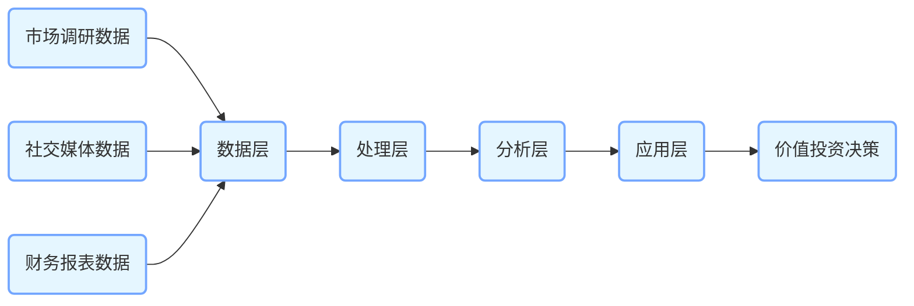

# 价值投资中的AI智能体品牌权益分析系统

> 关键词：价值投资、AI智能体、品牌权益、分析系统、机器学习、数据挖掘、金融科技

> 摘要：本文聚焦于价值投资领域中的AI智能体品牌权益分析系统。旨在深入探讨该系统的原理、架构、算法及应用。随着价值投资理念的不断发展以及人工智能技术的日益成熟，利用AI智能体对品牌权益进行分析成为了金融科技领域的重要研究方向。文章将详细阐述系统的核心概念、算法原理、数学模型，通过实际案例展示系统的应用，并推荐相关的工具和资源，最后对系统的未来发展趋势与挑战进行总结，以期为相关领域的研究者和从业者提供全面且深入的参考。

## 1. 背景介绍 
### 1.1 目的和范围
在价值投资中，品牌权益是企业重要的无形资产，对企业的长期价值和市场竞争力有着关键影响。传统的品牌权益分析方法往往依赖于主观判断和有限的数据，难以全面、准确地评估品牌的价值。本AI智能体品牌权益分析系统的目的在于利用先进的人工智能技术，整合多源数据，实现对品牌权益的客观、精准、高效分析，为价值投资者提供科学的决策依据。

本系统的范围涵盖了多个行业的品牌，包括但不限于消费品、科技、金融等领域。系统将处理来自市场调研、社交媒体、财务报表等多渠道的数据，综合考虑品牌的市场表现、消费者认知、财务状况等多个维度的因素，以全面评估品牌权益。

### 1.2 预期读者
本文的预期读者包括金融领域的投资者、投资分析师、品牌管理专家、人工智能领域的研究者和开发者，以及对金融科技和品牌价值分析感兴趣的相关人员。这些读者可能希望通过了解本系统，掌握利用AI技术进行品牌权益分析的方法和思路，为投资决策和品牌管理提供支持。

### 1.3 文档结构概述
本文将按照以下结构展开：首先介绍系统的背景，包括目的、预期读者和文档结构概述；接着阐述系统的核心概念与联系，包括核心概念的原理和架构，并通过文本示意图和Mermaid流程图进行展示；然后详细讲解系统的核心算法原理和具体操作步骤，使用Python源代码进行阐述；再介绍系统所涉及的数学模型和公式，并进行详细讲解和举例说明；之后通过项目实战展示系统的代码实际案例和详细解释说明；接着探讨系统的实际应用场景；推荐相关的工具和资源；最后总结系统的未来发展趋势与挑战，提供常见问题与解答以及扩展阅读和参考资料。

### 1.4 术语表
#### 1.4.1 核心术语定义
- **价值投资**：一种投资策略，基于对企业内在价值的评估，寻找被低估的股票进行投资，以获取长期的投资回报。
- **AI智能体**：一种能够感知环境、做出决策并采取行动的人工智能实体，在本系统中用于对品牌权益相关数据进行分析和处理。
- **品牌权益**：品牌所拥有的、能够为企业带来经济利益的无形资产，包括品牌知名度、美誉度、忠诚度等多个方面。
- **分析系统**：一系列软件和算法的集合，用于对特定的数据进行收集、处理、分析和输出结果，本系统旨在对品牌权益进行分析。

#### 1.4.2 相关概念解释
- **多源数据**：来自不同渠道和数据源的数据，如市场调研数据、社交媒体数据、财务报表数据等。本系统将整合这些多源数据，以全面评估品牌权益。
- **机器学习**：人工智能的一个分支，通过让计算机从数据中学习模式和规律，从而实现预测和决策。本系统将利用机器学习算法对品牌权益进行分析。
- **数据挖掘**：从大量数据中发现有价值信息和知识的过程。在本系统中，数据挖掘技术将用于从多源数据中提取与品牌权益相关的特征和信息。

#### 1.4.3 缩略词列表
- **AI**：Artificial Intelligence，人工智能
- **ML**：Machine Learning，机器学习
- **NLP**：Natural Language Processing，自然语言处理
- **PCA**：Principal Component Analysis，主成分分析

## 2. 核心概念与联系 

### 核心概念原理
本系统的核心概念包括价值投资、AI智能体和品牌权益。价值投资强调对企业内在价值的评估，而品牌权益作为企业的重要无形资产，对企业的内在价值有着重要影响。AI智能体则是实现对品牌权益分析的工具，通过对多源数据的收集、处理和分析，挖掘品牌权益的相关信息，为价值投资决策提供支持。

品牌权益的评估涉及多个维度，包括品牌知名度、美誉度、忠诚度等。这些维度相互关联，共同构成了品牌的整体价值。AI智能体通过对多源数据的分析，提取与这些维度相关的特征，利用机器学习算法进行建模和预测，从而实现对品牌权益的量化评估。

### 架构的文本示意图
本系统的架构主要包括数据层、处理层、分析层和应用层。

数据层：负责收集来自市场调研、社交媒体、财务报表等多渠道的原始数据。这些数据包括文本数据、数值数据等多种类型。

处理层：对收集到的原始数据进行清洗、预处理和特征提取。清洗过程去除数据中的噪声和异常值，预处理包括数据归一化、编码等操作，特征提取则从数据中提取与品牌权益相关的关键特征。

分析层：利用机器学习算法对处理后的数据进行建模和分析。常用的算法包括回归分析、分类算法、聚类算法等。通过这些算法，系统可以对品牌权益进行量化评估，并预测品牌的未来发展趋势。

应用层：将分析结果以可视化的方式呈现给用户，为价值投资者提供决策支持。用户可以根据分析结果进行投资决策，评估品牌的投资价值。

### Mermaid流程图


## 3. 核心算法原理 & 具体操作步骤 

### 核心算法原理
本系统主要使用机器学习算法进行品牌权益分析，其中包括回归分析和分类算法。

#### 回归分析
回归分析用于建立品牌权益与相关特征之间的定量关系。假设我们有一组特征变量 $X = [x_1, x_2, \cdots, x_n]$ 和对应的品牌权益值 $y$，回归分析的目标是找到一个函数 $f(X)$，使得 $y$ 与 $f(X)$ 之间的误差最小。常用的回归算法包括线性回归、岭回归、Lasso回归等。

线性回归的模型可以表示为：
$$y = \beta_0 + \beta_1x_1 + \beta_2x_2 + \cdots + \beta_nx_n + \epsilon$$
其中，$\beta_0, \beta_1, \cdots, \beta_n$ 是模型的参数，$\epsilon$ 是误差项。

#### 分类算法
分类算法用于将品牌分为不同的类别，如高价值品牌、中价值品牌和低价值品牌。常用的分类算法包括逻辑回归、决策树、支持向量机等。

逻辑回归的模型可以表示为：
$$P(y = 1|X) = \frac{1}{1 + e^{-(\beta_0 + \beta_1x_1 + \beta_2x_2 + \cdots + \beta_nx_n)}}$$
其中，$P(y = 1|X)$ 表示在特征 $X$ 下品牌属于某一类别的概率。

### 具体操作步骤
#### 数据收集
从市场调研机构、社交媒体平台、金融数据库等渠道收集与品牌相关的数据。这些数据包括品牌的市场份额、消费者评价、财务指标等。

#### 数据预处理
1. 数据清洗：去除数据中的噪声和异常值，如缺失值、重复值等。
2. 数据归一化：将不同尺度的特征数据进行归一化处理，使得所有特征具有相同的尺度。
3. 特征提取：从原始数据中提取与品牌权益相关的关键特征，如品牌知名度、美誉度等。

#### 模型训练
1. 划分数据集：将预处理后的数据划分为训练集和测试集，一般按照70%:30%的比例进行划分。
2. 选择模型：根据问题的特点选择合适的机器学习模型，如线性回归、逻辑回归等。
3. 模型训练：使用训练集对选择的模型进行训练，调整模型的参数，使得模型的性能最优。

#### 模型评估
使用测试集对训练好的模型进行评估，常用的评估指标包括均方误差（MSE）、准确率、召回率等。根据评估结果，对模型进行优化和调整。

#### 预测与应用
使用训练好的模型对新的品牌数据进行预测，得到品牌的权益评估结果。将评估结果以可视化的方式呈现给用户，为价值投资决策提供支持。

### Python源代码实现
```python
import pandas as pd
from sklearn.model_selection import train_test_split
from sklearn.linear_model import LinearRegression
from sklearn.metrics import mean_squared_error
import numpy as np

# 数据收集与预处理
# 假设已经收集到了包含品牌特征和品牌权益值的数据集
data = pd.read_csv('brand_data.csv')
X = data.drop('brand_equity', axis=1)  # 特征变量
y = data['brand_equity']  # 品牌权益值

# 数据划分
X_train, X_test, y_train, y_test = train_test_split(X, y, test_size=0.3, random_state=42)

# 模型训练
model = LinearRegression()
model.fit(X_train, y_train)

# 模型预测
y_pred = model.predict(X_test)

# 模型评估
mse = mean_squared_error(y_test, y_pred)
rmse = np.sqrt(mse)
print(f"均方误差: {mse}")
print(f"均方根误差: {rmse}")
```

## 4. 数学模型和公式 & 详细讲解 & 举例说明 

### 回归分析的数学模型和公式
#### 线性回归
线性回归的目标是找到一组参数 $\beta = [\beta_0, \beta_1, \cdots, \beta_n]$，使得预测值 $\hat{y}$ 与真实值 $y$ 之间的误差最小。误差通常使用均方误差（MSE）来衡量，定义为：
$$MSE = \frac{1}{m}\sum_{i = 1}^{m}(y_i - \hat{y}_i)^2$$
其中，$m$ 是样本数量，$y_i$ 是第 $i$ 个样本的真实值，$\hat{y}_i$ 是第 $i$ 个样本的预测值。

为了最小化均方误差，我们可以使用最小二乘法。最小二乘法的原理是通过求解以下正规方程来得到参数 $\beta$ 的最优解：
$$\beta = (X^TX)^{-1}X^Ty$$
其中，$X$ 是特征矩阵，$y$ 是真实值向量。

#### 举例说明
假设我们有一个简单的线性回归问题，特征变量 $X = [1, 2, 3, 4, 5]$，对应的真实值 $y = [2, 4, 6, 8, 10]$。我们可以使用最小二乘法来求解参数 $\beta$。

首先，将特征矩阵 $X$ 扩展为包含截距项的矩阵：
$$X = \begin{bmatrix}
1 & 1 \\
1 & 2 \\
1 & 3 \\
1 & 4 \\
1 & 5
\end{bmatrix}$$

然后，计算 $X^TX$ 和 $X^Ty$：
$$X^TX = \begin{bmatrix}
5 & 15 \\
15 & 55
\end{bmatrix}$$
$$X^Ty = \begin{bmatrix}
30 \\
110
\end{bmatrix}$$

接着，求解正规方程 $(X^TX)^{-1}X^Ty$：
$$(X^TX)^{-1} = \frac{1}{5\times55 - 15\times15}\begin{bmatrix}
55 & -15 \\
-15 & 5
\end{bmatrix} = \begin{bmatrix}
0.22 & -0.06 \\
-0.06 & 0.02
\end{bmatrix}$$
$$\beta = (X^TX)^{-1}X^Ty = \begin{bmatrix}
0.22 & -0.06 \\
-0.06 & 0.02
\end{bmatrix}\begin{bmatrix}
30 \\
110
\end{bmatrix} = \begin{bmatrix}
0 \\
2
\end{bmatrix}$$

因此，线性回归模型为 $\hat{y} = 0 + 2x$，与真实的线性关系 $y = 2x$ 一致。

### 分类算法的数学模型和公式
#### 逻辑回归
逻辑回归是一种常用的分类算法，用于处理二分类问题。逻辑回归的核心是逻辑函数，也称为Sigmoid函数，定义为：
$$\sigma(z) = \frac{1}{1 + e^{-z}}$$
其中，$z$ 是线性组合 $z = \beta_0 + \beta_1x_1 + \beta_2x_2 + \cdots + \beta_nx_n$。

逻辑回归的目标是找到一组参数 $\beta$，使得模型对样本的分类概率最大。通常使用对数似然函数来衡量模型的性能，对数似然函数定义为：
$$L(\beta) = \sum_{i = 1}^{m}[y_i\log(\sigma(z_i)) + (1 - y_i)\log(1 - \sigma(z_i))]$$
其中，$y_i$ 是第 $i$ 个样本的真实标签，$\sigma(z_i)$ 是第 $i$ 个样本的预测概率。

为了最大化对数似然函数，我们可以使用梯度下降法来更新参数 $\beta$。梯度下降法的更新公式为：
$$\beta_{j} = \beta_{j} + \alpha\frac{\partial L(\beta)}{\partial \beta_{j}}$$
其中，$\alpha$ 是学习率，$\frac{\partial L(\beta)}{\partial \beta_{j}}$ 是对数似然函数关于参数 $\beta_j$ 的偏导数。

#### 举例说明
假设我们有一个二分类问题，特征变量 $X = [1, 2, 3, 4, 5]$，对应的真实标签 $y = [0, 0, 1, 1, 1]$。我们可以使用逻辑回归来进行分类。

首先，初始化参数 $\beta = [0, 0]$，学习率 $\alpha = 0.1$。

然后，计算线性组合 $z = \beta_0 + \beta_1x$ 和预测概率 $\sigma(z)$。

接着，计算对数似然函数 $L(\beta)$ 和偏导数 $\frac{\partial L(\beta)}{\partial \beta_{j}}$。

最后，使用梯度下降法更新参数 $\beta$，直到对数似然函数收敛。

通过多次迭代，我们可以得到最优的参数 $\beta$，从而实现对样本的分类。

## 5. 项目实战：代码实际案例和详细解释说明 

### 5.1  开发环境搭建
#### 操作系统
本项目可以在Windows、Linux或macOS等主流操作系统上进行开发。建议使用Linux或macOS，因为它们对Python和相关开发工具的支持更好。

#### Python环境
安装Python 3.7及以上版本。可以从Python官方网站（https://www.python.org/downloads/） 下载安装包进行安装。

#### 开发工具
推荐使用Anaconda作为Python的开发环境管理工具。Anaconda可以方便地管理Python包和虚拟环境。可以从Anaconda官方网站（https://www.anaconda.com/products/individual） 下载安装包进行安装。

#### 安装必要的Python库
在Anaconda环境中，使用以下命令安装必要的Python库：
```bash
pip install pandas numpy scikit-learn matplotlib seaborn
```

### 5.2  源代码详细实现和代码解读
```python
import pandas as pd
import numpy as np
from sklearn.model_selection import train_test_split
from sklearn.linear_model import LinearRegression
from sklearn.metrics import mean_squared_error
import matplotlib.pyplot as plt
import seaborn as sns

# 数据加载
data = pd.read_csv('brand_data.csv')

# 数据探索性分析
# 查看数据基本信息
print('数据基本信息：')
data.info()

# 查看数据集行数和列数
rows, columns = data.shape

if rows < 30:
    # 小样本数据（行数少于30）查看全量数据信息
    print('数据全部内容信息：')
    print(data.to_csv(sep='\t', na_rep='nan'))
else:
    # 大样本数据查看数据前几行信息
    print('数据前几行内容信息：')
    print(data.head().to_csv(sep='\t', na_rep='nan'))

# 查看数据集行数和列数
rows, columns = data.shape

if columns < 10 and rows < 30:
    # 小维度小样本数据（列数少于10且行数少于30）查看全量数据相关性信息
    print('数据全部内容相关性信息：')
    print(data.corr().to_csv(sep='\t', na_rep='nan'))
elif columns < 10:
    # 小维度大样本数据查看数据前几行相关性信息
    print('数据前几行内容相关性信息：')
    print(data.head().corr().to_csv(sep='\t', na_rep='nan'))
elif rows < 30:
    # 大维度小样本数据查看全量数据相关性信息
    print('数据全部内容相关性信息：')
    print(data.corr().to_csv(sep='\t', na_rep='nan'))
else:
    # 大维度大样本数据查看数据前几行相关性信息
    print('数据前几行内容相关性信息：')
    print(data.head().corr().to_csv(sep='\t', na_rep='nan'))

# 绘制相关性分析热力图
plt.figure(figsize=(12, 10))
sns.heatmap(data.corr(), annot=True, cmap='coolwarm')
plt.title('相关性分析热力图')
plt.show()

# 数据预处理
# 提取特征变量和目标变量
X = data.drop('brand_equity', axis=1)
y = data['brand_equity']

# 划分训练集和测试集
X_train, X_test, y_train, y_test = train_test_split(X, y, test_size=0.3, random_state=42)

# 模型训练
model = LinearRegression()
model.fit(X_train, y_train)

# 模型预测
y_pred = model.predict(X_test)

# 模型评估
mse = mean_squared_error(y_test, y_pred)
rmse = np.sqrt(mse)
print(f"均方误差: {mse}")
print(f"均方根误差: {rmse}")

# 可视化预测结果
plt.figure(figsize=(10, 6))
plt.scatter(y_test, y_pred)
plt.xlabel('真实值')
plt.ylabel('预测值')
plt.title('真实值 vs 预测值')
plt.show()
```

### 5.3  代码解读与分析
#### 数据加载
使用 `pandas` 库的 `read_csv` 函数加载包含品牌特征和品牌权益值的数据集。

#### 数据探索性分析
- `data.info()`：查看数据的基本信息，包括数据类型、缺失值等。
- 根据数据集的行数和列数，选择查看全量数据信息或前几行数据信息，并输出数据的相关性信息。
- 使用 `seaborn` 库的 `heatmap` 函数绘制相关性分析热力图，直观地展示特征之间的相关性。

#### 数据预处理
- 提取特征变量 `X` 和目标变量 `y`。
- 使用 `train_test_split` 函数将数据集划分为训练集和测试集，测试集占比为30%。

#### 模型训练
使用 `LinearRegression` 类创建线性回归模型，并使用训练集对模型进行训练。

#### 模型预测
使用训练好的模型对测试集进行预测，得到预测值 `y_pred`。

#### 模型评估
使用 `mean_squared_error` 函数计算均方误差（MSE），并计算均方根误差（RMSE），评估模型的性能。

#### 可视化预测结果
使用 `matplotlib` 库的 `scatter` 函数绘制真实值和预测值的散点图，直观地展示模型的预测效果。

## 6. 实际应用场景 
### 价值投资决策
投资者可以使用本系统对不同品牌的权益进行评估，筛选出具有投资价值的品牌。通过分析品牌的市场表现、消费者认知、财务状况等多个维度的因素，投资者可以更准确地评估品牌的内在价值，从而做出更明智的投资决策。

### 品牌管理
品牌管理者可以利用本系统了解品牌的优势和劣势，制定针对性的品牌营销策略。通过对品牌知名度、美誉度、忠诚度等指标的监测和分析，品牌管理者可以及时发现品牌存在的问题，并采取相应的措施进行改进，提升品牌的市场竞争力。

### 市场竞争分析
企业可以使用本系统对竞争对手的品牌权益进行评估，了解竞争对手的优势和劣势。通过对比分析不同品牌的权益值，企业可以制定差异化的竞争策略，提高自身的市场份额。

### 行业研究
研究机构可以利用本系统对整个行业的品牌权益进行分析，了解行业的发展趋势和竞争格局。通过对行业内不同品牌的权益值进行排名和分析，研究机构可以为行业的发展提供参考和建议。

## 7. 工具和资源推荐
### 7.1 学习资源推荐
#### 7.1.1 书籍推荐
- 《Python数据分析实战》：介绍了使用Python进行数据分析的方法和技巧，包括数据清洗、数据可视化、机器学习等内容。
- 《机器学习》（周志华著）：全面介绍了机器学习的基本概念、算法和应用，是机器学习领域的经典教材。
- 《价值投资：从格雷厄姆到巴菲特》：详细阐述了价值投资的理论和方法，包括企业内在价值的评估、财务报表分析等内容。

#### 7.1.2 在线课程
- Coursera平台上的“机器学习”课程：由斯坦福大学教授Andrew Ng主讲，是机器学习领域的经典在线课程。
- edX平台上的“Python for Data Science”课程：介绍了使用Python进行数据分析的基本方法和技巧。
- 中国大学MOOC平台上的“金融数据分析与挖掘”课程：结合金融领域的实际案例，介绍了数据分析和挖掘的方法和应用。

#### 7.1.3 技术博客和网站
- Kaggle：全球最大的数据科学竞赛平台，提供了丰富的数据集、代码示例和技术博客。
- Medium：一个技术博客平台，有很多关于人工智能、数据分析和金融科技的优质文章。
- 知乎：一个知识问答社区，有很多关于价值投资、人工智能和品牌管理的讨论和分享。

### 7.2 开发工具框架推荐
#### 7.2.1 IDE和编辑器
- PyCharm：一款专业的Python集成开发环境，提供了丰富的代码编辑、调试和部署功能。
- Jupyter Notebook：一个交互式的开发环境，适合进行数据分析和模型训练的实验和演示。
- Visual Studio Code：一款轻量级的代码编辑器，支持多种编程语言和插件扩展。

#### 7.2.2 调试和性能分析工具
- PDB：Python自带的调试工具，可以帮助开发者定位和解决代码中的问题。
- cProfile：Python自带的性能分析工具，可以分析代码的运行时间和性能瓶颈。
- TensorBoard：TensorFlow的可视化工具，可以帮助开发者可视化模型的训练过程和性能指标。

#### 7.2.3 相关框架和库
- Pandas：一个强大的数据处理和分析库，提供了高效的数据结构和数据操作方法。
- NumPy：一个用于科学计算的基础库，提供了高效的数组操作和数学函数。
- Scikit-learn：一个常用的机器学习库，提供了丰富的机器学习算法和工具。
- TensorFlow：一个开源的深度学习框架，提供了高效的模型训练和部署功能。

### 7.3 相关论文著作推荐
#### 7.3.1 经典论文
- Fama, E. F., & French, K. R. (1992). The cross-section of expected stock returns. The Journal of Finance, 47(2), 427-465. 该论文提出了Fama-French三因子模型，用于解释股票收益率的横截面差异。
- Aaker, D. A. (1991). Managing brand equity: capitalizing on the value of a brand name. Free Press. 该著作系统地阐述了品牌权益的概念、评估方法和管理策略。

#### 7.3.2 最新研究成果
- 关注顶级金融期刊和人工智能期刊，如The Journal of Finance、Journal of Financial Economics、Artificial Intelligence等，了解价值投资和AI智能体品牌权益分析领域的最新研究成果。

#### 7.3.3 应用案例分析
- 研究金融机构和企业的实际应用案例，了解他们如何利用AI技术进行品牌权益分析和价值投资决策。可以通过查阅企业的年报、研究报告和新闻资讯等获取相关信息。

## 8. 总结：未来发展趋势与挑战
### 未来发展趋势
#### 多模态数据融合
未来的AI智能体品牌权益分析系统将融合更多类型的数据，包括图像、音频、视频等多模态数据。通过对多模态数据的分析，可以更全面、深入地了解品牌的市场表现和消费者认知，提高品牌权益评估的准确性。

#### 深度学习的应用
深度学习技术在自然语言处理、计算机视觉等领域取得了显著的成果。未来的系统将更多地应用深度学习算法，如卷积神经网络（CNN）、循环神经网络（RNN）等，对品牌相关的文本、图像等数据进行深度挖掘和分析，提高模型的性能和预测能力。

#### 实时分析与预测
随着数据的实时性要求越来越高，未来的系统将具备实时分析和预测的能力。通过对实时数据的处理和分析，系统可以及时发现品牌的变化趋势，为投资者和品牌管理者提供及时的决策支持。

#### 与区块链技术的结合
区块链技术具有去中心化、不可篡改、可追溯等特点。未来的系统可以与区块链技术相结合，确保品牌相关数据的真实性和安全性，提高品牌权益评估的可信度。

### 挑战
#### 数据质量和隐私问题
数据质量是影响系统性能的关键因素。由于品牌相关数据来源广泛，数据质量参差不齐，可能存在噪声、缺失值等问题。此外，数据隐私也是一个重要的问题，品牌相关数据涉及消费者的个人信息和企业的商业机密，需要采取有效的措施保护数据的隐私和安全。

#### 算法的可解释性
AI算法，尤其是深度学习算法，通常被视为“黑盒”模型，其决策过程难以解释。在价值投资和品牌管理领域，算法的可解释性非常重要，投资者和品牌管理者需要了解模型的决策依据，以便做出合理的决策。因此，如何提高算法的可解释性是未来需要解决的一个重要问题。

#### 技术人才短缺
开发和应用AI智能体品牌权益分析系统需要具备跨领域的技术人才，包括人工智能、金融、市场营销等领域的专业知识。目前，这类技术人才相对短缺，制约了系统的发展和应用。因此，培养和吸引跨领域的技术人才是未来的一个重要任务。

## 9. 附录：常见问题与解答
### 1. 系统对数据的要求是什么？
系统对数据的要求包括数据的准确性、完整性和一致性。数据应尽量准确地反映品牌的实际情况，避免噪声和异常值的影响。同时，数据应完整，包含与品牌权益相关的各个维度的信息。此外，数据的格式和编码应保持一致，以便进行统一的处理和分析。

### 2. 如何选择合适的机器学习模型？
选择合适的机器学习模型需要考虑问题的特点、数据的规模和类型等因素。对于回归问题，可以选择线性回归、岭回归、Lasso回归等模型；对于分类问题，可以选择逻辑回归、决策树、支持向量机等模型。此外，还可以使用模型选择和评估的方法，如交叉验证、网格搜索等，来选择最优的模型。

### 3. 系统的预测结果是否可靠？
系统的预测结果的可靠性取决于多个因素，包括数据的质量、模型的选择和训练、特征的提取等。为了提高预测结果的可靠性，需要对数据进行充分的预处理，选择合适的模型，并进行充分的模型训练和评估。同时，还可以结合专家的经验和判断，对预测结果进行综合分析和验证。

### 4. 如何保护数据的隐私和安全？
为了保护数据的隐私和安全，可以采取以下措施：
- 数据加密：对敏感数据进行加密处理，确保数据在传输和存储过程中的安全性。
- 访问控制：设置严格的访问权限，只有授权人员才能访问和处理数据。
- 匿名化处理：对数据进行匿名化处理，去除数据中的个人身份信息，保护消费者的隐私。
- 安全审计：定期对系统进行安全审计，及时发现和处理安全漏洞。

## 10. 扩展阅读 & 参考资料
### 扩展阅读
- 《人工智能：现代方法》：全面介绍了人工智能的基本概念、算法和应用，是人工智能领域的经典教材。
- 《品牌的起源》：从商业和营销的角度深入探讨了品牌的起源和发展，为品牌权益分析提供了理论基础。
- 《金融科技：重构未来金融生态》：介绍了金融科技的发展趋势和应用场景，包括人工智能在金融领域的应用。

### 参考资料
- 相关的学术论文和研究报告，如在IEEE、ACM等学术数据库中搜索关于价值投资、AI智能体和品牌权益分析的论文。
- 金融机构和企业的年报、研究报告和新闻资讯，了解他们在品牌权益分析和价值投资决策方面的实践和经验。
- 相关的技术文档和教程，如Python、Scikit-learn、TensorFlow等的官方文档和教程。