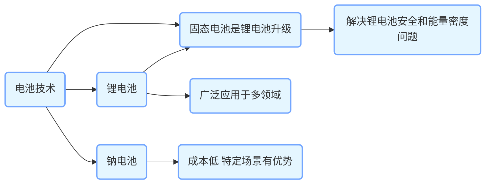

# 价值投资中的新一代电池技术分析

> 关键词：价值投资、新一代电池技术、锂电池、固态电池、钠电池、技术原理、市场前景

> 摘要：本文聚焦于价值投资视角下的新一代电池技术。随着全球对清洁能源和可持续发展的关注度不断提高，电池技术作为能源存储和转换的关键环节，其发展对于多个行业的变革具有重要意义。文章详细介绍了新一代电池技术的背景、核心概念、算法原理、数学模型，通过项目实战案例进行深入分析，探讨了其实际应用场景，推荐了相关学习工具和资源，最后总结了未来发展趋势与挑战，并提供常见问题解答和参考资料，旨在为投资者和技术爱好者全面了解新一代电池技术提供有价值的参考。

## 1. 背景介绍 
### 1.1 目的和范围
本文章的目的在于从价值投资的角度深入剖析新一代电池技术。随着电动汽车、可再生能源存储等领域的快速发展，电池技术的革新成为推动行业进步的关键因素。我们将研究范围涵盖多种新一代电池技术，包括但不限于锂电池的改进技术、固态电池、钠电池等，分析它们的技术原理、市场潜力以及投资价值。

### 1.2 预期读者
本文预期读者包括对价值投资感兴趣的投资者、电池技术领域的研究人员、相关行业的从业者以及关注清洁能源和科技发展的爱好者。投资者可以通过本文了解新一代电池技术的投资机会和风险，研究人员可以获取不同电池技术的详细原理和发展动态，从业者可以掌握行业最新趋势，爱好者则可以拓宽对电池技术的认知。

### 1.3 文档结构概述
本文首先介绍新一代电池技术的背景信息，包括目的、预期读者和文档结构。接着阐述核心概念与联系，展示其原理和架构。然后深入讲解核心算法原理和具体操作步骤，结合数学模型和公式进行详细说明。通过项目实战案例，分析代码实现和应用场景。之后推荐相关的学习工具和资源，包括书籍、在线课程、开发工具等。最后总结未来发展趋势与挑战，提供常见问题解答和参考资料。

### 1.4 术语表
#### 1.4.1 核心术语定义
- **价值投资**：一种基于对资产内在价值的评估，通过分析基本面因素，以低于其内在价值的价格买入资产，期望在长期内获得资产价值增长回报的投资策略。
- **新一代电池技术**：指在传统电池技术基础上，通过创新的材料、结构和制造工艺，具有更高能量密度、更长使用寿命、更好安全性和更低成本等优势的电池技术。
- **能量密度**：单位质量或单位体积的电池所存储的能量，通常用 Wh/kg（质量能量密度）或 Wh/L（体积能量密度）表示。
- **循环寿命**：电池在一定的充放电条件下，能够达到规定性能指标（如容量保持率）的充放电循环次数。

#### 1.4.2 相关概念解释
- **锂电池**：以锂金属或锂合金为负极材料，使用非水电解质溶液的电池。常见的有锂离子电池，具有能量密度高、自放电率低等优点。
- **固态电池**：采用固态电解质代替传统液态电解质的电池。固态电解质具有更高的安全性和稳定性，有望提高电池的能量密度和循环寿命。
- **钠电池**：以钠为电极活性物质的电池。钠资源丰富，成本较低，在某些应用场景下具有潜在优势。

#### 1.4.3 缩略词列表
- **LIB**：Lithium - Ion Battery，锂离子电池
- **SSB**：Solid - State Battery，固态电池
- **SIB**：Sodium - Ion Battery，钠电池

## 2. 核心概念与联系 

### 2.1 锂电池技术
锂电池是目前应用最为广泛的电池技术之一。其基本原理是基于锂离子在正负极之间的嵌入和脱嵌过程来实现电荷的存储和释放。锂电池的正极材料通常有钴酸锂（$LiCoO_2$）、锰酸锂（$LiMn_2O_4$）、磷酸铁锂（$LiFePO_4$）等，负极材料主要是石墨。

在充电过程中，锂离子从正极材料中脱嵌，经过电解质迁移到负极，嵌入负极材料的晶格中；放电过程则相反，锂离子从负极脱嵌，经过电解质回到正极。

### 2.2 固态电池技术
固态电池是锂电池技术的一种升级。它使用固态电解质代替传统的液态电解质，具有以下优点：
- **更高的安全性**：固态电解质不易燃、不挥发，能够有效避免电池起火、爆炸等安全问题。
- **更高的能量密度**：固态电解质可以与高能量密度的电极材料兼容，有望进一步提高电池的能量密度。
- **更长的循环寿命**：固态电解质能够抑制电极材料的副反应，减少电池的容量衰减，延长电池的使用寿命。

### 2.3 钠电池技术
钠电池与锂电池的工作原理相似，都是基于离子在正负极之间的迁移来实现电荷的存储和释放。钠电池的优势在于钠资源丰富，成本较低，在对成本敏感的应用场景中具有潜在的竞争力。

### 2.4 核心概念联系的文本示意图
锂电池是目前的主流技术，在电动汽车、消费电子等领域占据主导地位。固态电池是锂电池的未来发展方向，有望解决锂电池的安全性和能量密度等问题。钠电池则作为一种补充技术，在某些特定场景下可以发挥其成本优势。

### 2.5 Mermaid 流程图


## 3. 核心算法原理 & 具体操作步骤 

### 3.1 锂电池容量计算算法原理
锂电池的容量可以通过以下公式计算：
$Q = I \times t$
其中，$Q$ 表示电池的容量（单位：mAh），$I$ 表示充放电电流（单位：mA），$t$ 表示充放电时间（单位：h）。

以下是一个使用 Python 实现锂电池容量计算的示例代码：
```python
# 定义充放电电流（mA）
current = 100
# 定义充放电时间（h）
time = 2

# 计算电池容量
capacity = current * time

print(f"锂电池的容量为: {capacity} mAh")
```

### 3.2 固态电池电解质离子传导率计算算法原理
固态电池的性能很大程度上取决于固态电解质的离子传导率。离子传导率 $\sigma$ 可以通过以下公式计算：
$\sigma = \frac{L}{R \times A}$
其中，$L$ 表示电解质的厚度（单位：cm），$R$ 表示电解质的电阻（单位：$\Omega$），$A$ 表示电解质的横截面积（单位：$cm^2$）。

以下是一个使用 Python 实现固态电池电解质离子传导率计算的示例代码：
```python
# 定义电解质的厚度（cm）
thickness = 0.1
# 定义电解质的电阻（Ω）
resistance = 10
# 定义电解质的横截面积（cm²）
area = 1

# 计算离子传导率
conductivity = thickness / (resistance * area)

print(f"固态电池电解质的离子传导率为: {conductivity} S/cm")
```

### 3.3 钠电池充放电过程模拟算法原理
钠电池的充放电过程可以通过模拟钠离子在正负极之间的迁移来实现。以下是一个简化的钠电池充放电过程模拟的 Python 代码：
```python
# 定义钠电池初始状态
class SodiumBattery:
    def __init__(self, capacity):
        self.capacity = capacity
        self.current_charge = capacity

    def charge(self, current, time):
        charge_amount = current * time
        if self.current_charge + charge_amount > self.capacity:
            self.current_charge = self.capacity
        else:
            self.current_charge += charge_amount
        return self.current_charge

    def discharge(self, current, time):
        discharge_amount = current * time
        if self.current_charge - discharge_amount < 0:
            self.current_charge = 0
        else:
            self.current_charge -= discharge_amount
        return self.current_charge

# 创建钠电池实例
sodium_battery = SodiumBattery(1000)

# 充电过程
charge_current = 100
charge_time = 1
new_charge = sodium_battery.charge(charge_current, charge_time)
print(f"充电后电量: {new_charge} mAh")

# 放电过程
discharge_current = 200
discharge_time = 2
new_charge = sodium_battery.discharge(discharge_current, discharge_time)
print(f"放电后电量: {new_charge} mAh")
```

## 4. 数学模型和公式 & 详细讲解 & 举例说明 

### 4.1 锂电池能量密度计算
锂电池的能量密度 $E$ 可以通过以下公式计算：
$E = \frac{V \times Q}{m}$
其中，$V$ 表示电池的电压（单位：V），$Q$ 表示电池的容量（单位：mAh），$m$ 表示电池的质量（单位：g）。

举例说明：假设一个锂电池的电压为 3.7 V，容量为 2000 mAh，质量为 50 g。则该锂电池的能量密度为：
$E = \frac{3.7 \times 2000}{50} = 148 Wh/kg$

### 4.2 固态电池的电化学动力学模型
固态电池的电化学动力学过程可以用 Butler - Volmer 方程来描述：
$i = i_0 \left[ \exp\left( \frac{\alpha_a nF \eta}{RT} \right) - \exp\left( -\frac{\alpha_c nF \eta}{RT} \right) \right]$
其中，$i$ 表示电流密度（单位：$A/cm^2$），$i_0$ 表示交换电流密度（单位：$A/cm^2$），$\alpha_a$ 和 $\alpha_c$ 分别表示阳极和阴极的转移系数，$n$ 表示反应中转移的电子数，$F$ 是法拉第常数（$F = 96485 C/mol$），$\eta$ 表示过电位（单位：V），$R$ 是气体常数（$R = 8.314 J/(mol \cdot K)$），$T$ 是温度（单位：K）。

### 4.3 钠电池的容量衰减模型
钠电池的容量衰减可以用经验公式来描述：
$Q_t = Q_0 (1 - k)^t$
其中，$Q_t$ 表示经过 $t$ 次充放电循环后的电池容量，$Q_0$ 表示电池的初始容量，$k$ 表示容量衰减系数。

举例说明：假设一个钠电池的初始容量为 1000 mAh，容量衰减系数 $k = 0.01$，经过 100 次充放电循环后，电池的容量为：
$Q_{100} = 1000 \times (1 - 0.01)^{100} \approx 366 mAh$

## 5. 项目实战：代码实际案例和详细解释说明 

### 5.1  开发环境搭建
- **Python 环境**：推荐使用 Python 3.7 及以上版本。可以从 Python 官方网站（https://www.python.org/downloads/）下载并安装。
- **开发工具**：可以使用 PyCharm、Jupyter Notebook 等开发工具。PyCharm 是一款功能强大的 Python 集成开发环境，Jupyter Notebook 则适合进行交互式编程和数据分析。
- **相关库**：在本项目中，主要使用 Python 的内置库，无需额外安装其他库。

### 5.2  源代码详细实现和代码解读
以下是一个综合的电池管理系统模拟代码，包含锂电池、固态电池和钠电池的基本操作：
```python
# 定义锂电池类
class LithiumBattery:
    def __init__(self, voltage, capacity, mass):
        self.voltage = voltage
        self.capacity = capacity
        self.mass = mass

    def get_energy_density(self):
        return (self.voltage * self.capacity) / self.mass

# 定义固态电池类
class SolidStateBattery:
    def __init__(self, thickness, resistance, area):
        self.thickness = thickness
        self.resistance = resistance
        self.area = area

    def get_ionic_conductivity(self):
        return self.thickness / (self.resistance * self.area)

# 定义钠电池类
class SodiumBattery:
    def __init__(self, capacity):
        self.capacity = capacity
        self.current_charge = capacity

    def charge(self, current, time):
        charge_amount = current * time
        if self.current_charge + charge_amount > self.capacity:
            self.current_charge = self.capacity
        else:
            self.current_charge += charge_amount
        return self.current_charge

    def discharge(self, current, time):
        discharge_amount = current * time
        if self.current_charge - discharge_amount < 0:
            self.current_charge = 0
        else:
            self.current_charge -= discharge_amount
        return self.current_charge

# 创建锂电池实例
lithium_battery = LithiumBattery(3.7, 2000, 50)
print(f"锂电池能量密度: {lithium_battery.get_energy_density()} Wh/kg")

# 创建固态电池实例
solid_state_battery = SolidStateBattery(0.1, 10, 1)
print(f"固态电池电解质离子传导率: {solid_state_battery.get_ionic_conductivity()} S/cm")

# 创建钠电池实例
sodium_battery = SodiumBattery(1000)
charge_current = 100
charge_time = 1
new_charge = sodium_battery.charge(charge_current, charge_time)
print(f"钠电池充电后电量: {new_charge} mAh")
discharge_current = 200
discharge_time = 2
new_charge = sodium_battery.discharge(discharge_current, discharge_time)
print(f"钠电池放电后电量: {new_charge} mAh")
```

### 5.3  代码解读与分析
- **LithiumBattery 类**：该类表示锂电池，包含电压、容量和质量三个属性。`get_energy_density` 方法用于计算锂电池的能量密度。
- **SolidStateBattery 类**：该类表示固态电池，包含电解质厚度、电阻和横截面积三个属性。`get_ionic_conductivity` 方法用于计算固态电池电解质的离子传导率。
- **SodiumBattery 类**：该类表示钠电池，包含容量和当前电量两个属性。`charge` 方法用于模拟钠电池的充电过程，`discharge` 方法用于模拟钠电池的放电过程。

通过创建不同电池类的实例，并调用相应的方法，可以实现对不同类型电池的基本操作和性能计算。

## 6. 实际应用场景 
### 6.1 电动汽车领域
锂电池目前是电动汽车的主流动力源，其高能量密度和良好的循环性能满足了电动汽车对续航里程和使用寿命的要求。固态电池由于其更高的安全性和能量密度，被认为是未来电动汽车电池的发展方向。钠电池在一些对成本敏感的电动汽车应用场景中，如低速电动车、商用车等，具有潜在的应用前景。

### 6.2 可再生能源存储领域
在太阳能、风能等可再生能源发电系统中，电池技术用于存储多余的电能，以保证电力的稳定输出。锂电池和固态电池可以作为储能系统的关键组件，提高可再生能源的利用效率。钠电池由于其成本优势，也可以在大规模储能项目中发挥作用。

### 6.3 消费电子领域
锂电池广泛应用于智能手机、平板电脑、笔记本电脑等消费电子产品中，为其提供可靠的电源。随着消费电子产品对电池性能要求的不断提高，固态电池有望逐步取代锂电池，成为未来消费电子领域的主流电池技术。

### 6.4 智能电网领域
在智能电网中，电池储能系统可以用于调节电网的峰谷负荷，提高电网的稳定性和可靠性。锂电池、固态电池和钠电池都可以作为智能电网储能系统的候选技术，根据不同的应用需求和成本考虑进行选择。

## 7. 工具和资源推荐
### 7.1 学习资源推荐
#### 7.1.1 书籍推荐
- 《电池电化学》：全面介绍了电池的基本原理、电化学过程和电池技术的发展。
- 《锂离子电池：科学与技术》：深入探讨了锂离子电池的材料、结构、性能和应用。
- 《固态电池技术》：专注于固态电池的研究进展、技术挑战和应用前景。

#### 7.1.2 在线课程
- Coursera 上的“电池技术基础”课程：由知名大学的教授授课，系统介绍了电池技术的基本概念和原理。
- edX 上的“储能系统与应用”课程：涵盖了电池储能系统的设计、运行和管理等方面的知识。

#### 7.1.3 技术博客和网站
- 中国电池网（https://www.chinabattery.com/）：提供电池行业的最新动态、技术资讯和市场分析。
- 电池中国网（https://www.batterychina.com/）：专注于电池技术的研究和应用，发布相关的研究成果和行业报告。

### 7.2 开发工具框架推荐
#### 7.2.1 IDE和编辑器
- PyCharm：功能强大的 Python 集成开发环境，提供代码编辑、调试、版本控制等功能。
- Jupyter Notebook：交互式编程环境，适合进行数据分析、模型开发和代码演示。

#### 7.2.2 调试和性能分析工具
- PDB：Python 内置的调试工具，可以帮助开发者定位代码中的错误。
- cProfile：Python 的性能分析工具，用于分析代码的运行时间和资源消耗。

#### 7.2.3 相关框架和库
- NumPy：用于科学计算的 Python 库，提供高效的数组操作和数学函数。
- Pandas：用于数据处理和分析的 Python 库，提供数据结构和数据分析工具。

### 7.3 相关论文著作推荐
#### 7.3.1 经典论文
- "Li - ion Batteries: State of the Art and Future Perspectives"：对锂离子电池的发展现状和未来趋势进行了全面的综述。
- "Solid - State Batteries: A Mini Review"：介绍了固态电池的基本原理、技术挑战和研究进展。

#### 7.3.2 最新研究成果
- 关注《Nature Energy》、《Journal of Power Sources》等顶级能源期刊，获取电池技术领域的最新研究成果。

#### 7.3.3 应用案例分析
- 参考电动汽车制造商和储能系统集成商的技术报告和案例研究，了解电池技术在实际应用中的性能和效果。

## 8. 总结：未来发展趋势与挑战
### 8.1 未来发展趋势
- **技术创新加速**：随着材料科学、电化学等领域的不断发展，新一代电池技术将不断取得突破。固态电池有望在未来几年内实现商业化应用，钠电池的性能也将不断提高。
- **应用领域拓展**：除了电动汽车、可再生能源存储和消费电子等领域，电池技术还将在航空航天、海洋开发等高端领域得到应用。
- **产业整合加剧**：电池行业将面临激烈的市场竞争，大型企业将通过并购、合作等方式整合资源，提高市场竞争力。

### 8.2 挑战
- **技术难题**：固态电池的电解质界面稳定性、钠电池的循环寿命等技术问题仍然需要进一步解决。
- **成本压力**：新一代电池技术的研发和生产成本较高，如何降低成本是实现大规模应用的关键。
- **安全问题**：电池的安全性是制约其发展的重要因素，需要加强电池的安全设计和管理。

## 9. 附录：常见问题与解答
### 9.1 新一代电池技术与传统电池技术相比有哪些优势？
新一代电池技术具有更高的能量密度、更长的循环寿命、更好的安全性和更低的成本等优势。例如，固态电池使用固态电解质，避免了传统锂电池液态电解质的易燃、易泄漏等问题，提高了电池的安全性。

### 9.2 固态电池何时能够实现大规模商业化应用？
固态电池的大规模商业化应用时间目前还不确定。虽然固态电池在技术上取得了一定的进展，但仍然面临一些技术挑战，如电解质界面稳定性、大规模生产工艺等。预计在未来 5 - 10 年内，固态电池有望逐步实现商业化应用。

### 9.3 钠电池能否完全取代锂电池？
钠电池和锂电池各有优缺点，钠电池在成本方面具有优势，但在能量密度和循环寿命等方面与锂电池存在一定差距。因此，钠电池不太可能完全取代锂电池，而是在某些特定应用场景中与锂电池形成互补。

## 10. 扩展阅读 & 参考资料
### 10.1 扩展阅读
- 关注行业论坛和研讨会，了解电池技术领域的最新动态和前沿研究。
- 参与电池技术相关的开源项目，实践和学习最新的技术。

### 10.2 参考资料
- 各电池制造商的官方网站和技术文档。
- 行业协会发布的研究报告和统计数据。
- 相关学术期刊和会议论文。