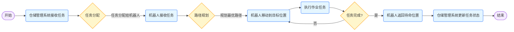

# 价值投资中的智能仓储机器人协作系统分析

> 关键词：价值投资、智能仓储机器人、协作系统、物流效率、投资回报、仓储管理、机器人技术

> 摘要：本文聚焦于价值投资视角下的智能仓储机器人协作系统。首先介绍了该系统在当前物流仓储行业的背景与重要性，阐述其相关核心概念与联系，深入剖析核心算法原理并给出具体操作步骤。通过数学模型和公式对系统的运行效率等进行量化分析，并结合实际案例展示系统的实现与应用。探讨了该系统在不同场景下的实际应用，推荐了相关学习资源、开发工具框架以及论文著作。最后总结其未来发展趋势与挑战，为投资者和从业者在价值投资与智能仓储机器人协作系统的研究和实践提供全面且深入的参考。

## 1. 背景介绍 
### 1.1 目的和范围
在当今快速发展的物流与电商行业中，仓储管理的效率和成本控制成为企业竞争的关键因素。智能仓储机器人协作系统作为一种新兴的技术解决方案，旨在提高仓储作业的自动化程度、准确性和效率。本文章的目的在于从价值投资的角度全面分析智能仓储机器人协作系统，研究其技术原理、应用场景、投资价值以及未来发展趋势。范围涵盖了该系统的核心概念、算法原理、数学模型、实际案例以及相关的工具和资源等方面。

### 1.2 预期读者
本文预期读者包括对价值投资感兴趣的投资者，他们希望了解智能仓储机器人协作系统的投资潜力和风险；物流与仓储行业的从业者，如仓库管理人员、物流规划师等，他们可以从技术和应用的角度深入了解该系统，以优化仓储管理流程；计算机科学与机器人技术领域的研究人员和开发者，他们可以从系统的算法、架构等方面获取技术灵感和参考；以及相关专业的学生，作为学习和研究的参考资料。

### 1.3 文档结构概述
本文将按照以下结构展开：首先介绍智能仓储机器人协作系统的背景信息，包括目的、预期读者和文档结构概述等。接着阐述该系统的核心概念与联系，通过文本示意图和 Mermaid 流程图进行详细说明。然后深入分析核心算法原理，并给出具体的操作步骤，同时使用 Python 源代码进行阐述。之后介绍相关的数学模型和公式，并结合实际例子进行讲解。通过项目实战部分展示代码实际案例并进行详细解释说明。探讨该系统在不同场景下的实际应用。推荐相关的学习资源、开发工具框架以及论文著作。最后总结其未来发展趋势与挑战，并提供常见问题与解答以及扩展阅读和参考资料。

### 1.4 术语表
#### 1.4.1 核心术语定义
- **智能仓储机器人**：具备自主导航、识别、搬运等功能的机器人设备，能够在仓储环境中自动执行货物存储、搬运等任务。
- **协作系统**：指多个智能仓储机器人之间通过通信和协调机制，共同完成仓储作业任务的系统。
- **价值投资**：一种投资策略，通过对资产的内在价值进行评估，寻找被低估的投资对象，以获取长期的投资回报。
- **仓储管理**：对仓库内货物的存储、搬运、出入库等活动进行计划、组织、控制和协调的过程。
- **物流效率**：衡量物流活动中资源利用和任务完成速度的指标，包括货物的存储、搬运、配送等环节的效率。

#### 1.4.2 相关概念解释
- **自主导航**：智能仓储机器人能够根据环境信息和任务要求，自动规划路径并移动到目标位置的能力。
- **任务分配**：协作系统根据机器人的状态、任务优先级等因素，将仓储作业任务合理分配给不同机器人的过程。
- **路径规划**：为机器人规划从当前位置到目标位置的最优路径，以提高作业效率和避免碰撞。
- **通信协议**：机器人之间以及机器人与管理系统之间进行信息传输和交互的规则和标准。

#### 1.4.3 缩略词列表
- **AGV**：Automated Guided Vehicle，自动导引车，是一种常见的智能仓储机器人类型。
- **WMS**：Warehouse Management System，仓储管理系统，用于管理仓库内的货物和作业流程。
- **ROS**：Robot Operating System，机器人操作系统，为机器人开发提供了软件框架和工具。

## 2. 核心概念与联系 
智能仓储机器人协作系统主要由智能仓储机器人、通信网络、管理系统和仓储环境等部分组成。其核心概念包括机器人的自主导航、任务分配、路径规划和协作机制等。

### 核心概念原理和架构的文本示意图
智能仓储机器人协作系统的架构可以分为三层：感知层、决策层和执行层。感知层主要由机器人的传感器组成，如激光雷达、摄像头等，用于获取环境信息和货物信息。决策层包括管理系统和机器人的控制算法，负责任务分配、路径规划和协作协调等决策。执行层则是机器人的执行机构，如驱动电机、机械臂等，用于执行具体的作业任务。

### Mermaid 流程图


在这个流程图中，首先仓储管理系统接收任务，然后进行任务分配，将任务分配给合适的机器人。机器人接收任务后进行路径规划，移动到目标位置执行作业任务。在任务执行过程中，不断判断任务是否完成，如果未完成则继续执行任务，直到任务完成后返回待命位置，仓储管理系统更新任务状态，整个流程结束。

## 3. 核心算法原理 & 具体操作步骤 
### 任务分配算法原理
任务分配是智能仓储机器人协作系统中的关键环节，其目标是将仓储作业任务合理分配给不同的机器人，以提高系统的整体效率。一种常见的任务分配算法是基于匈牙利算法的任务分配算法。

匈牙利算法是一种用于解决指派问题的经典算法，其基本思想是通过寻找最优的任务分配方案，使得总任务成本最小。在智能仓储机器人协作系统中，任务成本可以定义为机器人到达任务位置的时间、任务执行时间等因素的综合。

### Python 源代码实现
```python
import numpy as np
from scipy.optimize import linear_sum_assignment

def task_allocation(cost_matrix):
    """
    基于匈牙利算法的任务分配函数
    :param cost_matrix: 任务成本矩阵，每行表示一个机器人，每列表示一个任务
    :return: 分配结果，包括机器人索引和任务索引
    """
    row_ind, col_ind = linear_sum_assignment(cost_matrix)
    return row_ind, col_ind

# 示例使用
cost_matrix = np.array([[3, 5, 2], [4, 1, 6], [2, 7, 3]])
robot_indices, task_indices = task_allocation(cost_matrix)

print("机器人索引:", robot_indices)
print("任务索引:", task_indices)
```
### 代码解释
- `cost_matrix` 是一个二维数组，表示每个机器人执行每个任务的成本。
- `linear_sum_assignment` 函数是 `scipy.optimize` 库中的函数，用于求解匈牙利算法的最优解。
- `row_ind` 和 `col_ind` 分别表示机器人的索引和任务的索引，它们一一对应，表示每个机器人分配到的任务。

### 路径规划算法原理
路径规划的目标是为机器人规划从当前位置到目标位置的最优路径，同时避免与其他机器人和障碍物发生碰撞。一种常见的路径规划算法是 A* 算法。

A* 算法是一种启发式搜索算法，它结合了 Dijkstra 算法的最优性和贪心最佳优先搜索算法的高效性。A* 算法通过维护一个开放列表和一个关闭列表，不断扩展开放列表中的节点，直到找到目标节点。

### Python 源代码实现
```python
import heapq

def heuristic(a, b):
    """
    启发式函数，计算两个节点之间的曼哈顿距离
    :param a: 节点 a 的坐标
    :param b: 节点 b 的坐标
    :return: 曼哈顿距离
    """
    return abs(a[0] - b[0]) + abs(a[1] - b[1])

def a_star(graph, start, goal):
    """
    A* 路径规划算法
    :param graph: 地图信息，二维数组，0 表示可通行，1 表示障碍物
    :param start: 起点坐标
    :param goal: 终点坐标
    :return: 路径列表
    """
    neighbors = [(0, 1), (0, -1), (1, 0), (-1, 0)]
    close_set = set()
    came_from = {}
    gscore = {start: 0}
    fscore = {start: heuristic(start, goal)}
    oheap = []

    heapq.heappush(oheap, (fscore[start], start))

    while oheap:
        current = heapq.heappop(oheap)[1]

        if current == goal:
            data = []
            while current in came_from:
                data.append(current)
                current = came_from[current]
            return data[::-1]

        close_set.add(current)
        for i, j in neighbors:
            neighbor = current[0] + i, current[1] + j
            tentative_g_score = gscore[current] + heuristic(current, neighbor)
            if 0 <= neighbor[0] < len(graph):
                if 0 <= neighbor[1] < len(graph[0]):
                    if graph[neighbor[0]][neighbor[1]] == 1:
                        continue
                else:
                    # 越界
                    continue
            else:
                # 越界
                continue

            if neighbor in close_set and tentative_g_score >= gscore.get(neighbor, 0):
                continue

            if tentative_g_score < gscore.get(neighbor, 0) or neighbor not in [i[1] for i in oheap]:
                came_from[neighbor] = current
                gscore[neighbor] = tentative_g_score
                fscore[neighbor] = tentative_g_score + heuristic(neighbor, goal)
                heapq.heappush(oheap, (fscore[neighbor], neighbor))

    return None

# 示例使用
graph = [
    [0, 0, 0, 0],
    [0, 1, 0, 0],
    [0, 0, 0, 0],
    [0, 0, 0, 0]
]
start = (0, 0)
goal = (3, 3)
path = a_star(graph, start, goal)
print("路径:", path)
```
### 代码解释
- `heuristic` 函数用于计算两个节点之间的曼哈顿距离，作为启发式函数。
- `a_star` 函数实现了 A* 算法的核心逻辑，包括开放列表和关闭列表的维护、节点的扩展和路径的回溯。
- `graph` 是地图信息，0 表示可通行，1 表示障碍物。
- `start` 和 `goal` 分别表示起点和终点的坐标。
- 最终返回从起点到终点的路径列表。

## 4. 数学模型和公式 & 详细讲解 & 举例说明 
### 任务分配的数学模型
任务分配问题可以用线性规划模型来表示。假设共有 $m$ 个机器人和 $n$ 个任务，设 $x_{ij}$ 为一个二进制变量，如果机器人 $i$ 被分配到任务 $j$，则 $x_{ij}=1$，否则 $x_{ij}=0$。设 $c_{ij}$ 为机器人 $i$ 执行任务 $j$ 的成本。

目标函数是最小化总任务成本：
$$\min \sum_{i=1}^{m} \sum_{j=1}^{n} c_{ij} x_{ij}$$

约束条件如下：
1. 每个任务只能分配给一个机器人：
$$\sum_{i=1}^{m} x_{ij} = 1, \quad j = 1, 2, \cdots, n$$
2. 每个机器人最多只能分配一个任务：
$$\sum_{j=1}^{n} x_{ij} \leq 1, \quad i = 1, 2, \cdots, m$$
3. $x_{ij}$ 为二进制变量：
$$x_{ij} \in \{0, 1\}, \quad i = 1, 2, \cdots, m; j = 1, 2, \cdots, n$$

### 举例说明
假设有 3 个机器人和 3 个任务，任务成本矩阵如下：
$$C = \begin{bmatrix}
3 & 5 & 2 \\
4 & 1 & 6 \\
2 & 7 & 3
\end{bmatrix}$$

根据上述数学模型，我们可以使用匈牙利算法求解最优任务分配方案。在前面的 Python 代码示例中，已经展示了具体的求解过程，最终得到的分配结果为机器人 0 分配任务 2，机器人 1 分配任务 1，机器人 2 分配任务 0，总任务成本为 $2 + 1 + 2 = 5$。

### 路径规划的数学模型
A* 算法的核心是通过维护一个代价函数 $f(n)$ 来选择最优的节点进行扩展。代价函数 $f(n)$ 定义为：
$$f(n) = g(n) + h(n)$$
其中，$g(n)$ 是从起点到节点 $n$ 的实际代价，$h(n)$ 是从节点 $n$ 到目标节点的启发式估计代价。

在 A* 算法中，我们使用曼哈顿距离作为启发式函数 $h(n)$，其计算公式为：
$$h(n) = |x_n - x_{goal}| + |y_n - y_{goal}|$$
其中，$(x_n, y_n)$ 是节点 $n$ 的坐标，$(x_{goal}, y_{goal})$ 是目标节点的坐标。

### 举例说明
假设在一个 4x4 的地图中，起点坐标为 $(0, 0)$，目标坐标为 $(3, 3)$，地图信息如下：
$$G = \begin{bmatrix}
0 & 0 & 0 & 0 \\
0 & 1 & 0 & 0 \\
0 & 0 & 0 & 0 \\
0 & 0 & 0 & 0
\end{bmatrix}$$

在 A* 算法的执行过程中，首先将起点加入开放列表，计算其 $f$ 值。然后不断扩展开放列表中的节点，直到找到目标节点。在这个例子中，最终找到的路径为 $[(0, 0), (1, 0), (2, 0), (2, 1), (2, 2), (2, 3), (3, 3)]$。

## 5. 项目实战：代码实际案例和详细解释说明 
### 5.1  开发环境搭建
#### 硬件环境
- 智能仓储机器人：可以选择市面上常见的 AGV 机器人，如极智嘉的 P800 机器人，具备自主导航、搬运等功能。
- 服务器：用于运行仓储管理系统和机器人控制程序，可以选择高性能的服务器，如戴尔的 PowerEdge R740xd 服务器。
- 传感器：如激光雷达、摄像头等，用于机器人的环境感知和定位。

#### 软件环境
- 操作系统：可以选择 Linux 系统，如 Ubuntu 18.04，其具有良好的稳定性和开源性。
- 开发语言：Python，其具有丰富的库和工具，适合快速开发。
- 机器人操作系统：ROS（Robot Operating System），为机器人开发提供了软件框架和工具。
- 数据库：MySQL，用于存储仓储管理系统中的数据，如货物信息、任务信息等。

### 5.2  源代码详细实现和代码解读
#### 仓储管理系统
```python
import mysql.connector

# 连接数据库
mydb = mysql.connector.connect(
    host="localhost",
    user="yourusername",
    password="yourpassword",
    database="warehouse"
)

mycursor = mydb.cursor()

# 接收任务
def receive_task(task_info):
    """
    接收任务并插入数据库
    :param task_info: 任务信息，字典类型
    :return: 任务 ID
    """
    sql = "INSERT INTO tasks (task_type, target_location, priority) VALUES (%s, %s, %s)"
    val = (task_info["task_type"], task_info["target_location"], task_info["priority"])
    mycursor.execute(sql, val)
    mydb.commit()
    task_id = mycursor.lastrowid
    return task_id

# 任务分配
def task_allocation():
    """
    任务分配函数，从数据库中获取任务和机器人信息，进行任务分配
    :return: 分配结果，列表类型
    """
    # 获取任务信息
    mycursor.execute("SELECT task_id, target_location, priority FROM tasks WHERE status = 'pending'")
    tasks = mycursor.fetchall()

    # 获取机器人信息
    mycursor.execute("SELECT robot_id, current_location, status FROM robots WHERE status = 'idle'")
    robots = mycursor.fetchall()

    # 构建任务成本矩阵
    cost_matrix = []
    for robot in robots:
        robot_costs = []
        for task in tasks:
            # 计算任务成本，这里简单假设为曼哈顿距离
            cost = abs(robot[1][0] - task[1][0]) + abs(robot[1][1] - task[1][1])
            robot_costs.append(cost)
        cost_matrix.append(robot_costs)

    # 调用任务分配算法
    from scipy.optimize import linear_sum_assignment
    if cost_matrix:
        row_ind, col_ind = linear_sum_assignment(cost_matrix)
        allocation_result = []
        for i in range(len(row_ind)):
            robot_id = robots[row_ind[i]][0]
            task_id = tasks[col_ind[i]][0]
            allocation_result.append((robot_id, task_id))
            # 更新任务和机器人状态
            mycursor.execute("UPDATE tasks SET status = 'assigned', robot_id = %s WHERE task_id = %s", (robot_id, task_id))
            mycursor.execute("UPDATE robots SET status = 'working' WHERE robot_id = %s", (robot_id,))
            mydb.commit()
        return allocation_result
    else:
        return []

# 示例使用
task_info = {
    "task_type": "pickup",
    "target_location": (3, 5),
    "priority": 1
}
task_id = receive_task(task_info)
allocation_result = task_allocation()
print("任务 ID:", task_id)
print("分配结果:", allocation_result)
```
#### 代码解读
- `receive_task` 函数用于接收任务信息，并将其插入到数据库中，返回任务 ID。
- `task_allocation` 函数从数据库中获取待处理的任务和空闲的机器人信息，构建任务成本矩阵，调用匈牙利算法进行任务分配。
- 分配完成后，更新任务和机器人的状态，将任务标记为已分配，机器人标记为工作中。

#### 机器人控制程序
```python
import rospy
from geometry_msgs.msg import PoseStamped
from move_base_msgs.msg import MoveBaseAction, MoveBaseGoal
import actionlib

# 初始化 ROS 节点
rospy.init_node('robot_control', anonymous=True)

# 创建 MoveBase 客户端
client = actionlib.SimpleActionClient('move_base', MoveBaseAction)
client.wait_for_server()

# 移动到目标位置
def move_to_goal(goal_pose):
    """
    机器人移动到目标位置
    :param goal_pose: 目标位置，(x, y) 坐标
    :return: 移动结果，True 表示成功，False 表示失败
    """
    goal = MoveBaseGoal()
    goal.target_pose.header.frame_id = "map"
    goal.target_pose.header.stamp = rospy.Time.now()
    goal.target_pose.pose.position.x = goal_pose[0]
    goal.target_pose.pose.position.y = goal_pose[1]
    goal.target_pose.pose.orientation.w = 1.0

    client.send_goal(goal)
    wait = client.wait_for_result()
    if not wait:
        rospy.logerr("Action server not available!")
        rospy.signal_shutdown("Action server not available!")
        return False
    else:
        return client.get_result()

# 示例使用
goal_pose = (3, 5)
result = move_to_goal(goal_pose)
print("移动结果:", result)
```
#### 代码解读
- 该程序使用 ROS 框架，创建了一个 MoveBase 客户端，用于与机器人的导航系统进行通信。
- `move_to_goal` 函数接收目标位置的坐标，将其转换为 MoveBase 目标消息，并发送给机器人的导航系统。
- 等待机器人移动到目标位置，并返回移动结果。

### 5.3  代码解读与分析
#### 仓储管理系统
- 该系统通过数据库来管理任务和机器人信息，实现了任务的接收和分配功能。
- 任务分配算法基于匈牙利算法，根据任务成本矩阵进行任务分配，确保总任务成本最小。
- 数据库的使用保证了任务和机器人信息的持久化，方便系统的管理和维护。

#### 机器人控制程序
- 该程序使用 ROS 框架与机器人的导航系统进行通信，实现了机器人的移动控制功能。
- MoveBase 客户端的使用简化了机器人的导航控制过程，提高了开发效率。
- 通过等待机器人移动结果，可以及时获取机器人的状态信息，便于进行后续的任务处理。

## 6. 实际应用场景 
### 电商仓储
在电商行业中，订单处理的效率直接影响到客户的满意度。智能仓储机器人协作系统可以实现货物的快速存储和拣选，提高订单处理速度。例如，在“双 11”等购物狂欢节期间，大量的订单涌入，智能仓储机器人可以快速准确地将货物从仓库中取出，送到打包区，大大缩短了订单处理时间。

### 制造业仓储
在制造业中，原材料和零部件的存储和配送对于生产效率至关重要。智能仓储机器人协作系统可以实现原材料和零部件的自动化存储和搬运，减少人工操作的错误和时间成本。例如，在汽车制造工厂中，机器人可以将各种零部件准确地送到生产线的指定位置，保证生产的连续性和高效性。

### 物流配送中心
物流配送中心是货物的集散枢纽，智能仓储机器人协作系统可以提高货物的存储密度和出入库效率。例如，在大型物流配送中心中，机器人可以将货物存储在高层货架上，充分利用空间资源。同时，机器人可以快速地将货物从仓库中取出，送到运输车辆上，提高货物的配送效率。

## 7. 工具和资源推荐
### 7.1 学习资源推荐
#### 7.1.1 书籍推荐
- 《机器人学导论》：全面介绍了机器人学的基本概念、运动学、动力学等知识，是学习机器人技术的经典教材。
- 《Python 机器人编程实战》：通过实际案例介绍了如何使用 Python 进行机器人编程，适合初学者快速上手。
- 《物流自动化技术与应用》：介绍了物流自动化领域的各种技术和应用，包括智能仓储机器人系统，对于了解物流行业的发展趋势和技术应用有很大帮助。

#### 7.1.2 在线课程
- Coursera 上的“机器人学基础”课程：由知名大学的教授授课，系统地介绍了机器人学的基础知识和应用。
- edX 上的“Python 编程入门”课程：适合初学者学习 Python 编程语言，为后续的机器人编程打下基础。
- 中国大学 MOOC 上的“物流工程与管理”课程：介绍了物流工程的基本原理和方法，以及物流自动化技术的应用。

#### 7.1.3 技术博客和网站
- ROS 官方网站：提供了 ROS 机器人操作系统的详细文档和教程，是学习 ROS 的重要资源。
- 机器人之家：汇聚了大量的机器人技术文章和案例，对于了解机器人行业的最新动态和技术发展有很大帮助。
- 物流技术与应用网：专注于物流行业的技术和应用，提供了智能仓储机器人系统等物流自动化技术的相关资讯和案例。

### 7.2 开发工具框架推荐
#### 7.2.1 IDE和编辑器
- PyCharm：一款功能强大的 Python 集成开发环境，提供了代码编辑、调试、版本控制等功能，适合开发机器人控制程序。
- Visual Studio Code：一款轻量级的代码编辑器，支持多种编程语言，具有丰富的插件库，方便进行机器人项目的开发。

#### 7.2.2 调试和性能分析工具
- ROS 调试工具：如 rqt_graph、rqt_plot 等，可以帮助开发者查看 ROS 节点之间的通信关系和节点的性能指标。
- Python 调试器：如 pdb，可以帮助开发者调试 Python 代码，查找代码中的错误。

#### 7.2.3 相关框架和库
- ROS（Robot Operating System）：为机器人开发提供了软件框架和工具，包括传感器驱动、运动控制、导航等功能。
- NumPy：Python 的数值计算库，提供了高效的数组操作和数学函数，在机器人算法开发中经常使用。
- OpenCV：计算机视觉库，提供了图像处理和计算机视觉算法，可用于机器人的视觉感知和识别。

### 7.3 相关论文著作推荐
#### 7.3.1 经典论文
- “The Hungarian Method for the Assignment Problem”：介绍了匈牙利算法的基本原理和实现方法，是任务分配领域的经典论文。
- “A Formal Basis for the Heuristic Determination of Minimum Cost Paths”：介绍了 A* 算法的基本原理和应用，是路径规划领域的经典论文。

#### 7.3.2 最新研究成果
- 近年来，关于智能仓储机器人协作系统的研究不断涌现，如基于多智能体系统的协作算法、基于深度学习的机器人视觉感知等。可以通过 IEEE Xplore、ACM Digital Library 等学术数据库查找相关的最新研究成果。

#### 7.3.3 应用案例分析
- 一些知名企业的智能仓储机器人应用案例，如亚马逊的 Kiva 机器人系统、京东的智能仓储机器人系统等。可以通过企业的官方网站、行业报告等渠道获取相关的应用案例分析。

## 8. 总结：未来发展趋势与挑战
### 未来发展趋势
#### 智能化程度不断提高
随着人工智能技术的不断发展，智能仓储机器人将具备更强的自主学习和决策能力。例如，机器人可以通过深度学习算法不断优化自己的路径规划和任务分配策略，提高作业效率。

#### 协作模式更加复杂
未来的智能仓储机器人协作系统将不仅仅局限于简单的任务分配和路径规划，还将涉及到更复杂的协作模式，如多机器人的编队协作、任务的动态调整等。

#### 与其他技术的融合
智能仓储机器人协作系统将与物联网、大数据、云计算等技术深度融合，实现仓储管理的智能化和信息化。例如，通过物联网技术可以实时获取机器人和货物的状态信息，通过大数据分析可以优化仓储布局和任务分配策略。

### 挑战
#### 技术挑战
- 机器人的自主导航和环境感知技术还存在一定的局限性，在复杂环境下的可靠性和稳定性有待提高。
- 多机器人协作的算法和通信协议还需要进一步优化，以提高系统的整体效率和鲁棒性。

#### 成本挑战
- 智能仓储机器人的采购和维护成本较高，对于一些中小企业来说，投资成本较大。
- 系统的集成和开发成本也较高，需要专业的技术团队进行开发和维护。

#### 安全挑战
- 机器人在运行过程中可能会对人员和设备造成安全威胁，需要建立完善的安全防护机制。
- 数据安全也是一个重要的问题，仓储管理系统中的货物信息、订单信息等需要得到有效的保护。

## 9. 附录：常见问题与解答
### 智能仓储机器人协作系统的投资回报率如何计算？
投资回报率（ROI）可以通过以下公式计算：
$$ROI = \frac{投资收益 - 投资成本}{投资成本} \times 100\%$$
投资收益包括提高的仓储作业效率、减少的人工成本、降低的货物损耗等方面的收益。投资成本包括机器人的采购成本、系统的开发和集成成本、维护成本等。

### 智能仓储机器人协作系统的部署周期是多久？
部署周期取决于系统的规模和复杂度。一般来说，小型的智能仓储机器人协作系统的部署周期可能在几个月左右，而大型的系统可能需要一年以上的时间。部署周期包括需求分析、系统设计、设备采购、安装调试、人员培训等环节。

### 智能仓储机器人协作系统如何与现有的仓储管理系统集成？
可以通过 API 接口实现智能仓储机器人协作系统与现有的仓储管理系统的集成。仓储管理系统可以通过 API 接口将任务信息发送给智能仓储机器人协作系统，智能仓储机器人协作系统可以通过 API 接口将任务执行结果反馈给仓储管理系统。

## 10. 扩展阅读 & 参考资料
### 扩展阅读
- 《人工智能时代的物流变革》：探讨了人工智能技术在物流行业的应用和发展趋势，对于了解智能仓储机器人协作系统的发展背景和未来趋势有很大帮助。
- 《工业 4.0 时代的智能制造》：介绍了工业 4.0 时代的智能制造技术和应用，包括智能仓储和物流系统，对于了解智能仓储机器人协作系统在智能制造中的地位和作用有很大帮助。

### 参考资料
- 相关企业的官方网站和产品说明书，如极智嘉、快仓等智能仓储机器人制造商的官方网站。
- 行业报告和研究论文，如中国物流与采购联合会发布的物流行业发展报告、IEEE 机器人与自动化协会发表的相关研究论文。
- 学术书籍和教材，如前面推荐的《机器人学导论》《Python 机器人编程实战》等。