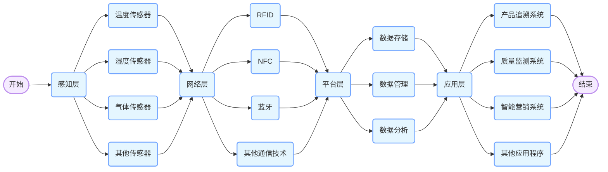

# 价值投资中的智能包装技术发展趋势

> 关键词：价值投资、智能包装技术、发展趋势、市场需求、技术创新

> 摘要：本文围绕价值投资中的智能包装技术发展趋势展开深入探讨。首先介绍了智能包装技术的背景和相关概念，阐述了其在不同领域的应用和重要性。接着分析了核心概念与联系，包括智能包装技术的原理和架构。详细讲解了相关核心算法原理及具体操作步骤，并通过数学模型和公式进行进一步说明。通过项目实战案例，展示了智能包装技术的实际应用和代码实现。探讨了智能包装技术在多个实际场景中的应用，推荐了相关的学习资源、开发工具和论文著作。最后总结了智能包装技术的未来发展趋势与挑战，为价值投资者和相关从业者提供全面的参考和指导。

## 1. 背景介绍 
### 1.1 目的和范围
价值投资作为一种重要的投资策略，强调对具有内在价值的资产进行投资。智能包装技术作为新兴的技术领域，正逐渐改变着包装行业的格局。本文章的目的在于深入研究价值投资视角下智能包装技术的发展趋势，分析其市场潜力、技术创新方向以及应用前景。范围涵盖智能包装技术的各个方面，包括其核心概念、算法原理、数学模型、实际应用案例等，旨在为价值投资者提供全面的信息，以便更好地评估智能包装技术相关投资项目的价值。

### 1.2 预期读者
本文预期读者包括价值投资者、包装行业从业者、技术研发人员、市场营销人员以及对智能包装技术感兴趣的学者和研究人员。对于价值投资者，本文提供了评估智能包装技术投资价值的参考依据；对于包装行业从业者，有助于了解行业发展趋势，推动企业技术创新；对于技术研发人员，可作为技术研究和创新的参考资料；对于市场营销人员，能为制定相关产品营销策略提供思路；对于学者和研究人员，可作为学术研究和探讨的基础。

### 1.3 文档结构概述
本文共分为十个部分。第一部分为背景介绍，阐述了文章的目的、预期读者和文档结构概述，并对相关术语进行了定义和解释。第二部分介绍核心概念与联系，包括智能包装技术的原理和架构，并通过文本示意图和 Mermaid 流程图进行直观展示。第三部分详细讲解核心算法原理和具体操作步骤，使用 Python 源代码进行阐述。第四部分介绍数学模型和公式，并通过举例说明其应用。第五部分通过项目实战，展示代码实际案例并进行详细解释说明。第六部分探讨智能包装技术的实际应用场景。第七部分推荐相关的工具和资源，包括学习资源、开发工具框架和论文著作。第八部分总结智能包装技术的未来发展趋势与挑战。第九部分为附录，解答常见问题。第十部分提供扩展阅读和参考资料。

### 1.4 术语表
#### 1.4.1 核心术语定义
- **价值投资**：一种投资策略，投资者通过对资产的内在价值进行评估，寻找被低估的资产进行投资，以获取长期的投资回报。
- **智能包装技术**：将传感器、电子器件、通信技术等与包装材料相结合，使包装具有感知、记录、通信等功能的技术。
- **物联网（IoT）**：通过各种信息传感器、射频识别技术、全球定位系统等技术和装置，使任何能够被独立寻址的普通物理对象实现互联互通的网络。
- **传感器**：一种检测装置，能感受到被测量的信息，并能将感受到的信息，按一定规律变换成为电信号或其他所需形式的信息输出，以满足信息的传输、处理、存储、显示、记录和控制等要求。

#### 1.4.2 相关概念解释
- **智能标签**：智能包装技术的一种具体应用形式，通常包含传感器、芯片和天线等部件，能够记录和传输产品的相关信息，如温度、湿度、位置等。
- **主动包装**：在包装过程中，通过包装材料与产品之间的相互作用，主动调节包装内部的环境，以延长产品的保质期和保持产品的质量。
- **智能防伪**：利用智能包装技术实现产品防伪的功能，通过加密、认证等手段，确保产品的真实性和安全性。

#### 1.4.3 缩略词列表
- **RFID**：Radio Frequency Identification，射频识别技术
- **NFC**：Near Field Communication，近场通信技术
- **GPS**：Global Positioning System，全球定位系统

## 2. 核心概念与联系 

### 智能包装技术的原理
智能包装技术的核心原理是将各种先进的技术集成到包装材料中，使包装具有感知、处理和通信的能力。其主要原理包括以下几个方面：
- **传感器技术**：通过在包装上安装各种传感器，如温度传感器、湿度传感器、气体传感器等，实时监测产品的环境参数和状态信息。
- **数据处理技术**：将传感器采集到的数据进行处理和分析，提取有用的信息，以便对产品的质量和状态进行评估和判断。
- **通信技术**：通过无线通信技术，如 RFID、NFC、蓝牙等，将处理后的数据传输到云端或其他终端设备，实现信息的共享和交互。

### 智能包装技术的架构
智能包装技术的架构主要包括以下几个层次：
- **感知层**：由各种传感器组成，负责采集产品的环境参数和状态信息。
- **网络层**：负责将感知层采集到的数据传输到云端或其他终端设备，包括无线通信技术和网络基础设施。
- **平台层**：负责对采集到的数据进行处理和分析，提供数据存储、管理和分析等功能。
- **应用层**：根据不同的应用需求，开发各种应用程序，如产品追溯系统、质量监测系统、智能营销系统等。

### 文本示意图
```plaintext
智能包装技术架构
|-- 感知层
|   |-- 温度传感器
|   |-- 湿度传感器
|   |-- 气体传感器
|   |-- 其他传感器
|-- 网络层
|   |-- RFID
|   |-- NFC
|   |-- 蓝牙
|   |-- 其他通信技术
|-- 平台层
|   |-- 数据存储
|   |-- 数据管理
|   |-- 数据分析
|-- 应用层
|   |-- 产品追溯系统
|   |-- 质量监测系统
|   |-- 智能营销系统
|   |-- 其他应用程序
```

### Mermaid 流程图


## 3. 核心算法原理 & 具体操作步骤 

### 传感器数据采集算法原理
传感器数据采集是智能包装技术的基础，其核心算法原理是通过传感器对物理量进行测量，并将测量结果转换为数字信号。以温度传感器为例，其数据采集算法原理如下：
```python
import time

# 模拟温度传感器
class TemperatureSensor:
    def __init__(self):
        self.base_temperature = 20  # 基础温度
        self.variation_range = 5  # 温度变化范围

    def read_temperature(self):
        # 模拟温度变化
        import random
        temperature = self.base_temperature + random.uniform(-self.variation_range, self.variation_range)
        return temperature

# 数据采集函数
def collect_sensor_data():
    sensor = TemperatureSensor()
    while True:
        temperature = sensor.read_temperature()
        print(f"当前温度: {temperature} °C")
        time.sleep(1)  # 每秒采集一次数据

if __name__ == "__main__":
    collect_sensor_data()
```
### 代码解释
- `TemperatureSensor` 类模拟了一个温度传感器，`read_temperature` 方法用于读取当前的温度值，通过随机数模拟温度的变化。
- `collect_sensor_data` 函数用于采集传感器数据，每秒采集一次，并将采集到的温度值打印输出。

### 数据处理与分析算法原理
采集到的传感器数据需要进行处理和分析，以提取有用的信息。以温度数据为例，我们可以计算一段时间内的平均温度和温度变化率。
```python
import time

# 模拟温度传感器
class TemperatureSensor:
    def __init__(self):
        self.base_temperature = 20  # 基础温度
        self.variation_range = 5  # 温度变化范围

    def read_temperature(self):
        # 模拟温度变化
        import random
        temperature = self.base_temperature + random.uniform(-self.variation_range, self.variation_range)
        return temperature

# 数据处理与分析函数
def process_and_analyze_data():
    sensor = TemperatureSensor()
    temperature_data = []
    time_interval = 10  # 数据采集时间间隔（秒）
    start_time = time.time()

    while time.time() - start_time < time_interval:
        temperature = sensor.read_temperature()
        temperature_data.append(temperature)
        time.sleep(1)  # 每秒采集一次数据

    # 计算平均温度
    average_temperature = sum(temperature_data) / len(temperature_data)

    # 计算温度变化率
    temperature_changes = [temperature_data[i + 1] - temperature_data[i] for i in range(len(temperature_data) - 1)]
    average_change_rate = sum(temperature_changes) / len(temperature_changes)

    print(f"平均温度: {average_temperature} °C")
    print(f"平均温度变化率: {average_change_rate} °C/秒")

if __name__ == "__main__":
    process_and_analyze_data()
```
### 代码解释
- 首先，我们使用 `TemperatureSensor` 类采集一段时间内的温度数据，并将其存储在 `temperature_data` 列表中。
- 然后，计算平均温度，即所有温度值的总和除以数据个数。
- 最后，计算温度变化率，即相邻温度值的差值的平均值。

### 数据通信算法原理
采集到的数据需要通过通信技术传输到云端或其他终端设备。以 RFID 为例，以下是一个简单的数据通信示例：
```python
import random

# 模拟 RFID 标签
class RFIDTag:
    def __init__(self, tag_id):
        self.tag_id = tag_id
        self.data = f"Data from tag {tag_id}"

    def read_data(self):
        return self.data

# 模拟 RFID 读写器
class RFIDReader:
    def __init__(self):
        self.tags = []
        for i in range(5):
            tag = RFIDTag(i)
            self.tags.append(tag)

    def read_all_tags(self):
        for tag in self.tags:
            data = tag.read_data()
            print(f"读取到标签 {tag.tag_id} 的数据: {data}")

if __name__ == "__main__":
    reader = RFIDReader()
    reader.read_all_tags()
```
### 代码解释
- `RFIDTag` 类模拟了一个 RFID 标签，包含标签 ID 和存储的数据。
- `RFIDReader` 类模拟了一个 RFID 读写器，包含多个 RFID 标签。`read_all_tags` 方法用于读取所有标签的数据并打印输出。

## 4. 数学模型和公式 & 详细讲解 & 举例说明 

### 平均温度计算模型
平均温度是评估一段时间内温度变化的重要指标，其数学模型如下：
$$\bar{T} = \frac{1}{n} \sum_{i=1}^{n} T_i$$
其中，$\bar{T}$ 表示平均温度，$n$ 表示数据个数，$T_i$ 表示第 $i$ 个温度值。

### 举例说明
假设我们采集到了 5 个温度值：$T_1 = 20$，$T_2 = 22$，$T_3 = 21$，$T_4 = 19$，$T_5 = 23$。则平均温度为：
$$\bar{T} = \frac{1}{5} \times (20 + 22 + 21 + 19 + 23) = \frac{105}{5} = 21$$

### 温度变化率计算模型
温度变化率可以反映温度的变化趋势，其数学模型如下：
$$\bar{r} = \frac{1}{n - 1} \sum_{i=1}^{n - 1} (T_{i + 1} - T_i)$$
其中，$\bar{r}$ 表示平均温度变化率，$n$ 表示数据个数，$T_i$ 表示第 $i$ 个温度值。

### 举例说明
假设我们采集到了 5 个温度值：$T_1 = 20$，$T_2 = 22$，$T_3 = 21$，$T_4 = 19$，$T_5 = 23$。则温度变化率为：
$$\begin{align*}
\bar{r} &= \frac{1}{4} \times [(22 - 20) + (21 - 22) + (19 - 21) + (23 - 19)] \\
&= \frac{1}{4} \times (2 - 1 - 2 + 4) \\
&= \frac{3}{4} = 0.75
\end{align*}$$

## 5. 项目实战：代码实际案例和详细解释说明 

### 5.1  开发环境搭建
- **操作系统**：Windows 10 或 macOS
- **Python 版本**：Python 3.7 或以上
- **开发工具**：PyCharm 或 Visual Studio Code
- **相关库**：`random`、`time`（Python 内置库，无需额外安装）

### 5.2  源代码详细实现和代码解读
以下是一个完整的智能包装技术模拟项目，包含传感器数据采集、数据处理与分析、数据通信三个部分。
```python
import time
import random

# 模拟温度传感器
class TemperatureSensor:
    def __init__(self):
        self.base_temperature = 20  # 基础温度
        self.variation_range = 5  # 温度变化范围

    def read_temperature(self):
        # 模拟温度变化
        temperature = self.base_temperature + random.uniform(-self.variation_range, self.variation_range)
        return temperature

# 模拟 RFID 标签
class RFIDTag:
    def __init__(self, tag_id):
        self.tag_id = tag_id
        self.data = f"Data from tag {tag_id}"

    def read_data(self):
        return self.data

# 模拟 RFID 读写器
class RFIDReader:
    def __init__(self):
        self.tags = []
        for i in range(5):
            tag = RFIDTag(i)
            self.tags.append(tag)

    def read_all_tags(self):
        for tag in self.tags:
            data = tag.read_data()
            print(f"读取到标签 {tag.tag_id} 的数据: {data}")

# 数据处理与分析函数
def process_and_analyze_data():
    sensor = TemperatureSensor()
    temperature_data = []
    time_interval = 10  # 数据采集时间间隔（秒）
    start_time = time.time()

    while time.time() - start_time < time_interval:
        temperature = sensor.read_temperature()
        temperature_data.append(temperature)
        time.sleep(1)  # 每秒采集一次数据

    # 计算平均温度
    average_temperature = sum(temperature_data) / len(temperature_data)

    # 计算温度变化率
    temperature_changes = [temperature_data[i + 1] - temperature_data[i] for i in range(len(temperature_data) - 1)]
    average_change_rate = sum(temperature_changes) / len(temperature_changes)

    print(f"平均温度: {average_temperature} °C")
    print(f"平均温度变化率: {average_change_rate} °C/秒")

if __name__ == "__main__":
    print("开始采集传感器数据...")
    process_and_analyze_data()
    print("开始读取 RFID 标签数据...")
    reader = RFIDReader()
    reader.read_all_tags()
```
### 代码解读
- **温度传感器模拟**：`TemperatureSensor` 类模拟了一个温度传感器，通过随机数模拟温度的变化。
- **RFID 标签和读写器模拟**：`RFIDTag` 类模拟了一个 RFID 标签，包含标签 ID 和存储的数据；`RFIDReader` 类模拟了一个 RFID 读写器，包含多个 RFID 标签，并提供了读取所有标签数据的方法。
- **数据处理与分析**：`process_and_analyze_data` 函数用于采集一段时间内的温度数据，并计算平均温度和温度变化率。
- **主程序**：在主程序中，首先调用 `process_and_analyze_data` 函数采集传感器数据并进行处理和分析，然后调用 `RFIDReader` 类的 `read_all_tags` 方法读取 RFID 标签数据。

### 5.3  代码解读与分析
- **代码结构**：代码采用了面向对象的编程思想，将不同的功能封装在不同的类和函数中，提高了代码的可读性和可维护性。
- **数据采集**：通过 `TemperatureSensor` 类模拟温度传感器，每秒采集一次温度数据，采集时间为 10 秒。
- **数据处理与分析**：对采集到的温度数据进行处理和分析，计算平均温度和温度变化率，为后续的决策提供依据。
- **数据通信**：通过 `RFIDReader` 类模拟 RFID 读写器，读取多个 RFID 标签的数据，实现数据的通信和共享。

## 6. 实际应用场景 
### 食品行业
在食品行业，智能包装技术可以实时监测食品的温度、湿度、气体等环境参数，确保食品在运输和储存过程中的质量安全。例如，在冷链物流中，通过智能包装技术可以实时监测食品的温度变化，一旦温度超出设定范围，系统会自动发出警报，提醒相关人员采取措施。此外，智能包装技术还可以实现食品的追溯功能，消费者可以通过扫描包装上的二维码，了解食品的产地、生产日期、加工过程等信息，提高消费者对食品质量的信任度。

### 医药行业
在医药行业，智能包装技术可以确保药品的质量和安全性。例如，通过在药品包装中安装温度传感器和湿度传感器，实时监测药品的储存环境，确保药品在规定的温度和湿度范围内储存。此外，智能包装技术还可以实现药品的防伪功能，通过加密、认证等手段，确保药品的真实性和安全性。消费者可以通过扫描包装上的二维码，验证药品的真伪，避免购买到假药。

### 物流行业
在物流行业，智能包装技术可以提高物流效率和货物安全性。例如，通过在货物包装中安装 RFID 标签和 GPS 定位系统，实时跟踪货物的位置和运输状态，实现货物的可视化管理。物流企业可以通过手机或电脑随时随地查看货物的位置和运输状态，及时调整运输计划，提高物流效率。此外，智能包装技术还可以实现货物的防盗功能，当货物被非法移动或打开时，系统会自动发出警报，提醒相关人员采取措施。

### 电子产品行业
在电子产品行业，智能包装技术可以提高产品的用户体验和售后服务质量。例如，通过在电子产品包装中安装智能标签，消费者可以通过手机扫描标签，获取产品的使用说明书、保修信息、软件升级等内容，提高产品的用户体验。此外，智能包装技术还可以实现产品的质量追溯功能，当产品出现质量问题时，企业可以通过智能标签快速定位问题产品的生产批次和生产时间，及时采取召回措施，提高售后服务质量。

## 7. 工具和资源推荐
### 7.1 学习资源推荐
#### 7.1.1 书籍推荐
- 《智能包装技术》：本书系统地介绍了智能包装技术的基本概念、原理、应用和发展趋势，是学习智能包装技术的经典教材。
- 《物联网技术与应用》：本书全面介绍了物联网的技术体系、应用场景和发展趋势，对于理解智能包装技术中的物联网应用具有重要的参考价值。
- 《传感器技术》：本书详细介绍了各种传感器的工作原理、性能特点和应用领域，是学习智能包装技术中传感器应用的重要参考书籍。

#### 7.1.2 在线课程
- Coursera 上的《物联网基础》：该课程由知名高校的教授授课，系统地介绍了物联网的基本概念、技术原理和应用案例，对于学习智能包装技术中的物联网应用具有重要的帮助。
- edX 上的《传感器与执行器》：该课程详细介绍了各种传感器和执行器的工作原理、性能特点和应用领域，对于学习智能包装技术中传感器的应用具有重要的参考价值。
- 中国大学 MOOC 上的《智能包装设计与应用》：该课程由国内高校的专家授课，系统地介绍了智能包装设计的基本理论、方法和应用案例，对于学习智能包装技术具有重要的指导意义。

#### 7.1.3 技术博客和网站
- 物联网世界（https://www.iotworld.com.cn/）：该网站提供了丰富的物联网技术资讯、应用案例和技术文章，对于了解智能包装技术中的物联网应用具有重要的参考价值。
- 传感器专家网（https://www.sensorexpert.com.cn/）：该网站提供了各种传感器的技术资料、应用案例和行业资讯，对于学习智能包装技术中传感器的应用具有重要的帮助。
- 包装前沿（https://www.pack168.net/）：该网站提供了包装行业的最新资讯、技术动态和应用案例，对于了解智能包装技术的发展趋势和应用场景具有重要的参考价值。

### 7.2 开发工具框架推荐
#### 7.2.1 IDE和编辑器
- PyCharm：一款专业的 Python 集成开发环境，具有代码自动补全、调试、版本控制等功能，适合开发智能包装技术相关的 Python 代码。
- Visual Studio Code：一款轻量级的代码编辑器，支持多种编程语言和插件扩展，适合开发智能包装技术相关的代码。
- Arduino IDE：一款专门用于开发 Arduino 硬件的集成开发环境，适合开发智能包装技术中基于 Arduino 平台的硬件项目。

#### 7.2.2 调试和性能分析工具
- PyCharm 调试器：PyCharm 自带的调试器，可以帮助开发者快速定位代码中的问题，提高开发效率。
- Wireshark：一款网络协议分析工具，可以帮助开发者分析智能包装技术中数据通信的网络协议和数据传输情况。
- Arduino 串口监视器：Arduino IDE 自带的串口监视器，可以帮助开发者调试基于 Arduino 平台的硬件项目，查看传感器数据和通信信息。

#### 7.2.3 相关框架和库
- Flask：一款轻量级的 Python Web 框架，适合开发智能包装技术中的 Web 应用程序。
- Django：一款功能强大的 Python Web 框架，适合开发大型的智能包装技术中的 Web 应用程序。
- MQTT：一种轻量级的消息传输协议，适合智能包装技术中设备之间的数据通信。

### 7.3 相关论文著作推荐
#### 7.3.1 经典论文
- “Intelligent Packaging Systems for Food Applications: A Review”：该论文全面综述了智能包装技术在食品行业的应用和发展趋势，是智能包装技术领域的经典论文。
- “The Internet of Things for Smart Packaging: A Review”：该论文详细介绍了物联网技术在智能包装中的应用和发展趋势，对于理解智能包装技术中的物联网应用具有重要的参考价值。
- “Sensor Technologies for Intelligent Packaging: A Review”：该论文系统地介绍了各种传感器技术在智能包装中的应用和发展趋势，是学习智能包装技术中传感器应用的重要参考论文。

#### 7.3.2 最新研究成果
- 每年在国际知名学术期刊和会议上发表的关于智能包装技术的研究论文，如《Journal of Food Engineering》、《Sensors and Actuators B: Chemical》、《IEEE Internet of Things Journal》等。
- 各大高校和科研机构的研究报告和学术成果，如清华大学、浙江大学、中国科学院等在智能包装技术领域的研究成果。

#### 7.3.3 应用案例分析
- 各大企业在智能包装技术领域的应用案例，如可口可乐公司、宝洁公司、联合利华公司等在智能包装技术方面的应用案例。
- 政府部门和行业协会发布的智能包装技术应用案例报告，如中国包装联合会发布的《智能包装技术应用案例集》等。

## 8. 总结：未来发展趋势与挑战
### 未来发展趋势
- **技术融合**：智能包装技术将与物联网、大数据、人工智能等技术深度融合，实现更加智能化、自动化的包装解决方案。例如，通过人工智能算法对传感器采集到的数据进行分析和预测，提前发现产品质量问题和潜在风险。
- **环保可持续**：随着环保意识的不断提高，智能包装技术将更加注重环保可持续性。例如，开发可降解的智能包装材料，减少对环境的污染；采用节能型的传感器和通信技术，降低能源消耗。
- **个性化定制**：消费者对产品的个性化需求越来越高，智能包装技术将为产品提供更加个性化的包装解决方案。例如，通过智能标签和可变数据印刷技术，为每个产品定制独特的包装信息，提高产品的吸引力和竞争力。
- **应用拓展**：智能包装技术的应用领域将不断拓展，除了食品、医药、物流、电子产品等行业外，还将应用于化妆品、玩具、建材等行业。

### 挑战
- **技术标准不统一**：目前智能包装技术的标准还不统一，不同企业和产品之间的兼容性较差，给智能包装技术的推广和应用带来了一定的困难。
- **成本较高**：智能包装技术涉及到传感器、电子器件、通信技术等多个领域，成本较高，限制了其大规模应用。
- **数据安全和隐私问题**：智能包装技术需要采集和传输大量的产品信息和用户数据，数据安全和隐私问题成为了制约其发展的重要因素。
- **消费者认知度较低**：消费者对智能包装技术的认知度较低，对其功能和价值了解不够，需要加强市场推广和宣传。

## 9. 附录：常见问题与解答
### 智能包装技术的成本高吗？
智能包装技术的成本相对传统包装技术较高，主要是因为其涉及到传感器、电子器件、通信技术等多个领域。但是，随着技术的不断发展和规模的扩大，智能包装技术的成本正在逐渐降低。此外，智能包装技术可以提高产品的质量和安全性，减少产品损耗和售后成本，从长远来看，其经济效益是显著的。

### 智能包装技术的数据安全如何保障？
智能包装技术的数据安全可以通过多种方式来保障。例如，采用加密技术对数据进行加密，确保数据在传输和存储过程中的安全性；采用身份认证和授权技术，确保只有授权用户才能访问和处理数据；建立数据备份和恢复机制，防止数据丢失和损坏。

### 智能包装技术对环境有影响吗？
智能包装技术对环境的影响取决于其采用的包装材料和技术。一些智能包装技术采用了可降解的包装材料，对环境的影响较小；而一些采用电子器件和电池的智能包装技术，可能会对环境造成一定的污染。因此，在发展智能包装技术的过程中，需要注重环保可持续性，采用环保型的包装材料和技术。

### 智能包装技术的应用前景如何？
智能包装技术的应用前景非常广阔。随着消费者对产品质量和安全性的要求越来越高，以及物联网、大数据、人工智能等技术的不断发展，智能包装技术将在食品、医药、物流、电子产品等多个行业得到广泛应用。此外，智能包装技术还可以为企业提供更多的商业机会和竞争优势，促进包装行业的转型升级。

## 10. 扩展阅读 & 参考资料
### 扩展阅读
- 《未来包装：智能包装技术的创新与应用》
- 《物联网时代的智能包装》
- 《智能包装：从概念到实践》

### 参考资料
- 《智能包装技术手册》
- 相关学术期刊和会议论文
- 企业官方网站和技术文档
- 行业报告和统计数据