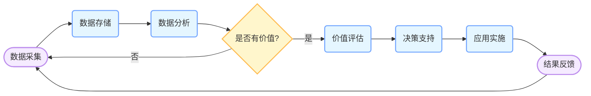

# 价值投资中的智能城市共享经济管理系统分析

> 关键词：价值投资、智能城市、共享经济、管理系统、数据分析、决策支持、可持续发展

> 摘要：本文聚焦于价值投资视角下的智能城市共享经济管理系统。首先介绍了相关背景，明确研究目的与范围、预期读者等内容。接着深入剖析核心概念及其联系，阐述核心算法原理与操作步骤，并结合数学模型和公式进行详细讲解与举例。通过项目实战展示代码案例及解释，探讨该管理系统在实际中的应用场景。推荐了学习、开发工具和相关论文著作等资源。最后总结其未来发展趋势与挑战，解答常见问题并提供扩展阅读与参考资料，旨在全面深入地分析智能城市共享经济管理系统，为价值投资决策提供有力支持。

## 1. 背景介绍 
### 1.1 目的和范围
在当今社会，智能城市的建设与共享经济的发展相互交织，为城市的发展带来了新的机遇和挑战。价值投资作为一种重要的投资策略，需要有科学合理的管理系统来辅助决策。本研究的目的在于深入分析价值投资中的智能城市共享经济管理系统，探究其核心原理、算法、应用场景等，为投资者、城市管理者以及相关从业者提供全面的理论和实践指导。

研究范围涵盖智能城市共享经济管理系统的各个方面，包括但不限于系统架构、数据处理、决策支持、实际应用案例等，旨在构建一个完整的研究体系，全面揭示该系统的内在机制和应用价值。

### 1.2 预期读者
本文的预期读者包括对价值投资、智能城市、共享经济等领域感兴趣的投资者、城市规划与管理者、相关企业的技术和管理人员、学术界的研究人员以及希望了解该领域前沿知识的学生等。通过阅读本文，读者可以深入了解智能城市共享经济管理系统的原理、应用和发展趋势，为其在实际工作和学习中提供有价值的参考。

### 1.3 文档结构概述
本文共分为十个部分。第一部分为背景介绍，阐述研究的目的、范围、预期读者和文档结构概述，并给出术语表。第二部分分析核心概念与联系，通过文本示意图和 Mermaid 流程图展示系统的架构和原理。第三部分讲解核心算法原理及具体操作步骤，使用 Python 源代码进行详细阐述。第四部分介绍数学模型和公式，并进行详细讲解和举例说明。第五部分通过项目实战展示代码实际案例并进行详细解释。第六部分探讨实际应用场景。第七部分推荐相关的工具和资源，包括学习资源、开发工具框架和相关论文著作。第八部分总结未来发展趋势与挑战。第九部分为附录，解答常见问题。第十部分提供扩展阅读和参考资料。

### 1.4 术语表
#### 1.4.1 核心术语定义
- **价值投资**：一种基于对资产内在价值的分析，通过长期持有被低估的资产来获取收益的投资策略。
- **智能城市**：利用信息技术和通信技术手段感测、分析、整合城市运行核心系统的各项关键信息，从而对包括民生、环保、公共安全、城市服务、工商业活动在内的各种需求做出智能响应的城市形态。
- **共享经济**：以获得一定报酬为主要目的，基于陌生人且存在物品使用权暂时转移的一种新的经济模式。
- **管理系统**：为了实现特定目标，对各种资源进行计划、组织、协调和控制的一系列相互关联的要素所构成的有机整体。

#### 1.4.2 相关概念解释
- **数据分析**：对大量的数据进行收集、整理、分析和解释，以发现有价值的信息和知识的过程。
- **决策支持**：利用信息技术和数据分析方法，为决策者提供相关信息和建议，辅助其做出科学合理决策的过程。
- **可持续发展**：既满足当代人的需求，又不损害后代人满足其需求的能力的发展模式。

#### 1.4.3 缩略词列表
- **AI**：Artificial Intelligence，人工智能
- **IoT**：Internet of Things，物联网
- **DBMS**：Database Management System，数据库管理系统
- **API**：Application Programming Interface，应用程序编程接口

## 2. 核心概念与联系 

### 核心概念原理
智能城市共享经济管理系统是一个融合了价值投资理念、智能城市技术和共享经济模式的综合性系统。其核心原理在于通过收集、整合和分析智能城市中共享经济相关的数据，运用价值投资的方法对共享经济项目进行评估和决策，实现资源的优化配置和可持续发展。

从数据层面来看，该系统利用物联网技术收集城市中各种共享经济资源的使用情况、用户行为等数据，并将其存储在数据库中。数据分析模块对这些数据进行挖掘和分析，提取有价值的信息，如用户需求、市场趋势、项目效益等。

在价值投资方面，系统根据数据分析结果，运用价值评估模型对共享经济项目进行评估，判断其是否具有投资价值。决策支持模块则基于评估结果，为投资者和城市管理者提供决策建议，如投资方向、资源分配等。

### 架构的文本示意图
智能城市共享经济管理系统主要由数据采集层、数据存储层、数据分析层、价值评估层、决策支持层和应用层组成。

- **数据采集层**：通过物联网设备、传感器、用户终端等采集共享经济相关的数据，包括车辆使用情况、房屋租赁信息、用户评价等。
- **数据存储层**：将采集到的数据存储在数据库管理系统中，如关系型数据库（MySQL、Oracle 等）或非关系型数据库（MongoDB、Redis 等），以便后续的分析和处理。
- **数据分析层**：运用数据分析技术和算法，对存储的数据进行清洗、挖掘和分析，提取有价值的信息和知识。
- **价值评估层**：根据数据分析结果，运用价值评估模型对共享经济项目进行评估，计算其内在价值和投资回报率等指标。
- **决策支持层**：基于价值评估结果，为投资者和城市管理者提供决策建议，如投资决策、资源分配决策等。
- **应用层**：将系统的决策结果应用于实际的共享经济运营和城市管理中，实现资源的优化配置和可持续发展。

### Mermaid 流程图


## 3. 核心算法原理 & 具体操作步骤 

### 核心算法原理
智能城市共享经济管理系统中涉及多种核心算法，如数据挖掘算法、价值评估算法、决策优化算法等。这里以数据挖掘中的聚类算法和价值评估中的净现值（NPV）算法为例进行详细讲解。

#### 聚类算法原理
聚类算法是一种无监督学习算法，其目的是将数据集中的数据对象划分为不同的类或簇，使得同一簇内的数据对象具有较高的相似度，而不同簇之间的数据对象具有较低的相似度。常见的聚类算法有 K-Means 算法、层次聚类算法等。

K-Means 算法的基本思想是：首先随机选择 K 个数据对象作为初始聚类中心，然后将每个数据对象分配到与其距离最近的聚类中心所在的簇中，接着重新计算每个簇的聚类中心，重复这个过程直到聚类中心不再发生变化或达到最大迭代次数。

#### 净现值（NPV）算法原理
净现值（NPV）是一种常用的价值评估方法，用于计算投资项目在未来一段时间内的现金流量的现值之和。其计算公式为：

$$NPV = \sum_{t=0}^{n} \frac{CF_t}{(1 + r)^t}$$

其中，$CF_t$ 表示第 $t$ 期的现金流量，$r$ 表示折现率，$n$ 表示项目的寿命期。

### 具体操作步骤及 Python 源代码

#### 聚类算法（K-Means）操作步骤及代码
1. **数据准备**：准备需要进行聚类分析的数据，将其转换为合适的格式。
2. **初始化聚类中心**：随机选择 K 个数据对象作为初始聚类中心。
3. **分配数据对象到簇**：计算每个数据对象到各个聚类中心的距离，将其分配到距离最近的聚类中心所在的簇中。
4. **更新聚类中心**：重新计算每个簇的聚类中心。
5. **重复步骤 3 和 4**：直到聚类中心不再发生变化或达到最大迭代次数。

以下是使用 Python 实现 K-Means 算法的示例代码：

```python
import numpy as np
import matplotlib.pyplot as plt
from sklearn.datasets import make_blobs
from sklearn.cluster import KMeans

# 生成示例数据
X, y = make_blobs(n_samples=300, centers=4, cluster_std=0.60, random_state=0)

# 创建 K-Means 模型
kmeans = KMeans(n_clusters=4, init='k-means++', max_iter=300, n_init=10, random_state=0)
pred_y = kmeans.fit_predict(X)

# 可视化聚类结果
plt.scatter(X[:,0], X[:,1], c=pred_y, s=50, cmap='viridis')
plt.scatter(kmeans.cluster_centers_[:, 0], kmeans.cluster_centers_[:, 1], s=300, c='red', alpha=0.5)
plt.show()
```

#### 净现值（NPV）算法操作步骤及代码
1. **确定现金流量**：确定投资项目在未来各期的现金流量。
2. **确定折现率**：根据项目的风险和市场情况确定折现率。
3. **计算净现值**：根据净现值公式计算投资项目的净现值。

以下是使用 Python 实现净现值算法的示例代码：

```python
def npv(cash_flows, discount_rate):
    npv_value = 0
    for i, cash_flow in enumerate(cash_flows):
        npv_value += cash_flow / (1 + discount_rate) ** i
    return npv_value

# 示例现金流量和折现率
cash_flows = [-1000, 200, 300, 400, 500]
discount_rate = 0.1

# 计算净现值
npv_value = npv(cash_flows, discount_rate)
print(f"净现值: {npv_value}")
```

## 4. 数学模型和公式 & 详细讲解 & 举例说明 

### 聚类算法相关数学模型和公式
#### 距离度量公式
在 K-Means 算法中，常用的距离度量公式是欧几里得距离公式。对于两个 $n$ 维向量 $\mathbf{x} = (x_1, x_2, \cdots, x_n)$ 和 $\mathbf{y} = (y_1, y_2, \cdots, y_n)$，它们之间的欧几里得距离 $d(\mathbf{x}, \mathbf{y})$ 定义为：

$$d(\mathbf{x}, \mathbf{y}) = \sqrt{\sum_{i=1}^{n} (x_i - y_i)^2}$$

这个公式衡量了两个向量在 $n$ 维空间中的距离，距离越近表示两个向量越相似。

#### 聚类中心更新公式
在 K-Means 算法中，每次迭代后需要重新计算每个簇的聚类中心。对于一个簇 $C_j$，其聚类中心 $\mathbf{c}_j$ 的计算公式为：

$$\mathbf{c}_j = \frac{1}{|C_j|} \sum_{\mathbf{x} \in C_j} \mathbf{x}$$

其中，$|C_j|$ 表示簇 $C_j$ 中数据对象的数量，$\mathbf{x}$ 表示簇 $C_j$ 中的数据对象。

### 举例说明
假设有三个二维数据点 $\mathbf{x}_1 = (1, 2)$，$\mathbf{x}_2 = (3, 4)$，$\mathbf{x}_3 = (5, 6)$，我们要计算 $\mathbf{x}_1$ 和 $\mathbf{x}_2$ 之间的欧几里得距离。

根据欧几里得距离公式：

$$d(\mathbf{x}_1, \mathbf{x}_2) = \sqrt{(1 - 3)^2 + (2 - 4)^2} = \sqrt{(-2)^2 + (-2)^2} = \sqrt{4 + 4} = \sqrt{8} \approx 2.83$$

假设这三个数据点属于同一个簇 $C_1$，则该簇的聚类中心 $\mathbf{c}_1$ 为：

$$\mathbf{c}_1 = \frac{1}{3} \left( \begin{bmatrix} 1 \\ 2 \end{bmatrix} + \begin{bmatrix} 3 \\ 4 \end{bmatrix} + \begin{bmatrix} 5 \\ 6 \end{bmatrix} \right) = \frac{1}{3} \begin{bmatrix} 9 \\ 12 \end{bmatrix} = \begin{bmatrix} 3 \\ 4 \end{bmatrix}$$

### 净现值（NPV）算法相关数学模型和公式
净现值（NPV）的计算公式前面已经给出：

$$NPV = \sum_{t=0}^{n} \frac{CF_t}{(1 + r)^t}$$

### 举例说明
假设有一个投资项目，初始投资为 1000 元，预计未来三年的现金流量分别为 200 元、300 元、400 元，折现率为 10%。

根据净现值公式计算该项目的净现值：

$$NPV = -1000 + \frac{200}{(1 + 0.1)^1} + \frac{300}{(1 + 0.1)^2} + \frac{400}{(1 + 0.1)^3}$$

$$NPV = -1000 + \frac{200}{1.1} + \frac{300}{1.21} + \frac{400}{1.331}$$

$$NPV \approx -1000 + 181.82 + 247.93 + 300.53 = -270.72$$

由于净现值为负数，说明该项目在当前折现率下可能不是一个好的投资选择。

## 5. 项目实战：代码实际案例和详细解释说明 

### 5.1  开发环境搭建
在进行智能城市共享经济管理系统的开发之前，需要搭建相应的开发环境。以下是具体的步骤：

#### 操作系统
建议使用 Linux 或 macOS 操作系统，因为它们在开发和部署方面具有更好的稳定性和兼容性。当然，Windows 系统也可以使用，但可能需要进行一些额外的配置。

#### 编程语言和开发工具
- **Python**：作为主要的编程语言，Python 具有丰富的库和框架，适合进行数据分析、机器学习和 Web 开发等任务。可以从 Python 官方网站（https://www.python.org/） 下载并安装最新版本的 Python。
- **Anaconda**：Anaconda 是一个用于科学计算的 Python 发行版，它集成了许多常用的科学计算库和工具，如 NumPy、Pandas、Matplotlib 等。可以从 Anaconda 官方网站（https://www.anaconda.com/） 下载并安装适合自己操作系统的版本。
- **集成开发环境（IDE）**：推荐使用 PyCharm 或 Jupyter Notebook 作为开发环境。PyCharm 是一个功能强大的 Python IDE，提供了代码编辑、调试、版本控制等功能；Jupyter Notebook 则是一个交互式的开发环境，适合进行数据分析和实验。

#### 数据库
根据项目的需求，可以选择不同的数据库管理系统。如果数据量较小且对事务处理要求较高，可以选择关系型数据库，如 MySQL、PostgreSQL 等；如果数据量较大且对数据的灵活性要求较高，可以选择非关系型数据库，如 MongoDB、Redis 等。

#### 其他工具
- **Git**：用于版本控制和团队协作，可以从 Git 官方网站（https://git-scm.com/） 下载并安装。
- **Docker**：用于容器化部署，可以从 Docker 官方网站（https://www.docker.com/） 下载并安装。

### 5.2  源代码详细实现和代码解读
以下是一个简单的智能城市共享经济管理系统的代码示例，主要实现了数据采集、数据分析和决策支持的部分功能。

```python
import pandas as pd
from sklearn.cluster import KMeans
from sklearn.preprocessing import StandardScaler

# 数据采集模块
def collect_data():
    # 模拟从数据库或 API 中获取共享经济数据
    data = pd.read_csv('shared_economy_data.csv')
    return data

# 数据分析模块
def analyze_data(data):
    # 选择需要分析的特征
    features = data[['usage_frequency', 'user_rating', 'price']]
    
    # 数据标准化
    scaler = StandardScaler()
    scaled_features = scaler.fit_transform(features)
    
    # 使用 K-Means 算法进行聚类分析
    kmeans = KMeans(n_clusters=3, init='k-means++', max_iter=300, n_init=10, random_state=0)
    clusters = kmeans.fit_predict(scaled_features)
    
    # 将聚类结果添加到原始数据中
    data['cluster'] = clusters
    
    return data

# 决策支持模块
def decision_support(data):
    # 根据聚类结果进行决策
    cluster_0_data = data[data['cluster'] == 0]
    cluster_1_data = data[data['cluster'] == 1]
    cluster_2_data = data[data['cluster'] == 2]
    
    # 示例决策：对不同聚类的项目采取不同的投资策略
    if len(cluster_0_data) > 0:
        print("对聚类 0 的项目进行进一步的市场调研和风险评估。")
    if len(cluster_1_data) > 0:
        print("考虑对聚类 1 的项目进行适度投资。")
    if len(cluster_2_data) > 0:
        print("谨慎对待聚类 2 的项目，可能需要调整策略。")

# 主函数
def main():
    # 数据采集
    data = collect_data()
    
    # 数据分析
    analyzed_data = analyze_data(data)
    
    # 决策支持
    decision_support(analyzed_data)

if __name__ == "__main__":
    main()
```

### 5.3  代码解读与分析
#### 数据采集模块
`collect_data` 函数模拟从数据库或 API 中获取共享经济数据，并将其存储在 Pandas 的 DataFrame 中。在实际应用中，需要根据具体的数据源进行相应的修改。

#### 数据分析模块
`analyze_data` 函数首先选择需要分析的特征，然后使用 `StandardScaler` 对数据进行标准化处理，以消除不同特征之间的量纲差异。接着使用 K-Means 算法对标准化后的数据进行聚类分析，并将聚类结果添加到原始数据中。

#### 决策支持模块
`decision_support` 函数根据聚类结果进行决策。在这个示例中，对不同聚类的项目采取了不同的投资策略，如对聚类 0 的项目进行进一步的市场调研和风险评估，对聚类 1 的项目进行适度投资，对聚类 2 的项目谨慎对待。

#### 主函数
`main` 函数依次调用数据采集、数据分析和决策支持模块，完成整个系统的功能。

## 6. 实际应用场景 
### 城市交通共享领域
在城市交通共享领域，智能城市共享经济管理系统可以发挥重要作用。通过收集共享单车、共享汽车等交通工具的使用数据，如使用时间、行驶路线、停放地点等，系统可以对用户需求进行分析和预测。例如，根据用户的出行时间和地点分布，合理安排共享单车和共享汽车的投放数量和位置，提高资源的利用效率。同时，系统可以对共享交通工具的运营状况进行评估，如车辆的损坏率、维修成本等，为运营商提供决策支持，优化运营策略。

### 房屋共享领域
在房屋共享领域，该系统可以帮助房东和租客更好地进行决策。通过收集房屋的出租信息、租客评价、市场价格等数据，系统可以对房屋的价值进行评估，为房东提供合理的租金定价建议。同时，系统可以根据租客的需求和偏好，为其推荐合适的房屋，提高租客的满意度。此外，系统还可以对房屋共享市场的趋势进行分析和预测，为投资者提供投资决策支持。

### 能源共享领域
在能源共享领域，智能城市共享经济管理系统可以促进能源的高效利用和可持续发展。通过收集能源生产和消费数据，如太阳能板的发电量、用户的用电量等，系统可以对能源的供需情况进行分析和预测。例如，根据用户的用电需求和太阳能板的发电情况，合理安排能源的存储和分配，实现能源的优化配置。同时，系统可以对能源共享项目的效益进行评估，为投资者提供投资决策支持，推动能源共享项目的发展。

## 7. 工具和资源推荐
### 7.1 学习资源推荐
#### 7.1.1 书籍推荐
- 《智能城市：大数据、物联网与智慧城市的未来》：本书介绍了智能城市的概念、技术和应用，探讨了大数据、物联网等技术在智能城市建设中的作用。
- 《共享经济：重构未来商业新模式》：本书深入分析了共享经济的发展趋势、商业模式和挑战，为读者提供了全面的共享经济知识体系。
- 《Python 数据分析实战》：本书详细介绍了 Python 在数据分析领域的应用，包括数据采集、数据清洗、数据分析和数据可视化等方面的内容。

#### 7.1.2 在线课程
- Coursera 上的“Data Science Specialization”：该课程由多所知名大学的教授授课，涵盖了数据科学的各个方面，包括数据挖掘、机器学习、数据分析等。
- edX 上的“Artificial Intelligence”：该课程介绍了人工智能的基本概念、算法和应用，帮助学习者掌握人工智能的核心知识和技能。
- Udemy 上的“Python for Data Science and Machine Learning Bootcamp”：该课程通过实际案例讲解 Python 在数据科学和机器学习中的应用，适合初学者学习。

#### 7.1.3 技术博客和网站
- Medium：Medium 上有许多关于智能城市、共享经济、数据分析等领域的优质博客文章，为读者提供了最新的技术和行业动态。
- Towards Data Science：该网站专注于数据科学和机器学习领域，提供了大量的技术文章和教程，适合数据科学爱好者学习和交流。
- Smart Cities Dive：该网站专门报道智能城市领域的新闻和趋势，为读者提供了智能城市建设的最新信息。

### 7.2 开发工具框架推荐
#### 7.2.1 IDE和编辑器
- PyCharm：功能强大的 Python IDE，提供了代码编辑、调试、版本控制等功能，适合专业开发者使用。
- Jupyter Notebook：交互式的开发环境，适合进行数据分析和实验，方便用户进行代码的编写、运行和展示。
- Visual Studio Code：轻量级的代码编辑器，支持多种编程语言和插件，具有丰富的扩展功能。

#### 7.2.2 调试和性能分析工具
- PDB：Python 自带的调试工具，可以帮助开发者定位和解决代码中的问题。
- cProfile：Python 自带的性能分析工具，可以帮助开发者分析代码的性能瓶颈，优化代码效率。
- TensorBoard：用于可视化深度学习模型的训练过程和结果，帮助开发者更好地理解和优化模型。

#### 7.2.3 相关框架和库
- Pandas：用于数据处理和分析的 Python 库，提供了高效的数据结构和数据操作方法。
- NumPy：用于科学计算的 Python 库，提供了高效的数组操作和数学函数。
- Scikit-learn：用于机器学习的 Python 库，提供了丰富的机器学习算法和工具。
- Django：用于 Web 开发的 Python 框架，提供了高效的 Web 开发工具和组件。

### 7.3 相关论文著作推荐
#### 7.3.1 经典论文
- “The Sharing Economy: Why People Participate in Collaborative Consumption”：该论文探讨了共享经济的本质和人们参与共享经济的原因，为共享经济的研究提供了理论基础。
- “Smart Cities: A Definition”：该论文对智能城市的概念进行了明确的定义，为智能城市的研究和实践提供了指导。
- “Data Mining: Concepts and Techniques”：该论文介绍了数据挖掘的基本概念、算法和应用，是数据挖掘领域的经典文献。

#### 7.3.2 最新研究成果
- 关注顶级学术会议和期刊，如 ACM SIGKDD、IEEE Transactions on Intelligent Transportation Systems、Journal of Urban Technology 等，获取智能城市、共享经济和数据分析领域的最新研究成果。

#### 7.3.3 应用案例分析
- 参考相关的行业报告和案例分析，如麦肯锡、波士顿咨询等机构发布的报告，了解智能城市共享经济管理系统在实际应用中的成功案例和经验教训。

## 8. 总结：未来发展趋势与挑战
### 未来发展趋势
#### 智能化程度不断提高
随着人工智能、机器学习、物联网等技术的不断发展，智能城市共享经济管理系统的智能化程度将不断提高。系统将能够更加准确地分析和预测用户需求，实现资源的自动调配和优化配置，提高系统的运行效率和服务质量。

#### 数据共享与开放
未来，智能城市共享经济管理系统将更加注重数据的共享与开放。通过建立数据共享平台，不同的企业和机构可以共享数据资源，实现数据的互联互通和协同利用，促进共享经济的发展和创新。

#### 可持续发展导向
在可持续发展的背景下，智能城市共享经济管理系统将更加注重资源的可持续利用和环境保护。系统将鼓励和支持绿色共享经济模式的发展，如共享新能源汽车、共享节能设备等，推动城市的可持续发展。

#### 跨领域融合
智能城市共享经济管理系统将与其他领域进行更加深入的融合，如金融、医疗、教育等。通过跨领域融合，系统将能够提供更加多元化的服务和产品，满足用户的不同需求，拓展共享经济的应用场景。

### 挑战
#### 数据安全与隐私保护
随着智能城市共享经济管理系统的发展，数据的安全与隐私保护问题日益突出。系统需要处理大量的用户数据，如个人信息、消费记录等，如果这些数据被泄露或滥用，将给用户带来严重的损失。因此，如何保障数据的安全与隐私是系统面临的重要挑战之一。

#### 法律法规不完善
共享经济作为一种新兴的经济模式，其发展速度远远超过了法律法规的制定速度。目前，相关的法律法规还不完善，存在一些监管空白和漏洞。这给智能城市共享经济管理系统的发展带来了一定的风险和不确定性。因此，需要加快制定和完善相关的法律法规，为共享经济的发展提供法律保障。

#### 技术标准不统一
由于智能城市共享经济管理系统涉及多个领域和技术，目前缺乏统一的技术标准和规范。这导致不同的系统之间难以实现互联互通和数据共享，影响了系统的协同效应和整体效率。因此，需要加强技术标准的制定和推广，促进系统的标准化和规范化发展。

#### 社会接受度问题
共享经济的发展需要得到社会的广泛接受和认可。然而，目前仍有部分人对共享经济存在疑虑和担忧，如安全问题、信任问题等。这给智能城市共享经济管理系统的推广和应用带来了一定的困难。因此，需要加强对共享经济的宣传和教育，提高社会的接受度和认可度。

## 9. 附录：常见问题与解答
### 问题 1：智能城市共享经济管理系统的数据来源有哪些？
答：智能城市共享经济管理系统的数据来源非常广泛，主要包括以下几个方面：
- **物联网设备**：如传感器、智能电表、智能摄像头等，用于收集城市中各种物理设备的运行数据和环境数据。
- **用户终端**：如手机、平板电脑等，用户通过这些终端设备进行共享经济服务的使用和交互，系统可以收集用户的行为数据、偏好数据等。
- **企业信息系统**：如共享经济平台的业务系统、数据库等，系统可以从这些信息系统中获取共享经济业务的相关数据，如订单数据、交易数据等。
- **政府部门**：政府部门可以提供城市规划、交通管理、环境保护等方面的数据，为智能城市共享经济管理系统提供宏观层面的支持。

### 问题 2：如何保障智能城市共享经济管理系统的数据安全？
答：保障智能城市共享经济管理系统的数据安全需要从多个方面入手，主要包括以下几点：
- **数据加密**：对敏感数据进行加密处理，如用户的个人信息、交易数据等，确保数据在传输和存储过程中的安全性。
- **访问控制**：建立严格的访问控制机制，对不同用户的访问权限进行管理和限制，防止非法用户访问和篡改数据。
- **安全审计**：对系统的操作和访问进行审计和监控，及时发现和处理异常行为，确保系统的安全性。
- **备份与恢复**：定期对数据进行备份，建立数据恢复机制，以防止数据丢失或损坏。
- **安全培训**：对系统的开发人员、管理人员和用户进行安全培训，提高他们的安全意识和技能，减少人为因素导致的安全风险。

### 问题 3：智能城市共享经济管理系统的决策支持功能是如何实现的？
答：智能城市共享经济管理系统的决策支持功能主要通过以下步骤实现：
1. **数据采集与整合**：收集和整合与共享经济相关的各种数据，包括市场数据、用户数据、运营数据等。
2. **数据分析与挖掘**：运用数据分析和挖掘技术，对采集到的数据进行处理和分析，提取有价值的信息和知识，如用户需求、市场趋势、项目效益等。
3. **价值评估**：根据数据分析结果，运用价值评估模型对共享经济项目进行评估，计算其内在价值和投资回报率等指标。
4. **决策模型构建**：根据价值评估结果和决策者的需求，构建决策模型，如投资决策模型、资源分配决策模型等。
5. **决策建议生成**：利用决策模型，为决策者提供决策建议，如投资方向、资源分配方案等。
6. **结果反馈与优化**：根据决策的执行结果，对决策模型和系统进行反馈和优化，提高决策的准确性和有效性。

### 问题 4：智能城市共享经济管理系统的应用对城市发展有哪些影响？
答：智能城市共享经济管理系统的应用对城市发展具有多方面的积极影响，主要包括以下几点：
- **提高资源利用效率**：通过对共享经济资源的优化配置和管理，系统可以提高资源的利用效率，减少资源的浪费和闲置。
- **促进经济发展**：共享经济作为一种新兴的经济模式，可以创造新的就业机会和经济增长点，促进城市的经济发展。
- **改善城市环境**：共享经济模式鼓励绿色出行、资源共享等行为，有助于减少能源消耗和环境污染，改善城市的环境质量。
- **提升城市服务质量**：通过提供更加便捷、高效的共享经济服务，系统可以提升城市的服务质量，满足居民的不同需求，提高居民的生活满意度。
- **推动城市创新**：智能城市共享经济管理系统的应用需要不断的技术创新和管理创新，这将推动城市的创新发展，提升城市的竞争力。

## 10. 扩展阅读 & 参考资料
### 扩展阅读
- 《智能革命：迎接人工智能时代的社会、经济与文化变革》：本书探讨了人工智能对社会、经济和文化的影响，以及人类如何应对人工智能时代的挑战和机遇。
- 《区块链：技术驱动金融》：本书介绍了区块链技术的原理、应用和发展趋势，为读者提供了全面的区块链知识体系。
- 《未来简史：从智人到神人》：本书从人类历史的角度出发，探讨了未来人类的发展方向和可能面临的挑战，为读者提供了广阔的思考空间。

### 参考资料
- 相关学术论文和研究报告，如 IEEE、ACM 等学术组织发表的论文，麦肯锡、波士顿咨询等机构发布的研究报告。
- 政府部门发布的政策文件和统计数据，如国家发展和改革委员会、住房和城乡建设部等部门发布的相关文件和数据。
- 行业标准和规范，如 ISO、IEEE 等组织制定的相关标准和规范。
- 相关企业和机构的官方网站和博客，如共享经济平台的官方网站、智能城市建设企业的博客等。