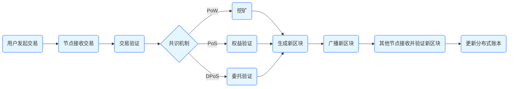

# 价值投资中的智能城市数字货币应用

> 关键词：价值投资、智能城市、数字货币、区块链、金融科技、城市治理、可持续发展

> 摘要：本文聚焦于价值投资领域中智能城市数字货币的应用。首先介绍了研究的背景和相关概念，阐述了智能城市数字货币的核心原理与架构。通过详细的算法原理讲解、数学模型分析，展示了其运行的内在逻辑。结合实际项目案例，深入剖析了代码实现和应用场景。同时推荐了相关的学习资源、开发工具和研究论文。最后探讨了该领域的未来发展趋势与挑战，旨在为投资者、城市管理者和相关从业者提供全面的技术与应用参考，促进智能城市数字货币在价值投资中的合理应用与发展。

## 1. 背景介绍 
### 1.1 目的和范围
本研究旨在深入探讨价值投资中智能城市数字货币的应用，分析其在智能城市建设和发展过程中的作用、机遇与挑战。研究范围涵盖智能城市数字货币的技术原理、应用场景、市场潜力以及对价值投资决策的影响等方面。通过综合研究，为投资者提供关于智能城市数字货币的全面认识，帮助其制定合理的投资策略，同时为城市管理者提供数字货币在城市治理中应用的参考，推动智能城市的可持续发展。

### 1.2 预期读者
本文预期读者包括但不限于价值投资者、金融从业者、城市规划师、智能城市建设者、区块链技术开发者、政策制定者以及对智能城市和数字货币领域感兴趣的研究人员。不同读者群体可以从本文中获取与自身专业和关注点相关的信息，如投资者关注投资机会和风险，开发者关注技术实现细节，城市管理者关注城市治理应用等。

### 1.3 文档结构概述
本文将按照以下结构展开：首先介绍背景信息，包括研究目的、预期读者和文档结构概述，以及相关术语的定义和解释。接着阐述智能城市数字货币的核心概念、原理和架构，通过流程图和文本示意图进行直观展示。然后详细讲解核心算法原理和具体操作步骤，并结合Python源代码进行说明。之后分析数学模型和公式，通过举例加深理解。再通过项目实战案例，介绍开发环境搭建、源代码实现和代码解读。随后探讨智能城市数字货币的实际应用场景。推荐相关的学习资源、开发工具和研究论文。最后总结未来发展趋势与挑战，提供常见问题解答和扩展阅读参考资料。

### 1.4 术语表
#### 1.4.1 核心术语定义
- **价值投资**：一种基于对资产内在价值的分析，通过寻找被低估的资产进行投资，以获取长期稳定回报的投资策略。
- **智能城市**：利用现代信息技术，如物联网、大数据、人工智能等，对城市的基础设施、公共服务、管理决策等进行智能化升级和优化，提高城市运行效率和居民生活质量的城市发展模式。
- **数字货币**：以数字形式存在的货币，通常基于密码学技术和分布式账本技术，具有去中心化、匿名性、可追溯性等特点。
- **区块链**：一种分布式账本技术，通过去中心化的共识机制，确保数据的不可篡改和透明性，为数字货币的运行提供技术支持。

#### 1.4.2 相关概念解释
- **去中心化**：在区块链网络中，不存在单一的中心化管理机构，所有节点共同参与数据的存储、验证和维护，确保系统的公平性和可靠性。
- **共识机制**：区块链网络中用于达成节点间数据一致性的算法，常见的共识机制有工作量证明（PoW）、权益证明（PoS）等。
- **智能合约**：一种自动执行的合约，其条款以代码形式存储在区块链上，当满足预设条件时，合约自动执行，无需第三方干预。

#### 1.4.3 缩略词列表
- **PoW**：Proof of Work，工作量证明
- **PoS**：Proof of Stake，权益证明
- **IoT**：Internet of Things，物联网
- **AI**：Artificial Intelligence，人工智能
- **DApp**：Decentralized Application，去中心化应用

## 2. 核心概念与联系 
### 2.1 智能城市数字货币的概念
智能城市数字货币是指在智能城市环境中应用的数字货币，它结合了数字货币的技术特点和智能城市的发展需求，旨在为城市的经济、社会和环境发展提供创新的解决方案。智能城市数字货币可以作为一种新型的支付工具、价值存储手段和经济激励机制，促进城市内的资源优化配置和高效流通。

### 2.2 核心原理和架构
智能城市数字货币的核心原理基于区块链技术，通过分布式账本记录交易信息，确保数据的安全性和不可篡改。其架构主要包括以下几个层次：

#### 2.2.1 数据层
数据层是区块链的基础，存储着交易数据、区块头信息等。每个区块包含一定数量的交易记录，通过哈希算法将前一个区块的哈希值链接起来，形成一个链式结构。这种结构确保了数据的完整性和可追溯性。

#### 2.2.2 网络层
网络层负责节点之间的通信和数据传输。节点通过P2P网络相互连接，广播和接收交易信息和区块信息。网络层采用共识机制确保节点间的数据一致性，防止恶意节点的攻击。

#### 2.2.3 共识层
共识层是区块链的核心，决定了节点如何达成共识。常见的共识机制有工作量证明（PoW）、权益证明（PoS）、委托权益证明（DPoS）等。不同的共识机制具有不同的特点和适用场景，如PoW具有较高的安全性，但能耗较大；PoS则相对节能，更适合大规模应用。

#### 2.2.4 激励层
激励层通过代币奖励的方式激励节点参与区块链网络的维护和交易验证。节点通过完成一定的任务，如挖矿（PoW）或持有代币（PoS），获得相应的代币奖励。这种激励机制确保了网络的正常运行和节点的积极性。

#### 2.2.5 合约层
合约层支持智能合约的部署和执行。智能合约是一种自动执行的合约，其条款以代码形式存储在区块链上。当满足预设条件时，智能合约自动执行，实现自动化的业务流程。

#### 2.2.6 应用层
应用层是智能城市数字货币的具体应用场景，如支付结算、城市治理、公共服务、供应链管理等。通过不同的应用程序，实现数字货币在智能城市中的各种功能。

### 2.3 文本示意图
```plaintext
智能城市数字货币架构
|-- 数据层
|   |-- 交易数据
|   |-- 区块头信息
|-- 网络层
|   |-- P2P网络
|   |-- 节点通信
|-- 共识层
|   |-- 工作量证明（PoW）
|   |-- 权益证明（PoS）
|   |-- 委托权益证明（DPoS）
|-- 激励层
|   |-- 代币奖励
|-- 合约层
|   |-- 智能合约
|-- 应用层
|   |-- 支付结算
|   |-- 城市治理
|   |-- 公共服务
|   |-- 供应链管理
```

### 2.4 Mermaid 流程图


## 3. 核心算法原理 & 具体操作步骤 
### 3.1 工作量证明（PoW）算法原理
工作量证明（PoW）是一种常见的区块链共识算法，其核心思想是通过计算复杂的哈希函数来证明节点在网络中投入了一定的工作量。具体步骤如下：

1. **交易打包**：节点将接收到的交易信息打包成一个区块。
2. **添加随机数**：在区块头中添加一个随机数（Nonce）。
3. **计算哈希值**：对整个区块进行哈希计算，得到一个哈希值。
4. **验证难度目标**：检查计算得到的哈希值是否满足预设的难度目标。如果不满足，增加随机数的值，重新计算哈希值，直到满足难度目标为止。
5. **广播新区块**：当节点找到满足难度目标的哈希值后，将新区块广播到网络中。其他节点接收到新区块后，验证其合法性，如果合法，则将其添加到自己的区块链中。

### 3.2 Python 代码实现
```python
import hashlib
import time

class Block:
    def __init__(self, index, previous_hash, timestamp, data, nonce=0):
        self.index = index
        self.previous_hash = previous_hash
        self.timestamp = timestamp
        self.data = data
        self.nonce = nonce
        self.hash = self.calculate_hash()

    def calculate_hash(self):
        block_string = f"{self.index}{self.previous_hash}{self.timestamp}{self.data}{self.nonce}"
        return hashlib.sha256(block_string.encode()).hexdigest()

class Blockchain:
    def __init__(self):
        self.chain = [self.create_genesis_block()]
        self.difficulty = 4

    def create_genesis_block(self):
        return Block(0, "0", time.time(), "Genesis Block")

    def get_latest_block(self):
        return self.chain[-1]

    def proof_of_work(self, block):
        while block.hash[:self.difficulty] != "0" * self.difficulty:
            block.nonce += 1
            block.hash = block.calculate_hash()
        return block

    def add_block(self, new_block):
        new_block.previous_hash = self.get_latest_block().hash
        new_block = self.proof_of_work(new_block)
        self.chain.append(new_block)

# 示例使用
blockchain = Blockchain()
block1 = Block(1, "", time.time(), "Transaction Data 1")
blockchain.add_block(block1)
block2 = Block(2, "", time.time(), "Transaction Data 2")
blockchain.add_block(block2)

for block in blockchain.chain:
    print(f"Index: {block.index}")
    print(f"Hash: {block.hash}")
    print(f"Previous Hash: {block.previous_hash}")
    print(f"Data: {block.data}")
    print(f"Nonce: {block.nonce}")
    print()
```

### 3.3 代码解释
- **Block 类**：表示区块链中的一个区块，包含区块的索引、前一个区块的哈希值、时间戳、交易数据、随机数和当前区块的哈希值。`calculate_hash` 方法用于计算区块的哈希值。
- **Blockchain 类**：表示整个区块链，包含一个区块列表和难度目标。`create_genesis_block` 方法创建创世区块，`get_latest_block` 方法返回最新的区块，`proof_of_work` 方法实现工作量证明算法，`add_block` 方法将新的区块添加到区块链中。

### 3.4 具体操作步骤
1. **初始化区块链**：创建一个区块链对象，初始化创世区块。
2. **创建新的区块**：根据交易数据创建新的区块对象。
3. **添加区块到区块链**：调用 `add_block` 方法，将新的区块添加到区块链中。在添加过程中，会自动执行工作量证明算法，找到满足难度目标的哈希值。
4. **验证区块链**：可以通过遍历区块链中的每个区块，验证其哈希值和前一个区块的哈希值是否正确，确保区块链的完整性。

## 4. 数学模型和公式 & 详细讲解 & 举例说明 
### 4.1 哈希函数的数学模型
哈希函数是区块链中非常重要的一部分，它将任意长度的输入数据映射为固定长度的输出数据。常见的哈希函数有SHA-256、RIPEMD-160等。以SHA-256为例，其数学模型可以表示为：

$$H: \{0, 1\}^* \to \{0, 1\}^{256}$$

其中，$H$ 表示哈希函数，$\{0, 1\}^*$ 表示任意长度的二进制输入数据，$\{0, 1\}^{256}$ 表示256位的二进制输出数据。

### 4.2 工作量证明的难度目标
工作量证明的难度目标是一个动态调整的值，用于控制挖矿的难度。难度目标通常用一个目标哈希值来表示，节点需要找到一个哈希值小于该目标哈希值的区块。难度目标的计算公式如下：

$$Target = \frac{2^{256}}{Difficulty}$$

其中，$Target$ 表示目标哈希值，$Difficulty$ 表示难度系数。难度系数越大，目标哈希值越小，挖矿的难度就越高。

### 4.3 举例说明
假设当前的难度系数为 $Difficulty = 1000$，则目标哈希值为：

$$Target = \frac{2^{256}}{1000} \approx 1.1579208923731619542357098500869 \times 10^{77}$$

节点需要不断尝试不同的随机数，计算区块的哈希值，直到找到一个小于该目标哈希值的哈希值为止。例如，节点计算得到的哈希值为：

$$Hash = 00000123456789ABCDEF...$$

如果该哈希值小于目标哈希值，则该区块被认为是有效的，可以广播到网络中。

### 4.4 智能合约的数学模型
智能合约可以用状态机的数学模型来表示。状态机由状态集合 $S$、输入集合 $I$、输出集合 $O$、转移函数 $\delta: S \times I \to S$ 和输出函数 $\lambda: S \times I \to O$ 组成。智能合约的执行过程可以看作是状态机在不同状态之间的转移，根据输入信息和当前状态，通过转移函数更新状态，并通过输出函数产生相应的输出。

例如，一个简单的智能合约用于管理数字资产的转移，其状态可以表示为账户余额，输入可以表示为转账请求，转移函数可以根据转账请求更新账户余额，输出函数可以返回转账结果。

## 5. 项目实战：代码实际案例和详细解释说明 
### 5.1  开发环境搭建
#### 5.1.1 安装Python
首先，确保你已经安装了Python 3.x 版本。可以从Python官方网站（https://www.python.org/downloads/） 下载并安装适合你操作系统的Python版本。

#### 5.1.2 安装必要的库
在项目中，我们使用了Python的 `hashlib` 和 `time` 库，这些库是Python的标准库，无需额外安装。如果需要进行更复杂的开发，可能需要安装其他相关的库，如 `web3.py` 用于与以太坊区块链交互，`Flask` 用于搭建Web应用等。可以使用 `pip` 命令进行安装：

```sh
pip install web3 flask
```

#### 5.1.3 选择开发工具
可以选择使用文本编辑器（如VS Code、PyCharm等）进行代码开发。这些工具提供了代码高亮、自动补全、调试等功能，方便开发和调试代码。

### 5.2  源代码详细实现和代码解读
#### 5.2.1 实现一个简单的数字货币系统
```python
import hashlib
import time

class Transaction:
    def __init__(self, sender, receiver, amount):
        self.sender = sender
        self.receiver = receiver
        self.amount = amount

    def __str__(self):
        return f"Sender: {self.sender}, Receiver: {self.receiver}, Amount: {self.amount}"

class Block:
    def __init__(self, index, previous_hash, timestamp, transactions, nonce=0):
        self.index = index
        self.previous_hash = previous_hash
        self.timestamp = timestamp
        self.transactions = transactions
        self.nonce = nonce
        self.hash = self.calculate_hash()

    def calculate_hash(self):
        block_string = f"{self.index}{self.previous_hash}{self.timestamp}{[str(t) for t in self.transactions]}{self.nonce}"
        return hashlib.sha256(block_string.encode()).hexdigest()

class Blockchain:
    def __init__(self):
        self.chain = [self.create_genesis_block()]
        self.difficulty = 4

    def create_genesis_block(self):
        transactions = [Transaction("Genesis", "Genesis", 0)]
        return Block(0, "0", time.time(), transactions)

    def get_latest_block(self):
        return self.chain[-1]

    def proof_of_work(self, block):
        while block.hash[:self.difficulty] != "0" * self.difficulty:
            block.nonce += 1
            block.hash = block.calculate_hash()
        return block

    def add_block(self, new_block):
        new_block.previous_hash = self.get_latest_block().hash
        new_block = self.proof_of_work(new_block)
        self.chain.append(new_block)

    def is_chain_valid(self):
        for i in range(1, len(self.chain)):
            current_block = self.chain[i]
            previous_block = self.chain[i - 1]

            if current_block.hash != current_block.calculate_hash():
                return False

            if current_block.previous_hash != previous_block.hash:
                return False

        return True

# 示例使用
blockchain = Blockchain()
transaction1 = Transaction("Alice", "Bob", 10)
transaction2 = Transaction("Bob", "Charlie", 5)
block1 = Block(1, "", time.time(), [transaction1, transaction2])
blockchain.add_block(block1)

print("Is blockchain valid?", blockchain.is_chain_valid())
```

#### 5.2.2 代码解读
- **Transaction 类**：表示一笔交易，包含发送者、接收者和交易金额。
- **Block 类**：表示区块链中的一个区块，包含区块的索引、前一个区块的哈希值、时间戳、交易列表、随机数和当前区块的哈希值。`calculate_hash` 方法用于计算区块的哈希值。
- **Blockchain 类**：表示整个区块链，包含一个区块列表和难度目标。`create_genesis_block` 方法创建创世区块，`get_latest_block` 方法返回最新的区块，`proof_of_work` 方法实现工作量证明算法，`add_block` 方法将新的区块添加到区块链中，`is_chain_valid` 方法用于验证区块链的完整性。

### 5.3  代码解读与分析
#### 5.3.1 交易处理
在这个简单的数字货币系统中，交易被封装在 `Transaction` 类中。每个交易包含发送者、接收者和交易金额。当创建一个新的区块时，可以将多个交易添加到区块中。

#### 5.3.2 工作量证明
工作量证明算法通过不断尝试不同的随机数，计算区块的哈希值，直到找到一个满足难度目标的哈希值为止。在 `proof_of_work` 方法中，通过循环不断增加随机数的值，重新计算哈希值，直到哈希值的前几位为零。

#### 5.3.3 区块链验证
`is_chain_valid` 方法用于验证区块链的完整性。它遍历区块链中的每个区块，检查每个区块的哈希值是否正确，以及前一个区块的哈希值是否匹配。如果发现任何不一致的地方，则认为区块链是无效的。

#### 5.3.4 扩展性
这个简单的数字货币系统可以进一步扩展，例如添加账户管理、交易签名、智能合约等功能。可以使用更复杂的共识算法，如权益证明（PoS）或委托权益证明（DPoS），提高系统的性能和效率。

## 6. 实际应用场景 
### 6.1 支付结算
智能城市数字货币可以作为一种便捷的支付工具，用于城市内的各种消费场景，如购物、交通、餐饮等。与传统支付方式相比，数字货币支付具有即时到账、低手续费、匿名性等优势。例如，居民可以使用数字货币在智能交通系统中支付公交、地铁费用，无需排队购票，提高出行效率。

### 6.2 城市治理
数字货币可以用于城市治理中的激励机制，鼓励居民参与城市建设和环境保护。例如，城市管理部门可以设立环保奖励计划，居民通过参与垃圾分类、节能减排等环保活动获得相应的数字货币奖励。这些数字货币可以在城市内的指定商家消费，促进经济发展和环境保护的良性循环。

### 6.3 公共服务
在公共服务领域，数字货币可以用于优化资源分配和提高服务效率。例如，政府可以通过数字货币发放社会福利、补贴等，确保资金直接到达受益人手中，减少中间环节的腐败和延误。同时，居民可以使用数字货币预约医疗服务、教育资源等，提高公共服务的可及性和公平性。

### 6.4 供应链管理
智能城市数字货币可以应用于供应链管理中，实现商品的溯源和交易的透明化。通过区块链技术，记录商品从生产、运输到销售的全过程信息，消费者可以通过扫描商品上的二维码查询商品的来源和质量信息。同时，数字货币可以用于供应链中的支付结算，提高交易效率和安全性。

### 6.5 房地产交易
在房地产交易中，数字货币可以简化交易流程，降低交易成本。买卖双方可以通过智能合约实现自动交易，无需中介机构的参与。数字货币的即时到账和可追溯性可以确保交易的安全性和透明度，减少欺诈和纠纷的发生。

## 7. 工具和资源推荐
### 7.1 学习资源推荐
#### 7.1.1 书籍推荐
- 《区块链：技术驱动金融》：全面介绍了区块链技术的原理、应用和发展趋势，是学习区块链的经典著作。
- 《数字货币：领导干部读本》：从政策和应用的角度介绍了数字货币的相关知识，适合政府官员和企业管理者阅读。
- 《Python区块链实战》：结合Python代码，详细讲解了区块链的实现原理和开发方法，适合有一定编程基础的读者。

#### 7.1.2 在线课程
- Coursera上的“区块链基础”课程：由知名大学教授授课，系统介绍了区块链的基本概念、技术原理和应用场景。
- edX上的“数字货币与区块链”课程：提供了深入的理论讲解和实践案例，帮助学习者掌握数字货币和区块链的核心知识。
- 网易云课堂上的“Python区块链开发实战”课程：通过实际项目案例，引导学习者使用Python开发区块链应用。

#### 7.1.3 技术博客和网站
- 巴比特（https://www.8btc.com/）：国内领先的区块链资讯平台，提供最新的区块链技术、行业动态和政策解读。
- 链闻（https://www.chainnews.com/）：专注于区块链行业的深度报道和分析，提供有价值的行业洞察和研究报告。
- Medium上的区块链相关博客：许多区块链专家和开发者在Medium上分享他们的技术经验和见解，可以从中获取最新的技术趋势和创新思路。

### 7.2 开发工具框架推荐
#### 7.2.1 IDE和编辑器
- PyCharm：一款专业的Python集成开发环境，提供了代码编辑、调试、版本控制等功能，适合Python开发。
- Visual Studio Code：一款轻量级的代码编辑器，支持多种编程语言和插件扩展，可用于区块链开发。
- Remix：以太坊官方提供的在线智能合约开发工具，支持Solidity语言的编写、调试和部署。

#### 7.2.2 调试和性能分析工具
- Ganache：一个以太坊区块链模拟器，用于本地开发和调试智能合约。可以模拟以太坊网络的环境，快速部署和测试智能合约。
- Truffle：一个以太坊开发框架，提供了项目管理、编译、部署、测试等功能，简化了智能合约的开发流程。
- Web3.py：一个Python库，用于与以太坊区块链进行交互。可以通过Web3.py实现账户管理、交易发送、智能合约调用等功能。

#### 7.2.3 相关框架和库
- Hyperledger Fabric：一个开源的企业级区块链平台，提供了高度可定制的区块链解决方案，适合构建复杂的企业级应用。
- EOSIO：一个高性能的区块链平台，支持大规模商业应用的开发。具有高吞吐量、低延迟等特点，适合构建分布式应用。
- Corda：一个专注于金融领域的区块链平台，提供了安全、高效的金融交易解决方案。适合银行、证券等金融机构的应用开发。

### 7.3 相关论文著作推荐
#### 7.3.1 经典论文
- “Bitcoin: A Peer-to-Peer Electronic Cash System”：比特币的白皮书，介绍了比特币的原理和实现方法，是区块链领域的经典文献。
- “Ethereum: A Next-Generation Smart Contract and Decentralized Application Platform”：以太坊的白皮书，阐述了以太坊的智能合约和去中心化应用平台的概念和设计。
- “The Byzantine Generals Problem”：介绍了拜占庭容错算法的原理和应用，是区块链共识机制的理论基础之一。

#### 7.3.2 最新研究成果
- 可以关注顶级学术会议（如ACM SIGCOMM、IEEE INFOCOM等）和期刊（如Journal of Cryptology、IEEE Transactions on Information Forensics and Security等）上的相关研究论文，了解区块链和数字货币领域的最新研究成果。
- 一些知名研究机构（如MIT Media Lab、Stanford Blockchain Lab等）也会发布相关的研究报告和论文，可以及时关注。

#### 7.3.3 应用案例分析
- 可以参考一些实际的区块链应用案例分析，了解区块链在不同领域的应用模式和效果。例如，IBM的区块链食品溯源解决方案、马士基的区块链物流解决方案等。

## 8. 总结：未来发展趋势与挑战
### 8.1 未来发展趋势
#### 8.1.1 政策支持与监管完善
随着数字货币和区块链技术的发展，各国政府将逐渐加强对该领域的政策支持和监管。一方面，政府可能会出台相关政策鼓励数字货币在智能城市中的应用，推动数字经济的发展；另一方面，也会加强对数字货币市场的监管，防范金融风险和违法犯罪活动。

#### 8.1.2 技术创新与融合
未来，智能城市数字货币技术将不断创新和融合。例如，将人工智能、物联网等技术与区块链技术相结合，实现更加智能化、自动化的城市管理和服务。同时，数字货币的共识算法、隐私保护技术等也将不断优化，提高系统的性能和安全性。

#### 8.1.3 应用场景拓展
智能城市数字货币的应用场景将不断拓展，除了现有的支付结算、城市治理、公共服务等领域，还将在更多领域得到应用，如能源管理、文化娱乐、教育等。数字货币将成为智能城市发展的重要支撑，促进城市的可持续发展。

#### 8.1.4 国际合作与标准制定
随着数字货币的全球化发展，国际合作和标准制定将变得越来越重要。各国将加强在数字货币领域的合作，共同推动数字货币的发展和应用。同时，也会制定统一的国际标准，促进数字货币的互联互通和互操作性。

### 8.2 挑战
#### 8.2.1 技术挑战
智能城市数字货币的发展面临着一些技术挑战，如区块链的性能瓶颈、隐私保护、智能合约的安全性等。需要不断研发和创新技术，提高系统的性能和安全性。

#### 8.2.2 监管挑战
数字货币的监管是一个全球性的难题，不同国家和地区的监管政策存在差异。需要建立统一的监管框架，平衡创新和风险，促进数字货币的健康发展。

#### 8.2.3 市场挑战
数字货币市场具有较高的波动性和不确定性，投资者需要具备较强的风险意识和投资能力。同时，市场上存在一些非法的数字货币项目和欺诈行为，需要加强市场监管和投资者教育。

#### 8.2.4 社会接受度挑战
数字货币的推广和应用需要得到社会的广泛接受和认可。一些人对数字货币的安全性、隐私性等存在疑虑，需要加强宣传和教育，提高社会对数字货币的认知和接受度。

## 9. 附录：常见问题与解答
### 9.1 智能城市数字货币与传统货币有什么区别？
智能城市数字货币与传统货币的主要区别在于其存在形式、发行机制和交易方式。传统货币以实物形式存在（如纸币、硬币）或电子账户形式存在（如银行存款），由中央银行发行和管理。而智能城市数字货币以数字形式存在，基于区块链技术发行和流通，具有去中心化、匿名性、可追溯性等特点。

### 9.2 智能城市数字货币的安全性如何保障？
智能城市数字货币的安全性主要通过区块链技术来保障。区块链采用分布式账本、加密算法和共识机制等技术手段，确保交易数据的不可篡改和透明性。同时，智能合约的自动执行和可编程性也可以提高交易的安全性和可靠性。

### 9.3 智能城市数字货币会对传统金融体系产生影响吗？
智能城市数字货币的发展可能会对传统金融体系产生一定的影响。一方面，数字货币的出现可能会改变人们的支付习惯和金融交易方式，对传统银行和支付机构造成竞争压力。另一方面，数字货币的发展也为金融创新提供了新的机遇，如数字货币借贷、数字资产交易等。

### 9.4 如何参与智能城市数字货币的投资？
参与智能城市数字货币的投资需要谨慎。首先，需要了解数字货币的相关知识和市场风险。可以通过阅读相关书籍、文章，参加培训课程等方式进行学习。其次，选择合法合规的数字货币交易平台进行投资。在投资过程中，要注意风险控制，合理配置资产，避免盲目跟风投资。

### 9.5 智能城市数字货币的发展前景如何？
智能城市数字货币的发展前景广阔。随着智能城市建设的不断推进，数字货币在城市治理、公共服务、经济发展等方面的应用将越来越广泛。同时，技术的不断创新和政策的支持也将为数字货币的发展提供有力保障。然而，数字货币的发展也面临着一些挑战，需要不断探索和解决。

## 10. 扩展阅读 & 参考资料
### 10.1 扩展阅读
- 《区块链革命：比特币底层技术如何改变货币、商业和世界》
- 《数字经济：从概念到实践》
- 《智能城市：技术、应用与未来发展》

### 10.2 参考资料
- Nakamoto, S. (2008). Bitcoin: A Peer-to-Peer Electronic Cash System.
- Wood, G. (2014). Ethereum: A Next-Generation Smart Contract and Decentralized Application Platform.
- Lamport, L., Shostak, R., & Pease, M. (1982). The Byzantine Generals Problem. ACM Transactions on Programming Languages and Systems (TOPLAS), 4(3), 382-401.
- 相关政府部门发布的数字货币政策文件和研究报告
- 区块链和数字货币领域的行业资讯和研究报告