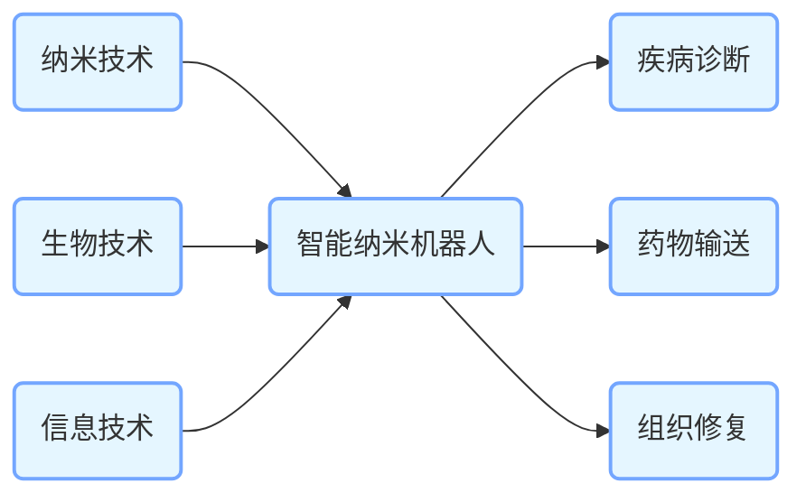

# 价值投资中的智能纳米机器人医疗应用分析

> 关键词：价值投资、智能纳米机器人、医疗应用、投资潜力、技术挑战

> 摘要：本文聚焦于价值投资视角下智能纳米机器人在医疗领域的应用。首先介绍了相关背景信息，包括目的范围、预期读者等内容。接着阐述了智能纳米机器人的核心概念、联系以及其工作的核心算法原理和具体操作步骤，借助 Python 代码进行详细说明。同时给出了相关数学模型和公式，并举例解释。通过项目实战展示了智能纳米机器人医疗应用的代码实现与解读。探讨了其实际应用场景，推荐了学习和开发所需的工具与资源，包括书籍、在线课程、开发框架等。最后总结了智能纳米机器人医疗应用的未来发展趋势与挑战，还提供了常见问题解答及扩展阅读参考资料，旨在为投资者和技术爱好者全面剖析智能纳米机器人在医疗领域的投资价值与应用前景。

## 1. 背景介绍 
### 1.1 目的和范围
本研究的目的在于深入分析智能纳米机器人在医疗领域的应用，并从价值投资的角度评估其潜在价值。随着科技的不断进步，纳米技术在医疗领域的应用日益广泛，智能纳米机器人作为其中的关键技术，具有巨大的发展潜力。本研究将涵盖智能纳米机器人的技术原理、医疗应用场景、投资前景以及面临的挑战等方面，旨在为投资者和医疗行业从业者提供全面的参考。

### 1.2 预期读者
本文预期读者包括价值投资者、医疗行业从业者、科研人员以及对智能纳米机器人技术感兴趣的技术爱好者。对于价值投资者，本文将帮助他们了解智能纳米机器人医疗应用的投资潜力和风险；对于医疗行业从业者，本文将介绍最新的技术进展和应用案例；对于科研人员，本文将提供相关的技术原理和研究方向；对于技术爱好者，本文将激发他们对智能纳米机器人技术的兴趣和探索欲望。

### 1.3 文档结构概述
本文将按照以下结构进行组织：首先介绍背景信息，包括目的范围、预期读者等；接着阐述智能纳米机器人的核心概念、联系以及其工作的核心算法原理和具体操作步骤；然后给出相关数学模型和公式，并举例解释；通过项目实战展示智能纳米机器人医疗应用的代码实现与解读；探讨其实际应用场景；推荐学习和开发所需的工具与资源；总结智能纳米机器人医疗应用的未来发展趋势与挑战；提供常见问题解答及扩展阅读参考资料。

### 1.4 术语表
#### 1.4.1 核心术语定义
- **智能纳米机器人**：是一种尺寸在纳米级别（通常为 1 - 100 纳米）的微型机器人，能够执行特定的任务，如药物输送、疾病诊断等，具有智能化、自动化的特点。
- **价值投资**：是一种投资策略，强调通过分析资产的内在价值来选择投资对象，追求长期稳定的投资回报。
- **医疗应用**：指智能纳米机器人在医疗领域的各种应用，包括疾病诊断、治疗、预防等方面。

#### 1.4.2 相关概念解释
- **纳米技术**：是研究结构尺寸在 1 至 100 纳米范围内材料的性质和应用的一种技术。纳米技术为智能纳米机器人的研发提供了基础。
- **生物相容性**：指材料与生物体之间相互作用产生各种复杂的生物、物理、化学反应的一种性能。对于智能纳米机器人，良好的生物相容性是其在体内安全运行的关键。

#### 1.4.3 缩略词列表
- **DNA**：脱氧核糖核酸（Deoxyribonucleic Acid）
- **MRI**：磁共振成像（Magnetic Resonance Imaging）
- **MEMS**：微机电系统（Micro - Electro - Mechanical Systems）

## 2. 核心概念与联系 
### 2.1 智能纳米机器人的原理
智能纳米机器人的原理基于纳米技术、生物技术和信息技术的融合。从纳米技术角度来看，它利用纳米材料的特殊性质，如小尺寸效应、表面效应等，构建微型的机器人结构。在生物技术方面，智能纳米机器人可以与生物分子相互作用，实现对生物体内环境的感知和响应。信息技术则为智能纳米机器人提供了控制和通信的能力，使其能够按照预设的程序执行任务。

例如，基于 DNA 折纸技术的智能纳米机器人，通过设计特定的 DNA 序列，可以自组装成具有特定形状和功能的纳米结构。这些纳米结构可以携带药物分子，并通过与生物体内的特定靶点结合，实现精准的药物输送。

### 2.2 智能纳米机器人与医疗的联系
智能纳米机器人在医疗领域具有广泛的应用前景，主要体现在以下几个方面：
- **疾病诊断**：智能纳米机器人可以携带各种传感器，进入人体内部，实时监测生物标志物的变化，从而实现早期疾病的诊断。例如，纳米机器人可以检测血液中的癌细胞标志物，帮助医生早期发现癌症。
- **药物输送**：纳米机器人可以将药物精准地输送到病变部位，提高药物的疗效，减少副作用。例如，将抗癌药物包裹在纳米机器人中，直接输送到肿瘤组织，提高药物对肿瘤细胞的杀伤力。
- **组织修复**：智能纳米机器人可以参与组织修复过程，促进细胞的生长和再生。例如，纳米机器人可以携带生长因子，刺激受损组织的修复和再生。

### 2.3 核心概念的文本示意图
智能纳米机器人是一个多学科交叉的领域，其核心概念可以用以下文本示意图表示：

智能纳米机器人
|-- 纳米技术
|   |-- 纳米材料
|   |-- 纳米制造
|-- 生物技术
|   |-- 生物分子
|   |-- 细胞生物学
|-- 信息技术
|   |-- 传感器技术
|   |-- 通信技术
|   |-- 控制技术
|-- 医疗应用
|   |-- 疾病诊断
|   |-- 药物输送
|   |-- 组织修复

### 2.4 Mermaid 流程图


## 3. 核心算法原理 & 具体操作步骤 
### 3.1 核心算法原理
智能纳米机器人的核心算法主要包括运动控制算法、目标识别算法和任务执行算法。

#### 3.1.1 运动控制算法
运动控制算法的目的是使智能纳米机器人能够在复杂的生物体内环境中自主移动到目标位置。一种常见的运动控制算法是基于化学梯度的趋化性算法。该算法的原理是纳米机器人能够感知周围环境中化学物质的浓度梯度，并朝着浓度增加的方向移动。

以下是一个简单的基于 Python 的趋化性运动控制算法示例：
```python
import numpy as np

# 定义纳米机器人类
class Nanorobot:
    def __init__(self, position, speed):
        self.position = np.array(position)
        self.speed = speed

    def move_towards_gradient(self, gradient):
        # 计算移动方向
        direction = gradient / np.linalg.norm(gradient)
        # 计算移动距离
        movement = self.speed * direction
        # 更新位置
        self.position += movement
        return self.position
```

#### 3.1.2 目标识别算法
目标识别算法用于识别纳米机器人的目标，如癌细胞、病变组织等。一种常见的目标识别算法是基于生物标志物的识别算法。该算法通过检测生物标志物的存在和浓度来确定目标的位置和状态。

以下是一个简单的基于 Python 的目标识别算法示例：
```python
def target_recognition(biomarker_concentration, threshold):
    if biomarker_concentration > threshold:
        return True
    else:
        return False
```

#### 3.1.3 任务执行算法
任务执行算法根据目标识别的结果，控制纳米机器人执行相应的任务，如释放药物、采集样本等。

以下是一个简单的基于 Python 的任务执行算法示例：
```python
class Nanorobot:
    def __init__(self, position, speed, drug_payload):
        self.position = np.array(position)
        self.speed = speed
        self.drug_payload = drug_payload

    def execute_task(self, target_detected):
        if target_detected:
            # 释放药物
            self.drug_payload -= 1
            print("Drug released! Remaining payload:", self.drug_payload)
        else:
            print("No target detected. Continuing search...")
```

### 3.2 具体操作步骤
智能纳米机器人的具体操作步骤可以分为以下几个阶段：
1. **设计与制造**：根据任务需求，设计智能纳米机器人的结构和功能，并采用纳米制造技术进行制造。
2. **注入体内**：通过合适的途径将智能纳米机器人注入人体内部，如静脉注射、口服等。
3. **导航与定位**：利用运动控制算法，使纳米机器人在体内自主移动到目标位置。
4. **目标识别**：使用目标识别算法，检测和识别目标。
5. **任务执行**：根据目标识别的结果，执行相应的任务，如释放药物、采集样本等。
6. **回收或代谢**：任务完成后，纳米机器人可以通过回收或在体内自然代谢的方式从人体中清除。

## 4. 数学模型和公式 & 详细讲解 & 举例说明 
### 4.1 运动模型
智能纳米机器人的运动可以用牛顿第二定律来描述：
$$F = ma$$
其中，$F$ 是作用在纳米机器人上的合力，$m$ 是纳米机器人的质量，$a$ 是纳米机器人的加速度。

在生物体内环境中，纳米机器人受到的力主要包括化学驱动力、流体阻力等。化学驱动力可以表示为：
$$F_{chem} = k \nabla C$$
其中，$k$ 是化学驱动系数，$\nabla C$ 是化学物质的浓度梯度。

流体阻力可以用斯托克斯定律来描述：
$$F_{drag} = 6\pi\eta r v$$
其中，$\eta$ 是流体的粘度，$r$ 是纳米机器人的半径，$v$ 是纳米机器人的速度。

综合考虑化学驱动力和流体阻力，纳米机器人的运动方程可以表示为：
$$m\frac{dv}{dt} = k \nabla C - 6\pi\eta r v$$

### 4.2 目标识别模型
目标识别模型可以用概率模型来描述。假设生物标志物的浓度服从正态分布：
$$p(C) = \frac{1}{\sqrt{2\pi\sigma^2}} \exp\left(-\frac{(C - \mu)^2}{2\sigma^2}\right)$$
其中，$C$ 是生物标志物的浓度，$\mu$ 是均值，$\sigma$ 是标准差。

目标识别的概率可以表示为：
$$P(\text{target}) = \int_{C_{th}}^{\infty} p(C) dC$$
其中，$C_{th}$ 是识别阈值。

### 4.3 举例说明
假设一个智能纳米机器人的质量 $m = 10^{-15}$ kg，化学驱动系数 $k = 10^{-12}$ N/(mol/m³)，流体粘度 $\eta = 10^{-3}$ Pa·s，半径 $r = 10^{-8}$ m。在某一时刻，化学物质的浓度梯度 $\nabla C = 10$ mol/m⁴，纳米机器人的速度 $v = 10^{-6}$ m/s。

首先计算化学驱动力：
$$F_{chem} = k \nabla C = 10^{-12} \times 10 = 10^{-11} \text{ N}$$

然后计算流体阻力：
$$F_{drag} = 6\pi\eta r v = 6\pi \times 10^{-3} \times 10^{-8} \times 10^{-6} \approx 1.88 \times 10^{-16} \text{ N}$$

由于 $F_{chem} \gg F_{drag}$，可以忽略流体阻力的影响。根据牛顿第二定律，纳米机器人的加速度为：
$$a = \frac{F_{chem}}{m} = \frac{10^{-11}}{10^{-15}} = 10^4 \text{ m/s}^2$$

假设生物标志物的浓度服从正态分布，均值 $\mu = 5$ mol/m³，标准差 $\sigma = 1$ mol/m³，识别阈值 $C_{th} = 6$ mol/m³。则目标识别的概率为：
$$P(\text{target}) = \int_{6}^{\infty} \frac{1}{\sqrt{2\pi\times1^2}} \exp\left(-\frac{(C - 5)^2}{2\times1^2}\right) dC \approx 0.1587$$

## 5. 项目实战：代码实际案例和详细解释说明 
### 5.1  开发环境搭建
本项目使用 Python 进行开发，需要安装以下库：
- `numpy`：用于数值计算。
- `matplotlib`：用于可视化。

可以使用以下命令安装这些库：
```sh
pip install numpy matplotlib
```

### 5.2  源代码详细实现和代码解读
以下是一个完整的智能纳米机器人模拟程序的源代码：
```python
import numpy as np
import matplotlib.pyplot as plt

# 定义纳米机器人类
class Nanorobot:
    def __init__(self, position, speed, drug_payload):
        self.position = np.array(position)
        self.speed = speed
        self.drug_payload = drug_payload
        self.path = [self.position.copy()]

    def move_towards_gradient(self, gradient):
        # 计算移动方向
        direction = gradient / np.linalg.norm(gradient)
        # 计算移动距离
        movement = self.speed * direction
        # 更新位置
        self.position += movement
        self.path.append(self.position.copy())
        return self.position

    def execute_task(self, target_detected):
        if target_detected:
            # 释放药物
            self.drug_payload -= 1
            print("Drug released! Remaining payload:", self.drug_payload)
        else:
            print("No target detected. Continuing search...")

# 定义环境类
class Environment:
    def __init__(self, size, target_position, biomarker_gradient):
        self.size = size
        self.target_position = np.array(target_position)
        self.biomarker_gradient = np.array(biomarker_gradient)

    def get_gradient_at_position(self, position):
        # 简单假设梯度是恒定的
        return self.biomarker_gradient

    def is_target_detected(self, position, threshold):
        distance = np.linalg.norm(position - self.target_position)
        biomarker_concentration = 10 / (distance + 1)  # 简单的浓度模型
        if biomarker_concentration > threshold:
            return True
        else:
            return False

# 主程序
if __name__ == "__main__":
    # 初始化环境
    env = Environment(size=(100, 100), target_position=(80, 80), biomarker_gradient=(1, 1))
    # 初始化纳米机器人
    robot = Nanorobot(position=(10, 10), speed=1, drug_payload=10)

    # 模拟纳米机器人的运动
    for i in range(100):
        gradient = env.get_gradient_at_position(robot.position)
        robot.move_towards_gradient(gradient)
        target_detected = env.is_target_detected(robot.position, threshold=2)
        robot.execute_task(target_detected)

    # 可视化纳米机器人的路径
    path = np.array(robot.path)
    plt.plot(path[:, 0], path[:, 1], 'b-', label='Nanorobot path')
    plt.scatter(env.target_position[0], env.target_position[1], c='r', marker='x', label='Target')
    plt.xlabel('X')
    plt.ylabel('Y')
    plt.title('Nanorobot Movement Simulation')
    plt.legend()
    plt.grid(True)
    plt.show()
```

### 5.3  代码解读与分析
1. **Nanorobot 类**：定义了纳米机器人的属性和方法。`__init__` 方法初始化纳米机器人的位置、速度和药物负载，并记录其运动路径。`move_towards_gradient` 方法根据化学梯度更新纳米机器人的位置。`execute_task` 方法根据目标检测结果执行相应的任务。
2. **Environment 类**：定义了环境的属性和方法。`__init__` 方法初始化环境的大小、目标位置和生物标志物梯度。`get_gradient_at_position` 方法返回指定位置的化学梯度。`is_target_detected` 方法根据生物标志物浓度判断是否检测到目标。
3. **主程序**：初始化环境和纳米机器人，模拟纳米机器人的运动过程。在每个时间步，获取当前位置的化学梯度，更新纳米机器人的位置，检测目标并执行相应的任务。最后，使用 `matplotlib` 库可视化纳米机器人的运动路径。

## 6. 实际应用场景 
### 6.1 癌症治疗
智能纳米机器人在癌症治疗中具有巨大的应用潜力。纳米机器人可以携带抗癌药物，通过血液循环到达肿瘤组织，实现精准的药物输送。与传统的化疗方法相比，纳米机器人可以提高药物的疗效，减少对正常组织的副作用。例如，一些纳米机器人可以通过识别肿瘤细胞表面的特定标志物，主动靶向肿瘤细胞，然后释放药物进行治疗。

### 6.2 心血管疾病诊断与治疗
智能纳米机器人可以用于心血管疾病的诊断和治疗。纳米机器人可以携带传感器，检测血液中的生物标志物，如胆固醇、甘油三酯等，帮助医生早期诊断心血管疾病。此外，纳米机器人还可以用于血管修复，例如，纳米机器人可以携带生长因子，刺激受损血管的修复和再生。

### 6.3 神经系统疾病治疗
对于神经系统疾病，智能纳米机器人也有其独特的应用。纳米机器人可以穿越血脑屏障，到达大脑内部，对神经系统疾病进行诊断和治疗。例如，纳米机器人可以携带神经递质或药物，调节神经细胞的功能，治疗帕金森病、阿尔茨海默病等神经系统疾病。

### 6.4 药物研发
智能纳米机器人在药物研发中也可以发挥重要作用。纳米机器人可以作为药物载体，研究药物在体内的传输和作用机制。通过在纳米机器人上搭载不同的药物和传感器，可以实时监测药物的释放和疗效，为药物研发提供更准确的数据。

## 7. 工具和资源推荐
### 7.1 学习资源推荐
#### 7.1.1 书籍推荐
- 《纳米技术与生物医学》：这本书全面介绍了纳米技术在生物医学领域的应用，包括纳米材料、纳米器件、纳米机器人等方面的内容，适合作为入门教材。
- 《智能机器人学》：涵盖了智能机器人的基本原理、算法和应用，对于理解智能纳米机器人的控制和决策机制有很大帮助。

#### 7.1.2 在线课程
- Coursera 上的“纳米技术基础”课程：由知名大学的教授授课，系统地介绍了纳米技术的基本概念、制备方法和应用领域。
- edX 上的“生物医学工程前沿”课程：聚焦于生物医学工程的最新研究成果，包括智能纳米机器人在医疗领域的应用。

#### 7.1.3 技术博客和网站
- 纳米技术网（Nanowerk）：提供了纳米技术领域的最新研究动态、技术进展和应用案例，是了解纳米技术发展趋势的重要渠道。
- 生物医学工程学会官网（BMES）：发布生物医学工程领域的研究成果、会议信息和行业动态，对于关注智能纳米机器人医疗应用的读者有很大帮助。

### 7.2 开发工具框架推荐
#### 7.2.1 IDE和编辑器
- PyCharm：一款专业的 Python 集成开发环境，具有代码编辑、调试、版本控制等功能，适合开发智能纳米机器人模拟程序。
- Jupyter Notebook：一种交互式的开发环境，可以方便地进行代码编写、数据可视化和文档编写，适合进行科研和实验。

#### 7.2.2 调试和性能分析工具
- `pdb`：Python 内置的调试器，可以帮助开发者定位代码中的错误。
- `cProfile`：Python 标准库中的性能分析工具，可以分析代码的执行时间和函数调用关系，帮助优化代码性能。

#### 7.2.3 相关框架和库
- `NumPy`：用于数值计算的 Python 库，提供了高效的数组操作和数学函数，是智能纳米机器人模拟程序中常用的库。
- `Matplotlib`：用于数据可视化的 Python 库，可以绘制各种图表，如折线图、散点图等，方便展示纳米机器人的运动路径和实验结果。

### 7.3 相关论文著作推荐
#### 7.3.1 经典论文
- “Nanorobots for Drug Delivery: Challenges and Opportunities”：该论文讨论了智能纳米机器人在药物输送方面的挑战和机遇，是该领域的经典文献。
- “Biomimetic Nanorobots for Biomedical Applications”：介绍了仿生纳米机器人在生物医学领域的应用，为智能纳米机器人的设计和研发提供了新的思路。

#### 7.3.2 最新研究成果
- 定期关注《Nature Nanotechnology》、《Science Robotics》等顶级学术期刊，这些期刊会发表智能纳米机器人领域的最新研究成果。

#### 7.3.3 应用案例分析
- 可以参考一些实际应用案例的研究报告，如某些智能纳米机器人在癌症治疗临床试验中的效果分析，了解智能纳米机器人在实际应用中的性能和问题。

## 8. 总结：未来发展趋势与挑战
### 8.1 未来发展趋势
- **多功能集成**：未来的智能纳米机器人将具备更多的功能，如同时进行疾病诊断、治疗和监测，实现一站式的医疗服务。
- **智能化程度提高**：随着人工智能技术的发展，智能纳米机器人的智能化程度将不断提高，能够自主决策和适应复杂的生物体内环境。
- **与其他技术融合**：智能纳米机器人将与基因编辑技术、3D 打印技术等其他前沿技术融合，创造出更多的创新应用。

### 8.2 挑战
- **生物相容性问题**：确保智能纳米机器人在体内的生物相容性是一个关键挑战，需要研发出更安全、更有效的材料和表面修饰技术。
- **运动控制和导航**：在复杂的生物体内环境中实现精确的运动控制和导航仍然是一个难题，需要进一步研究和改进相关算法。
- **伦理和法律问题**：智能纳米机器人的应用涉及到许多伦理和法律问题，如隐私保护、责任界定等，需要建立相应的法规和准则。

## 9. 附录：常见问题与解答
### 9.1 智能纳米机器人对人体有副作用吗？
目前，智能纳米机器人的生物相容性是研究的重点之一。虽然大多数研究致力于开发对人体无害的纳米机器人，但在实际应用中，仍然可能存在一些潜在的副作用，如免疫反应、炎症等。未来需要进一步优化纳米机器人的设计和材料，以减少副作用的发生。

### 9.2 智能纳米机器人的制造成本高吗？
智能纳米机器人的制造成本目前相对较高，主要是由于纳米制造技术的复杂性和高精度要求。随着技术的不断进步和规模化生产的实现，制造成本有望逐渐降低。

### 9.3 智能纳米机器人如何在体内进行导航？
智能纳米机器人可以通过多种方式在体内进行导航，如化学梯度导航、磁场导航、光导航等。不同的导航方式适用于不同的应用场景，需要根据具体需求进行选择。

## 10. 扩展阅读 & 参考资料
### 10.1 扩展阅读
- 《纳米医学：从基础到临床》：深入探讨了纳米医学的各个方面，包括纳米材料、纳米器件、纳米机器人等在医学领域的应用。
- 《人工智能与机器人学》：介绍了人工智能技术在机器人领域的应用，对于理解智能纳米机器人的智能化发展有很大帮助。

### 10.2 参考资料
- 相关学术论文和研究报告，如《Nanomedicine: Nanotechnology, Biology, and Medicine》、《Journal of Controlled Release》等期刊上的文章。
- 行业标准和规范，如国际标准化组织（ISO）发布的相关标准。
- 专利文献，了解智能纳米机器人领域的最新技术创新。