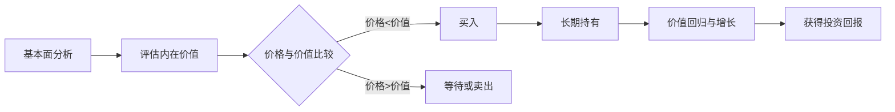
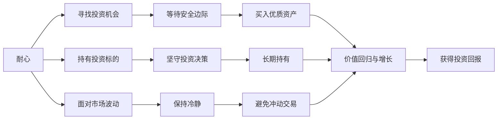

# 价值投资中的耐心：为什么等待是一种美德

> 关键词：价值投资、耐心、等待、投资回报、市场波动、长期主义、投资策略

> 摘要：本文深入探讨了价值投资中耐心的重要性。价值投资作为一种经典的投资理念，强调对资产内在价值的评估和长期持有。在投资过程中，市场充满了不确定性和波动，而耐心正是投资者应对这些情况的关键品质。通过分析耐心在价值投资各个环节的体现和作用，结合实际案例和理论知识，阐述了为什么等待在价值投资中是一种美德，同时也为投资者提供了在实践中培养和运用耐心的方法与思路。

## 1. 背景介绍 
### 1.1 目的和范围
本文的目的在于全面剖析价值投资中耐心的价值和意义。范围涵盖了价值投资的基本概念、耐心在投资决策、持有过程以及面对市场变化时的具体作用，还包括通过实际案例展示耐心如何影响投资回报，以及为投资者提供培养耐心的方法和策略。旨在帮助投资者深刻理解耐心在价值投资中的重要性，并在实际投资中更好地运用这一品质。

### 1.2 预期读者
本文预期读者主要包括对价值投资感兴趣的个人投资者、金融从业者、投资领域的研究者以及希望提升投资素养的人士。无论是初涉投资领域的新手，还是有一定经验的投资者，都能从本文中获得关于价值投资中耐心的深入见解和实用建议。

### 1.3 文档结构概述
本文首先介绍价值投资的背景知识和耐心在其中的重要性，接着阐述核心概念及它们之间的联系，包括价值投资的原理和耐心的作用机制。然后详细讲解价值投资的核心算法原理和具体操作步骤，通过数学模型和公式进一步说明投资决策的依据。在项目实战部分，通过实际案例展示价值投资中耐心的应用和效果。之后探讨价值投资耐心的实际应用场景，推荐相关的学习工具和资源。最后总结价值投资中耐心的未来发展趋势与挑战，解答常见问题，并提供扩展阅读和参考资料。

### 1.4 术语表
#### 1.4.1 核心术语定义
- **价值投资**：一种投资策略，基于对资产内在价值的分析，寻找价格低于内在价值的投资标的，并长期持有，以获取资产价值回归和增长带来的收益。
- **耐心**：在价值投资中，指投资者在等待合适的投资机会、持有投资标的过程中，面对市场波动和不确定性时保持冷静、不冲动决策的品质。
- **内在价值**：资产本身所具有的价值，通常通过对资产的基本面分析，如财务状况、行业前景、竞争优势等因素来评估。
- **市场波动**：市场价格在短期内的上下变动，受到多种因素的影响，如宏观经济环境、政策变化、投资者情绪等。
- **投资回报**：投资者通过投资所获得的收益，包括资本利得（资产价格上涨带来的收益）和股息、利息等收入。

#### 1.4.2 相关概念解释
- **长期主义**：在价值投资中，长期主义强调投资者要有长远的眼光，不被短期市场波动所左右，相信优质资产在长期内会实现价值增长。
- **安全边际**：指投资标的的市场价格低于其内在价值的幅度，安全边际越大，投资的风险越低。

#### 1.4.3 缩略词列表
- **PEG**：市盈率相对盈利增长比率（Price/Earnings to Growth Ratio），用于评估股票的估值是否合理。
- **DCF**：现金流折现模型（Discounted Cash Flow Model），一种用于估算资产内在价值的方法。

## 2. 核心概念与联系 

### 价值投资原理
价值投资的核心原理是认为市场并非总是有效的，资产的价格会在短期内偏离其内在价值。投资者的任务是通过深入的基本面分析，准确评估资产的内在价值，然后在价格低于内在价值时买入，等待价格回归内在价值并实现增值。

价值投资的基本流程可以用以下示意图表示：



### 耐心在价值投资中的作用机制
耐心在价值投资的各个环节都发挥着重要作用。在寻找投资机会阶段，耐心使投资者不急于出手，而是等待真正具有安全边际的投资标的出现。在持有阶段，面对市场的短期波动，耐心让投资者能够坚守投资决策，不被情绪左右而轻易卖出。耐心还体现在投资者对企业长期发展的信心上，相信优质企业在长期内会不断创造价值，从而获得丰厚的回报。

耐心与价值投资各环节的联系可以用以下示意图表示：



## 3. 核心算法原理 & 具体操作步骤 

### 价值评估算法原理
价值投资中常用的价值评估方法是现金流折现模型（DCF）。该模型的基本思想是将资产未来产生的现金流按照一定的折现率折现到当前时刻，得到资产的内在价值。

Python 代码实现 DCF 模型：

```python
def dcf_value(cash_flows, discount_rate):
    """
    计算现金流折现模型的内在价值
    :param cash_flows: 未来各期的现金流列表
    :param discount_rate: 折现率
    :return: 内在价值
    """
    present_value = 0
    for i, cash_flow in enumerate(cash_flows):
        present_value += cash_flow / (1 + discount_rate) ** (i + 1)
    return present_value

# 示例数据
cash_flows = [100, 120, 150, 180, 200]  # 未来 5 年的现金流
discount_rate = 0.1  # 折现率为 10%

# 计算内在价值
intrinsic_value = dcf_value(cash_flows, discount_rate)
print(f"内在价值: {intrinsic_value}")
```

### 具体操作步骤
1. **基本面分析**：收集和分析企业的财务报表、行业前景、竞争优势等信息，了解企业的经营状况和发展潜力。
2. **预测现金流**：根据企业的历史数据和未来发展规划，预测企业未来各期的现金流。
3. **确定折现率**：折现率反映了投资者对投资风险的预期，通常可以参考市场利率、行业平均收益率等因素来确定。
4. **计算内在价值**：使用 DCF 模型或其他价值评估方法，计算资产的内在价值。
5. **比较价格与价值**：将资产的市场价格与内在价值进行比较，如果市场价格低于内在价值，且存在足够的安全边际，则考虑买入。
6. **长期持有**：买入后，耐心持有投资标的，关注企业的基本面变化，而不是被短期市场波动所影响。

## 4. 数学模型和公式 & 详细讲解 & 举例说明 

### DCF 模型公式
DCF 模型的数学公式为：

$$V = \sum_{t=1}^{n} \frac{CF_t}{(1 + r)^t}$$

其中：
- $V$ 表示资产的内在价值
- $CF_t$ 表示第 $t$ 期的现金流
- $r$ 表示折现率
- $n$ 表示预测的期数

### 详细讲解
DCF 模型的核心在于将未来的现金流折现到当前时刻，考虑了货币的时间价值和投资的风险。折现率 $r$ 越高，说明投资者对投资风险的预期越高，未来现金流的现值就越低。预测的期数 $n$ 越长，模型的不确定性就越大，因此需要合理确定预测期数。

### 举例说明
假设一家企业未来 5 年的现金流分别为 100 万元、120 万元、150 万元、180 万元和 200 万元，折现率为 10%。则该企业的内在价值为：

$$V = \frac{100}{(1 + 0.1)^1} + \frac{120}{(1 + 0.1)^2} + \frac{150}{(1 + 0.1)^3} + \frac{180}{(1 + 0.1)^4} + \frac{200}{(1 + 0.1)^5}$$

```python
cash_flows = [100, 120, 150, 180, 200]
discount_rate = 0.1
intrinsic_value = dcf_value(cash_flows, discount_rate)
print(f"内在价值: {intrinsic_value} 万元")
```

通过计算得到该企业的内在价值约为 536.87 万元。如果该企业的市场价格低于 536.87 万元，且存在足够的安全边际，则可以考虑买入。

## 5. 项目实战：代码实际案例和详细解释说明 

### 5.1  开发环境搭建
- **编程语言**：Python 3.x
- **开发工具**：可以使用 PyCharm、Jupyter Notebook 等开发工具。
- **必要库**：需要安装 `pandas`、`numpy` 等数据处理库，用于处理和分析财务数据。

### 5.2  源代码详细实现和代码解读
以下是一个简单的价值投资案例，通过分析股票的财务数据，使用 DCF 模型评估股票的内在价值，并判断是否具有投资价值。

```python
import pandas as pd
import numpy as np

# 模拟股票的财务数据
data = {
    'Year': [2020, 2021, 2022, 2023, 2024],
    'Free Cash Flow': [100, 120, 150, 180, 200]  # 自由现金流
}

df = pd.DataFrame(data)

# 假设折现率为 10%
discount_rate = 0.1

# 计算现金流的现值
df['Present Value'] = df['Free Cash Flow'] / (1 + discount_rate) ** (df['Year'] - 2020 + 1)

# 计算内在价值
intrinsic_value = df['Present Value'].sum()

# 假设当前股票价格为 500
stock_price = 500

# 判断是否具有投资价值
if stock_price < intrinsic_value:
    print("该股票具有投资价值")
else:
    print("该股票不具有投资价值")

print(f"内在价值: {intrinsic_value}")
print(f"当前股票价格: {stock_price}")
```

### 5.3  代码解读与分析
1. **数据准备**：使用 `pandas` 库创建一个包含股票财务数据的 DataFrame，其中包括年份和自由现金流。
2. **计算现金流现值**：根据 DCF 模型的公式，计算每年自由现金流的现值，并添加到 DataFrame 中。
3. **计算内在价值**：将各年现金流的现值相加，得到股票的内在价值。
4. **判断投资价值**：将股票的市场价格与内在价值进行比较，如果市场价格低于内在价值，则认为该股票具有投资价值。

通过这个案例可以看出，价值投资需要投资者通过对企业财务数据的分析，准确评估企业的内在价值，并在价格低于价值时耐心等待投资机会。

## 6. 实际应用场景 
### 股票投资
在股票市场中，价值投资者通过深入研究上市公司的基本面，寻找那些被市场低估的股票。例如，一家具有良好业绩和发展前景的公司，由于短期市场情绪或行业波动导致股价下跌，价值投资者会耐心等待股价低于其内在价值时买入，并长期持有，等待股价回归价值并实现增长。

### 债券投资
在债券投资中，耐心同样重要。投资者需要评估债券的信用风险、利率风险等因素，选择具有较高性价比的债券。当市场利率波动导致债券价格下跌时，耐心的投资者会等待价格合适时买入，获取稳定的利息收益和可能的资本利得。

### 房地产投资
房地产投资也需要耐心。投资者需要对房地产市场的供需情况、地段价值、政策环境等进行分析，寻找被低估的房产。在购买后，耐心等待房产价值的提升，可能通过租金收入和房产增值获得回报。

### 创业投资
在创业投资领域，投资者需要耐心寻找具有潜力的创业项目。在投资后，要给予创业团队足够的时间和支持，等待项目的成长和发展。创业项目的成功往往需要较长的时间，投资者的耐心和信心至关重要。

## 7. 工具和资源推荐
### 7.1 学习资源推荐
#### 7.1.1 书籍推荐
- 《聪明的投资者》（The Intelligent Investor）：本杰明·格雷厄姆（Benjamin Graham）的经典著作，被誉为价值投资的圣经，深入阐述了价值投资的理念和方法。
- 《证券分析》（Security Analysis）：同样是格雷厄姆的著作，对证券分析的理论和实践进行了系统的介绍，是价值投资者的必读之书。
- 《巴菲特致股东的信》（Letters to Shareholders）：沃伦·巴菲特（Warren Buffett）每年写给股东的信，包含了他的投资哲学、经验和对市场的看法，是学习价值投资的宝贵资料。

#### 7.1.2 在线课程
- Coursera 上的“投资学原理”（Principles of Investing）课程：由知名教授授课，系统介绍投资学的基本原理和方法，包括价值投资的相关内容。
- edX 上的“金融市场”（Financial Markets）课程：耶鲁大学教授罗伯特·席勒（Robert Shiller）主讲，讲解金融市场的运行机制和投资策略，对价值投资有深入的探讨。

#### 7.1.3 技术博客和网站
- 雪球网（xueqiu.com）：国内知名的投资社区，汇聚了众多投资者和投资专家，提供丰富的投资资讯、研究报告和投资案例。
- Seeking Alpha（seekingalpha.com）：国外知名的投资研究网站，提供大量的股票分析、市场评论和投资策略，对价值投资有深入的研究和讨论。

### 7.2 开发工具框架推荐
#### 7.2.1 IDE和编辑器
- PyCharm：一款专业的 Python 集成开发环境，提供丰富的代码编辑、调试和分析功能，适合进行价值投资相关的数据分析和模型开发。
- Jupyter Notebook：一个交互式的开发环境，支持 Python、R 等多种编程语言，方便进行数据探索、模型验证和结果展示。

#### 7.2.2 调试和性能分析工具
- IPython：一个增强的 Python 交互式解释器，提供强大的调试和代码执行功能，方便进行代码调试和问题排查。
- cProfile：Python 内置的性能分析工具，可以帮助开发者分析代码的性能瓶颈，优化代码效率。

#### 7.2.3 相关框架和库
- pandas：一个强大的数据处理和分析库，提供了丰富的数据结构和数据操作方法，适合处理和分析财务数据。
- numpy：一个高性能的数值计算库，提供了多维数组和各种数学函数，用于进行数值计算和模型实现。

### 7.3 相关论文著作推荐
#### 7.3.1 经典论文
- 《有效市场假说》（Efficient Market Hypothesis）：由尤金·法玛（Eugene F. Fama）提出，探讨了市场效率的概念和分类，对价值投资理论的发展有重要影响。
- 《资本资产定价模型》（Capital Asset Pricing Model）：威廉·夏普（William F. Sharpe）等人提出的资产定价模型，为价值投资中的风险评估和收益计算提供了理论基础。

#### 7.3.2 最新研究成果
- 关注《金融研究》、《经济研究》等国内外知名学术期刊，了解价值投资领域的最新研究成果和发展趋势。
- 参加金融领域的学术会议和研讨会，与专家学者交流，获取最新的研究动态。

#### 7.3.3 应用案例分析
- 研究国内外知名价值投资者的投资案例，如巴菲特、查理·芒格（Charlie Munger）等的投资实践，分析他们的投资决策过程和策略，从中学习价值投资的方法和技巧。

## 8. 总结：未来发展趋势与挑战
### 未来发展趋势
- **科技应用加强**：随着科技的不断发展，大数据、人工智能等技术将在价值投资中得到更广泛的应用。通过对海量数据的分析和挖掘，投资者可以更准确地评估企业的内在价值，提高投资决策的效率和准确性。
- **全球投资机会增加**：经济全球化的趋势使得投资者有更多的机会参与全球市场的投资。价值投资者可以在全球范围内寻找被低估的资产，实现资产的多元化配置，降低投资风险。
- **社会责任投资兴起**：越来越多的投资者开始关注企业的社会责任和可持续发展，将环境、社会和治理（ESG）因素纳入价值投资的考量范围。未来，社会责任投资有望成为价值投资的重要发展方向。

### 挑战
- **市场不确定性增加**：全球经济政治环境的不确定性增加，如贸易摩擦、地缘政治冲突等，给市场带来了更多的波动和风险。价值投资者需要更加谨慎地评估投资环境，应对市场的不确定性。
- **信息过载**：互联网的发展使得信息传播速度加快，投资者面临着海量的信息。如何从众多信息中筛选出有价值的信息，准确评估企业的内在价值，是价值投资者面临的一大挑战。
- **投资者情绪影响**：投资者情绪在市场中起着重要作用，市场的短期波动容易引发投资者的情绪波动，导致冲动决策。价值投资者需要保持冷静和理性，克服情绪的影响，坚守投资原则。

## 9. 附录：常见问题与解答
### 问题 1：价值投资是否适合所有投资者？
价值投资需要投资者具备一定的财务知识和分析能力，以及耐心和长期投资的理念。对于那些追求短期高收益、缺乏耐心的投资者来说，价值投资可能并不适合。但对于那些希望实现资产长期稳健增值的投资者来说，价值投资是一种值得尝试的投资策略。

### 问题 2：如何判断一个企业的内在价值？
判断企业的内在价值需要综合考虑多个因素，如企业的财务状况、行业前景、竞争优势、管理团队等。常用的方法包括现金流折现模型、市盈率法、市净率法等。投资者需要深入研究企业的基本面，结合多种方法进行评估。

### 问题 3：价值投资需要多长时间才能获得回报？
价值投资是一种长期投资策略，回报的时间因人而异。有些投资可能在几年内就能获得显著的回报，而有些投资可能需要更长的时间。投资者需要有足够的耐心，相信优质企业在长期内会实现价值增长。

### 问题 4：在市场波动较大时，如何保持耐心？
在市场波动较大时，投资者可以通过以下方法保持耐心：一是深入了解自己投资的企业，对企业的基本面有信心；二是制定合理的投资计划和风险控制策略，避免因市场波动而冲动决策；三是学习投资知识，提高自己的投资素养，增强对市场波动的承受能力。

## 10. 扩展阅读 & 参考资料
### 扩展阅读
- 《漫步华尔街》（A Random Walk Down Wall Street）：伯顿·马尔基尔（Burton G. Malkiel）的著作，对各种投资理论和策略进行了全面的介绍和分析，有助于投资者拓宽投资视野。
- 《投资最重要的事》（The Most Important Thing Illuminated）：霍华德·马克斯（Howard Marks）的著作，分享了他在投资领域的经验和智慧，对价值投资的实践有重要的指导意义。

### 参考资料
- 本杰明·格雷厄姆. 《聪明的投资者》[M]. 人民邮电出版社, 2016.
- 沃伦·巴菲特. 《巴菲特致股东的信》[M]. 机械工业出版社, 2018.
- Eugene F. Fama. Efficient Capital Markets: A Review of Theory and Empirical Work[J]. The Journal of Finance, 1970.
- William F. Sharpe. Capital Asset Prices: A Theory of Market Equilibrium Under Conditions of Risk[J]. The Journal of Finance, 1964.