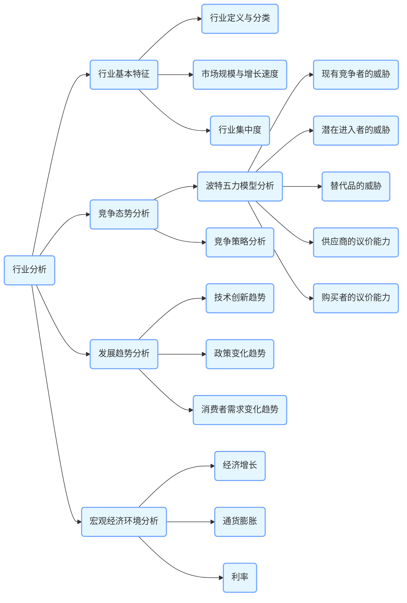

# 价值投资中的行业分析方法

> 关键词：价值投资、行业分析、竞争格局、市场趋势、财务指标

> 摘要：本文聚焦于价值投资中的行业分析方法，深入探讨其在投资决策中的重要性与具体操作。首先介绍行业分析的背景知识，包括目的、预期读者等内容。接着阐述核心概念及联系，通过清晰的示意图和流程图呈现。然后详细讲解核心算法原理及操作步骤，结合 Python 源代码辅助理解。再运用数学模型和公式进行理论剖析并举例说明。通过项目实战展示代码案例及解读。之后探讨实际应用场景，推荐相关工具和资源，包括学习资料、开发工具、论文著作等。最后总结未来发展趋势与挑战，提供常见问题解答及扩展阅读参考资料，旨在为投资者提供全面、深入的行业分析方法指导，助力其在价值投资中做出更明智的决策。

## 1. 背景介绍 
### 1.1 目的和范围
价值投资强调通过对企业内在价值的评估来选择投资标的，而行业分析是价值投资过程中不可或缺的一环。本文章的目的在于系统地介绍价值投资中行业分析的方法，帮助投资者更好地理解不同行业的特点、竞争格局、发展趋势等，从而筛选出具有投资价值的行业和企业。

文章的范围涵盖了行业分析的各个方面，包括核心概念、算法原理、数学模型、实际案例以及相关工具和资源等，旨在为读者提供一个全面、深入的行业分析知识体系。

### 1.2 预期读者
本文预期读者主要包括以下几类人群：
1. **投资者**：无论是个人投资者还是机构投资者，希望通过行业分析来优化投资组合，提高投资回报率。
2. **金融从业者**：如分析师、基金经理等，需要深入了解行业动态，为客户提供专业的投资建议。
3. **学生和研究人员**：对价值投资和行业分析感兴趣，希望通过学习相关知识来深入了解金融市场和投资领域。
4. **企业管理者**：了解所在行业的竞争态势和发展趋势，有助于制定企业的战略规划和决策。

### 1.3 文档结构概述
本文将按照以下结构进行组织：
1. **背景介绍**：阐述文章的目的、预期读者、文档结构概述以及相关术语表。
2. **核心概念与联系**：介绍行业分析的核心概念，通过文本示意图和 Mermaid 流程图展示其原理和架构。
3. **核心算法原理 & 具体操作步骤**：详细讲解行业分析的核心算法原理，并结合 Python 源代码进行说明。
4. **数学模型和公式 & 详细讲解 & 举例说明**：运用数学模型和公式对行业分析进行理论剖析，并通过实际例子进行说明。
5. **项目实战：代码实际案例和详细解释说明**：通过实际项目案例展示行业分析的代码实现和详细解读。
6. **实际应用场景**：探讨行业分析在价值投资中的实际应用场景。
7. **工具和资源推荐**：推荐相关的学习资源、开发工具、论文著作等。
8. **总结：未来发展趋势与挑战**：总结行业分析的未来发展趋势和面临的挑战。
9. **附录：常见问题与解答**：解答读者在行业分析过程中常见的问题。
10. **扩展阅读 & 参考资料**：提供相关的扩展阅读材料和参考资料。

### 1.4 术语表
#### 1.4.1 核心术语定义
1. **价值投资**：一种投资策略，通过对企业内在价值的评估，选择被低估的股票进行投资，以获取长期的投资回报。
2. **行业分析**：对特定行业的市场结构、竞争格局、发展趋势、政策环境等进行全面、深入的研究和分析。
3. **竞争格局**：指行业内企业之间的竞争关系和市场份额分布情况。
4. **市场趋势**：指行业市场规模、增长率、需求变化等方面的发展趋势。
5. **财务指标**：用于评估企业财务状况和经营业绩的指标，如净利润、净资产收益率、市盈率等。

#### 1.4.2 相关概念解释
1. **行业生命周期**：指行业从诞生到衰退的整个过程，通常包括初创期、成长期、成熟期和衰退期四个阶段。
2. **波特五力模型**：一种用于分析行业竞争态势的工具，包括现有竞争者的威胁、潜在进入者的威胁、替代品的威胁、供应商的议价能力和购买者的议价能力。
3. **SWOT 分析**：一种综合分析企业内部优势（Strengths）、劣势（Weaknesses）、外部机会（Opportunities）和威胁（Threats）的方法。

#### 1.4.3 缩略词列表
1. **PE**：市盈率（Price - Earnings Ratio）
2. **ROE**：净资产收益率（Return on Equity）
3. **EPS**：每股收益（Earnings Per Share）

## 2. 核心概念与联系 

### 核心概念原理
行业分析的核心概念主要围绕行业的基本特征、竞争态势、发展趋势以及与宏观经济环境的关系展开。

行业的基本特征包括行业的定义、分类、市场规模、增长速度等。了解这些特征有助于投资者初步判断行业的吸引力和发展潜力。

竞争态势分析是行业分析的重要内容之一。通过分析行业内企业之间的竞争关系、市场份额分布、竞争策略等，可以评估企业在行业中的竞争力和地位。

发展趋势分析关注行业未来的发展方向和变化趋势，如技术创新、政策变化、消费者需求变化等。把握行业发展趋势有助于投资者提前布局，获取投资机会。

宏观经济环境对行业的发展有着重要的影响。经济增长、通货膨胀、利率等宏观经济因素会影响行业的市场需求、成本结构和盈利能力。

### 架构的文本示意图
```plaintext
行业分析
|-- 行业基本特征
|   |-- 行业定义与分类
|   |-- 市场规模与增长速度
|   |-- 行业集中度
|-- 竞争态势分析
|   |-- 波特五力模型分析
|   |   |-- 现有竞争者的威胁
|   |   |-- 潜在进入者的威胁
|   |   |-- 替代品的威胁
|   |   |-- 供应商的议价能力
|   |   |-- 购买者的议价能力
|   |-- 竞争策略分析
|-- 发展趋势分析
|   |-- 技术创新趋势
|   |-- 政策变化趋势
|   |-- 消费者需求变化趋势
|-- 宏观经济环境分析
|   |-- 经济增长
|   |-- 通货膨胀
|   |-- 利率
```

### Mermaid 流程图


## 3. 核心算法原理 & 具体操作步骤 

### 核心算法原理
在行业分析中，我们可以使用一些量化的方法来评估行业的吸引力和企业的竞争力。以下是一些常用的算法原理：

1. **行业吸引力评估**：可以通过构建综合指标体系来评估行业的吸引力。综合指标可以包括市场规模、增长率、利润率、行业集中度等因素。计算公式如下：
   - 设 $I$ 为行业吸引力指数，$M$ 为市场规模，$G$ 为增长率，$P$ 为利润率，$C$ 为行业集中度。
   - 则 $I = w_1M + w_2G + w_3P + w_4C$，其中 $w_1, w_2, w_3, w_4$ 为各因素的权重，且 $w_1 + w_2 + w_3 + w_4 = 1$。

2. **企业竞争力评估**：可以使用财务指标来评估企业的竞争力。常用的财务指标包括净资产收益率（ROE）、市盈率（PE）、每股收益（EPS）等。

### 具体操作步骤

#### 步骤 1：数据收集
收集行业和企业的相关数据，包括市场规模、增长率、利润率、行业集中度、财务指标等。数据来源可以包括行业报告、上市公司年报、政府统计数据等。

#### 步骤 2：数据预处理
对收集到的数据进行清洗、整理和标准化处理，以确保数据的准确性和一致性。

#### 步骤 3：计算行业吸引力指数
根据上述公式计算行业吸引力指数，并对不同行业进行排名。

#### 步骤 4：计算企业竞争力指标
计算企业的财务指标，如 ROE、PE、EPS 等，并与行业平均水平进行比较。

#### 步骤 5：分析和决策
根据行业吸引力指数和企业竞争力指标，分析行业和企业的投资价值，并做出投资决策。

### Python 源代码实现
```python
import pandas as pd

# 步骤 1：数据收集（假设数据已经存储在 CSV 文件中）
data = pd.read_csv('industry_data.csv')

# 步骤 2：数据预处理
# 去除缺失值
data = data.dropna()

# 标准化处理（以市场规模为例）
market_size = data['market_size']
data['market_size_normalized'] = (market_size - market_size.min()) / (market_size.max() - market_size.min())

# 步骤 3：计算行业吸引力指数
# 定义各因素的权重
weights = {
    'market_size': 0.3,
    'growth_rate': 0.2,
    'profit_margin': 0.3,
    'industry_concentration': 0.2
}

# 计算行业吸引力指数
data['industry_attractiveness'] = (
    weights['market_size'] * data['market_size_normalized'] +
    weights['growth_rate'] * data['growth_rate'] +
    weights['profit_margin'] * data['profit_margin'] +
    weights['industry_concentration'] * data['industry_concentration']
)

# 对行业进行排名
data = data.sort_values(by='industry_attractiveness', ascending=False)

# 步骤 4：计算企业竞争力指标
# 假设数据中包含企业的财务指标
data['ROE'] = data['net_income'] / data['equity']
data['PE'] = data['market_price'] / data['EPS']

# 步骤 5：分析和决策
# 筛选出行业吸引力指数排名前 10 的行业
top_10_industries = data.head(10)
print(top_10_industries)
```

## 4. 数学模型和公式 & 详细讲解 & 举例说明 

### 行业吸引力评估模型
#### 数学公式
设 $I$ 为行业吸引力指数，$M$ 为市场规模，$G$ 为增长率，$P$ 为利润率，$C$ 为行业集中度。各因素的权重分别为 $w_1, w_2, w_3, w_4$，且 $w_1 + w_2 + w_3 + w_4 = 1$。则行业吸引力指数的计算公式为：
$$I = w_1M + w_2G + w_3P + w_4C$$

#### 详细讲解
- **市场规模（$M$）**：反映了行业的总体容量。市场规模越大，说明行业的发展空间越大，对投资者的吸引力也越大。
- **增长率（$G$）**：衡量了行业的发展速度。增长率越高，说明行业处于快速发展阶段，具有较大的投资潜力。
- **利润率（$P$）**：体现了行业的盈利能力。利润率越高，说明行业的盈利水平越好，投资者能够获得更高的回报。
- **行业集中度（$C$）**：反映了行业内企业的竞争格局。行业集中度越高，说明少数企业占据了较大的市场份额，行业的竞争程度相对较低，企业的盈利能力相对较强。

各因素的权重根据投资者的偏好和行业的特点进行设定。例如，对于处于快速发展阶段的行业，增长率的权重可以适当提高；对于成熟行业，利润率和行业集中度的权重可以适当提高。

#### 举例说明
假设我们要评估三个行业：行业 A、行业 B 和行业 C。各行业的相关数据如下表所示：

| 行业 | 市场规模（亿元） | 增长率（%） | 利润率（%） | 行业集中度（%） |
| ---- | ---- | ---- | ---- | ---- |
| 行业 A | 1000 | 10 | 15 | 60 |
| 行业 B | 800 | 15 | 12 | 50 |
| 行业 C | 1200 | 8 | 18 | 70 |

设各因素的权重分别为 $w_1 = 0.3$，$w_2 = 0.2$，$w_3 = 0.3$，$w_4 = 0.2$。

首先对市场规模进行标准化处理：
- 市场规模的最小值为 800 亿元，最大值为 1200 亿元。
- 行业 A 的市场规模标准化值为 $(1000 - 800) / (1200 - 800) = 0.5$
- 行业 B 的市场规模标准化值为 $(800 - 800) / (1200 - 800) = 0$
- 行业 C 的市场规模标准化值为 $(1200 - 800) / (1200 - 800) = 1$

然后计算各行业的行业吸引力指数：
- 行业 A：$I_A = 0.3×0.5 + 0.2×0.1 + 0.3×0.15 + 0.2×0.6 = 0.395$
- 行业 B：$I_B = 0.3×0 + 0.2×0.15 + 0.3×0.12 + 0.2×0.5 = 0.166$
- 行业 C：$I_C = 0.3×1 + 0.2×0.08 + 0.3×0.18 + 0.2×0.7 = 0.49$

根据计算结果，行业 C 的行业吸引力指数最高，其次是行业 A，行业 B 的行业吸引力指数最低。因此，从行业吸引力的角度来看，行业 C 是最具投资价值的行业。

### 企业竞争力评估模型
#### 数学公式
- **净资产收益率（ROE）**：$ROE = \frac{净利润}{净资产}$
- **市盈率（PE）**：$PE = \frac{股票价格}{每股收益}$
- **每股收益（EPS）**：$EPS = \frac{净利润}{总股本}$

#### 详细讲解
- **净资产收益率（ROE）**：反映了企业运用自有资本的效率。ROE 越高，说明企业的盈利能力越强，股东的回报越高。
- **市盈率（PE）**：衡量了股票的估值水平。PE 越低，说明股票的估值越低，投资价值越高。
- **每股收益（EPS）**：反映了每股股票的盈利水平。EPS 越高，说明每股股票的盈利能力越强。

#### 举例说明
假设某企业的净利润为 1000 万元，净资产为 5000 万元，股票价格为 20 元，总股本为 500 万股。

- 计算净资产收益率（ROE）：$ROE = \frac{1000}{5000} = 0.2 = 20\%$
- 计算每股收益（EPS）：$EPS = \frac{1000}{500} = 2$（元/股）
- 计算市盈率（PE）：$PE = \frac{20}{2} = 10$

通过与同行业其他企业的 ROE、PE、EPS 进行比较，可以评估该企业的竞争力。如果该企业的 ROE 高于行业平均水平，PE 低于行业平均水平，EPS 高于行业平均水平，则说明该企业具有较强的竞争力。

## 5. 项目实战：代码实际案例和详细解释说明 

### 5.1  开发环境搭建
在进行行业分析的项目实战之前，需要搭建相应的开发环境。以下是具体的步骤：

#### 安装 Python
Python 是一种广泛使用的编程语言，具有丰富的数据分析和机器学习库。可以从 Python 官方网站（https://www.python.org/downloads/）下载并安装 Python 3.x 版本。

#### 安装必要的库
在 Python 环境中，需要安装一些必要的库来进行数据处理、分析和可视化。可以使用以下命令来安装这些库：
```bash
pip install pandas numpy matplotlib seaborn
```
- **pandas**：用于数据处理和分析。
- **numpy**：用于数值计算。
- **matplotlib** 和 **seaborn**：用于数据可视化。

#### 准备数据
假设我们要分析的行业数据存储在 CSV 文件中，文件名为 `industry_data.csv`。数据包含以下列：
- `industry_name`：行业名称
- `market_size`：市场规模
- `growth_rate`：增长率
- `profit_margin`：利润率
- `industry_concentration`：行业集中度
- `net_income`：净利润
- `equity`：净资产
- `market_price`：股票价格
- `EPS`：每股收益

### 5.2  源代码详细实现和代码解读
```python
import pandas as pd
import numpy as np
import matplotlib.pyplot as plt
import seaborn as sns

# 步骤 1：数据收集
data = pd.read_csv('industry_data.csv')

# 步骤 2：数据预处理
# 去除缺失值
data = data.dropna()

# 标准化处理（以市场规模为例）
market_size = data['market_size']
data['market_size_normalized'] = (market_size - market_size.min()) / (market_size.max() - market_size.min())

# 步骤 3：计算行业吸引力指数
# 定义各因素的权重
weights = {
    'market_size': 0.3,
    'growth_rate': 0.2,
    'profit_margin': 0.3,
    'industry_concentration': 0.2
}

# 计算行业吸引力指数
data['industry_attractiveness'] = (
    weights['market_size'] * data['market_size_normalized'] +
    weights['growth_rate'] * data['growth_rate'] +
    weights['profit_margin'] * data['profit_margin'] +
    weights['industry_concentration'] * data['industry_concentration']
)

# 对行业进行排名
data = data.sort_values(by='industry_attractiveness', ascending=False)

# 步骤 4：计算企业竞争力指标
# 计算净资产收益率（ROE）
data['ROE'] = data['net_income'] / data['equity']

# 计算市盈率（PE）
data['PE'] = data['market_price'] / data['EPS']

# 步骤 5：数据可视化
# 绘制行业吸引力指数排名柱状图
plt.figure(figsize=(10, 6))
sns.barplot(x='industry_name', y='industry_attractiveness', data=data)
plt.title('Industry Attractiveness Ranking')
plt.xlabel('Industry Name')
plt.ylabel('Industry Attractiveness Index')
plt.xticks(rotation=45)
plt.show()

# 绘制 ROE 和 PE 的散点图
plt.figure(figsize=(10, 6))
sns.scatterplot(x='ROE', y='PE', data=data)
plt.title('ROE vs PE')
plt.xlabel('ROE')
plt.ylabel('PE')
plt.show()

# 步骤 6：分析和决策
# 筛选出行业吸引力指数排名前 10 的行业
top_10_industries = data.head(10)
print(top_10_industries)
```

### 5.3  代码解读与分析
1. **数据收集**：使用 `pandas` 库的 `read_csv` 函数读取存储在 CSV 文件中的行业数据。
2. **数据预处理**：使用 `dropna` 函数去除数据中的缺失值，然后对市场规模进行标准化处理，以便后续计算行业吸引力指数。
3. **计算行业吸引力指数**：根据定义的权重，计算每个行业的行业吸引力指数，并对行业进行排名。
4. **计算企业竞争力指标**：计算企业的净资产收益率（ROE）和市盈率（PE），用于评估企业的竞争力。
5. **数据可视化**：使用 `matplotlib` 和 `seaborn` 库绘制行业吸引力指数排名柱状图和 ROE 与 PE 的散点图，直观地展示数据。
6. **分析和决策**：筛选出行业吸引力指数排名前 10 的行业，为投资决策提供参考。

通过以上步骤，我们可以对行业数据进行全面的分析，评估行业的吸引力和企业的竞争力，从而做出更明智的投资决策。

## 6. 实际应用场景 
### 投资组合构建
在构建投资组合时，行业分析可以帮助投资者筛选出具有投资价值的行业和企业。通过对不同行业的吸引力和企业的竞争力进行评估，投资者可以将资金分配到不同的行业和企业中，以降低投资风险，提高投资回报率。

例如，投资者可以根据行业吸引力指数排名，选择排名靠前的行业进行投资。同时，结合企业的财务指标，选择具有较强竞争力的企业作为投资标的。

### 行业轮动策略
行业轮动策略是指根据不同行业的发展周期和市场趋势，在不同行业之间进行轮动投资。行业分析可以帮助投资者把握行业的发展趋势，及时调整投资组合，实现行业轮动。

例如，在经济复苏阶段，一些周期性行业如钢铁、汽车等可能会率先复苏，投资者可以增加对这些行业的投资；在经济繁荣阶段，消费、科技等行业可能会表现较好，投资者可以适当增加对这些行业的投资。

### 企业战略决策
对于企业管理者来说，行业分析可以帮助他们了解所在行业的竞争态势和发展趋势，制定企业的战略规划和决策。

例如，企业管理者可以通过分析行业的竞争格局，确定企业的竞争策略，如差异化竞争、成本领先竞争等。同时，根据行业的发展趋势，企业可以提前布局，进行技术创新、产品升级等，以提高企业的竞争力。

### 风险评估
行业分析可以帮助投资者评估投资的风险。不同行业的风险特征不同，例如，一些新兴行业可能具有较高的技术风险和市场风险，而一些传统行业可能面临市场饱和、竞争激烈等风险。

通过对行业的分析，投资者可以了解行业的风险特征，采取相应的风险控制措施，如分散投资、设置止损点等，以降低投资风险。

## 7. 工具和资源推荐
### 7.1 学习资源推荐
#### 7.1.1 书籍推荐
1. 《聪明的投资者》（The Intelligent Investor）：作者本杰明·格雷厄姆（Benjamin Graham），被誉为价值投资的圣经，书中详细介绍了价值投资的理念和方法。
2. 《证券分析》（Security Analysis）：同样是本杰明·格雷厄姆的经典著作，对证券分析的理论和实践进行了深入的探讨。
3. 《怎样选择成长股》（Common Stocks and Uncommon Profits）：作者菲利普·费雪（Philip Fisher），介绍了如何选择具有成长潜力的股票。
4. 《穷查理宝典》（Poor Charlie's Almanack）：作者彼得·考夫曼（Peter D. Kaufman），收录了查理·芒格（Charlie Munger）的演讲和文章，分享了他的投资智慧和人生哲学。

#### 7.1.2 在线课程
1. Coursera 上的 “Investment Management Specialization”：由哥伦比亚大学教授授课，涵盖了投资管理的各个方面，包括价值投资、资产定价、投资组合管理等。
2. edX 上的 “Finance for Everyone: Smart Tools for Decision-Making”：提供了金融知识的基础课程，帮助学习者了解投资决策的基本原理和方法。
3. 中国大学 MOOC 上的 “投资学”：由国内知名高校教授授课，系统地介绍了投资学的理论和实践。

#### 7.1.3 技术博客和网站
1. Seeking Alpha：一个提供股票分析、投资策略和市场评论的网站，有很多专业的投资者和分析师分享他们的观点和研究成果。
2. ValueInvestorsClub：一个价值投资者的社区，会员可以分享自己的投资研究和想法，是学习价值投资的重要资源。
3. 雪球网：国内知名的投资社区，提供股票行情、资讯、研究报告等内容，同时也有很多投资者分享自己的投资经验和见解。

### 7.2 开发工具框架推荐
#### 7.2.1 IDE和编辑器
1. PyCharm：一款专业的 Python 集成开发环境，具有代码编辑、调试、版本控制等功能，适合进行数据分析和机器学习项目的开发。
2. Jupyter Notebook：一种交互式的开发环境，可以在浏览器中编写和运行代码，方便进行数据探索和可视化。
3. Visual Studio Code：一款轻量级的代码编辑器，支持多种编程语言，具有丰富的插件生态系统，可以方便地进行 Python 开发。

#### 7.2.2 调试和性能分析工具
1. PDB：Python 自带的调试器，可以帮助开发者在代码中设置断点，逐步执行代码，查找问题。
2. cProfile：Python 标准库中的性能分析工具，可以统计代码的执行时间和函数调用次数，帮助开发者优化代码性能。
3. Py-Spy：一个用于分析 Python 程序性能的工具，可以实时监控 Python 程序的 CPU 使用率和函数调用情况。

#### 7.2.3 相关框架和库
1. Pandas：用于数据处理和分析的 Python 库，提供了高效的数据结构和数据操作方法。
2. NumPy：用于数值计算的 Python 库，提供了多维数组和各种数学函数。
3. Matplotlib 和 Seaborn：用于数据可视化的 Python 库，可以绘制各种类型的图表，如折线图、柱状图、散点图等。
4. Scikit-learn：用于机器学习的 Python 库，提供了各种机器学习算法和工具，如分类、回归、聚类等。

### 7.3 相关论文著作推荐
#### 7.3.1 经典论文
1. “The Capital Asset Pricing Model: Theory and Evidence”：由 Eugene F. Fama 和 Kenneth R. French 撰写，对资本资产定价模型进行了深入的研究和分析。
2. “Efficient Capital Markets: A Review of Theory and Empirical Work”：由 Eugene F. Fama 撰写，探讨了有效市场假说的理论和实证研究。
3. “Value versus Growth: The International Evidence”：由 Eugene F. Fama 和 Kenneth R. French 撰写，比较了价值投资和成长投资在国际市场上的表现。

#### 7.3.2 最新研究成果
1. SSRN（Social Science Research Network）：一个社会科学研究网络，提供了大量的最新研究论文和工作论文，涵盖了金融、经济学等领域。
2. Journal of Financial Economics：金融经济学领域的顶级学术期刊，发表了很多关于投资、资产定价、公司金融等方面的最新研究成果。
3. Review of Financial Studies：金融研究领域的重要学术期刊，发表了很多高质量的研究论文。

#### 7.3.3 应用案例分析
1. Harvard Business School Case Studies：哈佛商学院的案例库，提供了很多关于企业战略、投资决策等方面的实际案例分析。
2. McKinsey Global Institute Reports：麦肯锡全球研究所的报告，提供了很多关于行业趋势、市场动态等方面的研究和分析，包含了大量的实际应用案例。

## 8. 总结：未来发展趋势与挑战
### 未来发展趋势
1. **数字化和智能化**：随着科技的不断发展，行业分析将越来越依赖于数字化和智能化技术。大数据、人工智能、机器学习等技术将被广泛应用于行业数据的收集、分析和预测，提高行业分析的效率和准确性。
2. **跨行业融合**：不同行业之间的界限越来越模糊，跨行业融合的趋势越来越明显。在进行行业分析时，需要考虑到行业之间的相互影响和融合，以更全面地了解行业的发展趋势。
3. **可持续发展**：随着社会对环境保护、社会责任等问题的关注度不断提高，可持续发展将成为行业发展的重要趋势。在行业分析中，需要考虑到企业的可持续发展能力，如环境友好性、社会责任履行情况等。
4. **全球化**：经济全球化的趋势不断加强，行业的发展受到全球市场的影响越来越大。在进行行业分析时，需要关注全球市场的动态和趋势，以把握行业的发展机遇。

### 挑战
1. **数据质量和可用性**：行业分析需要大量的数据支持，但数据的质量和可用性往往是一个挑战。数据可能存在缺失、错误、不一致等问题，需要进行数据清洗和预处理。此外，一些数据可能难以获取，需要通过多种渠道进行收集。
2. **技术更新换代快**：数字化和智能化技术发展迅速，新的技术和方法不断涌现。行业分析人员需要不断学习和掌握新的技术和方法，以适应技术更新换代的速度。
3. **不确定性增加**：随着全球政治、经济环境的变化，行业发展面临的不确定性增加。例如，贸易摩擦、政策变化、自然灾害等因素都可能对行业的发展产生重大影响。在进行行业分析时，需要考虑到这些不确定性因素，提高分析的灵活性和适应性。
4. **人才短缺**：行业分析需要具备多学科知识和技能的人才，如经济学、金融学、统计学、计算机科学等。目前，市场上这类复合型人才相对短缺，培养和吸引优秀的行业分析人才是一个挑战。

## 9. 附录：常见问题与解答
### 1. 如何确定行业吸引力评估模型中各因素的权重？
确定行业吸引力评估模型中各因素的权重需要综合考虑多个因素，如行业的特点、投资者的偏好、市场环境等。一般来说，可以采用以下方法：
- **专家意见法**：咨询行业专家、投资顾问等专业人士，听取他们的意见和建议，确定各因素的权重。
- **历史数据分析法**：分析历史数据，观察各因素与行业投资回报率之间的关系，根据关系的强弱确定各因素的权重。
- **层次分析法（AHP）**：将各因素按照重要性进行排序，构建判断矩阵，通过计算判断矩阵的特征向量来确定各因素的权重。

### 2. 行业分析中如何处理定性因素？
行业分析中除了定量因素外，还存在很多定性因素，如行业的政策环境、技术创新能力、企业文化等。处理定性因素可以采用以下方法：
- **专家评分法**：邀请行业专家对定性因素进行评分，将评分结果转化为定量数据进行分析。
- **文本挖掘法**：对相关的文本信息进行挖掘和分析，提取有用的信息，如通过分析行业报告、新闻报道等获取行业的政策环境、技术创新趋势等信息。
- **案例分析法**：通过分析行业内的典型案例，了解定性因素对企业和行业发展的影响。

### 3. 如何判断行业处于生命周期的哪个阶段？
判断行业处于生命周期的哪个阶段可以从以下几个方面入手：
- **市场增长率**：初创期行业的市场增长率通常较高，成长期行业的市场增长率持续上升，成熟期行业的市场增长率逐渐稳定，衰退期行业的市场增长率下降。
- **产品创新程度**：初创期和成长期行业的产品创新程度较高，成熟期行业的产品创新速度减缓，衰退期行业的产品创新较少。
- **竞争格局**：初创期行业的竞争格局相对分散，成长期行业的竞争逐渐加剧，成熟期行业的竞争格局相对稳定，衰退期行业的竞争更加激烈，部分企业可能退出市场。
- **利润水平**：初创期行业的利润水平较低，甚至可能亏损，成长期行业的利润水平逐渐提高，成熟期行业的利润水平相对稳定，衰退期行业的利润水平下降。

### 4. 行业分析和公司分析有什么区别和联系？
#### 区别
- **分析对象**：行业分析的对象是整个行业，关注行业的市场结构、竞争格局、发展趋势等；公司分析的对象是单个企业，关注企业的财务状况、经营业绩、竞争优势等。
- **分析目的**：行业分析的目的是评估行业的吸引力和发展潜力，为投资决策提供行业层面的参考；公司分析的目的是评估企业的内在价值和投资价值，为投资决策提供企业层面的参考。

#### 联系
- **行业是企业的外部环境**：企业的发展受到所在行业的影响，行业的发展趋势和竞争格局会影响企业的经营业绩和市场竞争力。
- **企业是行业的组成部分**：企业的行为和决策也会影响行业的发展，如企业的技术创新、市场拓展等活动可能推动行业的发展。
- **相互补充**：在进行投资决策时，需要综合考虑行业分析和公司分析的结果，既要选择具有发展潜力的行业，又要选择在行业中具有竞争优势的企业。

## 10. 扩展阅读 & 参考资料
### 扩展阅读
1. 《金融炼金术》（The Alchemy of Finance）：作者乔治·索罗斯（George Soros），介绍了他的投资哲学和金融市场理论。
2. 《金融心理学》（The Psychology of Finance）：作者拉斯·特维德（Lars Tvede），探讨了投资者的心理因素对金融市场的影响。
3. 《黑天鹅》（The Black Swan）：作者纳西姆·尼古拉斯·塔勒布（Nassim Nicholas Taleb），讲述了不可预测的重大事件对金融市场和投资决策的影响。

### 参考资料
1. 各行业协会发布的行业报告和统计数据。
2. 上市公司的年报、季报等财务报告。
3. 政府部门发布的统计数据和政策文件。
4. 金融机构发布的研究报告和投资分析。
5. 相关的学术期刊和会议论文。