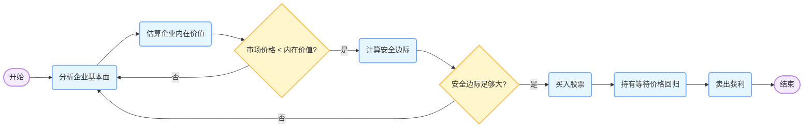

# 价值投资的核心原则：安全边际

> 关键词：价值投资、安全边际、投资原则、风险控制、内在价值

> 摘要：本文深入探讨价值投资中安全边际这一核心原则。首先介绍了价值投资及安全边际的背景知识，包括目的、预期读者等内容。接着阐述安全边际的核心概念与联系，分析其原理和架构。详细讲解了与安全边际相关的核心算法原理和具体操作步骤，用 Python 代码进行阐述。通过数学模型和公式对安全边际进行量化分析并举例说明。结合项目实战给出代码实际案例及详细解释。探讨了安全边际在实际投资场景中的应用，推荐了相关学习资源、开发工具框架以及论文著作。最后总结安全边际的未来发展趋势与挑战，解答常见问题并提供扩展阅读和参考资料，旨在帮助投资者深入理解和运用安全边际原则，实现更合理的投资决策。

## 1. 背景介绍 
### 1.1 目的和范围
价值投资作为一种历经时间考验的投资理念，在投资领域占据着重要地位。而安全边际则是价值投资的核心原则之一，它为投资者在复杂多变的市场环境中提供了重要的决策依据和风险控制手段。本文的目的在于全面、深入地探讨安全边际这一核心原则，从其基本概念、原理、算法、数学模型等理论层面，到实际应用场景、项目实战案例等实践层面进行系统阐述，帮助投资者更好地理解和运用安全边际原则，从而在投资过程中降低风险、提高收益。

本文的范围涵盖了价值投资中安全边际原则的各个方面，包括其定义、计算方法、在不同投资场景中的应用、相关工具和资源的推荐等，旨在为投资者提供一个全面、深入的关于安全边际原则的知识体系。

### 1.2 预期读者
本文预期读者主要包括以下几类人群：
- 初级投资者：对价值投资有一定兴趣，但尚未深入了解安全边际原则的新手投资者，通过本文可以系统地学习安全边际的基本概念和应用方法，为其投资实践提供理论指导。
- 有一定经验的投资者：希望进一步提升自己投资水平和风险控制能力的投资者，本文深入的原理分析和实际案例可以帮助他们更好地运用安全边际原则，优化投资决策。
- 金融专业学生和研究人员：对价值投资理论和实践感兴趣的学生和研究人员，本文可以作为他们学习和研究的参考资料，为其学术研究和专业学习提供有益的补充。
- 投资顾问和理财师：需要为客户提供专业投资建议的投资顾问和理财师，通过深入理解安全边际原则，可以更好地为客户制定投资策略，实现客户资产的保值增值。

### 1.3 文档结构概述
本文按照以下结构进行组织：
- 背景介绍：介绍价值投资中安全边际原则的目的、预期读者、文档结构概述以及相关术语表。
- 核心概念与联系：阐述安全边际的核心概念、原理和架构，并通过文本示意图和 Mermaid 流程图进行直观展示。
- 核心算法原理 & 具体操作步骤：详细讲解与安全边际相关的核心算法原理，并使用 Python 源代码进行具体操作步骤的阐述。
- 数学模型和公式 & 详细讲解 & 举例说明：通过数学模型和公式对安全边际进行量化分析，并结合具体例子进行详细讲解。
- 项目实战：代码实际案例和详细解释说明：结合实际项目，给出代码实际案例，并对代码进行详细的解读和分析。
- 实际应用场景：探讨安全边际在不同投资场景中的实际应用。
- 工具和资源推荐：推荐与安全边际和价值投资相关的学习资源、开发工具框架以及论文著作。
- 总结：未来发展趋势与挑战：总结安全边际原则的未来发展趋势，并分析其面临的挑战。
- 附录：常见问题与解答：解答读者在学习和应用安全边际原则过程中常见的问题。
- 扩展阅读 & 参考资料：提供相关的扩展阅读材料和参考资料，方便读者进一步深入学习。

### 1.4 术语表
#### 1.4.1 核心术语定义
- **价值投资**：一种基于对企业内在价值的分析，寻找被市场低估的证券进行投资的策略。投资者通过研究企业的财务状况、行业前景、竞争优势等因素，评估企业的内在价值，并在价格低于内在价值时买入，等待价格回归价值时获利。
- **安全边际**：指投资时股票的市场价格低于其内在价值的差额。安全边际为投资者提供了一定的缓冲空间，即使在企业未来发展出现一定偏差或市场环境不利的情况下，投资者仍有可能避免损失或获得一定的收益。
- **内在价值**：企业在其剩余寿命中可以产生的现金流量的折现值。内在价值是价值投资的核心概念之一，它是评估企业真实价值的重要依据。

#### 1.4.2 相关概念解释
- **市场价格**：指证券在市场上的交易价格，它受到供求关系、市场情绪、宏观经济环境等多种因素的影响，可能会偏离企业的内在价值。
- **折现率**：将未来的现金流量折算为现值的比率，反映了资金的时间价值和投资的风险程度。折现率越高，未来现金流量的现值越低。
- **现金流量**：企业在一定时期内产生的现金流入和现金流出的净额，是评估企业盈利能力和财务状况的重要指标。

#### 1.4.3 缩略词列表
- **DCF**：Discounted Cash Flow，现金流折现法，一种常用的评估企业内在价值的方法。
- **PE**：Price-to-Earnings Ratio，市盈率，指股票价格与每股收益的比率，是衡量股票估值的常用指标之一。
- **PB**：Price-to-Book Ratio，市净率，指股票价格与每股净资产的比率，也是衡量股票估值的常用指标之一。

## 2. 核心概念与联系 

### 安全边际的核心概念
安全边际是价值投资的核心原则之一，它体现了价值投资者对风险的重视和对投资确定性的追求。从本质上讲，安全边际是一种保护机制，它通过在股票市场价格低于其内在价值时进行投资，为投资者提供了一定的容错空间。即使在投资过程中出现一些意外情况，如企业业绩下滑、市场环境恶化等，由于安全边际的存在，投资者仍有可能避免遭受重大损失。

### 安全边际与价值投资的联系
安全边际与价值投资密切相关，它是价值投资实现低风险、高回报的关键因素。价值投资的核心在于寻找被市场低估的股票，而安全边际则为判断股票是否被低估提供了一个量化的标准。只有当股票的市场价格低于其内在价值，且存在足够的安全边际时，价值投资者才会认为该股票具有投资价值。

### 安全边际的原理和架构

#### 文本示意图
安全边际的原理可以用以下文本示意图来表示：

企业内在价值是由企业的未来现金流量、折现率等因素决定的。通过对企业的财务报表、行业前景、竞争优势等进行深入分析，可以估算出企业的内在价值。而股票的市场价格则受到市场供求关系、投资者情绪等多种因素的影响，可能会围绕内在价值上下波动。当市场价格低于内在价值时，就产生了安全边际。投资者在安全边际足够大的情况下买入股票，等待市场价格回归内在价值，从而实现投资收益。

#### Mermaid 流程图


这个流程图展示了基于安全边际的投资决策过程。首先，投资者需要对企业的基本面进行深入分析，包括财务状况、行业前景、竞争优势等。然后，通过合适的方法估算企业的内在价值。接着，将股票的市场价格与内在价值进行比较，如果市场价格低于内在价值，则计算安全边际。最后，根据安全边际的大小来决定是否买入股票，并在价格回归内在价值时卖出获利。

## 3. 核心算法原理 & 具体操作步骤 

### 核心算法原理
在价值投资中，估算企业内在价值是计算安全边际的关键。常用的估算内在价值的方法是现金流折现法（DCF）。现金流折现法的基本原理是将企业未来的现金流量按照一定的折现率折现到当前时刻，从而得到企业的内在价值。

其计算公式为：

$$V = \sum_{t=1}^{n} \frac{CF_t}{(1 + r)^t}$$

其中，$V$ 表示企业的内在价值，$CF_t$ 表示第 $t$ 期的现金流量，$r$ 表示折现率，$n$ 表示预测的期数。

### 具体操作步骤及 Python 代码实现

#### 步骤 1：确定预测期数和现金流量
首先，需要确定预测的期数和每期的现金流量。这需要对企业的业务模式、行业前景等进行深入分析，做出合理的预测。

#### 步骤 2：确定折现率
折现率反映了资金的时间价值和投资的风险程度。一般来说，可以使用资本资产定价模型（CAPM）来确定折现率。

#### 步骤 3：计算内在价值
根据现金流折现法的公式，将每期的现金流量按照折现率折现到当前时刻，然后求和得到企业的内在价值。

#### 步骤 4：计算安全边际
安全边际可以用以下公式计算：

$$安全边际 = \frac{内在价值 - 市场价格}{内在价值} \times 100\%$$

以下是使用 Python 实现上述步骤的代码示例：

```python
import numpy as np

# 步骤 1：确定预测期数和现金流量
cash_flows = np.array([100, 120, 150, 180, 200])  # 假设的未来 5 期现金流量
n = len(cash_flows)

# 步骤 2：确定折现率
risk_free_rate = 0.03  # 无风险利率
market_risk_premium = 0.05  # 市场风险溢价
beta = 1.2  # 股票的贝塔系数

# 使用 CAPM 计算折现率
discount_rate = risk_free_rate + beta * market_risk_premium

# 步骤 3：计算内在价值
discounted_cash_flows = []
for t in range(n):
    discounted_cash_flow = cash_flows[t] / (1 + discount_rate) ** (t + 1)
    discounted_cash_flows.append(discounted_cash_flow)

intrinsic_value = sum(discounted_cash_flows)

# 步骤 4：计算安全边际
market_price = 500  # 假设的市场价格
safety_margin = (intrinsic_value - market_price) / intrinsic_value * 100

print(f"企业的内在价值为: {intrinsic_value}")
print(f"安全边际为: {safety_margin}%")
```

### 代码解释
- `cash_flows` 数组存储了假设的未来 5 期现金流量。
- `risk_free_rate`、`market_risk_premium` 和 `beta` 分别表示无风险利率、市场风险溢价和股票的贝塔系数，用于计算折现率。
- 通过 `for` 循环将每期的现金流量按照折现率折现到当前时刻，并存储在 `discounted_cash_flows` 列表中。
- 使用 `sum` 函数对折现后的现金流量求和，得到企业的内在价值。
- 最后，根据安全边际的计算公式计算安全边际，并输出结果。

## 4. 数学模型和公式 & 详细讲解 & 举例说明 

### 现金流折现法（DCF）数学模型
现金流折现法（DCF）是估算企业内在价值的常用方法，其数学模型基于货币的时间价值原理。货币的时间价值是指货币随着时间的推移而发生的增值，即今天的一元钱比未来的一元钱更有价值。

DCF 模型的基本公式为：

$$V = \sum_{t=1}^{n} \frac{CF_t}{(1 + r)^t}$$

其中：
- $V$ 表示企业的内在价值。
- $CF_t$ 表示第 $t$ 期的现金流量。
- $r$ 表示折现率。
- $n$ 表示预测的期数。

### 详细讲解
- **现金流量（$CF_t$）**：现金流量是企业在一定时期内产生的现金流入和现金流出的净额。它反映了企业的盈利能力和财务状况。在预测现金流量时，需要考虑企业的业务模式、市场需求、竞争状况等因素。一般来说，可以通过对企业的历史财务数据进行分析，并结合行业发展趋势和企业的战略规划，对未来的现金流量进行合理预测。
- **折现率（$r$）**：折现率反映了资金的时间价值和投资的风险程度。它是投资者要求的最低回报率，也是将未来现金流量折算为现值的比率。折现率越高，未来现金流量的现值越低。折现率的确定通常需要考虑无风险利率、市场风险溢价和股票的贝塔系数等因素。常用的确定折现率的方法是资本资产定价模型（CAPM），其公式为：

$$r = R_f + \beta \times (R_m - R_f)$$

其中：
- $r$ 表示折现率。
- $R_f$ 表示无风险利率，通常可以用国债收益率来近似表示。
- $\beta$ 表示股票的贝塔系数，反映了股票相对于市场的波动程度。
- $R_m$ 表示市场收益率，通常可以用股票市场指数的收益率来近似表示。
- $(R_m - R_f)$ 表示市场风险溢价，反映了投资者因承担市场风险而要求的额外回报率。
- **预测期数（$n$）**：预测期数是指对企业未来现金流量进行预测的时间段。预测期数的确定需要考虑企业的行业特点、发展阶段和竞争状况等因素。一般来说，对于处于稳定发展阶段的企业，可以预测 5 - 10 年的现金流量；对于处于快速发展阶段的企业，预测期数可以适当缩短。

### 举例说明
假设某企业未来 5 年的现金流量分别为 100 万元、120 万元、150 万元、180 万元和 200 万元，无风险利率为 3%，市场风险溢价为 5%，股票的贝塔系数为 1.2。

首先，使用 CAPM 计算折现率：

$$r = 0.03 + 1.2 \times 0.05 = 0.09$$

然后，根据 DCF 模型计算企业的内在价值：

$$V = \frac{100}{(1 + 0.09)^1} + \frac{120}{(1 + 0.09)^2} + \frac{150}{(1 + 0.09)^3} + \frac{180}{(1 + 0.09)^4} + \frac{200}{(1 + 0.09)^5}$$

$$V \approx 91.74 + 101.27 + 115.83 + 127.30 + 129.99 = 566.13$$（万元）

假设该企业股票的市场价格为 500 万元，则安全边际为：

$$安全边际 = \frac{566.13 - 500}{566.13} \times 100\% \approx 11.68\%$$

这意味着该企业股票的市场价格低于其内在价值约 11.68%，存在一定的安全边际。投资者可以根据自己的风险偏好和投资目标，决定是否投资该股票。

## 5. 项目实战：代码实际案例和详细解释说明 

### 5.1  开发环境搭建
在进行基于安全边际的价值投资项目实战之前，需要搭建相应的开发环境。以下是具体的步骤：

#### 安装 Python
首先，需要安装 Python 编程语言。可以从 Python 官方网站（https://www.python.org/downloads/）下载适合自己操作系统的 Python 安装包，并按照安装向导进行安装。

#### 安装必要的库
在 Python 中，有一些库可以帮助我们进行数据处理、财务分析和计算等操作。常用的库包括 `numpy`、`pandas` 等。可以使用以下命令来安装这些库：

```sh
pip install numpy pandas
```

#### 选择开发工具
可以选择适合自己的开发工具，如 PyCharm、Jupyter Notebook 等。PyCharm 是一款功能强大的 Python 集成开发环境（IDE），提供了代码编辑、调试、版本控制等丰富的功能；Jupyter Notebook 则是一种交互式的开发环境，适合进行数据分析和可视化。

### 5.2  源代码详细实现和代码解读
以下是一个更完整的基于安全边际的价值投资项目的 Python 代码示例：

```python
import numpy as np
import pandas as pd

# 定义函数计算折现率
def calculate_discount_rate(risk_free_rate, market_risk_premium, beta):
    return risk_free_rate + beta * market_risk_premium

# 定义函数计算内在价值
def calculate_intrinsic_value(cash_flows, discount_rate):
    n = len(cash_flows)
    discounted_cash_flows = []
    for t in range(n):
        discounted_cash_flow = cash_flows[t] / (1 + discount_rate) ** (t + 1)
        discounted_cash_flows.append(discounted_cash_flow)
    return sum(discounted_cash_flows)

# 定义函数计算安全边际
def calculate_safety_margin(intrinsic_value, market_price):
    return (intrinsic_value - market_price) / intrinsic_value * 100

# 主函数
def main():
    # 输入相关参数
    risk_free_rate = 0.03  # 无风险利率
    market_risk_premium = 0.05  # 市场风险溢价
    beta = 1.2  # 股票的贝塔系数
    market_price = 500  # 市场价格

    # 读取现金流量数据
    data = pd.read_csv('cash_flows.csv')
    cash_flows = data['cash_flows'].values

    # 计算折现率
    discount_rate = calculate_discount_rate(risk_free_rate, market_risk_premium, beta)

    # 计算内在价值
    intrinsic_value = calculate_intrinsic_value(cash_flows, discount_rate)

    # 计算安全边际
    safety_margin = calculate_safety_margin(intrinsic_value, market_price)

    # 输出结果
    print(f"企业的内在价值为: {intrinsic_value}")
    print(f"安全边际为: {safety_margin}%")

if __name__ == "__main__":
    main()
```

### 代码解读与分析
- **`calculate_discount_rate` 函数**：该函数接受无风险利率、市场风险溢价和股票的贝塔系数作为输入，根据资本资产定价模型（CAPM）计算折现率。
- **`calculate_intrinsic_value` 函数**：该函数接受现金流量数组和折现率作为输入，根据现金流折现法（DCF）计算企业的内在价值。
- **`calculate_safety_margin` 函数**：该函数接受内在价值和市场价格作为输入，计算安全边际。
- **`main` 函数**：该函数是程序的入口点，负责读取现金流量数据，调用上述函数计算折现率、内在价值和安全边际，并输出结果。

在代码中，现金流量数据存储在 `cash_flows.csv` 文件中，使用 `pandas` 库的 `read_csv` 函数读取数据。这样可以方便地处理大量的现金流量数据，并且可以根据实际情况对数据进行修改和扩展。

通过这个项目实战，我们可以将安全边际的理论知识应用到实际的投资决策中，通过计算企业的内在价值和安全边际，判断股票是否具有投资价值。

## 6. 实际应用场景 
### 股票投资
在股票投资中，安全边际原则是价值投资者进行选股和决策的重要依据。投资者通过对企业的基本面进行深入分析，估算企业的内在价值，然后将股票的市场价格与内在价值进行比较。当市场价格低于内在价值且存在足够的安全边际时，投资者会认为该股票具有投资价值，从而买入。

例如，在 2008 年金融危机期间，许多股票的市场价格大幅下跌，远远低于其内在价值。一些价值投资者根据安全边际原则，在市场恐慌时买入了被低估的股票。随着市场的逐渐复苏，这些股票的价格逐渐回归内在价值，投资者获得了丰厚的回报。

### 债券投资
在债券投资中，安全边际同样具有重要意义。投资者可以通过分析债券的信用评级、票面利率、到期收益率等因素，估算债券的内在价值。当债券的市场价格低于其内在价值时，就存在一定的安全边际。

例如，对于信用评级较高的债券，如果其市场价格因为市场利率波动等原因而下跌，投资者可以在安全边际足够大的情况下买入，以获得稳定的利息收益和潜在的资本增值。

### 房地产投资
在房地产投资中，安全边际原则也可以帮助投资者做出更明智的决策。投资者可以通过对房地产的地理位置、市场需求、租金收益等因素进行分析，估算房地产的内在价值。当房地产的市场价格低于其内在价值时，投资者可以考虑买入。

例如，在一些新兴的城市区域，由于基础设施建设和人口流入等因素，房地产的潜在价值较高。但由于市场信息不对称或短期市场波动等原因，部分房地产的市场价格可能低于其内在价值。投资者可以根据安全边际原则，选择具有投资价值的房地产项目进行投资。

### 企业并购
在企业并购中，安全边际原则可以帮助并购方评估目标企业的价值，避免过高的估值和潜在的风险。并购方需要对目标企业的财务状况、业务模式、市场前景等进行深入分析，估算目标企业的内在价值。只有当并购价格低于目标企业的内在价值且存在足够的安全边际时，并购才具有经济合理性。

例如，在一些行业整合的过程中，大型企业可能会并购一些小型企业以实现规模经济和协同效应。在并购过程中，并购方会根据安全边际原则，对目标企业进行严格的估值和风险评估，以确保并购交易的成功和自身利益的最大化。

## 7. 工具和资源推荐
### 7.1 学习资源推荐
#### 7.1.1 书籍推荐
- 《聪明的投资者》（The Intelligent Investor）：作者是本杰明·格雷厄姆（Benjamin Graham），被誉为价值投资的圣经。本书系统地阐述了价值投资的理念和方法，包括安全边际原则的重要性和应用。
- 《证券分析》（Security Analysis）：同样是本杰明·格雷厄姆的经典著作，深入探讨了证券分析的基本原理和方法，为价值投资者提供了全面的理论指导。
- 《巴菲特致股东的信》（Letters to Shareholders）：由沃伦·巴菲特（Warren Buffett）撰写，收录了他多年来致股东的信。通过这些信件，读者可以了解巴菲特的投资理念、决策过程和对安全边际原则的运用。

#### 7.1.2 在线课程
- Coursera 平台上的“价值投资原理”（Principles of Value Investing）课程：由知名教授授课，系统地讲解了价值投资的基本原理、方法和实践案例，包括安全边际原则的应用。
- Udemy 平台上的“高级价值投资策略”（Advanced Value Investing Strategies）课程：深入探讨了价值投资的高级策略和技巧，帮助学员提升投资水平和风险控制能力。

#### 7.1.3 技术博客和网站
- 雪球网（https://xueqiu.com/）：国内知名的投资社区，提供了丰富的股票、基金等投资信息和分析文章。许多价值投资者在雪球网上分享自己的投资经验和见解，包括对安全边际原则的应用案例。
- 价值投资网（https://www.valueinvestorsclub.com/）：国外的价值投资社区，汇聚了众多专业的价值投资者。网站上有大量的研究报告、投资分析和讨论，对学习和应用安全边际原则有很大的帮助。

### 7.2 开发工具框架推荐
#### 7.2.1 IDE和编辑器
- PyCharm：一款功能强大的 Python 集成开发环境（IDE），提供了代码编辑、调试、版本控制等丰富的功能，适合进行基于 Python 的投资分析和计算。
- Jupyter Notebook：一种交互式的开发环境，适合进行数据分析和可视化。可以方便地编写和运行 Python 代码，并展示计算结果和分析图表。

#### 7.2.2 调试和性能分析工具
- PDB：Python 自带的调试器，可以帮助开发者在代码中设置断点、查看变量值等，方便调试和排查问题。
- cProfile：Python 标准库中的性能分析工具，可以分析代码的运行时间和函数调用情况，帮助开发者优化代码性能。

#### 7.2.3 相关框架和库
- Numpy：Python 中用于科学计算的基础库，提供了高效的数组操作和数学函数，可用于处理和计算现金流量、折现率等数据。
- Pandas：Python 中用于数据处理和分析的库，提供了丰富的数据结构和数据处理方法，可用于读取、处理和分析财务数据。

### 7.3 相关论文著作推荐
#### 7.3.1 经典论文
- “The Theory of Investment Value” by John Burr Williams：该论文提出了现金流折现法（DCF）的基本原理，为价值投资中估算企业内在价值提供了重要的理论基础。
- “Security Analysis” by Benjamin Graham and David Dodd：这篇论文是价值投资领域的经典之作，系统地阐述了证券分析的基本方法和原则，包括安全边际原则的重要性。

#### 7.3.2 最新研究成果
- 近年来，随着金融科技的发展和数据分析技术的应用，一些学者和研究机构在价值投资和安全边际原则的研究方面取得了新的成果。可以通过学术数据库（如 IEEE Xplore、ACM Digital Library 等）搜索相关的研究论文，了解最新的研究动态和方法。

#### 7.3.3 应用案例分析
- 许多金融机构和投资公司会发布一些关于价值投资和安全边际原则应用的案例分析报告。可以通过这些案例分析，了解实际投资过程中如何运用安全边际原则进行决策，以及取得的投资效果。

## 8. 总结：未来发展趋势与挑战
### 未来发展趋势
- **量化投资与安全边际的结合**：随着金融科技的发展和数据分析技术的进步，量化投资将越来越受到关注。未来，安全边际原则可能会与量化投资方法相结合，通过建立更加精确的数学模型和算法，实现对股票、债券等资产的快速、准确估值，从而更好地应用安全边际原则进行投资决策。
- **跨资产类别投资中的应用**：安全边际原则不仅适用于股票、债券等传统资产，还将在房地产、大宗商品、私募股权等跨资产类别投资中得到更广泛的应用。投资者将更加注重不同资产之间的风险收益特征和相关性，通过合理配置资产，利用安全边际原则降低投资组合的风险，提高收益。
- **社会责任投资与安全边际的融合**：随着社会对可持续发展和社会责任的关注度不断提高，社会责任投资（SRI）将成为未来投资的重要趋势。在社会责任投资中，投资者不仅关注企业的财务业绩，还关注企业的环境、社会和治理（ESG）表现。未来，安全边际原则可能会与社会责任投资理念相融合，投资者在评估企业内在价值时，将更加注重企业的 ESG 因素，从而实现经济效益和社会效益的双赢。

### 挑战
- **数据质量和准确性**：在应用安全边际原则进行投资决策时，需要大量的财务数据、市场数据和行业数据等。然而，数据的质量和准确性可能会受到多种因素的影响，如数据来源的可靠性、数据处理过程中的误差等。不准确的数据可能会导致对企业内在价值的估算出现偏差，从而影响投资决策的正确性。
- **市场不确定性**：金融市场充满了不确定性，宏观经济环境、政策变化、行业竞争等因素都可能导致市场价格的剧烈波动。在这种情况下，准确估算企业的内在价值和确定安全边际变得更加困难。投资者需要不断调整自己的投资策略，以适应市场的变化。
- **投资者情绪和行为偏差**：投资者的情绪和行为偏差也会对安全边际原则的应用产生影响。例如，在市场繁荣时期，投资者可能会过于乐观，高估企业的内在价值，从而忽视安全边际；在市场恐慌时期，投资者可能会过于悲观，低估企业的内在价值，错过投资机会。投资者需要克服自己的情绪和行为偏差，保持理性和冷静。

## 9. 附录：常见问题与解答
### 问题 1：如何准确估算企业的内在价值？
答：估算企业的内在价值是一个复杂的过程，需要综合考虑多个因素。常用的方法包括现金流折现法（DCF）、相对估值法（如市盈率法、市净率法等）。在使用 DCF 法时，需要对企业的未来现金流量、折现率等进行合理预测。这需要对企业的基本面进行深入分析，包括财务状况、行业前景、竞争优势等。同时，也可以参考同行业其他企业的估值情况，进行相对估值。

### 问题 2：安全边际的大小应该如何确定？
答：安全边际的大小没有一个固定的标准，它取决于投资者的风险偏好、投资目标和市场环境等因素。一般来说，风险偏好较低的投资者可能会要求更高的安全边际，以确保投资的安全性；而风险偏好较高的投资者可能会接受较低的安全边际，以追求更高的收益。在市场波动较大的情况下，投资者也可以适当提高安全边际的要求。

### 问题 3：安全边际原则是否适用于所有类型的投资？
答：安全边际原则适用于大多数类型的投资，包括股票、债券、房地产、企业并购等。但在不同的投资领域，安全边际的计算方法和应用方式可能会有所不同。例如，在股票投资中，主要通过估算企业的内在价值来确定安全边际；而在债券投资中，可能需要考虑债券的信用评级、票面利率等因素。

### 问题 4：如果市场价格一直高于内在价值，应该如何投资？
答：如果市场价格一直高于内在价值，说明当前市场可能存在高估的情况。在这种情况下，投资者可以选择等待，直到市场价格下跌到合理水平，出现足够的安全边际时再进行投资。或者，投资者也可以寻找其他被低估的投资机会，进行多元化投资。

## 10. 扩展阅读 & 参考资料
### 扩展阅读
- 《穷查理宝典》（Poor Charlie's Almanack）：作者是查理·芒格（Charlie Munger），书中收录了芒格的演讲、文章和思想精华。通过阅读这本书，读者可以了解芒格的投资理念和思维方式，以及他对安全边际原则的理解和应用。
- 《金融炼金术》（The Alchemy of Finance）：作者是乔治·索罗斯（George Soros），本书介绍了索罗斯的投资哲学和反身性理论。虽然索罗斯的投资风格与价值投资有所不同，但他的思想和方法对投资者也有一定的启发。

### 参考资料
- Graham, B., & Dodd, D. (1934). Security Analysis. McGraw-Hill.
- Graham, B. (1949). The Intelligent Investor. HarperBusiness.
- Williams, J. B. (1938). The Theory of Investment Value. Harvard University Press.