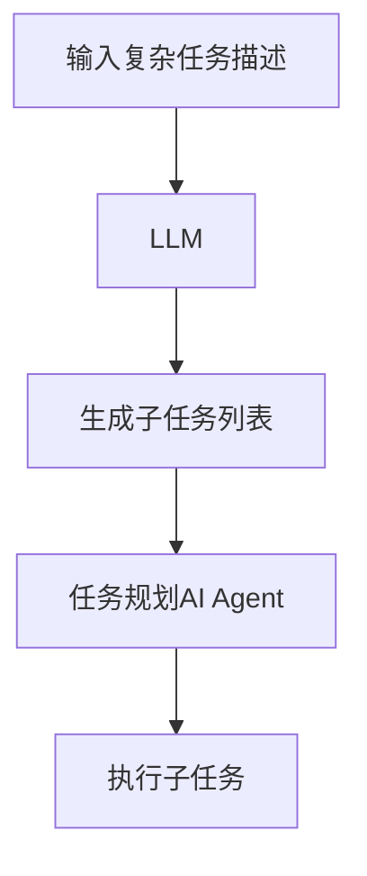

# 任务规划AI Agent：利用LLM进行复杂任务分解

> 关键词：任务规划AI Agent、大型语言模型（LLM）、复杂任务分解、人工智能、任务调度、自动化

> 摘要：本文深入探讨了任务规划AI Agent利用大型语言模型（LLM）进行复杂任务分解的相关技术。首先介绍了该领域的背景信息，包括目的范围、预期读者、文档结构和术语表。接着阐述了核心概念与联系，通过文本示意图和Mermaid流程图展示其原理和架构。详细讲解了核心算法原理及具体操作步骤，并结合Python源代码进行说明。分析了相关的数学模型和公式，给出举例。通过项目实战展示了代码实际案例及详细解释。探讨了实际应用场景，推荐了相关的工具和资源，包括学习资源、开发工具框架和论文著作。最后总结了未来发展趋势与挑战，提供了常见问题解答和扩展阅读参考资料。

## 1. 背景介绍 
### 1.1 目的和范围
在当今数字化的时代，许多任务变得越来越复杂，涉及多个步骤和子任务。任务规划AI Agent利用LLM进行复杂任务分解的目的在于提高任务执行的效率和准确性。通过将复杂任务分解为可管理的子任务，能够更好地分配资源、优化执行流程。本文章的范围涵盖了从基本概念到实际应用的整个过程，包括核心算法、数学模型、代码实现以及实际场景的应用。

### 1.2 预期读者
本文预期读者包括人工智能领域的研究人员、软件开发者、对自动化任务规划感兴趣的技术爱好者以及相关行业的从业者。无论是希望深入了解该领域技术原理的专业人士，还是想要将其应用到实际项目中的开发者，都能从本文中获得有价值的信息。

### 1.3 文档结构概述
本文将按照以下结构进行组织：首先介绍核心概念与联系，通过文本示意图和流程图展示其原理和架构；接着详细讲解核心算法原理及具体操作步骤，并用Python代码实现；然后分析相关的数学模型和公式，并举例说明；通过项目实战展示代码实际案例及详细解释；探讨实际应用场景；推荐相关的工具和资源；最后总结未来发展趋势与挑战，提供常见问题解答和扩展阅读参考资料。

### 1.4 术语表
#### 1.4.1 核心术语定义
- **任务规划AI Agent**：一种能够自动规划任务执行流程的智能体，根据任务的目标和约束条件，生成最优的任务执行计划。
- **大型语言模型（LLM）**：基于深度学习的语言模型，具有强大的语言理解和生成能力，能够处理自然语言文本。
- **复杂任务分解**：将一个复杂的任务拆分为多个简单的、可管理的子任务的过程。

#### 1.4.2 相关概念解释
- **任务调度**：根据任务的优先级、资源需求等因素，合理安排任务的执行顺序和时间。
- **自动化**：利用计算机技术实现任务的自动执行，减少人工干预。

#### 1.4.3 缩略词列表
- **LLM**：Large Language Model（大型语言模型）
- **AI**：Artificial Intelligence（人工智能）

## 2. 核心概念与联系 
### 核心概念原理
任务规划AI Agent利用LLM进行复杂任务分解的核心原理是借助LLM的强大语言理解和生成能力。当接收到一个复杂任务描述时，LLM可以对任务进行语义分析，理解任务的目标和要求。然后，根据预先设定的规则和知识，将复杂任务分解为多个子任务。

例如，对于一个“组织一次公司团建活动”的复杂任务，LLM可以分析出其中可能包含的子任务，如“确定团建时间”、“选择团建地点”、“安排交通”、“准备餐饮”等。

### 架构的文本示意图
```plaintext
输入：复杂任务描述
|
v
LLM（语义分析、知识推理）
|
v
子任务列表
|
v
任务规划AI Agent（任务调度、资源分配）
|
v
执行子任务
```

### Mermaid流程图


## 3. 核心算法原理 & 具体操作步骤 
### 核心算法原理
核心算法主要包括以下几个步骤：
1. **任务输入**：接收用户输入的复杂任务描述。
2. **语义分析**：使用LLM对任务描述进行语义分析，提取关键信息。
3. **子任务生成**：根据语义分析结果和预先设定的规则，生成子任务列表。
4. **任务调度**：对生成的子任务进行调度，确定执行顺序和时间。

### 具体操作步骤
以下是使用Python实现的具体代码示例：

```python
import openai

# 设置OpenAI API密钥
openai.api_key = "your_api_key"

def complex_task_decomposition(task_description):
    # 调用LLM进行语义分析和子任务生成
    prompt = f"请将以下任务分解为子任务：{task_description}"
    response = openai.Completion.create(
        engine="text-davinci-003",
        prompt=prompt,
        max_tokens=100
    )
    # 提取子任务列表
    subtasks = response.choices[0].text.strip().split('\n')
    return subtasks

# 示例任务描述
task = "组织一次公司团建活动"
subtasks = complex_task_decomposition(task)
print("子任务列表：")
for subtask in subtasks:
    print(subtask)
```

### 代码解释
1. **导入openai库**：用于调用OpenAI的LLM服务。
2. **设置API密钥**：需要替换为你自己的OpenAI API密钥。
3. **定义complex_task_decomposition函数**：接收一个复杂任务描述作为输入，构建一个提示信息，调用LLM生成子任务列表。
4. **提取子任务列表**：将LLM返回的文本按换行符分割，得到子任务列表。
5. **示例任务**：使用“组织一次公司团建活动”作为示例任务，调用函数并打印子任务列表。

## 4. 数学模型和公式 & 详细讲解 & 举例说明 
### 数学模型
可以将任务分解问题看作一个图论问题。假设一个复杂任务可以表示为一个节点，子任务可以表示为该节点的子节点。任务之间的依赖关系可以表示为图中的边。

设 $T$ 为复杂任务集合，$S$ 为子任务集合。对于每个复杂任务 $t \in T$，存在一个映射 $f: t \to S$，将其分解为多个子任务。

### 公式
任务分解的目标是最小化子任务之间的依赖关系，以提高任务执行的效率。可以定义一个依赖度函数 $D(S)$，表示子任务集合 $S$ 中的依赖关系强度。

$$D(S)=\sum_{i=1}^{n}\sum_{j=1}^{n}w_{ij}$$

其中，$w_{ij}$ 表示子任务 $i$ 和子任务 $j$ 之间的依赖权重。

### 详细讲解
依赖度函数 $D(S)$ 用于衡量子任务集合中依赖关系的复杂程度。权重 $w_{ij}$ 可以根据任务之间的逻辑关系、资源共享等因素进行设定。例如，如果子任务 $i$ 必须在子任务 $j$ 之前完成，则 $w_{ij}$ 可以设为一个较大的值；如果两个子任务之间没有直接依赖关系，则 $w_{ij}$ 可以设为 0。

### 举例说明
假设有一个复杂任务 $t$ 分解为三个子任务 $s_1$、$s_2$ 和 $s_3$。子任务之间的依赖关系如下：$s_1$ 必须在 $s_2$ 之前完成，$s_2$ 必须在 $s_3$ 之前完成。可以设定 $w_{12}=1$，$w_{23}=1$，$w_{13}=0$（因为 $s_1$ 和 $s_3$ 之间的依赖可以通过 $s_2$ 传递）。

则依赖度函数的值为：

$$D(S)=w_{12}+w_{23}+w_{13}=1 + 1 + 0 = 2$$

## 5. 项目实战：代码实际案例和详细解释说明 
### 5.1  开发环境搭建
#### 安装Python
首先需要安装Python环境，建议使用Python 3.7及以上版本。可以从Python官方网站（https://www.python.org/downloads/）下载并安装。

#### 安装必要的库
使用pip安装openai库：

```bash
pip install openai
```

### 5.2  源代码详细实现和代码解读
以下是一个更完整的项目实战代码示例：

```python
import openai
import time

# 设置OpenAI API密钥
openai.api_key = "your_api_key"

def complex_task_decomposition(task_description):
    # 调用LLM进行语义分析和子任务生成
    prompt = f"请将以下任务分解为子任务：{task_description}"
    response = openai.Completion.create(
        engine="text-davinci-003",
        prompt=prompt,
        max_tokens=100
    )
    # 提取子任务列表
    subtasks = response.choices[0].text.strip().split('\n')
    return subtasks

def task_scheduling(subtasks):
    # 简单的任务调度：按顺序执行
    scheduled_tasks = []
    for i, subtask in enumerate(subtasks):
        scheduled_tasks.append((i + 1, subtask))
    return scheduled_tasks

def execute_tasks(scheduled_tasks):
    for task_id, task in scheduled_tasks:
        print(f"开始执行任务 {task_id}: {task}")
        # 模拟任务执行
        time.sleep(1)
        print(f"任务 {task_id} 执行完成")

# 示例任务描述
task = "组织一次公司团建活动"
# 分解任务
subtasks = complex_task_decomposition(task)
# 任务调度
scheduled_tasks = task_scheduling(subtasks)
# 执行任务
execute_tasks(scheduled_tasks)
```

### 代码解读与分析
1. **complex_task_decomposition函数**：与之前的示例相同，用于将复杂任务分解为子任务。
2. **task_scheduling函数**：实现简单的任务调度，按顺序为子任务分配任务编号。
3. **execute_tasks函数**：模拟任务的执行过程，每个任务执行1秒。
4. **主程序**：首先定义一个示例任务，然后调用分解函数、调度函数和执行函数，完成整个任务规划和执行过程。

## 6. 实际应用场景 
### 项目管理
在项目管理中，一个大型项目往往包含多个复杂任务。利用任务规划AI Agent和LLM进行任务分解，可以将项目分解为多个可管理的子任务，合理安排项目进度和资源分配。例如，在软件开发项目中，可以将项目分解为需求分析、设计、编码、测试等子任务。

### 物流配送
在物流配送中，一个配送任务可能涉及多个环节，如货物收集、运输、配送等。通过任务分解，可以更好地安排车辆调度、人员分配等，提高物流配送的效率。

### 智能家居
在智能家居系统中，用户可能会下达一些复杂的任务，如“晚上回家前将客厅温度调节到25度，打开电视并播放新闻频道”。任务规划AI Agent可以将这个任务分解为多个子任务，分别控制智能设备完成相应的操作。

## 7. 工具和资源推荐
### 7.1 学习资源推荐
#### 7.1.1 书籍推荐
- 《人工智能：一种现代的方法》：全面介绍了人工智能的基本概念、算法和应用，是人工智能领域的经典教材。
- 《Python机器学习实战》：详细介绍了Python在机器学习领域的应用，包括数据处理、模型训练等内容。

#### 7.1.2 在线课程
- Coursera上的“人工智能基础”课程：由知名教授授课，系统讲解人工智能的基础知识。
- 网易云课堂上的“Python深度学习实战”课程：通过实际项目，学习Python在深度学习中的应用。

#### 7.1.3 技术博客和网站
- 机器之心：提供人工智能领域的最新技术文章和研究成果。
- 开源中国：分享开源项目和技术经验。

### 7.2 开发工具框架推荐
#### 7.2.1 IDE和编辑器
- PyCharm：功能强大的Python集成开发环境，提供代码编辑、调试、版本控制等功能。
- Visual Studio Code：轻量级的代码编辑器，支持多种编程语言，具有丰富的插件扩展。

#### 7.2.2 调试和性能分析工具
- pdb：Python自带的调试工具，可以对Python代码进行单步调试。
- cProfile：用于分析Python代码的性能，找出性能瓶颈。

#### 7.2.3 相关框架和库
- OpenAI API：提供强大的语言模型服务，可用于自然语言处理任务。
- TensorFlow：开源的深度学习框架，广泛应用于人工智能领域。

### 7.3 相关论文著作推荐
#### 7.3.1 经典论文
- “Attention Is All You Need”：提出了Transformer模型，是自然语言处理领域的重要突破。
- “ImageNet Classification with Deep Convolutional Neural Networks”：介绍了AlexNet模型，开启了深度学习在计算机视觉领域的应用。

#### 7.3.2 最新研究成果
- 关注arXiv.org上的最新论文，了解人工智能领域的前沿研究。
- 参加相关的学术会议，如NeurIPS、ICML等，获取最新的研究动态。

#### 7.3.3 应用案例分析
- 查看知名企业的技术博客，如Google AI Blog、Microsoft AI Blog等，了解人工智能在实际应用中的案例。

## 8. 总结：未来发展趋势与挑战
### 未来发展趋势
- **多模态融合**：未来的任务规划AI Agent可能会结合图像、语音等多模态信息，实现更复杂的任务分解和执行。
- **自主学习和进化**：AI Agent将具备更强的自主学习能力，能够根据任务执行的反馈不断优化任务规划策略。
- **与物联网的深度融合**：在智能家居、智能物流等领域，AI Agent将与物联网设备更紧密地结合，实现更高效的任务自动化。

### 挑战
- **数据隐私和安全**：使用LLM进行任务分解需要大量的数据，如何保证数据的隐私和安全是一个重要挑战。
- **模型的可解释性**：LLM的决策过程往往是黑盒的，如何解释模型的决策结果，提高模型的可信度是需要解决的问题。
- **任务分解的准确性**：复杂任务的分解需要对任务有深入的理解，如何提高任务分解的准确性，避免错误的子任务生成是一个挑战。

## 9. 附录：常见问题与解答
### 问题1：如何选择合适的LLM？
解答：选择合适的LLM需要考虑多个因素，如模型的性能、成本、适用场景等。可以根据具体需求选择不同的LLM，如OpenAI的GPT系列、Hugging Face的Transformer模型等。

### 问题2：任务分解的结果不准确怎么办？
解答：如果任务分解的结果不准确，可以尝试调整LLM的输入提示，提供更多的上下文信息。也可以结合人工干预，对分解结果进行修正。

### 问题3：如何处理子任务之间的依赖关系？
解答：可以使用图论等方法来表示子任务之间的依赖关系，然后根据依赖关系进行任务调度。在代码实现中，可以使用有向无环图（DAG）来表示任务依赖关系，使用拓扑排序算法来确定任务的执行顺序。

## 10. 扩展阅读 & 参考资料
- 《自然语言处理入门》
- 《深度学习实战》
- OpenAI官方文档：https://platform.openai.com/docs/
- Hugging Face官方文档：https://huggingface.co/docs/transformers/index
- arXiv.org：https://arxiv.org/