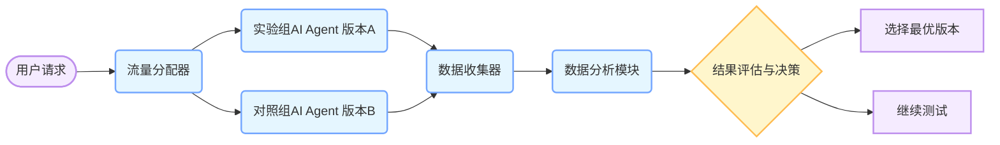

# 企业AI Agent的A/B测试功能：持续优化用户体验

> 关键词：企业AI Agent、A/B测试、用户体验、持续优化、测试策略

> 摘要：本文围绕企业AI Agent的A/B测试功能展开，深入探讨了如何通过该功能持续优化用户体验。首先介绍了相关背景知识，包括目的范围、预期读者、文档结构和术语表。接着阐述了核心概念与联系，给出了原理和架构的文本示意图及Mermaid流程图。详细讲解了核心算法原理及具体操作步骤，并使用Python代码进行阐述。分析了相关数学模型和公式，辅以举例说明。通过项目实战展示了代码实际案例及详细解释。探讨了实际应用场景，推荐了相关工具和资源。最后总结了未来发展趋势与挑战，提供了常见问题解答和扩展阅读参考资料，旨在帮助企业更好地利用A/B测试功能提升AI Agent的性能和用户体验。

## 1. 背景介绍 
### 1.1 目的和范围
企业AI Agent在当今数字化业务中扮演着至关重要的角色，它能够与用户进行交互，提供信息和服务。然而，要确保AI Agent能够满足用户的需求并提供良好的体验并非易事。A/B测试作为一种科学的实验方法，可以帮助企业比较不同版本的AI Agent的性能，从而找出最优方案，持续优化用户体验。

本文的范围涵盖了企业AI Agent的A/B测试功能的各个方面，包括核心概念、算法原理、数学模型、项目实战、应用场景以及工具资源等，旨在为企业提供全面的指导，使其能够有效地实施A/B测试，提升AI Agent的性能和用户满意度。

### 1.2 预期读者
本文的预期读者包括企业的技术管理人员、AI开发人员、产品经理、数据分析师以及对企业AI Agent和A/B测试感兴趣的专业人士。这些读者希望了解如何通过A/B测试来优化企业AI Agent的用户体验，提升业务效果。

### 1.3 文档结构概述
本文将按照以下结构进行组织：
- 核心概念与联系：介绍企业AI Agent和A/B测试的核心概念，以及它们之间的联系，并给出原理和架构的文本示意图及Mermaid流程图。
- 核心算法原理 & 具体操作步骤：详细讲解A/B测试的核心算法原理，并使用Python代码进行具体操作步骤的阐述。
- 数学模型和公式 & 详细讲解 & 举例说明：分析A/B测试中涉及的数学模型和公式，并通过具体例子进行说明。
- 项目实战：通过实际项目案例，展示企业AI Agent的A/B测试功能的代码实现和详细解释。
- 实际应用场景：探讨企业AI Agent的A/B测试功能在不同场景下的应用。
- 工具和资源推荐：推荐相关的学习资源、开发工具框架和论文著作。
- 总结：总结未来发展趋势与挑战。
- 附录：提供常见问题与解答。
- 扩展阅读 & 参考资料：列出相关的扩展阅读内容和参考资料。

### 1.4 术语表
#### 1.4.1 核心术语定义
- **企业AI Agent**：是指企业开发的具有人工智能能力的软件代理，能够与用户进行交互，执行任务，提供信息和服务。
- **A/B测试**：一种通过比较两个或多个版本（A版本和B版本等）的产品或功能，以确定哪个版本在特定指标上表现更优的实验方法。
- **用户体验**：用户在使用产品或服务过程中的主观感受和体验，包括易用性、满意度、忠诚度等方面。
- **测试指标**：用于衡量A/B测试结果的具体指标，如点击率、转化率、留存率等。

#### 1.4.2 相关概念解释
- **实验组和对照组**：在A/B测试中，将用户随机分为实验组和对照组。实验组使用新的版本或功能，对照组使用原有的版本或功能，通过比较两组的测试指标来评估新方案的效果。
- **显著性水平**：在统计学中，显著性水平是指在假设检验中拒绝原假设的最小显著性概率。通常用α表示，常见的显著性水平为0.05或0.01。
- **功效**：功效是指在备择假设为真时，正确拒绝原假设的概率。在A/B测试中，功效通常设定为0.8或更高。

#### 1.4.3 缩略词列表
- **AI**：Artificial Intelligence，人工智能
- **CTR**：Click-Through Rate，点击率
- **CR**：Conversion Rate，转化率

## 2. 核心概念与联系 

### 核心概念原理
企业AI Agent是企业利用人工智能技术开发的智能软件代理，它可以通过自然语言处理、机器学习等技术与用户进行交互，理解用户的需求并提供相应的服务。而A/B测试则是一种基于统计学原理的实验方法，通过将用户随机分配到不同的实验组和对照组，比较不同版本的AI Agent在特定测试指标上的表现，从而确定哪个版本更优。

A/B测试的核心原理是假设检验。原假设通常是两个版本的AI Agent在测试指标上没有显著差异，备择假设是两个版本存在显著差异。通过收集实验组和对照组的数据，计算统计量，并与临界值进行比较，来判断是否拒绝原假设。

### 架构的文本示意图
以下是企业AI Agent的A/B测试功能的架构示意图：

```plaintext
用户请求 -> 流量分配器 -> 实验组AI Agent（版本A）
                      -> 对照组AI Agent（版本B）
实验组AI Agent（版本A） -> 数据收集器 -> 数据分析模块 -> 结果评估与决策
对照组AI Agent（版本B） -> 数据收集器 -> 数据分析模块 -> 结果评估与决策
```

### Mermaid流程图


## 3. 核心算法原理 & 具体操作步骤 

### 核心算法原理
A/B测试的核心算法基于统计学中的假设检验，常用的检验方法有t检验和卡方检验。以t检验为例，用于比较两个样本的均值是否存在显著差异。

原假设 $H_0$：$\mu_A = \mu_B$，即实验组和对照组的测试指标均值无显著差异。
备择假设 $H_1$：$\mu_A \neq \mu_B$，即实验组和对照组的测试指标均值存在显著差异。

t统计量的计算公式为：

$$t = \frac{\bar{X}_A - \bar{X}_B}{s_p\sqrt{\frac{1}{n_A}+\frac{1}{n_B}}}$$

其中，$\bar{X}_A$ 和 $\bar{X}_B$ 分别是实验组和对照组的样本均值，$n_A$ 和 $n_B$ 分别是实验组和对照组的样本大小，$s_p$ 是合并标准差，计算公式为：

$$s_p = \sqrt{\frac{(n_A - 1)s_A^2 + (n_B - 1)s_B^2}{n_A + n_B - 2}}$$

其中，$s_A^2$ 和 $s_B^2$ 分别是实验组和对照组的样本方差。

### 具体操作步骤
以下是使用Python实现A/B测试的具体操作步骤：

```python
import numpy as np
from scipy import stats

# 生成实验组和对照组的数据
np.random.seed(42)
n_A = 100  # 实验组样本大小
n_B = 100  # 对照组样本大小
mu_A = 10  # 实验组均值
mu_B = 11  # 对照组均值
sigma_A = 2  # 实验组标准差
sigma_B = 2  # 对照组标准差

group_A = np.random.normal(mu_A, sigma_A, n_A)
group_B = np.random.normal(mu_B, sigma_B, n_B)

# 计算样本均值和方差
mean_A = np.mean(group_A)
mean_B = np.mean(group_B)
var_A = np.var(group_A, ddof=1)
var_B = np.var(group_B, ddof=1)

# 计算合并标准差
s_p = np.sqrt(((n_A - 1) * var_A + (n_B - 1) * var_B) / (n_A + n_B - 2))

# 计算t统计量
t = (mean_A - mean_B) / (s_p * np.sqrt(1/n_A + 1/n_B))

# 计算自由度
df = n_A + n_B - 2

# 计算p值
p = 2 * (1 - stats.t.cdf(np.abs(t), df))

# 设定显著性水平
alpha = 0.05

# 判断是否拒绝原假设
if p < alpha:
    print("拒绝原假设，两组均值存在显著差异。")
else:
    print("接受原假设，两组均值无显著差异。")

# 使用scipy库的t检验函数进行验证
t_stat, p_value = stats.ttest_ind(group_A, group_B)
print(f"scipy计算的t统计量: {t_stat}")
print(f"scipy计算的p值: {p_value}")
```

### 代码解释
1. **数据生成**：使用`np.random.normal`函数生成实验组和对照组的随机数据。
2. **计算样本统计量**：计算实验组和对照组的样本均值、方差和合并标准差。
3. **计算t统计量和p值**：根据公式计算t统计量和p值。
4. **假设检验**：设定显著性水平，根据p值判断是否拒绝原假设。
5. **验证**：使用`scipy.stats.ttest_ind`函数进行验证，确保计算结果的准确性。

## 4. 数学模型和公式 & 详细讲解 & 举例说明 

### 数学模型
A/B测试的数学模型主要基于假设检验，常用的分布有正态分布和二项分布。

#### 正态分布
当测试指标为连续变量，如用户的平均停留时间、平均消费金额等，通常假设样本数据服从正态分布。在t检验中，我们假设实验组和对照组的数据都来自正态总体，且方差相等（可以通过Levene检验来验证）。

#### 二项分布
当测试指标为离散变量，如点击率、转化率等，通常假设样本数据服从二项分布。在这种情况下，常用的检验方法是卡方检验。

### 公式详细讲解
#### t检验公式
前面已经介绍了t检验的公式，这里再次强调：

$$t = \frac{\bar{X}_A - \bar{X}_B}{s_p\sqrt{\frac{1}{n_A}+\frac{1}{n_B}}}$$

- $\bar{X}_A$ 和 $\bar{X}_B$ 分别是实验组和对照组的样本均值，反映了两组数据的中心位置。
- $n_A$ 和 $n_B$ 分别是实验组和对照组的样本大小，样本大小越大，估计的均值越准确。
- $s_p$ 是合并标准差，考虑了两组数据的方差信息，用于衡量数据的离散程度。

#### 卡方检验公式
卡方检验用于比较两个或多个分类变量的比例是否存在显著差异。对于A/B测试中的点击率或转化率，我们可以构建一个2x2的列联表：

|  | 点击（转化） | 未点击（未转化） | 总计 |
| --- | --- | --- | --- |
| 实验组 | $a$ | $b$ | $n_A$ |
| 对照组 | $c$ | $d$ | $n_B$ |
| 总计 | $a + c$ | $b + d$ | $N$ |

卡方统计量的计算公式为：

$$\chi^2 = \sum_{i=1}^{2}\sum_{j=1}^{2}\frac{(O_{ij} - E_{ij})^2}{E_{ij}}$$

其中，$O_{ij}$ 是实际观测值，$E_{ij}$ 是理论期望值，计算公式为：

$$E_{ij} = \frac{\text{第}i\text{行总计} \times \text{第}j\text{列总计}}{\text{总样本数}}$$

### 举例说明
#### t检验举例
假设我们要比较两个版本的AI Agent对用户平均对话时长的影响。我们随机选取了100个用户使用版本A，平均对话时长为15分钟，标准差为3分钟；另选取100个用户使用版本B，平均对话时长为17分钟，标准差为3.5分钟。

1. 计算合并标准差：
$$s_p = \sqrt{\frac{(100 - 1) \times 3^2 + (100 - 1) \times 3.5^2}{100 + 100 - 2}} \approx 3.25$$

2. 计算t统计量：
$$t = \frac{15 - 17}{3.25\sqrt{\frac{1}{100}+\frac{1}{100}}} \approx -3.92$$

3. 计算自由度：$df = 100 + 100 - 2 = 198$

4. 计算p值：通过查t分布表或使用Python的`scipy.stats.t.cdf`函数，得到p值远小于0.05，因此拒绝原假设，认为两个版本的AI Agent对用户平均对话时长有显著影响。

#### 卡方检验举例
假设我们要比较两个版本的AI Agent的点击率。版本A有200个用户，其中50个点击了，版本B有200个用户，其中70个点击了。

1. 构建列联表：
|  | 点击 | 未点击 | 总计 |
| --- | --- | --- | --- |
| 版本A | 50 | 150 | 200 |
| 版本B | 70 | 130 | 200 |
| 总计 | 120 | 280 | 400 |

2. 计算理论期望值：
$E_{11} = \frac{200 \times 120}{400} = 60$
$E_{12} = \frac{200 \times 280}{400} = 140$
$E_{21} = \frac{200 \times 120}{400} = 60$
$E_{22} = \frac{200 \times 280}{400} = 140$

3. 计算卡方统计量：
$$\chi^2 = \frac{(50 - 60)^2}{60} + \frac{(150 - 140)^2}{140} + \frac{(70 - 60)^2}{60} + \frac{(130 - 140)^2}{140} \approx 4.76$$

4. 计算自由度：$df = (2 - 1) \times (2 - 1) = 1$

5. 查卡方分布表或使用Python的`scipy.stats.chi2.cdf`函数，得到p值小于0.05，因此拒绝原假设，认为两个版本的AI Agent的点击率有显著差异。

## 5. 项目实战：代码实际案例和详细解释说明 

### 5.1  开发环境搭建
#### 操作系统
可以选择Windows、Linux或macOS操作系统。

#### 编程语言和库
- **Python**：作为主要的编程语言，建议使用Python 3.7及以上版本。
- **NumPy**：用于数值计算。
- **Pandas**：用于数据处理和分析。
- **Scipy**：用于统计分析。
- **Matplotlib**：用于数据可视化。

可以使用以下命令安装所需的库：

```sh
pip install numpy pandas scipy matplotlib
```

### 5.2  源代码详细实现和代码解读
假设我们要对企业AI Agent的两个版本进行A/B测试，测试指标为用户的转化率。以下是完整的Python代码：

```python
import numpy as np
import pandas as pd
from scipy import stats
import matplotlib.pyplot as plt

# 生成模拟数据
np.random.seed(42)
n_A = 500  # 实验组样本大小
n_B = 500  # 对照组样本大小
conversion_rate_A = 0.15  # 实验组转化率
conversion_rate_B = 0.20  # 对照组转化率

# 生成实验组和对照组的转化数据
group_A = np.random.binomial(1, conversion_rate_A, n_A)
group_B = np.random.binomial(1, conversion_rate_B, n_B)

# 计算转化率
conversion_A = np.mean(group_A)
conversion_B = np.mean(group_B)

# 构建列联表
contingency_table = pd.crosstab(pd.Series(['A'] * n_A + ['B'] * n_B),
                                pd.Series(np.concatenate([group_A, group_B])))

# 进行卡方检验
chi2, p, _, _ = stats.chi2_contingency(contingency_table)

# 设定显著性水平
alpha = 0.05

# 判断是否拒绝原假设
if p < alpha:
    print("拒绝原假设，两组转化率存在显著差异。")
else:
    print("接受原假设，两组转化率无显著差异。")

# 可视化结果
labels = ['Group A', 'Group B']
conversion_rates = [conversion_A, conversion_B]

plt.bar(labels, conversion_rates)
plt.ylabel('Conversion Rate')
plt.title('A/B Test Results: Conversion Rate')
plt.show()
```

### 5.3  代码解读与分析
1. **数据生成**：使用`np.random.binomial`函数生成实验组和对照组的转化数据，模拟用户的转化情况。
2. **计算转化率**：通过`np.mean`函数计算实验组和对照组的转化率。
3. **构建列联表**：使用`pd.crosstab`函数构建2x2的列联表，用于卡方检验。
4. **卡方检验**：使用`stats.chi2_contingency`函数进行卡方检验，得到卡方统计量和p值。
5. **假设检验**：设定显著性水平，根据p值判断是否拒绝原假设。
6. **可视化结果**：使用`matplotlib`库绘制柱状图，直观展示两组的转化率。

通过以上代码，我们可以对企业AI Agent的两个版本进行A/B测试，判断它们的转化率是否存在显著差异。

## 6. 实际应用场景 
### 对话流程优化
企业可以通过A/B测试来优化AI Agent的对话流程。例如，比较不同的对话开场白、问题引导方式或回复策略对用户满意度和转化率的影响。通过测试不同的对话流程，找出最能吸引用户、引导用户完成目标的方案。

### 推荐策略调整
AI Agent通常会为用户提供个性化的推荐服务。企业可以使用A/B测试来比较不同的推荐算法、推荐数量或推荐内容对用户点击率和购买率的影响。通过不断优化推荐策略，提高用户对推荐内容的兴趣和参与度。

### 界面设计改进
对于具有界面交互的AI Agent，如聊天机器人的界面，企业可以进行A/B测试来评估不同的界面设计方案。例如，比较不同的颜色搭配、按钮布局或信息展示方式对用户体验和操作效率的影响。通过测试，选择最符合用户需求和审美习惯的界面设计。

### 语言风格优化
AI Agent的语言风格也会影响用户体验。企业可以通过A/B测试来比较不同的语言风格，如正式、幽默、亲切等，对用户满意度和忠诚度的影响。根据测试结果，调整AI Agent的语言风格，使其更符合目标用户群体的喜好。

## 7. 工具和资源推荐
### 7.1 学习资源推荐
#### 7.1.1 书籍推荐
- 《A/B测试：互联网产品运营精要》：详细介绍了A/B测试的原理、方法和实践案例，适合初学者和有一定经验的从业者。
- 《概率论与数理统计》：经典的统计学教材，为理解A/B测试的数学原理提供了坚实的基础。
- 《Python数据分析实战》：介绍了使用Python进行数据分析的方法和技巧，包括数据处理、统计分析和可视化等方面，对A/B测试的代码实现有很大帮助。

#### 7.1.2 在线课程
- Coursera上的“Data Science Specialization”：涵盖了数据科学的各个方面，包括统计学、机器学习和数据分析等，其中有专门的章节介绍A/B测试。
- edX上的“Probability-The Science of Uncertainty and Data”：深入讲解了概率论和统计学的知识，为A/B测试提供了理论支持。
- Udemy上的“A/B Testing for Beginners”：专门针对A/B测试的入门课程，通过实际案例介绍了A/B测试的流程和方法。

#### 7.1.3 技术博客和网站
- Optimizely博客：提供了大量关于A/B测试的文章和案例，涵盖了不同行业和领域的应用经验。
- Google Analytics博客：分享了关于数据分析和测试的最新技术和方法，对A/B测试有一定的参考价值。
- Towards Data Science：一个数据科学领域的博客平台，有很多关于A/B测试的技术文章和代码示例。

### 7.2 开发工具框架推荐
#### 7.2.1 IDE和编辑器
- PyCharm：功能强大的Python集成开发环境，提供了代码编辑、调试、版本控制等功能，适合开发A/B测试的Python代码。
- Jupyter Notebook：交互式的编程环境，方便进行数据探索、分析和可视化，对于A/B测试的实验和验证非常有用。
- Visual Studio Code：轻量级的代码编辑器，支持多种编程语言和插件，可用于开发和调试A/B测试相关的代码。

#### 7.2.2 调试和性能分析工具
- PDB：Python自带的调试器，可用于调试A/B测试的Python代码，帮助定位和解决问题。
- Profiler：Python的性能分析工具，如`cProfile`，可以分析代码的运行时间和内存使用情况，优化A/B测试代码的性能。
- Google Analytics Debugger：用于调试和验证Google Analytics的跟踪代码，确保A/B测试的数据准确收集。

#### 7.2.3 相关框架和库
- SciPy：提供了丰富的统计分析功能，包括t检验、卡方检验等，是进行A/B测试的重要工具。
- StatsModels：专注于统计建模和分析的Python库，提供了更多的统计检验方法和模型，可用于深入分析A/B测试的数据。
- Optimizely SDK：用于实现A/B测试的开发工具包，支持多种编程语言和平台，方便企业快速搭建A/B测试系统。

### 7.3 相关论文著作推荐
#### 7.3.1 经典论文
- “Controlled experiments on the web: survey and practical guide”：全面介绍了Web上的受控实验，包括A/B测试的设计、实施和分析方法，是A/B测试领域的经典论文。
- “The Design and Analysis of Industrial Experiments”：虽然主要针对工业实验，但其中的实验设计和统计分析方法对A/B测试有很大的借鉴意义。
- “A Tutorial on Statistical Tests for Online Controlled Experiments”：详细讲解了在线受控实验中的统计检验方法，为A/B测试的数据分析提供了理论指导。

#### 7.3.2 最新研究成果
- 在ACM SIGKDD、NeurIPS等顶级学术会议上，有很多关于A/B测试和机器学习结合的最新研究成果，如使用深度学习模型优化A/B测试的流量分配和结果评估。
- 一些知名学术期刊，如Journal of Marketing Research、Management Science等，也会发表关于A/B测试在市场营销和管理领域的应用研究。

#### 7.3.3 应用案例分析
- 《Lean Analytics》：通过实际案例介绍了如何使用数据分析和A/B测试来优化创业公司的产品和业务，具有很强的实践指导意义。
- 《The Mom Test》：虽然主要关注创业公司的用户调研，但其中也包含了一些A/B测试的应用案例，展示了如何通过测试来验证产品假设。

## 8. 总结：未来发展趋势与挑战
### 未来发展趋势
#### 与机器学习深度融合
未来，企业AI Agent的A/B测试将与机器学习技术深度融合。机器学习模型可以用于预测A/B测试的结果，优化流量分配策略，提高测试效率和准确性。例如，使用强化学习算法动态调整实验组和对照组的流量比例，以更快地找到最优方案。

#### 多变量测试和复杂实验设计
除了传统的A/B测试，未来将更多地采用多变量测试和复杂实验设计。多变量测试可以同时测试多个因素的不同水平，从而更全面地了解各个因素对用户体验的影响。复杂实验设计，如析因设计、正交设计等，将有助于更深入地分析因素之间的交互作用。

#### 实时反馈和自动化决策
随着技术的发展，A/B测试将实现实时反馈和自动化决策。通过实时监测测试指标，系统可以自动判断是否达到显著性水平，并及时做出决策，选择最优版本。这将大大缩短测试周期，提高企业的响应速度。

#### 跨平台和跨设备测试
随着用户在不同平台和设备上使用企业AI Agent，未来的A/B测试需要考虑跨平台和跨设备的差异。例如，不同操作系统、屏幕尺寸和浏览器对用户体验的影响。通过进行跨平台和跨设备测试，企业可以确保AI Agent在各种环境下都能提供一致的优质体验。

### 挑战
#### 数据质量和样本代表性
A/B测试的结果依赖于高质量的数据和具有代表性的样本。然而，在实际应用中，数据可能存在缺失、错误或偏差，样本可能无法完全代表总体用户。这将影响测试结果的准确性和可靠性，需要企业加强数据管理和样本选择的方法。

#### 测试成本和时间
进行A/B测试需要投入一定的成本和时间，包括开发不同版本的AI Agent、收集和分析数据等。对于一些资源有限的企业来说，这可能是一个挑战。此外，测试周期过长可能导致错过市场机会，需要企业在保证测试效果的前提下，优化测试流程，缩短测试时间。

#### 伦理和隐私问题
在A/B测试过程中，涉及到用户的个人信息和行为数据。企业需要遵守相关的伦理和隐私法规，确保用户数据的安全和隐私。同时，在设计测试方案时，需要考虑对用户的影响，避免给用户带来不必要的困扰。

#### 复杂系统的交互影响
企业AI Agent通常是一个复杂的系统，涉及到多个组件和模块的交互。在进行A/B测试时，可能会出现组件之间的交互影响，导致测试结果难以解释。例如，一个功能的改变可能会影响其他功能的性能。需要企业采用更复杂的分析方法，深入理解系统的交互机制。

## 9. 附录：常见问题与解答
### 问题1：A/B测试需要多少样本量？
样本量的大小取决于多个因素，如测试指标的方差、预期的效应大小、显著性水平和功效等。可以使用样本量计算公式或在线样本量计算器来确定所需的样本量。一般来说，样本量越大，测试结果越准确，但测试成本也会相应增加。

### 问题2：如何确保A/B测试的随机性？
为了确保A/B测试的随机性，需要使用随机化算法将用户分配到实验组和对照组。可以使用编程语言中的随机数生成函数，如Python的`random`模块或`numpy`的随机数生成函数。同时，要避免人为干预用户的分配过程，确保每个用户都有平等的机会被分配到不同的组。

### 问题3：如果A/B测试结果不显著怎么办？
如果A/B测试结果不显著，可能有以下几种原因：样本量不足、效应大小过小、测试时间过短等。可以考虑增加样本量、延长测试时间或调整测试指标，重新进行测试。此外，也可以对数据进行进一步的分析，寻找可能存在的问题或改进方向。

### 问题4：A/B测试可以同时测试多个版本吗？
可以同时测试多个版本，这种测试方法称为A/B/C/...测试。在进行多版本测试时，需要注意样本量的分配和统计分析方法的选择。一般来说，随着版本数量的增加，所需的样本量也会相应增加。可以使用方差分析（ANOVA）等方法来比较多个版本之间的差异。

### 问题5：A/B测试的结果可以直接应用到所有用户吗？
A/B测试的结果是基于样本数据得出的，虽然样本具有一定的代表性，但不能完全保证结果可以直接应用到所有用户。在将测试结果推广到全量用户之前，需要进行充分的评估和验证，考虑不同用户群体的差异和可能存在的外部因素。

## 10. 扩展阅读 & 参考资料
### 扩展阅读
- 《增长黑客：如何低成本实现爆发式成长》：介绍了通过数据驱动和实验方法实现业务增长的策略和技巧，对企业AI Agent的A/B测试有一定的启发。
- 《用户体验要素：以用户为中心的产品设计》：深入探讨了用户体验的各个层面和设计原则，有助于企业更好地理解用户需求，优化AI Agent的用户体验。
- 《实验设计与分析》：系统介绍了实验设计的方法和理论，包括各种实验设计类型和统计分析方法，对于深入理解A/B测试的设计和分析有很大帮助。

### 参考资料
- [Optimizely官方文档](https://docs.optimizely.com/)：提供了关于Optimizely A/B测试工具的详细文档和教程。
- [Google Analytics帮助中心](https://support.google.com/analytics)：包含了Google Analytics的使用指南和数据分析方法，对A/B测试的数据收集和分析有参考价值。
- [Scipy官方文档](https://docs.scipy.org/doc/scipy/)：Scipy库的官方文档，详细介绍了各种统计分析函数和方法。
- [Pandas官方文档](https://pandas.pydata.org/docs/)：Pandas库的官方文档，提供了数据处理和分析的相关功能和方法。

通过以上内容，我们全面探讨了企业AI Agent的A/B测试功能，从核心概念、算法原理、数学模型到项目实战和应用场景，同时推荐了相关的工具和资源，并对未来发展趋势和挑战进行了分析。希望本文能够帮助企业更好地利用A/B测试功能，持续优化AI Agent的用户体验，提升业务效果。