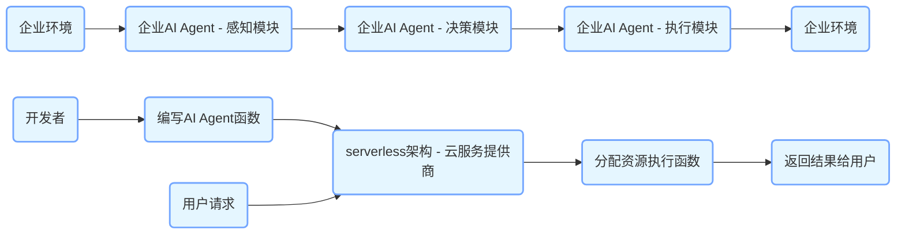

# 企业AI Agent的serverless架构优化

> 关键词：企业AI Agent、serverless架构、优化策略、人工智能、云计算

> 摘要：本文聚焦于企业AI Agent的serverless架构优化。首先介绍了相关背景，包括目的范围、预期读者等内容。接着阐述核心概念与联系，分析核心算法原理及具体操作步骤，借助Python代码进行详细说明。同时讲解了数学模型和公式，并给出举例。通过项目实战，展示代码实际案例并进行详细解释。探讨了实际应用场景，推荐了学习、开发相关的工具和资源。最后总结未来发展趋势与挑战，提供常见问题解答和扩展阅读参考资料，旨在为企业优化AI Agent的serverless架构提供全面且深入的技术指导。

## 1. 背景介绍 
### 1.1 目的和范围
在当今数字化快速发展的时代，企业对于智能化和自动化的需求日益增长，AI Agent（人工智能代理）作为一种能够模拟人类智能进行决策和执行任务的技术，在企业中得到了广泛应用。而serverless架构以其无需管理服务器、按需计费、自动扩展等优势，成为了部署企业AI Agent的理想选择。本文的目的在于深入探讨如何对企业AI Agent的serverless架构进行优化，以提高系统的性能、降低成本、增强可维护性和扩展性。

本文的范围涵盖了企业AI Agent和serverless架构的核心概念、相关算法原理、数学模型、实际项目案例、应用场景以及相关工具和资源推荐等方面，旨在为企业技术人员和决策者提供全面的技术参考和实践指导。

### 1.2 预期读者
本文的预期读者主要包括企业的技术决策者、软件架构师、程序员、人工智能工程师以及对企业AI Agent和serverless架构感兴趣的技术爱好者。对于技术决策者，本文可以帮助他们了解serverless架构优化对企业AI Agent的重要性和潜在价值，从而做出更明智的技术决策；对于软件架构师和程序员，本文提供了具体的技术实现细节和优化策略，有助于他们在实际项目中进行架构设计和代码开发；对于人工智能工程师，本文可以加深他们对AI Agent与serverless架构结合的理解，为进一步的研究和应用提供思路；对于技术爱好者，本文可以作为他们学习和了解相关技术的参考资料。

### 1.3 文档结构概述
本文将按照以下结构进行组织：首先介绍背景信息，包括目的范围、预期读者和文档结构概述等内容；接着阐述企业AI Agent和serverless架构的核心概念与联系，通过文本示意图和Mermaid流程图进行详细说明；然后讲解核心算法原理及具体操作步骤，使用Python源代码进行详细阐述；随后介绍数学模型和公式，并给出具体的举例说明；通过项目实战展示代码实际案例并进行详细解释；探讨企业AI Agent的serverless架构的实际应用场景；推荐相关的学习、开发工具和资源；总结未来发展趋势与挑战；提供常见问题解答和扩展阅读参考资料。

### 1.4 术语表
#### 1.4.1 核心术语定义
- **企业AI Agent**：是指在企业环境中使用的人工智能代理，它能够感知环境、进行推理和决策，并采取行动以实现特定的目标。企业AI Agent可以应用于各种业务场景，如客户服务、业务流程自动化、智能营销等。
- **serverless架构**：是一种云计算执行模型，在这种架构中，云服务提供商负责管理服务器基础设施，开发者无需关注服务器的部署、配置和维护等细节，只需编写和上传代码，云服务提供商根据请求自动分配资源并执行代码，开发者只需为实际使用的计算资源付费。
- **优化**：是指对系统或架构进行改进，以提高其性能、降低成本、增强可维护性和扩展性等方面的指标。

#### 1.4.2 相关概念解释
- **人工智能**：是一门研究如何使计算机能够模拟人类智能的学科，包括机器学习、深度学习、自然语言处理、计算机视觉等多个领域。人工智能技术为企业AI Agent提供了智能决策和执行任务的能力。
- **云计算**：是一种基于互联网的计算方式，通过将计算资源（如服务器、存储、软件等）提供给用户使用，用户可以根据自己的需求灵活地获取和使用这些资源。serverless架构是云计算的一种具体实现形式。

#### 1.4.3 缩略词列表
- **AI**：Artificial Intelligence，人工智能
- **ML**：Machine Learning，机器学习
- **DL**：Deep Learning，深度学习
- **NLP**：Natural Language Processing，自然语言处理
- **CV**：Computer Vision，计算机视觉

## 2. 核心概念与联系 

### 企业AI Agent核心概念
企业AI Agent是一种智能化的软件实体，它能够感知企业环境中的信息，通过内置的智能算法进行推理和决策，并采取相应的行动来实现企业的业务目标。企业AI Agent通常由感知模块、决策模块和执行模块组成。感知模块负责收集企业环境中的各种数据，如客户信息、业务数据、市场信息等；决策模块根据感知模块收集到的数据，运用人工智能算法进行分析和推理，制定出最佳的决策方案；执行模块根据决策模块制定的方案，采取具体的行动，如发送通知、执行任务、更新数据等。

### serverless架构核心概念
serverless架构是一种云计算执行模型，它将服务器基础设施的管理工作交给云服务提供商，开发者只需关注业务逻辑的实现，无需关心服务器的部署、配置和维护等细节。在serverless架构中，代码以函数的形式存在，云服务提供商根据请求自动分配资源并执行这些函数，开发者只需为实际使用的计算资源付费。serverless架构具有无需管理服务器、按需计费、自动扩展等优势，能够大大降低企业的运维成本和提高开发效率。

### 两者联系
企业AI Agent可以基于serverless架构进行部署和运行。通过serverless架构，企业AI Agent可以更加灵活地应对业务需求的变化，根据实际请求量自动扩展或收缩计算资源，避免了传统服务器架构中资源浪费和不足的问题。同时，serverless架构的按需计费模式也可以降低企业AI Agent的运行成本。此外，serverless架构的自动扩展能力可以确保企业AI Agent在高并发情况下也能保持良好的性能。

### 文本示意图
```plaintext
企业AI Agent
├── 感知模块
│   └── 收集企业环境数据（客户信息、业务数据、市场信息等）
├── 决策模块
│   └── 运用人工智能算法分析推理，制定决策方案
└── 执行模块
    └── 根据决策方案采取行动（发送通知、执行任务、更新数据等）

serverless架构
├── 云服务提供商
│   ├── 管理服务器基础设施
│   ├── 根据请求分配资源
│   └── 执行函数
└── 开发者
    └── 编写和上传业务逻辑代码（函数形式）

企业AI Agent与serverless架构联系
企业AI Agent的函数部署在serverless架构上，根据请求自动扩展或收缩资源，按需计费
```

### Mermaid流程图


## 3. 核心算法原理 & 具体操作步骤 

### 核心算法原理
在企业AI Agent的serverless架构中，常用的核心算法包括机器学习算法和深度学习算法。这些算法用于处理感知模块收集到的数据，进行推理和决策。以下以一个简单的分类问题为例，介绍机器学习中的逻辑回归算法原理。

逻辑回归是一种用于二分类问题的统计学习方法，它通过对输入特征进行线性组合，然后通过逻辑函数（也称为sigmoid函数）将线性组合的结果映射到[0, 1]区间，从而得到一个概率值。逻辑回归的目标是找到一组最优的参数，使得模型对训练数据的预测结果与真实标签之间的误差最小。

逻辑回归的线性组合公式为：
$$z = \theta_0 + \theta_1x_1 + \theta_2x_2 + \cdots + \theta_nx_n$$
其中，$z$ 是线性组合的结果，$\theta_0, \theta_1, \cdots, \theta_n$ 是模型的参数，$x_1, x_2, \cdots, x_n$ 是输入特征。

逻辑函数（sigmoid函数）的公式为：
$$\sigma(z) = \frac{1}{1 + e^{-z}}$$
$\sigma(z)$ 的值表示样本属于正类的概率。

逻辑回归的损失函数通常使用对数损失函数，也称为交叉熵损失函数，其公式为：
$$J(\theta) = -\frac{1}{m}\sum_{i = 1}^{m}[y^{(i)}\log(\sigma(z^{(i)})) + (1 - y^{(i)})\log(1 - \sigma(z^{(i)}))]$$
其中，$m$ 是训练样本的数量，$y^{(i)}$ 是第 $i$ 个样本的真实标签，$\sigma(z^{(i)})$ 是第 $i$ 个样本的预测概率。

通过最小化损失函数 $J(\theta)$，可以得到最优的参数 $\theta$。常用的优化算法是梯度下降算法，其更新公式为：
$$\theta_j := \theta_j - \alpha\frac{\partial J(\theta)}{\partial \theta_j}$$
其中，$\alpha$ 是学习率，$\frac{\partial J(\theta)}{\partial \theta_j}$ 是损失函数 $J(\theta)$ 对参数 $\theta_j$ 的偏导数。

### 具体操作步骤

#### 步骤1：数据准备
首先需要收集和整理用于训练和测试的数据集。数据集应包含输入特征和对应的真实标签。以下是一个简单的Python代码示例，用于生成一个模拟的二分类数据集：
```python
import numpy as np
from sklearn.datasets import make_classification
from sklearn.model_selection import train_test_split

# 生成模拟数据集
X, y = make_classification(n_samples=1000, n_features=10, n_informative=5, n_redundant=0, random_state=42)

# 划分训练集和测试集
X_train, X_test, y_train, y_test = train_test_split(X, y, test_size=0.2, random_state=42)
```

#### 步骤2：模型训练
使用逻辑回归算法对训练数据进行训练。以下是使用Python的`sklearn`库实现逻辑回归模型训练的代码示例：
```python
from sklearn.linear_model import LogisticRegression

# 创建逻辑回归模型
model = LogisticRegression()

# 训练模型
model.fit(X_train, y_train)
```

#### 步骤3：模型评估
使用测试数据对训练好的模型进行评估，计算模型的准确率、精确率、召回率等指标。以下是代码示例：
```python
from sklearn.metrics import accuracy_score, precision_score, recall_score

# 预测测试数据
y_pred = model.predict(X_test)

# 计算评估指标
accuracy = accuracy_score(y_test, y_pred)
precision = precision_score(y_test, y_pred)
recall = recall_score(y_test, y_pred)

print(f"Accuracy: {accuracy}")
print(f"Precision: {precision}")
print(f"Recall: {recall}")
```

#### 步骤4：部署到serverless架构
将训练好的模型封装成函数，并部署到serverless平台上。不同的serverless平台有不同的部署方式，以下以AWS Lambda为例，简要介绍部署步骤：
1. 创建一个AWS Lambda函数，选择合适的运行环境（如Python 3.8）。
2. 将训练好的模型文件和相关依赖打包上传到Lambda函数中。
3. 编写Lambda函数的入口代码，实现模型的推理功能。
4. 配置Lambda函数的触发器，如API Gateway，以便可以通过HTTP请求调用该函数。

以下是一个简单的AWS Lambda函数入口代码示例：
```python
import json
import numpy as np
from sklearn.linear_model import LogisticRegression
import joblib

# 加载模型
model = joblib.load('model.pkl')

def lambda_handler(event, context):
    # 解析输入数据
    input_data = np.array(json.loads(event['body']))
    
    # 进行预测
    prediction = model.predict(input_data)
    
    # 返回结果
    response = {
        'statusCode': 200,
        'body': json.dumps(prediction.tolist())
    }
    
    return response
```

## 4. 数学模型和公式 & 详细讲解 & 举例说明 

### 逻辑回归数学模型和公式详细讲解

#### 线性组合公式
$$z = \theta_0 + \theta_1x_1 + \theta_2x_2 + \cdots + \theta_nx_n$$
这个公式表示对输入特征 $x_1, x_2, \cdots, x_n$ 进行线性组合，得到一个线性得分 $z$。其中，$\theta_0$ 是截距项，$\theta_1, \theta_2, \cdots, \theta_n$ 是特征的权重系数。这些系数决定了每个特征对线性得分的贡献程度。例如，在一个客户分类问题中，$x_1$ 可能表示客户的年龄，$x_2$ 可能表示客户的消费金额，$\theta_1$ 和 $\theta_2$ 分别表示年龄和消费金额对客户分类的权重。

#### 逻辑函数（sigmoid函数）
$$\sigma(z) = \frac{1}{1 + e^{-z}}$$
sigmoid函数的作用是将线性得分 $z$ 映射到[0, 1]区间，得到一个概率值。当 $z$ 趋近于正无穷大时，$\sigma(z)$ 趋近于1；当 $z$ 趋近于负无穷大时，$\sigma(z)$ 趋近于0。这个概率值可以解释为样本属于正类的概率。例如，在一个客户是否会购买产品的分类问题中，$\sigma(z)$ 表示客户购买产品的概率。

#### 对数损失函数（交叉熵损失函数）
$$J(\theta) = -\frac{1}{m}\sum_{i = 1}^{m}[y^{(i)}\log(\sigma(z^{(i)})) + (1 - y^{(i)})\log(1 - \sigma(z^{(i)}))]$$
对数损失函数用于衡量模型的预测结果与真实标签之间的误差。当真实标签 $y^{(i)} = 1$ 时，损失函数的第一项 $y^{(i)}\log(\sigma(z^{(i)}))$ 起作用，此时希望 $\sigma(z^{(i)})$ 趋近于1，即模型预测样本属于正类的概率趋近于1；当真实标签 $y^{(i)} = 0$ 时，损失函数的第二项 $(1 - y^{(i)})\log(1 - \sigma(z^{(i)}))$ 起作用，此时希望 $\sigma(z^{(i)})$ 趋近于0，即模型预测样本属于正类的概率趋近于0。通过最小化损失函数，可以使模型的预测结果尽可能接近真实标签。

#### 梯度下降算法更新公式
$$\theta_j := \theta_j - \alpha\frac{\partial J(\theta)}{\partial \theta_j}$$
梯度下降算法是一种迭代优化算法，用于寻找损失函数的最小值。$\alpha$ 是学习率，它控制了每次迭代时参数更新的步长。$\frac{\partial J(\theta)}{\partial \theta_j}$ 是损失函数 $J(\theta)$ 对参数 $\theta_j$ 的偏导数，表示损失函数在 $\theta_j$ 方向上的变化率。通过不断地更新参数 $\theta_j$，使得损失函数逐渐减小，最终找到最优的参数值。

### 举例说明
假设有一个简单的二分类问题，输入特征只有一个 $x$，真实标签 $y$ 为0或1。我们使用逻辑回归模型进行分类，初始参数 $\theta_0 = 0$，$\theta_1 = 0$，学习率 $\alpha = 0.1$。训练数据集包含3个样本：$(x_1 = 1, y_1 = 1)$，$(x_2 = 2, y_2 = 1)$，$(x_3 = 3, y_3 = 0)$。

#### 步骤1：计算线性得分 $z$
对于第一个样本 $(x_1 = 1, y_1 = 1)$：
$$z_1 = \theta_0 + \theta_1x_1 = 0 + 0\times1 = 0$$

#### 步骤2：计算预测概率 $\sigma(z)$
$$\sigma(z_1) = \frac{1}{1 + e^{-z_1}} = \frac{1}{1 + e^{-0}} = 0.5$$

#### 步骤3：计算损失函数 $J(\theta)$
对于第一个样本：
$$J_1(\theta) = -[y_1\log(\sigma(z_1)) + (1 - y_1)\log(1 - \sigma(z_1))] = -[1\times\log(0.5) + (1 - 1)\times\log(1 - 0.5)] = -\log(0.5)$$

同理，计算第二个和第三个样本的损失，然后将三个样本的损失求平均，得到总的损失函数 $J(\theta)$。

#### 步骤4：计算偏导数 $\frac{\partial J(\theta)}{\partial \theta_j}$
通过对损失函数 $J(\theta)$ 求偏导数，可以得到 $\frac{\partial J(\theta)}{\partial \theta_0}$ 和 $\frac{\partial J(\theta)}{\partial \theta_1}$ 的值。

#### 步骤5：更新参数 $\theta_j$
根据梯度下降算法的更新公式，更新参数 $\theta_0$ 和 $\theta_1$：
$$\theta_0 := \theta_0 - \alpha\frac{\partial J(\theta)}{\partial \theta_0}$$
$$\theta_1 := \theta_1 - \alpha\frac{\partial J(\theta)}{\partial \theta_1}$$

重复上述步骤，不断迭代，直到损失函数收敛或达到最大迭代次数。

## 5. 项目实战：代码实际案例和详细解释说明 

### 5.1  开发环境搭建
#### 本地开发环境
- **Python环境**：安装Python 3.7或更高版本。可以从Python官方网站（https://www.python.org/downloads/） 下载并安装。
- **依赖库安装**：使用`pip`工具安装所需的依赖库，如`numpy`、`pandas`、`scikit-learn`、`joblib`等。示例命令如下：
```sh
pip install numpy pandas scikit-learn joblib
```

#### serverless平台环境
以AWS为例，需要进行以下操作：
- **AWS账户注册**：访问AWS官方网站（https://aws.amazon.com/） 注册一个AWS账户。
- **AWS CLI安装**：安装AWS命令行界面（CLI），可以从AWS官方文档（https://docs.aws.amazon.com/cli/latest/userguide/cli-chap-install.html） 中获取安装指导。安装完成后，配置AWS CLI，输入AWS Access Key ID、Secret Access Key等信息。
- **AWS Lambda和API Gateway创建**：登录AWS控制台，创建一个Lambda函数和一个API Gateway，用于部署和调用AI Agent函数。

### 5.2  源代码详细实现和代码解读
#### 数据准备
```python
import numpy as np
from sklearn.datasets import make_classification
from sklearn.model_selection import train_test_split

# 生成模拟数据集
X, y = make_classification(n_samples=1000, n_features=10, n_informative=5, n_redundant=0, random_state=42)

# 划分训练集和测试集
X_train, X_test, y_train, y_test = train_test_split(X, y, test_size=0.2, random_state=42)
```
代码解读：
- `make_classification` 函数用于生成一个模拟的二分类数据集，`n_samples` 表示样本数量，`n_features` 表示特征数量，`n_informative` 表示有信息的特征数量，`n_redundant` 表示冗余特征数量，`random_state` 用于固定随机种子，确保结果可复现。
- `train_test_split` 函数用于将数据集划分为训练集和测试集，`test_size` 表示测试集的比例。

#### 模型训练
```python
from sklearn.linear_model import LogisticRegression
import joblib

# 创建逻辑回归模型
model = LogisticRegression()

# 训练模型
model.fit(X_train, y_train)

# 保存模型
joblib.dump(model, 'model.pkl')
```
代码解读：
- `LogisticRegression` 是`sklearn`库中实现逻辑回归算法的类。
- `fit` 方法用于训练模型，将训练数据 `X_train` 和对应的标签 `y_train` 作为输入。
- `joblib.dump` 函数用于将训练好的模型保存到文件 `model.pkl` 中，以便后续使用。

#### Lambda函数实现
```python
import json
import numpy as np
import joblib

# 加载模型
model = joblib.load('model.pkl')

def lambda_handler(event, context):
    # 解析输入数据
    input_data = np.array(json.loads(event['body']))
    
    # 进行预测
    prediction = model.predict(input_data)
    
    # 返回结果
    response = {
        'statusCode': 200,
        'body': json.dumps(prediction.tolist())
    }
    
    return response
```
代码解读：
- `joblib.load` 函数用于加载之前保存的模型文件。
- `lambda_handler` 是AWS Lambda函数的入口函数，`event` 参数包含了调用函数时传递的信息，`context` 参数包含了函数执行的上下文信息。
- `json.loads(event['body'])` 用于解析输入数据，将其转换为Python对象。
- `model.predict` 方法用于对输入数据进行预测。
- `json.dumps(prediction.tolist())` 用于将预测结果转换为JSON格式的字符串，作为响应的主体返回。

### 5.3  代码解读与分析
#### 数据准备阶段
通过生成模拟数据集和划分训练集、测试集，为模型训练和评估提供了数据基础。合理的数据集划分可以确保模型在训练过程中不会过拟合，并且能够在测试集上得到准确的评估结果。

#### 模型训练阶段
使用逻辑回归算法进行模型训练，逻辑回归是一种简单而有效的二分类算法，适用于许多实际问题。保存模型到文件中，方便后续在不同环境中使用。

#### Lambda函数阶段
将训练好的模型封装在Lambda函数中，实现了模型的在线推理功能。通过API Gateway触发Lambda函数，可以通过HTTP请求调用模型进行预测，方便与其他系统集成。

## 6. 实际应用场景 
### 客户服务
企业AI Agent可以在serverless架构上实现智能客服功能。通过自然语言处理技术，AI Agent能够理解客户的问题，并根据预设的规则或训练好的模型给出相应的回答。serverless架构的自动扩展能力可以确保在客户咨询高峰期，AI Agent能够快速响应用户请求，提高客户满意度。例如，电商企业的客服系统可以使用AI Agent自动回答常见问题，如订单查询、物流信息查询等，减轻人工客服的压力。

### 业务流程自动化
企业AI Agent可以用于自动化业务流程，如审批流程、报销流程等。AI Agent可以根据预设的规则和条件，自动完成流程中的各个环节，提高业务处理效率。serverless架构的按需计费模式可以降低企业的运行成本，特别是对于一些业务量波动较大的流程。例如，企业的财务报销流程中，AI Agent可以自动审核报销申请，判断是否符合规定，并将结果通知相关人员。

### 智能营销
企业AI Agent可以基于serverless架构进行智能营销活动。通过分析客户的行为数据和偏好，AI Agent可以制定个性化的营销策略，如推荐商品、发送个性化的营销邮件等。serverless架构的高并发处理能力可以确保在大规模营销活动中，AI Agent能够快速处理大量的客户数据和请求。例如，在线教育企业可以使用AI Agent根据学生的学习情况和兴趣，推荐适合的课程。

### 风险评估
企业AI Agent可以用于风险评估，如信用风险评估、市场风险评估等。通过机器学习算法，AI Agent可以分析大量的历史数据，预测潜在的风险，并提供相应的风险预警。serverless架构的弹性伸缩能力可以确保在处理大规模数据时，AI Agent能够快速响应，提高风险评估的效率。例如，金融机构可以使用AI Agent对贷款申请人的信用风险进行评估，帮助做出更准确的贷款决策。

## 7. 工具和资源推荐
### 7.1 学习资源推荐
#### 7.1.1 书籍推荐
- 《Python机器学习》：这本书详细介绍了Python在机器学习领域的应用，包括各种机器学习算法的原理和实现，适合初学者和有一定基础的开发者阅读。
- 《深度学习》：由深度学习领域的三位顶尖专家编写，是深度学习领域的经典教材，全面介绍了深度学习的理论和实践。
- 《人工智能：一种现代的方法》：这本书是人工智能领域的权威教材，涵盖了人工智能的各个方面，包括搜索算法、知识表示、机器学习、自然语言处理等。

#### 7.1.2 在线课程
- Coursera上的“机器学习”课程：由斯坦福大学的Andrew Ng教授授课，是机器学习领域的经典课程，适合初学者入门。
- edX上的“深度学习”课程：由百度的吴恩达教授等授课，深入介绍了深度学习的原理和应用。
- Udemy上的“Python for Data Science and Machine Learning Bootcamp”：该课程通过实际项目介绍Python在数据科学和机器学习中的应用，适合有一定Python基础的学习者。

#### 7.1.3 技术博客和网站
- Medium：是一个技术博客平台，上面有很多关于人工智能、机器学习、serverless架构等领域的优秀文章。
- Towards Data Science：专注于数据科学和机器学习领域，提供了大量的技术文章和案例分析。
- AWS官方博客：提供了关于AWS云服务和serverless架构的最新技术文章和应用案例。

### 7.2 开发工具框架推荐
#### 7.2.1 IDE和编辑器
- PyCharm：是一款专业的Python集成开发环境，提供了丰富的代码编辑、调试、版本控制等功能，适合Python开发。
- Visual Studio Code：是一款轻量级的代码编辑器，支持多种编程语言，通过安装插件可以扩展其功能，非常适合快速开发和调试。
- Jupyter Notebook：是一个交互式的开发环境，适合数据探索、模型训练和可视化等工作。

#### 7.2.2 调试和性能分析工具
- AWS CloudWatch：是AWS提供的监控和日志服务，可以用于监控Lambda函数的执行情况，查看日志信息，进行性能分析。
- Sentry：是一个开源的错误跟踪和性能监控平台，可以帮助开发者快速定位和解决代码中的错误，提高系统的稳定性。
- Py-Spy：是一个Python性能分析工具，可以实时分析Python程序的性能瓶颈，帮助开发者优化代码。

#### 7.2.3 相关框架和库
- TensorFlow：是一个开源的机器学习框架，提供了丰富的深度学习模型和工具，适合开发复杂的人工智能应用。
- PyTorch：是另一个流行的深度学习框架，具有动态计算图的特点，易于使用和调试。
- scikit-learn：是一个简单而高效的机器学习库，提供了各种机器学习算法和工具，适合快速开发和实验。

### 7.3 相关论文著作推荐
#### 7.3.1 经典论文
- “Gradient-Based Learning Applied to Document Recognition”：由Yann LeCun等人发表，介绍了卷积神经网络（CNN）在手写数字识别中的应用，是深度学习领域的经典论文。
- “Attention Is All You Need”：提出了Transformer架构，是自然语言处理领域的重要突破，为后续的预训练语言模型奠定了基础。
- “Deep Residual Learning for Image Recognition”：提出了残差网络（ResNet），解决了深度神经网络训练中的梯度消失问题，在计算机视觉领域取得了巨大成功。

#### 7.3.2 最新研究成果
- 关注顶级学术会议，如NeurIPS（神经信息处理系统大会）、ICML（国际机器学习会议）、CVPR（计算机视觉与模式识别会议）等，这些会议上发表的论文代表了人工智能领域的最新研究成果。
- 关注顶级学术期刊，如Journal of Artificial Intelligence Research（JAIR）、Artificial Intelligence等，这些期刊上发表的论文具有较高的学术水平和影响力。

#### 7.3.3 应用案例分析
- 各大科技公司的技术博客，如Google AI Blog、Facebook AI Research等，会分享他们在人工智能和serverless架构方面的应用案例和实践经验。
- 行业报告和白皮书，如Gartner、IDC等机构发布的关于人工智能和云计算的报告，提供了行业的最新趋势和应用案例分析。

## 8. 总结：未来发展趋势与挑战
### 未来发展趋势
#### 智能化程度不断提高
随着人工智能技术的不断发展，企业AI Agent的智能化程度将不断提高。未来的AI Agent将能够更加准确地理解人类的语言和行为，进行更加复杂的推理和决策，为企业提供更加智能的服务和支持。

#### 与更多技术融合
企业AI Agent将与更多的技术进行融合，如物联网、区块链、大数据等。例如，通过与物联网技术融合，AI Agent可以实时获取物理设备的数据，进行智能控制和管理；通过与区块链技术融合，AI Agent可以确保数据的安全性和可信度。

#### serverless架构的进一步优化
serverless架构将不断进行优化，提高性能和可靠性。云服务提供商将提供更多的功能和工具，简化开发者的开发和部署过程，降低企业的使用门槛。

#### 行业应用不断拓展
企业AI Agent的应用将不断拓展到更多的行业和领域，如医疗、教育、能源等。在医疗领域，AI Agent可以辅助医生进行疾病诊断和治疗方案推荐；在教育领域，AI Agent可以提供个性化的学习服务。

### 挑战
#### 数据安全和隐私问题
企业AI Agent需要处理大量的敏感数据，如客户信息、业务数据等，数据安全和隐私问题成为了一个重要的挑战。如何确保数据在传输和存储过程中的安全性，防止数据泄露和滥用，是企业需要解决的关键问题。

#### 模型可解释性问题
深度学习等复杂的人工智能模型通常具有较高的准确性，但缺乏可解释性。在企业应用中，特别是一些关键决策场景，需要对模型的决策过程进行解释，以便用户理解和信任模型的结果。如何提高模型的可解释性是一个亟待解决的问题。

#### 成本控制问题
虽然serverless架构具有按需计费的优势，但在实际应用中，如果使用不当，可能会导致成本过高。如何合理规划和管理计算资源，优化成本结构，是企业需要面对的挑战。

#### 技术人才短缺问题
企业AI Agent和serverless架构涉及到人工智能、云计算等多个领域的技术，需要具备跨领域知识和技能的技术人才。目前，相关技术人才短缺，如何吸引和培养优秀的技术人才是企业面临的一个重要挑战。

## 9. 附录：常见问题与解答
### 问题1：企业AI Agent和传统软件有什么区别？
企业AI Agent具有智能决策和自主执行任务的能力，能够根据环境的变化和用户的需求进行动态调整。而传统软件通常是按照预设的规则和流程执行任务，缺乏智能性和灵活性。

### 问题2：serverless架构适合所有企业AI Agent应用吗？
不是所有的企业AI Agent应用都适合serverless架构。对于一些对性能要求极高、需要长时间运行的任务，serverless架构可能不是最佳选择。serverless架构更适合处理短时间、高并发的任务，如在线推理、事件驱动的任务等。

### 问题3：如何确保企业AI Agent在serverless架构上的安全性？
可以采取以下措施确保安全性：
- 使用安全的云服务提供商，遵循其安全最佳实践。
- 对数据进行加密处理，包括传输过程和存储过程。
- 进行严格的身份验证和授权，限制访问权限。
- 定期进行安全审计和漏洞扫描。

### 问题4：企业AI Agent的训练数据从哪里获取？
训练数据可以从多个渠道获取，如企业内部的业务系统、第三方数据提供商、公开数据集等。在获取数据时，需要确保数据的质量和合法性，同时对数据进行清洗和预处理，以提高模型的训练效果。

### 问题5：如何优化企业AI Agent在serverless架构上的性能？
可以采取以下优化措施：
- 选择合适的计算资源配置，根据实际需求调整内存和CPU。
- 优化模型结构，减少计算量。
- 使用缓存技术，减少重复计算。
- 进行性能测试和调优，找出性能瓶颈并进行优化。

## 10. 扩展阅读 & 参考资料
### 扩展阅读
- 《智能时代》：吴军著，介绍了人工智能在各个领域的应用和对社会的影响。
- 《浪潮之巅》：吴军著，讲述了信息技术产业的发展历程和规律。
- 《人类简史：从动物到上帝》：尤瓦尔·赫拉利著，探讨了人类的进化和发展，以及科技对人类未来的影响。

### 参考资料
- AWS官方文档（https://docs.aws.amazon.com/）
- sklearn官方文档（https://scikit-learn.org/stable/）
- TensorFlow官方文档（https://www.tensorflow.org/）
- PyTorch官方文档（https://pytorch.org/）