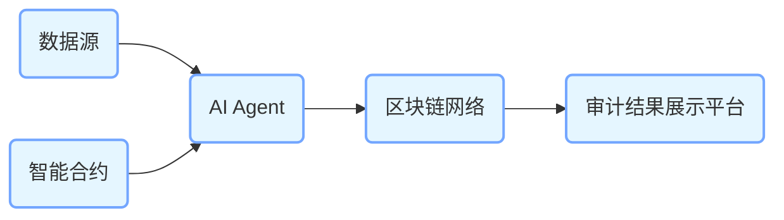

# 企业AI Agent的区块链数据审计系统

> 关键词：企业AI Agent、区块链、数据审计系统、人工智能、分布式账本、数据安全、审计技术

> 摘要：本文聚焦于企业AI Agent的区块链数据审计系统，旨在探讨该系统在企业数据管理与审计领域的重要性、原理、实现方法及应用前景。随着企业数字化转型的加速，数据的安全性、完整性和合规性愈发重要，传统审计方法面临诸多挑战。而结合AI Agent和区块链技术的数据审计系统，能够利用AI的智能决策与处理能力以及区块链的分布式、不可篡改特性，为企业提供更高效、准确、安全的数据审计解决方案。文章详细阐述了核心概念、算法原理、数学模型，通过项目实战展示代码实现与分析，介绍实际应用场景，推荐相关工具和资源，并对未来发展趋势与挑战进行总结，同时提供常见问题解答和参考资料，为企业构建和应用该系统提供全面的技术指导。

## 1. 背景介绍 
### 1.1 目的和范围
在当今数字化时代，企业面临着海量数据的管理与审计挑战。数据的真实性、完整性和合规性对于企业的决策、运营和合规性要求至关重要。传统的数据审计方法往往依赖于集中式的审计机构和复杂的人工流程，存在效率低下、易受攻击、数据篡改风险高等问题。本文章旨在介绍企业AI Agent的区块链数据审计系统，该系统结合了人工智能（AI）和区块链技术的优势，实现自动化、高效、安全的数据审计。范围涵盖了该系统的核心概念、算法原理、数学模型、项目实战、实际应用场景、工具资源推荐等方面，为企业和相关技术人员提供全面的技术指导和参考。

### 1.2 预期读者
本文的预期读者包括企业的IT管理人员、数据审计人员、技术研发人员、区块链技术爱好者以及对企业数据安全和审计有兴趣的专业人士。通过阅读本文，读者将能够深入了解企业AI Agent的区块链数据审计系统的原理、实现方法和应用场景，为其在实际工作中应用和开发相关系统提供理论支持和实践指导。

### 1.3 文档结构概述
本文共分为十个部分，具体结构如下：
1. 背景介绍：阐述系统的目的、预期读者和文档结构概述，并介绍相关术语。
2. 核心概念与联系：详细解释企业AI Agent、区块链和数据审计系统的核心概念，以及它们之间的联系，并通过文本示意图和Mermaid流程图进行可视化展示。
3. 核心算法原理 & 具体操作步骤：介绍系统的核心算法原理，包括AI Agent的智能决策算法和区块链的共识算法，并使用Python源代码详细阐述具体操作步骤。
4. 数学模型和公式 & 详细讲解 & 举例说明：建立系统的数学模型，推导相关公式，并通过具体例子进行详细讲解。
5. 项目实战：代码实际案例和详细解释说明：通过项目实战，展示系统的开发环境搭建、源代码详细实现和代码解读。
6. 实际应用场景：介绍系统在企业数据审计中的实际应用场景，包括财务审计、合规审计、供应链审计等。
7. 工具和资源推荐：推荐学习资源、开发工具框架和相关论文著作，帮助读者进一步深入学习和研究该系统。
8. 总结：未来发展趋势与挑战：总结系统的优势和不足，分析未来发展趋势和面临的挑战。
9. 附录：常见问题与解答：解答读者在阅读和应用过程中可能遇到的常见问题。
10. 扩展阅读 & 参考资料：提供扩展阅读材料和参考资料，方便读者进一步深入研究。

### 1.4 术语表
#### 1.4.1 核心术语定义
- **企业AI Agent**：一种智能软件代理，能够在企业环境中自主执行任务，通过学习和决策来实现特定的目标，如数据审计、风险评估等。
- **区块链**：一种分布式账本技术，通过密码学算法将数据块按时间顺序链接成链条，具有去中心化、不可篡改、可追溯等特点。
- **数据审计系统**：用于对企业数据的真实性、完整性、合规性进行审查和验证的系统，通过对数据的采集、分析和评估，发现潜在的风险和问题。
- **智能合约**：一种自动执行的合约，通过代码实现合约条款，一旦满足预设条件，合约将自动执行，无需第三方干预。
- **共识算法**：区块链网络中用于达成共识的算法，确保所有节点对数据的一致性和正确性达成共识。

#### 1.4.2 相关概念解释
- **去中心化**：指系统不依赖于单一的中心化机构，而是由多个节点共同参与和管理，提高系统的可靠性和安全性。
- **不可篡改**：由于区块链的密码学特性和分布式存储，一旦数据被记录在区块链上，就无法被篡改，确保数据的真实性和完整性。
- **可追溯**：区块链记录了数据的所有历史交易信息，通过查询区块链，可以追溯数据的来源和流向，实现数据的全程可追溯。
- **加密算法**：用于对数据进行加密和解密的算法，确保数据在传输和存储过程中的安全性。

#### 1.4.3 缩略词列表
- **AI**：Artificial Intelligence（人工智能）
- **Agent**：Intelligent Agent（智能代理）
- **DAG**：Directed Acyclic Graph（有向无环图）
- **P2P**：Peer-to-Peer（点对点）
- **PoW**：Proof of Work（工作量证明）
- **PoS**：Proof of Stake（权益证明）
- **PBFT**：Practical Byzantine Fault Tolerance（实用拜占庭容错）

## 2. 核心概念与联系 

### 2.1 核心概念原理

#### 2.1.1 企业AI Agent
企业AI Agent是一种智能软件实体，它可以感知企业环境中的信息，根据预设的目标和规则进行决策，并执行相应的任务。AI Agent通常具有以下几个特点：
- **自主性**：能够在没有人类干预的情况下自主执行任务。
- **学习能力**：可以通过机器学习算法不断学习和优化自己的行为。
- **适应性**：能够根据环境的变化调整自己的决策和行为。

在企业数据审计系统中，AI Agent可以用于自动化地采集、分析和评估数据，发现潜在的风险和问题，并提供相应的建议和决策支持。

#### 2.1.2 区块链
区块链是一种分布式账本技术，它由多个节点组成，每个节点都保存着完整的账本副本。区块链的核心原理包括以下几个方面：
- **分布式存储**：账本数据分布在多个节点上，没有单一的中心化存储节点，提高了数据的可靠性和安全性。
- **密码学算法**：使用密码学算法对数据进行加密和签名，确保数据的完整性和真实性。
- **共识机制**：通过共识算法确保所有节点对账本数据的一致性和正确性达成共识。

在企业数据审计系统中，区块链可以用于存储审计数据，确保数据的不可篡改和可追溯性。

#### 2.1.3 数据审计系统
数据审计系统是用于对企业数据的真实性、完整性、合规性进行审查和验证的系统。它通常包括以下几个主要模块：
- **数据采集模块**：负责从企业的各个数据源中采集数据。
- **数据分析模块**：对采集到的数据进行分析和处理，发现潜在的风险和问题。
- **审计报告生成模块**：根据数据分析结果生成审计报告，提供给相关人员进行决策。

### 2.2 核心概念架构的文本示意图

企业AI Agent的区块链数据审计系统主要由以下几个部分组成：

1. **数据源**：包括企业的各种业务系统、数据库、文件系统等，是数据的来源。
2. **AI Agent**：负责从数据源中采集数据，进行分析和评估，并将审计结果存储到区块链上。
3. **区块链网络**：由多个节点组成，用于存储审计数据，确保数据的不可篡改和可追溯性。
4. **智能合约**：用于定义审计规则和流程，自动执行审计任务。
5. **审计结果展示平台**：提供给审计人员和企业管理人员查看审计结果和报告。

### 2.3 Mermaid流程图



这个流程图展示了企业AI Agent的区块链数据审计系统的主要流程。首先，AI Agent从数据源中采集数据，然后根据智能合约定义的规则进行分析和评估。审计结果被存储到区块链网络中，最后通过审计结果展示平台提供给相关人员查看。

## 3. 核心算法原理 & 具体操作步骤 

### 3.1 核心算法原理

#### 3.1.1 AI Agent的智能决策算法
AI Agent的智能决策算法主要基于机器学习和深度学习技术。常见的算法包括决策树、支持向量机、神经网络等。在企业数据审计系统中，AI Agent可以使用监督学习算法对历史审计数据进行训练，学习数据中的模式和规律，然后根据这些模式和规律对新的数据进行分类和评估。

以下是一个简单的基于决策树的AI Agent智能决策算法的Python示例：

```python
from sklearn.tree import DecisionTreeClassifier
from sklearn.model_selection import train_test_split
from sklearn.metrics import accuracy_score
import pandas as pd

# 加载数据
data = pd.read_csv('audit_data.csv')
X = data.drop('label', axis=1)
y = data['label']

# 划分训练集和测试集
X_train, X_test, y_train, y_test = train_test_split(X, y, test_size=0.2, random_state=42)

# 创建决策树分类器
clf = DecisionTreeClassifier()

# 训练模型
clf.fit(X_train, y_train)

# 预测
y_pred = clf.predict(X_test)

# 评估模型
accuracy = accuracy_score(y_test, y_pred)
print(f"模型准确率: {accuracy}")
```

#### 3.1.2 区块链的共识算法
区块链的共识算法用于确保所有节点对账本数据的一致性和正确性达成共识。常见的共识算法包括工作量证明（PoW）、权益证明（PoS）、实用拜占庭容错（PBFT）等。

以下是一个简单的基于PoW的区块链共识算法的Python示例：

```python
import hashlib
import time

class Block:
    def __init__(self, index, previous_hash, data, timestamp=None):
        self.index = index
        self.previous_hash = previous_hash
        self.data = data
        if timestamp is None:
            self.timestamp = time.time()
        else:
            self.timestamp = timestamp
        self.nonce = 0
        self.hash = self.calculate_hash()

    def calculate_hash(self):
        block_string = f"{self.index}{self.previous_hash}{self.data}{self.timestamp}{self.nonce}"
        return hashlib.sha256(block_string.encode()).hexdigest()

    def mine_block(self, difficulty):
        target = "0" * difficulty
        while self.hash[:difficulty] != target:
            self.nonce += 1
            self.hash = self.calculate_hash()
        print(f"区块已挖出: {self.hash}")

class Blockchain:
    def __init__(self):
        self.chain = [self.create_genesis_block()]
        self.difficulty = 2

    def create_genesis_block(self):
        return Block(0, "0", "Genesis Block")

    def get_latest_block(self):
        return self.chain[-1]

    def add_block(self, new_block):
        new_block.previous_hash = self.get_latest_block().hash
        new_block.mine_block(self.difficulty)
        self.chain.append(new_block)

# 创建区块链实例
blockchain = Blockchain()

# 添加新的区块
block1 = Block(1, "", "Transaction 1")
blockchain.add_block(block1)

block2 = Block(2, "", "Transaction 2")
blockchain.add_block(block2)
```

### 3.2 具体操作步骤

#### 3.2.1 数据采集
AI Agent首先需要从企业的各个数据源中采集数据。可以使用数据接口、文件读取等方式进行数据采集。采集到的数据需要进行清洗和预处理，以确保数据的质量和一致性。

#### 3.2.2 数据分析
AI Agent使用训练好的机器学习模型对采集到的数据进行分析和评估。根据模型的输出结果，判断数据是否存在潜在的风险和问题。

#### 3.2.3 审计结果存储
将审计结果存储到区块链上，确保数据的不可篡改和可追溯性。可以使用智能合约来定义审计结果的存储规则和权限。

#### 3.2.4 审计报告生成
根据审计结果生成审计报告，提供给相关人员进行决策。审计报告可以包括数据的基本信息、分析结果、风险评估、建议等内容。

## 4. 数学模型和公式 & 详细讲解 & 举例说明 

### 4.1 数学模型

#### 4.1.1 AI Agent的决策模型
AI Agent的决策模型可以使用机器学习中的分类模型来表示。假设我们有一个数据集 $D = \{(x_1, y_1), (x_2, y_2), \cdots, (x_n, y_n)\}$，其中 $x_i$ 是输入特征向量，$y_i$ 是对应的标签。我们的目标是学习一个分类器 $f(x)$，使得对于新的输入 $x$，能够预测其标签 $y$。

常见的分类模型包括决策树、支持向量机、神经网络等。以决策树为例，决策树是一种基于树结构进行决策的模型。它通过对输入特征进行划分，将数据集划分为不同的子集，每个子集对应一个类别标签。

#### 4.1.2 区块链的共识模型
区块链的共识模型可以使用概率模型来表示。假设区块链网络中有 $n$ 个节点，每个节点都有一定的概率提出一个新的区块。共识算法的目标是确保在这些提出的区块中，只有一个能够被最终确认并添加到区块链上。

以工作量证明（PoW）为例，每个节点需要通过计算一个哈希值来竞争提出新的区块。计算哈希值的过程需要消耗一定的计算资源，节点需要不断尝试不同的随机数，直到找到一个满足特定条件的哈希值。这个过程可以用概率模型来描述，每个节点找到满足条件的哈希值的概率与它的计算能力成正比。

### 4.2 数学公式

#### 4.2.1 AI Agent的决策公式
以决策树为例，决策树的决策公式可以表示为：

$$
y = f(x) = \arg \max_{c \in C} P(c|x)
$$

其中 $y$ 是预测的标签，$x$ 是输入特征向量，$C$ 是所有可能的类别标签集合，$P(c|x)$ 是在输入特征 $x$ 的条件下，类别 $c$ 的概率。

#### 4.2.2 区块链的共识公式
以工作量证明（PoW）为例，节点找到满足条件的哈希值的概率可以表示为：

$$
P = \frac{1}{2^d}
$$

其中 $P$ 是找到满足条件的哈希值的概率，$d$ 是难度系数，难度系数越大，找到满足条件的哈希值的概率越小。

### 4.3 详细讲解 & 举例说明

#### 4.3.1 AI Agent的决策模型讲解与举例
假设我们有一个企业数据审计的数据集，其中包含了企业的财务数据、业务数据等特征，以及对应的审计结果（合规或不合规）。我们可以使用决策树算法对这个数据集进行训练，得到一个决策树分类器。

例如，我们有以下几个特征：`收入`、`成本`、`利润`，标签为 `合规` 或 `不合规`。决策树分类器会根据这些特征进行划分，例如：

```plaintext
if 收入 > 1000 且 利润 > 100:
    预测为 合规
else:
    预测为 不合规
```

这个决策树根据 `收入` 和 `利润` 两个特征对数据进行了划分，得到了不同的分类结果。

#### 4.3.2 区块链的共识模型讲解与举例
以工作量证明（PoW）为例，假设区块链网络的难度系数 $d = 4$，即需要找到一个哈希值的前 4 位都是 0 的区块。每个节点需要不断尝试不同的随机数，计算哈希值，直到找到满足条件的哈希值。

例如，节点 A 计算了 1000 次哈希值，都没有找到满足条件的哈希值；节点 B 计算了 2000 次哈希值，找到了一个满足条件的哈希值。由于节点 B 先找到了满足条件的哈希值，所以它提出的区块会被最终确认并添加到区块链上。

## 5. 项目实战：代码实际案例和详细解释说明 

### 5.1  开发环境搭建

#### 5.1.1 安装Python
首先需要安装Python开发环境。可以从Python官方网站（https://www.python.org/downloads/）下载并安装适合自己操作系统的Python版本。建议安装Python 3.7及以上版本。

#### 5.1.2 安装必要的库
在项目中，我们需要使用一些Python库来实现AI Agent和区块链功能。可以使用以下命令安装这些库：

```sh
pip install pandas scikit-learn hashlib
```

### 5.2  源代码详细实现和代码解读

#### 5.2.1 AI Agent部分
以下是一个简单的AI Agent实现，用于对企业数据进行审计：

```python
import pandas as pd
from sklearn.tree import DecisionTreeClassifier
from sklearn.model_selection import train_test_split
from sklearn.metrics import accuracy_score

# 加载数据
data = pd.read_csv('audit_data.csv')
X = data.drop('label', axis=1)
y = data['label']

# 划分训练集和测试集
X_train, X_test, y_train, y_test = train_test_split(X, y, test_size=0.2, random_state=42)

# 创建决策树分类器
clf = DecisionTreeClassifier()

# 训练模型
clf.fit(X_train, y_train)

# 预测
y_pred = clf.predict(X_test)

# 评估模型
accuracy = accuracy_score(y_test, y_pred)
print(f"模型准确率: {accuracy}")

# 定义一个函数，用于对新的数据进行审计
def audit_new_data(new_data):
    prediction = clf.predict(new_data)
    return prediction
```

**代码解读**：
- 首先，使用 `pandas` 库加载审计数据。
- 然后，将数据划分为训练集和测试集。
- 接着，创建一个决策树分类器，并使用训练集对其进行训练。
- 训练完成后，使用测试集对模型进行评估，计算模型的准确率。
- 最后，定义了一个 `audit_new_data` 函数，用于对新的数据进行审计，返回预测结果。

#### 5.2.2 区块链部分
以下是一个简单的区块链实现：

```python
import hashlib
import time

class Block:
    def __init__(self, index, previous_hash, data, timestamp=None):
        self.index = index
        self.previous_hash = previous_hash
        self.data = data
        if timestamp is None:
            self.timestamp = time.time()
        else:
            self.timestamp = timestamp
        self.nonce = 0
        self.hash = self.calculate_hash()

    def calculate_hash(self):
        block_string = f"{self.index}{self.previous_hash}{self.data}{self.timestamp}{self.nonce}"
        return hashlib.sha256(block_string.encode()).hexdigest()

    def mine_block(self, difficulty):
        target = "0" * difficulty
        while self.hash[:difficulty] != target:
            self.nonce += 1
            self.hash = self.calculate_hash()
        print(f"区块已挖出: {self.hash}")

class Blockchain:
    def __init__(self):
        self.chain = [self.create_genesis_block()]
        self.difficulty = 2

    def create_genesis_block(self):
        return Block(0, "0", "Genesis Block")

    def get_latest_block(self):
        return self.chain[-1]

    def add_block(self, new_block):
        new_block.previous_hash = self.get_latest_block().hash
        new_block.mine_block(self.difficulty)
        self.chain.append(new_block)

# 创建区块链实例
blockchain = Blockchain()

# 添加新的区块
audit_result = audit_new_data(new_data)  # 假设 new_data 是新的审计数据
block1 = Block(1, "", audit_result)
blockchain.add_block(block1)
```

**代码解读**：
- 首先，定义了一个 `Block` 类，用于表示区块链中的一个区块。每个区块包含索引、前一个区块的哈希值、数据、时间戳、随机数和哈希值。
- `calculate_hash` 方法用于计算区块的哈希值。
- `mine_block` 方法用于挖矿，通过不断尝试不同的随机数，直到找到一个满足难度要求的哈希值。
- 然后，定义了一个 `Blockchain` 类，用于表示区块链网络。`create_genesis_block` 方法用于创建创世区块。
- `get_latest_block` 方法用于获取区块链中的最后一个区块。
- `add_block` 方法用于将新的区块添加到区块链中。
- 最后，创建了一个区块链实例，并将新的审计结果作为数据添加到区块链中。

### 5.3  代码解读与分析

#### 5.3.1 AI Agent部分分析
- **数据预处理**：使用 `pandas` 库加载和处理数据，将数据划分为特征和标签，并将其划分为训练集和测试集。
- **模型训练**：使用决策树分类器对训练集进行训练，学习数据中的模式和规律。
- **模型评估**：使用测试集对训练好的模型进行评估，计算模型的准确率，以评估模型的性能。
- **预测功能**：定义了一个 `audit_new_data` 函数，用于对新的数据进行审计，返回预测结果。

#### 5.3.2 区块链部分分析
- **区块结构**：定义了一个 `Block` 类，用于表示区块链中的一个区块，包含了区块的基本信息和哈希值计算方法。
- **挖矿机制**：`mine_block` 方法实现了工作量证明（PoW）的挖矿机制，通过不断尝试不同的随机数，直到找到一个满足难度要求的哈希值。
- **区块链结构**：定义了一个 `Blockchain` 类，用于表示区块链网络，包含了创世区块的创建、获取最后一个区块和添加新的区块等方法。
- **数据存储**：将AI Agent的审计结果作为数据存储到区块链中，确保数据的不可篡改和可追溯性。

## 6. 实际应用场景 

### 6.1 财务审计
在企业的财务审计中，企业AI Agent的区块链数据审计系统可以发挥重要作用。AI Agent可以自动采集企业的财务数据，包括收入、成本、利润、资产负债等信息。然后，使用机器学习模型对这些数据进行分析和评估，发现潜在的财务风险和异常情况，如虚假账目、财务造假等。审计结果可以存储在区块链上，确保数据的不可篡改和可追溯性，为审计人员提供可靠的证据。

### 6.2 合规审计
企业需要遵守各种法律法规和行业规范，合规审计是确保企业合规运营的重要手段。该系统可以帮助企业进行合规审计，AI Agent可以根据预设的合规规则，对企业的业务数据、操作流程等进行检查和评估。例如，检查企业是否遵守了税收法规、数据保护法规等。审计结果可以及时反馈给企业管理人员，帮助企业及时发现和纠正合规问题。

### 6.3 供应链审计
在供应链管理中，企业需要确保供应商的产品质量、交货期、合规性等方面符合要求。该系统可以用于供应链审计，AI Agent可以采集供应链中的各种数据，包括供应商信息、产品质量数据、物流数据等。然后，对这些数据进行分析和评估，发现供应链中的潜在风险和问题，如供应商违约、产品质量问题等。审计结果可以存储在区块链上，供供应链各方共享和查询，提高供应链的透明度和可信度。

### 6.4 数据安全审计
随着企业数字化转型的加速，数据安全问题日益重要。该系统可以用于数据安全审计，AI Agent可以监测企业的数据访问行为、数据传输过程等，发现潜在的数据安全风险，如数据泄露、非法访问等。审计结果可以帮助企业及时采取措施，加强数据安全防护，保护企业的核心数据资产。

## 7. 工具和资源推荐
### 7.1 学习资源推荐
#### 7.1.1 书籍推荐
- 《人工智能：一种现代的方法》：全面介绍了人工智能的基本概念、算法和应用，是人工智能领域的经典教材。
- 《区块链技术指南》：详细介绍了区块链的技术原理、应用场景和发展趋势，适合初学者和专业人士阅读。
- 《Python机器学习》：介绍了使用Python进行机器学习的方法和技术，包括数据预处理、模型选择、算法实现等内容。

#### 7.1.2 在线课程
- Coursera上的“人工智能基础”课程：由知名高校的教授授课，系统地介绍了人工智能的基本概念和算法。
- edX上的“区块链基础”课程：深入讲解了区块链的技术原理和应用场景。
- 阿里云大学的“Python数据分析与机器学习”课程：结合实际案例，介绍了使用Python进行数据分析和机器学习的方法和技巧。

#### 7.1.3 技术博客和网站
- 机器之心：提供人工智能领域的最新技术动态、研究成果和应用案例。
- 区块链铅笔：专注于区块链技术的研究和推广，提供区块链行业的最新资讯和技术文章。
- 开源中国：提供丰富的开源技术资源和技术文章，涵盖了人工智能、区块链等多个领域。

### 7.2 开发工具框架推荐
#### 7.2.1 IDE和编辑器
- PyCharm：一款专业的Python集成开发环境，提供了丰富的功能和插件，方便Python开发。
- Visual Studio Code：一款轻量级的代码编辑器，支持多种编程语言，具有丰富的扩展功能。
- Jupyter Notebook：一种交互式的编程环境，适合进行数据分析和机器学习实验。

#### 7.2.2 调试和性能分析工具
- Py-Spy：一个用于Python代码性能分析的工具，可以帮助开发者找出代码中的性能瓶颈。
- PDB：Python自带的调试器，可以帮助开发者调试Python代码。
- cProfile：Python标准库中的性能分析工具，可以统计代码的运行时间和函数调用次数。

#### 7.2.3 相关框架和库
- TensorFlow：一个开源的机器学习框架，提供了丰富的工具和算法，用于构建和训练深度学习模型。
- PyTorch：另一个流行的深度学习框架，具有动态图和简洁的API，适合快速开发和实验。
- web3.py：一个Python库，用于与以太坊区块链进行交互，方便开发者进行区块链应用开发。

### 7.3 相关论文著作推荐
#### 7.3.1 经典论文
- “Bitcoin: A Peer-to-Peer Electronic Cash System”：比特币的白皮书，介绍了比特币的基本原理和实现方法，是区块链技术的奠基之作。
- “Learning Representations by Back-propagating Errors”：介绍了反向传播算法，是神经网络领域的经典论文。
- “A New Approach to Linear Filtering and Prediction Problems”：介绍了卡尔曼滤波算法，是信号处理和控制领域的经典论文。

#### 7.3.2 最新研究成果
- 关注顶级学术会议和期刊，如NeurIPS（神经信息处理系统大会）、ICML（国际机器学习会议）、ACM SIGKDD（知识发现与数据挖掘会议）等，获取人工智能和区块链领域的最新研究成果。
- 关注知名研究机构和学者的研究动态，如斯坦福大学、麻省理工学院、谷歌研究院等。

#### 7.3.3 应用案例分析
- 研究企业和机构在实际应用中使用企业AI Agent的区块链数据审计系统的案例，了解系统的实施过程、遇到的问题和解决方案。
- 参考行业报告和白皮书，了解企业AI Agent和区块链技术在不同行业的应用现状和发展趋势。

## 8. 总结：未来发展趋势与挑战

### 8.1 未来发展趋势

#### 8.1.1 智能化程度不断提高
随着人工智能技术的不断发展，企业AI Agent的智能化程度将不断提高。AI Agent将能够更好地理解和处理复杂的企业数据，自动发现潜在的风险和问题，并提供更准确的决策支持。例如，AI Agent可以使用自然语言处理技术理解企业的业务文档和合同，使用图像识别技术处理企业的图片和视频数据。

#### 8.1.2 与其他技术的融合
企业AI Agent的区块链数据审计系统将与其他技术，如物联网、大数据、云计算等进行深度融合。例如，通过物联网设备采集企业的实时数据，使用大数据技术对海量数据进行存储和分析，使用云计算技术提供强大的计算资源支持。这种融合将进一步提高系统的性能和功能，为企业提供更全面的服务。

#### 8.1.3 跨行业应用拓展
该系统的应用将不再局限于传统的审计领域，而是逐渐拓展到其他行业和领域。例如，在金融行业中，用于风险评估和监管合规；在医疗行业中，用于医疗数据审计和质量控制；在能源行业中，用于能源消耗审计和节能减排管理等。

### 8.2 挑战

#### 8.2.1 技术复杂性
企业AI Agent的区块链数据审计系统涉及到人工智能、区块链、数据处理等多个领域的技术，技术复杂性较高。开发和维护这样的系统需要具备跨领域的专业知识和技能，对企业和技术人员提出了较高的要求。

#### 8.2.2 数据隐私和安全
在系统中，涉及到企业的大量敏感数据，如财务数据、业务数据、客户信息等。如何确保这些数据的隐私和安全是一个重要的挑战。区块链技术虽然提供了一定的数据安全保障，但仍然需要采取其他措施，如加密算法、访问控制等，来进一步保护数据的安全。

#### 8.2.3 法律法规和监管
随着该系统的广泛应用，相关的法律法规和监管政策也需要不断完善。例如，如何界定数据审计的责任和义务，如何确保系统的合规性等。企业需要密切关注法律法规的变化，及时调整系统的设计和运营，以确保符合监管要求。

## 9. 附录：常见问题与解答

### 9.1 技术问题

#### 9.1.1 如何提高AI Agent的决策准确性？
可以通过以下方法提高AI Agent的决策准确性：
- 增加训练数据的数量和质量，提高模型的泛化能力。
- 选择合适的机器学习算法和模型，根据数据的特点和问题的需求进行选择。
- 进行模型调优，通过调整模型的参数和超参数，提高模型的性能。

#### 9.1.2 区块链网络中节点的故障会对系统产生什么影响？
在区块链网络中，节点的故障可能会对系统产生一定的影响。如果是少数节点故障，一般不会影响整个系统的正常运行，因为区块链网络具有一定的容错能力。但如果是大量节点故障，可能会导致共识算法无法正常工作，影响区块链的一致性和可用性。因此，需要建立节点的备份和恢复机制，确保节点的高可用性。

### 9.2 应用问题

#### 9.2.1 该系统适用于哪些类型的企业？
该系统适用于各种类型和规模的企业，特别是对数据安全、合规性和审计要求较高的企业，如金融企业、大型制造业企业、医疗企业等。这些企业通常拥有大量的敏感数据，需要对数据进行严格的管理和审计，该系统可以为它们提供有效的解决方案。

#### 9.2.2 如何在企业中实施该系统？
在企业中实施该系统可以按照以下步骤进行：
1. 需求分析：了解企业的业务需求和审计目标，确定系统的功能和性能要求。
2. 系统设计：根据需求分析的结果，设计系统的架构和模块，选择合适的技术和工具。
3. 开发和测试：根据系统设计的要求，进行系统的开发和测试，确保系统的功能和性能符合要求。
4. 部署和上线：将系统部署到企业的生产环境中，并进行上线运行，同时进行系统的监控和维护。
5. 培训和推广：对企业的相关人员进行系统的培训，使其熟悉系统的使用方法和操作流程，同时进行系统的推广和应用。

## 10. 扩展阅读 & 参考资料

### 10.1 扩展阅读
- 《深度学习》：由Ian Goodfellow、Yoshua Bengio和Aaron Courville所著，深入介绍了深度学习的理论和实践。
- 《区块链革命》：由唐·塔普斯科特和亚历克斯·塔普斯科特所著，探讨了区块链技术对社会和经济的影响。
- 《数据挖掘：概念与技术》：由Jiawei Han、Jian Pei和Jianwen Yin所著，介绍了数据挖掘的基本概念、算法和应用。

### 10.2 参考资料
- 相关技术文档和官方网站，如Python官方文档、TensorFlow官方文档、以太坊官方网站等。
- 学术论文和研究报告，如IEEE Transactions on Neural Networks and Learning Systems、ACM Transactions on Intelligent Systems and Technology等期刊上的相关论文。
- 行业报告和白皮书，如Gartner、IDC等机构发布的关于人工智能、区块链和数据审计的行业报告。