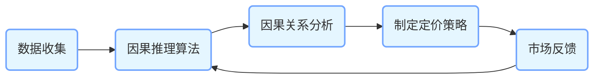

# 企业AI Agent的因果推理在产品定价策略优化中的应用

> 关键词：企业AI Agent、因果推理、产品定价策略、优化、人工智能

> 摘要：本文聚焦于企业AI Agent的因果推理在产品定价策略优化中的应用。随着市场竞争的加剧，企业需要更加科学合理的定价策略来提升竞争力和盈利能力。因果推理作为一种强大的分析工具，能够帮助企业AI Agent深入理解价格与各种因素之间的因果关系，从而制定出更有效的定价策略。文章首先介绍了相关背景，包括目的范围、预期读者等；接着阐述了核心概念与联系，通过文本示意图和Mermaid流程图进行说明；详细讲解了核心算法原理及具体操作步骤，并用Python代码示例展示；探讨了数学模型和公式；给出了项目实战案例及详细解释；分析了实际应用场景；推荐了相关工具和资源；最后总结了未来发展趋势与挑战，还设置了附录解答常见问题以及提供扩展阅读和参考资料。

## 1. 背景介绍 
### 1.1 目的和范围
在当今竞争激烈的商业环境中，产品定价策略对于企业的生存和发展至关重要。合理的定价不仅能够保证企业的利润，还能提高市场份额和客户满意度。然而，传统的定价方法往往基于经验和直觉，缺乏对市场动态和消费者行为的深入理解。企业AI Agent的因果推理为产品定价策略的优化提供了新的思路和方法。

本文的目的在于深入探讨企业AI Agent的因果推理如何应用于产品定价策略的优化，详细介绍相关的理论、算法和实践案例，为企业提供实用的参考和指导。范围涵盖了因果推理的基本概念、核心算法、数学模型，以及在不同行业和场景下的应用案例。

### 1.2 预期读者
本文预期读者包括企业的管理人员、市场营销人员、数据分析师、人工智能研发人员等。对于企业管理人员和市场营销人员，本文可以帮助他们了解如何利用因果推理优化产品定价策略，提升企业的市场竞争力；对于数据分析师和人工智能研发人员，本文提供了深入的技术细节和实践案例，有助于他们在实际项目中应用因果推理技术。

### 1.3 文档结构概述
本文将按照以下结构进行组织：
1. **背景介绍**：介绍本文的目的、范围、预期读者和文档结构，以及相关术语的定义和解释。
2. **核心概念与联系**：阐述企业AI Agent、因果推理、产品定价策略等核心概念，并通过文本示意图和Mermaid流程图展示它们之间的联系。
3. **核心算法原理 & 具体操作步骤**：详细介绍因果推理的核心算法原理，并用Python代码示例说明具体的操作步骤。
4. **数学模型和公式 & 详细讲解 & 举例说明**：介绍因果推理的数学模型和公式，并通过具体的例子进行详细讲解。
5. **项目实战：代码实际案例和详细解释说明**：给出一个实际的项目案例，包括开发环境搭建、源代码实现和代码解读。
6. **实际应用场景**：分析企业AI Agent的因果推理在不同行业和场景下的应用。
7. **工具和资源推荐**：推荐相关的学习资源、开发工具、框架和论文著作。
8. **总结：未来发展趋势与挑战**：总结企业AI Agent的因果推理在产品定价策略优化中的应用现状，分析未来的发展趋势和面临的挑战。
9. **附录：常见问题与解答**：解答读者在阅读过程中可能遇到的常见问题。
10. **扩展阅读 & 参考资料**：提供相关的扩展阅读材料和参考资料。

### 1.4 术语表
#### 1.4.1 核心术语定义
- **企业AI Agent**：指企业中具有人工智能能力的智能体，能够自主地感知环境、做出决策和采取行动。
- **因果推理**：是一种从数据中发现变量之间因果关系的方法，通过分析原因和结果之间的逻辑联系，揭示事物的内在规律。
- **产品定价策略**：是企业为了实现一定的营销目标，根据产品的成本、市场需求、竞争状况等因素，对产品价格进行制定和调整的策略。

#### 1.4.2 相关概念解释
- **因果关系**：是指一个事件（原因）的发生导致另一个事件（结果）的发生，原因和结果之间存在着一种必然的联系。
- **关联关系**：是指两个变量之间存在着某种统计上的相关性，但不一定存在因果关系。
- **反事实推理**：是因果推理中的一种重要方法，通过想象在不同条件下可能发生的结果，来推断某个因素对结果的因果影响。

#### 1.4.3 缩略词列表
- **AI**：Artificial Intelligence，人工智能
- **ML**：Machine Learning，机器学习
- **DL**：Deep Learning，深度学习

## 2. 核心概念与联系 

### 核心概念原理
#### 企业AI Agent
企业AI Agent是企业智能化的核心组成部分，它可以集成多种人工智能技术，如机器学习、自然语言处理、计算机视觉等，来实现对企业内部和外部环境的感知、分析和决策。企业AI Agent可以根据不同的任务和场景，自主地收集和处理数据，学习和优化自身的行为策略，以实现企业的目标。

#### 因果推理
因果推理的核心思想是从数据中发现变量之间的因果关系，而不仅仅是关联关系。传统的数据分析方法往往只能发现变量之间的相关性，但无法确定这种相关性是否是因果关系。因果推理通过引入因果模型和假设，利用实验数据或观察数据来推断变量之间的因果关系。常见的因果推理方法包括随机对照试验、工具变量法、倾向得分匹配法等。

#### 产品定价策略
产品定价策略是企业营销组合的重要组成部分，它直接影响企业的销售收入和利润。常见的产品定价策略包括成本加成定价法、需求导向定价法、竞争导向定价法等。在制定产品定价策略时，企业需要考虑多种因素，如产品成本、市场需求、竞争状况、消费者心理等。

### 架构的文本示意图
企业AI Agent的因果推理在产品定价策略优化中的应用架构可以描述如下：

企业AI Agent通过各种数据收集渠道（如企业内部数据库、市场调研数据、社交媒体数据等）收集与产品定价相关的数据，包括产品成本、市场需求、竞争状况、消费者行为等。然后，企业AI Agent利用因果推理算法对这些数据进行分析，发现价格与各种因素之间的因果关系。根据因果关系分析的结果，企业AI Agent可以制定出更科学合理的产品定价策略，并通过市场反馈不断优化定价策略。

### Mermaid 流程图


这个流程图展示了企业AI Agent的因果推理在产品定价策略优化中的应用流程。首先进行数据收集，然后利用因果推理算法进行分析，得到因果关系分析结果后制定定价策略，将定价策略投入市场后收集市场反馈，再将反馈数据用于因果推理算法的优化，形成一个闭环的优化过程。

## 3. 核心算法原理 & 具体操作步骤 

### 核心算法原理
在因果推理中，一种常用的算法是倾向得分匹配法（Propensity Score Matching，PSM）。倾向得分匹配法的基本思想是通过构建一个倾向得分模型，将处理组和对照组的样本进行匹配，使得匹配后的样本在协变量上具有相似的分布，从而减少选择偏差，估计出处理变量对结果变量的因果效应。

倾向得分是指在给定协变量的情况下，一个样本接受处理的概率。通过逻辑回归等方法可以估计出每个样本的倾向得分。然后，根据倾向得分对处理组和对照组的样本进行匹配，常用的匹配方法包括最近邻匹配、半径匹配、核匹配等。

### 具体操作步骤
以下是使用Python实现倾向得分匹配法的具体操作步骤：

```python
import pandas as pd
import numpy as np
from sklearn.linear_model import LogisticRegression
from sklearn.neighbors import NearestNeighbors

# 1. 数据准备
# 假设我们有一个数据集，包含处理变量（treatment）、结果变量（outcome）和协变量（covariates）
data = pd.read_csv('data.csv')
treatment = data['treatment']
outcome = data['outcome']
covariates = data.drop(['treatment', 'outcome'], axis=1)

# 2. 估计倾向得分
logreg = LogisticRegression()
logreg.fit(covariates, treatment)
propensity_scores = logreg.predict_proba(covariates)[:, 1]

# 3. 匹配样本
nbrs = NearestNeighbors(n_neighbors=1).fit(covariates[treatment == 1])
distances, indices = nbrs.kneighbors(covariates[treatment == 0])

# 4. 计算因果效应
matched_outcome_treatment = outcome[treatment == 1].values
matched_outcome_control = outcome[treatment == 0].values[indices.flatten()]
causal_effect = np.mean(matched_outcome_treatment - matched_outcome_control)

print(f"因果效应: {causal_effect}")
```

### 代码解释
1. **数据准备**：首先读取数据集，将处理变量、结果变量和协变量分别提取出来。
2. **估计倾向得分**：使用逻辑回归模型估计每个样本的倾向得分。
3. **匹配样本**：使用最近邻匹配方法，为对照组的每个样本找到一个倾向得分最接近的处理组样本。
4. **计算因果效应**：计算匹配后处理组和对照组的结果变量的差值的平均值，得到因果效应的估计值。

## 4. 数学模型和公式 & 详细讲解 & 举例说明 

### 数学模型和公式
#### 倾向得分的定义
倾向得分 $e(X)$ 定义为在给定协变量 $X$ 的情况下，样本接受处理 $T$ 的概率，即：
$$e(X) = P(T = 1|X)$$

#### 倾向得分匹配的因果效应估计
假设我们有处理组和对照组的样本，处理组的结果变量为 $Y_1$，对照组的结果变量为 $Y_0$。通过倾向得分匹配后，因果效应 $\tau$ 可以估计为：
$$\hat{\tau} = \frac{1}{n_1} \sum_{i: T_i = 1} Y_{1i} - \frac{1}{n_0} \sum_{j: T_j = 0} Y_{0j}$$
其中，$n_1$ 和 $n_0$ 分别是处理组和对照组的样本数量，$Y_{1i}$ 和 $Y_{0j}$ 分别是处理组和对照组的第 $i$ 个和第 $j$ 个样本的结果变量。

### 详细讲解
倾向得分匹配法的核心思想是通过构建倾向得分模型，将处理组和对照组的样本进行匹配，使得匹配后的样本在协变量上具有相似的分布。这样可以减少选择偏差，从而更准确地估计处理变量对结果变量的因果效应。

在估计倾向得分时，通常使用逻辑回归模型，将处理变量作为因变量，协变量作为自变量进行回归。得到倾向得分后，使用匹配方法（如最近邻匹配）为对照组的每个样本找到一个倾向得分最接近的处理组样本。最后，计算匹配后处理组和对照组的结果变量的差值的平均值，得到因果效应的估计值。

### 举例说明
假设我们要研究某种广告投放策略（处理变量 $T$）对产品销售额（结果变量 $Y$）的因果效应。我们收集了一些相关数据，包括广告投放情况（$T$）、产品销售额（$Y$）以及一些可能影响销售额的协变量（如产品价格、市场需求等）。

首先，我们使用逻辑回归模型估计每个样本的倾向得分。然后，使用最近邻匹配方法为对照组的每个样本找到一个倾向得分最接近的处理组样本。最后，计算匹配后处理组和对照组的销售额的差值的平均值，得到广告投放策略对产品销售额的因果效应估计值。

例如，经过匹配后，处理组的平均销售额为 1000 元，对照组的平均销售额为 800 元，则因果效应估计值为 200 元，这意味着广告投放策略可能会使产品销售额增加 200 元。

## 5. 项目实战：代码实际案例和详细解释说明 

### 5.1  开发环境搭建
#### 安装Python
首先，确保你已经安装了Python。可以从Python官方网站（https://www.python.org/downloads/）下载并安装适合你操作系统的Python版本。建议安装Python 3.7及以上版本。

#### 安装必要的库
在项目中，我们需要使用一些Python库，如pandas、numpy、scikit-learn等。可以使用以下命令安装这些库：
```sh
pip install pandas numpy scikit-learn
```

### 5.2  源代码详细实现和代码解读
以下是一个完整的项目实战代码示例，用于演示企业AI Agent的因果推理在产品定价策略优化中的应用：

```python
import pandas as pd
import numpy as np
from sklearn.linear_model import LogisticRegression
from sklearn.neighbors import NearestNeighbors

# 1. 数据准备
# 模拟一个数据集，包含处理变量（price_change）、结果变量（sales_volume）和协变量（product_features）
np.random.seed(42)
n_samples = 1000
product_features = np.random.randn(n_samples, 5)  # 5个产品特征
price_change = np.random.binomial(1, 0.5, n_samples)  # 价格变化（处理变量）
sales_volume = 100 + 10 * price_change + 5 * product_features[:, 0] + np.random.randn(n_samples)  # 销售额（结果变量）

data = pd.DataFrame({
    'price_change': price_change,
    'sales_volume': sales_volume
})
data = pd.concat([data, pd.DataFrame(product_features, columns=[f'feature_{i}' for i in range(5)])], axis=1)

# 2. 估计倾向得分
treatment = data['price_change']
outcome = data['sales_volume']
covariates = data.drop(['price_change', 'sales_volume'], axis=1)

logreg = LogisticRegression()
logreg.fit(covariates, treatment)
propensity_scores = logreg.predict_proba(covariates)[:, 1]

# 3. 匹配样本
nbrs = NearestNeighbors(n_neighbors=1).fit(covariates[treatment == 1])
distances, indices = nbrs.kneighbors(covariates[treatment == 0])

# 4. 计算因果效应
matched_outcome_treatment = outcome[treatment == 1].values
matched_outcome_control = outcome[treatment == 0].values[indices.flatten()]
causal_effect = np.mean(matched_outcome_treatment - matched_outcome_control)

print(f"价格变化对销售额的因果效应: {causal_effect}")

# 5. 优化定价策略
# 根据因果效应，我们可以调整产品价格
if causal_effect > 0:
    print("可以考虑提高产品价格以增加销售额")
else:
    print("需要谨慎考虑价格调整，可能需要降低价格以提高销售额")
```

### 5.3  代码解读与分析
1. **数据准备**：首先模拟了一个数据集，包含处理变量（价格变化）、结果变量（销售额）和协变量（产品特征）。
2. **估计倾向得分**：使用逻辑回归模型估计每个样本的倾向得分。
3. **匹配样本**：使用最近邻匹配方法，为对照组的每个样本找到一个倾向得分最接近的处理组样本。
4. **计算因果效应**：计算匹配后处理组和对照组的销售额的差值的平均值，得到价格变化对销售额的因果效应估计值。
5. **优化定价策略**：根据因果效应的估计值，给出了一个简单的定价策略建议。如果因果效应大于 0，说明价格变化对销售额有正向影响，可以考虑提高产品价格；否则，需要谨慎考虑价格调整，可能需要降低价格以提高销售额。

## 6. 实际应用场景 
### 零售行业
在零售行业，企业AI Agent的因果推理可以帮助企业优化产品定价策略。例如，通过分析不同价格水平下的销售数据、消费者行为数据和市场竞争数据，企业可以使用因果推理方法发现价格与销售额、利润、市场份额等指标之间的因果关系。根据因果关系分析的结果，企业可以制定出更科学合理的定价策略，如动态定价、差异化定价等。

### 金融行业
在金融行业，因果推理可以应用于贷款定价、保险定价等领域。例如，银行可以通过分析借款人的信用数据、财务数据和市场环境数据，使用因果推理方法评估不同贷款利率对贷款违约率、利润等指标的因果影响。根据因果效应的估计值，银行可以制定出更合理的贷款利率策略，降低贷款风险，提高盈利能力。

### 医疗行业
在医疗行业，因果推理可以帮助医院和药企优化药品定价策略。例如，药企可以通过分析药品的临床试验数据、市场需求数据和竞争数据，使用因果推理方法发现药品价格与销量、利润、患者满意度等指标之间的因果关系。根据因果关系分析的结果，药企可以制定出更合理的药品价格策略，提高药品的可及性和市场竞争力。

## 7. 工具和资源推荐
### 7.1 学习资源推荐
#### 7.1.1 书籍推荐
- 《因果推断：基础与学习算法》：这本书系统地介绍了因果推断的基本概念、理论和算法，是学习因果推断的经典教材。
- 《统计因果推理入门》：本书以通俗易懂的方式介绍了统计因果推理的基本原理和方法，适合初学者阅读。

#### 7.1.2 在线课程
- Coursera上的“因果推理”课程：由知名学者授课，内容涵盖了因果推理的基本概念、方法和应用。
- edX上的“数据科学中的因果推断”课程：结合实际案例，介绍了因果推断在数据科学中的应用。

#### 7.1.3 技术博客和网站
- 因果推断社区（https://causalinference.org/）：提供了因果推断领域的最新研究成果、学术会议信息和开源代码。
- Towards Data Science（https://towardsdatascience.com/）：有许多关于因果推断和人工智能的技术博客文章。

### 7.2 开发工具框架推荐
#### 7.2.1 IDE和编辑器
- PyCharm：是一款功能强大的Python集成开发环境，支持代码编辑、调试、版本控制等功能。
- Jupyter Notebook：是一个交互式的编程环境，适合数据探索、模型开发和实验。

#### 7.2.2 调试和性能分析工具
- Py-Spy：是一个用于Python代码性能分析的工具，可以帮助开发者找出代码中的性能瓶颈。
- PDB：是Python自带的调试工具，可以帮助开发者调试代码中的错误。

#### 7.2.3 相关框架和库
- CausalML：是一个开源的Python库，提供了多种因果推断算法和工具。
- EconML：是微软开源的一个Python库，专注于经济因果推断和机器学习的结合。

### 7.3 相关论文著作推荐
#### 7.3.1 经典论文
- “The Central Role of the Propensity Score in Observational Studies for Causal Effects”：这篇论文介绍了倾向得分在因果推断中的核心作用，是倾向得分匹配法的经典文献。
- “Causal Inference in Statistics: A Primer”：这篇论文系统地介绍了统计因果推断的基本概念和方法。

#### 7.3.2 最新研究成果
- 关注顶级学术会议（如NeurIPS、ICML、KDD等）上关于因果推断的最新研究成果。
- 关注顶级学术期刊（如Journal of Causal Inference、Journal of Machine Learning Research等）上的相关论文。

#### 7.3.3 应用案例分析
- 许多企业和研究机构会发布关于因果推断在实际应用中的案例分析报告，可以通过他们的官方网站或学术数据库获取。

## 8. 总结：未来发展趋势与挑战
### 未来发展趋势
- **多模态数据融合**：未来，企业AI Agent的因果推理将更多地融合多模态数据，如文本、图像、视频等，以更全面地了解市场和消费者行为，从而制定更精准的定价策略。
- **与深度学习的结合**：因果推理与深度学习的结合将成为未来的研究热点。深度学习可以帮助企业AI Agent更好地处理复杂的数据，而因果推理可以为深度学习模型提供可解释性，提高模型的决策质量。
- **实时定价优化**：随着技术的发展，企业将能够实现实时的定价优化。企业AI Agent可以根据市场动态和消费者行为的实时变化，及时调整产品价格，提高企业的竞争力。

### 挑战
- **数据质量和可用性**：因果推理需要大量高质量的数据，但在实际应用中，数据可能存在缺失、噪声、偏差等问题，影响因果推断的准确性。
- **因果模型的复杂性**：构建准确的因果模型是因果推理的关键，但因果模型往往比较复杂，需要考虑多种因素和假设，增加了模型的构建和验证难度。
- **可解释性和信任问题**：虽然因果推理可以提供一定的可解释性，但对于一些复杂的因果模型，其解释性仍然有限。此外，企业和消费者对AI Agent的决策结果可能存在信任问题，需要进一步提高模型的可解释性和透明度。

## 9. 附录：常见问题与解答
### 1. 因果推理和关联分析有什么区别？
关联分析只能发现变量之间的相关性，但无法确定这种相关性是否是因果关系。因果推理则通过引入因果模型和假设，利用实验数据或观察数据来推断变量之间的因果关系。

### 2. 倾向得分匹配法有哪些局限性？
倾向得分匹配法的局限性包括：需要假设处理变量和结果变量之间存在线性关系；对协变量的选择比较敏感，如果协变量选择不当，可能会导致选择偏差；匹配过程可能会丢失一些样本信息。

### 3. 如何评估因果效应估计的准确性？
可以使用交叉验证、敏感性分析等方法评估因果效应估计的准确性。交叉验证可以通过将数据集分成训练集和测试集，在测试集上评估模型的性能；敏感性分析可以通过改变模型的假设和参数，观察因果效应估计值的变化情况。

## 10. 扩展阅读 & 参考资料
### 扩展阅读
- Pearl, J., Glymour, M., & Jewell, N. P. (2016). Causal inference in statistics: A primer. Wiley.
- Imbens, G. W., & Rubin, D. B. (2015). Causal inference for statistics, social, and biomedical sciences: An introduction. Cambridge University Press.

### 参考资料
- Angrist, J. D., & Pischke, J. -S. (2009). Mostly harmless econometrics: An empiricist's companion. Princeton University Press.
- Hernán, M. A., & Robins, J. M. (2020). Causal inference: What if. Chapman and Hall/CRC.