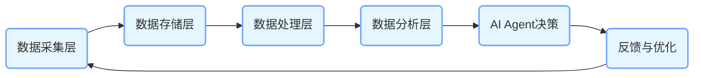

# 企业AI Agent的大数据处理框架

> 关键词：企业AI Agent、大数据处理框架、数据采集、数据存储、数据分析

> 摘要：本文围绕企业AI Agent的大数据处理框架展开深入探讨。首先介绍了该框架的背景，包括目的、预期读者、文档结构和相关术语。接着阐述了核心概念及联系，给出了原理和架构的示意图与流程图。详细讲解了核心算法原理和具体操作步骤，并通过Python代码进行说明。同时分析了数学模型和公式，结合实际例子加深理解。在项目实战部分，给出了开发环境搭建、源代码实现及解读。还探讨了实际应用场景，推荐了学习资源、开发工具框架和相关论文著作。最后总结了未来发展趋势与挑战，提供了常见问题解答和扩展阅读参考资料，旨在为企业构建和应用AI Agent的大数据处理框架提供全面的技术指导。

## 1. 背景介绍 

### 1.1 目的和范围
企业在数字化转型的过程中，积累了大量的数据。如何高效地处理这些大数据，并利用AI Agent从中挖掘有价值的信息，成为企业提升竞争力的关键。本大数据处理框架的目的在于为企业提供一个系统化、标准化的解决方案，使得企业能够更好地管理和利用大数据，实现数据驱动的决策。

本框架的范围涵盖了从数据采集、存储、处理到分析的整个大数据处理流程，并且结合了AI Agent的智能特性，实现自动化的数据处理和决策支持。

### 1.2 预期读者
本文的预期读者包括企业的技术管理人员、数据分析师、AI开发者以及对企业大数据处理和AI Agent应用感兴趣的技术爱好者。对于企业技术管理人员，本文可以帮助他们了解大数据处理框架的整体架构和价值，为企业的技术选型和战略规划提供参考；数据分析师可以从中学习到如何利用AI Agent进行更高效的数据处理和分析；AI开发者则可以获取具体的技术实现细节和代码示例。

### 1.3 文档结构概述
本文将按照以下结构进行阐述：首先介绍核心概念与联系，让读者对企业AI Agent的大数据处理框架有一个整体的认识；接着详细讲解核心算法原理和具体操作步骤，包括Python代码实现；然后分析数学模型和公式，并举例说明；通过项目实战部分展示代码实际案例和详细解释；探讨实际应用场景，说明框架的实用性；推荐相关的工具和资源，帮助读者进一步学习和应用；最后总结未来发展趋势与挑战，解答常见问题，并提供扩展阅读和参考资料。

### 1.4 术语表

#### 1.4.1 核心术语定义
- **企业AI Agent**：是指在企业环境中，具备一定智能决策能力的软件实体，它可以自动完成数据处理、分析和决策等任务，能够与企业的大数据系统进行交互，实现数据的高效利用。
- **大数据处理框架**：是一套用于处理大规模数据的软件架构，包括数据采集、存储、处理和分析等多个环节，旨在提供高效、可靠的数据处理解决方案。
- **数据采集**：是指从各种数据源（如数据库、文件系统、传感器等）收集数据的过程。
- **数据存储**：将采集到的数据以合适的方式存储在存储系统中，以便后续的处理和分析。
- **数据分析**：对存储的数据进行挖掘、统计和建模等操作，以发现数据中的有价值信息。

#### 1.4.2 相关概念解释
- **分布式计算**：是一种将计算任务分配到多个计算节点上进行并行处理的计算方式，在大数据处理中可以提高处理效率。
- **机器学习**：是一门多领域交叉学科，涉及概率论、统计学、逼近论、凸分析、算法复杂度理论等多门学科。它专门研究计算机怎样模拟或实现人类的学习行为，以获取新的知识或技能，重新组织已有的知识结构使之不断改善自身的性能。
- **深度学习**：是机器学习的一个分支领域，它是一种基于对数据进行表征学习的方法。深度学习通过构建具有很多层的神经网络模型，自动从数据中学习复杂的模式和特征。

#### 1.4.3 缩略词列表
- **ETL**：Extract-Transform-Load，即数据抽取、转换和加载，是数据采集和预处理的重要步骤。
- **HDFS**：Hadoop Distributed File System，是Hadoop的分布式文件系统，用于存储大规模数据。
- **Spark**：是一个快速通用的集群计算系统，提供了高效的分布式数据处理能力。

## 2. 核心概念与联系 

企业AI Agent的大数据处理框架主要由数据采集层、数据存储层、数据处理层和数据分析层组成，各层之间相互协作，共同完成大数据的处理和分析任务。

### 核心概念原理和架构的文本示意图
```plaintext
+-------------------+
| 数据采集层        |
| - 数据源连接       |
| - 数据采集工具     |
+-------------------+
| 数据存储层        |
| - 分布式文件系统   |
| - 数据库           |
+-------------------+
| 数据处理层        |
| - 数据清洗         |
| - 数据转换         |
| - 分布式计算框架   |
+-------------------+
| 数据分析层        |
| - 机器学习模型     |
| - 深度学习模型     |
| - AI Agent决策     |
+-------------------+
```

### Mermaid流程图


数据采集层负责从各种数据源收集数据，包括结构化数据和非结构化数据。数据存储层将采集到的数据存储在分布式文件系统或数据库中，以保证数据的可靠性和可扩展性。数据处理层对存储的数据进行清洗、转换和计算，为后续的分析提供高质量的数据。数据分析层利用机器学习和深度学习模型对处理后的数据进行分析，AI Agent根据分析结果做出决策，并将决策结果反馈到整个流程中进行优化。

## 3. 核心算法原理 & 具体操作步骤 

### 核心算法原理
在企业AI Agent的大数据处理框架中，涉及到多种核心算法，如数据清洗算法、机器学习算法和深度学习算法等。下面以数据清洗算法中的缺失值处理为例进行讲解。

缺失值处理是数据清洗的重要步骤，常见的方法有删除法、均值填充法和插值法等。均值填充法是一种简单有效的方法，其原理是计算某一列非缺失值的均值，然后用该均值填充该列的缺失值。

### 具体操作步骤
以下是使用Python实现均值填充法的代码示例：
```python
import pandas as pd
import numpy as np

# 生成包含缺失值的示例数据
data = {
    'col1': [1, 2, np.nan, 4, 5],
    'col2': [np.nan, 7, 8, 9, 10]
}
df = pd.DataFrame(data)

# 计算每列的均值
means = df.mean()

# 用均值填充缺失值
df_filled = df.fillna(means)

print("原始数据：")
print(df)
print("填充后的数据：")
print(df_filled)
```
### 代码解释
1. **导入必要的库**：导入`pandas`和`numpy`库，`pandas`用于数据处理，`numpy`用于处理缺失值（`np.nan`表示缺失值）。
2. **生成示例数据**：创建一个包含缺失值的`DataFrame`对象。
3. **计算均值**：使用`df.mean()`方法计算每列的均值。
4. **填充缺失值**：使用`df.fillna(means)`方法用均值填充缺失值。
5. **输出结果**：打印原始数据和填充后的数据。

## 4. 数学模型和公式 & 详细讲解 & 举例说明 

### 均值填充法的数学模型和公式
设数据集 $D$ 包含 $n$ 个样本，每个样本有 $m$ 个特征，即 $D = \{x_{ij}\}_{n\times m}$，其中 $x_{ij}$ 表示第 $i$ 个样本的第 $j$ 个特征值。对于第 $j$ 个特征，其非缺失值的集合为 $S_j = \{x_{ij}|x_{ij}\neq \text{nan}, i = 1,2,\cdots,n\}$，该特征的均值 $\bar{x}_j$ 计算公式为：
$$\bar{x}_j = \frac{1}{|S_j|}\sum_{x_{ij}\in S_j}x_{ij}$$
其中 $|S_j|$ 表示集合 $S_j$ 的元素个数。

### 详细讲解
均值填充法的基本思想是用该特征的均值来代替缺失值，这样可以在一定程度上保持数据的整体分布。该方法简单易行，但可能会引入偏差，特别是当数据分布不均匀时。

### 举例说明
假设有以下数据集：
| 样本编号 | 特征1 | 特征2 |
| ---- | ---- | ---- |
| 1 | 1 | 2 |
| 2 | 2 | nan |
| 3 | nan | 4 |
| 4 | 4 | 5 |
| 5 | 5 | 6 |

对于特征1，非缺失值为 $1, 2, 4, 5$，其均值为 $\frac{1 + 2 + 4 + 5}{4} = 3$。对于特征2，非缺失值为 $2, 4, 5, 6$，其均值为 $\frac{2 + 4 + 5 + 6}{4} = 4.25$。用均值填充后的数据为：
| 样本编号 | 特征1 | 特征2 |
| ---- | ---- | ---- |
| 1 | 1 | 2 |
| 2 | 2 | 4.25 |
| 3 | 3 | 4 |
| 4 | 4 | 5 |
| 5 | 5 | 6 |

## 5. 项目实战：代码实际案例和详细解释说明 

### 5.1  开发环境搭建
- **操作系统**：建议使用Linux系统，如Ubuntu 18.04及以上版本。
- **Python环境**：安装Python 3.7及以上版本，可以使用Anaconda进行Python环境的管理。
- **相关库安装**：安装`pandas`、`numpy`、`scikit-learn`、`tensorflow`等库，可以使用以下命令进行安装：
```bash
pip install pandas numpy scikit-learn tensorflow
```

### 5.2  源代码详细实现和代码解读
以下是一个完整的企业AI Agent大数据处理框架的代码示例，包括数据采集、清洗、存储和分析的过程。

```python
import pandas as pd
import numpy as np
from sklearn.model_selection import train_test_split
from sklearn.linear_model import LinearRegression
import sqlite3

# 数据采集：模拟从数据库中采集数据
def data_collection():
    # 连接到SQLite数据库
    conn = sqlite3.connect('data.db')
    # 执行SQL查询语句获取数据
    query = "SELECT * FROM data_table"
    df = pd.read_sql(query, conn)
    conn.close()
    return df

# 数据清洗：处理缺失值
def data_cleaning(df):
    means = df.mean()
    df_filled = df.fillna(means)
    return df_filled

# 数据存储：将清洗后的数据存储到数据库中
def data_storage(df):
    conn = sqlite3.connect('cleaned_data.db')
    df.to_sql('cleaned_table', conn, if_exists='replace', index=False)
    conn.close()

# 数据分析：使用线性回归模型进行预测
def data_analysis(df):
    X = df.drop('target', axis=1)
    y = df['target']
    X_train, X_test, y_train, y_test = train_test_split(X, y, test_size=0.2, random_state=42)
    model = LinearRegression()
    model.fit(X_train, y_train)
    score = model.score(X_test, y_test)
    return score

# 主函数
def main():
    # 数据采集
    data = data_collection()
    # 数据清洗
    cleaned_data = data_cleaning(data)
    # 数据存储
    data_storage(cleaned_data)
    # 数据分析
    score = data_analysis(cleaned_data)
    print(f"模型得分：{score}")

if __name__ == "__main__":
    main()
```

### 5.3  代码解读与分析
1. **数据采集**：`data_collection`函数通过`sqlite3`库连接到SQLite数据库，执行SQL查询语句获取数据，并将数据存储在`pandas`的`DataFrame`对象中。
2. **数据清洗**：`data_cleaning`函数使用均值填充法处理数据中的缺失值。
3. **数据存储**：`data_storage`函数将清洗后的数据存储到另一个SQLite数据库中。
4. **数据分析**：`data_analysis`函数使用`scikit-learn`库中的线性回归模型进行数据分析，将数据分为训练集和测试集，训练模型并计算模型的得分。
5. **主函数**：`main`函数依次调用数据采集、清洗、存储和分析的函数，并打印模型的得分。

## 6. 实际应用场景 
企业AI Agent的大数据处理框架在多个实际应用场景中具有重要价值：

### 客户关系管理
通过对客户的历史购买数据、浏览记录、反馈信息等大数据进行采集和分析，AI Agent可以自动识别客户的需求和偏好，为企业提供个性化的营销建议，提高客户满意度和忠诚度。

### 供应链管理
在供应链中，大数据处理框架可以实时监测物流信息、库存水平、供应商绩效等数据。AI Agent根据分析结果预测需求、优化库存管理和物流配送，降低企业的运营成本。

### 风险管理
企业面临着各种风险，如市场风险、信用风险等。通过对市场数据、财务数据、行业数据等进行分析，AI Agent可以识别潜在的风险因素，并提供风险预警和应对策略。

### 生产制造
在生产制造过程中，大数据处理框架可以采集设备运行数据、生产质量数据等。AI Agent可以对这些数据进行分析，实现设备故障预测、生产过程优化，提高生产效率和产品质量。

## 7. 工具和资源推荐

### 7.1 学习资源推荐

#### 7.1.1 书籍推荐
- 《Python数据分析实战》：本书详细介绍了使用Python进行数据分析的方法和技巧，包括数据采集、清洗、分析和可视化等方面。
- 《机器学习实战》：通过实际案例介绍了机器学习的基本算法和应用，适合初学者入门。
- 《深度学习》：由深度学习领域的三位先驱Ian Goodfellow、Yoshua Bengio和Aaron Courville撰写，是深度学习领域的经典著作。

#### 7.1.2 在线课程
- Coursera上的“机器学习”课程：由斯坦福大学教授Andrew Ng主讲，是机器学习领域的经典课程。
- edX上的“深度学习”课程：提供了深度学习的深入讲解和实践项目。
- 阿里云大学的大数据课程：涵盖了大数据处理的各个方面，包括Hadoop、Spark等技术。

#### 7.1.3 技术博客和网站
- Medium：有很多数据科学和人工智能领域的优秀博客文章。
- Kaggle：是一个数据科学竞赛平台，上面有很多数据科学的案例和代码分享。
- 开源中国：提供了丰富的技术文章和开源项目。

### 7.2 开发工具框架推荐

#### 7.2.1 IDE和编辑器
- PyCharm：是一款专门为Python开发设计的集成开发环境，具有强大的代码编辑、调试和智能提示功能。
- Jupyter Notebook：是一个交互式的开发环境，适合进行数据分析和模型训练的实验。
- Visual Studio Code：是一款轻量级的代码编辑器，支持多种编程语言，有丰富的插件扩展。

#### 7.2.2 调试和性能分析工具
- PDB：Python自带的调试器，可以帮助开发者定位代码中的问题。
- cProfile：Python的性能分析工具，可以分析代码的运行时间和函数调用情况。
- TensorBoard：是TensorFlow的可视化工具，用于可视化深度学习模型的训练过程和性能指标。

#### 7.2.3 相关框架和库
- Hadoop：是一个开源的分布式计算框架，用于处理大规模数据。
- Spark：是一个快速通用的集群计算系统，提供了高效的分布式数据处理能力。
- TensorFlow：是一个开源的深度学习框架，广泛应用于图像识别、自然语言处理等领域。

### 7.3 相关论文著作推荐

#### 7.3.1 经典论文
- 《The Matrix Factorization Technique for Recommender Systems》：介绍了矩阵分解技术在推荐系统中的应用。
- 《Gradient-Based Learning Applied to Document Recognition》：由Yann LeCun等人撰写，是卷积神经网络领域的经典论文。
- 《Attention Is All You Need》：提出了Transformer模型，在自然语言处理领域取得了巨大成功。

#### 7.3.2 最新研究成果
- 在arXiv.org上可以找到很多关于大数据处理和AI Agent的最新研究论文。
- 顶级学术会议如NIPS、ICML、KDD等的会议论文集也包含了很多前沿的研究成果。

#### 7.3.3 应用案例分析
- 《Big Data: A Revolution That Will Transform How We Live, Work, and Think》：通过实际案例介绍了大数据在各个领域的应用和影响。
- 一些企业的技术博客会分享他们在大数据处理和AI Agent应用方面的实践经验。

## 8. 总结：未来发展趋势与挑战 

### 未来发展趋势
- **智能化程度不断提高**：企业AI Agent将具备更强的智能决策能力，能够自动处理复杂的大数据问题，提供更精准的决策支持。
- **与物联网的融合**：随着物联网技术的发展，企业将面临更多来自物联网设备的大数据。大数据处理框架将与物联网深度融合，实现数据的实时采集和处理。
- **隐私保护和安全增强**：在处理大数据的过程中，隐私保护和数据安全将变得更加重要。未来的大数据处理框架将采用更先进的加密技术和隐私保护机制。

### 挑战
- **数据质量问题**：大数据的质量参差不齐，存在大量的噪声、缺失值和异常值。如何提高数据质量，是大数据处理框架面临的重要挑战。
- **计算资源和成本**：处理大规模数据需要大量的计算资源，企业需要投入高额的成本来建设和维护大数据处理平台。
- **人才短缺**：大数据处理和AI Agent开发需要具备多学科知识的专业人才，目前市场上这类人才短缺，限制了企业的发展。

## 9. 附录：常见问题与解答 

### 问题1：如何选择合适的数据存储系统？
解答：选择数据存储系统需要考虑数据的规模、类型、访问模式和性能要求等因素。对于大规模的结构化数据，可以选择关系型数据库或分布式文件系统；对于非结构化数据，如文本、图像和视频，可以选择对象存储系统。

### 问题2：如何提高机器学习模型的性能？
解答：可以从以下几个方面提高机器学习模型的性能：选择合适的模型算法；对数据进行预处理，如特征工程、数据标准化等；调整模型的超参数；增加训练数据的数量和质量。

### 问题3：如何确保大数据处理的安全性？
解答：可以采取以下措施确保大数据处理的安全性：对数据进行加密处理；设置访问权限和身份认证机制；定期进行数据备份和恢复；采用安全的网络架构和防火墙。

## 10. 扩展阅读 & 参考资料 
- 《数据挖掘：概念与技术》，Jiawei Han等著
- 《Python机器学习基础教程》，Andreas C. Müller等著
- Kaggle官方文档：https://www.kaggle.com/docs
- Hadoop官方文档：https://hadoop.apache.org/docs
- Spark官方文档：https://spark.apache.org/docs
- TensorFlow官方文档：https://www.tensorflow.org/api_docs