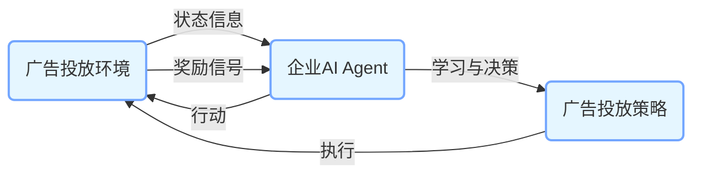

# 企业AI Agent的强化学习在广告投放优化中的实践

> 关键词：企业AI Agent、强化学习、广告投放优化、智能决策、营销效率

> 摘要：本文聚焦于企业AI Agent的强化学习在广告投放优化中的实践应用。首先介绍了该研究的背景，包括目的、预期读者等内容。接着深入探讨了核心概念，如企业AI Agent、强化学习的原理和联系，并给出相应的架构示意图和流程图。详细阐述了核心算法原理，通过Python源代码进行说明，同时讲解了相关的数学模型和公式。在项目实战部分，给出代码实际案例并进行详细解释。分析了广告投放优化中该技术的实际应用场景，推荐了相关的学习资源、开发工具框架以及论文著作。最后总结了未来发展趋势与挑战，提供常见问题解答和扩展阅读参考资料，旨在为企业在广告投放中利用强化学习提供全面的技术指导和实践思路。

## 1. 背景介绍 
### 1.1 目的和范围
在当今数字化营销时代，广告投放是企业推广产品和服务的重要手段。然而，传统的广告投放方式往往依赖于经验和规则，难以适应复杂多变的市场环境和用户行为。企业AI Agent的强化学习为广告投放优化提供了新的思路和方法。本文的目的在于深入探讨如何利用企业AI Agent的强化学习技术，实现广告投放的智能决策，提高广告投放的效率和效果。范围涵盖了强化学习的基本原理、相关算法、数学模型，以及在广告投放优化中的具体实践和应用场景。

### 1.2 预期读者
本文预期读者包括企业的营销人员、广告投放专员、数据分析师、人工智能领域的研究者和开发者，以及对广告投放优化和强化学习技术感兴趣的技术爱好者。通过阅读本文，读者能够了解企业AI Agent的强化学习在广告投放优化中的基本原理、实践方法和应用前景，为其在实际工作和研究中提供参考和借鉴。

### 1.3 文档结构概述
本文将按照以下结构展开：首先介绍背景信息，包括目的、预期读者和文档结构概述等内容；接着阐述核心概念与联系，包括企业AI Agent和强化学习的原理和架构；详细讲解核心算法原理和具体操作步骤，并给出Python源代码示例；介绍相关的数学模型和公式，并通过举例进行说明；在项目实战部分，介绍开发环境搭建、源代码实现和代码解读；分析实际应用场景；推荐相关的工具和资源；总结未来发展趋势与挑战；提供常见问题与解答和扩展阅读参考资料。

### 1.4 术语表
#### 1.4.1 核心术语定义
- **企业AI Agent**：是指在企业环境中，能够感知环境信息、自主决策并采取行动以实现企业目标的智能体。它可以基于强化学习等技术，不断学习和优化自身的行为策略。
- **强化学习**：是一种机器学习范式，智能体通过与环境进行交互，根据环境反馈的奖励信号来学习最优行为策略，以最大化长期累积奖励。
- **广告投放优化**：是指通过合理选择广告投放的时间、地点、受众等参数，提高广告的点击率、转化率等效果指标，从而实现广告投放效益的最大化。

#### 1.4.2 相关概念解释
- **状态（State）**：在强化学习中，状态是对环境的一种描述，智能体根据当前状态来选择行动。在广告投放中，状态可以包括用户的特征、市场环境、广告投放历史等信息。
- **行动（Action）**：智能体在某个状态下采取的操作。在广告投放中，行动可以包括选择广告投放的渠道、投放的广告素材、出价等。
- **奖励（Reward）**：环境对智能体行动的反馈信号，用于评价行动的好坏。在广告投放中，奖励可以是广告的点击率、转化率、收益等指标。

#### 1.4.3 缩略词列表
- **AI**：Artificial Intelligence，人工智能
- **RL**：Reinforcement Learning，强化学习
- **CTR**：Click - Through Rate，点击率
- **CVR**：Conversion Rate，转化率

## 2. 核心概念与联系 

### 2.1 企业AI Agent原理
企业AI Agent是基于人工智能技术构建的智能体，它具有感知、决策和行动的能力。其原理是通过传感器或数据接口获取企业内外的环境信息，将这些信息进行处理和分析，然后根据预设的目标和策略做出决策，并通过执行器或接口采取相应的行动。企业AI Agent可以不断学习和适应环境的变化，以提高自身的性能和效率。

### 2.2 强化学习原理
强化学习的核心思想是智能体在环境中不断尝试不同的行动，根据环境反馈的奖励信号来学习最优的行为策略。智能体的学习过程可以用马尔可夫决策过程（MDP）来描述。马尔可夫决策过程由状态集合 $S$、行动集合 $A$、状态转移概率 $P(s'|s,a)$、奖励函数 $R(s,a,s')$ 和折扣因子 $\gamma$ 组成。智能体在每个时间步 $t$ 根据当前状态 $s_t$ 选择一个行动 $a_t$，环境根据状态转移概率 $P(s'|s,a)$ 转移到下一个状态 $s_{t + 1}$，并给予智能体一个奖励 $r_{t+1}=R(s_t,a_t,s_{t + 1})$。智能体的目标是最大化长期累积奖励 $G_t=\sum_{k = 0}^{\infty}\gamma^k r_{t + k + 1}$。

### 2.3 企业AI Agent与强化学习的联系
企业AI Agent可以利用强化学习技术来实现智能决策。在广告投放优化中，企业AI Agent可以作为智能体，将广告投放环境作为环境，通过不断与环境交互，根据广告投放的效果（如点击率、转化率等）作为奖励信号，学习最优的广告投放策略。强化学习为企业AI Agent提供了一种有效的学习和决策方法，使企业AI Agent能够在复杂多变的广告投放环境中不断优化自身的行为，提高广告投放的效果。

### 2.4 架构示意图
以下是企业AI Agent的强化学习在广告投放优化中的架构示意图：



该架构图展示了企业AI Agent与广告投放环境之间的交互过程。企业AI Agent接收广告投放环境的状态信息，根据强化学习算法进行学习和决策，生成广告投放策略并执行。广告投放环境根据执行结果反馈奖励信号，企业AI Agent根据奖励信号不断优化自身的策略。

## 3. 核心算法原理 & 具体操作步骤 

### 3.1 Q - Learning算法原理
Q - Learning是一种无模型的强化学习算法，它通过学习一个动作价值函数 $Q(s,a)$ 来实现最优策略的学习。动作价值函数 $Q(s,a)$ 表示在状态 $s$ 下采取行动 $a$ 并遵循最优策略时的预期长期累积奖励。Q - Learning算法的更新公式为：

$$Q(s_t,a_t) \leftarrow Q(s_t,a_t)+\alpha\left[r_{t + 1}+\gamma\max_{a}Q(s_{t+1},a)-Q(s_t,a_t)\right]$$

其中，$\alpha$ 是学习率，$\gamma$ 是折扣因子。

### 3.2 具体操作步骤
1. **初始化**：初始化动作价值函数 $Q(s,a)$ 为任意值，通常初始化为0。
2. **循环执行**：
    - 观察当前状态 $s_t$。
    - 根据一定的策略（如 $\epsilon$ - 贪心策略）选择行动 $a_t$。
    - 执行行动 $a_t$，观察环境反馈的奖励 $r_{t + 1}$ 和下一个状态 $s_{t+1}$。
    - 根据Q - Learning更新公式更新 $Q(s_t,a_t)$。
    - 更新当前状态 $s_t = s_{t+1}$。
3. **终止条件**：达到预设的训练步数或满足其他终止条件。

### 3.3 Python源代码实现
```python
import numpy as np

class QLearningAgent:
    def __init__(self, state_size, action_size, learning_rate=0.1, discount_factor=0.9, epsilon=0.1):
        self.state_size = state_size
        self.action_size = action_size
        self.learning_rate = learning_rate
        self.discount_factor = discount_factor
        self.epsilon = epsilon
        self.q_table = np.zeros((state_size, action_size))

    def choose_action(self, state):
        if np.random.uniform(0, 1) < self.epsilon:
            # 探索：随机选择一个行动
            action = np.random.choice(self.action_size)
        else:
            # 利用：选择Q值最大的行动
            action = np.argmax(self.q_table[state, :])
        return action

    def update_q_table(self, state, action, reward, next_state):
        # 根据Q - Learning更新公式更新Q表
        max_q_next = np.max(self.q_table[next_state, :])
        self.q_table[state, action] += self.learning_rate * (reward + self.discount_factor * max_q_next - self.q_table[state, action])
```

### 3.4 代码解释
- `__init__` 方法：初始化Q - Learning智能体，包括状态空间大小、动作空间大小、学习率、折扣因子、探索率和Q表。
- `choose_action` 方法：根据 $\epsilon$ - 贪心策略选择行动。以 $\epsilon$ 的概率随机选择一个行动进行探索，以 $1 - \epsilon$ 的概率选择Q值最大的行动进行利用。
- `update_q_table` 方法：根据Q - Learning更新公式更新Q表。

## 4. 数学模型和公式 & 详细讲解 & 举例说明 

### 4.1 马尔可夫决策过程（MDP）
马尔可夫决策过程（MDP）是强化学习的基础数学模型，它由以下几个部分组成：
- **状态集合 $S$**：表示环境的所有可能状态。例如，在广告投放中，状态可以包括用户的年龄、性别、兴趣爱好、当前时间等信息。
- **行动集合 $A$**：表示智能体在每个状态下可以采取的所有可能行动。例如，在广告投放中，行动可以包括选择不同的广告渠道、不同的广告素材、不同的出价等。
- **状态转移概率 $P(s'|s,a)$**：表示在状态 $s$ 下采取行动 $a$ 后转移到状态 $s'$ 的概率。例如，在广告投放中，状态转移概率可以表示用户在看到广告后，由于广告的影响而改变自身状态（如购买行为、兴趣变化等）的概率。
- **奖励函数 $R(s,a,s')$**：表示在状态 $s$ 下采取行动 $a$ 并转移到状态 $s'$ 时，智能体获得的奖励。例如，在广告投放中，奖励可以是广告的点击率、转化率、收益等指标。
- **折扣因子 $\gamma$**：用于衡量未来奖励的重要性，取值范围为 $[0,1]$。$\gamma$ 越接近1，表示越重视未来的奖励；$\gamma$ 越接近0，表示越重视当前的奖励。

### 4.2 价值函数
- **状态价值函数 $V(s)$**：表示在状态 $s$ 下遵循策略 $\pi$ 时的预期长期累积奖励，定义为：
$$V^{\pi}(s)=\mathbb{E}_{\pi}\left[\sum_{k = 0}^{\infty}\gamma^k r_{t + k + 1}|s_t = s\right]$$
其中，$\mathbb{E}_{\pi}$ 表示在策略 $\pi$ 下的期望。

- **动作价值函数 $Q(s,a)$**：表示在状态 $s$ 下采取行动 $a$ 并遵循策略 $\pi$ 时的预期长期累积奖励，定义为：
$$Q^{\pi}(s,a)=\mathbb{E}_{\pi}\left[\sum_{k = 0}^{\infty}\gamma^k r_{t + k + 1}|s_t = s,a_t = a\right]$$

### 4.3 最优策略和最优价值函数
最优策略 $\pi^*$ 是指能够最大化长期累积奖励的策略。最优状态价值函数 $V^*(s)$ 和最优动作价值函数 $Q^*(s,a)$ 分别定义为：
$$V^*(s)=\max_{\pi}V^{\pi}(s)$$
$$Q^*(s,a)=\max_{\pi}Q^{\pi}(s,a)$$

### 4.4 举例说明
假设一个简单的广告投放场景，状态集合 $S=\{s_1,s_2\}$，行动集合 $A=\{a_1,a_2\}$，状态转移概率和奖励函数如下表所示：

| 状态 $s$ | 行动 $a$ | 下一个状态 $s'$ | 状态转移概率 $P(s'|s,a)$ | 奖励 $R(s,a,s')$ |
|---|---|---|---|---|
| $s_1$ | $a_1$ | $s_1$ | 0.8 | 1 |
| $s_1$ | $a_1$ | $s_2$ | 0.2 | 0 |
| $s_1$ | $a_2$ | $s_1$ | 0.3 | 0 |
| $s_1$ | $a_2$ | $s_2$ | 0.7 | 2 |
| $s_2$ | $a_1$ | $s_1$ | 0.6 | 3 |
| $s_2$ | $a_1$ | $s_2$ | 0.4 | 0 |
| $s_2$ | $a_2$ | $s_1$ | 0.1 | 0 |
| $s_2$ | $a_2$ | $s_2$ | 0.9 | 1 |

假设折扣因子 $\gamma = 0.9$，我们可以使用Q - Learning算法来学习最优策略。初始时，$Q(s,a)$ 都为0。在每个时间步，智能体根据 $\epsilon$ - 贪心策略选择行动，执行行动后更新Q表。经过多次迭代，Q表会逐渐收敛到最优动作价值函数 $Q^*(s,a)$，从而得到最优策略。

## 5. 项目实战：代码实际案例和详细解释说明 

### 5.1  开发环境搭建
1. **安装Python**：建议使用Python 3.7及以上版本，可以从Python官方网站（https://www.python.org/downloads/）下载并安装。
2. **安装必要的库**：使用pip命令安装所需的库，如numpy、pandas等。
```sh
pip install numpy pandas
```

### 5.2  源代码详细实现和代码解读
以下是一个简单的广告投放优化的项目实战代码示例：

```python
import numpy as np
import pandas as pd

# 定义广告投放环境类
class AdEnvironment:
    def __init__(self):
        # 假设状态空间大小为10，行动空间大小为5
        self.state_size = 10
        self.action_size = 5
        # 初始化状态
        self.state = np.random.choice(self.state_size)

    def step(self, action):
        # 模拟状态转移和奖励反馈
        next_state = np.random.choice(self.state_size)
        # 简单的奖励函数，根据状态和行动随机生成奖励
        reward = np.random.randint(0, 10)
        return next_state, reward

# 定义Q - Learning智能体类
class QLearningAgent:
    def __init__(self, state_size, action_size, learning_rate=0.1, discount_factor=0.9, epsilon=0.1):
        self.state_size = state_size
        self.action_size = action_size
        self.learning_rate = learning_rate
        self.discount_factor = discount_factor
        self.epsilon = epsilon
        self.q_table = np.zeros((state_size, action_size))

    def choose_action(self, state):
        if np.random.uniform(0, 1) < self.epsilon:
            # 探索：随机选择一个行动
            action = np.random.choice(self.action_size)
        else:
            # 利用：选择Q值最大的行动
            action = np.argmax(self.q_table[state, :])
        return action

    def update_q_table(self, state, action, reward, next_state):
        # 根据Q - Learning更新公式更新Q表
        max_q_next = np.max(self.q_table[next_state, :])
        self.q_table[state, action] += self.learning_rate * (reward + self.discount_factor * max_q_next - self.q_table[state, action])

# 主函数
def main():
    # 创建广告投放环境
    env = AdEnvironment()
    # 创建Q - Learning智能体
    agent = QLearningAgent(env.state_size, env.action_size)

    # 训练步数
    num_episodes = 1000
    for episode in range(num_episodes):
        state = env.state
        total_reward = 0
        while True:
            # 选择行动
            action = agent.choose_action(state)
            # 执行行动，获取下一个状态和奖励
            next_state, reward = env.step(action)
            # 更新Q表
            agent.update_q_table(state, action, reward, next_state)
            # 更新状态
            state = next_state
            total_reward += reward
            # 简单的终止条件，这里可以根据实际情况修改
            if np.random.uniform(0, 1) < 0.1:
                break
        print(f"Episode {episode + 1}: Total Reward = {total_reward}")

if __name__ == "__main__":
    main()
```

### 5.3  代码解读与分析
- **AdEnvironment类**：模拟广告投放环境，包括状态空间大小、行动空间大小和状态转移、奖励反馈机制。`step` 方法根据输入的行动返回下一个状态和奖励。
- **QLearningAgent类**：实现Q - Learning智能体，包括Q表的初始化、行动选择和Q表更新方法。`choose_action` 方法根据 $\epsilon$ - 贪心策略选择行动，`update_q_table` 方法根据Q - Learning更新公式更新Q表。
- **main函数**：创建广告投放环境和Q - Learning智能体，进行训练。在每个训练回合中，智能体不断与环境交互，选择行动、获取奖励并更新Q表，直到满足终止条件。

通过这个项目实战，我们可以看到如何使用Q - Learning算法实现广告投放优化的基本流程。在实际应用中，需要根据具体的广告投放场景和数据，对环境模型、奖励函数等进行更详细的设计和优化。

## 6. 实际应用场景 
### 6.1 搜索引擎广告投放优化
在搜索引擎广告投放中，企业AI Agent的强化学习可以根据用户的搜索关键词、搜索历史、地理位置等信息，实时调整广告的出价、展示位置和广告素材。通过不断学习用户的点击行为和购买行为，优化广告投放策略，提高广告的点击率和转化率。例如，当用户搜索某类产品时，AI Agent可以根据历史数据预测用户的购买意愿，选择最适合的广告进行展示，并根据广告的展示效果动态调整出价，以获得更多的点击和转化。

### 6.2 社交媒体广告投放优化
在社交媒体平台上，用户的行为和兴趣更加多样化。企业AI Agent的强化学习可以根据用户的社交关系、兴趣爱好、发布内容等信息，精准定位目标受众，选择合适的广告投放时间和方式。例如，对于喜欢时尚的用户，AI Agent可以在其活跃时间推送时尚类的广告，并根据用户的互动行为（如点赞、评论、分享等）调整广告投放策略，提高广告的曝光度和影响力。

### 6.3 展示广告投放优化
展示广告通常在网站、APP等平台上展示。企业AI Agent的强化学习可以根据网站的流量、用户的浏览行为、页面布局等信息，优化广告的展示位置、展示形式和展示频率。例如，对于流量较大的页面，AI Agent可以选择更显眼的位置展示广告，并根据用户的浏览时间和兴趣，动态调整广告的内容和形式，提高广告的吸引力和点击率。

### 6.4 视频广告投放优化
在视频平台上，企业AI Agent的强化学习可以根据视频的内容、用户的观看行为、观看习惯等信息，优化视频广告的投放策略。例如，对于喜欢观看电影的用户，AI Agent可以在电影视频前、中、后选择合适的时机插入相关的电影周边产品广告，并根据用户的观看反馈（如跳过、观看时长等）调整广告的投放方式和频率，提高广告的效果和用户体验。

## 7. 工具和资源推荐
### 7.1 学习资源推荐
#### 7.1.1 书籍推荐
- 《强化学习：原理与Python实现》：这本书系统地介绍了强化学习的基本原理、算法和应用，通过Python代码示例帮助读者更好地理解和实现强化学习算法。
- 《深度学习》：虽然主要介绍深度学习，但其中也包含了强化学习的相关内容，对于理解强化学习的背景和技术基础有很大帮助。
- 《人工智能：一种现代的方法》：这是一本经典的人工智能教材，涵盖了强化学习等多个领域的内容，对于全面了解人工智能技术有重要的参考价值。

#### 7.1.2 在线课程
- Coursera上的“Reinforcement Learning Specialization”：由知名学者授课，系统地介绍了强化学习的理论和实践，包括马尔可夫决策过程、Q - Learning、深度强化学习等内容。
- edX上的“Artificial Intelligence: Reinforcement Learning”：该课程深入讲解了强化学习的算法和应用，通过实际案例帮助学生掌握强化学习的技术。
- 哔哩哔哩（Bilibili）上有很多关于强化学习的教学视频，这些视频由不同的博主制作，内容丰富多样，适合不同层次的学习者。

#### 7.1.3 技术博客和网站
- OpenAI Blog（https://openai.com/blog/）：OpenAI是人工智能领域的知名研究机构，其博客上经常发布关于强化学习等领域的最新研究成果和技术进展。
- DeepMind Blog（https://deepmind.com/blog/）：DeepMind在强化学习领域取得了很多重要的研究成果，其博客上的文章对于了解强化学习的前沿技术有很大帮助。
- Medium上有很多关于强化学习的技术文章，作者来自不同的领域和背景，提供了丰富的学习资源和实践经验。

### 7.2 开发工具框架推荐
#### 7.2.1 IDE和编辑器
- PyCharm：是一款专业的Python集成开发环境，提供了丰富的代码编辑、调试、版本控制等功能，非常适合Python开发，包括强化学习项目的开发。
- Jupyter Notebook：是一个交互式的开发环境，支持Python等多种编程语言。它可以将代码、文本、图表等内容整合在一起，方便进行数据探索、算法实现和结果展示，在强化学习的实验和研究中应用广泛。
- Visual Studio Code：是一款轻量级的代码编辑器，具有丰富的插件生态系统。通过安装Python相关的插件，可以方便地进行Python开发，包括强化学习项目的开发和调试。

#### 7.2.2 调试和性能分析工具
- TensorBoard：是TensorFlow的可视化工具，也可以用于其他深度学习和强化学习框架。它可以帮助开发者可视化训练过程中的损失函数、奖励曲线、模型结构等信息，方便进行调试和性能分析。
- PyTorch Profiler：是PyTorch提供的性能分析工具，可以帮助开发者分析模型的计算效率、内存使用情况等，优化模型的性能。
- cProfile：是Python标准库中的性能分析工具，可以帮助开发者分析Python代码的运行时间和函数调用情况，找出性能瓶颈。

#### 7.2.3 相关框架和库
- OpenAI Gym：是一个用于开发和比较强化学习算法的工具包，提供了多种环境和基准测试任务，方便开发者进行强化学习算法的实验和验证。
- Stable Baselines3：是一个基于PyTorch的强化学习库，提供了多种预训练的强化学习算法和工具，方便开发者快速实现和应用强化学习算法。
- RLlib：是Ray项目中的强化学习库，支持分布式训练和大规模实验，适用于工业级的强化学习应用开发。

### 7.3 相关论文著作推荐
#### 7.3.1 经典论文
- “Reinforcement Learning: A Survey”：这是一篇关于强化学习的综述论文，系统地介绍了强化学习的发展历程、基本原理、算法和应用，对于了解强化学习的全貌有重要的参考价值。
- “Playing Atari with Deep Reinforcement Learning”：该论文提出了深度Q网络（DQN）算法，将深度学习与强化学习相结合，在Atari游戏上取得了很好的效果，开创了深度强化学习的先河。
- “Asynchronous Methods for Deep Reinforcement Learning”：这篇论文提出了异步优势演员 - 评论家（A3C）算法，通过异步训练的方式提高了深度强化学习的训练效率。

#### 7.3.2 最新研究成果
- 关注顶级学术会议如NeurIPS（神经信息处理系统大会）、ICML（国际机器学习会议）、AAAI（美国人工智能协会会议）等，这些会议上会发表很多关于强化学习的最新研究成果。
- 阅读知名学术期刊如Journal of Artificial Intelligence Research（JAIR）、Artificial Intelligence等，这些期刊上的论文通常代表了人工智能领域的前沿研究水平。

#### 7.3.3 应用案例分析
- 一些企业和研究机构会发布关于强化学习在广告投放优化等领域的应用案例，例如谷歌、Facebook等公司的技术博客上会分享他们在广告投放优化方面的实践经验和成果。
- 相关的行业报告和白皮书也会对强化学习在广告投放优化中的应用进行分析和总结，这些报告可以帮助我们了解实际应用中的挑战和解决方案。

## 8. 总结：未来发展趋势与挑战
### 8.1 未来发展趋势
- **深度强化学习的应用扩展**：随着深度学习技术的不断发展，深度强化学习将在广告投放优化中得到更广泛的应用。例如，结合卷积神经网络（CNN）处理图像和视频广告，结合循环神经网络（RNN）处理序列数据，提高广告投放的精准度和效果。
- **多智能体强化学习的应用**：在广告投放中，多个广告主之间存在竞争和合作关系。多智能体强化学习可以用于解决多个广告主之间的策略优化问题，实现广告投放的协同和共赢。
- **强化学习与其他技术的融合**：强化学习将与区块链、物联网等技术相结合，为广告投放优化带来新的机遇。例如，利用区块链技术保证广告数据的真实性和安全性，利用物联网设备获取更多的用户行为数据，提高广告投放的针对性。

### 8.2 挑战
- **数据隐私和安全问题**：在广告投放优化中，需要收集和处理大量的用户数据。如何保证用户数据的隐私和安全是一个重要的挑战。需要采取有效的数据加密、匿名化等技术手段，防止用户数据泄露和滥用。
- **环境建模和奖励设计问题**：广告投放环境复杂多变，如何准确地建模环境和设计合理的奖励函数是强化学习应用的关键。不准确的环境建模和不合理的奖励设计会导致智能体学习到的策略效果不佳。
- **计算资源和时间成本问题**：深度强化学习通常需要大量的计算资源和时间来进行训练。如何优化算法和模型结构，减少计算资源和时间成本，是实现大规模应用的关键。

## 9. 附录：常见问题与解答
### 9.1 什么是企业AI Agent？
企业AI Agent是指在企业环境中，能够感知环境信息、自主决策并采取行动以实现企业目标的智能体。它可以基于强化学习等技术，不断学习和优化自身的行为策略。

### 9.2 强化学习与监督学习、无监督学习有什么区别？
- **监督学习**：需要有标注的训练数据，模型的目标是学习输入数据和标注之间的映射关系。例如，图像分类任务中，模型学习图像和对应的类别标签之间的关系。
- **无监督学习**：没有标注的训练数据，模型的目标是发现数据中的结构和模式。例如，聚类算法将数据分为不同的类别。
- **强化学习**：智能体通过与环境进行交互，根据环境反馈的奖励信号来学习最优行为策略，以最大化长期累积奖励。

### 9.3 如何选择合适的强化学习算法？
选择合适的强化学习算法需要考虑以下因素：
- **环境的复杂度**：如果环境比较简单，可以选择传统的强化学习算法，如Q - Learning；如果环境比较复杂，需要处理高维数据，可以选择深度强化学习算法，如DQN、A3C等。
- **是否有模型信息**：如果知道环境的状态转移概率和奖励函数，可以选择基于模型的强化学习算法；如果不知道环境的模型信息，可以选择无模型的强化学习算法。
- **计算资源和时间成本**：一些深度强化学习算法需要大量的计算资源和时间来进行训练，需要根据实际情况选择合适的算法。

### 9.4 如何设计合理的奖励函数？
设计合理的奖励函数需要考虑以下几点：
- **与目标一致**：奖励函数应该与广告投放的目标一致，例如，如果目标是提高广告的点击率，奖励函数可以设置为与点击率相关的指标。
- **及时反馈**：奖励应该及时反馈给智能体，让智能体能够及时调整策略。
- **避免稀疏奖励**：如果奖励过于稀疏，智能体可能需要很长时间才能学习到有效的策略。可以通过设置中间奖励等方式来缓解稀疏奖励问题。

## 10. 扩展阅读 & 参考资料
- Sutton, R. S., & Barto, A. G. (2018). Reinforcement learning: An introduction. MIT press.
- Mnih, V., Kavukcuoglu, K., Silver, D., Rusu, A. A., Veness, J., Bellemare, M. G., ... & Petersen, S. (2015). Human-level control through deep reinforcement learning. Nature, 518(7540), 529-533.
- OpenAI Gym官方文档（https://gym.openai.com/）
- Stable Baselines3官方文档（https://stable-baselines3.readthedocs.io/）
- RLlib官方文档（https://docs.ray.io/en/latest/rllib/index.html）