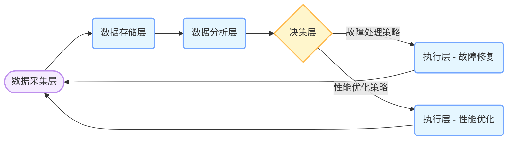

# 企业AI Agent的自动化运维系统

> 关键词：企业AI Agent、自动化运维系统、人工智能、运维自动化、智能监控、故障预测、系统优化

> 摘要：本文围绕企业AI Agent的自动化运维系统展开深入探讨。随着企业数字化转型的加速，传统运维方式已难以满足复杂多变的业务需求，自动化运维系统成为必然趋势。企业AI Agent作为核心驱动力，能够实现智能监控、故障预测、自动修复等功能，有效提升运维效率和系统稳定性。文章详细阐述了该系统的核心概念、算法原理、数学模型，通过项目实战展示其具体实现，分析了实际应用场景，推荐了相关工具和资源，最后总结了未来发展趋势与挑战，旨在为企业构建高效的自动化运维系统提供全面的技术指导和参考。

## 1. 背景介绍 
### 1.1 目的和范围
随着信息技术的飞速发展，企业的IT系统规模不断扩大，复杂度日益增加。传统的人工运维方式面临着效率低下、响应不及时、容易出错等问题，难以满足企业业务快速发展的需求。企业AI Agent的自动化运维系统旨在利用人工智能技术，实现对企业IT系统的自动化监控、故障诊断、修复和优化，提高运维效率和系统可靠性，降低运维成本。

本系统的范围涵盖了企业内部的各种IT资源，包括服务器、网络设备、存储系统、应用程序等。通过对这些资源的实时监控和分析，系统能够及时发现潜在的问题，并采取相应的措施进行处理。

### 1.2 预期读者
本文的预期读者包括企业的IT运维人员、系统管理员、技术经理、架构师以及对人工智能和自动化运维感兴趣的技术爱好者。对于IT运维人员和系统管理员，本文提供了实用的技术方案和操作指南，帮助他们提升运维技能和效率；对于技术经理和架构师，本文有助于他们了解自动化运维系统的发展趋势和技术架构，为企业的IT规划和决策提供参考；对于技术爱好者，本文可以激发他们对人工智能和自动化运维领域的兴趣和探索欲望。

### 1.3 文档结构概述
本文将按照以下结构进行组织：
1. **背景介绍**：介绍企业AI Agent的自动化运维系统的目的、范围、预期读者和文档结构，以及相关术语的定义和解释。
2. **核心概念与联系**：阐述企业AI Agent和自动化运维系统的核心概念，分析它们之间的联系，并通过文本示意图和Mermaid流程图展示系统的架构和工作原理。
3. **核心算法原理 & 具体操作步骤**：详细讲解实现自动化运维系统的核心算法，如机器学习算法、深度学习算法等，并使用Python源代码进行详细阐述，同时给出具体的操作步骤。
4. **数学模型和公式 & 详细讲解 & 举例说明**：介绍自动化运维系统中涉及的数学模型和公式，如概率统计模型、优化模型等，并进行详细讲解和举例说明。
5. **项目实战：代码实际案例和详细解释说明**：通过一个具体的项目实战，展示企业AI Agent的自动化运维系统的实现过程，包括开发环境搭建、源代码详细实现和代码解读。
6. **实际应用场景**：分析企业AI Agent的自动化运维系统在不同行业和场景中的实际应用，如金融、电信、互联网等。
7. **工具和资源推荐**：推荐相关的学习资源、开发工具框架和论文著作，帮助读者进一步深入学习和研究自动化运维系统。
8. **总结：未来发展趋势与挑战**：总结企业AI Agent的自动化运维系统的发展趋势和面临的挑战，为未来的研究和实践提供参考。
9. **附录：常见问题与解答**：解答读者在使用自动化运维系统过程中常见的问题。
10. **扩展阅读 & 参考资料**：提供相关的扩展阅读材料和参考资料，方便读者进一步查阅和学习。

### 1.4 术语表
#### 1.4.1 核心术语定义
- **企业AI Agent**：是一种基于人工智能技术的智能体，能够自主地感知、学习、决策和行动，在企业的自动化运维系统中扮演核心角色。
- **自动化运维系统**：是一种利用自动化技术和人工智能技术，实现对企业IT系统的自动化监控、故障诊断、修复和优化的系统。
- **智能监控**：是指利用传感器、日志分析等技术，对企业IT系统的运行状态进行实时监测和分析，及时发现潜在的问题。
- **故障预测**：是指利用机器学习、深度学习等技术，对企业IT系统的故障进行预测，提前采取措施进行预防和处理。
- **自动修复**：是指在发现企业IT系统的故障后，系统能够自动采取措施进行修复，减少人工干预。

#### 1.4.2 相关概念解释
- **人工智能**：是指计算机系统能够执行通常需要人类智能才能完成的任务，如学习、推理、决策等。
- **机器学习**：是人工智能的一个分支，通过让计算机从数据中学习模式和规律，从而实现预测和决策。
- **深度学习**：是机器学习的一个子领域，通过构建深度神经网络，自动从数据中提取特征，实现更复杂的任务。
- **大数据**：是指海量、高增长率和多样化的信息资产，在自动化运维系统中，大数据可以为故障预测和分析提供丰富的数据支持。

#### 1.4.3 缩略词列表
- **AI**：Artificial Intelligence，人工智能
- **ML**：Machine Learning，机器学习
- **DL**：Deep Learning，深度学习
- **IT**：Information Technology，信息技术
- **KPI**：Key Performance Indicator，关键绩效指标

## 2. 核心概念与联系 

### 2.1 企业AI Agent的概念
企业AI Agent是一种具有智能决策和自主行动能力的软件实体。它基于人工智能技术，能够感知企业IT系统的运行状态、环境信息等数据，通过学习和推理，做出合理的决策，并采取相应的行动来实现特定的目标。企业AI Agent可以看作是一个智能的“运维助手”，它能够理解企业的运维需求，自动执行各种运维任务，提高运维效率和质量。

### 2.2 自动化运维系统的概念
自动化运维系统是一个集成了多种技术和工具的复杂系统，其目标是实现企业IT系统运维的自动化和智能化。它通过对IT系统的全面监控、故障诊断、性能优化等功能，确保系统的稳定运行，减少人工干预，降低运维成本。自动化运维系统通常包括监控模块、分析模块、决策模块和执行模块等部分，各个模块协同工作，实现对IT系统的全生命周期管理。

### 2.3 企业AI Agent与自动化运维系统的联系
企业AI Agent是自动化运维系统的核心组成部分，它为自动化运维系统提供了智能决策和自主行动的能力。具体来说，企业AI Agent可以从监控模块获取IT系统的运行数据，利用分析模块的算法对数据进行处理和分析，通过决策模块制定合理的运维策略，最后通过执行模块自动执行相应的运维任务。同时，自动化运维系统为企业AI Agent提供了运行的环境和数据支持，使得企业AI Agent能够更好地发挥其智能作用。

### 2.4 核心概念原理和架构的文本示意图
企业AI Agent的自动化运维系统的架构主要包括以下几个层次：
1. **数据采集层**：负责采集企业IT系统的各种运行数据，如服务器的CPU使用率、内存使用率、网络流量等，以及应用程序的日志信息、业务数据等。
2. **数据存储层**：将采集到的数据存储到数据库中，以便后续的分析和处理。常用的数据库包括关系型数据库（如MySQL、Oracle）和非关系型数据库（如MongoDB、Redis）。
3. **数据分析层**：利用机器学习、深度学习等算法对存储的数据进行分析和挖掘，提取有价值的信息，如故障模式、性能趋势等。
4. **决策层**：根据数据分析的结果，企业AI Agent通过智能决策算法制定合理的运维策略，如故障修复方案、性能优化措施等。
5. **执行层**：根据决策层制定的运维策略，自动执行相应的运维任务，如重启服务器、调整系统参数、部署新的应用程序等。

### 2.5 Mermaid流程图


这个流程图展示了企业AI Agent的自动化运维系统的工作流程。首先，数据采集层采集IT系统的运行数据，然后将数据存储到数据存储层。数据分析层对存储的数据进行分析，决策层根据分析结果制定运维策略，执行层根据策略执行相应的运维任务。最后，执行结果反馈到数据采集层，形成一个闭环的运维系统。

## 3. 核心算法原理 & 具体操作步骤 

### 3.1 核心算法原理

#### 3.1.1 机器学习算法 - 异常检测算法（Isolation Forest）
异常检测是自动化运维系统中的重要任务之一，其目的是发现IT系统中的异常行为和故障。Isolation Forest是一种基于树的异常检测算法，它通过构建随机决策树来分离数据点，异常点通常更容易被孤立出来。

**原理**：Isolation Forest通过随机选择特征和划分点，递归地将数据集划分为更小的子集，直到每个数据点都被孤立出来。异常点由于其与正常点的分布差异较大，通常会在较少的划分步骤中被孤立出来，因此其路径长度较短。通过计算每个数据点的路径长度，可以判断其是否为异常点。

**Python源代码实现**：
```python
from sklearn.ensemble import IsolationForest
import numpy as np

# 生成示例数据
X = np.array([[1, 2], [2, 3], [3, 4], [100, 200], [5, 6]])

# 创建Isolation Forest模型
clf = IsolationForest(contamination=0.1)

# 训练模型
clf.fit(X)

# 预测异常点
y_pred = clf.predict(X)

print("预测结果:", y_pred)
```

#### 3.1.2 深度学习算法 - 循环神经网络（RNN）用于故障预测
RNN是一种具有记忆功能的神经网络，它可以处理序列数据，非常适合用于故障预测。在自动化运维系统中，我们可以将IT系统的历史运行数据作为输入，利用RNN学习数据中的时间序列模式，从而预测未来可能出现的故障。

**原理**：RNN通过在时间步上循环传递隐藏状态，使得网络能够记住之前的输入信息。在每个时间步，RNN根据当前输入和上一个时间步的隐藏状态计算当前的隐藏状态，并输出预测结果。通过不断地训练RNN，使其能够学习到数据中的时间序列模式，从而实现故障预测。

**Python源代码实现**：
```python
import numpy as np
import tensorflow as tf
from tensorflow.keras.models import Sequential
from tensorflow.keras.layers import SimpleRNN, Dense

# 生成示例数据
data = np.array([1, 2, 3, 4, 5, 6, 7, 8, 9, 10])
X = []
y = []
for i in range(len(data) - 3):
    X.append(data[i:i+3])
    y.append(data[i+3])
X = np.array(X)
y = np.array(y)

# 调整数据形状以适应RNN输入要求
X = np.reshape(X, (X.shape[0], X.shape[1], 1))

# 创建RNN模型
model = Sequential()
model.add(SimpleRNN(10, input_shape=(3, 1)))
model.add(Dense(1))

# 编译模型
model.compile(optimizer='adam', loss='mse')

# 训练模型
model.fit(X, y, epochs=100, verbose=0)

# 进行预测
test_input = np.array([8, 9, 10]).reshape(1, 3, 1)
prediction = model.predict(test_input)
print("预测结果:", prediction)
```

### 3.2 具体操作步骤

#### 3.2.1 数据预处理
在使用机器学习和深度学习算法之前，需要对采集到的数据进行预处理。具体步骤如下：
1. **数据清洗**：去除数据中的噪声、缺失值和重复值。
2. **数据归一化**：将数据的特征值缩放到相同的范围，避免某些特征对模型的影响过大。
3. **特征工程**：选择和提取对模型有重要影响的特征，提高模型的性能。

#### 3.2.2 模型训练
根据具体的任务和数据特点，选择合适的算法和模型结构，然后使用预处理后的数据对模型进行训练。在训练过程中，需要调整模型的参数，如学习率、迭代次数等，以提高模型的性能。

#### 3.2.3 模型评估
使用测试数据对训练好的模型进行评估，计算模型的性能指标，如准确率、召回率、均方误差等。根据评估结果，对模型进行调整和优化。

#### 3.2.4 模型部署
将训练好的模型部署到自动化运维系统中，使其能够实时地对IT系统进行监控和预测。在部署过程中，需要确保模型的稳定性和可靠性。

## 4. 数学模型和公式 & 详细讲解 & 举例说明 

### 4.1 概率统计模型 - 贝叶斯定理用于故障诊断
贝叶斯定理是一种基于概率的推理方法，它可以根据已知的先验概率和条件概率，计算出后验概率。在自动化运维系统中，贝叶斯定理可以用于故障诊断，根据系统的症状和历史故障数据，计算出各种故障发生的概率。

**数学公式**：
$$P(A|B)=\frac{P(B|A)P(A)}{P(B)}$$
其中，$P(A|B)$ 表示在事件 $B$ 发生的条件下事件 $A$ 发生的概率，即后验概率；$P(B|A)$ 表示在事件 $A$ 发生的条件下事件 $B$ 发生的概率，即似然概率；$P(A)$ 表示事件 $A$ 发生的先验概率；$P(B)$ 表示事件 $B$ 发生的概率。

**详细讲解**：
在故障诊断中，我们可以将事件 $A$ 看作是某种故障，事件 $B$ 看作是系统出现的症状。先验概率 $P(A)$ 可以根据历史故障数据统计得到，似然概率 $P(B|A)$ 可以通过分析故障发生时的症状数据得到。通过贝叶斯定理，我们可以计算出在出现某种症状的情况下，各种故障发生的概率，从而进行故障诊断。

**举例说明**：
假设我们有一个服务器系统，历史数据显示，服务器出现CPU使用率过高的故障（事件 $A_1$）的概率 $P(A_1)=0.3$，出现内存不足的故障（事件 $A_2$）的概率 $P(A_2)=0.2$，其他故障（事件 $A_3$）的概率 $P(A_3)=0.5$。当服务器出现系统响应缓慢的症状（事件 $B$）时，已知在CPU使用率过高的故障发生时，出现系统响应缓慢的概率 $P(B|A_1)=0.8$，在内存不足的故障发生时，出现系统响应缓慢的概率 $P(B|A_2)=0.6$，在其他故障发生时，出现系统响应缓慢的概率 $P(B|A_3)=0.3$。

首先，计算 $P(B)$：
$$P(B)=P(B|A_1)P(A_1)+P(B|A_2)P(A_2)+P(B|A_3)P(A_3)$$
$$=0.8\times0.3 + 0.6\times0.2 + 0.3\times0.5$$
$$=0.24 + 0.12 + 0.15$$
$$=0.51$$

然后，计算各种故障的后验概率：
$$P(A_1|B)=\frac{P(B|A_1)P(A_1)}{P(B)}=\frac{0.8\times0.3}{0.51}\approx0.47$$
$$P(A_2|B)=\frac{P(B|A_2)P(A_2)}{P(B)}=\frac{0.6\times0.2}{0.51}\approx0.24$$
$$P(A_3|B)=\frac{P(B|A_3)P(A_3)}{P(B)}=\frac{0.3\times0.5}{0.51}\approx0.29$$

根据计算结果，在出现系统响应缓慢的症状时，CPU使用率过高的故障发生的概率最大，因此可以优先检查CPU相关的问题。

### 4.2 优化模型 - 线性规划用于资源分配
线性规划是一种用于求解最优解的数学方法，它可以在一组线性约束条件下，最大化或最小化一个线性目标函数。在自动化运维系统中，线性规划可以用于资源分配，根据系统的需求和资源的限制，合理地分配资源，以提高系统的性能和效率。

**数学公式**：
目标函数：$\max c^T x$ 或 $\min c^T x$
约束条件：$Ax\leq b$，$x\geq0$
其中，$x$ 是决策变量向量，$c$ 是目标函数的系数向量，$A$ 是约束条件的系数矩阵，$b$ 是约束条件的右侧向量。

**详细讲解**：
在资源分配问题中，决策变量 $x$ 表示各种资源的分配量，目标函数 $c^T x$ 可以表示系统的性能指标，如吞吐量、响应时间等，约束条件 $Ax\leq b$ 表示资源的限制，如服务器的CPU、内存、带宽等资源的上限。通过求解线性规划问题，可以得到最优的资源分配方案，使得系统的性能指标达到最优。

**举例说明**：
假设我们有一个数据中心，有两种类型的服务器：高性能服务器和普通服务器。高性能服务器的成本为每小时 $100$ 元，普通服务器的成本为每小时 $50$ 元。数据中心需要处理两种类型的任务：任务 $A$ 和任务 $B$。每个高性能服务器每小时可以处理 $10$ 个任务 $A$ 和 $5$ 个任务 $B$，每个普通服务器每小时可以处理 $5$ 个任务 $A$ 和 $3$ 个任务 $B$。现在需要处理 $100$ 个任务 $A$ 和 $60$ 个任务 $B$，问如何分配服务器，使得成本最小？

设高性能服务器的数量为 $x_1$，普通服务器的数量为 $x_2$。

目标函数：$\min 100x_1 + 50x_2$
约束条件：
$$10x_1 + 5x_2\geq100$$
$$5x_1 + 3x_2\geq60$$
$$x_1\geq0$$
$$x_2\geq0$$

通过求解这个线性规划问题，可以得到最优的服务器分配方案。可以使用Python的 `pulp` 库来求解：
```python
from pulp import LpMinimize, LpProblem, LpVariable

# 创建问题
prob = LpProblem("Resource_Allocation", LpMinimize)

# 定义决策变量
x1 = LpVariable("x1", lowBound=0)
x2 = LpVariable("x2", lowBound=0)

# 定义目标函数
prob += 100 * x1 + 50 * x2

# 定义约束条件
prob += 10 * x1 + 5 * x2 >= 100
prob += 5 * x1 + 3 * x2 >= 60

# 求解问题
prob.solve()

# 输出结果
print("最优解：")
print("高性能服务器数量:", x1.value())
print("普通服务器数量:", x2.value())
print("最小成本:", prob.objective.value())
```

## 5. 项目实战：代码实际案例和详细解释说明 

### 5.1  开发环境搭建
#### 5.1.1 操作系统
选择合适的操作系统，如Linux（Ubuntu、CentOS等）或Windows。本项目以Ubuntu 20.04为例进行开发。

#### 5.1.2 编程语言和框架
- **Python**：作为主要的开发语言，选择Python 3.8及以上版本。
- **TensorFlow**：用于深度学习模型的开发和训练。
- **Scikit-learn**：用于机器学习模型的开发和训练。
- **Flask**：用于构建Web服务，实现自动化运维系统的接口。

#### 5.1.3 数据库
选择合适的数据库，如MySQL、MongoDB等。本项目以MySQL为例进行数据存储。

#### 5.1.4 安装步骤
1. **安装Python**：
```bash
sudo apt update
sudo apt install python3 python3-pip
```
2. **安装TensorFlow、Scikit-learn和Flask**：
```bash
pip3 install tensorflow scikit-learn flask
```
3. **安装MySQL**：
```bash
sudo apt install mysql-server
```

### 5.2  源代码详细实现和代码解读

#### 5.2.1 数据采集模块
数据采集模块负责采集企业IT系统的运行数据，如服务器的CPU使用率、内存使用率等。以下是一个简单的数据采集示例，使用Python的 `psutil` 库来采集服务器的系统信息：
```python
import psutil
import time

def collect_system_info():
    cpu_percent = psutil.cpu_percent(interval=1)
    memory_percent = psutil.virtual_memory().percent
    disk_percent = psutil.disk_usage('/').percent
    return {
        "cpu_percent": cpu_percent,
        "memory_percent": memory_percent,
        "disk_percent": disk_percent
    }

if __name__ == "__main__":
    while True:
        info = collect_system_info()
        print(info)
        time.sleep(60)
```
**代码解读**：
- `psutil.cpu_percent(interval=1)`：获取CPU的使用率，`interval=1` 表示采样间隔为1秒。
- `psutil.virtual_memory().percent`：获取内存的使用率。
- `psutil.disk_usage('/').percent`：获取磁盘的使用率。
- `time.sleep(60)`：每隔60秒采集一次数据。

#### 5.2.2 数据存储模块
数据存储模块负责将采集到的数据存储到数据库中。以下是一个使用Python的 `mysql-connector-python` 库将数据存储到MySQL数据库的示例：
```python
import mysql.connector
from collect_system_info import collect_system_info

# 连接到MySQL数据库
mydb = mysql.connector.connect(
    host="localhost",
    user="your_username",
    password="your_password",
    database="your_database"
)

mycursor = mydb.cursor()

# 创建表
mycursor.execute("CREATE TABLE IF NOT EXISTS system_info (id INT AUTO_INCREMENT PRIMARY KEY, cpu_percent FLOAT, memory_percent FLOAT, disk_percent FLOAT, timestamp TIMESTAMP DEFAULT CURRENT_TIMESTAMP)")

while True:
    info = collect_system_info()
    sql = "INSERT INTO system_info (cpu_percent, memory_percent, disk_percent) VALUES (%s, %s, %s)"
    val = (info["cpu_percent"], info["memory_percent"], info["disk_percent"])
    mycursor.execute(sql, val)
    mydb.commit()
    print(mycursor.rowcount, "record inserted.")
    time.sleep(60)
```
**代码解读**：
- `mysql.connector.connect()`：连接到MySQL数据库。
- `mycursor.execute("CREATE TABLE IF NOT EXISTS ...")`：创建一个名为 `system_info` 的表，用于存储系统信息。
- `mycursor.execute(sql, val)`：执行插入语句，将采集到的数据插入到表中。
- `mydb.commit()`：提交事务，确保数据插入成功。

#### 5.2.3 数据分析和决策模块
数据分析和决策模块负责对存储的数据进行分析，根据分析结果做出决策。以下是一个使用Isolation Forest算法进行异常检测的示例：
```python
import mysql.connector
import numpy as np
from sklearn.ensemble import IsolationForest

# 连接到MySQL数据库
mydb = mysql.connector.connect(
    host="localhost",
    user="your_username",
    password="your_password",
    database="your_database"
)

mycursor = mydb.cursor()

# 查询数据
mycursor.execute("SELECT cpu_percent, memory_percent, disk_percent FROM system_info")
data = mycursor.fetchall()
X = np.array(data)

# 创建Isolation Forest模型
clf = IsolationForest(contamination=0.1)

# 训练模型
clf.fit(X)

# 预测异常点
y_pred = clf.predict(X)

# 输出异常点信息
for i in range(len(y_pred)):
    if y_pred[i] == -1:
        print("异常点：", data[i])
```
**代码解读**：
- `mycursor.execute("SELECT ...")`：从数据库中查询系统信息数据。
- `np.array(data)`：将查询结果转换为NumPy数组。
- `IsolationForest(contamination=0.1)`：创建Isolation Forest模型，`contamination=0.1` 表示异常点的比例为10%。
- `clf.fit(X)`：训练模型。
- `clf.predict(X)`：预测异常点。
- `if y_pred[i] == -1`：判断是否为异常点，`-1` 表示异常点。

#### 5.2.4 执行模块
执行模块负责根据决策模块的结果，自动执行相应的运维任务。以下是一个简单的执行模块示例，当检测到CPU使用率过高时，重启服务器：
```python
import os
import mysql.connector
import numpy as np
from sklearn.ensemble import IsolationForest

# 连接到MySQL数据库
mydb = mysql.connector.connect(
    host="localhost",
    user="your_username",
    password="your_password",
    database="your_database"
)

mycursor = mydb.cursor()

# 查询数据
mycursor.execute("SELECT cpu_percent, memory_percent, disk_percent FROM system_info")
data = mycursor.fetchall()
X = np.array(data)

# 创建Isolation Forest模型
clf = IsolationForest(contamination=0.1)

# 训练模型
clf.fit(X)

# 预测异常点
y_pred = clf.predict(X)

# 执行运维任务
for i in range(len(y_pred)):
    if y_pred[i] == -1 and data[i][0] > 80:
        print("CPU使用率过高，重启服务器...")
        os.system("sudo reboot")
```
**代码解读**：
- `os.system("sudo reboot")`：执行重启服务器的命令。
- `if y_pred[i] == -1 and data[i][0] > 80`：判断是否为异常点且CPU使用率超过80%，如果是，则重启服务器。

### 5.3  代码解读与分析
通过以上代码示例，我们实现了一个简单的企业AI Agent的自动化运维系统。数据采集模块负责采集服务器的系统信息，数据存储模块将采集到的数据存储到数据库中，数据分析和决策模块使用Isolation Forest算法进行异常检测，执行模块根据检测结果自动执行相应的运维任务。

在实际应用中，还需要对代码进行优化和扩展。例如，增加更多的数据采集源，提高数据的准确性和完整性；使用更复杂的机器学习和深度学习算法，提高异常检测和故障预测的准确性；实现更智能的决策和执行策略，提高自动化运维系统的效率和可靠性。

## 6. 实际应用场景 
### 6.1 金融行业
在金融行业，企业的IT系统承担着核心业务的运行，如交易处理、风险管理、客户服务等。任何系统故障都可能导致巨大的经济损失和声誉风险。企业AI Agent的自动化运维系统可以实时监控金融交易系统的运行状态，及时发现潜在的故障和安全漏洞，自动进行故障修复和安全防护。例如，当检测到交易系统的响应时间过长时，系统可以自动调整服务器资源，优化数据库查询语句，确保交易的快速和准确处理。

### 6.2 电信行业
电信行业的网络规模庞大，设备种类繁多，运维工作复杂。企业AI Agent的自动化运维系统可以对电信网络进行全面监控，包括基站、核心网、传输网等。通过对网络性能数据的分析，系统可以预测网络故障的发生，提前进行设备维护和升级。例如，当检测到某个基站的信号强度下降时，系统可以自动分析原因，判断是否是设备故障或环境干扰，并及时采取相应的措施，如调整天线方向、更换故障设备等。

### 6.3 互联网行业
互联网企业的业务发展迅速，用户数量庞大，对系统的可用性和性能要求极高。企业AI Agent的自动化运维系统可以帮助互联网企业实现快速的业务部署和系统扩容。例如，当某个互联网应用的访问量突然增加时，系统可以自动检测到流量变化，根据预设的策略自动增加服务器资源，确保应用的稳定运行。同时，系统还可以对用户行为数据进行分析，优化应用的性能和用户体验。

### 6.4 制造业
在制造业中，企业的生产设备和自动化生产线需要保持稳定运行，以确保产品质量和生产效率。企业AI Agent的自动化运维系统可以对生产设备进行实时监控，采集设备的运行参数，如温度、压力、振动等。通过对这些数据的分析，系统可以预测设备的故障，提前进行维护和保养，减少设备停机时间。例如，当检测到某个生产设备的温度异常升高时，系统可以自动发出警报，并通知维修人员进行检查和处理。

## 7. 工具和资源推荐
### 7.1 学习资源推荐
#### 7.1.1 书籍推荐
- 《Python机器学习》：本书详细介绍了Python在机器学习领域的应用，包括各种机器学习算法的原理和实现，是学习机器学习的经典书籍。
- 《深度学习》：由深度学习领域的三位先驱Ian Goodfellow、Yoshua Bengio和Aaron Courville撰写，全面介绍了深度学习的理论和实践。
- 《自动化运维实战》：本书结合实际案例，介绍了自动化运维的技术和方法，包括监控系统、配置管理、故障处理等方面的内容。

#### 7.1.2 在线课程
- Coursera上的“机器学习”课程：由斯坦福大学的Andrew Ng教授授课，是学习机器学习的入门经典课程。
- edX上的“深度学习微硕士学位项目”：提供了系统的深度学习课程，包括神经网络、卷积神经网络、循环神经网络等内容。
- 阿里云开发者社区的“自动化运维实战营”：通过实际项目案例，介绍了自动化运维的技术和实践经验。

#### 7.1.3 技术博客和网站
- 机器学习算法全栈工程师：提供了丰富的机器学习和深度学习技术文章和教程。
- 开源中国：有大量的技术文章和开源项目，涵盖了自动化运维、人工智能等领域。
- 思否：一个技术交流社区，有很多关于编程、运维等方面的讨论和分享。

### 7.2 开发工具框架推荐
#### 7.2.1 IDE和编辑器
- PyCharm：一款专业的Python集成开发环境，提供了丰富的代码编辑、调试、分析等功能。
- Visual Studio Code：一款轻量级的代码编辑器，支持多种编程语言，有丰富的插件扩展。
- Jupyter Notebook：一种交互式的开发环境，适合进行数据探索和模型开发。

#### 7.2.2 调试和性能分析工具
- TensorBoard：TensorFlow的可视化工具，用于监控模型的训练过程和性能指标。
- Scikit-learn的 `cross_val_score` 函数：用于模型的交叉验证和性能评估。
- MySQL Workbench：MySQL的图形化管理工具，用于数据库的设计、开发和管理。

#### 7.2.3 相关框架和库
- TensorFlow：一个开源的深度学习框架，提供了丰富的深度学习模型和工具。
- Scikit-learn：一个简单易用的机器学习库，包含了各种机器学习算法和工具。
- Flask：一个轻量级的Web框架，用于构建Web服务和接口。

### 7.3 相关论文著作推荐
#### 7.3.1 经典论文
- “A Few Useful Things to Know about Machine Learning”：介绍了机器学习中的一些重要概念和方法，对理解机器学习的本质有很大帮助。
- “ImageNet Classification with Deep Convolutional Neural Networks”：介绍了卷积神经网络在图像分类任务中的应用，开创了深度学习在计算机视觉领域的先河。
- “Long Short-Term Memory”：介绍了长短期记忆网络（LSTM）的原理和应用，是循环神经网络领域的经典论文。

#### 7.3.2 最新研究成果
- 关注ACM SIGOPS、IEEE Transactions on Dependable and Secure Computing等学术会议和期刊，了解自动化运维和人工智能领域的最新研究成果。
- 参考ArXiv等预印本平台上的最新论文，获取最新的技术进展和研究思路。

#### 7.3.3 应用案例分析
- 研究Google、Amazon、Microsoft等科技巨头的自动化运维实践案例，了解他们在大规模系统运维中的技术和经验。
- 参考开源项目的文档和案例，如Kubernetes、Ansible等，学习如何使用开源工具实现自动化运维。

## 8. 总结：未来发展趋势与挑战
### 8.1 未来发展趋势
#### 8.1.1 智能化程度不断提高
随着人工智能技术的不断发展，企业AI Agent的自动化运维系统将变得更加智能。系统将能够自动学习和适应新的环境和任务，实现更复杂的决策和执行策略。例如，系统可以根据不同的业务需求和用户行为，自动调整运维策略，提供个性化的服务。

#### 8.1.2 与云计算和大数据的深度融合
云计算和大数据技术为自动化运维系统提供了强大的计算和存储能力。未来，自动化运维系统将与云计算和大数据平台深度融合，实现数据的实时处理和分析，提高系统的响应速度和处理能力。例如，通过云计算平台的弹性计算资源，系统可以快速应对业务高峰和低谷，实现资源的高效利用。

#### 8.1.3 跨领域融合发展
自动化运维系统将与物联网、区块链等技术进行跨领域融合发展。例如，在物联网领域，自动化运维系统可以对大量的物联网设备进行实时监控和管理，确保设备的正常运行；在区块链领域，自动化运维系统可以对区块链节点进行维护和管理，保证区块链网络的安全和稳定。

### 8.2 挑战
#### 8.2.1 数据安全和隐私问题
自动化运维系统需要采集和处理大量的企业数据，包括敏感的业务数据和用户信息。因此，数据安全和隐私问题是一个重要的挑战。需要采取有效的数据加密、访问控制等措施，确保数据的安全性和隐私性。

#### 8.2.2 模型的可解释性和可靠性
人工智能模型的可解释性和可靠性是一个关键问题。在自动化运维系统中，模型的决策结果直接影响到系统的运行和业务的发展。因此，需要提高模型的可解释性，让运维人员能够理解模型的决策过程和依据，同时保证模型的可靠性，避免出现错误的决策和操作。

#### 8.2.3 人才短缺
自动化运维系统的开发和应用需要具备人工智能、运维技术等多方面知识的复合型人才。目前，这类人才相对短缺，限制了自动化运维系统的发展。需要加强人才培养和引进，提高企业的技术水平和创新能力。

## 9. 附录：常见问题与解答
### 9.1 问题1：企业AI Agent的自动化运维系统需要多少成本？
答：企业AI Agent的自动化运维系统的成本取决于多个因素，如系统的规模、功能需求、技术选型等。一般来说，包括硬件设备、软件授权、人员培训等方面的费用。在选择系统时，企业需要根据自身的实际情况进行评估和预算。

### 9.2 问题2：如何确保自动化运维系统的稳定性？
答：确保自动化运维系统的稳定性需要从多个方面入手。首先，在系统设计和开发阶段，要采用可靠的技术和架构，进行充分的测试和验证。其次，在系统运行过程中，要建立完善的监控和预警机制，及时发现和处理潜在的问题。此外，还要定期对系统进行维护和升级，保证系统的性能和功能。

### 9.3 问题3：自动化运维系统能否完全替代人工运维？
答：虽然自动化运维系统可以提高运维效率和准确性，但目前还不能完全替代人工运维。在一些复杂的故障处理、决策制定等方面，还需要人工的参与和判断。因此，自动化运维系统应该与人工运维相结合，发挥各自的优势，实现更好的运维效果。

### 9.4 问题4：如何选择适合企业的自动化运维系统？
答：选择适合企业的自动化运维系统需要考虑多个因素。首先，要根据企业的业务需求和规模，确定系统的功能和性能要求。其次，要考虑系统的技术架构和兼容性，确保系统能够与企业现有的IT系统集成。此外，还要考虑系统的供应商的技术实力和服务水平，选择可靠的合作伙伴。

## 10. 扩展阅读 & 参考资料
### 10.1 扩展阅读
- 《人工智能时代的运维变革》
- 《云计算与自动化运维》
- 《大数据驱动的智能运维》

### 10.2 参考资料
- [TensorFlow官方文档](https://www.tensorflow.org/)
- [Scikit-learn官方文档](https://scikit-learn.org/)
- [Flask官方文档](https://flask.palletsprojects.com/)
- [MySQL官方文档](https://dev.mysql.com/doc/)