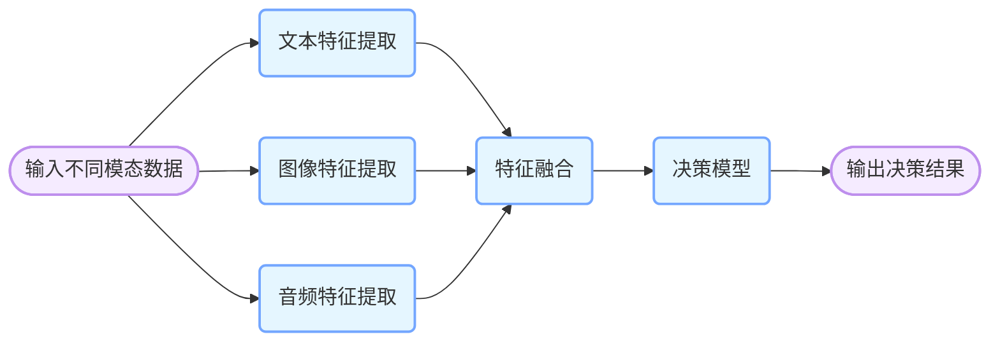

# 企业AI Agent的跨模态学习：融合非结构化数据的决策支持

> 关键词：企业AI Agent、跨模态学习、非结构化数据、决策支持、数据融合

> 摘要：本文聚焦于企业AI Agent的跨模态学习，旨在探讨如何融合非结构化数据以实现更有效的决策支持。随着企业数据量的爆炸式增长，非结构化数据如文本、图像、音频等在企业决策中扮演着愈发重要的角色。跨模态学习能够打破不同模态数据之间的壁垒，挖掘数据的潜在价值。文章详细阐述了跨模态学习的核心概念、算法原理、数学模型，并通过项目实战展示了如何在实际中应用。同时，分析了其实际应用场景，推荐了相关的工具和资源，最后对未来发展趋势与挑战进行了总结。

## 1. 背景介绍 
### 1.1 目的和范围
在当今数字化的企业环境中，数据呈现出多样化和复杂化的特点。非结构化数据占据了企业数据的大部分比例，如客户的评论、市场的图像广告、产品的音频介绍等。然而，传统的企业决策支持系统往往难以处理这些非结构化数据，导致大量有价值的信息被浪费。本文章的目的在于探讨企业AI Agent如何通过跨模态学习来融合非结构化数据，为企业决策提供更全面、准确的支持。范围涵盖了跨模态学习的基本概念、相关算法、数学模型、实际应用案例以及未来发展趋势等方面。

### 1.2 预期读者
本文预期读者包括企业的技术管理人员、数据科学家、人工智能研究者、软件开发人员以及对企业数字化转型和人工智能应用感兴趣的相关人士。这些读者可能希望了解如何利用跨模态学习技术来提升企业的决策能力，或者对相关技术的原理和应用有进一步探索的需求。

### 1.3 文档结构概述
本文首先介绍了跨模态学习的背景信息，包括目的、预期读者和文档结构概述等。接着阐述了跨模态学习的核心概念和相关联系，通过文本示意图和Mermaid流程图进行详细说明。然后深入讲解了核心算法原理和具体操作步骤，并使用Python源代码进行阐述。之后介绍了相关的数学模型和公式，并通过举例进行详细讲解。再通过项目实战展示了代码的实际案例和详细解释。随后分析了跨模态学习在企业中的实际应用场景。推荐了相关的工具和资源，包括学习资源、开发工具框架和相关论文著作等。最后总结了未来发展趋势与挑战，并提供了常见问题与解答以及扩展阅读和参考资料。

### 1.4 术语表
#### 1.4.1 核心术语定义
- **企业AI Agent**：指在企业环境中运行的人工智能代理，能够自主地感知环境、收集信息、进行推理和决策，以实现企业的特定目标。
- **跨模态学习**：是一种机器学习方法，旨在学习不同模态数据（如文本、图像、音频等）之间的关联和映射关系，从而实现对不同模态数据的综合处理和分析。
- **非结构化数据**：是指没有固定结构和格式的数据，如文本、图像、音频、视频等，其数据元素之间的关系不明确，难以用传统的数据库管理系统进行管理。
- **决策支持**：是指利用数据分析、模型计算等方法，为决策者提供相关信息和建议，帮助其做出更明智的决策。

#### 1.4.2 相关概念解释
- **模态**：在数据处理中，模态是指数据的不同表现形式，如视觉模态（图像、视频）、听觉模态（音频）、文本模态等。
- **特征提取**：是指从原始数据中提取出能够代表数据本质特征的信息，以便后续的分析和处理。
- **融合**：在跨模态学习中，融合是指将不同模态的数据或特征进行整合，以获取更全面、准确的信息。

#### 1.4.3 缩略词列表
- **CNN**：Convolutional Neural Network，卷积神经网络
- **RNN**：Recurrent Neural Network，循环神经网络
- **LSTM**：Long Short - Term Memory，长短期记忆网络
- **Transformer**：一种基于注意力机制的深度学习模型

## 2. 核心概念与联系 

### 核心概念原理
跨模态学习的核心原理在于挖掘不同模态数据之间的内在联系，以实现信息的互补和融合。不同模态的数据往往包含着不同的信息，例如，图像可能展示了产品的外观，而文本可能描述了产品的功能和特点。通过跨模态学习，可以将这些不同模态的数据关联起来，从而获得更全面的信息。

一种常见的跨模态学习方法是基于特征的融合。首先，对不同模态的数据进行特征提取，将原始数据转换为低维的特征向量。然后，将这些特征向量进行融合，得到一个综合的特征表示。最后，利用这个综合特征进行后续的任务，如分类、回归、决策等。

### 架构的文本示意图
```plaintext
输入层：
|-- 文本数据
|-- 图像数据
|-- 音频数据

特征提取层：
|-- 文本特征提取器（如Transformer）
|-- 图像特征提取器（如CNN）
|-- 音频特征提取器（如RNN/LSTM）

特征融合层：
|-- 拼接融合
|-- 加权融合
|-- 注意力融合

决策层：
|-- 分类器
|-- 回归器
|-- 决策模型
```

### Mermaid流程图


## 3. 核心算法原理 & 具体操作步骤 

### 核心算法原理
在跨模态学习中，一种常用的算法是基于注意力机制的融合算法。注意力机制能够自动地分配不同模态数据的权重，从而更好地融合不同模态的信息。

下面以文本和图像的跨模态学习为例，介绍基于注意力机制的融合算法的原理。

#### 特征提取
首先，使用预训练的模型对文本和图像进行特征提取。对于文本，可以使用Transformer模型；对于图像，可以使用ResNet等卷积神经网络。

#### 注意力计算
计算文本特征和图像特征之间的注意力分数，以确定每个图像特征对文本特征的重要性。注意力分数可以通过点积运算得到：

$$\text{Attention}(Q, K) = \text{softmax}\left(\frac{QK^T}{\sqrt{d_k}}\right)$$

其中，$Q$ 是文本特征，$K$ 是图像特征，$d_k$ 是特征的维度。

#### 特征融合
根据注意力分数，对图像特征进行加权求和，得到与文本相关的图像特征表示：

$$\text{Weighted\_Image\_Feature} = \text{Attention}(Q, K)V$$

其中，$V$ 是图像特征。

最后，将文本特征和加权后的图像特征进行拼接或其他融合操作，得到综合的特征表示。

### 具体操作步骤

#### 步骤1：数据预处理
对文本数据进行分词、去除停用词等操作，对图像数据进行缩放、归一化等操作。

#### 步骤2：特征提取
使用预训练的模型提取文本和图像的特征。

#### 步骤3：注意力计算
计算文本和图像特征之间的注意力分数。

#### 步骤4：特征融合
根据注意力分数，对图像特征进行加权求和，并与文本特征进行融合。

#### 步骤5：决策模型训练
使用融合后的特征训练决策模型，如分类器或回归器。

### Python源代码实现
```python
import torch
import torch.nn as nn
import torch.nn.functional as F
from transformers import AutoModel

# 文本特征提取器
class TextFeatureExtractor(nn.Module):
    def __init__(self, model_name='bert-base-uncased'):
        super(TextFeatureExtractor, self).__init__()
        self.bert = AutoModel.from_pretrained(model_name)

    def forward(self, input_ids, attention_mask):
        outputs = self.bert(input_ids=input_ids, attention_mask=attention_mask)
        return outputs.last_hidden_state.mean(dim=1)

# 图像特征提取器
class ImageFeatureExtractor(nn.Module):
    def __init__(self, resnet_model):
        super(ImageFeatureExtractor, self).__init__()
        self.resnet = resnet_model
        self.resnet.fc = nn.Identity()

    def forward(self, images):
        return self.resnet(images)

# 注意力融合模块
class AttentionFusion(nn.Module):
    def __init__(self, text_dim, image_dim):
        super(AttentionFusion, self).__init__()
        self.text_dim = text_dim
        self.image_dim = image_dim
        self.query = nn.Linear(text_dim, image_dim)

    def forward(self, text_features, image_features):
        Q = self.query(text_features)
        attention_scores = torch.matmul(Q, image_features.transpose(1, 2))
        attention_scores = F.softmax(attention_scores, dim=-1)
        weighted_image_features = torch.matmul(attention_scores, image_features)
        return torch.cat((text_features, weighted_image_features), dim=-1)

# 决策模型
class DecisionModel(nn.Module):
    def __init__(self, input_dim, output_dim):
        super(DecisionModel, self).__init__()
        self.fc = nn.Linear(input_dim, output_dim)

    def forward(self, features):
        return self.fc(features)

# 示例使用
text_feature_extractor = TextFeatureExtractor()
image_feature_extractor = ImageFeatureExtractor(resnet_model=torch.hub.load('pytorch/vision', 'resnet18', pretrained=True))
attention_fusion = AttentionFusion(text_dim=768, image_dim=512)
decision_model = DecisionModel(input_dim=768 + 512, output_dim=10)

# 模拟数据
input_ids = torch.randint(0, 1000, (16, 128))
attention_mask = torch.ones((16, 128))
images = torch.randn(16, 3, 224, 224)

# 特征提取
text_features = text_feature_extractor(input_ids, attention_mask)
image_features = image_feature_extractor(images)

# 特征融合
fused_features = attention_fusion(text_features, image_features)

# 决策
output = decision_model(fused_features)
print(output.shape)
```

## 4. 数学模型和公式 & 详细讲解 & 举例说明 

### 特征提取的数学模型
#### 文本特征提取
对于文本数据，通常使用Transformer模型进行特征提取。Transformer模型基于自注意力机制，能够捕捉文本中的长距离依赖关系。

假设输入的文本序列为 $x = [x_1, x_2, \cdots, x_n]$，其中 $x_i$ 是第 $i$ 个词的词向量。Transformer模型的输出可以表示为：

$$h = \text{Transformer}(x)$$

其中，$h = [h_1, h_2, \cdots, h_n]$ 是每个词的隐藏状态。通常，取所有隐藏状态的平均值作为文本的特征表示：

$$\text{Text\_Feature} = \frac{1}{n}\sum_{i = 1}^{n}h_i$$

#### 图像特征提取
对于图像数据，常用的特征提取模型是卷积神经网络（CNN）。假设输入的图像为 $I$，CNN模型的输出可以表示为：

$$f = \text{CNN}(I)$$

其中，$f$ 是图像的特征向量。

### 注意力机制的数学模型
注意力机制的核心是计算注意力分数，以确定不同特征之间的重要性。

#### 点积注意力
点积注意力的计算公式为：

$$\text{Attention}(Q, K) = \text{softmax}\left(\frac{QK^T}{\sqrt{d_k}}\right)$$

其中，$Q$ 是查询矩阵，$K$ 是键矩阵，$d_k$ 是键矩阵的维度。$\text{softmax}$ 函数用于将注意力分数归一化到 $[0, 1]$ 之间。

#### 加权求和
根据注意力分数，对值矩阵 $V$ 进行加权求和，得到加权后的特征表示：

$$\text{Weighted\_Feature} = \text{Attention}(Q, K)V$$

### 特征融合的数学模型
特征融合的方法有很多种，常见的有拼接融合和加权融合。

#### 拼接融合
将不同模态的特征向量直接拼接在一起，得到综合的特征表示：

$$\text{Fused\_Feature} = [\text{Text\_Feature}, \text{Image\_Feature}]$$

#### 加权融合
对不同模态的特征向量进行加权求和，得到综合的特征表示：

$$\text{Fused\_Feature} = \alpha\text{Text\_Feature} + (1 - \alpha)\text{Image\_Feature}$$

其中，$\alpha$ 是权重系数，$0 \leq \alpha \leq 1$。

### 举例说明
假设我们有一个文本描述 “A beautiful cat” 和一张猫的图像。

#### 特征提取
使用Transformer模型提取文本的特征向量，假设得到的特征向量为 $\text{Text\_Feature} = [0.1, 0.2, \cdots, 0.768]$。使用ResNet模型提取图像的特征向量，假设得到的特征向量为 $\text{Image\_Feature} = [0.3, 0.4, \cdots, 0.512]$。

#### 注意力计算
计算文本特征和图像特征之间的注意力分数，假设得到的注意力分数矩阵为：

$$\text{Attention\_Scores} = \begin{bmatrix}
0.2 & 0.3 & \cdots & 0.1 \\
0.1 & 0.2 & \cdots & 0.2 \\
\vdots & \vdots & \ddots & \vdots \\
0.3 & 0.1 & \cdots & 0.4
\end{bmatrix}$$

#### 特征融合
根据注意力分数，对图像特征进行加权求和，得到加权后的图像特征表示。然后将文本特征和加权后的图像特征进行拼接，得到综合的特征表示。

## 5. 项目实战：代码实际案例和详细解释说明 

### 5.1  开发环境搭建
#### 硬件环境
- 处理器：Intel Core i7 及以上
- 内存：16GB 及以上
- 显卡：NVIDIA GPU（如GTX 1080 及以上）

#### 软件环境
- 操作系统：Ubuntu 18.04 及以上或 Windows 10
- Python 版本：3.7 及以上
- 深度学习框架：PyTorch 1.7 及以上

#### 安装依赖库
```bash
pip install torch torchvision transformers
```

### 5.2  源代码详细实现和代码解读
```python
import torch
import torch.nn as nn
import torch.nn.functional as F
from transformers import AutoModel
from torch.utils.data import Dataset, DataLoader
import numpy as np
from PIL import Image
import os

# 自定义数据集类
class MultiModalDataset(Dataset):
    def __init__(self, text_files, image_files, labels):
        self.text_files = text_files
        self.image_files = image_files
        self.labels = labels

    def __len__(self):
        return len(self.text_files)

    def __getitem__(self, idx):
        # 读取文本数据
        with open(self.text_files[idx], 'r') as f:
            text = f.read()
        # 读取图像数据
        image = Image.open(self.image_files[idx]).convert('RGB')
        image = np.array(image).astype(np.float32) / 255.0
        image = np.transpose(image, (2, 0, 1))
        label = self.labels[idx]
        return text, image, label

# 文本特征提取器
class TextFeatureExtractor(nn.Module):
    def __init__(self, model_name='bert-base-uncased'):
        super(TextFeatureExtractor, self).__init__()
        self.bert = AutoModel.from_pretrained(model_name)

    def forward(self, input_ids, attention_mask):
        outputs = self.bert(input_ids=input_ids, attention_mask=attention_mask)
        return outputs.last_hidden_state.mean(dim=1)

# 图像特征提取器
class ImageFeatureExtractor(nn.Module):
    def __init__(self, resnet_model):
        super(ImageFeatureExtractor, self).__init__()
        self.resnet = resnet_model
        self.resnet.fc = nn.Identity()

    def forward(self, images):
        return self.resnet(images)

# 注意力融合模块
class AttentionFusion(nn.Module):
    def __init__(self, text_dim, image_dim):
        super(AttentionFusion, self).__init__()
        self.text_dim = text_dim
        self.image_dim = image_dim
        self.query = nn.Linear(text_dim, image_dim)

    def forward(self, text_features, image_features):
        Q = self.query(text_features)
        attention_scores = torch.matmul(Q, image_features.transpose(1, 2))
        attention_scores = F.softmax(attention_scores, dim=-1)
        weighted_image_features = torch.matmul(attention_scores, image_features)
        return torch.cat((text_features, weighted_image_features), dim=-1)

# 决策模型
class DecisionModel(nn.Module):
    def __init__(self, input_dim, output_dim):
        super(DecisionModel, self).__init__()
        self.fc = nn.Linear(input_dim, output_dim)

    def forward(self, features):
        return self.fc(features)

# 数据准备
text_files = [os.path.join('text_data', f) for f in os.listdir('text_data') if f.endswith('.txt')]
image_files = [os.path.join('image_data', f) for f in os.listdir('image_data') if f.endswith('.jpg')]
labels = np.random.randint(0, 10, len(text_files))

dataset = MultiModalDataset(text_files, image_files, labels)
dataloader = DataLoader(dataset, batch_size=16, shuffle=True)

# 模型初始化
text_feature_extractor = TextFeatureExtractor()
image_feature_extractor = ImageFeatureExtractor(resnet_model=torch.hub.load('pytorch/vision', 'resnet18', pretrained=True))
attention_fusion = AttentionFusion(text_dim=768, image_dim=512)
decision_model = DecisionModel(input_dim=768 + 512, output_dim=10)

# 优化器和损失函数
optimizer = torch.optim.Adam(list(text_feature_extractor.parameters()) +
                             list(image_feature_extractor.parameters()) +
                             list(attention_fusion.parameters()) +
                             list(decision_model.parameters()), lr=0.001)
criterion = nn.CrossEntropyLoss()

# 训练过程
for epoch in range(10):
    running_loss = 0.0
    for texts, images, labels in dataloader:
        # 文本数据处理
        inputs = tokenizer(texts, return_tensors='pt', padding=True, truncation=True)
        input_ids = inputs['input_ids']
        attention_mask = inputs['attention_mask']

        # 特征提取
        text_features = text_feature_extractor(input_ids, attention_mask)
        image_features = image_feature_extractor(images)

        # 特征融合
        fused_features = attention_fusion(text_features, image_features)

        # 决策
        outputs = decision_model(fused_features)

        # 计算损失
        loss = criterion(outputs, labels)

        # 反向传播和优化
        optimizer.zero_grad()
        loss.backward()
        optimizer.step()

        running_loss += loss.item()

    print(f'Epoch {epoch + 1}, Loss: {running_loss / len(dataloader)}')
```

### 5.3  代码解读与分析
#### 自定义数据集类
`MultiModalDataset` 类用于加载多模态数据，包括文本数据和图像数据。`__getitem__` 方法用于读取单个样本的文本、图像和标签。

#### 特征提取器
`TextFeatureExtractor` 类使用预训练的BERT模型提取文本特征，`ImageFeatureExtractor` 类使用预训练的ResNet模型提取图像特征。

#### 注意力融合模块
`AttentionFusion` 类实现了基于注意力机制的特征融合，通过计算文本特征和图像特征之间的注意力分数，对图像特征进行加权求和，并与文本特征进行拼接。

#### 决策模型
`DecisionModel` 类是一个简单的全连接层，用于将融合后的特征映射到决策结果。

#### 训练过程
在训练过程中，首先将文本数据进行分词和编码，然后提取文本和图像的特征，进行特征融合，最后使用决策模型进行分类。通过反向传播和优化算法更新模型的参数，以最小化损失函数。

## 6. 实际应用场景 
### 市场营销决策
在市场营销中，企业可以收集客户的文本评论、产品的图像广告和市场的音频调研数据。通过跨模态学习，企业可以分析客户对产品的满意度、产品图像的吸引力以及市场趋势，从而制定更有效的市场营销策略。例如，根据客户的文本评论和产品图像的分析，调整产品的包装和宣传文案。

### 供应链管理决策
在供应链管理中，企业可以获取供应商的文本描述、货物的图像和物流的音频记录。通过跨模态学习，企业可以评估供应商的信誉、货物的质量和物流的效率，从而优化供应链的决策。例如，根据供应商的文本评价和货物图像的质量检测，选择更可靠的供应商。

### 客户服务决策
在客户服务中，企业可以收集客户的文本咨询、客户的语音通话和客户的表情图像。通过跨模态学习，企业可以理解客户的需求和情绪，提供更个性化的客户服务。例如，根据客户的文本咨询和语音通话的情感分析，及时调整服务策略。

## 7. 工具和资源推荐
### 7.1 学习资源推荐
#### 7.1.1 书籍推荐
- 《深度学习》（Ian Goodfellow、Yoshua Bengio和Aaron Courville著）：全面介绍了深度学习的基本原理和算法。
- 《Python深度学习》（Francois Chollet著）：通过Python代码实例，详细介绍了深度学习的应用。
- 《人工智能：一种现代的方法》（Stuart Russell和Peter Norvig著）：涵盖了人工智能的各个领域，包括机器学习、自然语言处理等。

#### 7.1.2 在线课程
- Coursera上的“深度学习专项课程”（Andrew Ng教授）：深入讲解了深度学习的各个方面，包括卷积神经网络、循环神经网络等。
- edX上的“人工智能基础”：介绍了人工智能的基本概念和算法。
- 哔哩哔哩上的“李宏毅机器学习”：以通俗易懂的方式讲解机器学习的原理和应用。

#### 7.1.3 技术博客和网站
- Medium：有许多关于人工智能和机器学习的技术博客，如Towards Data Science。
- arXiv：提供了大量的学术论文，涵盖了人工智能的最新研究成果。
- Kaggle：一个数据科学竞赛平台，有许多关于机器学习和深度学习的开源代码和数据集。

### 7.2 开发工具框架推荐
#### 7.2.1 IDE和编辑器
- PyCharm：一款专业的Python集成开发环境，提供了丰富的代码编辑、调试和部署功能。
- Visual Studio Code：一款轻量级的代码编辑器，支持多种编程语言，有丰富的插件扩展。
- Jupyter Notebook：一个交互式的开发环境，适合进行数据分析和模型训练。

#### 7.2.2 调试和性能分析工具
- PyTorch Profiler：用于分析PyTorch模型的性能，找出性能瓶颈。
- TensorBoard：用于可视化深度学习模型的训练过程和结果。
- cProfile：Python的内置性能分析工具，用于分析Python代码的性能。

#### 7.2.3 相关框架和库
- PyTorch：一个开源的深度学习框架，提供了丰富的神经网络模块和优化算法。
- TensorFlow：另一个流行的深度学习框架，具有强大的分布式训练和部署能力。
- Transformers：Hugging Face开发的自然语言处理库，提供了大量的预训练模型。

### 7.3 相关论文著作推荐
#### 7.3.1 经典论文
- “Attention Is All You Need”（Vaswani等人）：介绍了Transformer模型和注意力机制。
- “ImageNet Classification with Deep Convolutional Neural Networks”（Alex Krizhevsky等人）：提出了AlexNet卷积神经网络，推动了深度学习在计算机视觉领域的发展。
- “Long Short-Term Memory”（Sepp Hochreiter和Jürgen Schmidhuber）：介绍了长短期记忆网络（LSTM）。

#### 7.3.2 最新研究成果
- 关注arXiv上关于跨模态学习、多模态融合等领域的最新论文，了解最新的研究进展。

#### 7.3.3 应用案例分析
- 许多企业和研究机构会发布关于跨模态学习在实际应用中的案例分析，可以通过相关的技术博客、会议论文等渠道获取。

## 8. 总结：未来发展趋势与挑战
### 未来发展趋势
- **更强大的预训练模型**：随着计算资源的不断增加和算法的不断改进，将会出现更强大的跨模态预训练模型，能够更好地学习不同模态数据之间的关联。
- **多模态生成任务**：跨模态学习将不仅仅局限于特征提取和分类，还将在多模态生成任务中发挥重要作用，如生成包含文本、图像和音频的多媒体内容。
- **与物联网的结合**：随着物联网的发展，将会产生大量的多模态数据，跨模态学习将与物联网技术相结合，实现更智能的决策支持。

### 挑战
- **数据标注难题**：跨模态数据的标注非常困难，需要耗费大量的人力和时间。如何高效地进行数据标注是一个亟待解决的问题。
- **计算资源需求**：跨模态学习通常需要大量的计算资源，尤其是在训练大规模的模型时。如何降低计算成本，提高计算效率是一个挑战。
- **模态间语义鸿沟**：不同模态数据之间存在语义鸿沟，如何有效地跨越这个鸿沟，实现更准确的跨模态学习是一个关键问题。

## 9. 附录：常见问题与解答
### 问题1：跨模态学习需要多少数据？
答：跨模态学习需要的数据量取决于具体的任务和模型复杂度。一般来说，数据量越大，模型的性能越好。但在实际应用中，需要根据实际情况进行权衡。

### 问题2：如何选择合适的特征提取模型？
答：选择合适的特征提取模型需要考虑数据的模态和任务的需求。对于文本数据，可以选择Transformer系列的模型；对于图像数据，可以选择ResNet、VGG等卷积神经网络；对于音频数据，可以选择RNN、LSTM等模型。

### 问题3：跨模态学习的训练时间长吗？
答：跨模态学习的训练时间通常较长，尤其是在处理大规模数据和复杂模型时。可以通过优化算法、使用GPU加速等方法来缩短训练时间。

## 10. 扩展阅读 & 参考资料
### 扩展阅读
- 相关的学术会议论文，如NeurIPS、ICML、CVPR等。
- 行业报告，了解企业AI Agent和跨模态学习在实际应用中的发展情况。

### 参考资料
- 相关的开源代码库，如GitHub上的跨模态学习项目。
- 官方文档，如PyTorch、TensorFlow、Transformers等框架的官方文档。