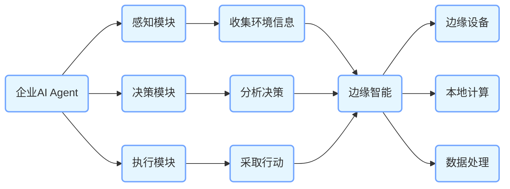

# 企业AI Agent的边缘智能部署策略

> 关键词：企业AI Agent、边缘智能、部署策略、人工智能、边缘计算、数据处理、模型优化

> 摘要：本文围绕企业AI Agent的边缘智能部署策略展开深入探讨。首先介绍了该研究的背景，包括目的和范围、预期读者、文档结构概述以及相关术语。接着阐述了企业AI Agent和边缘智能的核心概念及其联系，并通过示意图和流程图进行直观展示。详细讲解了核心算法原理及具体操作步骤，结合Python源代码进行说明。对相关数学模型和公式进行了详细讲解并举例。通过项目实战给出代码实际案例及详细解释。分析了企业AI Agent边缘智能部署的实际应用场景。推荐了学习资源、开发工具框架以及相关论文著作。最后总结了未来发展趋势与挑战，还设置了常见问题与解答以及扩展阅读和参考资料，为企业在AI Agent边缘智能部署方面提供全面且深入的指导。

## 1. 背景介绍 
### 1.1 目的和范围
随着人工智能技术的飞速发展，企业AI Agent在各个领域的应用越来越广泛。边缘智能作为一种新兴的计算模式，将计算和数据存储靠近数据源，能够有效减少数据传输延迟，提高系统的响应速度和可靠性。本文章的目的在于深入探讨企业AI Agent在边缘智能环境下的部署策略，旨在为企业提供一套科学、可行的部署方案，以充分发挥AI Agent和边缘智能的优势。

本文的范围涵盖了企业AI Agent和边缘智能的核心概念、相关算法原理、数学模型、实际应用场景、开发工具和资源等方面。通过对这些内容的详细阐述，帮助企业更好地理解和实施AI Agent的边缘智能部署。

### 1.2 预期读者
本文预期读者主要包括企业的技术决策者、IT管理人员、AI开发人员以及对边缘智能和企业AI Agent感兴趣的研究人员。对于技术决策者和IT管理人员，本文可以为他们在制定企业数字化转型战略时提供参考；对于AI开发人员，本文将为他们在实际开发过程中提供技术指导；对于研究人员，本文可以激发他们在该领域的进一步研究。

### 1.3 文档结构概述
本文共分为十个部分。第一部分为背景介绍，阐述了文章的目的、范围、预期读者和文档结构概述。第二部分介绍企业AI Agent和边缘智能的核心概念及其联系，通过文本示意图和Mermaid流程图进行直观展示。第三部分详细讲解核心算法原理及具体操作步骤，并给出Python源代码。第四部分对相关数学模型和公式进行详细讲解并举例。第五部分通过项目实战给出代码实际案例及详细解释。第六部分分析企业AI Agent边缘智能部署的实际应用场景。第七部分推荐学习资源、开发工具框架以及相关论文著作。第八部分总结未来发展趋势与挑战。第九部分设置常见问题与解答。第十部分提供扩展阅读和参考资料。

### 1.4 术语表
#### 1.4.1 核心术语定义
- **企业AI Agent**：是指在企业环境中运行的人工智能代理，它能够感知环境、进行决策并采取行动，以实现特定的企业目标。
- **边缘智能**：是指在靠近数据源的边缘设备上集成人工智能技术，实现数据的本地处理和分析，减少数据传输延迟。
- **部署策略**：是指为了实现特定目标而制定的关于系统或应用程序部署的计划和方法。

#### 1.4.2 相关概念解释
- **人工智能**：是研究、开发用于模拟、延伸和扩展人的智能的理论、方法、技术及应用系统的一门新的技术科学。
- **边缘计算**：是一种分散式运算的架构，将应用程序、数据资料与服务的运算，由网络中心节点移往网络逻辑上的边缘节点来处理。

#### 1.4.3 缩略词列表
- **AI**：Artificial Intelligence，人工智能
- **IoT**：Internet of Things，物联网

## 2. 核心概念与联系 
### 2.1 企业AI Agent核心概念
企业AI Agent是企业数字化转型中的重要组成部分。它可以根据企业的业务需求，自动执行各种任务，如客户服务、生产调度、风险管理等。企业AI Agent通常由感知模块、决策模块和执行模块组成。感知模块负责收集环境信息，决策模块根据收集到的信息进行分析和决策，执行模块则根据决策结果采取相应的行动。

### 2.2 边缘智能核心概念
边缘智能将人工智能技术与边缘计算相结合，使得数据可以在边缘设备上进行实时处理和分析。边缘智能的核心优势在于减少数据传输延迟、提高系统的可靠性和隐私性。边缘设备可以是传感器、摄像头、智能终端等，它们可以在本地运行人工智能模型，对数据进行实时处理。

### 2.3 核心概念联系
企业AI Agent和边缘智能之间存在着紧密的联系。边缘智能为企业AI Agent提供了更高效的运行环境。通过在边缘设备上部署AI Agent，可以减少数据传输到云端的延迟，提高系统的响应速度。同时，边缘智能可以在本地处理和分析数据，减少对云端计算资源的依赖，降低企业的运营成本。企业AI Agent则可以充分利用边缘智能的优势，实现更智能、更高效的决策和行动。

### 2.4 文本示意图
```plaintext
              企业AI Agent
           ┌─────────────────┐
           │  感知模块      │
           │                 │
           │  决策模块      │
           │                 │
           │  执行模块      │
           └─────────────────┘
                   │
                   │
                   ▼
        ┌─────────────────┐
        │  边缘智能       │
        │                 │
        │  边缘设备       │
        │  本地计算       │
        │  数据处理       │
        └─────────────────┘
```

### 2.5 Mermaid流程图


## 3. 核心算法原理 & 具体操作步骤 
### 3.1 核心算法原理
在企业AI Agent的边缘智能部署中，常用的核心算法包括机器学习算法和深度学习算法。以深度学习中的卷积神经网络（CNN）为例，CNN主要用于图像识别和处理任务。CNN的基本原理是通过卷积层提取图像的特征，通过池化层对特征进行降维，最后通过全连接层进行分类或回归。

### 3.2 具体操作步骤
#### 3.2.1 数据收集与预处理
首先，需要收集与企业业务相关的数据。例如，在图像识别任务中，需要收集大量的图像数据。然后，对收集到的数据进行预处理，包括图像的裁剪、缩放、归一化等操作。

#### 3.2.2 模型训练
使用预处理后的数据对CNN模型进行训练。在训练过程中，需要设置合适的超参数，如学习率、批次大小、训练轮数等。通过不断调整超参数，优化模型的性能。

#### 3.2.3 模型部署
将训练好的模型部署到边缘设备上。在部署过程中，需要考虑边缘设备的计算资源和存储容量，选择合适的模型压缩和量化方法，以减少模型的大小和计算量。

### 3.3 Python源代码实现
```python
import tensorflow as tf
from tensorflow.keras import layers, models

# 数据收集与预处理
# 假设我们有一个图像数据集，包含训练集和测试集
(train_images, train_labels), (test_images, test_labels) = tf.keras.datasets.cifar10.load_data()

# 数据归一化
train_images, test_images = train_images / 255.0, test_images / 255.0

# 构建CNN模型
model = models.Sequential()
model.add(layers.Conv2D(32, (3, 3), activation='relu', input_shape=(32, 32, 3)))
model.add(layers.MaxPooling2D((2, 2)))
model.add(layers.Conv2D(64, (3, 3), activation='relu'))
model.add(layers.MaxPooling2D((2, 2)))
model.add(layers.Conv2D(64, (3, 3), activation='relu'))
model.add(layers.Flatten())
model.add(layers.Dense(64, activation='relu'))
model.add(layers.Dense(10))

# 编译模型
model.compile(optimizer='adam',
              loss=tf.keras.losses.SparseCategoricalCrossentropy(from_logits=True),
              metrics=['accuracy'])

# 模型训练
history = model.fit(train_images, train_labels, epochs=10, 
                    validation_data=(test_images, test_labels))

# 模型评估
test_loss, test_acc = model.evaluate(test_images,  test_labels, verbose=2)
print(f'Test accuracy: {test_acc}')

# 模型保存
model.save('cifar10_cnn_model.h5')
```

## 4. 数学模型和公式 & 详细讲解 & 举例说明 
### 4.1 卷积操作数学模型
在卷积神经网络中，卷积操作是核心操作之一。卷积操作可以用以下数学公式表示：

$$
y_{i,j} = \sum_{m=0}^{M-1} \sum_{n=0}^{N-1} x_{i+m,j+n} \cdot w_{m,n} + b
$$

其中，$x$ 是输入图像，$w$ 是卷积核，$b$ 是偏置，$y$ 是卷积后的输出特征图。$M$ 和 $N$ 分别是卷积核的高度和宽度。

### 4.2 详细讲解
卷积操作的本质是将卷积核在输入图像上滑动，对每个位置的元素进行加权求和，并加上偏置。通过卷积操作，可以提取输入图像的特征。

### 4.3 举例说明
假设我们有一个 $3\times3$ 的输入图像 $x$ 和一个 $2\times2$ 的卷积核 $w$，偏置 $b = 0$。输入图像 $x$ 如下：

$$
x = 
\begin{bmatrix}
1 & 2 & 3 \\
4 & 5 & 6 \\
7 & 8 & 9
\end{bmatrix}
$$

卷积核 $w$ 如下：

$$
w = 
\begin{bmatrix}
1 & 2 \\
3 & 4
\end{bmatrix}
$$

首先，将卷积核放在输入图像的左上角，进行加权求和：

$$
y_{0,0} = 1\times1 + 2\times2 + 4\times3 + 5\times4 = 1 + 4 + 12 + 20 = 37
$$

然后，将卷积核向右滑动一个位置，继续进行加权求和，直到遍历完整个输入图像。

### 4.4 池化操作数学模型
池化操作通常用于对特征图进行降维。常见的池化操作有最大池化和平均池化。以最大池化为例，其数学公式可以表示为：

$$
y_{i,j} = \max_{m=0}^{M-1} \max_{n=0}^{N-1} x_{i\cdot s + m,j\cdot s + n}
$$

其中，$x$ 是输入特征图，$y$ 是池化后的输出特征图，$s$ 是池化窗口的步长，$M$ 和 $N$ 分别是池化窗口的高度和宽度。

### 4.5 详细讲解与举例
最大池化操作是在每个池化窗口内选择最大的元素作为输出。例如，假设有一个 $4\times4$ 的输入特征图 $x$，池化窗口大小为 $2\times2$，步长 $s = 2$。输入特征图 $x$ 如下：

$$
x = 
\begin{bmatrix}
1 & 2 & 3 & 4 \\
5 & 6 & 7 & 8 \\
9 & 10 & 11 & 12 \\
13 & 14 & 15 & 16
\end{bmatrix}
$$

首先，将池化窗口放在输入特征图的左上角，选择最大的元素：

$$
y_{0,0} = \max\{1, 2, 5, 6\} = 6
$$

然后，将池化窗口向右滑动一个步长，继续选择最大的元素，直到遍历完整个输入特征图。

## 5. 项目实战：代码实际案例和详细解释说明 
### 5.1 开发环境搭建
#### 5.1.1 硬件环境
选择合适的边缘设备，如树莓派、NVIDIA Jetson Nano等。这些设备具有一定的计算能力和存储容量，适合部署AI Agent模型。

#### 5.1.2 软件环境
安装必要的软件和库，如Python、TensorFlow、OpenCV等。可以使用以下命令安装TensorFlow：

```bash
pip install tensorflow
```

### 5.2 源代码详细实现和代码解读
#### 5.2.1 模型加载与优化
```python
import tensorflow as tf
import numpy as np

# 加载之前训练好的模型
model = tf.keras.models.load_model('cifar10_cnn_model.h5')

# 对模型进行量化
converter = tf.lite.TFLiteConverter.from_keras_model(model)
converter.optimizations = [tf.lite.Optimize.DEFAULT]
tflite_quant_model = converter.convert()

# 保存量化后的模型
with open('cifar10_cnn_model_quant.tflite', 'wb') as f:
    f.write(tflite_quant_model)
```

代码解读：首先，使用 `tf.keras.models.load_model` 函数加载之前训练好的模型。然后，使用 `tf.lite.TFLiteConverter` 将Keras模型转换为TensorFlow Lite模型，并进行量化优化。最后，将量化后的模型保存到文件中。

#### 5.2.2 在边缘设备上运行模型
```python
import tflite_runtime.interpreter as tflite
import numpy as np
from PIL import Image

# 加载量化后的模型
interpreter = tflite.Interpreter(model_path='cifar10_cnn_model_quant.tflite')
interpreter.allocate_tensors()

# 获取输入和输出张量的信息
input_details = interpreter.get_input_details()
output_details = interpreter.get_output_details()

# 加载测试图像
image = Image.open('test_image.jpg')
image = image.resize((32, 32))
image = np.array(image, dtype=np.float32) / 255.0
image = np.expand_dims(image, axis=0)

# 设置输入张量
interpreter.set_tensor(input_details[0]['index'], image)

# 运行推理
interpreter.invoke()

# 获取输出张量
output_data = interpreter.get_tensor(output_details[0]['index'])
predicted_class = np.argmax(output_data)

print(f'Predicted class: {predicted_class}')
```

代码解读：首先，使用 `tflite_runtime.interpreter` 加载量化后的TensorFlow Lite模型，并分配张量。然后，加载测试图像，对图像进行预处理。接着，设置输入张量，运行推理，获取输出张量。最后，通过 `np.argmax` 函数获取预测的类别。

### 5.3 代码解读与分析
#### 5.3.1 模型量化的作用
模型量化可以将模型的参数从浮点数转换为整数，从而减少模型的大小和计算量。在边缘设备上，由于计算资源和存储容量有限，模型量化可以提高模型的运行效率。

#### 5.3.2 边缘设备推理的优势
在边缘设备上运行模型可以减少数据传输延迟，提高系统的响应速度。同时，边缘设备可以在本地处理和分析数据，保护数据的隐私和安全。

## 6. 实际应用场景 
### 6.1 工业制造
在工业制造领域，企业AI Agent的边缘智能部署可以实现设备的实时监测和故障诊断。通过在边缘设备上部署AI Agent模型，可以对生产设备的运行状态进行实时监测，及时发现设备的故障隐患，并采取相应的措施进行维修和保养。例如，在汽车制造工厂中，可以使用摄像头和传感器收集生产线上的图像和数据，通过边缘智能分析设备对这些数据进行实时处理，判断设备是否正常运行。

### 6.2 智能交通
在智能交通领域，企业AI Agent的边缘智能部署可以实现交通流量的实时监测和智能调度。通过在路口的摄像头和传感器上部署AI Agent模型，可以实时收集交通流量数据，分析交通拥堵情况，并根据分析结果调整交通信号灯的时长，优化交通流量。例如，在城市的主干道上，可以使用边缘智能设备对车辆的行驶速度、数量等信息进行实时监测，及时发现交通拥堵点，并通过智能调度系统引导车辆绕行。

### 6.3 医疗保健
在医疗保健领域，企业AI Agent的边缘智能部署可以实现远程医疗和疾病诊断。通过在医疗设备上部署AI Agent模型，可以对患者的生理数据进行实时监测和分析，及时发现患者的健康问题，并提供相应的诊断和治疗建议。例如，在家庭医疗监测设备中，可以使用边缘智能技术对患者的心率、血压等数据进行实时分析，当发现异常情况时，及时通知医生进行处理。

## 7. 工具和资源推荐
### 7.1 学习资源推荐
#### 7.1.1 书籍推荐
- 《深度学习》（Deep Learning）：由Ian Goodfellow、Yoshua Bengio和Aaron Courville所著，是深度学习领域的经典教材，涵盖了深度学习的基本概念、算法和应用。
- 《Python机器学习》（Python Machine Learning）：由Sebastian Raschka所著，介绍了如何使用Python进行机器学习和深度学习的开发，包含了丰富的代码示例。

#### 7.1.2 在线课程
- Coursera上的“深度学习专项课程”（Deep Learning Specialization）：由Andrew Ng教授授课，包括深度学习的基础知识、卷积神经网络、循环神经网络等内容。
- edX上的“人工智能导论”（Introduction to Artificial Intelligence）：介绍了人工智能的基本概念、算法和应用，适合初学者学习。

#### 7.1.3 技术博客和网站
- Medium上的Towards Data Science：提供了大量关于数据科学、机器学习和深度学习的技术文章和案例分析。
- TensorFlow官方博客：提供了TensorFlow框架的最新进展和应用案例。

### 7.2 开发工具框架推荐
#### 7.2.1 IDE和编辑器
- PyCharm：是一款专门为Python开发设计的集成开发环境，具有强大的代码编辑、调试和分析功能。
- Visual Studio Code：是一款轻量级的代码编辑器，支持多种编程语言，具有丰富的插件和扩展功能。

#### 7.2.2 调试和性能分析工具
- TensorBoard：是TensorFlow提供的可视化工具，可以用于查看模型的训练过程、评估指标和网络结构等信息。
- NVIDIA Nsight Systems：是一款用于GPU性能分析的工具，可以帮助开发者优化深度学习模型的性能。

#### 7.2.3 相关框架和库
- TensorFlow：是Google开发的开源深度学习框架，具有丰富的API和工具，支持多种硬件平台。
- PyTorch：是Facebook开发的开源深度学习框架，具有动态图机制，适合快速开发和实验。

### 7.3 相关论文著作推荐
#### 7.3.1 经典论文
- “ImageNet Classification with Deep Convolutional Neural Networks”：由Alex Krizhevsky、Ilya Sutskever和Geoffrey E. Hinton所著，介绍了AlexNet卷积神经网络在ImageNet图像分类任务上的应用，开启了深度学习在计算机视觉领域的热潮。
- “Long Short-Term Memory”：由Sepp Hochreiter和Jürgen Schmidhuber所著，提出了长短期记忆网络（LSTM），解决了传统循环神经网络中的梯度消失问题。

#### 7.3.2 最新研究成果
- 关注arXiv.org上的最新论文，特别是关于边缘智能、企业AI Agent和深度学习优化的研究成果。

#### 7.3.3 应用案例分析
- 可以参考各大科技公司的技术博客和研究报告，了解企业AI Agent和边缘智能在实际应用中的案例和经验。

## 8. 总结：未来发展趋势与挑战
### 8.1 未来发展趋势
#### 8.1.1 边缘智能与云计算的融合
未来，边缘智能将与云计算更加紧密地融合。边缘设备负责实时数据处理和分析，将重要的信息上传到云端进行进一步的处理和存储。云计算则为边缘设备提供强大的计算资源和数据支持，实现边缘设备和云端的协同工作。

#### 8.1.2 多模态数据处理
随着物联网技术的发展，企业AI Agent将面临更多类型的数据，如图像、音频、视频等。未来的企业AI Agent将具备多模态数据处理能力，能够对不同类型的数据进行综合分析和处理，提供更准确的决策和服务。

#### 8.1.3 智能决策与自动化
企业AI Agent将越来越多地参与到企业的决策过程中，实现智能决策和自动化运营。通过对大量数据的分析和学习，AI Agent可以为企业提供更科学、更合理的决策建议，并自动执行相关的任务，提高企业的运营效率和竞争力。

### 8.2 挑战
#### 8.2.1 边缘设备资源限制
边缘设备通常具有有限的计算资源和存储容量，这给企业AI Agent的部署和运行带来了挑战。需要开发更高效的模型压缩和量化技术，以减少模型的大小和计算量，适应边缘设备的资源限制。

#### 8.2.2 数据隐私和安全
在边缘智能环境下，数据的隐私和安全问题更加突出。边缘设备上存储和处理的数据可能包含敏感信息，需要采取有效的措施保护数据的隐私和安全。例如，使用加密技术对数据进行加密，建立安全的通信协议等。

#### 8.2.3 模型更新和维护
随着企业业务的发展和环境的变化，企业AI Agent的模型需要不断更新和维护。在边缘智能环境下，模型的更新和维护更加困难，需要开发更高效的模型更新机制，确保模型的性能和准确性。

## 9. 附录：常见问题与解答
### 9.1 如何选择合适的边缘设备？
选择合适的边缘设备需要考虑以下因素：计算能力、存储容量、功耗、成本等。根据企业的具体需求和应用场景，选择具有足够计算能力和存储容量的边缘设备，同时要考虑设备的功耗和成本，以确保系统的可靠性和经济性。

### 9.2 模型量化会影响模型的性能吗？
模型量化可能会对模型的性能产生一定的影响。在量化过程中，模型的参数从浮点数转换为整数，会损失一定的精度。但是，通过合理的量化方法和优化技术，可以在减少模型大小和计算量的同时，尽量保持模型的性能。

### 9.3 如何保证边缘设备上数据的安全？
可以采取以下措施保证边缘设备上数据的安全：使用加密技术对数据进行加密，建立安全的通信协议，定期更新设备的安全补丁，加强对设备的访问控制等。

## 10. 扩展阅读 & 参考资料
### 10.1 扩展阅读
- 《人工智能：现代方法》（Artificial Intelligence: A Modern Approach）：由Stuart Russell和Peter Norvig所著，是人工智能领域的经典教材，涵盖了人工智能的各个方面。
- 《边缘计算：原理与实践》：介绍了边缘计算的基本原理、技术和应用案例。

### 10.2 参考资料
- TensorFlow官方文档：https://www.tensorflow.org/
- PyTorch官方文档：https://pytorch.org/
- NVIDIA官方网站：https://www.nvidia.com/