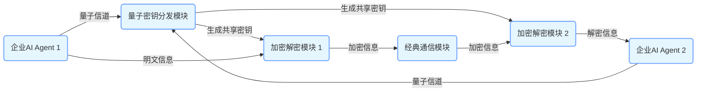

# 企业AI Agent的量子加密通信策略

> 关键词：企业AI Agent、量子加密通信、量子密钥分发、安全通信、量子纠缠

> 摘要：随着企业数字化转型的加速，企业AI Agent在企业运营中发挥着越来越重要的作用。然而，其通信安全问题成为了制约其发展的关键因素之一。量子加密通信作为一种具有高度安全性的通信方式，为企业AI Agent的通信安全提供了新的解决方案。本文将深入探讨企业AI Agent的量子加密通信策略，包括量子加密通信的核心概念、算法原理、数学模型，通过项目实战展示其实现过程，分析实际应用场景，推荐相关工具和资源，并对未来发展趋势与挑战进行总结，旨在为企业在保障AI Agent通信安全方面提供全面且深入的技术指导。

## 1. 背景介绍 
### 1.1 目的和范围
本文章的目的在于全面且深入地探讨企业AI Agent的量子加密通信策略。具体范围涵盖量子加密通信的基本原理、核心算法、数学模型，以及如何在企业AI Agent的实际通信场景中应用这些技术来保障通信安全。通过详细的分析和实际案例的展示，为企业提供一套可行的量子加密通信解决方案，以应对日益严峻的通信安全挑战。

### 1.2 预期读者
本文预期读者包括企业的技术管理人员、网络安全专家、AI研发工程师、对量子加密通信技术感兴趣的科研人员以及相关专业的学生。这些读者可能希望了解量子加密通信技术在企业AI Agent中的应用，掌握相关的技术原理和实现方法，以便在实际工作或学习中进行应用和研究。

### 1.3 文档结构概述
本文将按照以下结构进行阐述：首先介绍量子加密通信的背景和相关术语；接着深入讲解核心概念与联系，包括原理和架构的文本示意图以及Mermaid流程图；然后详细阐述核心算法原理和具体操作步骤，并使用Python源代码进行说明；随后介绍数学模型和公式，并举例说明；通过项目实战展示代码实际案例和详细解释；分析实际应用场景；推荐相关的工具和资源；最后总结未来发展趋势与挑战，并提供常见问题与解答以及扩展阅读和参考资料。

### 1.4 术语表
#### 1.4.1 核心术语定义
- **企业AI Agent**：是指在企业环境中运行的，具备一定人工智能能力的软件或硬件实体，能够自主地执行任务、与其他Agent或系统进行通信和协作，以实现企业的业务目标。
- **量子加密通信**：基于量子力学原理的一种加密通信方式，利用量子态的特性（如量子纠缠、量子不可克隆定理等）来实现信息的安全传输和密钥的安全分发。
- **量子密钥分发（QKD）**：量子加密通信中的关键技术，通过量子态的传输和测量来生成安全的密钥，保证通信双方拥有相同的密钥且该密钥的安全性基于量子力学原理。
- **量子纠缠**：量子力学中的一种特殊现象，两个或多个量子系统之间存在一种非经典的关联，使得它们的状态不能独立地描述，而是相互关联的。

#### 1.4.2 相关概念解释
- **经典加密通信**：基于数学算法的加密通信方式，如对称加密算法（如AES）和非对称加密算法（如RSA），其安全性依赖于数学难题的复杂度。
- **量子比特（qubit）**：量子信息的基本单位，与经典比特（0或1）不同，量子比特可以处于0和1的叠加态，这使得量子系统具有更强大的计算和信息处理能力。

#### 1.4.3 缩略词列表
- **QKD**：Quantum Key Distribution（量子密钥分发）
- **AES**：Advanced Encryption Standard（高级加密标准）
- **RSA**：Rivest-Shamir-Adleman（一种非对称加密算法）

## 2. 核心概念与联系 

### 量子加密通信原理
量子加密通信的核心原理基于量子力学的基本特性，主要包括量子不可克隆定理和量子纠缠。量子不可克隆定理指出，任何未知的量子态都不能被精确地复制。这一特性保证了在量子通信中，如果有第三方试图窃听信息，必然会对量子态产生干扰，通信双方可以通过检测这种干扰来发现窃听行为。

量子纠缠是指两个或多个量子系统之间存在一种特殊的关联，使得它们的状态不能独立地描述。当对其中一个量子系统进行测量时，另一个量子系统的状态会瞬间发生相应的变化，无论它们之间的距离有多远。利用量子纠缠可以实现安全的密钥分发，通信双方可以通过对纠缠量子态的测量来生成相同的密钥。

### 企业AI Agent与量子加密通信的联系
企业AI Agent在执行任务过程中需要与其他Agent或系统进行通信，传输各种敏感信息，如企业的商业机密、客户数据等。传统的加密通信方式在面对日益强大的计算能力和先进的攻击手段时，其安全性受到了严重的挑战。而量子加密通信的高度安全性可以为企业AI Agent的通信提供可靠的保障，确保信息在传输过程中不被窃取或篡改。

### 原理和架构的文本示意图
企业AI Agent的量子加密通信系统主要包括量子密钥分发模块、经典通信模块和加密解密模块。量子密钥分发模块负责通过量子信道生成和分发安全的密钥；经典通信模块用于传输经过加密的信息；加密解密模块则使用量子密钥对信息进行加密和解密。

### Mermaid流程图


## 3. 核心算法原理 & 具体操作步骤 

### 量子密钥分发算法原理
量子密钥分发的一种常见算法是BB84协议，其原理基于单光子的偏振态。单光子可以处于不同的偏振态，如水平偏振（H）、垂直偏振（V）、+45°偏振（D）和 -45°偏振（A）。通信双方（Alice和Bob）通过量子信道传输单光子，并使用不同的基（如直线基 {H, V} 和对角基 {D, A}）进行测量。

### 具体操作步骤
1. **Alice发送光子**：Alice随机选择一个基（直线基或对角基）和一个偏振态（对应所选基中的一个状态），并将相应的单光子发送给Bob。
2. **Bob测量光子**：Bob随机选择一个基（直线基或对角基）对接收到的光子进行测量。
3. **基比对**：Alice和Bob通过经典信道公开他们所使用的基，但不公开测量结果。他们只保留使用相同基测量的结果。
4. **错误检测**：Alice和Bob从保留的结果中随机选择一部分进行比较，计算错误率。如果错误率在可接受范围内，则认为没有窃听；否则，认为存在窃听，需要重新进行密钥分发。
5. **密钥生成**：Alice和Bob使用剩余的保留结果作为共享密钥。

### Python源代码实现
```python
import random

# 定义偏振态
H = 0
V = 1
D = 2
A = 3

# 定义基
LINEAR_BASIS = [H, V]
DIAGONAL_BASIS = [D, A]

# Alice发送光子
def alice_send_photons(num_photons):
    bases = []
    polarizations = []
    for _ in range(num_photons):
        basis = random.choice([LINEAR_BASIS, DIAGONAL_BASIS])
        bases.append(basis)
        polarization = random.choice(basis)
        polarizations.append(polarization)
    return bases, polarizations

# Bob测量光子
def bob_measure_photons(alice_polarizations):
    bases = []
    measurements = []
    for polarization in alice_polarizations:
        basis = random.choice([LINEAR_BASIS, DIAGONAL_BASIS])
        bases.append(basis)
        if polarization in basis:
            measurement = polarization
        else:
            # 测量结果错误
            measurement = random.choice(basis)
        measurements.append(measurement)
    return bases, measurements

# 基比对
def basis_reconciliation(alice_bases, bob_bases, alice_polarizations, bob_measurements):
    matching_indices = []
    for i in range(len(alice_bases)):
        if alice_bases[i] == bob_bases[i]:
            matching_indices.append(i)
    alice_key_bits = [alice_polarizations[i] for i in matching_indices]
    bob_key_bits = [bob_measurements[i] for i in matching_indices]
    return alice_key_bits, bob_key_bits

# 错误检测
def error_detection(alice_key_bits, bob_key_bits, num_check_bits):
    check_indices = random.sample(range(len(alice_key_bits)), num_check_bits)
    alice_check_bits = [alice_key_bits[i] for i in check_indices]
    bob_check_bits = [bob_key_bits[i] for i in check_indices]
    num_errors = sum(1 for a, b in zip(alice_check_bits, bob_check_bits) if a != b)
    error_rate = num_errors / num_check_bits
    return error_rate

# 密钥生成
def key_generation(alice_key_bits, bob_key_bits, num_check_bits):
    alice_key = [bit for i, bit in enumerate(alice_key_bits) if i not in random.sample(range(len(alice_key_bits)), num_check_bits)]
    bob_key = [bit for i, bit in enumerate(bob_key_bits) if i not in random.sample(range(len(bob_key_bits)), num_check_bits)]
    return alice_key, bob_key

# 主函数
def main():
    num_photons = 100
    num_check_bits = 10

    alice_bases, alice_polarizations = alice_send_photons(num_photons)
    bob_bases, bob_measurements = bob_measure_photons(alice_polarizations)
    alice_key_bits, bob_key_bits = basis_reconciliation(alice_bases, bob_bases, alice_polarizations, bob_measurements)
    error_rate = error_detection(alice_key_bits, bob_key_bits, num_check_bits)
    print(f"Error rate: {error_rate}")
    if error_rate < 0.05:
        alice_key, bob_key = key_generation(alice_key_bits, bob_key_bits, num_check_bits)
        print(f"Alice's key: {alice_key}")
        print(f"Bob's key: {bob_key}")
    else:
        print("Possible eavesdropping detected. Key distribution failed.")

if __name__ == "__main__":
    main()
```

## 4. 数学模型和公式 & 详细讲解 & 举例说明 

### 量子比特的状态表示
在量子力学中，量子比特的状态可以用二维希尔伯特空间中的向量来表示。一个量子比特的一般状态可以表示为：

$$|\psi\rangle = \alpha|0\rangle + \beta|1\rangle$$

其中，$|0\rangle$ 和 $|1\rangle$ 是基态，$\alpha$ 和 $\beta$ 是复数，且满足归一化条件 $|\alpha|^2 + |\beta|^2 = 1$。$|\alpha|^2$ 表示测量量子比特得到 $|0\rangle$ 状态的概率，$|\beta|^2$ 表示测量量子比特得到 $|1\rangle$ 状态的概率。

### 量子纠缠态的数学表示
以两个量子比特的纠缠态为例，最常见的纠缠态是贝尔态，如 $|\Phi^+\rangle$ 态：

$$|\Phi^+\rangle = \frac{1}{\sqrt{2}}(|00\rangle + |11\rangle)$$

其中，$|00\rangle$ 表示第一个量子比特处于 $|0\rangle$ 状态，第二个量子比特也处于 $|0\rangle$ 状态；$|11\rangle$ 表示第一个量子比特处于 $|1\rangle$ 状态，第二个量子比特也处于 $|1\rangle$ 状态。

### 量子密钥分发的安全性分析
量子密钥分发的安全性基于量子力学的基本原理。以BB84协议为例，假设存在一个窃听者Eve试图窃取密钥。Eve需要对传输的量子比特进行测量，由于她不知道Alice使用的基，她只能随机选择一个基进行测量。根据量子不可克隆定理，她的测量会改变量子比特的状态，从而导致Bob的测量结果出现错误。

设窃听者Eve对量子比特进行测量的概率为 $p$，则Bob测量结果出现错误的概率为 $\frac{p}{2}$。通过检测错误率，Alice和Bob可以判断是否存在窃听行为。

### 举例说明
假设Alice发送了100个量子比特，Bob接收到后进行测量。经过基比对，他们得到了80个匹配的结果。然后他们随机选择10个结果进行比较，发现有1个错误。则错误率为：

$$\text{Error rate} = \frac{1}{10} = 0.1$$

如果预设的错误率阈值为0.05，则认为存在窃听行为，需要重新进行密钥分发。

## 5. 项目实战：代码实际案例和详细解释说明 

### 5.1  开发环境搭建
- **Python环境**：确保已经安装Python 3.x版本。可以从Python官方网站（https://www.python.org/downloads/）下载并安装。
- **开发工具**：推荐使用PyCharm或Jupyter Notebook作为开发工具。PyCharm是一款功能强大的Python集成开发环境，Jupyter Notebook则适合进行交互式编程和代码演示。
- **相关库**：本项目主要使用Python的内置库，无需额外安装第三方库。

### 5.2  源代码详细实现和代码解读
```python
import random

# 定义偏振态
H = 0
V = 1
D = 2
A = 3

# 定义基
LINEAR_BASIS = [H, V]
DIAGONAL_BASIS = [D, A]

# Alice发送光子
def alice_send_photons(num_photons):
    bases = []
    polarizations = []
    for _ in range(num_photons):
        basis = random.choice([LINEAR_BASIS, DIAGONAL_BASIS])
        bases.append(basis)
        polarization = random.choice(basis)
        polarizations.append(polarization)
    return bases, polarizations

# Bob测量光子
def bob_measure_photons(alice_polarizations):
    bases = []
    measurements = []
    for polarization in alice_polarizations:
        basis = random.choice([LINEAR_BASIS, DIAGONAL_BASIS])
        bases.append(basis)
        if polarization in basis:
            measurement = polarization
        else:
            # 测量结果错误
            measurement = random.choice(basis)
        measurements.append(measurement)
    return bases, measurements

# 基比对
def basis_reconciliation(alice_bases, bob_bases, alice_polarizations, bob_measurements):
    matching_indices = []
    for i in range(len(alice_bases)):
        if alice_bases[i] == bob_bases[i]:
            matching_indices.append(i)
    alice_key_bits = [alice_polarizations[i] for i in matching_indices]
    bob_key_bits = [bob_measurements[i] for i in matching_indices]
    return alice_key_bits, bob_key_bits

# 错误检测
def error_detection(alice_key_bits, bob_key_bits, num_check_bits):
    check_indices = random.sample(range(len(alice_key_bits)), num_check_bits)
    alice_check_bits = [alice_key_bits[i] for i in check_indices]
    bob_check_bits = [bob_key_bits[i] for i in check_indices]
    num_errors = sum(1 for a, b in zip(alice_check_bits, bob_check_bits) if a != b)
    error_rate = num_errors / num_check_bits
    return error_rate

# 密钥生成
def key_generation(alice_key_bits, bob_key_bits, num_check_bits):
    alice_key = [bit for i, bit in enumerate(alice_key_bits) if i not in random.sample(range(len(alice_key_bits)), num_check_bits)]
    bob_key = [bit for i, bit in enumerate(bob_key_bits) if i not in random.sample(range(len(bob_key_bits)), num_check_bits)]
    return alice_key, bob_key

# 主函数
def main():
    num_photons = 100
    num_check_bits = 10

    alice_bases, alice_polarizations = alice_send_photons(num_photons)
    bob_bases, bob_measurements = bob_measure_photons(alice_polarizations)
    alice_key_bits, bob_key_bits = basis_reconciliation(alice_bases, bob_bases, alice_polarizations, bob_measurements)
    error_rate = error_detection(alice_key_bits, bob_key_bits, num_check_bits)
    print(f"Error rate: {error_rate}")
    if error_rate < 0.05:
        alice_key, bob_key = key_generation(alice_key_bits, bob_key_bits, num_check_bits)
        print(f"Alice's key: {alice_key}")
        print(f"Bob's key: {bob_key}")
    else:
        print("Possible eavesdropping detected. Key distribution failed.")

if __name__ == "__main__":
    main()
```

### 代码解读与分析
- **`alice_send_photons` 函数**：模拟Alice发送光子的过程。随机选择一个基和一个偏振态，并将其记录下来。
- **`bob_measure_photons` 函数**：模拟Bob测量光子的过程。随机选择一个基进行测量，如果所选基与Alice发送时的基相同，则测量结果正确；否则，测量结果可能错误。
- **`basis_reconciliation` 函数**：通过比较Alice和Bob使用的基，找出使用相同基的测量结果，作为候选密钥比特。
- **`error_detection` 函数**：从候选密钥比特中随机选择一部分进行比较，计算错误率。
- **`key_generation` 函数**：如果错误率在可接受范围内，则使用剩余的候选密钥比特生成最终的密钥。
- **`main` 函数**：主函数，调用上述函数完成量子密钥分发的整个过程，并根据错误率判断是否成功生成密钥。

## 6. 实际应用场景 
### 金融行业
在金融行业，企业AI Agent需要处理大量的敏感信息，如客户的账户信息、交易记录等。量子加密通信可以确保这些信息在传输过程中的安全性，防止金融诈骗和信息泄露。例如，银行的AI客服在与客户进行通信时，可以使用量子加密通信技术来保护客户的隐私和资金安全。

### 医疗行业
医疗行业中的企业AI Agent需要处理患者的病历、诊断结果等敏感信息。量子加密通信可以保证这些信息的保密性和完整性，防止患者隐私泄露。例如，远程医疗系统中的AI诊断助手与医院的信息系统之间的通信可以采用量子加密通信技术。

### 政府和国防领域
政府和国防领域的企业AI Agent需要处理国家机密和敏感信息。量子加密通信的高度安全性可以为这些信息的传输提供可靠的保障，防止信息被窃取和篡改。例如，军事指挥系统中的AI决策辅助系统与前线部队之间的通信可以使用量子加密通信技术。

## 7. 工具和资源推荐
### 7.1 学习资源推荐
#### 7.1.1 书籍推荐
- 《量子计算与量子信息》（Quantum Computation and Quantum Information）：由Michael A. Nielsen和Isaac L. Chuang所著，是量子计算和量子信息领域的经典教材，详细介绍了量子力学基础、量子算法、量子通信等内容。
- 《量子密码学原理与实践》（Quantum Cryptography: Principles and Practice）：全面介绍了量子密码学的基本原理、技术和应用，包括量子密钥分发协议、量子加密算法等。

#### 7.1.2 在线课程
- Coursera上的“Quantum Computing for Everyone”：由加州大学伯克利分校提供，适合初学者了解量子计算和量子通信的基本概念。
- edX上的“Quantum Information Science”：由麻省理工学院提供，深入讲解量子信息科学的理论和实践。

#### 7.1.3 技术博客和网站
- Quantum Computing Report（https://www.quantumcomputingreport.com/）：提供量子计算和量子通信领域的最新技术动态、研究成果和市场分析。
- arXiv（https://arxiv.org/）：一个预印本数据库，包含了大量的量子计算和量子通信领域的研究论文。

### 7.2 开发工具框架推荐
#### 7.2.1 IDE和编辑器
- PyCharm：一款功能强大的Python集成开发环境，提供代码编辑、调试、版本控制等功能，适合开发量子加密通信相关的Python代码。
- Jupyter Notebook：一个交互式编程环境，适合进行代码演示和实验，方便展示量子加密通信算法的实现过程。

#### 7.2.2 调试和性能分析工具
- Python的内置调试器（pdb）：可以帮助开发者调试Python代码，定位程序中的错误。
- cProfile：Python的性能分析工具，可以分析代码的运行时间和函数调用次数，帮助优化代码性能。

#### 7.2.3 相关框架和库
- Qiskit：IBM开发的开源量子计算框架，提供了量子电路设计、模拟和实验等功能，可用于研究和实现量子加密通信算法。
- Cirq：Google开发的开源量子计算框架，支持量子电路的构建和模拟，适合进行量子算法的开发和测试。

### 7.3 相关论文著作推荐
#### 7.3.1 经典论文
- “Quantum Cryptography: Public Key Distribution and Coin Tossing”（Charles H. Bennett和Gilles Brassard，1984）：提出了BB84量子密钥分发协议，是量子加密通信领域的开创性论文。
- “Teleporting an Unknown Quantum State via Dual Classical and Einstein-Podolsky-Rosen Channels”（Charles H. Bennett等，1993）：提出了量子隐形传态的概念和实现方案，为量子通信的发展奠定了基础。

#### 7.3.2 最新研究成果
- 关注Nature、Science、Physical Review Letters等顶级学术期刊上关于量子计算和量子通信的最新研究论文，了解该领域的前沿动态。

#### 7.3.3 应用案例分析
- 查阅相关的行业报告和学术论文，了解量子加密通信技术在金融、医疗、政府等领域的实际应用案例和效果评估。

## 8. 总结：未来发展趋势与挑战
### 未来发展趋势
- **技术融合**：量子加密通信技术将与其他技术（如人工智能、区块链等）深度融合，为企业提供更加安全、高效的解决方案。例如，结合人工智能技术可以实现对量子通信系统的智能管理和优化，结合区块链技术可以增强量子密钥的存储和管理安全性。
- **产业化发展**：随着量子加密通信技术的不断成熟，相关的产业将逐渐兴起。量子通信设备制造商、服务提供商等将不断涌现，推动量子加密通信技术在各个行业的广泛应用。
- **国际合作加强**：量子加密通信技术是一个全球性的研究领域，各国将加强在该领域的合作与交流。国际标准的制定和统一将促进量子加密通信技术的国际化发展。

### 挑战
- **技术难题**：目前量子加密通信技术还存在一些技术难题，如量子比特的稳定性、量子纠缠的保持时间、量子通信的距离限制等。这些问题需要进一步的研究和突破。
- **成本高昂**：量子加密通信设备的研发和生产成本较高，限制了其大规模应用。降低成本是推动量子加密通信技术产业化发展的关键。
- **人才短缺**：量子加密通信技术是一个新兴领域，相关的专业人才短缺。培养和吸引更多的专业人才是推动该领域发展的重要保障。

## 9. 附录：常见问题与解答
### 量子加密通信是否绝对安全？
量子加密通信的安全性基于量子力学的基本原理，在理论上具有高度的安全性。然而，实际应用中还存在一些技术挑战和潜在的安全风险，如设备的不完善、环境干扰等。因此，量子加密通信并不是绝对安全的，但相比传统的加密通信方式，其安全性要高得多。

### 量子加密通信的成本高吗？
目前，量子加密通信设备的研发和生产成本较高，主要原因是量子技术的复杂性和对高精度设备的需求。随着技术的不断发展和规模的扩大，成本有望逐渐降低。

### 量子加密通信与传统加密通信有什么区别？
传统加密通信基于数学算法，其安全性依赖于数学难题的复杂度。而量子加密通信基于量子力学原理，利用量子态的特性来实现信息的安全传输和密钥的安全分发。量子加密通信具有更高的安全性，并且可以检测到窃听行为。

### 企业如何实施量子加密通信策略？
企业实施量子加密通信策略需要考虑多个方面，包括技术选型、设备采购、人员培训等。首先，企业需要评估自身的需求和安全要求，选择合适的量子加密通信技术和设备。其次，企业需要进行相关的人员培训，确保员工具备操作和维护量子加密通信系统的能力。最后，企业需要建立完善的安全管理制度，保障量子加密通信系统的正常运行。

## 10. 扩展阅读 & 参考资料
### 扩展阅读
- 《量子力学导论》（Introduction to Quantum Mechanics）：由David J. Griffiths所著，深入介绍量子力学的基本原理和数学基础，有助于进一步理解量子加密通信的理论基础。
- 《信息安全技术概论》：全面介绍信息安全的基本概念、技术和方法，包括传统加密技术和量子加密技术。

### 参考资料
- Nielsen, M. A., & Chuang, I. L. (2000). Quantum Computation and Quantum Information. Cambridge University Press.
- Bennett, C. H., & Brassard, G. (1984). Quantum Cryptography: Public Key Distribution and Coin Tossing. Proceedings of the IEEE International Conference on Computers, Systems, and Signal Processing.
- Bennett, C. H., et al. (1993). Teleporting an Unknown Quantum State via Dual Classical and Einstein-Podolsky-Rosen Channels. Physical Review Letters.