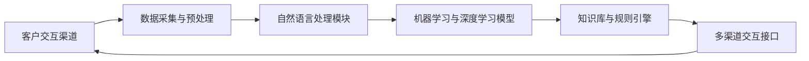

# 企业估值中的AI驱动的自动化客户服务平台评估

> 关键词：企业估值、AI驱动、自动化客户服务平台、评估方法、技术原理

> 摘要：本文聚焦于企业估值中AI驱动的自动化客户服务平台的评估。首先介绍相关背景知识，包括目的、预期读者等内容。接着阐述核心概念与联系，深入讲解其原理和架构。通过Python代码详细剖析核心算法原理及具体操作步骤，并给出相应的数学模型和公式。以实际项目为例，展示代码实现和详细解释。探讨该平台的实际应用场景，推荐学习资源、开发工具框架以及相关论文著作。最后总结未来发展趋势与挑战，提供常见问题解答和扩展阅读参考资料，旨在为全面、深入地评估AI驱动的自动化客户服务平台在企业估值中的价值提供全面且专业的指导。

## 1. 背景介绍 
### 1.1 目的和范围
在当今数字化和智能化快速发展的时代，企业的客户服务模式正经历着深刻的变革。AI驱动的自动化客户服务平台逐渐成为企业提升客户体验、提高运营效率、增强核心竞争力的关键工具。本文章的目的在于探讨如何在企业估值过程中对这类自动化客户服务平台进行科学、合理的评估。评估范围涵盖了从平台的技术架构、功能特性到其对企业业务和财务绩效的影响等多个方面，旨在为投资者、企业管理者和相关专业人士提供全面的评估方法和思路，以准确把握自动化客户服务平台在企业整体价值中的贡献。

### 1.2 预期读者
本文预期读者包括但不限于企业投资者，他们需要准确评估企业价值，以做出合理的投资决策；企业管理者，希望通过了解平台评估方法，更好地规划和管理客户服务业务，提升企业的综合竞争力；金融分析师，在进行企业财务分析和估值建模时，需要考虑自动化客户服务平台的因素；以及对人工智能和客户服务领域感兴趣的技术爱好者和研究人员，他们可以通过本文深入了解相关技术和评估方法。

### 1.3 文档结构概述
本文将按照以下结构展开：首先介绍背景知识，让读者了解评估AI驱动的自动化客户服务平台在企业估值中的重要性和相关背景信息。接着阐述核心概念与联系，通过文本示意图和Mermaid流程图详细解释平台的原理和架构。然后深入讲解核心算法原理和具体操作步骤，并给出相应的数学模型和公式，使读者能够从技术和数学层面理解平台的运作。以实际项目为例，展示代码实现和详细解释，让读者了解如何在实际中应用相关技术和方法。探讨该平台的实际应用场景，帮助读者了解其在不同行业的具体应用。推荐学习资源、开发工具框架以及相关论文著作，为读者提供进一步学习和研究的方向。最后总结未来发展趋势与挑战，提供常见问题解答和扩展阅读参考资料，使读者对整个主题有一个全面、深入的了解。

### 1.4 术语表
#### 1.4.1 核心术语定义
- **AI驱动**：指利用人工智能技术，如自然语言处理（NLP）、机器学习（ML）、深度学习（DL）等，为系统或平台提供智能决策和自动化操作的能力。在自动化客户服务平台中，AI驱动可以实现自动回答客户问题、智能客服转接、客户需求预测等功能。
- **自动化客户服务平台**：是一种基于信息技术和人工智能技术，能够自动处理客户咨询、投诉、建议等服务请求的软件系统。该平台可以通过多种渠道（如网站、APP、社交媒体等）与客户进行交互，实现快速、高效的客户服务。
- **企业估值**：是指对企业的整体价值进行评估的过程。企业估值通常基于企业的财务状况、市场前景、行业竞争力、技术创新能力等多个因素，采用不同的估值方法（如收益法、市场法、成本法等）来确定企业的价值。

#### 1.4.2 相关概念解释
- **自然语言处理（NLP）**：是人工智能的一个重要分支，主要研究如何让计算机理解和处理人类语言。在自动化客户服务平台中，NLP技术可以用于实现客户问题的自动理解、语义分析、情感分析等功能，从而提高客户服务的效率和质量。
- **机器学习（ML）**：是一门多领域交叉学科，涉及概率论、统计学、逼近论、凸分析、算法复杂度理论等多门学科。它专门研究计算机怎样模拟或实现人类的学习行为，以获取新的知识或技能，重新组织已有的知识结构使之不断改善自身的性能。在自动化客户服务平台中，机器学习算法可以用于客户需求预测、客户分类、服务推荐等功能。
- **深度学习（DL）**：是机器学习的一个分支领域，它是一种基于对数据进行表征学习的方法。深度学习通过构建具有很多层的神经网络模型，自动从大量数据中学习特征和模式，从而实现对数据的分类、预测等任务。在自动化客户服务平台中，深度学习技术可以用于语音识别、图像识别、文本生成等功能。

#### 1.4.3 缩略词列表
- **NLP**：Natural Language Processing（自然语言处理）
- **ML**：Machine Learning（机器学习）
- **DL**：Deep Learning（深度学习）
- **API**：Application Programming Interface（应用程序编程接口）

## 2. 核心概念与联系 

### 核心概念原理
AI驱动的自动化客户服务平台的核心原理是利用人工智能技术实现客户服务的自动化和智能化。该平台主要由以下几个部分组成：

1. **数据采集与预处理**：通过多种渠道（如网站、APP、社交媒体等）收集客户的服务请求数据，并对这些数据进行清洗、标注、特征提取等预处理操作，以便后续的分析和处理。
2. **自然语言处理模块**：利用NLP技术对客户的文本请求进行理解和分析，包括语义分析、情感分析、实体识别等。通过这些分析，可以准确把握客户的需求和意图，为后续的服务提供支持。
3. **机器学习与深度学习模型**：利用机器学习和深度学习算法对客户数据进行建模和训练，以实现客户需求预测、客户分类、服务推荐等功能。例如，通过训练一个分类模型，可以将客户分为不同的类别，如高价值客户、低价值客户等，以便为不同类型的客户提供个性化的服务。
4. **知识库与规则引擎**：建立一个包含常见问题解答、业务规则、服务流程等信息的知识库，并利用规则引擎对客户的请求进行匹配和处理。当客户提出问题时，系统可以自动从知识库中查找相关的答案，并根据规则引擎的规则进行相应的处理。
5. **多渠道交互接口**：提供多种渠道的交互接口，如网站在线客服、APP客服、社交媒体客服等，以便客户可以通过自己喜欢的渠道与平台进行交互。同时，平台可以实现不同渠道之间的信息同步和协同，提高客户服务的效率和质量。

### 架构的文本示意图
```plaintext
+---------------------+
|  客户交互渠道       |
|  (网站、APP、社交   |
|   媒体等)           |
+---------------------+
           |
           v
+---------------------+
|  数据采集与预处理   |
|  (清洗、标注、特    |
|   征提取)           |
+---------------------+
           |
           v
+---------------------+
|  自然语言处理模块  |
|  (语义分析、情感    |
|   分析、实体识别)  |
+---------------------+
           |
           v
+---------------------+
|  机器学习与深度    |
|  学习模型          |
|  (需求预测、客户    |
|   分类、服务推荐)  |
+---------------------+
           |
           v
+---------------------+
|  知识库与规则引擎  |
|  (常见问题解答、    |
|   业务规则、服务    |
|   流程)            |
+---------------------+
           |
           v
+---------------------+
|  多渠道交互接口    |
|  (网站在线客服、    |
|   APP客服、社交     |
|   媒体客服)        |
+---------------------+
```

### Mermaid流程图


## 3. 核心算法原理 & 具体操作步骤 

### 核心算法原理

#### 自然语言处理中的文本分类算法（以朴素贝叶斯算法为例）
朴素贝叶斯算法是一种基于贝叶斯定理和特征条件独立假设的分类算法。在文本分类任务中，朴素贝叶斯算法通过计算文本属于不同类别的概率，将文本分类到概率最大的类别中。

假设我们有一个文本集合 $D$，其中包含 $n$ 个文本样本，每个样本 $d_i$ 属于一个类别 $c_j$，$j = 1,2,\cdots,k$。我们的目标是根据文本的特征（如词语）来预测文本的类别。

根据贝叶斯定理，文本 $d$ 属于类别 $c$ 的概率可以表示为：

$P(c|d)=\frac{P(d|c)P(c)}{P(d)}$

由于对于所有的类别 $c$，$P(d)$ 是相同的，因此我们只需要比较 $P(d|c)P(c)$ 的大小来确定文本的类别。

在朴素贝叶斯算法中，我们假设文本中的特征（词语）是条件独立的，即：

$P(d|c)=P(w_1,w_2,\cdots,w_m|c)=\prod_{i = 1}^{m}P(w_i|c)$

其中，$w_1,w_2,\cdots,w_m$ 是文本 $d$ 中的词语。

#### 机器学习中的客户分类算法（以K近邻算法为例）
K近邻算法是一种基本的分类与回归方法。在客户分类任务中，K近邻算法通过计算客户样本之间的距离（如欧氏距离），找到与待分类客户最近的 $K$ 个客户样本，然后根据这 $K$ 个样本的类别来确定待分类客户的类别。

假设我们有一个客户样本集合 $X$，其中包含 $n$ 个客户样本，每个样本 $x_i$ 有 $m$ 个特征。我们的目标是根据客户的特征来预测客户的类别。

对于一个待分类的客户样本 $x$，我们计算它与样本集合 $X$ 中每个样本 $x_i$ 的距离 $d(x,x_i)$，然后选择距离最近的 $K$ 个样本。假设这 $K$ 个样本中属于类别 $c_j$ 的样本有 $n_j$ 个，我们可以通过投票的方式来确定待分类客户的类别，即选择 $n_j$ 最大的类别 $c_j$ 作为待分类客户的类别。

### 具体操作步骤及Python源代码

#### 文本分类（朴素贝叶斯算法）
```python
import numpy as np
from sklearn.feature_extraction.text import CountVectorizer
from sklearn.naive_bayes import MultinomialNB
from sklearn.model_selection import train_test_split
from sklearn.metrics import accuracy_score

# 示例数据
corpus = [
    "This is a positive review",
    "This is a negative review",
    "The product is great",
    "The product is terrible"
]
labels = [1, 0, 1, 0]

# 数据预处理
vectorizer = CountVectorizer()
X = vectorizer.fit_transform(corpus)

# 划分训练集和测试集
X_train, X_test, y_train, y_test = train_test_split(X, labels, test_size=0.2, random_state=42)

# 训练模型
clf = MultinomialNB()
clf.fit(X_train, y_train)

# 预测
y_pred = clf.predict(X_test)

# 评估模型
accuracy = accuracy_score(y_test, y_pred)
print(f"Accuracy: {accuracy}")
```

#### 客户分类（K近邻算法）
```python
import numpy as np
from sklearn.neighbors import KNeighborsClassifier
from sklearn.model_selection import train_test_split
from sklearn.metrics import accuracy_score

# 示例数据
X = np.array([[1, 2], [2, 3], [3, 4], [4, 5], [5, 6], [6, 7]])
y = np.array([0, 0, 0, 1, 1, 1])

# 划分训练集和测试集
X_train, X_test, y_train, y_test = train_test_split(X, y, test_size=0.2, random_state=42)

# 训练模型
knn = KNeighborsClassifier(n_neighbors=3)
knn.fit(X_train, y_train)

# 预测
y_pred = knn.predict(X_test)

# 评估模型
accuracy = accuracy_score(y_test, y_pred)
print(f"Accuracy: {accuracy}")
```

## 4. 数学模型和公式 & 详细讲解 & 举例说明 

### 朴素贝叶斯算法的数学模型和公式

#### 先验概率 $P(c)$
先验概率 $P(c)$ 表示类别 $c$ 在整个样本集合中出现的概率。可以通过以下公式计算：

$P(c)=\frac{N_c}{N}$

其中，$N_c$ 是类别 $c$ 中的样本数量，$N$ 是整个样本集合的样本数量。

#### 条件概率 $P(w|c)$
条件概率 $P(w|c)$ 表示在类别 $c$ 中词语 $w$ 出现的概率。可以通过以下公式计算：

$P(w|c)=\frac{count(w,c) + \alpha}{count(c) + \alpha V}$

其中，$count(w,c)$ 是词语 $w$ 在类别 $c$ 中出现的次数，$count(c)$ 是类别 $c$ 中所有词语出现的总次数，$V$ 是词汇表的大小，$\alpha$ 是平滑参数，通常取 $\alpha = 1$（拉普拉斯平滑）。

#### 后验概率 $P(c|d)$
后验概率 $P(c|d)$ 表示文本 $d$ 属于类别 $c$ 的概率。根据贝叶斯定理和朴素贝叶斯假设，可以通过以下公式计算：

$P(c|d)=\frac{P(d|c)P(c)}{P(d)}\approx P(d|c)P(c)=\left(\prod_{i = 1}^{m}P(w_i|c)\right)P(c)$

#### 举例说明
假设我们有一个文本分类任务，文本集合包含以下两个类别：“体育”和“科技”，以及以下文本样本：

- 体育：“篮球比赛很精彩”，“足球是一项受欢迎的运动”
- 科技：“人工智能改变生活”，“智能手机功能强大”

我们的词汇表为 $V = \{篮球, 比赛, 精彩, 足球, 运动, 人工智能, 改变, 生活, 智能手机, 功能强大\}$，$|V| = 10$。

计算先验概率：
$P(体育)=\frac{2}{4}=0.5$
$P(科技)=\frac{2}{4}=0.5$

计算条件概率（以词语“篮球”为例）：
$count(篮球, 体育)=1$
$count(体育)=3$
$P(篮球|体育)=\frac{1 + 1}{3 + 1\times10}=\frac{2}{13}$

$count(篮球, 科技)=0$
$count(科技)=3$
$P(篮球|科技)=\frac{0 + 1}{3 + 1\times10}=\frac{1}{13}$

假设我们有一个新的文本“篮球运动很有趣”，计算该文本属于“体育”和“科技”类别的后验概率：

$P(体育|篮球运动很有趣)\approx P(篮球|体育)P(运动|体育)P(有趣|体育)P(体育)$
$P(科技|篮球运动很有趣)\approx P(篮球|科技)P(运动|科技)P(有趣|科技)P(科技)$

比较两个后验概率的大小，将文本分类到概率最大的类别中。

### K近邻算法的数学模型和公式

#### 距离度量（欧氏距离）
欧氏距离是最常用的距离度量方法，用于计算两个样本之间的距离。对于两个 $m$ 维样本 $x=(x_1,x_2,\cdots,x_m)$ 和 $y=(y_1,y_2,\cdots,y_m)$，欧氏距离可以通过以下公式计算：

$d(x,y)=\sqrt{\sum_{i = 1}^{m}(x_i - y_i)^2}$

#### 举例说明
假设我们有一个客户分类任务，客户样本有两个特征：年龄和收入。我们有以下客户样本：

| 客户编号 | 年龄 | 收入 | 类别 |
| ---- | ---- | ---- | ---- |
| 1 | 25 | 5000 | 0 |
| 2 | 30 | 6000 | 0 |
| 3 | 35 | 7000 | 0 |
| 4 | 40 | 8000 | 1 |
| 5 | 45 | 9000 | 1 |
| 6 | 50 | 10000 | 1 |

现在有一个待分类的客户样本 $(32, 6500)$，我们要使用K近邻算法（$K = 3$）来预测该客户的类别。

计算待分类客户样本与每个样本的欧氏距离：

$d((32, 6500),(25, 5000))=\sqrt{(32 - 25)^2+(6500 - 5000)^2}$
$d((32, 6500),(30, 6000))=\sqrt{(32 - 30)^2+(6500 - 6000)^2}$
$\cdots$

选择距离最近的 $K = 3$ 个样本，假设这 $3$ 个样本的类别分别为 $0, 0, 1$，通过投票的方式，待分类客户的类别为 $0$。

## 5. 项目实战：代码实际案例和详细解释说明 

### 5.1  开发环境搭建

#### 安装Python
首先，确保你已经安装了Python。可以从Python官方网站（https://www.python.org/downloads/） 下载并安装适合你操作系统的Python版本。建议安装Python 3.6及以上版本。

#### 安装必要的库
在命令行中使用以下命令安装必要的库：
```sh
pip install numpy scikit-learn pandas
```

### 5.2  源代码详细实现和代码解读

#### 项目需求
我们要实现一个简单的AI驱动的自动化客户服务平台，该平台可以根据客户的问题进行分类，并提供相应的答案。

#### 代码实现
```python
import numpy as np
from sklearn.feature_extraction.text import CountVectorizer
from sklearn.naive_bayes import MultinomialNB

# 定义知识库
knowledge_base = {
    "关于产品信息": "我们的产品具有多种功能和特点，详情请查看产品说明书。",
    "关于价格": "产品价格根据不同的型号和配置有所不同，请联系我们的客服获取具体价格。",
    "关于售后服务": "我们提供优质的售后服务，包括维修、更换等。如有问题，请拨打客服电话。"
}

# 定义训练数据
questions = [
    "产品有哪些功能？",
    "产品的特点是什么？",
    "产品价格是多少？",
    "不同型号的价格一样吗？",
    "售后服务如何？",
    "有维修服务吗？"
]
labels = [
    "关于产品信息",
    "关于产品信息",
    "关于价格",
    "关于价格",
    "关于售后服务",
    "关于售后服务"
]

# 数据预处理
vectorizer = CountVectorizer()
X = vectorizer.fit_transform(questions)

# 训练模型
clf = MultinomialNB()
clf.fit(X, labels)

# 定义客户问题分类和回答函数
def classify_and_answer(question):
    question_vector = vectorizer.transform([question])
    category = clf.predict(question_vector)[0]
    answer = knowledge_base.get(category, "抱歉，暂时无法回答您的问题。")
    return answer

# 测试
test_question = "产品的特点有哪些？"
answer = classify_and_answer(test_question)
print(f"问题: {test_question}")
print(f"答案: {answer}")
```

#### 代码解读
1. **知识库的定义**：`knowledge_base` 字典存储了常见问题的类别和对应的答案。
2. **训练数据的定义**：`questions` 列表存储了客户的问题，`labels` 列表存储了每个问题对应的类别。
3. **数据预处理**：使用 `CountVectorizer` 将文本问题转换为向量表示，方便后续的机器学习算法处理。
4. **模型训练**：使用 `MultinomialNB` 朴素贝叶斯分类器对训练数据进行训练。
5. **客户问题分类和回答函数**：`classify_and_answer` 函数接收一个客户问题，将其转换为向量表示，使用训练好的模型进行分类，然后从知识库中获取相应的答案。
6. **测试**：定义一个测试问题，调用 `classify_and_answer` 函数进行测试，并打印出问题和答案。

### 5.3  代码解读与分析

#### 优点
- **简单易懂**：使用朴素贝叶斯算法和简单的文本处理方法，代码结构清晰，易于理解和实现。
- **可扩展性**：可以通过添加更多的训练数据和更新知识库来扩展平台的功能和覆盖范围。

#### 缺点
- **准确性有限**：朴素贝叶斯算法基于特征条件独立假设，在实际应用中可能会存在一定的局限性，导致分类准确性有限。
- **缺乏上下文理解**：该平台只能根据当前问题进行分类和回答，缺乏对上下文的理解，无法处理复杂的对话场景。

#### 改进方向
- **使用更复杂的算法**：可以尝试使用深度学习算法（如循环神经网络、卷积神经网络等）来提高分类的准确性。
- **引入上下文管理**：可以通过维护对话历史记录，引入上下文管理机制，实现更智能的对话交互。

## 6. 实际应用场景 

### 电商行业
在电商行业中，AI驱动的自动化客户服务平台可以为客户提供实时的产品咨询、订单查询、售后服务等支持。例如，当客户询问产品的尺寸、颜色、库存等信息时，平台可以自动回答；当客户遇到订单支付失败、物流延迟等问题时，平台可以引导客户进行相应的处理。通过自动化客户服务平台，电商企业可以提高客户服务效率，降低人工客服成本，提升客户满意度。

### 金融行业
在金融行业中，自动化客户服务平台可以为客户提供账户查询、贷款咨询、理财产品推荐等服务。例如，当客户询问账户余额、交易明细等信息时，平台可以自动查询并反馈；当客户咨询贷款政策、利率等问题时，平台可以根据客户的情况提供相应的建议和方案。同时，平台还可以通过机器学习算法对客户的风险偏好、投资需求等进行分析，为客户提供个性化的理财产品推荐。

### 电信行业
在电信行业中，自动化客户服务平台可以为客户提供话费查询、套餐办理、故障报修等服务。例如，当客户询问当前话费余额、套餐使用情况等信息时，平台可以自动查询并告知；当客户需要办理新的套餐或变更现有套餐时，平台可以引导客户完成相关操作；当客户遇到网络故障、通话质量问题等时，平台可以及时记录并安排维修人员进行处理。通过自动化客户服务平台，电信企业可以提高客户服务的响应速度和质量，增强客户粘性。

### 医疗行业
在医疗行业中，自动化客户服务平台可以为患者提供预约挂号、医疗咨询、健康指导等服务。例如，当患者需要预约挂号时，平台可以提供医院、科室、医生等信息，并帮助患者完成预约操作；当患者咨询疾病症状、治疗方法等问题时，平台可以根据患者的描述提供相应的建议和指导；同时，平台还可以通过推送健康知识、提醒患者按时服药等方式，帮助患者进行健康管理。

## 7. 工具和资源推荐

### 7.1 学习资源推荐

#### 7.1.1 书籍推荐
- 《Python机器学习》：这本书详细介绍了Python在机器学习领域的应用，包括各种机器学习算法的原理、实现和应用案例。适合初学者和有一定基础的读者。
- 《自然语言处理入门》：全面介绍了自然语言处理的基本概念、技术和方法，包括词法分析、句法分析、语义分析等内容。对于想要深入了解自然语言处理的读者来说是一本很好的入门书籍。
- 《深度学习》：由深度学习领域的三位顶尖专家Ian Goodfellow、Yoshua Bengio和Aaron Courville撰写，是深度学习领域的经典著作，涵盖了深度学习的理论、算法和应用等方面的内容。

#### 7.1.2 在线课程
- Coursera上的“机器学习”课程：由斯坦福大学教授Andrew Ng主讲，是机器学习领域的经典在线课程，介绍了机器学习的基本概念、算法和应用。
- edX上的“自然语言处理”课程：由哥伦比亚大学教授讲解，深入介绍了自然语言处理的技术和方法，包括文本分类、情感分析、机器翻译等内容。
- 网易云课堂上的“深度学习实战”课程：通过实际项目案例，介绍了深度学习的应用和实践，适合有一定编程基础的读者。

#### 7.1.3 技术博客和网站
- Medium：是一个汇聚了众多技术专家和爱好者的博客平台，上面有很多关于人工智能、机器学习、自然语言处理等领域的优质文章。
- 机器之心：专注于人工智能领域的资讯和技术分享，提供最新的行业动态、技术文章和研究成果。
- 开源中国：是一个开源技术社区，上面有很多关于开源项目、技术教程和经验分享的内容，对于学习和实践AI驱动的自动化客户服务平台有很大的帮助。

### 7.2 开发工具框架推荐

#### 7.2.1 IDE和编辑器
- PyCharm：是一款专门为Python开发设计的集成开发环境（IDE），具有代码编辑、调试、版本控制等功能，支持多种Python框架和库，是Python开发者的首选工具之一。
- Visual Studio Code：是一款轻量级的代码编辑器，支持多种编程语言，具有丰富的插件生态系统，可以通过安装相关插件来实现Python开发的各种功能，如代码高亮、自动补全、调试等。

#### 7.2.2 调试和性能分析工具
- pdb：是Python内置的调试器，可以帮助开发者在代码中设置断点、单步执行、查看变量值等，方便调试代码。
- cProfile：是Python的性能分析工具，可以帮助开发者分析代码的性能瓶颈，找出耗时较长的函数和代码段，从而进行优化。

#### 7.2.3 相关框架和库
- scikit-learn：是一个简单易用的机器学习库，提供了各种机器学习算法的实现，如分类、回归、聚类等，方便开发者快速实现机器学习模型。
- TensorFlow：是一个开源的深度学习框架，由Google开发和维护，支持多种深度学习模型的构建和训练，如神经网络、卷积神经网络、循环神经网络等。
- PyTorch：是另一个流行的深度学习框架，由Facebook开发和维护，具有动态计算图的特点，适合快速迭代和实验深度学习模型。

### 7.3 相关论文著作推荐

#### 7.3.1 经典论文
- “A Logical Calculus of the Ideas Immanent in Nervous Activity”：由Warren McCulloch和Walter Pitts发表于1943年，提出了神经元的数学模型，为神经网络的发展奠定了基础。
- “Learning Representations by Back-propagating Errors”：由David Rumelhart、Geoffrey Hinton和Ronald Williams发表于1986年，介绍了反向传播算法，使得神经网络的训练变得可行，推动了神经网络的发展。
- “Attention Is All You Need”：由Ashish Vaswani等人发表于2017年，提出了Transformer架构，在自然语言处理领域取得了巨大的成功，开启了预训练模型的时代。

#### 7.3.2 最新研究成果
- 关注顶级学术会议（如NeurIPS、ICML、ACL等）的论文，这些会议汇聚了人工智能领域的最新研究成果和前沿技术。
- 查阅相关领域的顶级学术期刊（如Journal of Artificial Intelligence Research、Artificial Intelligence等），了解最新的研究动态和发展趋势。

#### 7.3.3 应用案例分析
- 可以参考一些大型企业（如亚马逊、谷歌、微软等）的技术博客和公开报告，了解他们在AI驱动的自动化客户服务平台方面的应用案例和实践经验。
- 研究一些成功的创业公司的案例，了解他们如何利用人工智能技术解决客户服务领域的问题，实现业务的快速发展。

## 8. 总结：未来发展趋势与挑战

### 未来发展趋势

#### 智能化程度不断提高
随着人工智能技术的不断发展，AI驱动的自动化客户服务平台的智能化程度将不断提高。未来的平台将能够更好地理解客户的意图和情感，提供更加个性化、智能化的服务。例如，平台可以根据客户的历史交互记录和偏好，自动推荐适合客户的产品和服务；可以通过情感分析技术，感知客户的情绪变化，及时调整服务策略，提高客户满意度。

#### 多模态交互成为主流
目前的自动化客户服务平台主要以文本和语音交互为主，未来的平台将支持多模态交互，包括图像、视频等。例如，客户可以通过上传图片或视频的方式描述问题，平台可以自动识别图像或视频中的信息，提供相应的解决方案。多模态交互将使客户与平台的交互更加自然、便捷，提高客户体验。

#### 与其他系统的深度集成
未来的自动化客户服务平台将与企业的其他系统（如CRM系统、ERP系统等）进行深度集成，实现数据的共享和业务的协同。例如，当客户在客服平台上咨询产品信息时，平台可以自动从CRM系统中获取客户的历史购买记录和偏好，为客户提供更加个性化的服务；当客户提交订单后，平台可以自动与ERP系统进行对接，跟踪订单的处理进度，并及时反馈给客户。

#### 强化学习的应用
强化学习是一种通过智能体与环境进行交互，不断学习最优策略的机器学习方法。未来的自动化客户服务平台将引入强化学习技术，使平台能够在与客户的交互过程中不断学习和优化服务策略。例如，平台可以根据客户的反馈和评价，自动调整回答的方式和内容，提高客户满意度和服务效率。

### 挑战

#### 数据隐私和安全问题
AI驱动的自动化客户服务平台需要收集和处理大量的客户数据，包括个人信息、交易记录等。这些数据的隐私和安全问题是一个重要的挑战。企业需要采取有效的措施来保护客户数据的隐私和安全，防止数据泄露和滥用。例如，采用加密技术对数据进行加密存储和传输，建立严格的访问控制机制，对数据的使用和共享进行严格的管理。

#### 技术复杂度和成本问题
开发和维护一个高效、智能的自动化客户服务平台需要掌握多种人工智能技术，如自然语言处理、机器学习、深度学习等。这些技术的复杂度较高，需要专业的技术人员进行开发和维护。同时，购买和使用相关的计算资源和软件工具也需要一定的成本。因此，技术复杂度和成本问题是企业在实施自动化客户服务平台时需要面对的挑战。

#### 客户接受度问题
虽然自动化客户服务平台具有很多优点，但部分客户可能对其存在不信任或不适应的情况。例如，一些客户可能更喜欢与人工客服进行交流，认为人工客服能够提供更加个性化、人性化的服务。因此，如何提高客户对自动化客户服务平台的接受度是企业需要解决的问题。企业可以通过加强宣传和培训，提高客户对平台的了解和认识；优化平台的设计和功能，提高平台的易用性和服务质量，增强客户的满意度和信任度。

#### 伦理和法律问题
随着人工智能技术的广泛应用，伦理和法律问题也日益凸显。例如，自动化客户服务平台的决策和行为可能会对客户产生影响，如何确保平台的决策和行为符合伦理和法律要求是一个重要的问题。企业需要建立相应的伦理和法律框架，对平台的开发、使用和管理进行规范，确保平台的运行符合社会的价值观和法律规定。

## 9. 附录：常见问题与解答

### 1. 如何选择适合的评估方法来评估AI驱动的自动化客户服务平台？
选择适合的评估方法需要考虑多个因素，如平台的特点、企业的需求、评估的目的等。常见的评估方法包括收益法、市场法、成本法等。收益法主要基于平台未来的收益来评估其价值，适用于具有明确收益预期的平台；市场法通过比较类似平台的市场交易价格来评估平台的价值，适用于市场上有较多可比案例的情况；成本法主要基于平台的开发和维护成本来评估其价值，适用于平台的成本可以准确计量的情况。在实际应用中，可以根据具体情况选择一种或多种评估方法进行综合评估。

### 2. AI驱动的自动化客户服务平台的开发需要哪些技术和技能？
开发AI驱动的自动化客户服务平台需要掌握多种技术和技能，包括自然语言处理、机器学习、深度学习、数据库管理、软件开发等。具体来说，需要掌握以下技术和技能：
- **自然语言处理**：包括文本分类、情感分析、语义理解等技术，用于实现客户问题的自动理解和分析。
- **机器学习和深度学习**：包括分类算法、回归算法、聚类算法、神经网络等技术，用于实现客户需求预测、客户分类、服务推荐等功能。
- **数据库管理**：掌握数据库的设计、开发和管理技术，用于存储和管理客户数据、知识库等信息。
- **软件开发**：掌握软件开发的流程和方法，熟悉编程语言（如Python、Java等）和开发框架（如Django、Flask等），用于实现平台的功能和界面。

### 3. 如何提高AI驱动的自动化客户服务平台的准确性和可靠性？
提高AI驱动的自动化客户服务平台的准确性和可靠性可以从以下几个方面入手：
- **数据质量**：确保收集到的客户数据准确、完整、一致，对数据进行清洗和预处理，去除噪声和错误数据。
- **模型训练**：选择合适的机器学习和深度学习算法，对模型进行充分的训练和优化，提高模型的准确性和泛化能力。
- **知识库管理**：建立完善的知识库，及时更新和维护知识库中的信息，确保知识库的准确性和完整性。
- **人工干预**：在必要时引入人工客服进行干预，对自动化客户服务平台的回答进行审核和修正，提高服务的质量和可靠性。
- **持续改进**：定期对平台进行评估和分析，根据评估结果对平台进行优化和改进，不断提高平台的性能和效果。

### 4. AI驱动的自动化客户服务平台对企业的人力资源有哪些影响？
AI驱动的自动化客户服务平台对企业的人力资源有以下几个方面的影响：
- **岗位调整**：部分重复性、规律性的客户服务工作可以由自动化客户服务平台完成，这可能会导致一些传统客服岗位的需求减少。企业需要对人力资源进行调整，将员工转移到更有价值、更具创造性的岗位上。
- **技能提升**：企业需要培养员工掌握人工智能技术和相关技能，以便更好地与自动化客户服务平台进行协作和配合。员工需要具备数据分析、问题解决、沟通协调等能力，以适应新的工作要求。
- **团队协作**：自动化客户服务平台的引入需要企业建立跨部门的团队协作机制，包括技术部门、客服部门、业务部门等。不同部门的员工需要密切配合，共同完成客户服务工作，提高企业的整体运营效率。

### 5. 如何评估AI驱动的自动化客户服务平台对企业业务的影响？
评估AI驱动的自动化客户服务平台对企业业务的影响可以从以下几个方面入手：
- **客户满意度**：通过问卷调查、客户反馈等方式收集客户对平台的满意度，了解平台对客户体验的影响。
- **运营效率**：分析平台上线前后企业的客服响应时间、处理效率等指标，评估平台对企业运营效率的提升作用。
- **业务增长**：观察平台上线后企业的销售额、客户数量等业务指标的变化，评估平台对企业业务增长的贡献。
- **成本节约**：计算平台上线后企业在人工客服成本、培训成本等方面的节约情况，评估平台对企业成本控制的效果。

## 10. 扩展阅读 & 参考资料

### 扩展阅读
- 《智能时代》：作者吴军，介绍了人工智能技术的发展历程、应用场景和对社会的影响，帮助读者了解智能时代的发展趋势和机遇。
- 《人类简史：从动物到上帝》：作者尤瓦尔·赫拉利，从人类历史的角度探讨了人类的发展和进化，以及人工智能技术对人类未来的影响，引发读者对人类未来的思考。
- 《创新者的窘境》：作者克莱顿·克里斯坦森，通过大量的案例分析，探讨了企业在面对技术创新和市场变化时的挑战和机遇，对企业管理者有很大的启示作用。

### 参考资料
- 相关学术期刊和会议论文，如《Journal of Artificial Intelligence Research》、《Artificial Intelligence》、NeurIPS、ICML、ACL等。
- 企业的技术博客和公开报告，如亚马逊、谷歌、微软等公司的官方网站。
- 相关的行业报告和研究机构的研究成果，如Gartner、IDC等。
- 书籍和在线课程，如《Python机器学习》、Coursera上的“机器学习”课程等。