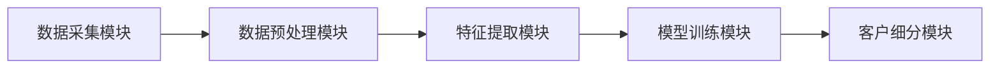

# 企业估值中的AI驱动的自动化客户细分平台评估

> 关键词：企业估值、AI驱动、自动化客户细分平台、评估方法、数据驱动决策

> 摘要：本文聚焦于企业估值中AI驱动的自动化客户细分平台的评估。首先介绍了研究的背景、目的、预期读者和文档结构，对相关术语进行了明确。接着阐述了核心概念与联系，包括AI驱动、自动化客户细分平台的原理和架构，并给出了Mermaid流程图。详细讲解了核心算法原理及具体操作步骤，结合Python代码进行说明。探讨了相关数学模型和公式，并举例说明。通过项目实战，展示了开发环境搭建、源代码实现与解读。分析了该平台的实际应用场景，推荐了学习资源、开发工具框架和相关论文著作。最后总结了未来发展趋势与挑战，提供了常见问题解答和扩展阅读参考资料，旨在为企业在评估此类平台时提供全面、深入的技术指导。

## 1. 背景介绍 
### 1.1 目的和范围
在当今竞争激烈的商业环境中，企业需要深入了解客户需求以制定精准的营销策略。AI驱动的自动化客户细分平台能够利用先进的人工智能技术对客户进行细致分类，帮助企业更好地满足不同客户群体的需求。本文章的目的是为企业在进行估值时，提供一套全面、科学的方法来评估AI驱动的自动化客户细分平台。范围涵盖了该平台的核心概念、算法原理、数学模型、实际应用案例以及相关的工具和资源等方面。

### 1.2 预期读者
本文预期读者主要包括企业的高层管理人员、财务分析师、市场营销人员、技术研发人员以及对企业估值和AI技术应用感兴趣的专业人士。对于企业高层管理人员，有助于其在战略决策中准确评估该平台的价值；财务分析师可借助本文的方法进行财务估值；市场营销人员能了解如何利用该平台提升营销效果；技术研发人员可从中获取技术实现的思路；而对该领域感兴趣的专业人士则能全面了解相关知识。

### 1.3 文档结构概述
本文将按照以下结构展开：首先介绍核心概念与联系，明确AI驱动的自动化客户细分平台的基本原理和架构；接着阐述核心算法原理及具体操作步骤，通过Python代码详细说明；然后讲解相关的数学模型和公式，并举例说明；进行项目实战，展示开发环境搭建、源代码实现与解读；分析实际应用场景；推荐相关的学习资源、开发工具框架和论文著作；最后总结未来发展趋势与挑战，提供常见问题解答和扩展阅读参考资料。

### 1.4 术语表
#### 1.4.1 核心术语定义
- **企业估值**：指对企业的整体价值进行评估，考虑企业的资产、盈利能力、市场地位等多种因素，以确定企业在市场中的合理价值。
- **AI驱动**：利用人工智能技术，如机器学习、深度学习等，自动处理和分析数据，实现智能化决策和操作。
- **自动化客户细分平台**：借助计算机技术和算法，自动将客户划分为不同的群体，每个群体具有相似的特征和需求。

#### 1.4.2 相关概念解释
- **机器学习**：是人工智能的一个分支，通过让计算机从数据中学习模式和规律，从而进行预测和决策。常见的机器学习算法包括决策树、神经网络、支持向量机等。
- **深度学习**：是机器学习的一种，基于人工神经网络，通过构建多层神经网络模型，自动学习数据的深层次特征。深度学习在图像识别、语音识别等领域取得了显著的成果。
- **客户细分**：根据客户的特征、行为、需求等因素，将客户划分为不同的群体，以便企业针对不同群体制定个性化的营销策略。

#### 1.4.3 缩略词列表
- **AI**：Artificial Intelligence，人工智能
- **ML**：Machine Learning，机器学习
- **DL**：Deep Learning，深度学习
- **CRM**：Customer Relationship Management，客户关系管理

## 2. 核心概念与联系 

### 核心概念原理
AI驱动的自动化客户细分平台的核心原理是利用人工智能技术对客户数据进行分析和挖掘，从而发现客户之间的相似性和差异性，将客户划分为不同的群体。该平台主要包括数据采集、数据预处理、特征提取、模型训练和客户细分等环节。

数据采集是获取客户相关数据的过程，包括客户的基本信息、购买行为、浏览记录等。数据预处理是对采集到的数据进行清洗、转换和归一化等操作，以提高数据的质量。特征提取是从预处理后的数据中提取出能够反映客户特征的变量。模型训练是利用机器学习或深度学习算法，根据提取的特征对客户进行分类。客户细分是将训练好的模型应用到新的客户数据上，将客户划分为不同的群体。

### 架构的文本示意图
```plaintext
+----------------------+
|  数据采集模块        |
|  (客户基本信息、     |
|   购买行为、         |
|   浏览记录等)        |
+----------------------+
           |
           v
+----------------------+
|  数据预处理模块      |
|  (数据清洗、         |
|   转换、归一化等)    |
+----------------------+
           |
           v
+----------------------+
|  特征提取模块        |
|  (提取反映客户       |
|   特征的变量)        |
+----------------------+
           |
           v
+----------------------+
|  模型训练模块        |
|  (机器学习/深度学习  |
|   算法训练)          |
+----------------------+
           |
           v
+----------------------+
|  客户细分模块        |
|  (对新客户数据       |
|   进行细分)          |
+----------------------+
```

### Mermaid流程图


## 3. 核心算法原理 & 具体操作步骤 

### 核心算法原理
在AI驱动的自动化客户细分平台中，常用的算法包括K-Means聚类算法、层次聚类算法和DBSCAN算法等。这里以K-Means聚类算法为例进行详细讲解。

K-Means聚类算法是一种无监督学习算法，其基本思想是将数据集中的样本划分为K个不同的簇，使得同一簇内的样本相似度较高，不同簇之间的样本相似度较低。算法的核心是通过迭代更新簇的中心点，使得样本到其所属簇中心点的距离之和最小。

### 具体操作步骤
1. **初始化**：随机选择K个样本作为初始的簇中心点。
2. **分配样本**：计算每个样本到各个簇中心点的距离，将样本分配到距离最近的簇中。
3. **更新中心点**：计算每个簇内所有样本的均值，将该均值作为新的簇中心点。
4. **重复步骤2和3**：直到簇中心点不再发生变化或达到最大迭代次数。

### Python源代码实现
```python
import numpy as np
from sklearn.cluster import KMeans
import matplotlib.pyplot as plt

# 生成示例数据
np.random.seed(0)
X = np.vstack([
    np.random.normal(loc=[0, 0], scale=1, size=(100, 2)),
    np.random.normal(loc=[5, 5], scale=1, size=(100, 2)),
    np.random.normal(loc=[10, 0], scale=1, size=(100, 2))
])

# 初始化K-Means模型
kmeans = KMeans(n_clusters=3, random_state=0)

# 训练模型
kmeans.fit(X)

# 获取聚类标签
labels = kmeans.labels_

# 获取簇中心点
centroids = kmeans.cluster_centers_

# 可视化结果
plt.scatter(X[:, 0], X[:, 1], c=labels, cmap='viridis')
plt.scatter(centroids[:, 0], centroids[:, 1], marker='X', s=200, c='red')
plt.title('K-Means Clustering')
plt.xlabel('Feature 1')
plt.ylabel('Feature 2')
plt.show()
```

### 代码解释
1. **数据生成**：使用`np.random.normal`函数生成三组不同均值的二维正态分布数据，作为示例数据。
2. **模型初始化**：使用`KMeans`类初始化一个K-Means模型，设置簇的数量为3。
3. **模型训练**：使用`fit`方法对模型进行训练，将示例数据作为输入。
4. **获取聚类结果**：使用`labels_`属性获取每个样本的聚类标签，使用`cluster_centers_`属性获取簇的中心点。
5. **可视化结果**：使用`matplotlib`库将聚类结果可视化，不同颜色的点表示不同的簇，红色的叉表示簇的中心点。

## 4. 数学模型和公式 & 详细讲解 & 举例说明 

### 数学模型和公式
在K-Means聚类算法中，目标是最小化样本到其所属簇中心点的距离之和，即：

$$
J = \sum_{i=1}^{n} \sum_{j=1}^{K} r_{ij} \left\lVert x_i - \mu_j \right\rVert^2
$$

其中，$n$ 是样本的数量，$K$ 是簇的数量，$x_i$ 是第 $i$ 个样本，$\mu_j$ 是第 $j$ 个簇的中心点，$r_{ij}$ 是一个指示变量，当样本 $x_i$ 属于簇 $j$ 时，$r_{ij} = 1$，否则 $r_{ij} = 0$。

### 详细讲解
目标函数 $J$ 表示所有样本到其所属簇中心点的欧氏距离的平方和。算法的迭代过程就是不断更新簇中心点 $\mu_j$ 和指示变量 $r_{ij}$，使得目标函数 $J$ 最小化。

在每次迭代中，首先根据当前的簇中心点 $\mu_j$ 计算每个样本到各个簇中心点的距离，将样本分配到距离最近的簇中，更新指示变量 $r_{ij}$。然后，根据新的指示变量 $r_{ij}$ 计算每个簇内所有样本的均值，将该均值作为新的簇中心点 $\mu_j$。

### 举例说明
假设我们有一个包含5个样本的数据集 $X = \{x_1, x_2, x_3, x_4, x_5\}$，每个样本是一个二维向量。我们要将这些样本划分为2个簇。

首先，随机选择两个样本作为初始的簇中心点 $\mu_1$ 和 $\mu_2$。然后，计算每个样本到 $\mu_1$ 和 $\mu_2$ 的距离，将样本分配到距离最近的簇中。假设 $x_1$、$x_2$ 距离 $\mu_1$ 最近，$x_3$、$x_4$、$x_5$ 距离 $\mu_2$ 最近，则 $r_{11} = r_{21} = 1$，$r_{12} = r_{22} = 0$，$r_{31} = r_{41} = r_{51} = 0$，$r_{32} = r_{42} = r_{52} = 1$。

接着，计算新的簇中心点。对于簇1，新的中心点 $\mu_1$ 是 $x_1$ 和 $x_2$ 的均值；对于簇2，新的中心点 $\mu_2$ 是 $x_3$、$x_4$ 和 $x_5$ 的均值。

重复上述过程，直到簇中心点不再发生变化或达到最大迭代次数。

## 5. 项目实战：代码实际案例和详细解释说明 

### 5.1  开发环境搭建
#### 操作系统
可以选择Windows、Linux或macOS等主流操作系统。这里以Ubuntu 20.04为例进行说明。

#### Python环境
安装Python 3.7及以上版本。可以使用以下命令检查Python版本：
```bash
python3 --version
```
如果未安装Python，可以使用以下命令进行安装：
```bash
sudo apt update
sudo apt install python3 python3-pip
```

#### 安装必要的库
使用`pip`安装必要的库，包括`numpy`、`pandas`、`scikit-learn`、`matplotlib`等：
```bash
pip3 install numpy pandas scikit-learn matplotlib
```

### 5.2  源代码详细实现和代码解读
以下是一个完整的项目实战代码示例，用于对客户数据进行细分：

```python
import pandas as pd
from sklearn.cluster import KMeans
import matplotlib.pyplot as plt

# 读取客户数据
data = pd.read_csv('customer_data.csv')

# 选择特征
features = data[['age', 'purchase_frequency', 'total_spent']]

# 数据预处理：归一化
from sklearn.preprocessing import StandardScaler
scaler = StandardScaler()
scaled_features = scaler.fit_transform(features)

# 初始化K-Means模型
kmeans = KMeans(n_clusters=4, random_state=0)

# 训练模型
kmeans.fit(scaled_features)

# 获取聚类标签
labels = kmeans.labels_

# 将聚类标签添加到原始数据中
data['cluster'] = labels

# 可视化聚类结果
plt.scatter(data['age'], data['total_spent'], c=data['cluster'], cmap='viridis')
plt.title('Customer Segmentation')
plt.xlabel('Age')
plt.ylabel('Total Spent')
plt.show()

# 分析每个簇的特征
cluster_analysis = data.groupby('cluster').mean()
print(cluster_analysis)
```

### 代码解读
1. **数据读取**：使用`pandas`库的`read_csv`函数读取客户数据文件`customer_data.csv`。
2. **特征选择**：选择`age`、`purchase_frequency`和`total_spent`作为特征。
3. **数据预处理**：使用`StandardScaler`对特征数据进行归一化处理，确保不同特征具有相同的尺度。
4. **模型初始化**：使用`KMeans`类初始化一个K-Means模型，设置簇的数量为4。
5. **模型训练**：使用`fit`方法对模型进行训练，将归一化后的特征数据作为输入。
6. **获取聚类标签**：使用`labels_`属性获取每个样本的聚类标签。
7. **添加聚类标签**：将聚类标签添加到原始数据中，方便后续分析。
8. **可视化聚类结果**：使用`matplotlib`库将聚类结果可视化，不同颜色的点表示不同的簇。
9. **簇特征分析**：使用`groupby`方法按簇对数据进行分组，计算每个簇的特征均值。

### 5.3  代码解读与分析
通过上述代码，我们可以将客户数据划分为不同的簇，每个簇代表一个客户群体。可视化结果可以直观地展示不同客户群体的分布情况。簇特征分析可以帮助我们了解每个客户群体的特征，例如年龄、购买频率和总消费金额的均值。

根据簇特征分析的结果，企业可以针对不同的客户群体制定个性化的营销策略。例如，对于年龄较大、总消费金额较高的客户群体，可以推出高端产品和服务；对于年龄较小、购买频率较高的客户群体，可以推出会员制度和促销活动。

## 6. 实际应用场景 
### 市场营销
AI驱动的自动化客户细分平台可以帮助企业更好地了解客户需求，制定精准的营销策略。通过将客户划分为不同的群体，企业可以针对每个群体的特点和需求，推出个性化的产品和服务，提高营销效果和客户满意度。

例如，一家电商企业可以根据客户的购买行为、浏览记录等数据，将客户划分为高价值客户、潜在客户、流失客户等群体。对于高价值客户，可以提供专属的优惠活动和优质的服务；对于潜在客户，可以通过精准的广告投放和推荐系统，引导其购买产品；对于流失客户，可以采取挽回措施，如发送优惠券和个性化的邮件。

### 客户服务
该平台可以帮助企业提供更加个性化的客户服务。通过了解客户的特征和需求，企业可以为不同的客户群体提供定制化的服务，提高客户服务的质量和效率。

例如，一家银行可以根据客户的资产状况、信用记录等数据，将客户划分为不同的等级。对于高等级客户，可以提供专属的客户经理和优先的服务通道；对于低等级客户，可以提供基础的服务和金融知识普及。

### 产品研发
AI驱动的自动化客户细分平台可以为企业的产品研发提供有价值的参考。通过分析不同客户群体的需求和反馈，企业可以了解市场趋势和客户痛点，研发出符合市场需求的产品。

例如，一家手机厂商可以根据客户的使用习惯、偏好等数据，将客户划分为游戏玩家、摄影爱好者、商务人士等群体。针对游戏玩家群体，可以研发具有高性能处理器和大容量电池的手机；针对摄影爱好者群体，可以研发具有高像素摄像头和专业摄影功能的手机。

## 7. 工具和资源推荐
### 7.1 学习资源推荐
#### 7.1.1 书籍推荐
- 《Python机器学习》：本书详细介绍了Python在机器学习领域的应用，包括数据预处理、模型训练、评估和优化等方面的知识。
- 《深度学习》：由深度学习领域的三位先驱Ian Goodfellow、Yoshua Bengio和Aaron Courville撰写，是深度学习领域的经典教材。
- 《数据挖掘：概念与技术》：全面介绍了数据挖掘的基本概念、算法和应用，是数据挖掘领域的权威著作。

#### 7.1.2 在线课程
- Coursera上的“机器学习”课程：由斯坦福大学教授Andrew Ng主讲，是机器学习领域的经典课程，涵盖了机器学习的基本概念、算法和应用。
- edX上的“深度学习”课程：由伯克利大学教授Rahul Patel主讲，深入介绍了深度学习的原理和应用。
- 中国大学MOOC上的“数据挖掘”课程：由中国科学院大学教授于剑主讲，系统介绍了数据挖掘的理论和实践。

#### 7.1.3 技术博客和网站
- Medium：是一个技术博客平台，上面有很多关于人工智能、机器学习和数据挖掘的优质文章。
- Towards Data Science：专注于数据科学和机器学习领域的技术博客，提供了很多实用的教程和案例。
- Kaggle：是一个数据科学竞赛平台，上面有很多数据集和开源代码，可以帮助你学习和实践数据挖掘和机器学习。

### 7.2 开发工具框架推荐
#### 7.2.1 IDE和编辑器
- PyCharm：是一款专门为Python开发设计的集成开发环境（IDE），具有代码自动补全、调试、版本控制等功能。
- Jupyter Notebook：是一个交互式的开发环境，适合进行数据探索和模型实验。
- Visual Studio Code：是一款轻量级的代码编辑器，支持多种编程语言和插件，具有丰富的功能和扩展。

#### 7.2.2 调试和性能分析工具
- pdb：是Python自带的调试器，可以帮助你定位和解决代码中的问题。
- cProfile：是Python的性能分析工具，可以帮助你找出代码中的性能瓶颈。
- TensorBoard：是TensorFlow的可视化工具，可以帮助你可视化模型的训练过程和性能指标。

#### 7.2.3 相关框架和库
- scikit-learn：是一个简单易用的机器学习库，提供了丰富的机器学习算法和工具，如分类、回归、聚类等。
- TensorFlow：是一个开源的深度学习框架，由Google开发，广泛应用于图像识别、语音识别、自然语言处理等领域。
- PyTorch：是一个基于Python的深度学习框架，具有动态图和易于调试的特点，受到了很多研究者和开发者的喜爱。

### 7.3 相关论文著作推荐
#### 7.3.1 经典论文
- “A Survey of Clustering Algorithms”：对聚类算法进行了全面的综述，介绍了各种聚类算法的原理、优缺点和应用场景。
- “Deep Learning”：由Yoshua Bengio、Ian Goodfellow和Aaron Courville撰写的深度学习综述论文，系统介绍了深度学习的发展历程、原理和应用。
- “The Elements of Statistical Learning”：是统计学习领域的经典著作，介绍了统计学习的基本概念、算法和理论。

#### 7.3.2 最新研究成果
- 在顶级学术会议如NeurIPS、ICML、CVPR等上发表的关于人工智能、机器学习和数据挖掘的最新研究成果。
- 在顶级学术期刊如Journal of Machine Learning Research、Artificial Intelligence等上发表的相关论文。

#### 7.3.3 应用案例分析
- 各大科技公司的技术博客和白皮书，如Google、Facebook、Microsoft等，分享了他们在人工智能和机器学习领域的应用案例和实践经验。
- 行业报告和研究机构的分析报告，如Gartner、IDC等，提供了关于AI驱动的自动化客户细分平台在不同行业的应用案例和市场趋势。

## 8. 总结：未来发展趋势与挑战
### 未来发展趋势
- **与其他技术的融合**：AI驱动的自动化客户细分平台将与物联网、区块链、云计算等技术深度融合，实现更全面、更精准的客户数据采集和分析。例如，通过物联网设备可以实时获取客户的行为数据，结合区块链技术可以保证数据的安全性和可信度。
- **智能化程度不断提高**：随着人工智能技术的不断发展，平台的智能化程度将不断提高。例如，平台可以自动识别新的客户群体和需求，自动调整细分策略，实现更智能化的决策。
- **应用领域不断拓展**：该平台将在更多的领域得到应用，如医疗、教育、金融等。例如，在医疗领域，平台可以帮助医院对患者进行细分，提供个性化的医疗服务；在教育领域，平台可以帮助学校对学生进行细分，制定个性化的教学方案。

### 挑战
- **数据隐私和安全问题**：在客户细分过程中，需要收集和处理大量的客户数据，这涉及到数据隐私和安全问题。企业需要采取有效的措施，保护客户数据的安全和隐私，避免数据泄露和滥用。
- **算法的可解释性**：一些复杂的人工智能算法，如深度学习算法，具有较高的准确性，但缺乏可解释性。在企业估值和决策过程中，需要对算法的结果进行解释和理解，因此提高算法的可解释性是一个重要的挑战。
- **人才短缺**：AI驱动的自动化客户细分平台需要具备人工智能、机器学习、数据分析等多方面知识的专业人才。目前，这类人才短缺，企业需要加大人才培养和引进的力度。

## 9. 附录：常见问题与解答
### 问题1：如何选择合适的聚类算法？
解答：选择合适的聚类算法需要考虑数据的特点、聚类的目的和性能要求等因素。例如，如果数据具有明显的簇结构，且簇的形状近似于球形，可以选择K-Means聚类算法；如果数据的簇结构不明显，且存在噪声点，可以选择DBSCAN算法。

### 问题2：如何确定簇的数量？
解答：确定簇的数量是一个比较困难的问题，常见的方法有手肘法、轮廓系数法等。手肘法是通过绘制不同簇数量下的目标函数值（如K-Means算法中的惯性值）与簇数量的关系曲线，选择曲线的拐点作为合适的簇数量。轮廓系数法是通过计算每个样本的轮廓系数，选择轮廓系数最大的簇数量。

### 问题3：如何评估聚类结果的质量？
解答：评估聚类结果的质量可以使用多种指标，如轮廓系数、Calinski-Harabasz指数、Davies-Bouldin指数等。轮廓系数衡量了样本与其所属簇的紧密程度和与其他簇的分离程度，值越接近1表示聚类效果越好。Calinski-Harabasz指数和Davies-Bouldin指数也可以用于评估聚类结果的质量，值越大表示聚类效果越好。

## 10. 扩展阅读 & 参考资料
### 扩展阅读
- 《人工智能：现代方法》：全面介绍了人工智能的基本概念、算法和应用，是人工智能领域的经典教材。
- 《大数据时代》：探讨了大数据对社会、经济和生活的影响，以及如何利用大数据进行决策和创新。
- 《算法之美：指导工作与生活的算法》：介绍了算法在日常生活中的应用，帮助读者理解算法的原理和价值。

### 参考资料
- [scikit-learn官方文档](https://scikit-learn.org/stable/)
- [TensorFlow官方文档](https://www.tensorflow.org/)
- [PyTorch官方文档](https://pytorch.org/)
- [Kaggle数据集](https://www.kaggle.com/datasets)