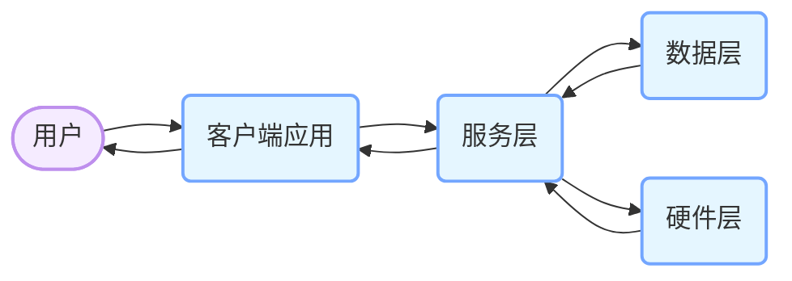

# 企业估值中的AR/VR协作办公平台评估

> 关键词：企业估值、AR/VR、协作办公平台、评估方法、市场趋势

> 摘要：本文聚焦于企业估值中AR/VR协作办公平台的评估。随着数字化办公的加速发展，AR/VR技术在协作办公领域的应用日益广泛，准确评估此类平台的价值对于企业的投资决策、战略规划等具有重要意义。文章将深入探讨AR/VR协作办公平台的核心概念、相关算法原理、数学模型，通过项目实战案例详细分析其实现过程，并介绍其实际应用场景、相关工具资源，最后对未来发展趋势与挑战进行总结，旨在为企业估值中对AR/VR协作办公平台的评估提供全面、深入的参考。

## 1. 背景介绍 
### 1.1 目的和范围
本文章的目的在于为企业估值过程中对AR/VR协作办公平台的评估提供一套全面、系统且具有可操作性的方法和思路。范围涵盖了AR/VR协作办公平台的基本概念、技术原理、市场应用、价值评估的各个环节，不仅包括理论层面的探讨，还涉及实际项目中的应用案例分析，以及对未来发展趋势的展望。通过对这些内容的研究，帮助企业更好地理解AR/VR协作办公平台的价值，从而做出合理的投资、战略决策等。

### 1.2 预期读者
本文预期读者主要包括企业的管理人员、投资机构的专业人士、技术研发人员以及对AR/VR协作办公领域感兴趣的学者和研究人员。企业管理人员可以借助本文的评估方法来了解自身或竞争对手的AR/VR协作办公平台的价值，为企业的战略规划提供依据；投资机构人员可以通过本文的分析，评估投资此类平台的潜在价值和风险；技术研发人员可以从文中了解到AR/VR协作办公平台的技术原理和发展趋势，为产品的研发和优化提供参考；学者和研究人员则可以将本文作为进一步深入研究的基础资料。

### 1.3 文档结构概述
本文首先对AR/VR协作办公平台评估的背景进行介绍，包括目的、预期读者和文档结构等内容。接着阐述核心概念与联系，详细解释AR/VR、协作办公平台等相关概念，并通过文本示意图和Mermaid流程图展示其架构和联系。然后介绍核心算法原理和具体操作步骤，使用Python源代码进行详细阐述。随后讲解数学模型和公式，并通过举例说明其应用。在项目实战部分，详细介绍开发环境搭建、源代码实现和代码解读。之后分析实际应用场景，为评估平台的价值提供实际依据。再推荐相关的工具和资源，包括学习资源、开发工具框架和论文著作等。最后总结未来发展趋势与挑战，并提供常见问题与解答以及扩展阅读和参考资料。

### 1.4 术语表
#### 1.4.1 核心术语定义
- **AR（Augmented Reality）**：增强现实，是一种将虚拟信息与真实世界巧妙融合的技术，通过计算机技术将虚拟的图像、声音、文字等信息叠加到现实场景中，从而增强用户对现实世界的感知和交互体验。
- **VR（Virtual Reality）**：虚拟现实，是一种利用计算机生成的模拟环境，通过头戴式显示器、手柄等设备，让用户沉浸在一个完全虚拟的三维空间中，获得身临其境的体验。
- **协作办公平台**：是一种支持多人在不同地点、不同时间进行协同工作的软件或系统，通过提供文档共享、实时通信、任务管理等功能，提高团队的工作效率和协作效果。
- **企业估值**：是指对企业的整体价值进行评估，通常考虑企业的资产、负债、盈利能力、市场前景等多种因素，以确定企业在市场中的合理价值。

#### 1.4.2 相关概念解释
- **混合现实（MR）**：是AR和VR的进一步融合，它不仅能够将虚拟信息叠加到现实世界中，还能让虚拟物体与现实环境进行交互和融合，创造出更加逼真和自然的交互体验。
- **实时渲染**：是指在计算机中实时生成图像的过程，通过对三维模型、光照、材质等信息的计算和处理，快速生成高质量的图像，以满足AR/VR应用中对实时性和交互性的要求。
- **云办公**：是一种基于云计算技术的办公模式，通过将办公软件和数据存储在云端服务器上，用户可以通过互联网随时随地访问和使用这些资源，实现远程办公和协作。

#### 1.4.3 缩略词列表
- **AR**：Augmented Reality
- **VR**：Virtual Reality
- **MR**：Mixed Reality
- **API**：Application Programming Interface（应用程序编程接口）
- **SDK**：Software Development Kit（软件开发工具包）

## 2. 核心概念与联系 
### 核心概念原理
#### AR原理
AR技术的核心原理是通过摄像头等设备获取现实场景的图像或视频，然后利用计算机视觉、图像处理等技术对这些数据进行分析和处理，识别出场景中的物体和特征。接着，根据用户的需求和交互指令，将虚拟信息（如三维模型、动画、文字等）与现实场景进行精确的融合和叠加，最终通过显示器等设备呈现给用户。例如，在一款AR导航应用中，摄像头拍摄道路场景，系统识别出道路、建筑等特征，然后将导航箭头、目的地信息等虚拟元素叠加在相应的位置上，帮助用户更直观地了解导航信息。

#### VR原理
VR技术主要基于计算机图形学、传感器技术和显示技术。首先，利用计算机图形学创建一个虚拟的三维场景，包括地形、建筑、物体等元素，并为这些元素赋予材质、纹理、光照等属性，以增强场景的真实感。然后，通过头戴式显示器（HMD）将虚拟场景呈现给用户，同时利用加速度计、陀螺仪等传感器实时跟踪用户的头部运动和身体姿态，根据用户的动作实时更新虚拟场景的视角，让用户产生身临其境的感觉。例如，在一款VR游戏中，用户佩戴HMD后，可以通过头部转动来观察虚拟世界的不同方向，仿佛自己置身于游戏场景之中。

#### 协作办公平台原理
协作办公平台通常基于网络通信技术和数据库技术构建。它提供了一个集中的工作空间，用户可以通过浏览器、客户端软件等方式访问该平台。平台通过网络通信协议实现用户之间的实时通信和数据传输，例如即时通讯、视频会议等功能。同时，平台利用数据库技术存储和管理各种办公数据，如文档、任务、日程等，确保数据的安全性和一致性。用户可以在平台上进行文档的在线编辑、共享和版本管理，分配和跟踪任务进度，安排和参加会议等，实现团队成员之间的高效协作。

### 架构的文本示意图
AR/VR协作办公平台的架构可以分为以下几个层次：

- **硬件层**：包括AR/VR设备（如头戴式显示器、手柄、摄像头等）、服务器、网络设备等。这些硬件设备为平台的运行提供了物理基础。
- **数据层**：存储和管理各种办公数据，如用户信息、文档、任务、会议记录等。数据层可以采用关系型数据库（如MySQL、Oracle）或非关系型数据库（如MongoDB、Redis）来实现。
- **服务层**：提供各种服务，如身份认证服务、文件存储服务、实时通信服务、视频会议服务等。这些服务通过API的形式对外提供接口，供客户端调用。
- **应用层**：包括各种客户端应用程序，如Web应用、桌面应用、移动应用等。用户通过这些应用程序与平台进行交互，完成各种办公任务。
- **用户层**：使用平台的人员，包括企业员工、合作伙伴、客户等。

### Mermaid流程图


## 3. 核心算法原理 & 具体操作步骤 
### 计算机视觉算法在AR中的应用
在AR技术中，计算机视觉算法起着关键作用，其中特征提取和匹配算法是核心之一。以下是使用Python和OpenCV库实现特征提取和匹配的示例代码：

```python
import cv2
import numpy as np

# 读取图像
img1 = cv2.imread('image1.jpg', 0)
img2 = cv2.imread('image2.jpg', 0)

# 创建SIFT对象
sift = cv2.SIFT_create()

# 检测关键点和计算描述符
kp1, des1 = sift.detectAndCompute(img1, None)
kp2, des2 = sift.detectAndCompute(img2, None)

# 创建BFMatcher对象
bf = cv2.BFMatcher()

# 匹配描述符
matches = bf.knnMatch(des1, des2, k=2)

# 应用比率测试
good_matches = []
for m, n in matches:
    if m.distance < 0.75 * n.distance:
        good_matches.append(m)

# 绘制匹配结果
img3 = cv2.drawMatches(img1, kp1, img2, kp2, good_matches, None, flags=cv2.DrawMatchesFlags_NOT_DRAW_SINGLE_POINTS)

# 显示结果
cv2.imshow('Matches', img3)
cv2.waitKey(0)
cv2.destroyAllWindows()
```

### 具体操作步骤
1. **图像读取**：使用`cv2.imread`函数读取两张图像，并将其转换为灰度图像。
2. **特征提取**：创建`SIFT`对象，使用`detectAndCompute`方法检测图像中的关键点并计算描述符。
3. **特征匹配**：创建`BFMatcher`对象，使用`knnMatch`方法进行特征匹配，得到两组匹配结果。
4. **比率测试**：应用比率测试，筛选出可靠的匹配点。
5. **绘制匹配结果**：使用`cv2.drawMatches`函数绘制匹配结果，并显示图像。

### 姿态估计算法在VR中的应用
在VR中，姿态估计算法用于实时跟踪用户的头部运动和身体姿态。以下是一个简单的基于陀螺仪数据的姿态估计示例代码：

```python
import numpy as np

# 初始化陀螺仪数据
gyro_data = np.array([0.1, 0.2, 0.3])  # 假设的陀螺仪数据

# 初始化姿态矩阵
orientation_matrix = np.eye(3)

# 时间步长
dt = 0.1

# 计算角速度矩阵
omega = np.array([
    [0, -gyro_data[2], gyro_data[1]],
    [gyro_data[2], 0, -gyro_data[0]],
    [-gyro_data[1], gyro_data[0], 0]
])

# 更新姿态矩阵
orientation_matrix += np.dot(omega, orientation_matrix) * dt

# 归一化姿态矩阵
orientation_matrix, _ = np.linalg.qr(orientation_matrix)

print("更新后的姿态矩阵：")
print(orientation_matrix)
```

### 具体操作步骤
1. **初始化数据**：初始化陀螺仪数据和姿态矩阵。
2. **计算角速度矩阵**：根据陀螺仪数据计算角速度矩阵。
3. **更新姿态矩阵**：使用欧拉法更新姿态矩阵。
4. **归一化姿态矩阵**：对更新后的姿态矩阵进行归一化处理，确保其为正交矩阵。

## 4. 数学模型和公式 & 详细讲解 & 举例说明 
### 特征提取和匹配的数学模型
在特征提取和匹配中，常用的特征描述符如SIFT（尺度不变特征变换）基于局部图像特征的梯度信息。SIFT描述符的计算步骤如下：

1. **尺度空间极值检测**：通过高斯差分函数（DoG）在不同尺度空间中检测极值点，公式为：
$$
D(x, y, \sigma) = (G(x, y, k\sigma) - G(x, y, \sigma)) * I(x, y)
$$
其中，$G(x, y, \sigma)$ 是高斯函数，$I(x, y)$ 是输入图像，$k$ 是尺度因子。

2. **关键点定位**：通过拟合三维二次函数来精确确定关键点的位置和尺度，消除低对比度和边缘响应的关键点。

3. **方向分配**：为每个关键点分配一个或多个方向，基于关键点邻域内的梯度方向直方图。

4. **特征描述符生成**：在关键点周围的邻域内计算梯度方向直方图，生成128维的特征描述符。

### 举例说明
假设我们有一张图像，通过SIFT算法提取特征点。首先，在不同尺度空间中应用DoG函数，得到一系列的差分图像。然后，在这些差分图像中寻找极值点，这些极值点就是潜在的关键点。接着，对这些关键点进行精确定位和方向分配，最后生成特征描述符。通过比较不同图像的特征描述符，可以实现图像的匹配。

### 姿态估计的数学模型
在基于陀螺仪的姿态估计中，常用的数学模型是欧拉角和四元数。欧拉角表示物体在三维空间中的旋转，包括绕X轴的俯仰角（$\theta$）、绕Y轴的偏航角（$\psi$）和绕Z轴的滚转角（$\phi$）。四元数是一种更高效的表示旋转的方式，由一个实部和三个虚部组成，记为 $q = w + xi + yj + zk$。

陀螺仪测量的是角速度 $\omega = [\omega_x, \omega_y, \omega_z]^T$，姿态更新的公式可以表示为：
$$
\dot{q} = \frac{1}{2} q \otimes \omega_q
$$
其中，$\dot{q}$ 是四元数的导数，$\otimes$ 是四元数乘法，$\omega_q = [0, \omega_x, \omega_y, \omega_z]^T$。

### 举例说明
假设初始姿态四元数为 $q_0 = [1, 0, 0, 0]$，陀螺仪测量的角速度为 $\omega = [0.1, 0.2, 0.3]$，时间步长为 $dt = 0.1$。首先，将角速度转换为四元数 $\omega_q = [0, 0.1, 0.2, 0.3]$，然后根据上述公式计算四元数的导数 $\dot{q}$。接着，使用欧拉法更新四元数：
$$
q_{t+1} = q_t + \dot{q} \cdot dt
$$
最后，对更新后的四元数进行归一化处理，得到新的姿态四元数。

## 5. 项目实战：代码实际案例和详细解释说明 
### 5.1  开发环境搭建
#### 硬件环境
- **AR/VR设备**：选择一款适合开发的AR/VR设备，如Oculus Rift、HTC Vive、Microsoft HoloLens等。
- **计算机**：需要一台性能较强的计算机，满足AR/VR开发的硬件要求，如至少配备NVIDIA GTX 1060及以上显卡、Intel Core i5及以上处理器、16GB及以上内存。

#### 软件环境
- **操作系统**：推荐使用Windows 10或macOS。
- **开发工具**：选择适合的开发工具，如Unity 3D、Unreal Engine等。这些工具提供了丰富的功能和插件，方便进行AR/VR应用开发。
- **编程语言**：主要使用C#、C++等编程语言。
- **相关SDK**：根据选择的AR/VR设备，安装相应的SDK，如Oculus SDK、HoloLens SDK等。

### 5.2  源代码详细实现和代码解读
以下是一个使用Unity 3D和C#实现的简单AR协作办公场景的示例代码：

```csharp
using UnityEngine;
using UnityEngine.XR.ARFoundation;
using UnityEngine.XR.ARSubsystems;
using System.Collections.Generic;

public class ARCollaborativeOffice : MonoBehaviour
{
    public ARRaycastManager raycastManager;
    public GameObject officeObject;

    private List<ARRaycastHit> hits = new List<ARRaycastHit>();

    void Update()
    {
        if (Input.touchCount > 0)
        {
            Touch touch = Input.GetTouch(0);

            if (touch.phase == TouchPhase.Began)
            {
                if (raycastManager.Raycast(touch.position, hits, TrackableType.PlaneWithinPolygon))
                {
                    Pose hitPose = hits[0].pose;
                    Instantiate(officeObject, hitPose.position, hitPose.rotation);
                }
            }
        }
    }
}
```

### 代码解读
1. **引用命名空间**：引入Unity相关的命名空间，包括`UnityEngine`、`UnityEngine.XR.ARFoundation`和`UnityEngine.XR.ARSubsystems`。
2. **定义公共变量**：定义一个`ARRaycastManager`类型的变量`raycastManager`，用于进行射线检测；定义一个`GameObject`类型的变量`officeObject`，表示要放置的办公对象。
3. **定义私有变量**：定义一个`List<ARRaycastHit>`类型的变量`hits`，用于存储射线检测的结果。
4. **Update方法**：在每一帧中检查是否有触摸事件。如果有触摸事件且触摸状态为开始，则进行射线检测。如果射线检测到平面，则获取检测点的姿态信息，并在该位置实例化办公对象。

### 5.3  代码解读与分析
#### 功能分析
这段代码实现了在AR场景中通过触摸屏幕放置办公对象的功能。用户可以在检测到的平面上放置办公对象，模拟协作办公的场景。

#### 技术要点分析
- **射线检测**：使用`ARRaycastManager`的`Raycast`方法进行射线检测，判断是否命中平面。
- **实例化对象**：使用`Instantiate`方法在检测到的平面上实例化办公对象。
- **触摸事件处理**：通过`Input.touchCount`和`Input.GetTouch`方法获取触摸事件，并根据触摸状态进行相应的处理。

## 6. 实际应用场景 
### 远程协作会议
AR/VR协作办公平台可以为远程协作会议提供更加沉浸式的体验。与会人员可以通过AR/VR设备进入一个虚拟的会议室，仿佛坐在同一个房间里进行面对面的交流。他们可以看到彼此的虚拟形象，进行手势、表情等互动，还可以共享文档、演示文稿等资料，通过虚拟白板进行实时讨论和标注，大大提高了远程会议的效率和效果。

### 产品设计与研发
在产品设计和研发过程中，团队成员可以使用AR/VR协作办公平台进行协同设计。设计师可以将三维模型导入到平台中，通过AR/VR设备进行可视化展示和交互。不同地点的团队成员可以同时对模型进行查看、修改和讨论，实时反馈意见和建议，加快产品的研发进度，提高设计质量。

### 培训与教育
AR/VR协作办公平台可以用于企业内部的培训和教育。培训师可以创建虚拟的培训场景，如模拟工作环境、操作流程等，员工可以通过AR/VR设备进入这些场景进行沉浸式学习。培训过程中，员工可以与虚拟角色进行互动，进行实际操作练习，培训师可以实时监控员工的学习情况并给予指导，提高培训的效果和效率。

### 项目管理
在项目管理中，AR/VR协作办公平台可以提供一个可视化的项目管理界面。项目团队成员可以通过AR/VR设备查看项目的进度、任务分配、资源使用等信息，进行实时的沟通和协作。同时，平台可以通过虚拟地图、时间轴等方式展示项目的整体情况，帮助项目管理者更好地掌握项目的进展，及时发现和解决问题。

## 7. 工具和资源推荐
### 7.1 学习资源推荐
#### 7.1.1 书籍推荐
- 《虚拟现实与增强现实技术》：全面介绍了虚拟现实和增强现实的基本概念、技术原理、应用案例等内容，是学习AR/VR技术的经典教材。
- 《Unity 3D游戏开发实战》：详细讲解了Unity 3D游戏开发的流程和方法，对于学习使用Unity 3D进行AR/VR应用开发有很大的帮助。
- 《计算机视觉：算法与应用》：深入介绍了计算机视觉的各种算法和应用，对于理解AR/VR中的计算机视觉技术有重要的参考价值。

#### 7.1.2 在线课程
- Coursera上的“虚拟现实与增强现实”课程：由知名高校的教授授课，系统地介绍了AR/VR的相关知识和技术。
- Udemy上的“Unity 3D AR/VR开发实战”课程：通过实际项目案例，详细讲解了如何使用Unity 3D进行AR/VR应用开发。
- edX上的“计算机视觉基础”课程：帮助学习者掌握计算机视觉的基本概念和算法，为学习AR/VR中的计算机视觉技术打下基础。

#### 7.1.3 技术博客和网站
- AR/VR World：提供了最新的AR/VR技术资讯、产品评测、应用案例等内容，是了解AR/VR行业动态的重要渠道。
- Unity官方博客：发布了Unity 3D的最新功能、开发技巧、案例分享等内容，对于使用Unity 3D进行AR/VR开发的开发者有很大的帮助。
- OpenCV官方文档：详细介绍了OpenCV库的使用方法和函数接口，是学习计算机视觉算法的重要参考资料。

### 7.2 开发工具框架推荐
#### 7.2.1 IDE和编辑器
- Visual Studio Code：一款轻量级的代码编辑器，支持多种编程语言和开发框架，具有丰富的插件和扩展功能，适合AR/VR应用开发。
- Visual Studio：功能强大的集成开发环境，支持C#、C++等多种编程语言，与Unity 3D等开发工具集成良好，提供了丰富的调试和开发工具。
- JetBrains Rider：专为.NET开发设计的集成开发环境，具有智能代码提示、代码分析、调试等功能，提高开发效率。

#### 7.2.2 调试和性能分析工具
- Unity Profiler：Unity 3D自带的性能分析工具，可以帮助开发者分析应用程序的性能瓶颈，优化代码和资源使用。
- Oculus Debug Tool：Oculus提供的调试工具，用于调试和优化Oculus设备上的AR/VR应用程序，检查性能指标、跟踪问题等。
- HTC Vive Developer Console：HTC Vive提供的开发控制台，用于管理和调试Vive设备上的AR/VR应用程序，查看设备状态、日志信息等。

#### 7.2.3 相关框架和库
- AR Foundation：Unity 3D提供的跨平台AR开发框架，支持多种AR设备和平台，简化了AR应用开发的流程。
- Vuforia：一款流行的AR开发平台，提供了丰富的AR开发工具和功能，如图像识别、3D模型跟踪等。
- OpenCV：开源的计算机视觉库，提供了各种计算机视觉算法和工具，可用于AR/VR中的图像识别、特征提取、姿态估计等任务。

### 7.3 相关论文著作推荐
#### 7.3.1 经典论文
- “Distinctive Image Features from Scale-Invariant Keypoints”：SIFT算法的经典论文，详细介绍了SIFT特征提取和匹配的原理和方法。
- “A New Extension of the Kalman Filter to Nonlinear Systems”：介绍了扩展卡尔曼滤波（EKF）算法，在姿态估计等领域有广泛的应用。
- “The Design and Implementation of a Virtual Reality System”：对虚拟现实系统的设计和实现进行了深入探讨，为VR技术的发展奠定了基础。

#### 7.3.2 最新研究成果
- 关注ACM SIGGRAPH、IEEE VR等学术会议上的最新研究成果，这些会议涵盖了AR/VR领域的最新技术和研究进展。
- 查阅《ACM Transactions on Graphics》、《IEEE Transactions on Visualization and Computer Graphics》等学术期刊上的相关论文，了解AR/VR领域的前沿研究。

#### 7.3.3 应用案例分析
- 研究国内外知名企业在AR/VR协作办公领域的应用案例，如Microsoft在HoloLens上的协作办公应用、Facebook在Oculus上的社交协作应用等，分析其技术实现和商业模式。

## 8. 总结：未来发展趋势与挑战
### 未来发展趋势
#### 技术融合
AR/VR技术将与人工智能、物联网、5G等技术深度融合。例如，通过人工智能技术实现更智能的虚拟角色交互和场景识别，通过物联网技术实现虚拟世界与现实世界的信息交互，通过5G技术提供更高速、低延迟的网络支持，从而提升AR/VR协作办公平台的性能和用户体验。

#### 行业应用拓展
AR/VR协作办公平台将在更多行业得到广泛应用，如医疗、教育、金融、制造业等。在医疗领域，医生可以通过AR/VR技术进行远程手术协作和培训；在教育领域，教师可以利用AR/VR技术创建更加生动、直观的教学场景；在金融领域，投资者可以通过AR/VR技术进行虚拟的投资分析和决策。

#### 硬件设备升级
AR/VR硬件设备将不断升级，变得更加轻便、舒适、高性能。例如，头戴式显示器的分辨率将不断提高，视野范围将不断扩大，重量将不断减轻；手柄等交互设备将更加精准、灵敏，提供更加自然的交互体验。

### 挑战
#### 技术难题
目前，AR/VR技术还存在一些技术难题，如实时渲染的性能瓶颈、虚拟物体与现实环境的融合精度、长时间使用的眩晕感等。这些技术难题需要进一步的研究和创新来解决。

#### 用户接受度
AR/VR技术对于普通用户来说还比较陌生，用户对其使用方法和体验还需要一定的适应过程。此外，AR/VR设备的价格相对较高，也限制了其普及程度。提高用户接受度需要加强宣传和推广，降低设备成本，优化用户体验。

#### 数据安全和隐私
AR/VR协作办公平台涉及大量的用户数据和企业机密信息，数据安全和隐私保护至关重要。在数据传输、存储和处理过程中，需要采取有效的安全措施，防止数据泄露和恶意攻击。

## 9. 附录：常见问题与解答
### 1. AR/VR协作办公平台的开发难度大吗？
开发AR/VR协作办公平台需要掌握一定的AR/VR技术、计算机图形学、网络通信等知识，对开发者的技术水平要求较高。但是，随着开发工具和框架的不断完善，开发难度也在逐渐降低。选择合适的开发工具和框架，参考相关的开发文档和案例，可以有效降低开发难度。

### 2. AR/VR协作办公平台的成本高吗？
AR/VR协作办公平台的成本主要包括硬件设备成本、软件开发成本、维护成本等。硬件设备成本相对较高，如高端的AR/VR头显设备价格在数千元甚至上万元。软件开发成本取决于平台的功能和复杂度。维护成本包括服务器租赁、数据存储、技术支持等费用。总体来说，AR/VR协作办公平台的成本相对较高，但随着技术的发展和市场的竞争，成本有望逐渐降低。

### 3. AR/VR协作办公平台的用户体验如何？
AR/VR协作办公平台可以提供更加沉浸式、直观的用户体验。用户可以通过AR/VR设备进入虚拟的办公场景，与同事进行面对面的交流和协作，仿佛置身于真实的办公环境中。但是，目前AR/VR技术还存在一些问题，如眩晕感、交互不自然等，可能会影响用户体验。随着技术的不断进步，这些问题将得到逐步解决，用户体验将不断提升。

### 4. AR/VR协作办公平台的安全性如何？
AR/VR协作办公平台的安全性是一个重要的问题。平台需要采取多种安全措施，如数据加密、身份认证、访问控制等，来保障用户数据的安全和隐私。同时，平台的服务器和网络也需要进行安全防护，防止黑客攻击和数据泄露。在选择AR/VR协作办公平台时，用户应该选择具有良好安全信誉的供应商，并关注平台的安全性能和措施。

## 10. 扩展阅读 & 参考资料
### 扩展阅读
- 《增强现实：从三维到混合现实》：深入探讨了增强现实技术的发展历程、技术原理和应用前景，为进一步了解AR技术提供了丰富的资料。
- 《虚拟现实：从概念到应用》：全面介绍了虚拟现实技术的各个方面，包括硬件设备、软件系统、应用案例等，对于深入学习VR技术有很大的帮助。
- 《协作办公的未来》：探讨了协作办公的发展趋势和未来方向，分析了AR/VR等新技术在协作办公领域的应用前景和挑战。

### 参考资料
- 各AR/VR设备厂商的官方文档和技术资料，如Oculus、HTC Vive、Microsoft HoloLens等。
- 各开发工具和框架的官方文档和教程，如Unity 3D、Unreal Engine、AR Foundation、Vuforia等。
- 相关学术期刊和会议论文，如ACM SIGGRAPH、IEEE VR、《ACM Transactions on Graphics》、《IEEE Transactions on Visualization and Computer Graphics》等。