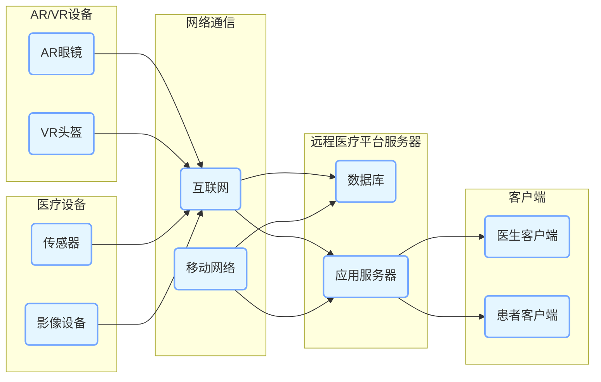

# 企业估值中的AR/VR远程医疗平台评估

> 关键词：企业估值、AR/VR、远程医疗平台、评估方法、市场趋势

> 摘要：本文聚焦于企业估值中AR/VR远程医疗平台的评估。首先介绍了相关背景，包括评估的目的、范围、预期读者和文档结构，以及重要术语。接着阐述了AR/VR和远程医疗平台的核心概念及联系，并给出了相应的原理和架构示意图。详细讲解了用于评估的核心算法原理和具体操作步骤，结合数学模型和公式进行说明。通过项目实战案例，展示了开发环境搭建、源代码实现及代码解读。探讨了AR/VR远程医疗平台的实际应用场景，推荐了相关的学习资源、开发工具框架和论文著作。最后总结了该领域未来的发展趋势与挑战，并提供了常见问题解答和扩展阅读参考资料，旨在为企业估值中AR/VR远程医疗平台的评估提供全面且深入的指导。

## 1. 背景介绍 
### 1.1 目的和范围
在当今数字化医疗快速发展的时代，AR/VR技术与远程医疗的结合为医疗行业带来了新的变革和机遇。企业估值对于投资决策、企业战略规划等具有重要意义。本评估的目的在于准确衡量AR/VR远程医疗平台企业的价值，为投资者、企业管理者等提供科学的决策依据。

评估范围涵盖了AR/VR远程医疗平台的技术层面，包括硬件设备、软件系统、算法等；市场层面，如市场份额、用户规模、竞争态势等；以及财务层面，如收入、成本、利润等。同时，还会考虑平台的创新能力、发展潜力、行业影响力等非财务因素。

### 1.2 预期读者
本文的预期读者主要包括投资者，他们希望通过对AR/VR远程医疗平台的评估，寻找有潜力的投资项目，实现资产的增值；企业管理者，他们需要了解自身平台的价值，制定合理的发展战略和运营决策；行业分析师，他们负责研究行业动态，为市场参与者提供专业的分析和建议；以及对AR/VR远程医疗领域感兴趣的科研人员和学生，他们可以通过本文深入了解该领域的评估方法和技术原理。

### 1.3 文档结构概述
本文将按照以下结构展开：首先介绍核心概念与联系，明确AR/VR和远程医疗平台的基本原理和架构；接着阐述核心算法原理和具体操作步骤，结合Python代码进行详细说明；然后介绍数学模型和公式，并通过举例加深理解；通过项目实战案例，展示开发环境搭建、源代码实现和代码解读；探讨实际应用场景；推荐相关的工具和资源；最后总结未来发展趋势与挑战，提供常见问题解答和扩展阅读参考资料。

### 1.4 术语表
#### 1.4.1 核心术语定义
- **AR（增强现实）**：是一种将虚拟信息与真实世界巧妙融合的技术，通过计算机技术将虚拟的图像、声音、文字等信息叠加到现实场景中，从而增强用户对现实世界的感知和交互体验。
- **VR（虚拟现实）**：是一种利用计算机生成的模拟环境，通过头戴式显示器、手柄等设备，使用户沉浸在一个虚拟的三维空间中，获得身临其境的感觉。
- **远程医疗平台**：是基于信息技术，实现医疗机构之间、医疗机构与患者之间远程医疗服务的系统平台，包括远程诊断、远程治疗、远程监护等功能。
- **企业估值**：是指对企业的整体价值进行评估，通常基于企业的财务状况、市场前景、技术实力等多方面因素，为投资、并购、重组等决策提供依据。

#### 1.4.2 相关概念解释
- **AR/VR在远程医疗中的应用**：AR技术可以在远程医疗中为医生提供患者的三维模型、解剖结构等虚拟信息，辅助手术操作和诊断；VR技术可以为患者提供沉浸式的康复训练环境，缓解疼痛和焦虑，提高康复效果。
- **远程医疗的业务模式**：包括远程诊断、远程治疗、远程监护、远程培训等。远程诊断是指医生通过远程医疗平台对患者的病历、影像等资料进行分析和诊断；远程治疗是指医生通过远程操作设备对患者进行治疗；远程监护是指通过传感器等设备对患者的生命体征进行实时监测，并将数据传输到远程医疗平台，供医生分析和处理；远程培训是指医疗机构通过远程医疗平台对医护人员进行培训和教育。

#### 1.4.3 缩略词列表
- **AR**：Augmented Reality
- **VR**：Virtual Reality
- **EHR**：Electronic Health Record（电子健康记录）
- **PACS**：Picture Archiving and Communication System（医学影像存档与通信系统）

## 2. 核心概念与联系 

### 核心概念原理
#### AR原理
AR技术的核心原理是通过摄像头等设备获取现实场景的图像或视频，然后利用计算机视觉和图形处理技术，将虚拟信息与现实场景进行精确匹配和融合。具体步骤包括：
1. **场景感知**：使用摄像头等传感器获取现实场景的图像或视频数据。
2. **特征提取**：对获取的图像或视频进行处理，提取其中的特征点和特征描述符。
3. **虚拟信息生成**：根据应用需求，生成虚拟的图像、模型、文字等信息。
4. **融合显示**：将虚拟信息与现实场景进行融合，并通过显示器等设备呈现给用户。

#### VR原理
VR技术的核心原理是通过计算机生成一个虚拟的三维场景，用户通过头戴式显示器、手柄等设备与虚拟场景进行交互。具体步骤包括：
1. **场景建模**：使用三维建模软件创建虚拟场景的模型，包括地形、建筑、物体等。
2. **渲染计算**：根据用户的视角和位置，对虚拟场景进行实时渲染计算，生成逼真的图像。
3. **交互跟踪**：使用传感器等设备跟踪用户的头部运动、手部动作等，实现与虚拟场景的交互。
4. **沉浸显示**：通过头戴式显示器将渲染后的图像呈现给用户，使用户产生身临其境的感觉。

#### 远程医疗平台原理
远程医疗平台的核心原理是通过网络通信技术，实现医疗机构之间、医疗机构与患者之间的信息共享和远程协作。具体步骤包括：
1. **数据采集**：通过各种医疗设备（如传感器、影像设备等）采集患者的生理数据、病历信息、影像资料等。
2. **数据传输**：将采集到的数据通过网络传输到远程医疗平台的服务器。
3. **数据存储和管理**：将传输过来的数据存储在服务器的数据库中，并进行分类、索引和管理。
4. **远程诊断和治疗**：医生通过远程医疗平台的客户端软件，访问服务器上的患者数据，进行远程诊断和治疗。

### 架构示意图

该架构示意图展示了AR/VR远程医疗平台的整体架构，包括AR/VR设备、医疗设备、网络通信、远程医疗平台服务器和客户端。AR/VR设备和医疗设备采集的数据通过网络通信传输到远程医疗平台服务器，服务器进行数据存储和管理，并提供应用服务。医生和患者通过客户端软件访问服务器上的服务，实现远程诊断、治疗等功能。

## 3. 核心算法原理 & 具体操作步骤 

### 核心算法原理
在企业估值中，常用的评估方法有收益法、市场法和成本法。对于AR/VR远程医疗平台的评估，收益法是一种较为合适的方法，因为它可以考虑平台未来的收益潜力。收益法的核心思想是将平台未来的预期收益折现到当前时刻，以确定其价值。

具体来说，我们可以使用自由现金流折现模型（DCF模型）来评估AR/VR远程医疗平台的价值。DCF模型的基本公式为：
$$V = \sum_{t=1}^{n} \frac{FCF_t}{(1 + r)^t} + \frac{TV}{(1 + r)^n}$$
其中，$V$ 表示平台的价值，$FCF_t$ 表示第 $t$ 年的自由现金流，$r$ 表示折现率，$n$ 表示预测期，$TV$ 表示终值。

### 具体操作步骤
#### 步骤1：预测自由现金流
自由现金流是指平台在扣除运营成本、资本支出等费用后，可供分配给投资者的现金流量。预测自由现金流需要考虑以下因素：
1. **收入预测**：根据平台的市场份额、用户规模、收费模式等因素，预测未来各年的收入。
2. **成本预测**：包括运营成本、研发成本、营销成本等，根据历史数据和行业趋势进行预测。
3. **资本支出预测**：预测平台未来的固定资产投资和无形资产投资。
4. **税收预测**：根据国家税收政策，预测平台未来的所得税支出。

#### 步骤2：确定折现率
折现率反映了投资者对平台未来收益的风险预期。通常可以使用加权平均资本成本（WACC）来确定折现率，WACC的计算公式为：
$$WACC = E/V \times Re + D/V \times Rd \times (1 - T)$$
其中，$E$ 表示股权价值，$D$ 表示债务价值，$V = E + D$ 表示企业总价值，$Re$ 表示股权成本，$Rd$ 表示债务成本，$T$ 表示所得税税率。

#### 步骤3：计算终值
终值是指预测期结束后平台的价值。可以使用永续增长模型来计算终值，永续增长模型的公式为：
$$TV = \frac{FCF_{n+1}}{r - g}$$
其中，$FCF_{n+1}$ 表示预测期结束后第1年的自由现金流，$g$ 表示永续增长率。

#### 步骤4：计算平台价值
将预测期内各年的自由现金流和终值折现到当前时刻，然后相加得到平台的价值。

### Python代码实现
```python
import numpy as np

def calculate_fcf(revenue, cost, capex, tax_rate):
    """
    计算自由现金流
    :param revenue: 收入
    :param cost: 成本
    :param capex: 资本支出
    :param tax_rate: 所得税税率
    :return: 自由现金流
    """
    ebit = revenue - cost
    tax = ebit * tax_rate
    net_income = ebit - tax
    fcf = net_income + depreciation - capex
    return fcf

def calculate_wacc(equity_value, debt_value, equity_cost, debt_cost, tax_rate):
    """
    计算加权平均资本成本
    :param equity_value: 股权价值
    :param debt_value: 债务价值
    :param equity_cost: 股权成本
    :param debt_cost: 债务成本
    :param tax_rate: 所得税税率
    :return: 加权平均资本成本
    """
    total_value = equity_value + debt_value
    wacc = (equity_value / total_value) * equity_cost + (debt_value / total_value) * debt_cost * (1 - tax_rate)
    return wacc

def calculate_terminal_value(fcf_n_plus_1, wacc, growth_rate):
    """
    计算终值
    :param fcf_n_plus_1: 预测期结束后第1年的自由现金流
    :param wacc: 加权平均资本成本
    :param growth_rate: 永续增长率
    :return: 终值
    """
    tv = fcf_n_plus_1 / (wacc - growth_rate)
    return tv

def calculate_platform_value(fcfs, wacc, terminal_value):
    """
    计算平台价值
    :param fcfs: 预测期内各年的自由现金流
    :param wacc: 加权平均资本成本
    :param terminal_value: 终值
    :return: 平台价值
    """
    n = len(fcfs)
    discounted_fcfs = [fcfs[i] / ((1 + wacc) ** (i + 1)) for i in range(n)]
    discounted_tv = terminal_value / ((1 + wacc) ** n)
    platform_value = sum(discounted_fcfs) + discounted_tv
    return platform_value

# 示例数据
revenue_projections = [100, 120, 150, 180, 200]
cost_projections = [60, 70, 80, 90, 100]
capex_projections = [20, 25, 30, 35, 40]
tax_rate = 0.25
equity_value = 500
debt_value = 200
equity_cost = 0.1
debt_cost = 0.05
growth_rate = 0.03

# 计算自由现金流
fcfs = []
for i in range(len(revenue_projections)):
    fcf = calculate_fcf(revenue_projections[i], cost_projections[i], capex_projections[i], tax_rate)
    fcfs.append(fcf)

# 计算加权平均资本成本
wacc = calculate_wacc(equity_value, debt_value, equity_cost, debt_cost, tax_rate)

# 计算终值
fcf_n_plus_1 = fcfs[-1] * (1 + growth_rate)
terminal_value = calculate_terminal_value(fcf_n_plus_1, wacc, growth_rate)

# 计算平台价值
platform_value = calculate_platform_value(fcfs, wacc, terminal_value)

print("平台价值: ", platform_value)
```

## 4. 数学模型和公式 & 详细讲解 & 举例说明 

### 自由现金流折现模型（DCF模型）
#### 公式
$$V = \sum_{t=1}^{n} \frac{FCF_t}{(1 + r)^t} + \frac{TV}{(1 + r)^n}$$
#### 详细讲解
- $V$：表示平台的价值，即我们要评估的AR/VR远程医疗平台的当前价值。
- $FCF_t$：表示第 $t$ 年的自由现金流，是平台在第 $t$ 年扣除运营成本、资本支出等费用后，可供分配给投资者的现金流量。
- $r$：表示折现率，反映了投资者对平台未来收益的风险预期。折现率越高，说明投资者认为平台的风险越大，对未来收益的折现程度也就越高。
- $n$：表示预测期，即我们对平台未来收益进行预测的年限。
- $TV$：表示终值，是预测期结束后平台的价值。

#### 举例说明
假设我们要评估一个AR/VR远程医疗平台，预测期为5年，各年的自由现金流分别为100万元、120万元、150万元、180万元和200万元，折现率为10%，终值为1000万元。则该平台的价值为：
$$V = \frac{100}{(1 + 0.1)^1} + \frac{120}{(1 + 0.1)^2} + \frac{150}{(1 + 0.1)^3} + \frac{180}{(1 + 0.1)^4} + \frac{200}{(1 + 0.1)^5} + \frac{1000}{(1 + 0.1)^5}$$
```python
import numpy as np

fcfs = [100, 120, 150, 180, 200]
r = 0.1
n = 5
tv = 1000

discounted_fcfs = [fcfs[i] / ((1 + r) ** (i + 1)) for i in range(n)]
discounted_tv = tv / ((1 + r) ** n)
platform_value = sum(discounted_fcfs) + discounted_tv

print("平台价值: ", platform_value)
```

### 加权平均资本成本（WACC）
#### 公式
$$WACC = E/V \times Re + D/V \times Rd \times (1 - T)$$
#### 详细讲解
- $WACC$：表示加权平均资本成本，是企业融资的平均成本。
- $E$：表示股权价值，即企业股东权益的市场价值。
- $D$：表示债务价值，即企业负债的市场价值。
- $V = E + D$：表示企业总价值。
- $Re$：表示股权成本，是投资者投资企业股权所要求的回报率。
- $Rd$：表示债务成本，是企业借款的利率。
- $T$：表示所得税税率，由于债务利息可以在税前扣除，因此债务成本需要乘以 $(1 - T)$ 进行调整。

#### 举例说明
假设一个企业的股权价值为500万元，债务价值为200万元，股权成本为10%，债务成本为5%，所得税税率为25%。则该企业的加权平均资本成本为：
$$WACC = \frac{500}{500 + 200} \times 0.1 + \frac{200}{500 + 200} \times 0.05 \times (1 - 0.25)$$
```python
equity_value = 500
debt_value = 200
equity_cost = 0.1
debt_cost = 0.05
tax_rate = 0.25

total_value = equity_value + debt_value
wacc = (equity_value / total_value) * equity_cost + (debt_value / total_value) * debt_cost * (1 - tax_rate)

print("加权平均资本成本: ", wacc)
```

### 永续增长模型
#### 公式
$$TV = \frac{FCF_{n+1}}{r - g}$$
#### 详细讲解
- $TV$：表示终值，是预测期结束后平台的价值。
- $FCF_{n+1}$：表示预测期结束后第1年的自由现金流。
- $r$：表示折现率。
- $g$：表示永续增长率，是平台在预测期结束后长期的增长率。

#### 举例说明
假设预测期结束后第1年的自由现金流为220万元，折现率为10%，永续增长率为3%。则终值为：
$$TV = \frac{220}{0.1 - 0.03}$$
```python
fcf_n_plus_1 = 220
r = 0.1
g = 0.03

tv = fcf_n_plus_1 / (r - g)

print("终值: ", tv)
```

## 5. 项目实战：代码实际案例和详细解释说明 

### 5.1  开发环境搭建
#### 操作系统
可以选择Windows、Linux或macOS等操作系统。建议使用较新版本的操作系统，以确保系统的稳定性和兼容性。

#### 编程语言和开发工具
- **Python**：是一种广泛使用的编程语言，具有丰富的库和工具，适合进行数据分析、模型计算等任务。建议使用Python 3.7及以上版本。
- **Anaconda**：是一个Python发行版，包含了许多常用的科学计算库和工具，如NumPy、Pandas、Matplotlib等。可以从Anaconda官方网站下载并安装。
- **Jupyter Notebook**：是一个交互式的开发环境，适合进行代码编写、调试和文档编写。安装Anaconda后，Jupyter Notebook会自动安装。

#### 数据库
可以选择MySQL、PostgreSQL等关系型数据库，或者MongoDB、Redis等非关系型数据库。根据项目需求选择合适的数据库，并安装相应的数据库管理系统。

#### 开发框架
如果需要开发AR/VR远程医疗平台的前端界面，可以选择Vue.js、React.js等前端框架；如果需要开发后端服务，可以选择Django、Flask等Python后端框架。

### 5.2  源代码详细实现和代码解读
#### 数据准备
```python
import pandas as pd

# 读取收入、成本、资本支出等数据
data = {
    'year': [1, 2, 3, 4, 5],
    'revenue': [100, 120, 150, 180, 200],
    'cost': [60, 70, 80, 90, 100],
    'capex': [20, 25, 30, 35, 40],
    'tax_rate': 0.25,
    'equity_value': 500,
    'debt_value': 200,
    'equity_cost': 0.1,
    'debt_cost': 0.05,
    'growth_rate': 0.03
}

df = pd.DataFrame(data)
```
这段代码使用Pandas库读取了收入、成本、资本支出等数据，并将其存储在一个DataFrame中。

#### 计算自由现金流
```python
def calculate_fcf(row):
    ebit = row['revenue'] - row['cost']
    tax = ebit * row['tax_rate']
    net_income = ebit - tax
    fcf = net_income - row['capex']
    return fcf

df['fcf'] = df.apply(calculate_fcf, axis=1)
```
这段代码定义了一个计算自由现金流的函数 `calculate_fcf`，并使用 `apply` 方法将该函数应用到DataFrame的每一行，计算出各年的自由现金流。

#### 计算加权平均资本成本
```python
def calculate_wacc(equity_value, debt_value, equity_cost, debt_cost, tax_rate):
    total_value = equity_value + debt_value
    wacc = (equity_value / total_value) * equity_cost + (debt_value / total_value) * debt_cost * (1 - tax_rate)
    return wacc

wacc = calculate_wacc(data['equity_value'], data['debt_value'], data['equity_cost'], data['debt_cost'], data['tax_rate'])
```
这段代码定义了一个计算加权平均资本成本的函数 `calculate_wacc`，并使用该函数计算出加权平均资本成本。

#### 计算终值
```python
last_fcf = df['fcf'].iloc[-1]
fcf_n_plus_1 = last_fcf * (1 + data['growth_rate'])
terminal_value = fcf_n_plus_1 / (wacc - data['growth_rate'])
```
这段代码计算了预测期结束后第1年的自由现金流 `fcf_n_plus_1`，并使用永续增长模型计算出终值。

#### 计算平台价值
```python
discount_factors = [(1 + wacc) ** (i + 1) for i in range(len(df))]
discounted_fcfs = df['fcf'] / discount_factors
discounted_tv = terminal_value / ((1 + wacc) ** len(df))
platform_value = discounted_fcfs.sum() + discounted_tv

print("平台价值: ", platform_value)
```
这段代码计算了各年自由现金流的折现因子，并将各年自由现金流和终值折现到当前时刻，最后相加得到平台的价值。

### 5.3  代码解读与分析
#### 数据准备部分
使用Pandas库读取和处理数据，将收入、成本、资本支出等数据存储在一个DataFrame中，方便后续的计算和分析。

#### 自由现金流计算部分
通过定义 `calculate_fcf` 函数，根据收入、成本、资本支出和所得税税率计算各年的自由现金流。自由现金流是评估企业价值的重要指标，反映了企业在扣除运营成本和资本支出后，可供分配给投资者的现金流量。

#### 加权平均资本成本计算部分
通过定义 `calculate_wacc` 函数，根据股权价值、债务价值、股权成本、债务成本和所得税税率计算加权平均资本成本。加权平均资本成本反映了企业融资的平均成本，是折现未来现金流的重要参数。

#### 终值计算部分
根据预测期结束后第1年的自由现金流和永续增长率，使用永续增长模型计算终值。终值反映了预测期结束后平台的价值，是评估企业长期价值的重要因素。

#### 平台价值计算部分
将各年自由现金流和终值折现到当前时刻，最后相加得到平台的价值。折现过程考虑了资金的时间价值，将未来的现金流转化为当前的价值。

## 6. 实际应用场景 
### 远程诊断
医生可以通过AR/VR远程医疗平台，远程查看患者的病历、影像资料等信息，并使用AR技术将患者的三维模型、解剖结构等虚拟信息叠加到现实场景中，辅助诊断。例如，在进行手术前，医生可以通过AR技术模拟手术过程，提前规划手术方案，提高手术的成功率。

### 远程治疗
医生可以通过远程医疗平台，远程操作手术机器人等设备，对患者进行治疗。VR技术可以为医生提供沉浸式的操作环境，提高操作的精准度和安全性。例如，在进行远程心脏手术时，医生可以通过VR技术身临其境地感受手术场景，更好地控制手术机器人进行操作。

### 远程监护
通过传感器等设备，实时监测患者的生命体征，如心率、血压、血糖等，并将数据传输到远程医疗平台。医生可以通过平台随时查看患者的健康状况，及时发现异常情况并进行处理。例如，对于患有慢性疾病的患者，医生可以通过远程监护系统，实时了解患者的病情变化，调整治疗方案。

### 远程培训
医疗机构可以通过AR/VR远程医疗平台，对医护人员进行培训和教育。VR技术可以为学员提供沉浸式的培训环境，让学员在虚拟场景中进行实践操作，提高培训效果。例如，在进行急救培训时，学员可以通过VR技术模拟各种急救场景，进行实际操作训练，提高急救技能。

### 患者康复
VR技术可以为患者提供沉浸式的康复训练环境，缓解患者的疼痛和焦虑，提高康复效果。例如，对于患有运动损伤的患者，医生可以为患者制定个性化的VR康复训练方案，让患者在虚拟场景中进行康复训练，增强训练的趣味性和积极性。

## 7. 工具和资源推荐
### 7.1 学习资源推荐
#### 7.1.1 书籍推荐
- 《虚拟现实技术与应用》：介绍了虚拟现实技术的基本原理、开发方法和应用案例，适合初学者学习。
- 《增强现实：原理、技术与应用》：详细讲解了增强现实技术的原理、算法和开发工具，对深入学习增强现实技术有很大帮助。
- 《远程医疗：原理与实践》：全面介绍了远程医疗的概念、技术和应用，是了解远程医疗领域的重要参考书籍。

#### 7.1.2 在线课程
- Coursera上的“虚拟现实开发基础”课程：由知名高校的教授授课，系统地介绍了虚拟现实开发的基础知识和技能。
- Udemy上的“增强现实开发实战”课程：通过实际项目案例，讲解了增强现实开发的流程和方法。
- edX上的“远程医疗技术与应用”课程：深入探讨了远程医疗的技术原理和应用场景，适合专业人士学习。

#### 7.1.3 技术博客和网站
- AR/VR Developer Blog：提供了AR/VR技术的最新动态、开发教程和案例分享。
- Remote Health Monitor：专注于远程医疗领域的技术研究和应用推广，发布了大量的行业报告和学术论文。
- MedTech Insights：涵盖了医疗技术的各个领域，包括AR/VR远程医疗，提供了丰富的技术资讯和市场分析。

### 7.2 开发工具框架推荐
#### 7.2.1 IDE和编辑器
- Visual Studio Code：是一款轻量级的代码编辑器，支持多种编程语言和开发框架，具有丰富的插件和扩展功能。
- PyCharm：是专门为Python开发设计的集成开发环境，提供了代码调试、自动补全、代码分析等功能，提高了开发效率。
- Unity：是一款跨平台的游戏开发引擎，也广泛应用于AR/VR应用开发。它提供了丰富的工具和资源，方便开发者快速创建AR/VR应用。

#### 7.2.2 调试和性能分析工具
- Chrome DevTools：是Chrome浏览器自带的调试工具，可用于调试Web应用程序，包括AR/VR网页应用。它提供了代码调试、性能分析、网络监控等功能。
- Unity Profiler：是Unity引擎自带的性能分析工具，可用于分析AR/VR应用的性能瓶颈，优化应用的性能。
- Android Studio Profiler：是Android开发工具中的性能分析工具，可用于分析Android平台上的AR/VR应用的性能。

#### 7.2.3 相关框架和库
- ARCore：是Google开发的增强现实开发框架，支持Android设备。它提供了丰富的API和工具，方便开发者创建高质量的AR应用。
- ARKit：是Apple开发的增强现实开发框架，支持iOS设备。它提供了先进的跟踪和识别技术，可用于创建沉浸式的AR体验。
- Three.js：是一个基于WebGL的JavaScript 3D库，可用于创建跨平台的Web AR/VR应用。它提供了简单易用的API，降低了开发门槛。

### 7.3 相关论文著作推荐
#### 7.3.1 经典论文
- “Augmented Reality: A Survey”：对增强现实技术进行了全面的综述，介绍了增强现实的发展历程、技术原理和应用领域。
- “Virtual Reality in Healthcare: A Review of the Literature”：对虚拟现实技术在医疗领域的应用进行了系统的回顾和分析，探讨了虚拟现实技术在医疗教育、康复治疗、心理治疗等方面的应用前景。
- “Telemedicine: Past, Present, and Future”：回顾了远程医疗的发展历程，分析了远程医疗的现状和面临的挑战，展望了远程医疗的未来发展趋势。

#### 7.3.2 最新研究成果
- 在IEEE Transactions on Biomedical Engineering、Journal of Medical Internet Research等学术期刊上，经常发表关于AR/VR远程医疗的最新研究成果。这些研究成果涵盖了技术创新、临床应用、用户体验等多个方面。
- 参加国际会议，如IEEE International Conference on Healthcare Informatics、ACM SIGGRAPH等，也可以了解到AR/VR远程医疗领域的最新研究动态。

#### 7.3.3 应用案例分析
- 一些知名医疗机构和科技公司的官方网站上，会分享AR/VR远程医疗平台的应用案例。例如，Mayo Clinic、Stanford Medicine等医疗机构在其网站上介绍了他们使用AR/VR技术进行远程医疗的实践经验。
- 行业报告和研究机构的分析文章中，也会对AR/VR远程医疗平台的应用案例进行深入分析。例如，MarketsandMarkets、Grand View Research等研究机构发布的报告中，包含了大量的AR/VR远程医疗市场分析和应用案例。

## 8. 总结：未来发展趋势与挑战
### 未来发展趋势
#### 技术融合创新
未来，AR/VR技术将与人工智能、大数据、物联网等技术深度融合，进一步提升远程医疗平台的功能和性能。例如，人工智能技术可以实现对患者病情的智能诊断和预测，大数据技术可以为医生提供更全面的患者信息和临床决策支持，物联网技术可以实现医疗设备的互联互通和远程控制。

#### 应用场景拓展
除了现有的远程诊断、治疗、监护、培训等应用场景，AR/VR远程医疗平台的应用场景将不断拓展。例如，在心理健康治疗方面，VR技术可以为患者提供沉浸式的心理治疗环境，缓解患者的焦虑和抑郁情绪；在老年护理方面，AR/VR技术可以为护理人员提供远程指导和培训，提高护理服务的质量和效率。

#### 市场规模扩大
随着人们对健康的关注度不断提高，以及医疗资源分布不均的问题日益突出，AR/VR远程医疗平台的市场需求将不断增加。预计未来几年，AR/VR远程医疗市场将保持高速增长，市场规模将不断扩大。

### 挑战
#### 技术难题
AR/VR技术在远程医疗中的应用还面临一些技术难题，如设备的精度和稳定性、图像的实时传输和处理、虚拟场景的真实感和交互性等。这些技术难题需要进一步的研究和创新来解决。

#### 安全和隐私问题
远程医疗涉及到患者的个人健康信息和隐私，安全和隐私问题是制约AR/VR远程医疗平台发展的重要因素。如何保障患者信息的安全和隐私，防止信息泄露和滥用，是需要解决的关键问题。

#### 法律法规和政策支持
AR/VR远程医疗平台的发展需要相应的法律法规和政策支持。目前，相关的法律法规和政策还不够完善，对远程医疗的监管和规范还存在一定的不足。需要政府和相关部门加强法律法规和政策的制定和完善，为AR/VR远程医疗平台的发展提供良好的政策环境。

#### 用户接受度
AR/VR技术对于一些用户来说还比较陌生，用户对其接受度和使用意愿还需要进一步提高。如何提高用户的接受度和使用意愿，让更多的患者和医生愿意使用AR/VR远程医疗平台，是需要解决的问题之一。

## 9. 附录：常见问题与解答
### 问题1：AR/VR远程医疗平台的评估方法有哪些？
答：常用的评估方法有收益法、市场法和成本法。收益法是将平台未来的预期收益折现到当前时刻，以确定其价值；市场法是通过比较类似平台的市场交易价格，来评估目标平台的价值；成本法是根据平台的建设成本和运营成本，来评估其价值。对于AR/VR远程医疗平台，收益法是一种较为合适的方法，因为它可以考虑平台未来的收益潜力。

### 问题2：如何预测AR/VR远程医疗平台的未来收益？
答：预测AR/VR远程医疗平台的未来收益需要考虑多个因素，包括市场规模、市场份额、收费模式、用户增长速度等。可以通过市场调研、行业分析、竞争对手分析等方法，对这些因素进行预测和分析。同时，还需要考虑技术发展、政策变化等不确定性因素对未来收益的影响。

### 问题3：AR/VR远程医疗平台的开发难度大吗？
答：AR/VR远程医疗平台的开发难度相对较大，需要涉及到多个领域的技术，如AR/VR技术、网络通信技术、医疗信息技术等。同时，还需要满足医疗行业的特殊要求，如数据安全、隐私保护、可靠性等。因此，开发AR/VR远程医疗平台需要具备专业的技术团队和丰富的开发经验。

### 问题4：AR/VR远程医疗平台的应用前景如何？
答：AR/VR远程医疗平台的应用前景非常广阔。它可以打破时间和空间的限制，提高医疗资源的利用效率，为患者提供更加便捷、高效的医疗服务。同时，它还可以为医生提供更加准确、直观的诊断和治疗工具，提高医疗质量和水平。随着技术的不断发展和应用场景的不断拓展，AR/VR远程医疗平台的市场需求将不断增加，市场规模将不断扩大。

### 问题5：如何保障AR/VR远程医疗平台的安全和隐私？
答：保障AR/VR远程医疗平台的安全和隐私需要从多个方面入手。首先，需要采用先进的加密技术，对患者的个人健康信息和医疗数据进行加密处理，防止信息泄露。其次，需要建立严格的用户认证和授权机制，确保只有授权人员才能访问患者的信息。此外，还需要定期对平台进行安全检测和漏洞修复，及时发现和解决安全隐患。

## 10. 扩展阅读 & 参考资料
### 扩展阅读
- 《人工智能与医疗健康》：介绍了人工智能技术在医疗健康领域的应用，包括疾病诊断、治疗方案推荐、药物研发等方面。
- 《医疗物联网技术与应用》：详细讲解了医疗物联网的技术原理和应用场景，如医疗设备的互联互通、远程医疗监测等。
- 《数字医疗：重塑未来医疗生态》：探讨了数字技术对医疗行业的影响和变革，分析了数字医疗的发展趋势和挑战。

### 参考资料
- IEEE Xplore、ACM Digital Library等学术数据库，提供了大量关于AR/VR、远程医疗的学术论文和研究报告。
- 世界卫生组织（WHO）、美国食品药品监督管理局（FDA）等官方网站，发布了关于远程医疗的政策法规和行业标准。
- 市场研究机构如Gartner、Forrester等发布的关于AR/VR远程医疗市场的研究报告，为了解市场动态和发展趋势提供了重要参考。