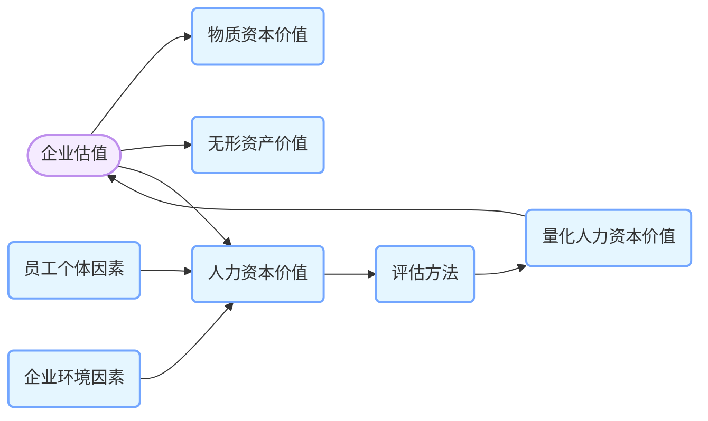

# 企业估值中的人力资本价值评估

> 关键词：企业估值、人力资本、价值评估、评估方法、人力资源管理

> 摘要：在当今知识经济时代，人力资本已成为企业核心竞争力的重要组成部分。准确评估企业人力资本价值对于企业估值具有关键意义。本文旨在深入探讨企业估值中人力资本价值评估的相关内容，从背景介绍入手，阐述核心概念与联系，剖析核心算法原理及操作步骤，借助数学模型和公式进行理论支撑，通过项目实战案例详细解读代码实现，分析实际应用场景，推荐相关工具和资源，最后总结未来发展趋势与挑战，并提供常见问题解答和参考资料，为企业在人力资本价值评估方面提供全面且深入的指导。

## 1. 背景介绍 
### 1.1 目的和范围
在知识经济蓬勃发展的当下，企业的价值不再仅仅取决于物质资本，人力资本的重要性日益凸显。准确评估人力资本价值，有助于企业合理确定自身价值，为投资者提供更全面的决策依据，也有利于企业内部优化人力资源配置。本文的范围涵盖人力资本价值评估的基本概念、常用方法、数学模型、实际应用以及相关工具和资源等方面，旨在为企业和相关从业者提供一个系统的人力资本价值评估知识体系。

### 1.2 预期读者
本文预期读者包括企业管理人员、财务分析师、人力资源专家、投资者以及对企业估值和人力资本价值评估感兴趣的学者和研究人员。

### 1.3 文档结构概述
本文首先介绍人力资本价值评估的背景知识，包括目的、读者和术语表。接着阐述核心概念与联系，展示其原理和架构的文本示意图及流程图。然后详细讲解核心算法原理和具体操作步骤，结合Python源代码进行说明。再通过数学模型和公式对评估方法进行理论分析，并举例说明。之后通过项目实战案例，介绍开发环境搭建、源代码实现和代码解读。随后分析实际应用场景，推荐相关工具和资源。最后总结未来发展趋势与挑战，提供常见问题解答和参考资料。

### 1.4 术语表
#### 1.4.1 核心术语定义
- **人力资本**：指存在于人体之中的具有经济价值的知识、技能和体力（健康状况）等质量因素之和。
- **企业估值**：对企业的内在价值进行评估，确定企业在市场中的价值。
- **人力资本价值评估**：对企业中人力资本所具有的价值进行量化评估的过程。

#### 1.4.2 相关概念解释
- **人力资源**：指一定时期内组织中的人所拥有的能够被企业所用，且对价值创造起贡献作用的教育、能力、技能、经验、体力等的总称。人力资源更侧重于人员的数量和结构，而人力资本强调人员所具备的价值和能力。
- **无形资产**：指企业拥有或者控制的没有实物形态的可辨认非货币性资产。人力资本在一定程度上可视为企业的无形资产，因其能为企业带来未来经济利益。

#### 1.4.3 缩略词列表
- **NPV**：Net Present Value，净现值
- **DCF**：Discounted Cash Flow，现金流折现法

## 2. 核心概念与联系 
### 核心概念原理
人力资本价值评估的核心原理在于将企业员工所具备的知识、技能、经验等因素转化为可量化的经济价值。从经济学角度来看，人力资本是一种生产要素，能够为企业创造价值。其价值的形成源于员工的教育投入、培训经历、工作经验积累等，这些因素共同作用，使员工在工作中能够发挥出相应的能力，为企业带来收益。

企业估值则是综合考虑企业的各种资产和负债，以及未来的盈利能力等因素，确定企业的市场价值。人力资本作为企业的重要资产之一，对企业的价值有着重要影响。准确评估人力资本价值，可以更全面地反映企业的真实价值。

### 架构的文本示意图
人力资本价值评估与企业估值的关系可以用以下文本示意图表示：

企业估值包含多个方面的因素，其中人力资本价值是重要组成部分。人力资本价值受到员工个体因素（如教育程度、技能水平、工作经验）和企业环境因素（如企业文化、管理水平、培训机会）的影响。通过一定的评估方法，将人力资本的这些因素量化，得出人力资本价值。该价值与企业的物质资本价值、无形资产价值等共同构成企业的总价值。

### Mermaid 流程图


## 3. 核心算法原理 & 具体操作步骤 
### 核心算法原理
在人力资本价值评估中，常用的算法之一是现金流折现法（DCF）。其基本原理是将员工未来为企业创造的现金流进行折现，得到其当前的价值。假设员工在未来 $n$ 期内为企业创造的现金流分别为 $CF_1, CF_2, \cdots, CF_n$，折现率为 $r$，则该员工的人力资本价值 $V$ 可以通过以下公式计算：

$V = \sum_{i=1}^{n} \frac{CF_i}{(1 + r)^i}$

### 具体操作步骤
1. **确定员工未来各期的现金流**：这需要对员工的工作绩效、业务贡献等进行分析和预测。可以参考员工过去的业绩数据、企业的业务发展规划等因素。例如，如果员工负责销售业务，可以根据其过去的销售业绩和市场趋势，预测未来各期的销售金额，再扣除相关成本，得到净现金流。
2. **确定折现率**：折现率反映了资金的时间价值和风险水平。一般可以参考企业的加权平均资本成本（WACC），也可以根据员工所在岗位的风险程度进行调整。例如，对于高风险岗位的员工，折现率可以适当提高。
3. **计算人力资本价值**：将预测的各期现金流按照确定的折现率进行折现，然后求和，得到员工的人力资本价值。

### Python 源代码实现
```python
def calculate_human_capital_value(cash_flows, discount_rate):
    """
    计算人力资本价值
    :param cash_flows: 未来各期的现金流列表
    :param discount_rate: 折现率
    :return: 人力资本价值
    """
    value = 0
    for i, cf in enumerate(cash_flows):
        value += cf / (1 + discount_rate) ** (i + 1)
    return value

# 示例数据
cash_flows = [10000, 12000, 13000, 15000, 16000]  # 未来 5 期的现金流
discount_rate = 0.1  # 折现率为 10%

human_capital_value = calculate_human_capital_value(cash_flows, discount_rate)
print(f"人力资本价值: {human_capital_value}")
```

## 4. 数学模型和公式 & 详细讲解 & 举例说明 
### 数学模型和公式
在现金流折现法的基础上，我们可以进一步扩展数学模型。假设员工的工作年限为 $T$，每年的现金流增长系数为 $g$，初始现金流为 $CF_0$，则第 $t$ 年的现金流 $CF_t$ 可以表示为：

$CF_t = CF_0 (1 + g)^t$

那么员工的人力资本价值 $V$ 可以表示为：

$V = \sum_{t=1}^{T} \frac{CF_0 (1 + g)^t}{(1 + r)^t}$

这是一个等比数列求和的形式，根据等比数列求和公式 $S_n = \frac{a_1(1 - q^n)}{1 - q}$（其中 $a_1$ 为首项，$q$ 为公比，$n$ 为项数），可以将上式化简为：

$V = CF_0 \frac{1 - (\frac{1 + g}{1 + r})^T}{r - g}$ （当 $r \neq g$ 时）

### 详细讲解
- **现金流增长系数 $g$**：反映了员工未来创造现金流的增长趋势。如果企业处于快速发展阶段，员工的业务能力也在不断提升，那么 $g$ 可能为正值；如果企业面临市场竞争压力或业务调整，$g$ 可能为负值或较小的正值。
- **折现率 $r$**：除了反映资金的时间价值和风险水平外，还受到宏观经济环境、行业特点等因素的影响。一般来说，行业风险越高，折现率越高。
- **工作年限 $T$**：可以根据员工的劳动合同期限、职业发展规划等因素确定。

### 举例说明
假设某员工初始现金流 $CF_0 = 10000$ 元，现金流增长系数 $g = 0.05$（即每年增长 5%），折现率 $r = 0.1$，工作年限 $T = 5$ 年。则该员工的人力资本价值为：

$V = 10000 \frac{1 - (\frac{1 + 0.05}{1 + 0.1})^5}{0.1 - 0.05}$

```python
CF_0 = 10000
g = 0.05
r = 0.1
T = 5

V = CF_0 * (1 - ((1 + g) / (1 + r)) ** T) / (r - g)
print(f"人力资本价值: {V}")
```

## 5. 项目实战：代码实际案例和详细解释说明 
### 5.1  开发环境搭建
- **Python 安装**：从 Python 官方网站（https://www.python.org/downloads/）下载并安装适合你操作系统的 Python 版本。建议安装 Python 3.7 及以上版本。
- **开发工具**：可以选择 PyCharm、VS Code 等集成开发环境（IDE）。以 PyCharm 为例，从 JetBrains 官方网站（https://www.jetbrains.com/pycharm/download/）下载并安装社区版或专业版。
- **依赖库安装**：本项目主要使用 Python 内置库，无需额外安装依赖库。

### 5.2  源代码详细实现和代码解读
```python
# 定义计算人力资本价值的函数
def calculate_human_capital_value(cash_flows, discount_rate):
    """
    计算人力资本价值
    :param cash_flows: 未来各期的现金流列表
    :param discount_rate: 折现率
    :return: 人力资本价值
    """
    value = 0
    for i, cf in enumerate(cash_flows):
        # 对每期现金流进行折现
        value += cf / (1 + discount_rate) ** (i + 1)
    return value

# 示例数据
# 假设未来 5 期的现金流分别为 10000, 12000, 13000, 15000, 16000
cash_flows = [10000, 12000, 13000, 15000, 16000]
# 折现率为 10%
discount_rate = 0.1

# 调用函数计算人力资本价值
human_capital_value = calculate_human_capital_value(cash_flows, discount_rate)
print(f"人力资本价值: {human_capital_value}")
```

### 代码解读与分析
- **函数定义**：`calculate_human_capital_value` 函数接受两个参数：`cash_flows` 表示未来各期的现金流列表，`discount_rate` 表示折现率。函数内部通过循环遍历现金流列表，对每期现金流进行折现，并累加到 `value` 变量中，最后返回人力资本价值。
- **示例数据**：定义了一个包含 5 个元素的现金流列表 `cash_flows`，表示未来 5 期的现金流。同时定义了折现率 `discount_rate` 为 10%。
- **函数调用**：调用 `calculate_human_capital_value` 函数，将现金流列表和折现率作为参数传入，得到人力资本价值，并将结果打印输出。

## 6. 实际应用场景 
### 企业并购
在企业并购过程中，准确评估目标企业的人力资本价值至关重要。并购方需要了解目标企业员工的技能水平、创新能力、团队协作等情况，以确定目标企业的真实价值。通过人力资本价值评估，可以更好地评估并购后的协同效应，为并购决策提供依据。例如，如果目标企业拥有一支高素质的研发团队，其人力资本价值较高，可能会增加并购方对目标企业的估值。

### 股权激励
企业在实施股权激励计划时，需要确定激励对象的人力资本价值。通过评估员工的工作业绩、创新能力、对企业的贡献等因素，确定员工的人力资本价值，进而确定股权激励的份额。这样可以使股权激励更加公平合理，提高员工的积极性和忠诚度。

### 人力资源管理
在人力资源管理中，人力资本价值评估可以为企业的招聘、培训、晋升等决策提供参考。例如，在招聘过程中，可以根据岗位的要求和候选人的人力资本价值进行筛选和评估；在培训方面，可以根据员工的人力资本价值确定培训内容和方式，提高培训的效果；在晋升决策中，可以参考员工的人力资本价值，选拔出更适合的人才。

### 投资者决策
投资者在进行投资决策时，除了关注企业的财务报表和市场前景外，还会关注企业的人力资本状况。通过了解企业的人力资本价值，投资者可以更好地评估企业的长期发展潜力和竞争力，从而做出更明智的投资决策。

## 7. 工具和资源推荐
### 7.1 学习资源推荐
#### 7.1.1 书籍推荐
- 《人力资本管理》：全面介绍了人力资本管理的理论和实践，包括人力资本价值评估的方法和案例。
- 《企业估值》：详细讲解了企业估值的各种方法，其中包括人力资本价值评估在企业估值中的应用。
- 《人力资源经济学》：从经济学的角度分析人力资源问题，对理解人力资本价值的形成和评估有很大帮助。

#### 7.1.2 在线课程
- Coursera 平台上的“人力资源管理”课程：提供了系统的人力资源管理知识，包括人力资本价值评估的相关内容。
- edX 平台上的“企业估值与投资决策”课程：深入讲解了企业估值的方法和技巧，涉及人力资本价值评估的方法和应用。

#### 7.1.3 技术博客和网站
- 人力资源管理网：提供了丰富的人力资源管理资讯和案例，包括人力资本价值评估的相关文章。
- 企业估值研究网：专注于企业估值领域的研究和交流，有很多关于人力资本价值评估的专业文章和研究报告。

### 7.2 开发工具框架推荐
#### 7.2.1 IDE和编辑器
- PyCharm：功能强大的 Python 集成开发环境，提供代码编辑、调试、版本控制等功能，适合开发人力资本价值评估相关的 Python 程序。
- VS Code：轻量级的代码编辑器，支持多种编程语言，通过安装相关插件可以方便地进行 Python 开发。

#### 7.2.2 调试和性能分析工具
- PDB：Python 内置的调试器，可以帮助开发者调试 Python 代码，定位和解决问题。
- cProfile：Python 内置的性能分析工具，可以分析 Python 程序的性能瓶颈，优化代码性能。

#### 7.2.3 相关框架和库
- Pandas：强大的数据处理和分析库，可以用于处理和分析人力资本价值评估中的数据。
- NumPy：用于科学计算的基础库，提供了高效的数组操作和数学函数，在计算人力资本价值时可以提高计算效率。

### 7.3 相关论文著作推荐
#### 7.3.1 经典论文
- 《人力资本理论》：舒尔茨的经典论文，奠定了人力资本理论的基础，对理解人力资本的概念和价值有重要意义。
- 《企业估值中的人力资本价值评估方法研究》：深入探讨了企业估值中人力资本价值评估的方法和模型，具有较高的学术价值。

#### 7.3.2 最新研究成果
- 关注《管理世界》、《中国工业经济》等国内权威学术期刊，以及《Journal of Management》、《Academy of Management Journal》等国际知名学术期刊，获取关于人力资本价值评估的最新研究成果。

#### 7.3.3 应用案例分析
- 一些企业管理咨询公司的研究报告和案例分析，如麦肯锡、波士顿咨询等公司的报告，提供了很多关于人力资本价值评估在企业实际应用中的案例和经验。

## 8. 总结：未来发展趋势与挑战
### 未来发展趋势
- **数据驱动的评估方法**：随着大数据和人工智能技术的发展，未来人力资本价值评估将越来越依赖于数据。通过收集和分析员工的多源数据，如工作绩效数据、社交网络数据、学习行为数据等，可以更准确地评估员工的人力资本价值。
- **动态评估**：传统的人力资本价值评估往往是静态的，不能及时反映员工的价值变化。未来将更加注重动态评估，实时跟踪员工的能力提升和业绩变化，及时调整人力资本价值评估结果。
- **整合评估**：人力资本价值评估将与企业的战略规划、绩效管理、薪酬管理等进行更深入的整合。通过整合评估，可以更好地发挥人力资本的价值，实现企业的战略目标。

### 挑战
- **数据质量和隐私问题**：数据驱动的评估方法需要大量的高质量数据，但数据质量和隐私问题是一个挑战。企业需要确保数据的准确性、完整性和安全性，同时保护员工的隐私。
- **评估模型的复杂性**：随着评估方法的不断发展，评估模型越来越复杂。如何确保评估模型的科学性和可解释性，是一个需要解决的问题。
- **员工的主观感受**：人力资本价值评估结果可能会影响员工的薪酬、晋升等利益，容易引起员工的主观感受和不满。企业需要做好沟通和解释工作，确保评估结果的公平性和合理性。

## 9. 附录：常见问题与解答
### 问题 1：人力资本价值评估的结果准确吗？
解答：人力资本价值评估的结果受到多种因素的影响，如数据的准确性、评估方法的合理性、预测的不确定性等。因此，评估结果只是一个估计值，具有一定的误差。但通过合理选择评估方法、收集准确的数据和进行科学的预测，可以提高评估结果的准确性。

### 问题 2：如何选择合适的评估方法？
解答：选择合适的评估方法需要考虑企业的特点、评估的目的、数据的可用性等因素。不同的评估方法适用于不同的情况，例如现金流折现法适用于预测员工未来现金流比较稳定的情况，而成本法适用于评估新入职员工的人力资本价值。在实际应用中，可以根据具体情况选择一种或多种评估方法进行综合评估。

### 问题 3：人力资本价值评估对企业有什么作用？
解答：人力资本价值评估对企业具有重要作用。它可以帮助企业准确了解自身的人力资本状况，为企业的战略规划、人力资源管理、企业估值等提供决策依据。同时，通过评估结果的反馈，可以激励员工提升自身能力，提高企业的绩效和竞争力。

## 10. 扩展阅读 & 参考资料
### 扩展阅读
- 《知识经济时代的人力资本管理创新》
- 《人力资本与企业核心竞争力》

### 参考资料
- 舒尔茨. 《人力资本理论》
- 相关学术期刊和研究报告

以上就是关于企业估值中人力资本价值评估的详细内容，希望对读者有所帮助。在实际应用中，需要根据具体情况灵活运用各种方法和技术，不断探索和创新，以提高人力资本价值评估的准确性和有效性。