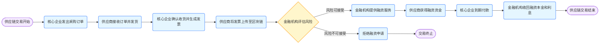

# 企业估值中的区块链供应链金融评估

> 关键词：企业估值、区块链、供应链金融、评估模型、风险控制

> 摘要：本文聚焦于企业估值中的区块链供应链金融评估，详细阐述了相关概念、原理及应用。首先介绍了研究的背景、目的、预期读者和文档结构，接着深入剖析了区块链与供应链金融的核心概念及联系，通过 Python 代码讲解了核心算法原理和具体操作步骤，给出了相关数学模型和公式并举例说明。在项目实战部分，展示了开发环境搭建、源代码实现与解读。还探讨了实际应用场景，推荐了学习资源、开发工具框架和相关论文著作。最后总结了未来发展趋势与挑战，并提供了常见问题解答和扩展阅读参考资料，旨在为企业在区块链供应链金融评估方面提供全面且深入的指导。

## 1. 背景介绍 
### 1.1 目的和范围
在当今复杂多变的商业环境中，企业的准确估值对于投资者、管理者以及金融机构等利益相关者至关重要。而区块链技术的兴起为供应链金融领域带来了新的变革，它为解决供应链金融中的信任、信息不对称等问题提供了有效的解决方案。本研究的目的在于探讨如何将区块链技术应用于供应链金融评估中，以提升企业估值的准确性和可靠性。具体范围涵盖了区块链与供应链金融的结合原理、相关评估模型的构建、算法实现以及实际应用案例分析等方面。

### 1.2 预期读者
本文预期读者包括企业管理人员、金融分析师、区块链技术开发者、投资者以及对区块链供应链金融感兴趣的研究人员。企业管理人员可以通过本文了解如何利用区块链供应链金融评估来优化企业的融资策略和运营管理；金融分析师能够借助相关评估方法提升对企业价值的判断能力；区块链技术开发者可以从中获取在供应链金融领域的应用开发思路；投资者则可以依据评估结果做出更明智的投资决策；研究人员可将本文作为进一步深入研究的参考资料。

### 1.3 文档结构概述
本文将按照以下结构进行阐述：首先介绍区块链与供应链金融的核心概念及其联系，通过文本示意图和 Mermaid 流程图直观展示其架构；接着详细讲解核心算法原理，并使用 Python 代码给出具体操作步骤；然后引入数学模型和公式，进行详细讲解并举例说明；在项目实战部分，从开发环境搭建入手，展示源代码的详细实现和解读；随后探讨区块链供应链金融评估在实际中的应用场景；推荐相关的学习资源、开发工具框架和论文著作；最后总结未来发展趋势与挑战，提供常见问题解答和扩展阅读参考资料。

### 1.4 术语表
#### 1.4.1 核心术语定义
- **企业估值**：指对企业的经济价值进行评估和估算的过程，通常基于企业的资产、盈利能力、市场前景等多方面因素。
- **区块链**：是一种分布式账本技术，通过去中心化、不可篡改、共识机制等特性，实现数据的安全存储和可信传输。
- **供应链金融**：是银行等金融机构围绕核心企业，管理上下游中小企业的资金流和物流，把单个企业的不可控风险转变为供应链企业整体的可控风险，通过立体获取各类信息，将风险控制在最低的金融服务。
- **区块链供应链金融**：将区块链技术应用于供应链金融领域，利用区块链的特性解决供应链金融中的信任、信息共享等问题，提升供应链金融的效率和安全性。

#### 1.4.2 相关概念解释
- **智能合约**：是一种以代码形式编写的合约，存储在区块链上，当满足预设条件时自动执行，可实现供应链金融中的自动化交易和结算。
- **分布式账本**：是一种在多个节点之间共享、复制和同步的数据库，确保数据的一致性和可靠性，避免了单点故障和数据篡改。
- **共识机制**：是区块链网络中节点达成一致的算法，常见的有工作量证明（PoW）、权益证明（PoS）等，用于保证区块链数据的安全性和不可篡改性。

#### 1.4.3 缩略词列表
- **PoW**：Proof of Work，工作量证明
- **PoS**：Proof of Stake，权益证明
- **IoT**：Internet of Things，物联网

## 2. 核心概念与联系 

### 核心概念原理
区块链技术的核心原理基于分布式账本、加密算法和共识机制。分布式账本将数据存储在多个节点上，每个节点都有完整的数据副本，确保数据的安全性和可靠性。加密算法对数据进行加密处理，防止数据被篡改和窃取。共识机制则用于保证节点之间的数据一致性，使得在没有中心化机构的情况下，节点能够达成共识。

供应链金融的核心原理是围绕核心企业，整合供应链上的资金流、物流和信息流。通过对供应链上各企业的交易数据进行分析和评估，金融机构可以为供应链上的中小企业提供融资服务，降低融资成本和风险。

当区块链与供应链金融相结合时，区块链的分布式账本可以实现供应链上交易数据的共享和透明，使得金融机构能够更准确地了解企业的经营状况和信用情况。智能合约则可以自动执行供应链金融中的交易和结算，提高效率和减少人为干预。

### 架构的文本示意图
```plaintext
区块链供应链金融架构

区块链网络
|
|-- 节点 1（核心企业）
|   |-- 交易数据
|   |-- 智能合约
|
|-- 节点 2（供应商）
|   |-- 交易数据
|   |-- 智能合约
|
|-- 节点 3（金融机构）
|   |-- 交易数据
|   |-- 风险评估模型
|   |-- 融资决策系统
|
|-- 节点 4（监管机构）
|   |-- 交易数据监控
|   |-- 合规检查

供应链
|
|-- 核心企业
|   |-- 采购订单
|   |-- 销售发票
|
|-- 供应商
|   |-- 原材料供应
|   |-- 交货凭证
|
|-- 经销商
|   |-- 产品销售
|   |-- 收款凭证

金融服务
|
|-- 应收账款融资
|-- 存货融资
|-- 预付款融资
```

### Mermaid 流程图


## 3. 核心算法原理 & 具体操作步骤 

### 核心算法原理
在区块链供应链金融评估中，核心算法主要用于风险评估和企业估值。常见的风险评估算法包括信用评分模型、机器学习算法等。这里我们以逻辑回归算法为例，介绍其在风险评估中的应用。

逻辑回归是一种广义线性回归模型，用于解决二分类问题。在供应链金融风险评估中，我们可以将企业的违约情况分为违约和不违约两类，通过逻辑回归算法建立风险评估模型。

逻辑回归的基本原理是通过对输入特征进行线性组合，然后通过逻辑函数将线性组合的结果映射到 0 到 1 之间的概率值。逻辑函数的公式为：

$$
\sigma(z)=\frac{1}{1 + e^{-z}}
$$

其中，$z$ 是输入特征的线性组合，即：

$$
z = \theta_0 + \theta_1x_1 + \theta_2x_2 + \cdots + \theta_nx_n
$$

$\theta_0, \theta_1, \cdots, \theta_n$ 是模型的参数，$x_1, x_2, \cdots, x_n$ 是输入特征。

### 具体操作步骤

#### 步骤 1：数据准备
首先，我们需要收集供应链金融相关的数据，包括企业的财务数据、交易数据、信用记录等。然后对数据进行清洗和预处理，包括缺失值处理、异常值处理、数据标准化等。

```python
import pandas as pd
from sklearn.preprocessing import StandardScaler

# 读取数据
data = pd.read_csv('supply_chain_data.csv')

# 处理缺失值
data = data.dropna()

# 分离特征和标签
X = data.drop('default', axis=1)
y = data['default']

# 数据标准化
scaler = StandardScaler()
X_scaled = scaler.fit_transform(X)
```

#### 步骤 2：模型训练
使用处理后的数据对逻辑回归模型进行训练。

```python
from sklearn.linear_model import LogisticRegression
from sklearn.model_selection import train_test_split

# 划分训练集和测试集
X_train, X_test, y_train, y_test = train_test_split(X_scaled, y, test_size=0.2, random_state=42)

# 创建逻辑回归模型
model = LogisticRegression()

# 训练模型
model.fit(X_train, y_train)
```

#### 步骤 3：模型评估
使用测试集对训练好的模型进行评估，计算模型的准确率、召回率、F1 值等指标。

```python
from sklearn.metrics import accuracy_score, recall_score, f1_score

# 预测测试集
y_pred = model.predict(X_test)

# 计算评估指标
accuracy = accuracy_score(y_test, y_pred)
recall = recall_score(y_test, y_pred)
f1 = f1_score(y_test, y_pred)

print(f"Accuracy: {accuracy}")
print(f"Recall: {recall}")
print(f"F1 Score: {f1}")
```

#### 步骤 4：企业估值
根据风险评估结果，结合企业的财务数据和市场情况，对企业进行估值。可以使用现金流折现法、市场比较法等方法进行估值。

```python
# 假设这里使用简单的现金流折现法进行估值
def discounted_cash_flow(net_cash_flow, discount_rate, growth_rate, years):
    value = 0
    for i in range(1, years + 1):
        cash_flow = net_cash_flow * (1 + growth_rate) ** i
        discounted_cash_flow = cash_flow / ((1 + discount_rate) ** i)
        value += discounted_cash_flow
    return value

# 示例参数
net_cash_flow = 100000
discount_rate = 0.1
growth_rate = 0.05
years = 5

enterprise_value = discounted_cash_flow(net_cash_flow, discount_rate, growth_rate, years)
print(f"Enterprise Value: {enterprise_value}")
```

## 4. 数学模型和公式 & 详细讲解 & 举例说明 

### 逻辑回归模型
逻辑回归模型的目标是找到一组参数 $\theta_0, \theta_1, \cdots, \theta_n$，使得模型对训练数据的预测结果尽可能接近真实标签。为了实现这个目标，我们通常使用最大似然估计法来求解模型的参数。

最大似然估计的基本思想是找到一组参数，使得在这组参数下，训练数据出现的概率最大。对于逻辑回归模型，似然函数可以表示为：

$$
L(\theta)=\prod_{i=1}^{m} P(y^{(i)}|x^{(i)};\theta)
$$

其中，$m$ 是训练数据的样本数量，$y^{(i)}$ 是第 $i$ 个样本的真实标签，$x^{(i)}$ 是第 $i$ 个样本的输入特征，$P(y^{(i)}|x^{(i)};\theta)$ 是在参数 $\theta$ 下，样本 $x^{(i)}$ 属于类别 $y^{(i)}$ 的概率。

由于连乘操作在计算上比较复杂，我们通常对似然函数取对数，得到对数似然函数：

$$
\ell(\theta)=\log L(\theta)=\sum_{i=1}^{m} \log P(y^{(i)}|x^{(i)};\theta)
$$

对于二分类问题，$P(y^{(i)}|x^{(i)};\theta)$ 可以表示为：

$$
P(y^{(i)}|x^{(i)};\theta)=\begin{cases}
\sigma(z^{(i)}) & \text{if } y^{(i)} = 1 \\
1 - \sigma(z^{(i)}) & \text{if } y^{(i)} = 0
\end{cases}
$$

其中，$z^{(i)}=\theta_0 + \theta_1x_1^{(i)} + \theta_2x_2^{(i)} + \cdots + \theta_nx_n^{(i)}$。

将上式代入对数似然函数中，得到：

$$
\ell(\theta)=\sum_{i=1}^{m} \left[y^{(i)}\log\sigma(z^{(i)}) + (1 - y^{(i)})\log(1 - \sigma(z^{(i)}))\right]
$$

我们的目标是最大化对数似然函数 $\ell(\theta)$，通常使用梯度下降法来求解。梯度下降法的基本思想是沿着对数似然函数的梯度方向不断更新参数，直到找到最大值。

梯度下降法的更新公式为：

$$
\theta_j := \theta_j + \alpha\frac{\partial\ell(\theta)}{\partial\theta_j}
$$

其中，$\alpha$ 是学习率，$\frac{\partial\ell(\theta)}{\partial\theta_j}$ 是对数似然函数关于参数 $\theta_j$ 的偏导数。

### 举例说明
假设我们有一个简单的供应链金融数据集，包含两个特征 $x_1$ 和 $x_2$，以及一个标签 $y$，表示企业是否违约。我们使用逻辑回归模型对这个数据集进行训练。

| $x_1$ | $x_2$ | $y$ |
|-------|-------|-----|
| 1     | 2     | 0   |
| 2     | 3     | 0   |
| 3     | 4     | 1   |
| 4     | 5     | 1   |

首先，我们初始化模型的参数 $\theta_0 = 0$，$\theta_1 = 0$，$\theta_2 = 0$，学习率 $\alpha = 0.1$。

然后，我们计算对数似然函数的梯度：

$$
\frac{\partial\ell(\theta)}{\partial\theta_0}=\sum_{i=1}^{m} \left[y^{(i)} - \sigma(z^{(i)})\right]
$$

$$
\frac{\partial\ell(\theta)}{\partial\theta_1}=\sum_{i=1}^{m} \left[y^{(i)} - \sigma(z^{(i)})\right]x_1^{(i)}
$$

$$
\frac{\partial\ell(\theta)}{\partial\theta_2}=\sum_{i=1}^{m} \left[y^{(i)} - \sigma(z^{(i)})\right]x_2^{(i)}
$$

接着，我们使用梯度下降法更新参数：

$$
\theta_0 := \theta_0 + \alpha\frac{\partial\ell(\theta)}{\partial\theta_0}
$$

$$
\theta_1 := \theta_1 + \alpha\frac{\partial\ell(\theta)}{\partial\theta_1}
$$

$$
\theta_2 := \theta_2 + \alpha\frac{\partial\ell(\theta)}{\partial\theta_2}
$$

重复上述步骤，直到参数收敛。

```python
import numpy as np

# 数据集
X = np.array([[1, 2], [2, 3], [3, 4], [4, 5]])
y = np.array([0, 0, 1, 1])

# 初始化参数
theta = np.zeros(3)
alpha = 0.1
iterations = 1000

# 添加偏置项
X_b = np.c_[np.ones((X.shape[0], 1)), X]

# 定义逻辑函数
def sigmoid(z):
    return 1 / (1 + np.exp(-z))

# 梯度下降法
for _ in range(iterations):
    z = np.dot(X_b, theta)
    h = sigmoid(z)
    gradient = np.dot(X_b.T, (y - h))
    theta = theta + alpha * gradient

print(f"Final parameters: {theta}")
```

## 5. 项目实战：代码实际案例和详细解释说明 

### 5.1  开发环境搭建
#### 安装 Python
首先，确保你已经安装了 Python 3.x 版本。可以从 Python 官方网站（https://www.python.org/downloads/）下载并安装适合你操作系统的 Python 版本。

#### 创建虚拟环境
为了避免不同项目之间的依赖冲突，建议使用虚拟环境。可以使用 `venv` 模块创建虚拟环境：

```bash
python -m venv supply_chain_env
```

激活虚拟环境：

- 在 Windows 上：
```bash
supply_chain_env\Scripts\activate
```

- 在 Linux 或 macOS 上：
```bash
source supply_chain_env/bin/activate
```

#### 安装依赖库
在虚拟环境中安装所需的依赖库，包括 `pandas`、`numpy`、`scikit-learn` 等：

```bash
pip install pandas numpy scikit-learn
```

### 5.2  源代码详细实现和代码解读
#### 数据准备
```python
import pandas as pd
from sklearn.preprocessing import StandardScaler

# 读取数据
data = pd.read_csv('supply_chain_data.csv')

# 处理缺失值
data = data.dropna()

# 分离特征和标签
X = data.drop('default', axis=1)
y = data['default']

# 数据标准化
scaler = StandardScaler()
X_scaled = scaler.fit_transform(X)
```
代码解读：
- `pd.read_csv('supply_chain_data.csv')`：使用 `pandas` 库读取 CSV 格式的供应链金融数据。
- `data.dropna()`：删除包含缺失值的行。
- `data.drop('default', axis=1)`：从数据中分离出特征，`axis=1` 表示按列删除。
- `data['default']`：提取标签列。
- `StandardScaler()`：使用 `scikit-learn` 库的 `StandardScaler` 类对特征数据进行标准化处理，使得数据的均值为 0，标准差为 1。

#### 模型训练
```python
from sklearn.linear_model import LogisticRegression
from sklearn.model_selection import train_test_split

# 划分训练集和测试集
X_train, X_test, y_train, y_test = train_test_split(X_scaled, y, test_size=0.2, random_state=42)

# 创建逻辑回归模型
model = LogisticRegression()

# 训练模型
model.fit(X_train, y_train)
```
代码解读：
- `train_test_split(X_scaled, y, test_size=0.2, random_state=42)`：使用 `scikit-learn` 库的 `train_test_split` 函数将数据集划分为训练集和测试集，`test_size=0.2` 表示测试集占总数据集的 20%，`random_state=42` 用于保证每次划分的结果一致。
- `LogisticRegression()`：创建逻辑回归模型。
- `model.fit(X_train, y_train)`：使用训练集数据对模型进行训练。

#### 模型评估
```python
from sklearn.metrics import accuracy_score, recall_score, f1_score

# 预测测试集
y_pred = model.predict(X_test)

# 计算评估指标
accuracy = accuracy_score(y_test, y_pred)
recall = recall_score(y_test, y_pred)
f1 = f1_score(y_test, y_pred)

print(f"Accuracy: {accuracy}")
print(f"Recall: {recall}")
print(f"F1 Score: {f1}")
```
代码解读：
- `model.predict(X_test)`：使用训练好的模型对测试集进行预测。
- `accuracy_score(y_test, y_pred)`：计算模型的准确率，即预测正确的样本数占总样本数的比例。
- `recall_score(y_test, y_pred)`：计算模型的召回率，即实际为正例的样本中被预测为正例的比例。
- `f1_score(y_test, y_pred)`：计算模型的 F1 值，是准确率和召回率的调和平均数。

#### 企业估值
```python
# 假设这里使用简单的现金流折现法进行估值
def discounted_cash_flow(net_cash_flow, discount_rate, growth_rate, years):
    value = 0
    for i in range(1, years + 1):
        cash_flow = net_cash_flow * (1 + growth_rate) ** i
        discounted_cash_flow = cash_flow / ((1 + discount_rate) ** i)
        value += discounted_cash_flow
    return value

# 示例参数
net_cash_flow = 100000
discount_rate = 0.1
growth_rate = 0.05
years = 5

enterprise_value = discounted_cash_flow(net_cash_flow, discount_rate, growth_rate, years)
print(f"Enterprise Value: {enterprise_value}")
```
代码解读：
- `discounted_cash_flow` 函数实现了现金流折现法的计算逻辑，通过循环计算每年的现金流并进行折现，最后求和得到企业的估值。
- 示例参数中，`net_cash_flow` 表示每年的净现金流，`discount_rate` 表示折现率，`growth_rate` 表示现金流的增长率，`years` 表示预测的年数。

### 5.3  代码解读与分析
通过上述代码，我们完成了一个简单的区块链供应链金融评估项目。从数据准备到模型训练、评估，再到企业估值，整个流程清晰明了。

在数据准备阶段，我们对数据进行了清洗和标准化处理，确保数据的质量和一致性。在模型训练阶段，我们使用逻辑回归模型对企业的违约风险进行了评估。在模型评估阶段，我们使用准确率、召回率和 F1 值等指标对模型的性能进行了评估。最后，我们使用现金流折现法对企业进行了估值。

需要注意的是，实际的区块链供应链金融评估项目可能会更加复杂，需要考虑更多的因素和使用更复杂的模型。例如，可以使用深度学习模型来提高风险评估的准确性，或者结合物联网技术获取更多的供应链数据。

## 6. 实际应用场景 
### 应收账款融资
在传统的应收账款融资中，供应商将应收账款转让给金融机构以获取融资。然而，由于信息不对称和信任问题，金融机构往往难以准确评估供应商的信用风险。通过区块链供应链金融评估，金融机构可以获取供应链上的真实交易数据，包括采购订单、发票、交货凭证等，从而更准确地评估供应商的信用状况。同时，智能合约可以自动执行融资协议，当核心企业到期付款时，自动将款项偿还给金融机构，提高融资效率和安全性。

### 存货融资
存货融资是指企业以存货作为抵押物向金融机构申请融资。在区块链供应链金融中，通过物联网技术可以实时监控存货的数量、位置和状态，确保存货的真实性和安全性。金融机构可以根据区块链上的存货数据和企业的交易记录，对企业的存货融资需求进行评估和审批。同时，智能合约可以在存货的价值发生变化时自动调整融资额度，降低金融机构的风险。

### 预付款融资
预付款融资是指金融机构为企业提供预付款融资，帮助企业向供应商支付货款。在区块链供应链金融中，金融机构可以通过区块链获取核心企业的采购订单和供应商的交货计划，确保融资资金的用途和还款来源。同时，智能合约可以在供应商按时交货后自动释放融资资金，提高资金的使用效率。

### 供应链协同管理
区块链供应链金融评估还可以应用于供应链协同管理。通过区块链的分布式账本和智能合约技术，供应链上的各个企业可以实现信息共享和协同合作。例如，核心企业可以实时了解供应商的生产进度和库存情况，及时调整采购计划；供应商可以根据核心企业的需求安排生产和发货，提高供应链的响应速度和灵活性。

## 7. 工具和资源推荐
### 7.1 学习资源推荐
#### 7.1.1 书籍推荐
- 《区块链：技术驱动金融》：这本书由阿尔文德·纳拉亚南等著，详细介绍了区块链的技术原理、应用场景和发展趋势，是学习区块链技术的经典书籍。
- 《供应链金融：新经济下的新金融》：该书由谢平、邹传伟等著，系统阐述了供应链金融的理论和实践，对于理解供应链金融的基本概念和业务模式具有重要的参考价值。
- 《Python 机器学习》：由塞巴斯蒂安·拉施卡著，全面介绍了 Python 在机器学习领域的应用，包括数据预处理、模型选择、算法实现等方面的内容，适合想通过 Python 实现机器学习算法的读者。

#### 7.1.2 在线课程
- Coursera 上的 “Blockchain Basics”：该课程由 IBM 提供，介绍了区块链的基本概念、技术原理和应用场景，通过视频讲解、案例分析和实践项目，帮助学习者快速掌握区块链技术。
- edX 上的 “Supply Chain Analytics”：由麻省理工学院提供，讲解了供应链分析的方法和技术，包括需求预测、库存管理、物流优化等方面的内容，对于提升供应链管理能力具有重要的帮助。
- 网易云课堂上的 “Python 数据分析与机器学习实战”：该课程通过实际案例，介绍了 Python 在数据分析和机器学习领域的应用，包括数据清洗、可视化、模型训练和评估等方面的内容，适合初学者学习。

#### 7.1.3 技术博客和网站
- 区块链铅笔（https://www.qkl123.com/）：提供区块链行业的最新资讯、技术文章和项目分析，是了解区块链行业动态的重要渠道。
- 供应链金融网（https://www.scf.net.cn/）：专注于供应链金融领域的资讯和研究，提供供应链金融的政策解读、业务模式分析和案例分享等内容。
- Medium 上的 “Towards Data Science”：这是一个专注于数据科学和机器学习的技术博客，有很多关于算法原理、实践应用和技术趋势的文章，对于提升技术水平具有很大的帮助。

### 7.2 开发工具框架推荐
#### 7.2.1 IDE和编辑器
- PyCharm：是一款专门为 Python 开发设计的集成开发环境（IDE），具有代码编辑、调试、版本控制等功能，支持多种 Python 框架和库，是 Python 开发者的首选工具之一。
- Visual Studio Code：是一款轻量级的代码编辑器，支持多种编程语言，具有丰富的插件生态系统，可以通过安装插件来扩展其功能，适合初学者和有经验的开发者使用。

#### 7.2.2 调试和性能分析工具
- PDB：是 Python 自带的调试器，可以在代码中设置断点，逐行执行代码，查看变量的值和程序的执行流程，帮助开发者快速定位和解决问题。
- cProfile：是 Python 自带的性能分析工具，可以分析代码的运行时间和函数调用次数，找出代码中的性能瓶颈，帮助开发者优化代码性能。

#### 7.2.3 相关框架和库
- Hyperledger Fabric：是一个开源的企业级区块链平台，提供了分布式账本、智能合约、共识机制等功能，支持多种编程语言和开发工具，适合开发区块链供应链金融应用。
- TensorFlow：是一个开源的机器学习框架，提供了丰富的算法和工具，支持深度学习、神经网络等技术，适合开发复杂的风险评估模型。
- Pandas：是一个用于数据处理和分析的 Python 库，提供了高效的数据结构和数据操作方法，适合处理和分析供应链金融数据。

### 7.3 相关论文著作推荐
#### 7.3.1 经典论文
- “Bitcoin: A Peer-to-Peer Electronic Cash System”：中本聪的这篇论文首次提出了比特币的概念和技术架构，是区块链技术的奠基之作。
- “Chain of Custody: A Blockchain-Based Framework for Secure and Transparent Supply Chains”：该论文提出了一种基于区块链的供应链管理框架，实现了供应链上的信息共享和追溯，提高了供应链的安全性和透明度。
- “Machine Learning for Credit Risk Assessment: A Survey”：这篇论文对机器学习在信用风险评估中的应用进行了全面的综述，介绍了各种机器学习算法和评估指标，为信用风险评估提供了理论和实践指导。

#### 7.3.2 最新研究成果
- 近年来，关于区块链供应链金融的研究不断涌现，许多学者和研究机构提出了新的模型和方法。例如，一些研究将区块链与人工智能、物联网等技术相结合，提高了供应链金融的效率和安全性；另一些研究则关注区块链供应链金融的监管和合规问题，为行业的健康发展提供了理论支持。

#### 7.3.3 应用案例分析
- 一些企业已经成功应用区块链供应链金融技术，取得了良好的效果。例如，京东金融通过区块链技术实现了供应链金融的数字化转型，提高了融资效率和风险控制能力；富士康利用区块链技术构建了供应链金融平台，为供应商提供了便捷的融资服务，促进了供应链的协同发展。这些应用案例为其他企业提供了借鉴和参考。

## 8. 总结：未来发展趋势与挑战
### 未来发展趋势
#### 与新兴技术融合
区块链供应链金融将与人工智能、物联网、大数据等新兴技术深度融合。人工智能可以用于风险评估和预测，提高评估的准确性和效率；物联网可以实时获取供应链上的物流和设备数据，增强供应链的透明度和可控性；大数据可以为供应链金融提供更丰富的数据源，支持更精准的决策。

#### 行业标准化和规范化
随着区块链供应链金融的发展，行业标准化和规范化将成为必然趋势。相关机构将制定统一的标准和规范，包括数据格式、智能合约模板、风险评估指标等，促进区块链供应链金融的健康发展。

#### 跨境应用拓展
区块链的去中心化和跨境传输特性使得区块链供应链金融在跨境贸易中具有广阔的应用前景。未来，区块链供应链金融将在跨境应收账款融资、跨境支付等领域得到更广泛的应用，促进国际贸易的发展。

### 挑战
#### 技术性能和可扩展性
目前，区块链技术的性能和可扩展性仍然是制约其在供应链金融领域大规模应用的主要因素。区块链网络的吞吐量和处理速度较低，难以满足供应链金融的高频交易需求。同时，随着节点数量的增加，区块链网络的性能会进一步下降。

#### 法律法规和监管问题
区块链供应链金融涉及到金融、法律等多个领域，相关的法律法规和监管政策还不够完善。如何在保证创新的同时，防范金融风险，确保合规运营，是区块链供应链金融面临的重要挑战。

#### 数据隐私和安全问题
区块链供应链金融涉及到大量的企业敏感数据，如财务数据、交易数据等。如何保障数据的隐私和安全，防止数据泄露和滥用，是区块链供应链金融需要解决的关键问题。

## 9. 附录：常见问题与解答
### 区块链供应链金融评估与传统评估方法有什么区别？
传统的企业估值和风险评估方法主要依赖于企业的财务报表和信用记录，存在信息不对称和数据真实性难以保证的问题。而区块链供应链金融评估通过区块链的分布式账本和智能合约技术，实现了供应链上交易数据的共享和透明，金融机构可以获取更全面、真实的企业信息，从而提高评估的准确性和可靠性。

### 区块链供应链金融评估需要哪些数据？
区块链供应链金融评估需要的数据包括企业的财务数据、交易数据、信用记录、物流数据等。这些数据可以通过区块链网络进行共享和存储，确保数据的真实性和完整性。

### 如何确保区块链供应链金融评估的安全性？
为了确保区块链供应链金融评估的安全性，可以采取以下措施：
- 使用加密算法对数据进行加密处理，防止数据被篡改和窃取。
- 采用共识机制保证区块链网络的一致性和安全性，防止恶意节点的攻击。
- 建立完善的访问控制机制，对不同用户的访问权限进行严格管理。
- 定期对区块链网络进行安全审计和漏洞修复，及时发现和解决安全隐患。

### 区块链供应链金融评估对企业有哪些好处？
区块链供应链金融评估对企业的好处包括：
- 提高融资效率：通过区块链的智能合约技术，融资流程可以自动化执行，减少人工干预，提高融资效率。
- 降低融资成本：由于金融机构可以更准确地评估企业的信用风险，企业可以获得更优惠的融资利率，降低融资成本。
- 增强供应链协同：区块链的信息共享和透明特性可以促进供应链上各企业之间的协同合作，提高供应链的整体效率和竞争力。

## 10. 扩展阅读 & 参考资料
### 扩展阅读
- 《区块链革命：比特币底层技术如何改变货币、商业和世界》：这本书进一步探讨了区块链技术对社会和经济的影响，介绍了区块链在金融、医疗、能源等多个领域的应用案例。
- 《供应链创新与应用》：该书关注供应链的创新发展和应用实践，介绍了供应链金融、绿色供应链、智慧供应链等方面的最新研究成果和实践经验。
- 《人工智能：现代方法》：这是一本关于人工智能的经典教材，全面介绍了人工智能的基本概念、算法和应用，对于理解人工智能在区块链供应链金融中的应用具有重要的帮助。

### 参考资料
- 中本聪. Bitcoin: A Peer-to-Peer Electronic Cash System[EB/OL]. [2008-10-31]. https://bitcoin.org/bitcoin.pdf.
- 阿尔文德·纳拉亚南, 约什·贝努, 爱德华·费尔顿, 等. 区块链：技术驱动金融[M]. 林华, 王勇, 尹振涛, 等译. 中信出版社, 2016.
- 谢平, 邹传伟. 供应链金融：新经济下的新金融[M]. 中信出版社, 2014.
- 塞巴斯蒂安·拉施卡. Python 机器学习[M]. 林大贵译. 人民邮电出版社, 2018.