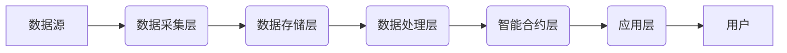

# 企业估值中的区块链医疗数据交换平台评估

> 关键词：企业估值、区块链、医疗数据交换平台、评估方法、价值驱动因素

> 摘要：本文聚焦于企业估值中区块链医疗数据交换平台的评估。首先介绍了区块链医疗数据交换平台产生的背景和研究的目的范围等内容，接着阐述了区块链、医疗数据交换平台等核心概念及其联系。详细讲解了用于评估该平台的核心算法原理，包括使用 Python 代码实现的具体操作步骤，并给出相关数学模型和公式进行深入剖析。通过项目实战展示了开发环境搭建、源代码实现与解读。探讨了该平台的实际应用场景，推荐了学习资源、开发工具框架以及相关论文著作。最后总结了其未来发展趋势与挑战，提供常见问题解答和扩展阅读参考资料，旨在为准确评估区块链医疗数据交换平台的价值提供全面的理论和实践指导。

## 1. 背景介绍 
### 1.1 目的和范围
在当今数字化医疗时代，医疗数据的规模呈爆炸式增长，其蕴含的巨大价值日益凸显。然而，医疗数据的分散性、隐私性和安全性等问题严重制约了数据的有效利用和共享。区块链技术以其去中心化、不可篡改、可追溯等特性，为医疗数据交换提供了创新的解决方案，众多企业纷纷投身于区块链医疗数据交换平台的建设。对这些平台进行准确估值，有助于投资者做出合理的投资决策，企业制定科学的发展战略，同时也为监管部门提供有效的监管依据。

本文章的范围涵盖了区块链医疗数据交换平台的各个方面，包括平台的技术架构、业务模式、市场前景、竞争优势等，旨在建立一套全面、科学、合理的评估体系，对该类平台的价值进行准确评估。

### 1.2 预期读者
本文的预期读者主要包括以下几类人群：
1. **投资者**：希望通过对区块链医疗数据交换平台的准确估值，发现具有投资潜力的项目，实现资产的增值。
2. **企业管理者**：了解自身平台的价值，为企业的战略规划、融资、并购等决策提供参考依据。
3. **科研人员**：为相关领域的学术研究提供理论和实践参考，推动区块链医疗数据交换平台的技术创新和应用发展。
4. **监管部门人员**：掌握区块链医疗数据交换平台的价值评估方法，为制定合理的监管政策提供依据，保障行业的健康发展。

### 1.3 文档结构概述
本文共分为十个部分。第一部分背景介绍，阐述了研究的目的、范围、预期读者和文档结构概述，并对相关术语进行了定义和解释。第二部分介绍了区块链、医疗数据交换平台等核心概念及其联系，通过文本示意图和 Mermaid 流程图进行直观展示。第三部分详细讲解了核心算法原理，使用 Python 代码展示具体操作步骤。第四部分给出数学模型和公式，并进行详细讲解和举例说明。第五部分通过项目实战，介绍开发环境搭建、源代码实现与解读。第六部分探讨了该平台的实际应用场景。第七部分推荐了学习资源、开发工具框架以及相关论文著作。第八部分总结了未来发展趋势与挑战。第九部分提供常见问题解答。第十部分为扩展阅读和参考资料。

### 1.4 术语表
#### 1.4.1 核心术语定义
1. **区块链**：一种去中心化的分布式账本技术，通过密码学算法将数据块按时间顺序相连，形成链式数据结构，具有不可篡改、可追溯等特点。
2. **医疗数据交换平台**：用于实现医疗数据在不同医疗机构、医疗信息系统之间安全、高效交换和共享的平台。
3. **企业估值**：对企业的整体价值进行评估，确定企业在特定时间点的市场价值。
4. **智能合约**：一种基于区块链技术的自动执行合约，通过代码实现合约条款，当满足预设条件时自动执行。
5. **共识机制**：区块链网络中节点达成一致的算法，确保数据的一致性和安全性。

#### 1.4.2 相关概念解释
1. **去中心化**：与传统的中心化系统不同，区块链系统中没有单一的中心节点，所有节点地位平等，共同维护系统的运行。
2. **加密技术**：用于保护数据的安全性和隐私性，通过加密算法将数据转换为密文，只有授权的用户才能解密查看。
3. **数据共享**：不同主体之间将各自拥有的数据进行交换和使用，以实现数据的更大价值。

#### 1.4.3 缩略词列表
1. **P2P**：Peer - to - Peer，点对点网络。
2. **PoW**：Proof of Work，工作量证明。
3. **PoS**：Proof of Stake，权益证明。
4. **EHR**：Electronic Health Record，电子健康记录。

## 2. 核心概念与联系 

### 核心概念原理
#### 区块链原理
区块链是由一个个数据块组成的链式结构。每个数据块包含了一定时间内的交易信息、时间戳、前一个数据块的哈希值等内容。通过哈希算法，每个数据块的哈希值是唯一的，且与前一个数据块的哈希值相关联，形成了不可篡改的链式结构。区块链网络中的节点通过共识机制达成一致，确保数据的一致性和安全性。常见的共识机制有 PoW、PoS 等。

#### 医疗数据交换平台原理
医疗数据交换平台的主要功能是实现医疗数据的标准化、整合和共享。它通过建立统一的数据标准和接口，将不同医疗机构、医疗信息系统中的数据进行采集、转换和存储，然后根据授权规则，实现数据的安全交换和共享。平台通常采用分布式架构，以提高系统的性能和可靠性。

### 架构的文本示意图
区块链医疗数据交换平台主要由以下几个部分组成：
1. **数据采集层**：负责从各个医疗机构、医疗设备等数据源中采集医疗数据。
2. **数据存储层**：采用区块链技术和传统数据库相结合的方式，对采集到的医疗数据进行存储和管理。
3. **数据处理层**：对存储的数据进行清洗、转换、挖掘等处理，以提高数据的质量和价值。
4. **智能合约层**：实现数据访问控制、数据共享规则等自动化执行，确保数据的安全和合规性。
5. **应用层**：为不同的用户提供数据查询、分析、决策支持等应用服务。

### Mermaid 流程图


## 3. 核心算法原理 & 具体操作步骤 

### 核心算法原理
在评估区块链医疗数据交换平台时，我们可以采用收益法中的现金流折现模型（DCF）。该模型的基本原理是将平台未来的预期现金流按照一定的折现率折现到当前时刻，从而得到平台的现值。

### 具体操作步骤及 Python 代码实现
以下是使用 Python 实现现金流折现模型的具体步骤和代码：

```python
import numpy as np

def dcf_valuation(cash_flows, discount_rate):
    """
    计算现金流折现模型的平台价值
    :param cash_flows: 未来各期的现金流列表
    :param discount_rate: 折现率
    :return: 平台的现值
    """
    n = len(cash_flows)
    present_values = []
    for i in range(n):
        present_value = cash_flows[i] / (1 + discount_rate) ** (i + 1)
        present_values.append(present_value)
    total_value = np.sum(present_values)
    return total_value

# 示例数据
cash_flows = [100, 120, 150, 180, 200]  # 未来 5 年的现金流
discount_rate = 0.1  # 折现率为 10%

platform_value = dcf_valuation(cash_flows, discount_rate)
print(f"区块链医疗数据交换平台的估值为: {platform_value}")
```

### 代码解释
1. **函数定义**：`dcf_valuation` 函数接受两个参数，`cash_flows` 表示未来各期的现金流列表，`discount_rate` 表示折现率。
2. **计算现值**：通过循环遍历现金流列表，将每期的现金流按照折现率折现到当前时刻，得到每期的现值。
3. **求和**：将每期的现值相加，得到平台的总现值。
4. **返回结果**：返回平台的现值。

## 4. 数学模型和公式 & 详细讲解 & 举例说明 

### 数学模型和公式
现金流折现模型的数学公式为：

$$V = \sum_{t = 1}^{n}\frac{CF_t}{(1 + r)^t}$$

其中：
- $V$ 表示平台的现值。
- $CF_t$ 表示第 $t$ 期的现金流。
- $r$ 表示折现率。
- $n$ 表示预测期数。

### 详细讲解
该公式的核心思想是将未来不同时期的现金流按照一定的折现率折现到当前时刻，因为未来的现金流具有不确定性，且货币具有时间价值，所以需要进行折现。折现率 $r$ 反映了投资者对投资风险的预期，风险越高，折现率越高。

### 举例说明
假设一个区块链医疗数据交换平台未来 3 年的现金流分别为 80 万元、100 万元和 120 万元，折现率为 12%。则该平台的现值计算如下：

第 1 年现金流的现值：

$$PV_1=\frac{80}{(1 + 0.12)^1}\approx71.43\text{（万元）}$$

第 2 年现金流的现值：

$$PV_2=\frac{100}{(1 + 0.12)^2}\approx79.72\text{（万元）}$$

第 3 年现金流的现值：

$$PV_3=\frac{120}{(1 + 0.12)^3}\approx85.41\text{（万元）}$$

平台的现值：

$$V = PV_1+PV_2+PV_3\approx71.43 + 79.72+85.41 = 236.56\text{（万元）}$$

## 5. 项目实战：代码实际案例和详细解释说明 

### 5.1  开发环境搭建
1. **操作系统**：推荐使用 Linux 或 macOS 系统，也可以使用 Windows 系统。
2. **编程语言**：Python 3.x，可从官方网站（https://www.python.org/downloads/） 下载安装。
3. **开发工具**：推荐使用 PyCharm 或 VS Code 作为集成开发环境。
4. **相关库**：安装 `numpy` 库，可使用以下命令：
```sh
pip install numpy
```

### 5.2  源代码详细实现和代码解读
以下是一个更完整的示例代码，考虑了平台的初始投资、增长率等因素：

```python
import numpy as np

def calculate_cash_flows(initial_investment, growth_rate, num_years):
    """
    计算未来各期的现金流
    :param initial_investment: 初始投资
    :param growth_rate: 现金流增长率
    :param num_years: 预测期数
    :return: 未来各期的现金流列表
    """
    cash_flows = []
    current_cash_flow = -initial_investment  # 初始投资为负现金流
    cash_flows.append(current_cash_flow)
    for i in range(1, num_years):
        current_cash_flow = current_cash_flow * (1 + growth_rate)
        cash_flows.append(current_cash_flow)
    return cash_flows

def dcf_valuation(cash_flows, discount_rate):
    """
    计算现金流折现模型的平台价值
    :param cash_flows: 未来各期的现金流列表
    :param discount_rate: 折现率
    :return: 平台的现值
    """
    n = len(cash_flows)
    present_values = []
    for i in range(n):
        present_value = cash_flows[i] / (1 + discount_rate) ** (i)
        present_values.append(present_value)
    total_value = np.sum(present_values)
    return total_value

# 示例数据
initial_investment = 500  # 初始投资 500 万元
growth_rate = 0.1  # 现金流增长率为 10%
num_years = 5  # 预测期为 5 年
discount_rate = 0.12  # 折现率为 12%

# 计算现金流
cash_flows = calculate_cash_flows(initial_investment, growth_rate, num_years)

# 计算平台价值
platform_value = dcf_valuation(cash_flows, discount_rate)
print(f"区块链医疗数据交换平台的估值为: {platform_value} 万元")
```

### 5.3  代码解读与分析
1. **`calculate_cash_flows` 函数**：该函数接受初始投资、增长率和预测期数作为参数，计算未来各期的现金流。初始投资为负现金流，后续各期现金流按照增长率递增。
2. **`dcf_valuation` 函数**：该函数接受现金流列表和折现率作为参数，计算平台的现值。通过将每期现金流按照折现率折现到当前时刻，然后求和得到平台的总现值。
3. **主程序**：设置初始投资、增长率、预测期数和折现率等参数，调用 `calculate_cash_flows` 函数计算现金流，再调用 `dcf_valuation` 函数计算平台价值，并输出结果。

## 6. 实际应用场景 
### 医疗数据共享与互认
区块链医疗数据交换平台可以实现不同医疗机构之间的医疗数据共享与互认。患者在不同医院就诊时，医生可以通过平台快速获取患者的历史病历、检查报告等信息，避免重复检查，提高医疗效率和质量。例如，患者从基层医院转诊到上级医院时，上级医院医生可以直接查看患者在基层医院的检查结果，为诊断和治疗提供参考。

### 药物研发
制药企业可以通过区块链医疗数据交换平台获取大量的真实世界医疗数据，用于药物研发和临床试验。这些数据可以帮助企业更好地了解药物的疗效和安全性，加速药物研发进程。例如，企业可以分析不同患者群体对某种药物的反应，优化药物剂量和治疗方案。

### 医疗保险
保险公司可以利用区块链医疗数据交换平台获取投保人的医疗健康信息，进行风险评估和理赔审核。通过实时、准确的医疗数据，保险公司可以降低欺诈风险，提高理赔效率。例如，在理赔时，保险公司可以直接从平台获取患者的就诊记录和费用明细，核实理赔信息的真实性。

### 医疗监管
监管部门可以通过区块链医疗数据交换平台对医疗机构的医疗行为和数据进行监管。平台的不可篡改和可追溯特性，使得监管部门可以实时监控医疗数据的流动和使用情况，确保医疗数据的安全和合规性。例如，监管部门可以查看医疗机构的数据访问记录，防止数据泄露和滥用。

## 7. 工具和资源推荐
### 7.1 学习资源推荐
#### 7.1.1 书籍推荐
1. 《区块链：从数字货币到信用社会》：全面介绍了区块链的基本概念、技术原理和应用场景，是区块链领域的经典著作。
2. 《医疗大数据：概念、技术与应用》：深入探讨了医疗大数据的相关知识，包括数据采集、存储、分析和应用等方面。
3. 《企业估值：理论与实践》：系统讲解了企业估值的方法和模型，为评估区块链医疗数据交换平台的价值提供了理论基础。

#### 7.1.2 在线课程
1. Coursera 上的 “区块链基础” 课程：由知名高校和企业的专家授课，详细介绍了区块链的技术原理和应用。
2. edX 上的 “医疗信息学” 课程：涵盖了医疗信息系统、医疗数据管理等方面的知识。
3. Udemy 上的 “企业估值与财务建模” 课程：通过实际案例，讲解了企业估值的方法和技巧。

#### 7.1.3 技术博客和网站
1. 区块链技术博客：如 Medium 上的区块链相关博客，提供了最新的区块链技术动态和研究成果。
2. 医疗信息化网站：如中国医疗信息化网，关注医疗信息化领域的发展和应用。
3. 金融投资网站：如雪球网、东方财富网等，提供了企业估值和投资分析的相关资讯和工具。

### 7.2 开发工具框架推荐
#### 7.2.1 IDE和编辑器
1. PyCharm：功能强大的 Python 集成开发环境，提供了代码编辑、调试、版本控制等功能。
2. VS Code：轻量级的代码编辑器，支持多种编程语言和插件扩展，适合快速开发和调试。

#### 7.2.2 调试和性能分析工具
1. PDB：Python 内置的调试器，可以帮助开发者定位和解决代码中的问题。
2. cProfile：Python 的性能分析工具，可以分析代码的执行时间和内存使用情况，优化代码性能。

#### 7.2.3 相关框架和库
1. Hyperledger Fabric：开源的区块链框架，提供了企业级的区块链解决方案，适合开发区块链医疗数据交换平台。
2. NumPy：Python 的数值计算库，提供了高效的数组操作和数学函数，用于实现现金流折现模型等算法。
3. Pandas：Python 的数据处理库，用于数据的清洗、转换和分析，可用于处理医疗数据。

### 7.3 相关论文著作推荐
#### 7.3.1 经典论文
1. “Bitcoin: A Peer - to - Peer Electronic Cash System”：比特币的白皮书，奠定了区块链技术的基础。
2. “The Promise of Blockchain Technology for Healthcare”：探讨了区块链技术在医疗领域的应用前景和挑战。
3. “Valuation of High - Tech Start - Ups: A Literature Review”：对高科技初创企业的估值方法进行了综述。

#### 7.3.2 最新研究成果
可以通过 IEEE Xplore、ACM Digital Library、ScienceDirect 等学术数据库，搜索关于区块链医疗数据交换平台和企业估值的最新研究论文。

#### 7.3.3 应用案例分析
可以参考行业报告、企业案例研究等资料，了解区块链医疗数据交换平台的实际应用案例和价值评估方法。例如，一些咨询公司发布的区块链医疗应用案例报告，分析了不同平台的业务模式、技术架构和经济价值。

## 8. 总结：未来发展趋势与挑战
### 未来发展趋势
1. **技术创新**：随着区块链技术的不断发展，新的共识机制、智能合约技术等将不断涌现，提高区块链医疗数据交换平台的性能和安全性。例如，权益证明（PoS）等共识机制将逐渐取代工作量证明（PoW），降低能源消耗，提高交易速度。
2. **应用拓展**：区块链医疗数据交换平台的应用场景将不断拓展，除了医疗数据共享、药物研发、医疗保险等领域，还将在医疗物联网、精准医疗等领域发挥重要作用。例如，通过与医疗物联网设备的结合，实现实时医疗数据的采集和共享。
3. **产业融合**：区块链医疗数据交换平台将与医疗行业的其他产业进行深度融合，形成完整的医疗生态系统。例如，与医疗设备制造商、医药企业、金融机构等合作，实现数据、技术、资金等资源的共享和优化配置。
4. **国际化发展**：随着全球医疗数据共享需求的增加，区块链医疗数据交换平台将逐渐走向国际化。不同国家和地区的医疗机构和企业将通过平台进行合作，推动全球医疗资源的优化配置和医疗水平的提升。

### 挑战
1. **技术难题**：区块链技术目前还存在性能瓶颈、可扩展性差等问题，需要进一步优化和改进。例如，区块链网络的交易处理速度较慢，难以满足大规模医疗数据交换的需求。
2. **法律法规**：区块链医疗数据交换平台涉及到医疗数据的隐私和安全问题，需要建立完善的法律法规和监管制度。目前，相关的法律法规还不够完善，给平台的发展带来了一定的风险。
3. **标准统一**：医疗数据的标准不统一，不同医疗机构和信息系统之间的数据格式和编码方式存在差异，给数据的交换和共享带来了困难。需要建立统一的医疗数据标准和接口规范。
4. **用户接受度**：医疗机构和患者对区块链医疗数据交换平台的接受度还需要提高。部分医疗机构担心数据安全和隐私问题，患者对个人医疗数据的共享存在疑虑。需要加强宣传和教育，提高用户的认知和信任度。

## 9. 附录：常见问题与解答
### 1. 区块链医疗数据交换平台如何保证数据的安全性？
区块链医疗数据交换平台通过多种技术手段保证数据的安全性。首先，采用加密技术对数据进行加密，只有授权的用户才能解密查看。其次，区块链的去中心化和不可篡改特性，使得数据一旦上链就无法被篡改，保证了数据的完整性。此外，智能合约可以实现数据访问控制，只有满足预设条件的用户才能访问数据。

### 2. 如何确定现金流折现模型中的折现率？
折现率的确定需要考虑多种因素，包括市场利率、行业风险、企业的财务状况等。一般来说，可以参考同行业类似企业的折现率，或者采用资本资产定价模型（CAPM）来计算折现率。CAPM 公式为：$r = R_f+\beta\times(R_m - R_f)$，其中 $r$ 为折现率，$R_f$ 为无风险利率，$\beta$ 为企业的贝塔系数，$R_m$ 为市场收益率。

### 3. 区块链医疗数据交换平台的建设成本主要包括哪些方面？
区块链医疗数据交换平台的建设成本主要包括以下几个方面：
1. **技术研发成本**：包括区块链技术的研发、数据采集和处理系统的开发等。
2. **硬件设备成本**：如服务器、存储设备等。
3. **人员培训成本**：对相关人员进行区块链技术、医疗数据管理等方面的培训。
4. **运营维护成本**：包括系统的日常维护、数据更新等。

### 4. 区块链医疗数据交换平台与传统医疗数据交换系统有什么区别？
区块链医疗数据交换平台与传统医疗数据交换系统相比，具有以下几个方面的区别：
1. **去中心化**：传统医疗数据交换系统通常采用中心化架构，存在单点故障和数据安全风险。而区块链医疗数据交换平台采用去中心化架构，所有节点共同维护系统的运行，提高了系统的可靠性和安全性。
2. **不可篡改**：区块链的不可篡改特性使得医疗数据一旦上链就无法被篡改，保证了数据的真实性和完整性。而传统医疗数据交换系统的数据容易被篡改。
3. **可追溯**：区块链医疗数据交换平台可以实现数据的全程追溯，方便监管和审计。而传统医疗数据交换系统的数据追溯较为困难。

## 10. 扩展阅读 & 参考资料
### 扩展阅读
1. 《区块链技术进阶与实战》：深入介绍了区块链的底层技术和应用开发，适合有一定基础的读者进一步学习。
2. 《医疗数据挖掘与分析》：详细讲解了医疗数据挖掘的方法和技术，为利用医疗数据提供了更多的思路。
3. 《金融科技前沿》：关注金融科技领域的最新发展动态，包括区块链在金融领域的应用，对理解区块链医疗数据交换平台的金融属性有一定的帮助。

### 参考资料
1. 相关的行业标准和规范，如《医疗信息系统基本功能规范》《电子病历共享文档规范》等。
2. 政府发布的关于区块链和医疗信息化的政策文件，如《“健康中国 2030” 规划纲要》《关于促进 “互联网 + 医疗健康” 发展的意见》等。
3. 企业的年报、招股说明书等公开资料，了解企业的业务模式、财务状况和发展战略。