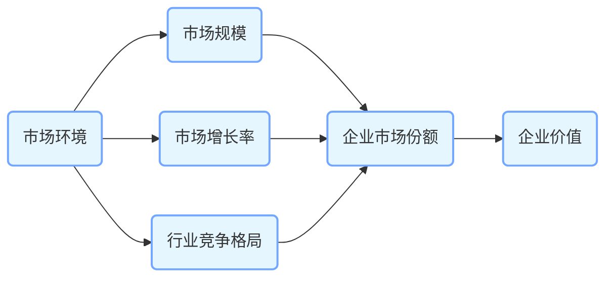

# 企业估值中的市场份额价值法

> 关键词：企业估值、市场份额价值法、市场竞争、行业分析、价值评估

> 摘要：本文聚焦于企业估值中的市场份额价值法，深入探讨其核心概念、算法原理、数学模型等内容。通过详细的理论阐述和实际案例分析，展示该方法在企业估值中的应用过程。同时，介绍了相关的工具和资源，分析了其未来发展趋势与挑战，旨在为读者全面呈现市场份额价值法在企业估值领域的重要性和实用性，帮助读者更好地理解和运用这一方法进行企业价值评估。

## 1. 背景介绍 
### 1.1 目的和范围
企业估值是金融领域和企业管理中的重要环节，准确评估企业价值对于投资者决策、企业战略规划等具有关键意义。市场份额价值法作为一种独特的企业估值方法，其目的在于通过分析企业在市场中的份额情况，结合市场整体规模和行业特点，来确定企业的价值。本文的范围将涵盖市场份额价值法的理论基础、计算方法、实际应用案例以及相关工具资源等方面，旨在全面深入地剖析这一方法。

### 1.2 预期读者
本文预期读者包括金融从业者，如投资经理、分析师等，他们需要通过各种估值方法来评估企业价值，为投资决策提供依据；企业管理者，他们可以借助市场份额价值法了解自身企业在市场中的价值地位，制定合理的战略规划；以及对企业估值领域感兴趣的学者和研究人员，为他们的学术研究和学习提供参考。

### 1.3 文档结构概述
本文首先介绍市场份额价值法的背景信息，包括目的、预期读者和文档结构。接着阐述核心概念与联系，展示其原理和架构。然后详细讲解核心算法原理及具体操作步骤，并用 Python 代码进行说明。之后介绍数学模型和公式，并举例说明。通过项目实战，呈现代码实际案例和详细解释。再探讨实际应用场景，推荐相关工具和资源。最后总结未来发展趋势与挑战，解答常见问题，并提供扩展阅读和参考资料。

### 1.4 术语表
#### 1.4.1 核心术语定义
- **企业估值**：对企业的整体价值进行评估的过程，综合考虑企业的资产、负债、盈利能力、市场地位等多种因素。
- **市场份额价值法**：一种基于企业在市场中所占份额，结合市场规模和行业特性来评估企业价值的方法。
- **市场份额**：企业的产品或服务在特定市场中所占的比例，通常以销售额、销售量等指标来衡量。

#### 1.4.2 相关概念解释
- **行业集中度**：反映行业内企业规模分布的指标，体现了市场竞争的激烈程度。高行业集中度意味着少数大企业占据了市场的大部分份额。
- **市场增长率**：衡量市场规模在一定时期内增长的速度，反映了市场的发展趋势。

#### 1.4.3 缩略词列表
- **PE**：市盈率（Price - Earnings Ratio），是股票价格除以每股收益的比率，用于评估股票的估值水平。
- **DCF**：现金流折现法（Discounted Cash Flow），通过预测企业未来的现金流并折现到当前来评估企业价值。

## 2. 核心概念与联系 

市场份额价值法的核心思想是企业的价值与其在市场中的份额密切相关。一般来说，市场份额越大，企业在市场中的竞争力越强，其价值也相对越高。

### 原理阐述
在一个特定的市场中，市场规模是有限的。企业通过自身的产品、服务、品牌等优势，在市场中占据一定的份额。市场份额的大小反映了企业的市场竞争力和市场地位。同时，市场的增长潜力、行业的竞争格局等因素也会影响企业市场份额的价值。例如，在一个快速增长的市场中，即使企业的市场份额较小，但由于市场整体规模的快速扩大，企业也有较大的发展空间，其市场份额的价值也会相应提高。

### 架构示意图


这个流程图展示了市场环境因素如何影响企业的市场份额，进而影响企业的价值。市场规模、市场增长率和行业竞争格局是影响企业市场份额的重要因素，而企业的市场份额最终决定了其在市场中的价值。

## 3. 核心算法原理 & 具体操作步骤 

### 核心算法原理
市场份额价值法的核心算法基于以下思路：首先确定目标市场的总价值，然后根据企业在该市场中的份额，计算出企业的市场份额价值。具体公式为：

企业市场份额价值 = 目标市场总价值 × 企业市场份额

### 具体操作步骤
1. **确定目标市场**：明确企业所处的市场范围，这需要考虑产品或服务的类型、地域范围、客户群体等因素。例如，一家生产智能手机的企业，其目标市场可以是全球智能手机市场，也可以是某个特定地区（如中国市场）的智能手机市场。
2. **评估目标市场总价值**：可以通过多种方法来评估目标市场的总价值，如收集市场研究报告、行业统计数据等。常见的方法包括基于销售额、销售量、利润等指标进行估算。例如，根据市场研究机构的数据，某地区的智能手机市场在某一年的总销售额为 1000 亿元，那么这个 1000 亿元就可以作为该目标市场的总价值。
3. **计算企业市场份额**：企业市场份额可以通过企业的销售额、销售量等指标与目标市场的相应指标进行比较来计算。例如，某智能手机企业在该地区的年销售额为 200 亿元，而该地区智能手机市场的总销售额为 1000 亿元，那么该企业的市场份额为 200 ÷ 1000 = 20%。
4. **计算企业市场份额价值**：将目标市场总价值乘以企业市场份额，即可得到企业的市场份额价值。在上述例子中，企业的市场份额价值 = 1000 亿元 × 20% = 200 亿元。

### Python 代码实现
```python
# 定义函数来计算企业市场份额价值
def calculate_market_share_value(total_market_value, market_share):
    """
    此函数用于计算企业的市场份额价值
    :param total_market_value: 目标市场总价值
    :param market_share: 企业市场份额（以小数形式表示）
    :return: 企业市场份额价值
    """
    return total_market_value * market_share

# 示例数据
total_market_value = 1000  # 目标市场总价值（单位：亿元）
market_share = 0.2  # 企业市场份额（20%）

# 计算企业市场份额价值
market_share_value = calculate_market_share_value(total_market_value, market_share)

print(f"企业的市场份额价值为: {market_share_value} 亿元")
```
在这段代码中，我们定义了一个名为 `calculate_market_share_value` 的函数，它接受目标市场总价值和企业市场份额作为参数，返回企业的市场份额价值。然后我们给出了示例数据，并调用该函数进行计算，最后打印出计算结果。

## 4. 数学模型和公式 & 详细讲解 & 举例说明 

### 数学模型和公式
企业市场份额价值的基本数学模型可以表示为：

$$V = M \times S$$

其中：
- $V$ 表示企业的市场份额价值
- $M$ 表示目标市场的总价值
- $S$ 表示企业的市场份额

### 详细讲解
这个公式的原理在于，目标市场的总价值代表了整个市场的潜在价值，而企业的市场份额则表示企业在这个潜在价值中所占的比例。通过将两者相乘，就可以得到企业在市场中所占据的价值。

### 举例说明
假设某服装市场的总销售额（即目标市场总价值 $M$）为 500 亿元，某服装企业的销售额为 50 亿元。则该企业的市场份额 $S$ 为：

$$S=\frac{50}{500}=0.1$$

根据上述公式，该企业的市场份额价值 $V$ 为：

$$V = M \times S = 500\times0.1 = 50\text{（亿元）}$$

这意味着，根据市场份额价值法，该服装企业在这个服装市场中的价值为 50 亿元。

## 5. 项目实战：代码实际案例和详细解释说明 

### 5.1  开发环境搭建
为了实现市场份额价值法的代码，我们可以使用 Python 语言。以下是搭建开发环境的步骤：
1. **安装 Python**：访问 Python 官方网站（https://www.python.org/downloads/），根据自己的操作系统选择合适的 Python 版本进行下载和安装。建议安装 Python 3.6 及以上版本。
2. **安装开发工具**：可以选择使用 PyCharm、VS Code 等集成开发环境（IDE），也可以使用 Jupyter Notebook 进行交互式开发。这里以 PyCharm 为例，访问 JetBrains 官方网站（https://www.jetbrains.com/pycharm/download/） 下载并安装 PyCharm。
3. **创建项目**：打开 PyCharm，选择“Create New Project”，选择合适的项目路径和 Python 解释器，创建一个新的 Python 项目。

### 5.2  源代码详细实现和代码解读
```python
# 导入必要的库
import pandas as pd

# 定义函数来读取市场数据
def read_market_data(file_path):
    """
    此函数用于读取市场数据文件
    :param file_path: 市场数据文件的路径
    :return: 包含市场数据的 DataFrame
    """
    try:
        data = pd.read_csv(file_path)
        return data
    except FileNotFoundError:
        print(f"文件 {file_path} 未找到，请检查文件路径。")
        return None

# 定义函数来计算企业市场份额
def calculate_market_share(company_sales, total_market_sales):
    """
    此函数用于计算企业的市场份额
    :param company_sales: 企业的销售额
    :param total_market_sales: 目标市场的总销售额
    :return: 企业的市场份额（以小数形式表示）
    """
    if total_market_sales == 0:
        return 0
    return company_sales / total_market_sales

# 定义函数来计算企业市场份额价值
def calculate_market_share_value(total_market_value, market_share):
    """
    此函数用于计算企业的市场份额价值
    :param total_market_value: 目标市场总价值
    :param market_share: 企业市场份额（以小数形式表示）
    :return: 企业市场份额价值
    """
    return total_market_value * market_share

# 主函数
def main():
    # 读取市场数据文件
    file_path = 'market_data.csv'
    market_data = read_market_data(file_path)

    if market_data is not None:
        # 提取企业销售额和目标市场总销售额
        company_sales = market_data['company_sales'].values[0]
        total_market_sales = market_data['total_market_sales'].values[0]

        # 计算企业市场份额
        market_share = calculate_market_share(company_sales, total_market_sales)

        # 假设目标市场总价值
        total_market_value = 800  # 单位：亿元

        # 计算企业市场份额价值
        market_share_value = calculate_market_share_value(total_market_value, market_share)

        print(f"企业的市场份额为: {market_share * 100:.2f}%")
        print(f"企业的市场份额价值为: {market_share_value:.2f} 亿元")

if __name__ == "__main__":
    main()
```

### 5.3  代码解读与分析
1. **读取市场数据**：`read_market_data` 函数使用 `pandas` 库的 `read_csv` 函数读取市场数据文件。如果文件不存在，会捕获 `FileNotFoundError` 异常并输出错误信息。
2. **计算企业市场份额**：`calculate_market_share` 函数根据企业的销售额和目标市场的总销售额计算企业的市场份额。如果目标市场总销售额为 0，则返回 0。
3. **计算企业市场份额价值**：`calculate_market_share_value` 函数根据目标市场总价值和企业市场份额计算企业的市场份额价值。
4. **主函数**：`main` 函数首先调用 `read_market_data` 函数读取市场数据，然后提取企业销售额和目标市场总销售额，计算企业市场份额和市场份额价值，最后输出结果。

## 6. 实际应用场景 
### 投资决策
在投资领域，市场份额价值法可以帮助投资者评估企业的价值，从而做出投资决策。例如，当投资者考虑投资一家新兴的科技企业时，可以通过分析该企业在相关市场中的份额，结合市场规模和增长潜力，评估其市场份额价值。如果该企业的市场份额价值较高，且市场增长潜力大，那么该企业可能具有较高的投资价值。

### 企业战略规划
企业管理者可以使用市场份额价值法来制定战略规划。通过了解企业在市场中的份额价值，管理者可以明确企业的市场地位和竞争优势。如果企业的市场份额价值较低，管理者可以考虑采取扩大市场份额的策略，如加大研发投入、拓展销售渠道等；如果企业的市场份额价值较高，管理者可以考虑巩固市场地位，加强品牌建设等。

### 企业并购
在企业并购过程中，市场份额价值法可以用于评估被并购企业的价值。并购方可以通过分析被并购企业在市场中的份额，结合市场规模和行业竞争格局，确定被并购企业的市场份额价值。这有助于并购方制定合理的并购价格，避免过高或过低的估值。

## 7. 工具和资源推荐
### 7.1 学习资源推荐
#### 7.1.1 书籍推荐
- 《企业估值：理论与实践》：全面介绍了企业估值的各种方法，包括市场份额价值法等，对每种方法的原理、应用和案例都有详细的阐述。
- 《投资估值手册》：提供了丰富的估值模型和案例分析，有助于读者深入理解企业估值的方法和技巧。

#### 7.1.2 在线课程
- Coursera 上的“企业估值与投资决策”课程：由知名教授授课，涵盖了企业估值的多个方面，包括市场份额价值法的应用。
- edX 上的“金融估值原理”课程：系统地介绍了金融估值的原理和方法，对市场份额价值法有深入的讲解。

#### 7.1.3 技术博客和网站
- Seeking Alpha：提供了大量的金融分析和企业估值相关的文章，其中不乏关于市场份额价值法的讨论和案例分析。
- Investopedia：一个专业的金融知识网站，对企业估值的各种方法都有详细的解释和说明。

### 7.2 开发工具框架推荐
#### 7.2.1 IDE和编辑器
- PyCharm：一款功能强大的 Python 集成开发环境，提供了代码编辑、调试、版本控制等多种功能，适合开发市场份额价值法相关的 Python 代码。
- VS Code：一款轻量级的代码编辑器，支持多种编程语言，通过安装相关插件可以方便地进行 Python 开发。

#### 7.2.2 调试和性能分析工具
- PDB：Python 自带的调试工具，可以帮助开发者定位代码中的问题。
- cProfile：Python 的性能分析工具，可以分析代码的运行时间和函数调用情况，帮助优化代码性能。

#### 7.2.3 相关框架和库
- Pandas：一个强大的数据处理和分析库，用于读取、处理和分析市场数据。
- NumPy：用于进行数值计算和数组操作，在市场份额价值法的计算中可以提高计算效率。

### 7.3 相关论文著作推荐
#### 7.3.1 经典论文
- “The Theory of Market Value and the Valuation of Firms”：该论文深入探讨了市场价值的理论基础和企业估值的方法，对市场份额价值法的理论发展有重要贡献。
- “Valuation of Firms Based on Market Share: A New Approach”：提出了一种基于市场份额的企业估值新方法，对市场份额价值法的应用有一定的指导意义。

#### 7.3.2 最新研究成果
- 近年来，一些学者在市场份额价值法的基础上，结合机器学习和大数据技术，提出了更精准的企业估值模型。相关研究成果可以在学术数据库（如 IEEE Xplore、ACM Digital Library 等）中查找。

#### 7.3.3 应用案例分析
- 一些行业研究报告和商业案例分析中，会详细介绍市场份额价值法在不同行业和企业中的应用案例。可以通过专业的商业资讯平台（如 Bloomberg、Reuters 等）获取相关信息。

## 8. 总结：未来发展趋势与挑战
### 未来发展趋势
- **与大数据和人工智能的结合**：随着大数据和人工智能技术的发展，市场份额价值法可以利用更多的数据来源和更先进的算法进行企业估值。例如，通过分析社交媒体数据、用户行为数据等，更准确地评估企业的市场份额和市场价值。
- **多方法融合**：未来，市场份额价值法可能会与其他估值方法（如现金流折现法、市盈率法等）相结合，综合考虑企业的财务状况、市场地位、发展潜力等因素，提高估值的准确性。
- **应用领域的拓展**：市场份额价值法不仅可以应用于传统的金融投资领域，还可以拓展到新兴行业和领域，如共享经济、区块链等，为这些行业的企业估值提供新的方法和思路。

### 挑战
- **数据准确性和可靠性**：市场份额价值法的计算依赖于准确的市场数据和企业数据。然而，数据的收集和整理过程中可能存在误差和偏差，影响估值的准确性。因此，如何确保数据的准确性和可靠性是一个重要的挑战。
- **市场变化的不确定性**：市场环境是不断变化的，市场规模、市场增长率、行业竞争格局等因素都可能发生变化。这些变化会影响企业的市场份额和市场价值，增加了估值的难度和不确定性。
- **行业差异的影响**：不同行业的市场特点和竞争格局存在较大差异，市场份额价值法在不同行业中的应用效果可能不同。如何根据行业特点进行合理的调整和应用，是需要解决的问题。

## 9. 附录：常见问题与解答
### 问题 1：市场份额价值法适用于所有企业吗？
答：市场份额价值法并不适用于所有企业。它更适用于那些市场份额相对稳定、市场竞争较为充分的行业和企业。对于一些新兴行业或处于快速发展阶段的企业，由于市场环境变化较大，市场份额可能不稳定，使用市场份额价值法进行估值可能存在一定的局限性。

### 问题 2：如何确定目标市场的总价值？
答：确定目标市场的总价值可以通过多种方法。常见的方法包括收集市场研究报告、行业统计数据等。也可以根据目标市场的销售额、销售量、利润等指标进行估算。此外，还可以参考同行业其他企业的估值情况和市场交易价格。

### 问题 3：市场份额价值法与其他估值方法有什么区别？
答：市场份额价值法主要侧重于企业在市场中的份额情况，通过市场份额来评估企业的价值。而其他估值方法，如现金流折现法侧重于企业未来的现金流，市盈率法侧重于企业的盈利水平。不同的估值方法有不同的侧重点和适用场景，在实际应用中可以根据具体情况选择合适的方法。

## 10. 扩展阅读 & 参考资料
### 扩展阅读
- 《金融市场学》：深入介绍金融市场的运行机制和各种金融工具，有助于更好地理解企业估值的背景和意义。
- 《竞争战略》：探讨企业在市场竞争中的战略选择，对分析企业的市场地位和市场份额有一定的帮助。

### 参考资料
- 相关行业研究报告和统计数据，如市场调研机构发布的行业分析报告、政府部门发布的统计数据等。
- 学术期刊和会议论文，如《Journal of Financial Economics》、《Review of Financial Studies》等。
- 企业的财务报表和公告，这些资料可以提供企业的实际经营数据和财务状况。