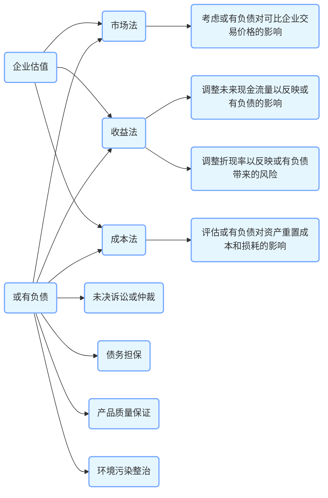

# 企业估值中的或有负债处理方法

> 关键词：企业估值、或有负债、处理方法、估值模型、风险评估

> 摘要：本文围绕企业估值中的或有负债处理方法展开深入探讨。首先介绍了企业估值及或有负债的背景知识，明确文章目的、范围、预期读者和文档结构。接着阐述了或有负债的核心概念及其与企业估值的联系，通过文本示意图和 Mermaid 流程图进行清晰展示。详细讲解了处理或有负债的核心算法原理和具体操作步骤，辅以 Python 源代码。从数学模型和公式角度深入剖析，并举例说明。通过项目实战案例，对开发环境搭建、源代码实现及解读进行详细说明。分析了或有负债处理在不同实际应用场景中的情况，推荐了相关的学习资源、开发工具框架以及论文著作。最后总结了未来发展趋势与挑战，还设置了常见问题解答和扩展阅读参考资料，旨在为企业估值中或有负债的处理提供全面、深入的指导。

## 1. 背景介绍 
### 1.1 目的和范围
企业估值是确定企业在特定时间点的经济价值的过程，对于投资者、管理层、债权人等各方都具有重要意义。而或有负债作为一种潜在的债务，可能对企业的财务状况和价值产生重大影响。本文的目的在于深入探讨在企业估值过程中如何合理、准确地处理或有负债，以提高企业估值的准确性和可靠性。

范围涵盖了常见的或有负债类型，如未决诉讼、担保责任、产品质量保证等，以及多种企业估值方法中对或有负债的处理方式，包括市场法、收益法和成本法。

### 1.2 预期读者
本文预期读者包括企业财务管理人员、投资分析师、资产评估师、注册会计师等专业人士，以及对企业估值和财务风险管理感兴趣的学者和学生。

### 1.3 文档结构概述
本文将首先介绍相关的核心概念，包括或有负债的定义、分类以及与企业估值的联系。接着详细阐述处理或有负债的核心算法原理和具体操作步骤，并结合 Python 代码进行说明。然后从数学模型和公式的角度进行深入分析，并举例说明。通过项目实战案例，展示在实际中如何处理或有负债。之后探讨或有负债处理在不同实际应用场景中的情况。推荐相关的学习资源、开发工具框架和论文著作。最后总结未来发展趋势与挑战，解答常见问题，并提供扩展阅读参考资料。

### 1.4 术语表
#### 1.4.1 核心术语定义
- **企业估值**：指评估企业在特定时间点的经济价值，是对企业未来盈利能力和风险水平的综合评估。
- **或有负债**：指过去的交易或事项形成的潜在义务，其存在须通过未来不确定事项的发生或不发生予以证实；或过去的交易或事项形成的现时义务，履行该义务不是很可能导致经济利益流出企业或该义务的金额不能可靠地计量。
- **市场法**：通过比较被评估企业与类似企业在市场上的交易价格，来确定被评估企业的价值。
- **收益法**：通过预测企业未来的收益，并将其折现到评估基准日，来确定企业的价值。
- **成本法**：通过评估企业各项资产的重置成本，减去各项损耗，来确定企业的价值。

#### 1.4.2 相关概念解释
- **潜在义务**：指结果取决于不确定未来事项的可能义务。例如，企业涉及一项未决诉讼，在判决结果出来之前，企业承担的义务就是潜在义务。
- **现时义务**：指企业在现行条件下已承担的义务。例如，企业为其他企业提供担保，当被担保企业出现违约时，企业就承担了现时义务。
- **折现率**：指将未来预期收益折算成现值的比率，反映了资金的时间价值和投资风险。

#### 1.4.3 缩略词列表
- **NPV**：净现值（Net Present Value），指投资项目在未来各期现金流量的现值之和减去初始投资后的余额。
- **IRR**：内部收益率（Internal Rate of Return），指使投资项目净现值为零的折现率。

## 2. 核心概念与联系 

### 2.1 或有负债的分类
或有负债可以分为两类：一类是潜在义务，另一类是现时义务但履行该义务不是很可能导致经济利益流出企业或该义务的金额不能可靠地计量。常见的或有负债类型包括：
- **未决诉讼或仲裁**：企业作为原告或被告涉及的未决法律纠纷，可能导致企业承担赔偿责任。
- **债务担保**：企业为其他企业或个人提供的债务担保，当被担保方无法履行债务时，企业可能需要承担担保责任。
- **产品质量保证**：企业对其销售的产品提供的质量保证，可能需要在未来承担维修、更换或赔偿等费用。
- **环境污染整治**：企业因环境污染问题可能需要承担的整治费用。

### 2.2 或有负债与企业估值的联系
或有负债对企业估值有着重要的影响。在企业估值中，或有负债的存在会增加企业的风险水平，从而降低企业的价值。例如，在收益法中，或有负债可能导致企业未来的现金流量减少，进而降低企业的现值。在市场法中，投资者会考虑企业的或有负债情况，对企业的交易价格产生影响。

### 2.3 文本示意图
```plaintext
企业估值
|
|-- 市场法
|   |-- 考虑或有负债对可比企业交易价格的影响
|
|-- 收益法
|   |-- 调整未来现金流量以反映或有负债的影响
|   |-- 调整折现率以反映或有负债带来的风险
|
|-- 成本法
|   |-- 评估或有负债对资产重置成本和损耗的影响
|
|-- 或有负债
|   |-- 未决诉讼或仲裁
|   |-- 债务担保
|   |-- 产品质量保证
|   |-- 环境污染整治
```

### 2.4 Mermaid 流程图


## 3. 核心算法原理 & 具体操作步骤 

### 3.1 核心算法原理
在企业估值中处理或有负债的核心思想是将或有负债对企业价值的影响纳入估值模型中。常见的方法有两种：一是调整未来现金流量，二是调整折现率。

#### 3.1.1 调整未来现金流量
对于可能导致现金流出的或有负债，如未决诉讼可能的赔偿金额、产品质量保证可能的维修费用等，我们可以在预测企业未来现金流量时，将这些可能的现金流出考虑进去。具体来说，我们可以根据或有负债发生的概率和可能的金额，计算出预期的现金流出，并从未来现金流量中扣除。

#### 3.1.2 调整折现率
或有负债会增加企业的风险水平，因此我们可以通过提高折现率来反映这种风险。折现率的提高会使未来现金流量的现值降低，从而降低企业的价值。

### 3.2 具体操作步骤
#### 3.2.1 识别或有负债
首先，需要对企业的或有负债进行全面的识别。这可以通过查阅企业的财务报表、法律文件、合同协议等资料，以及与企业管理层、法律顾问等进行沟通来实现。

#### 3.2.2 评估或有负债的可能性和金额
对于识别出的或有负债，需要评估其发生的可能性和可能的金额。这可以通过分析相关的法律、市场、技术等因素，以及参考类似案例的经验来进行。

#### 3.2.3 调整未来现金流量
根据或有负债发生的可能性和可能的金额，计算出预期的现金流出，并从未来现金流量中扣除。具体计算公式如下：
$$
\text{调整后的未来现金流量} = \text{原未来现金流量} - \text{预期的或有负债现金流出}
$$

#### 3.2.4 调整折现率
根据或有负债的风险程度，适当提高折现率。折现率的提高幅度可以根据经验或专业判断来确定。

#### 3.2.5 重新计算企业价值
使用调整后的未来现金流量和折现率，重新计算企业的价值。

### 3.3 Python 源代码实现
```python
import numpy as np

def adjust_cash_flows(cash_flows, probability, possible_amount):
    """
    调整未来现金流量以反映或有负债的影响
    :param cash_flows: 原未来现金流量列表
    :param probability: 或有负债发生的概率
    :param possible_amount: 或有负债可能的金额
    :return: 调整后的未来现金流量列表
    """
    expected_outflow = probability * possible_amount
    adjusted_cash_flows = [cf - expected_outflow for cf in cash_flows]
    return adjusted_cash_flows

def adjust_discount_rate(original_rate, risk_factor):
    """
    调整折现率以反映或有负债带来的风险
    :param original_rate: 原折现率
    :param risk_factor: 风险系数
    :return: 调整后的折现率
    """
    adjusted_rate = original_rate + risk_factor
    return adjusted_rate

def calculate_npv(cash_flows, discount_rate):
    """
    计算净现值
    :param cash_flows: 未来现金流量列表
    :param discount_rate: 折现率
    :return: 净现值
    """
    npv = np.npv(discount_rate, cash_flows)
    return npv

# 示例数据
original_cash_flows = [100, 200, 300, 400, 500]
probability = 0.3
possible_amount = 50
original_rate = 0.1
risk_factor = 0.05

# 调整未来现金流量
adjusted_cash_flows = adjust_cash_flows(original_cash_flows, probability, possible_amount)

# 调整折现率
adjusted_rate = adjust_discount_rate(original_rate, risk_factor)

# 计算净现值
npv = calculate_npv(adjusted_cash_flows, adjusted_rate)

print(f"调整后的未来现金流量: {adjusted_cash_flows}")
print(f"调整后的折现率: {adjusted_rate}")
print(f"调整后的净现值: {npv}")
```

## 4. 数学模型和公式 & 详细讲解 & 举例说明 

### 4.1 调整未来现金流量的数学模型和公式
设原未来现金流量为 $CF_t$（$t = 1, 2, \cdots, n$），或有负债发生的概率为 $P$，或有负债可能的金额为 $A$，则调整后的未来现金流量 $CF_t'$ 为：
$$
CF_t' = CF_t - P \times A
$$

### 4.2 调整折现率的数学模型和公式
设原折现率为 $r$，风险系数为 $\beta$，则调整后的折现率 $r'$ 为：
$$
r' = r + \beta
$$

### 4.3 企业价值计算的数学模型和公式
在收益法中，企业价值 $V$ 可以通过计算未来现金流量的净现值来得到。设调整后的未来现金流量为 $CF_t'$（$t = 1, 2, \cdots, n$），调整后的折现率为 $r'$，则企业价值 $V$ 为：
$$
V = \sum_{t = 1}^{n} \frac{CF_t'}{(1 + r')^t}
$$

### 4.4 举例说明
假设某企业未来 5 年的预计现金流量分别为 100 万元、200 万元、300 万元、400 万元和 500 万元，原折现率为 10%。该企业存在一项未决诉讼，根据律师的分析，诉讼败诉的概率为 30%，如果败诉，企业需要赔偿 50 万元。同时，考虑到未决诉讼带来的风险，风险系数为 5%。

#### 4.4.1 调整未来现金流量
根据公式 $CF_t' = CF_t - P \times A$，可得调整后的未来现金流量分别为：
- $CF_1' = 100 - 0.3 \times 50 = 85$（万元）
- $CF_2' = 200 - 0.3 \times 50 = 185$（万元）
- $CF_3' = 300 - 0.3 \times 50 = 285$（万元）
- $CF_4' = 400 - 0.3 \times 50 = 385$（万元）
- $CF_5' = 500 - 0.3 \times 50 = 485$（万元）

#### 4.4.2 调整折现率
根据公式 $r' = r + \beta$，可得调整后的折现率为：
$$
r' = 0.1 + 0.05 = 0.15
$$

#### 4.4.3 计算企业价值
根据公式 $V = \sum_{t = 1}^{n} \frac{CF_t'}{(1 + r')^t}$，可得企业价值为：
$$
V = \frac{85}{(1 + 0.15)^1} + \frac{185}{(1 + 0.15)^2} + \frac{285}{(1 + 0.15)^3} + \frac{385}{(1 + 0.15)^4} + \frac{485}{(1 + 0.15)^5}
$$
```python
import numpy as np

adjusted_cash_flows = [85, 185, 285, 385, 485]
adjusted_rate = 0.15

npv = np.npv(adjusted_rate, adjusted_cash_flows)
print(f"企业价值: {npv} 万元")
```
通过计算可得，企业价值约为 932.78 万元。

## 5. 项目实战：代码实际案例和详细解释说明 

### 5.1  开发环境搭建
#### 5.1.1 安装 Python
首先，需要安装 Python 环境。可以从 Python 官方网站（https://www.python.org/downloads/）下载适合自己操作系统的 Python 版本，并按照安装向导进行安装。

#### 5.1.2 安装必要的库
在本项目中，需要使用 `numpy` 库来进行数值计算。可以使用以下命令来安装 `numpy` 库：
```sh
pip install numpy
```

### 5.2  源代码详细实现和代码解读
```python
import numpy as np

def adjust_cash_flows(cash_flows, probability, possible_amount):
    """
    调整未来现金流量以反映或有负债的影响
    :param cash_flows: 原未来现金流量列表
    :param probability: 或有负债发生的概率
    :param possible_amount: 或有负债可能的金额
    :return: 调整后的未来现金流量列表
    """
    expected_outflow = probability * possible_amount
    adjusted_cash_flows = [cf - expected_outflow for cf in cash_flows]
    return adjusted_cash_flows

def adjust_discount_rate(original_rate, risk_factor):
    """
    调整折现率以反映或有负债带来的风险
    :param original_rate: 原折现率
    :param risk_factor: 风险系数
    :return: 调整后的折现率
    """
    adjusted_rate = original_rate + risk_factor
    return adjusted_rate

def calculate_npv(cash_flows, discount_rate):
    """
    计算净现值
    :param cash_flows: 未来现金流量列表
    :param discount_rate: 折现率
    :return: 净现值
    """
    npv = np.npv(discount_rate, cash_flows)
    return npv

# 示例数据
original_cash_flows = [100, 200, 300, 400, 500]
probability = 0.3
possible_amount = 50
original_rate = 0.1
risk_factor = 0.05

# 调整未来现金流量
adjusted_cash_flows = adjust_cash_flows(original_cash_flows, probability, possible_amount)

# 调整折现率
adjusted_rate = adjust_discount_rate(original_rate, risk_factor)

# 计算净现值
npv = calculate_npv(adjusted_cash_flows, adjusted_rate)

print(f"调整后的未来现金流量: {adjusted_cash_flows}")
print(f"调整后的折现率: {adjusted_rate}")
print(f"调整后的净现值: {npv}")
```

#### 5.2.1 代码解读
- **`adjust_cash_flows` 函数**：该函数接受原未来现金流量列表、或有负债发生的概率和或有负债可能的金额作为输入，计算出预期的现金流出，并从原未来现金流量中扣除，返回调整后的未来现金流量列表。
- **`adjust_discount_rate` 函数**：该函数接受原折现率和风险系数作为输入，将风险系数加到原折现率上，返回调整后的折现率。
- **`calculate_npv` 函数**：该函数接受未来现金流量列表和折现率作为输入，使用 `numpy` 库的 `npv` 函数计算净现值，并返回计算结果。
- **主程序**：定义了示例数据，调用 `adjust_cash_flows` 函数调整未来现金流量，调用 `adjust_discount_rate` 函数调整折现率，最后调用 `calculate_npv` 函数计算净现值，并将结果打印输出。

### 5.3  代码解读与分析
通过上述代码，我们可以看到如何在企业估值中处理或有负债。首先，我们通过调整未来现金流量和折现率，将或有负债的影响纳入到估值模型中。然后，使用调整后的未来现金流量和折现率计算净现值，得到调整后的企业价值。

需要注意的是，在实际应用中，或有负债的概率和金额的评估可能存在一定的主观性，需要结合专业知识和经验进行判断。同时，不同的估值方法对或有负债的处理方式可能会有所不同，需要根据具体情况进行选择。

## 6. 实际应用场景 
### 6.1 企业并购
在企业并购中，收购方需要对目标企业进行全面的估值。或有负债是一个重要的考虑因素，因为它可能会对目标企业的价值产生重大影响。例如，如果目标企业存在未决诉讼或大额担保责任，收购方需要评估这些或有负债的可能性和金额，并在估值中进行相应的调整。否则，可能会导致收购价格过高，给收购方带来潜在的损失。

### 6.2 企业上市
企业在上市过程中，需要向投资者披露其财务状况和经营情况。或有负债作为一种潜在的风险，需要在招股说明书中进行详细披露。同时，证券监管机构也会关注企业的或有负债情况，要求企业对其进行合理的估值和处理。如果企业未能妥善处理或有负债，可能会影响其上市进程和股价表现。

### 6.3 企业融资
企业在进行融资时，如银行贷款、发行债券等，金融机构会对企业的信用状况和还款能力进行评估。或有负债会增加企业的财务风险，影响金融机构对企业的信用评级和融资额度。因此，企业需要在融资过程中向金融机构如实披露或有负债情况，并提供合理的处理方案。

### 6.4 企业清算
在企业清算时，需要对企业的资产和负债进行全面清查。或有负债作为一种潜在的负债，也需要进行评估和处理。如果或有负债最终转化为实际负债，将影响企业清算财产的分配顺序和金额。

## 7. 工具和资源推荐
### 7.1 学习资源推荐
#### 7.1.1 书籍推荐
- 《企业估值：理论与实践》：本书系统介绍了企业估值的各种方法和技术，包括市场法、收益法和成本法，并对或有负债等特殊问题进行了深入探讨。
- 《财务风险管理》：该书主要讲解了企业面临的各种财务风险，包括或有负债风险的识别、评估和管理方法。
- 《资产评估学》：全面介绍了资产评估的基本理论和方法，对企业估值中的或有负债处理有详细的阐述。

#### 7.1.2 在线课程
- Coursera 平台上的“企业估值与财务建模”课程：由知名高校教授授课，涵盖了企业估值的核心内容和实际操作技巧。
- Udemy 平台上的“财务风险管理实战”课程：通过实际案例分析，讲解如何识别和处理企业的或有负债风险。

#### 7.1.3 技术博客和网站
- 中国资产评估协会官网：提供了大量关于企业估值和资产评估的政策法规、行业动态和技术文章。
- 财新网、华尔街见闻等财经媒体网站：经常发布有关企业财务和估值的分析文章，其中不乏对或有负债处理的案例分析。

### 7.2 开发工具框架推荐
#### 7.2.1 IDE和编辑器
- PyCharm：一款专业的 Python 集成开发环境，具有代码编辑、调试、版本控制等功能，适合进行企业估值相关的 Python 代码开发。
- Jupyter Notebook：一种交互式的开发环境，支持 Python 代码的编写、运行和可视化展示，方便进行数据分析和模型验证。

#### 7.2.2 调试和性能分析工具
- Py-Spy：一款轻量级的 Python 性能分析工具，可以帮助开发者找出代码中的性能瓶颈。
- PDB：Python 自带的调试器，可以在代码中设置断点，逐步执行代码，帮助开发者定位和解决问题。

#### 7.2.3 相关框架和库
- `numpy`：一个强大的 Python 数值计算库，提供了高效的数组操作和数学函数，在企业估值的数值计算中广泛应用。
- `pandas`：一个用于数据处理和分析的 Python 库，提供了灵活的数据结构和数据操作方法，方便处理和分析企业的财务数据。

### 7.3 相关论文著作推荐
#### 7.3.1 经典论文
- “Valuation of Contingent Liabilities in Corporate Valuation”：该论文深入研究了企业估值中或有负债的处理方法，提出了一些新的估值模型和思路。
- “Risk Assessment and Valuation of Contingent Liabilities”：探讨了如何对或有负债进行风险评估和估值，为企业估值提供了重要的参考。

#### 7.3.2 最新研究成果
- 近年来，随着人工智能和大数据技术的发展，一些学者开始将这些技术应用于企业估值中或有负债的处理。例如，利用机器学习算法预测或有负债发生的概率和金额。
- 关于或有负债对企业价值影响的实证研究也在不断深入，为企业估值实践提供了更多的经验证据。

#### 7.3.3 应用案例分析
- 一些知名的财经媒体和研究机构会发布企业估值的应用案例分析，其中包括对或有负债处理的详细讨论。这些案例可以帮助我们更好地理解在实际中如何处理或有负债。

## 8. 总结：未来发展趋势与挑战
### 8.1 未来发展趋势
#### 8.1.1 技术应用更加广泛
随着人工智能、大数据、区块链等技术的不断发展，这些技术将在企业估值中或有负债的处理中得到更广泛的应用。例如，利用大数据分析企业的历史数据和行业数据，更准确地评估或有负债发生的概率和金额；利用区块链技术确保或有负债信息的真实性和不可篡改。

#### 8.1.2 估值方法更加多元化
除了传统的市场法、收益法和成本法，未来可能会出现更多新的估值方法和模型，以更好地处理或有负债。例如，基于实物期权理论的估值方法，可以更好地考虑或有负债的不确定性和灵活性。

#### 8.1.3 风险管理更加重要
或有负债作为一种潜在的风险，将受到企业和投资者的更多关注。未来，企业将更加注重或有负债的风险管理，建立完善的风险预警机制和应对措施。

### 8.2 挑战
#### 8.2.1 数据获取和分析难度大
或有负债的信息往往比较隐蔽，数据获取难度较大。同时，由于或有负债的不确定性，对其进行准确的数据分析和预测也具有一定的挑战性。

#### 8.2.2 专业人才短缺
企业估值中或有负债的处理需要具备财务、法律、统计等多方面知识的专业人才。目前，这类专业人才相对短缺，制约了该领域的发展。

#### 8.2.3 法规和政策不完善
目前，关于企业估值中或有负债处理的法规和政策还不够完善，缺乏统一的标准和规范。这给企业和评估机构在实际操作中带来了一定的困难。

## 9. 附录：常见问题与解答
### 9.1 如何准确评估或有负债发生的概率和金额？
评估或有负债发生的概率和金额需要综合考虑多个因素，包括法律、市场、技术等。可以通过查阅相关的法律文件、分析类似案例的经验、咨询专业的法律顾问和行业专家等方式来进行评估。同时，还可以利用统计分析方法和机器学习算法，对历史数据进行分析和预测。

### 9.2 不同估值方法对或有负债的处理有何不同？
- **市场法**：主要通过比较被评估企业与类似企业的交易价格来确定企业价值。在市场法中，需要考虑或有负债对可比企业交易价格的影响，可能会对可比企业的价格进行调整。
- **收益法**：通过预测企业未来的收益并折现来确定企业价值。在收益法中，可以通过调整未来现金流量和折现率来反映或有负债的影响。
- **成本法**：通过评估企业各项资产的重置成本减去损耗来确定企业价值。在成本法中，需要评估或有负债对资产重置成本和损耗的影响。

### 9.3 或有负债处理不当会带来哪些后果？
如果或有负债处理不当，可能会导致企业估值不准确。高估企业价值会使投资者支付过高的价格，增加投资风险；低估企业价值则可能会使企业在融资、并购等活动中遭受损失。同时，或有负债处理不当还可能会引发法律纠纷和监管风险。

## 10. 扩展阅读 & 参考资料
### 10.1 扩展阅读
- 《金融风险管理》：进一步深入了解金融领域的各种风险，包括或有负债风险的管理策略和方法。
- 《公司财务》：全面介绍公司财务的各个方面，对企业估值和或有负债处理有更深入的理论探讨。

### 10.2 参考资料
- 《企业会计准则第 13 号——或有事项》：为或有负债的确认、计量和披露提供了会计准则依据。
- 相关的资产评估准则和规范：如《资产评估基本准则》等，对企业估值中或有负债的处理有具体的要求和指导。