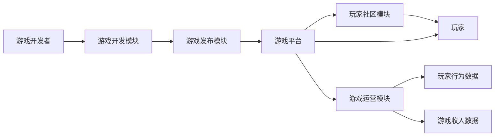

# 企业估值中的脑机接口游戏平台评估

> 关键词：企业估值、脑机接口、游戏平台、评估方法、市场前景

> 摘要：本文聚焦于企业估值中脑机接口游戏平台的评估。随着科技的飞速发展，脑机接口技术在游戏领域的应用逐渐成为热点，相关游戏平台也应运而生。然而，如何对这类新兴企业进行合理估值是一个具有挑战性的问题。文章将深入探讨脑机接口游戏平台的背景、核心概念、评估算法、数学模型，通过项目实战案例详细解读评估过程，分析其实际应用场景，推荐相关工具和资源，并对未来发展趋势与挑战进行总结，旨在为企业估值中脑机接口游戏平台的评估提供全面、系统的参考。

## 1. 背景介绍 
### 1.1 目的和范围
目的在于为投资者、企业管理者以及相关研究人员提供一套全面且科学的脑机接口游戏平台企业估值方法和理论依据。通过对脑机接口游戏平台的技术特点、市场前景、运营模式等多方面的分析，准确评估其企业价值，帮助各方做出合理的决策。范围涵盖了脑机接口游戏平台从技术研发到市场推广的各个环节，包括其核心技术、用户群体、商业模式、竞争态势等因素对企业估值的影响。

### 1.2 预期读者
本文预期读者包括投资机构的分析师和投资人，他们需要准确评估脑机接口游戏平台企业的价值，以做出合理的投资决策；游戏行业的企业管理者，通过了解估值方法，更好地规划企业发展战略，提升企业价值；相关领域的研究人员，为其学术研究和技术创新提供参考；以及对脑机接口游戏感兴趣的爱好者，帮助他们深入了解该行业的商业价值。

### 1.3 文档结构概述
本文首先介绍脑机接口游戏平台评估的背景信息，包括目的、预期读者和文档结构概述等。接着阐述核心概念与联系，明确脑机接口、游戏平台等关键概念的原理和架构。然后详细讲解核心算法原理和具体操作步骤，并给出数学模型和公式进行详细说明。通过项目实战案例，展示代码实现和详细解读。分析脑机接口游戏平台的实际应用场景，推荐相关的工具和资源。最后总结未来发展趋势与挑战，解答常见问题，并提供扩展阅读和参考资料。

### 1.4 术语表
#### 1.4.1 核心术语定义
- **脑机接口（Brain-Computer Interface，BCI）**：在人或动物脑（或者脑细胞的培养物）与外部设备间建立的直接连接通路。通过对神经系统电活动和特征信号的收集、识别及转化，使人脑发出的指令能够直接传递给外部设备，从而实现对外部设备的控制。
- **游戏平台**：为游戏开发者和玩家提供服务的平台，包括游戏的开发工具、发布渠道、运营管理系统以及玩家社区等功能。
- **企业估值**：对企业的内在价值进行评估的过程，通过对企业的资产、负债、盈利能力、市场前景等多方面因素的分析，确定企业的价值。

#### 1.4.2 相关概念解释
- **神经信号处理**：对从大脑中采集到的神经电信号进行滤波、特征提取、分类等处理，以获取有用的信息，为脑机接口系统的控制提供依据。
- **虚拟现实（Virtual Reality，VR）**：利用计算机技术生成一种模拟环境，通过多种传感设备，让用户沉浸在该环境中，获得身临其境的体验。在脑机接口游戏中，VR 技术可以增强游戏的沉浸感。
- **增强现实（Augmented Reality，AR）**：将虚拟信息与真实世界场景相结合的技术，通过摄像头等设备，将虚拟物体叠加在现实场景中，为用户带来全新的视觉体验。在脑机接口游戏中，AR 技术可以增加游戏的趣味性和互动性。

#### 1.4.3 缩略词列表
- **BCI**：Brain-Computer Interface（脑机接口）
- **VR**：Virtual Reality（虚拟现实）
- **AR**：Augmented Reality（增强现实）

## 2. 核心概念与联系 

### 2.1 脑机接口技术原理
脑机接口技术主要基于对大脑神经电信号的采集、处理和转换。大脑在进行各种活动时，会产生不同的神经电信号，这些信号可以通过脑电图（EEG）、脑磁图（MEG）等设备进行采集。采集到的信号经过放大、滤波等预处理后，需要进行特征提取，提取出能够反映大脑意图的特征信号。然后，通过分类算法对这些特征信号进行分类，将其转换为具体的控制指令，从而实现对外部设备的控制。

其原理示意图如下：


### 2.2 游戏平台架构
游戏平台通常由多个模块组成，包括游戏开发模块、游戏发布模块、游戏运营模块和玩家社区模块。游戏开发模块为开发者提供开发工具和环境，支持不同类型游戏的开发。游戏发布模块负责将开发好的游戏发布到平台上，供玩家下载和游玩。游戏运营模块对游戏的运营数据进行管理和分析，包括玩家行为数据、游戏收入数据等，以优化游戏的运营策略。玩家社区模块为玩家提供交流和互动的平台，增强玩家的粘性和忠诚度。

游戏平台架构示意图如下：


### 2.3 脑机接口与游戏平台的联系
脑机接口技术为游戏平台带来了全新的交互方式，使玩家能够通过大脑信号直接控制游戏角色的动作和行为，大大增强了游戏的沉浸感和趣味性。同时，游戏平台也为脑机接口技术的应用提供了广阔的市场和实践场景，促进了脑机接口技术的不断发展和完善。两者相互促进、相互依存，共同推动了脑机接口游戏产业的发展。

## 3. 核心算法原理 & 具体操作步骤 

### 3.1 评估算法原理
在企业估值中，常用的方法有收益法、市场法和成本法。对于脑机接口游戏平台，由于其具有较高的创新性和不确定性，收益法更为适用。收益法的核心思想是通过预测企业未来的收益，并将其折现到当前时刻，得到企业的价值。具体来说，我们需要预测脑机接口游戏平台未来的收入、成本和利润，然后选择合适的折现率将未来的利润折现到当前时刻，得到企业的净现值（NPV）。

### 3.2 Python 源代码实现
```python
import numpy as np

def calculate_npv(cash_flows, discount_rate):
    """
    计算净现值
    :param cash_flows: 未来各期的现金流量列表
    :param discount_rate: 折现率
    :return: 净现值
    """
    npv = 0
    for i, cash_flow in enumerate(cash_flows):
        npv += cash_flow / (1 + discount_rate) ** i
    return npv

# 示例数据
# 假设预测未来 5 年的现金流量
cash_flows = [100, 200, 300, 400, 500]
# 折现率为 10%
discount_rate = 0.1

# 计算净现值
npv = calculate_npv(cash_flows, discount_rate)
print(f"净现值: {npv}")
```

### 3.3 具体操作步骤
1. **预测未来现金流量**：对脑机接口游戏平台未来的收入、成本和利润进行预测。收入预测需要考虑游戏的用户数量、付费率、平均付费金额等因素；成本预测包括研发成本、运营成本、营销成本等；利润则为收入减去成本。
2. **确定折现率**：折现率反映了资金的时间价值和投资的风险。对于脑机接口游戏平台，由于其技术创新性和市场不确定性较高，折现率通常较高。可以参考同行业类似企业的投资回报率来确定折现率。
3. **计算净现值**：将预测的未来现金流量按照确定的折现率进行折现，得到净现值。净现值越大，说明企业的价值越高。

## 4. 数学模型和公式 & 详细讲解 & 举例说明 

### 4.1 数学模型和公式
收益法的数学模型可以表示为：
$$NPV = \sum_{t=0}^{n} \frac{CF_t}{(1 + r)^t}$$
其中，$NPV$ 表示净现值，$CF_t$ 表示第 $t$ 期的现金流量，$r$ 表示折现率，$n$ 表示预测期数。

### 4.2 详细讲解
该公式的含义是将未来各期的现金流量按照折现率进行折现，然后求和得到净现值。折现率 $r$ 反映了资金的时间价值和投资的风险，$r$ 越大，未来现金流量的现值越小。预测期数 $n$ 表示我们预测的未来现金流量的期数，通常根据企业的发展规划和市场前景来确定。

### 4.3 举例说明
假设一个脑机接口游戏平台预测未来 3 年的现金流量分别为 200 万元、300 万元和 400 万元，折现率为 15%。则该企业的净现值为：
$$NPV = \frac{200}{(1 + 0.15)^1} + \frac{300}{(1 + 0.15)^2} + \frac{400}{(1 + 0.15)^3}$$
```python
cash_flows = [200, 300, 400]
discount_rate = 0.15
npv = calculate_npv(cash_flows, discount_rate)
print(f"净现值: {npv} 万元")
```
通过计算得到该脑机接口游戏平台的净现值，从而评估其企业价值。

## 5. 项目实战：代码实际案例和详细解释说明 

### 5.1 开发环境搭建
- **编程语言**：Python 3.x
- **开发工具**：PyCharm 或 Jupyter Notebook
- **相关库**：NumPy、Pandas、Matplotlib 等

安装相关库的命令如下：
```sh
pip install numpy pandas matplotlib
```

### 5.2 源代码详细实现和代码解读
```python
import numpy as np
import pandas as pd
import matplotlib.pyplot as plt

# 定义预测未来现金流量的函数
def predict_cash_flows(initial_revenue, growth_rate, cost_rate, years):
    """
    预测未来现金流量
    :param initial_revenue: 初始收入
    :param growth_rate: 收入增长率
    :param cost_rate: 成本率
    :param years: 预测年数
    :return: 未来各年的现金流量列表
    """
    cash_flows = []
    for year in range(years):
        revenue = initial_revenue * (1 + growth_rate) ** year
        cost = revenue * cost_rate
        profit = revenue - cost
        cash_flows.append(profit)
    return cash_flows

# 定义计算净现值的函数
def calculate_npv(cash_flows, discount_rate):
    """
    计算净现值
    :param cash_flows: 未来各期的现金流量列表
    :param discount_rate: 折现率
    :return: 净现值
    """
    npv = 0
    for i, cash_flow in enumerate(cash_flows):
        npv += cash_flow / (1 + discount_rate) ** i
    return npv

# 示例数据
initial_revenue = 100  # 初始收入 100 万元
growth_rate = 0.2  # 收入增长率 20%
cost_rate = 0.6  # 成本率 60%
years = 5  # 预测 5 年
discount_rate = 0.1  # 折现率 10%

# 预测未来现金流量
cash_flows = predict_cash_flows(initial_revenue, growth_rate, cost_rate, years)

# 计算净现值
npv = calculate_npv(cash_flows, discount_rate)

# 输出结果
print(f"未来 {years} 年的现金流量: {cash_flows} 万元")
print(f"净现值: {npv} 万元")

# 绘制现金流量图
years_list = list(range(1, years + 1))
plt.plot(years_list, cash_flows)
plt.xlabel('年份')
plt.ylabel('现金流量（万元）')
plt.title('脑机接口游戏平台未来现金流量预测')
plt.show()
```

### 5.3 代码解读与分析
- **predict_cash_flows 函数**：该函数用于预测未来各年的现金流量。根据初始收入、收入增长率和成本率，计算每年的收入、成本和利润，将利润作为现金流量添加到列表中。
- **calculate_npv 函数**：该函数用于计算净现值。通过对未来各期的现金流量按照折现率进行折现，然后求和得到净现值。
- **主程序**：设置示例数据，调用 `predict_cash_flows` 函数预测未来现金流量，调用 `calculate_npv` 函数计算净现值，并输出结果。最后，使用 Matplotlib 库绘制现金流量图，直观展示未来现金流量的变化趋势。

## 6. 实际应用场景 
### 6.1 投资决策
投资者在考虑投资脑机接口游戏平台时，需要准确评估其企业价值。通过本文介绍的评估方法，可以对脑机接口游戏平台的未来收益进行预测，计算其净现值，从而判断该投资是否具有吸引力。如果净现值大于零，说明该投资可能具有较高的回报率，值得考虑；如果净现值小于零，则需要谨慎投资。

### 6.2 企业战略规划
脑机接口游戏平台的企业管理者可以利用估值结果制定企业战略规划。如果企业估值较高，说明企业具有较强的市场竞争力和发展潜力，可以加大研发投入，拓展市场份额；如果企业估值较低，需要分析原因，调整发展战略，如优化产品设计、降低成本、加强营销推广等，以提升企业价值。

### 6.3 并购重组
在企业并购重组过程中，准确评估脑机接口游戏平台的价值是关键。收购方需要了解被收购方的企业价值，以确定合理的收购价格；被收购方也需要清楚自身的价值，以保护自身利益。通过科学的估值方法，可以为并购重组提供客观、公正的价值参考。

## 7. 工具和资源推荐
### 7.1 学习资源推荐
#### 7.1.1 书籍推荐
- 《脑机接口技术原理与应用》：全面介绍了脑机接口技术的基本原理、方法和应用领域，为读者深入了解脑机接口技术提供了系统的知识体系。
- 《游戏开发实战教程》：详细讲解了游戏开发的各个环节，包括游戏策划、设计、编程等，适合想了解游戏开发的读者。
- 《企业估值：理论与实践》：深入探讨了企业估值的各种方法和理论，结合实际案例进行分析，对企业估值有深入的指导作用。

#### 7.1.2 在线课程
- Coursera 上的“Brain-Computer Interfaces”课程：由国际知名专家授课，系统介绍了脑机接口技术的前沿知识和研究进展。
- Udemy 上的“Game Development with Python”课程：通过实际项目，教你如何使用 Python 开发游戏，适合初学者。
- edX 上的“Valuation and Financial Modeling”课程：讲解了企业估值和财务建模的方法和技巧，提高你在企业估值方面的能力。

#### 7.1.3 技术博客和网站
- 脑机接口技术社区：提供脑机接口技术的最新研究成果、技术动态和应用案例，是了解脑机接口技术的重要平台。
- 游戏开发论坛：汇聚了众多游戏开发者，分享游戏开发的经验、技巧和资源，有助于提升游戏开发水平。
- 金融投资网站：如雪球、东方财富等，提供企业估值的相关资讯和分析报告，帮助你了解企业估值的市场动态。

### 7.2 开发工具框架推荐
#### 7.2.1 IDE和编辑器
- PyCharm：一款专业的 Python 集成开发环境，提供代码编辑、调试、版本控制等功能，提高开发效率。
- Visual Studio Code：一款轻量级的代码编辑器，支持多种编程语言，具有丰富的插件扩展功能，适合快速开发。
- Unity：一款强大的游戏开发引擎，支持多种平台的游戏开发，提供丰富的资源和工具，适合开发各类游戏。

#### 7.2.2 调试和性能分析工具
- PDB：Python 自带的调试工具，用于调试 Python 代码，帮助你找出代码中的错误。
- Profiler：Python 性能分析工具，用于分析 Python 代码的性能瓶颈，优化代码性能。
- Unity Profiler：Unity 游戏引擎自带的性能分析工具，用于分析游戏的性能，优化游戏的运行效率。

#### 7.2.3 相关框架和库
- NumPy：Python 科学计算库，提供高效的数组操作和数学函数，用于数据处理和计算。
- Pandas：Python 数据分析库，提供数据结构和数据分析工具，用于数据清洗、分析和可视化。
- Matplotlib：Python 绘图库，用于绘制各种类型的图表，直观展示数据。

### 7.3 相关论文著作推荐
#### 7.3.1 经典论文
- “A Practical Guide to Brain-Computer Interface Design”：详细介绍了脑机接口系统的设计原则和方法，对脑机接口技术的研究和开发具有重要的指导意义。
- “Valuation of High-Tech Startups: A Review of the Literature”：对高科技初创企业的估值方法进行了全面的综述和分析，为脑机接口游戏平台的估值提供了理论基础。
- “Game Design and Development: A Review of the State of the Art”：对游戏设计和开发的现状进行了回顾和总结，有助于了解游戏行业的发展趋势。

#### 7.3.2 最新研究成果
- 关注顶级学术期刊如《Nature》《Science》《IEEE Transactions on Biomedical Engineering》等，及时了解脑机接口技术、游戏开发和企业估值领域的最新研究成果。
- 参加相关的国际学术会议，如国际脑机接口会议（BCI Conference）、游戏开发者大会（GDC）等，与国内外专家学者交流，获取最新的研究动态。

#### 7.3.3 应用案例分析
- 研究国内外成功的脑机接口游戏平台案例，如 Neurable、MindMaze 等，分析其商业模式、技术创新和市场推广策略，为自身的发展提供借鉴。
- 关注行业报告和研究机构发布的案例分析，了解脑机接口游戏平台在不同应用场景下的实践经验和发展趋势。

## 8. 总结：未来发展趋势与挑战
### 8.1 未来发展趋势
- **技术创新加速**：随着神经科学、计算机科学等领域的不断发展，脑机接口技术将不断创新和完善。未来，脑机接口设备将更加小型化、便携化、高精度化，为游戏玩家带来更加便捷、舒适的体验。
- **应用场景拓展**：脑机接口游戏平台的应用场景将不断拓展，除了传统的娱乐游戏，还将应用于教育、医疗、康复等领域。例如，开发基于脑机接口技术的教育游戏，帮助学生提高学习效率；开发康复游戏，帮助患者进行康复训练。
- **产业融合加深**：脑机接口游戏平台将与虚拟现实、增强现实、人工智能等技术深度融合，创造出更加沉浸式、互动性强的游戏体验。同时，游戏行业将与影视、动漫、体育等产业融合，形成更加庞大的文化娱乐产业生态。

### 8.2 挑战
- **技术瓶颈**：目前，脑机接口技术还存在一些技术瓶颈，如神经信号采集的精度和稳定性、信号处理的效率和准确性等。这些技术瓶颈限制了脑机接口游戏平台的发展，需要进一步的研究和突破。
- **伦理和法律问题**：脑机接口技术涉及到人类大脑的隐私和安全问题，引发了一系列伦理和法律争议。例如，如何保护用户的大脑数据隐私，如何规范脑机接口技术的应用等。需要建立健全相关的伦理和法律制度，保障技术的合理应用。
- **市场竞争激烈**：随着脑机接口游戏平台的发展，市场竞争将日益激烈。如何在激烈的市场竞争中脱颖而出，需要企业不断创新和提升自身的核心竞争力。

## 9. 附录：常见问题与解答
### 9.1 如何准确预测脑机接口游戏平台的未来现金流量？
预测脑机接口游戏平台的未来现金流量需要综合考虑多个因素，包括市场需求、用户数量、付费率、平均付费金额、成本结构等。可以通过市场调研、行业分析、竞品研究等方法获取相关数据，结合企业的发展规划和战略目标，建立合理的预测模型。同时，要对预测结果进行敏感性分析，评估不同因素对现金流量的影响程度，提高预测的准确性。

### 9.2 折现率的确定有哪些方法？
折现率的确定方法有多种，常见的方法包括：
- **资本资产定价模型（CAPM）**：根据市场风险溢价、无风险利率和企业的贝塔系数来确定折现率。
- **加权平均资本成本（WACC）**：综合考虑企业的股权成本和债务成本，根据企业的资本结构计算加权平均资本成本作为折现率。
- **行业平均投资回报率**：参考同行业类似企业的投资回报率来确定折现率。

### 9.3 脑机接口游戏平台的估值受哪些因素影响？
脑机接口游戏平台的估值受多种因素影响，主要包括：
- **技术实力**：脑机接口技术的先进性、稳定性和创新性是影响企业估值的重要因素。技术实力越强，企业的竞争力和发展潜力越大，估值也越高。
- **市场前景**：市场需求、市场规模、市场增长率等因素决定了脑机接口游戏平台的市场前景。市场前景越好，企业的收入和利润增长空间越大，估值也越高。
- **商业模式**：合理的商业模式能够提高企业的盈利能力和运营效率。例如，采用多元化的盈利模式，如游戏付费、广告收入、周边产品销售等，可以增加企业的收入来源，提升企业估值。
- **团队素质**：管理团队、研发团队和运营团队的素质和能力直接影响企业的发展。优秀的团队能够制定正确的发展战略，推动企业不断创新和发展，提高企业估值。

## 10. 扩展阅读 & 参考资料
### 10.1 扩展阅读
- 《神经科学原理》：深入了解大脑的神经生理机制，为理解脑机接口技术提供理论基础。
- 《游戏改变世界》：探讨游戏对社会和人类的影响，以及如何利用游戏的力量解决现实问题，拓宽对游戏行业的认识。
- 《金融炼金术》：了解金融市场的运行规律和投资策略，对企业估值和投资决策有更深入的理解。

### 10.2 参考资料
- 相关学术论文和研究报告，如 IEEE、ACM 等学术机构发表的关于脑机接口技术、游戏开发和企业估值的论文。
- 行业资讯网站和论坛，如 GameIndustry.biz、Gamasutra 等，获取脑机接口游戏平台的最新动态和行业信息。
- 企业年报和财务报表，了解脑机接口游戏平台企业的财务状况和经营业绩。