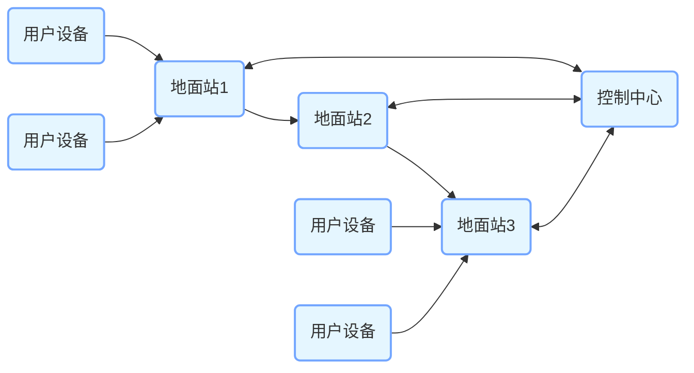

# 企业估值中的量子加密通信地面站网络评估

> 关键词：企业估值、量子加密通信、地面站网络、评估方法、风险分析

> 摘要：本文聚焦于企业估值中量子加密通信地面站网络的评估问题。首先介绍了量子加密通信地面站网络的背景知识，包括其目的、范围、预期读者等内容。接着阐述了核心概念与联系，深入剖析其原理和架构，并通过 Mermaid 流程图呈现。详细讲解了核心算法原理及具体操作步骤，结合 Python 源代码进行说明。给出了相关数学模型和公式，并举例阐释。通过项目实战，展示了开发环境搭建、源代码实现及解读分析。探讨了实际应用场景，推荐了相关工具和资源。最后总结了未来发展趋势与挑战，提供了常见问题解答和扩展阅读参考资料，旨在为企业估值中量子加密通信地面站网络的评估提供全面且深入的技术指导。

## 1. 背景介绍 
### 1.1 目的和范围
量子加密通信地面站网络作为新兴的通信基础设施，在信息安全领域具有巨大的应用潜力。对其进行评估在企业估值中具有重要意义。本评估的目的在于准确衡量量子加密通信地面站网络为企业带来的价值，包括其资产价值、潜在收益以及对企业竞争力的提升等方面。范围涵盖了地面站网络的硬件设施、软件系统、通信协议、运营管理等多个层面，以及与之相关的市场前景、技术发展趋势等外部因素。

### 1.2 预期读者
本文预期读者包括企业估值师、投资分析师、量子通信技术从业者、对量子加密通信领域感兴趣的研究人员以及相关企业的管理人员等。这些读者可以从不同角度获取有价值的信息，用于企业估值决策、技术研发方向确定、战略规划制定等工作。

### 1.3 文档结构概述
本文将按照以下结构展开：首先介绍量子加密通信地面站网络的核心概念与联系，包括其原理和架构；接着详细讲解核心算法原理及具体操作步骤，通过 Python 代码进行示例；给出相关数学模型和公式，并举例说明；进行项目实战，包括开发环境搭建、源代码实现和解读分析；探讨实际应用场景；推荐相关的工具和资源；最后总结未来发展趋势与挑战，提供常见问题解答和扩展阅读参考资料。

### 1.4 术语表
#### 1.4.1 核心术语定义
- **量子加密通信**：利用量子力学原理实现信息的安全传输，基于量子态的特性保证通信的保密性和不可窃听性。
- **地面站网络**：由多个分布在不同地理位置的地面站组成的网络，用于实现量子加密通信信号的接收、处理和转发。
- **企业估值**：对企业的价值进行评估的过程，综合考虑企业的资产、收益、市场前景等多种因素。
- **量子密钥分发**：量子加密通信中的关键技术，通过量子态的传输实现安全的密钥分发。

#### 1.4.2 相关概念解释
- **量子态**：量子系统的状态，具有叠加、纠缠等特性，是量子加密通信的基础。
- **纠缠态**：多个量子系统之间存在的一种特殊关联状态，即使它们在空间上相隔很远，一个量子系统的状态变化也会瞬间影响另一个量子系统的状态。
- **量子信道**：用于传输量子态的通信通道，通常采用光纤、自由空间等介质。

#### 1.4.3 缩略词列表
- **QKD**：Quantum Key Distribution，量子密钥分发
- **QEC**：Quantum Error Correction，量子纠错

## 2. 核心概念与联系 
### 2.1 量子加密通信地面站网络原理
量子加密通信地面站网络的核心原理基于量子力学的基本特性，如量子态的叠加性和纠缠性。在量子密钥分发过程中，发送方和接收方通过量子信道传输量子态，利用量子态的特性生成安全的密钥。由于量子态的测量会改变其状态，任何试图窃听的行为都会被检测到，从而保证了密钥的安全性。

地面站网络中的各个地面站负责接收、处理和转发量子信号。地面站配备有量子通信设备，如单光子探测器、量子纠缠源等，用于实现量子态的探测和生成。同时，地面站还需要具备通信接口和数据处理能力，以便与其他地面站和用户设备进行通信和数据交互。

### 2.2 架构示意图
以下是量子加密通信地面站网络的架构示意图：



该架构图展示了量子加密通信地面站网络的基本组成部分，包括用户设备、地面站和控制中心。用户设备通过地面站接入量子加密通信网络，地面站之间通过量子信道进行通信，控制中心负责对整个网络进行管理和监控。

### 2.3 核心概念联系
量子加密通信、地面站网络和企业估值之间存在着紧密的联系。量子加密通信为地面站网络提供了安全的通信手段，使得地面站网络能够实现高效、可靠的信息传输。而地面站网络作为量子加密通信的基础设施，其建设和运营情况直接影响着量子加密通信的性能和应用范围。在企业估值中，量子加密通信地面站网络的价值体现在其为企业带来的竞争优势、市场份额和潜在收益等方面。一个拥有先进、完善的量子加密通信地面站网络的企业，在信息安全领域具有更强的竞争力，能够吸引更多的客户和投资，从而提升企业的整体价值。

## 3. 核心算法原理 & 具体操作步骤 
### 3.1 量子密钥分发算法原理
量子密钥分发的核心算法是 BB84 协议，该协议基于量子态的特性实现安全的密钥分发。以下是 BB84 协议的基本原理：

- **发送方操作**：发送方随机选择一组基（如水平垂直基或对角基），并根据要发送的比特信息制备相应的量子态。例如，在水平垂直基中，比特 0 可以用水平偏振态表示，比特 1 可以用垂直偏振态表示；在对角基中，比特 0 可以用 +45° 偏振态表示，比特 1 可以用 -45° 偏振态表示。
- **接收方操作**：接收方随机选择一组基进行测量。如果接收方选择的基与发送方相同，则测量结果与发送方发送的比特信息一致；如果选择的基不同，则测量结果是随机的。
- **密钥筛选**：发送方和接收方通过经典信道公开他们选择的基，只保留基相同的测量结果作为密钥。

### 3.2 Python 代码实现
以下是一个简单的 Python 代码示例，模拟 BB84 协议的密钥分发过程：

```python
import random

# 定义基和量子态
bases = ['X', 'Z']
states = {'Z0': '|0>', 'Z1': '|1>', 'X0': '|+>', 'X1': '|->'}

# 生成随机比特序列
def generate_bits(length):
    return [random.randint(0, 1) for _ in range(length)]

# 生成随机基序列
def generate_bases(length):
    return [random.choice(bases) for _ in range(length)]

# 制备量子态
def prepare_states(bits, bases):
    states_list = []
    for bit, base in zip(bits, bases):
        if base == 'Z':
            if bit == 0:
                states_list.append('Z0')
            else:
                states_list.append('Z1')
        else:
            if bit == 0:
                states_list.append('X0')
            else:
                states_list.append('X1')
    return states_list

# 测量量子态
def measure_states(states, bases):
    measured_bits = []
    for state, base in zip(states, bases):
        if base == 'Z':
            if state.startswith('Z'):
                measured_bits.append(int(state[1]))
            else:
                measured_bits.append(random.randint(0, 1))
        else:
            if state.startswith('X'):
                measured_bits.append(int(state[1]))
            else:
                measured_bits.append(random.randint(0, 1))
    return measured_bits

# 密钥筛选
def sift_keys(sender_bits, sender_bases, receiver_bases, receiver_bits):
    sifted_keys = []
    for i in range(len(sender_bases)):
        if sender_bases[i] == receiver_bases[i]:
            sifted_keys.append(receiver_bits[i])
    return sifted_keys

# 主程序
if __name__ == "__main__":
    length = 100
    sender_bits = generate_bits(length)
    sender_bases = generate_bases(length)
    sender_states = prepare_states(sender_bits, sender_bases)

    receiver_bases = generate_bases(length)
    receiver_bits = measure_states(sender_states, receiver_bases)

    sifted_keys = sift_keys(sender_bits, sender_bases, receiver_bases, receiver_bits)
    print("Sifted keys:", sifted_keys)
```

### 3.3 具体操作步骤
1. **初始化**：发送方和接收方分别生成随机的比特序列和基序列。
2. **量子态制备**：发送方根据比特序列和基序列制备相应的量子态。
3. **量子态传输**：发送方通过量子信道将制备好的量子态发送给接收方。
4. **量子态测量**：接收方根据自己的基序列对收到的量子态进行测量。
5. **密钥筛选**：发送方和接收方通过经典信道公开他们选择的基，只保留基相同的测量结果作为密钥。

## 4. 数学模型和公式 & 详细讲解 & 举例说明 
### 4.1 量子态表示
在量子力学中，量子态通常用狄拉克符号表示。例如，一个单量子比特的状态可以表示为：

$$|\psi\rangle = \alpha|0\rangle + \beta|1\rangle$$

其中，$\alpha$ 和 $\beta$ 是复数，满足 $|\alpha|^2 + |\beta|^2 = 1$。$|0\rangle$ 和 $|1\rangle$ 是两个基态。

### 4.2 量子测量
量子测量是量子态的一个重要操作。在测量过程中，量子态会塌缩到某个基态上。例如，在 $Z$ 基下测量量子态 $|\psi\rangle$，得到 $|0\rangle$ 的概率为 $|\alpha|^2$，得到 $|1\rangle$ 的概率为 $|\beta|^2$。

### 4.3 量子密钥分发的安全性分析
量子密钥分发的安全性基于量子力学的基本原理。根据海森堡不确定性原理，任何试图测量量子态的行为都会改变其状态。因此，在量子密钥分发过程中，如果存在窃听者，发送方和接收方可以通过比较测量结果的统计特性来检测到窃听行为。

例如，在 BB84 协议中，发送方和接收方可以通过比较基相同的测量结果的错误率来判断是否存在窃听。如果错误率超过了一个预先设定的阈值，则认为存在窃听，需要重新进行密钥分发。

### 4.4 举例说明
假设发送方制备的量子态为 $|\psi\rangle = \frac{1}{\sqrt{2}}(|0\rangle + |1\rangle)$，接收方在 $Z$ 基下进行测量。根据量子测量的原理，得到 $|0\rangle$ 的概率为 $|\frac{1}{\sqrt{2}}|^2 = \frac{1}{2}$，得到 $|1\rangle$ 的概率也为 $\frac{1}{2}$。

## 5. 项目实战：代码实际案例和详细解释说明 
### 5.1  开发环境搭建
#### 5.1.1 操作系统
本项目可以在 Windows、Linux 或 macOS 等操作系统上进行开发。建议使用 Linux 系统，因为其具有更好的开源软件支持和稳定性。

#### 5.1.2 Python 环境
安装 Python 3.x 版本，可以从 Python 官方网站下载安装包进行安装。安装完成后，建议使用虚拟环境来管理项目的依赖库，以避免不同项目之间的依赖冲突。可以使用 `venv` 或 `conda` 来创建虚拟环境。

```bash
# 使用 venv 创建虚拟环境
python3 -m venv myenv
source myenv/bin/activate  # 在 Linux 或 macOS 上激活虚拟环境
myenv\Scripts\activate  # 在 Windows 上激活虚拟环境
```

#### 5.1.3 依赖库安装
本项目需要安装一些基本的 Python 库，如 `numpy`、`matplotlib` 等。可以使用 `pip` 来安装这些库。

```bash
pip install numpy matplotlib
```

### 5.2  源代码详细实现和代码解读
以下是一个更完整的量子密钥分发模拟代码示例，包括错误率计算和窃听检测：

```python
import random
import numpy as np

# 定义基和量子态
bases = ['X', 'Z']
states = {'Z0': '|0>', 'Z1': '|1>', 'X0': '|+>', 'X1': '|->'}

# 生成随机比特序列
def generate_bits(length):
    return [random.randint(0, 1) for _ in range(length)]

# 生成随机基序列
def generate_bases(length):
    return [random.choice(bases) for _ in range(length)]

# 制备量子态
def prepare_states(bits, bases):
    states_list = []
    for bit, base in zip(bits, bases):
        if base == 'Z':
            if bit == 0:
                states_list.append('Z0')
            else:
                states_list.append('Z1')
        else:
            if bit == 0:
                states_list.append('X0')
            else:
                states_list.append('X1')
    return states_list

# 测量量子态
def measure_states(states, bases):
    measured_bits = []
    for state, base in zip(states, bases):
        if base == 'Z':
            if state.startswith('Z'):
                measured_bits.append(int(state[1]))
            else:
                measured_bits.append(random.randint(0, 1))
        else:
            if state.startswith('X'):
                measured_bits.append(int(state[1]))
            else:
                measured_bits.append(random.randint(0, 1))
    return measured_bits

# 密钥筛选
def sift_keys(sender_bits, sender_bases, receiver_bases, receiver_bits):
    sifted_keys = []
    for i in range(len(sender_bases)):
        if sender_bases[i] == receiver_bases[i]:
            sifted_keys.append(receiver_bits[i])
    return sifted_keys

# 计算错误率
def calculate_error_rate(sender_bits, receiver_bits):
    errors = sum([1 for i in range(len(sender_bits)) if sender_bits[i] != receiver_bits[i]])
    return errors / len(sender_bits)

# 窃听检测
def detect_eavesdropping(error_rate, threshold):
    return error_rate > threshold

# 主程序
if __name__ == "__main__":
    length = 1000
    sender_bits = generate_bits(length)
    sender_bases = generate_bases(length)
    sender_states = prepare_states(sender_bits, sender_bases)

    # 模拟窃听
    eavesdropper_bases = generate_bases(length)
    eavesdropper_bits = measure_states(sender_states, eavesdropper_bases)
    new_states = prepare_states(eavesdropper_bits, eavesdropper_bases)

    receiver_bases = generate_bases(length)
    receiver_bits = measure_states(new_states, receiver_bases)

    sifted_sender_bits = []
    sifted_receiver_bits = []
    for i in range(len(sender_bases)):
        if sender_bases[i] == receiver_bases[i]:
            sifted_sender_bits.append(sender_bits[i])
            sifted_receiver_bits.append(receiver_bits[i])

    error_rate = calculate_error_rate(sifted_sender_bits, sifted_receiver_bits)
    threshold = 0.05
    is_eavesdropping = detect_eavesdropping(error_rate, threshold)

    print("Error rate:", error_rate)
    print("Is eavesdropping:", is_eavesdropping)
```

### 5.3  代码解读与分析
- **生成随机比特序列和基序列**：`generate_bits` 和 `generate_bases` 函数分别用于生成随机的比特序列和基序列。
- **制备量子态**：`prepare_states` 函数根据比特序列和基序列制备相应的量子态。
- **测量量子态**：`measure_states` 函数模拟接收方对量子态的测量过程。
- **密钥筛选**：`sift_keys` 函数根据发送方和接收方选择的基相同的情况筛选出密钥。
- **计算错误率**：`calculate_error_rate` 函数计算发送方和接收方筛选后的密钥之间的错误率。
- **窃听检测**：`detect_eavesdropping` 函数根据错误率和预先设定的阈值判断是否存在窃听。

在主程序中，我们模拟了窃听的情况，通过引入窃听者的操作，改变了量子态的传输过程。然后计算错误率并进行窃听检测，输出检测结果。

## 6. 实际应用场景 
### 6.1 金融领域
在金融领域，信息安全至关重要。量子加密通信地面站网络可以为金融机构提供安全的通信通道，保护客户的账户信息、交易数据等敏感信息不被窃取和篡改。例如，银行之间的资金转账、证券交易等业务可以通过量子加密通信网络进行，确保交易的安全性和可靠性。

### 6.2 政府和国防领域
政府和国防部门处理大量的机密信息，对信息安全的要求极高。量子加密通信地面站网络可以为政府和国防部门提供安全的通信保障，防止机密信息泄露。例如，军事指挥系统、情报传输等可以采用量子加密通信技术，确保信息的安全性和保密性。

### 6.3 云计算和大数据领域
随着云计算和大数据技术的发展，数据的存储和传输面临着越来越多的安全威胁。量子加密通信地面站网络可以为云计算和大数据服务提供商提供安全的通信通道，保护用户的数据隐私和安全。例如，云存储服务可以采用量子加密通信技术，确保用户数据在传输和存储过程中的安全性。

### 6.4 物联网领域
物联网设备数量众多，通信环境复杂，信息安全问题日益突出。量子加密通信地面站网络可以为物联网设备提供安全的通信保障，防止物联网设备被攻击和控制。例如，智能家居设备、工业物联网设备等可以通过量子加密通信网络进行通信，确保设备的安全性和可靠性。

## 7. 工具和资源推荐
### 7.1 学习资源推荐
#### 7.1.1 书籍推荐
- 《量子计算与量子信息》（Quantum Computation and Quantum Information）：这是一本经典的量子计算和量子信息领域的教材，全面介绍了量子力学的基本原理、量子算法、量子密钥分发等内容。
- 《量子通信技术》：详细介绍了量子通信的基本原理、技术实现和应用场景，适合对量子通信技术感兴趣的读者阅读。

#### 7.1.2 在线课程
- Coursera 上的“Quantum Mechanics for Scientists and Engineers”：该课程由专业教授授课，系统介绍了量子力学的基本原理和应用，对理解量子加密通信的原理有很大帮助。
- edX 上的“Quantum Computing Fundamentals”：课程内容涵盖了量子计算的基础知识和量子算法，为进一步学习量子加密通信提供了理论基础。

#### 7.1.3 技术博客和网站
- Quantum Computing Report：提供量子计算和量子通信领域的最新技术动态、研究成果和行业趋势，是获取前沿信息的重要渠道。
- IEEE Quantum Computing Initiative：IEEE 组织的量子计算倡议网站，发布了大量关于量子计算和量子通信的学术论文、技术报告等资源。

### 7.2 开发工具框架推荐
#### 7.2.1 IDE和编辑器
- PyCharm：一款功能强大的 Python 集成开发环境，提供了代码编辑、调试、版本控制等一系列功能，适合开发量子加密通信相关的 Python 代码。
- Visual Studio Code：轻量级的代码编辑器，支持多种编程语言，具有丰富的插件生态系统，可以方便地进行代码开发和调试。

#### 7.2.2 调试和性能分析工具
- PDB：Python 自带的调试工具，可以帮助开发者在代码中设置断点、查看变量值等，进行代码调试。
- cProfile：Python 标准库中的性能分析工具，可以统计代码的运行时间和函数调用次数，帮助开发者优化代码性能。

#### 7.2.3 相关框架和库
- Qiskit：IBM 开发的开源量子计算框架，提供了量子算法的实现和模拟工具，可用于量子加密通信算法的研究和开发。
- Cirq：Google 开发的量子计算框架，支持量子电路的构建和模拟，适合对量子加密通信进行实验和验证。

### 7.3 相关论文著作推荐
#### 7.3.1 经典论文
- Bennett, C. H., & Brassard, G. (1984). Quantum cryptography: Public key distribution and coin tossing. In Proceedings of the IEEE International Conference on Computers, Systems, and Signal Processing (pp. 175-179). 这是量子密钥分发领域的经典论文，提出了 BB84 协议，奠定了量子加密通信的基础。
- Ekert, A. K. (1991). Quantum cryptography based on Bell's theorem. Physical Review Letters, 67(6), 661-663. 该论文提出了基于贝尔定理的量子密钥分发协议，为量子加密通信的发展提供了新的思路。

#### 7.3.2 最新研究成果
- 可以关注 arXiv 预印本平台上的最新论文，了解量子加密通信领域的最新研究进展。例如，关于量子中继器、量子网络编码等方面的研究成果。

#### 7.3.3 应用案例分析
- 一些学术期刊和会议论文集中会有关于量子加密通信实际应用案例的分析，如《IEEE Transactions on Information Forensics and Security》《ACM SIGCOMM Conference》等，这些案例可以为企业估值中量子加密通信地面站网络的评估提供参考。

## 8. 总结：未来发展趋势与挑战
### 8.1 未来发展趋势
- **技术不断进步**：随着量子技术的不断发展，量子加密通信地面站网络的性能将不断提高，包括密钥分发速率、通信距离、稳定性等方面。量子中继器等技术的成熟将进一步扩展量子加密通信的应用范围。
- **产业融合加速**：量子加密通信将与其他领域的技术，如人工智能、物联网、云计算等深度融合，创造出更多的应用场景和商业机会。例如，量子加密通信与物联网的结合可以实现更安全的物联网通信，为智能家居、工业互联网等领域带来新的发展机遇。
- **国际合作加强**：量子加密通信是一个全球性的研究和应用领域，各国将加强在量子技术研发、标准制定、应用推广等方面的合作。国际标准化组织将制定统一的量子加密通信标准，促进量子加密通信产业的国际化发展。

### 8.2 挑战
- **技术难题**：量子加密通信技术仍面临一些技术难题，如量子态的制备、传输和测量过程中的噪声和损耗问题，量子纠错技术的复杂性等。解决这些技术难题需要投入大量的研发资源和时间。
- **成本较高**：目前量子加密通信地面站网络的建设和运营成本较高，限制了其大规模应用。降低成本是推广量子加密通信技术的关键，需要在技术创新、产业规模化等方面采取措施。
- **安全风险**：虽然量子加密通信具有较高的安全性，但仍然存在一些潜在的安全风险，如量子黑客攻击、系统漏洞等。加强安全防护和风险评估是保障量子加密通信地面站网络安全的重要任务。

## 9. 附录：常见问题与解答
### 9.1 量子加密通信地面站网络的建设成本主要包括哪些方面？
量子加密通信地面站网络的建设成本主要包括硬件设备成本、软件系统开发成本、场地租赁和装修成本、人员培训成本等。硬件设备包括量子通信设备、服务器、网络设备等；软件系统包括量子密钥分发管理系统、通信协议栈等。

### 9.2 如何评估量子加密通信地面站网络的安全性？
可以从多个方面评估量子加密通信地面站网络的安全性，如量子密钥分发的安全性、通信协议的安全性、系统的抗攻击能力等。可以通过模拟攻击实验、安全漏洞扫描等方法来评估网络的安全性。

### 9.3 量子加密通信地面站网络与传统通信网络有什么区别？
量子加密通信地面站网络与传统通信网络的主要区别在于通信的安全性。量子加密通信基于量子力学原理，具有不可窃听、不可复制的特性，能够提供更高的信息安全保障。而传统通信网络主要依靠密码学算法来保障信息安全，存在被破解的风险。

### 9.4 量子加密通信地面站网络的发展对企业估值有什么影响？
量子加密通信地面站网络的发展可以提升企业的信息安全水平和竞争力，从而增加企业的价值。拥有先进、完善的量子加密通信地面站网络的企业在市场上具有更强的吸引力，能够吸引更多的客户和投资，提高企业的市场份额和盈利能力。

## 10. 扩展阅读 & 参考资料
- Nielsen, M. A., & Chuang, I. L. (2010). Quantum Computation and Quantum Information: 10th Anniversary Edition. Cambridge University Press.
- Gisin, N., Ribordy, G., Tittel, W., & Zbinden, H. (2002). Quantum cryptography. Reviews of Modern Physics, 74(1), 145-195.
- IEEE Quantum Computing Initiative. https://qci.ieee.org/
- arXiv preprint server. https://arxiv.org/ 