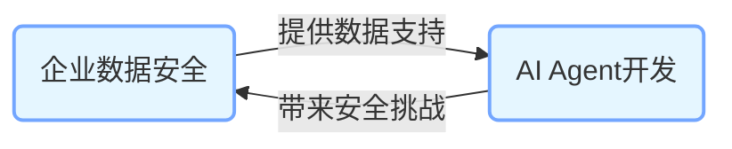

# 企业数据安全与AI Agent开发：平衡创新与风险

> 关键词：企业数据安全、AI Agent开发、创新、风险、数据保护、隐私、技术平衡

> 摘要：本文聚焦于企业数据安全与AI Agent开发之间的复杂关系，深入探讨如何在追求创新的同时有效管理风险。首先介绍了企业数据安全和AI Agent开发的背景知识，阐述其目的、预期读者和文档结构。接着剖析核心概念及联系，详细讲解核心算法原理和具体操作步骤，通过数学模型和公式进行理论支撑，并辅以实际案例说明。然后通过项目实战展示代码实现和解读，分析实际应用场景。推荐了相关学习资源、开发工具框架和论文著作。最后总结未来发展趋势与挑战，提供常见问题解答和扩展阅读参考资料，旨在为企业在数据安全和AI Agent开发中找到平衡提供全面的技术指导和策略建议。

## 1. 背景介绍 
### 1.1 目的和范围
企业在数字化转型的浪潮中，越来越依赖数据来驱动业务决策和创新发展。同时，AI Agent作为一种新兴的智能技术，具有提高效率、自动化流程等诸多优势，在企业中得到了广泛的关注和应用。然而，AI Agent的开发和应用过程中涉及大量的企业数据，这些数据包含了企业的核心机密、客户隐私等敏感信息，一旦数据安全出现问题，将给企业带来巨大的损失。

本文的目的在于深入探讨企业数据安全与AI Agent开发之间的关系，分析其中存在的风险，并提供相应的策略和技术手段，帮助企业在利用AI Agent进行创新的同时，确保数据的安全性和隐私性。范围涵盖了从数据安全的基本概念、AI Agent的开发原理到实际项目中的应用和风险控制等多个方面。

### 1.2 预期读者
本文的预期读者包括企业的技术管理人员、数据安全专家、AI研发工程师、软件架构师以及对企业数据安全和AI技术发展感兴趣的相关人员。这些读者可能需要了解如何在企业环境中平衡数据安全和AI Agent开发的关系，掌握相关的技术和管理方法，以应对实际工作中的挑战。

### 1.3 文档结构概述
本文将按照以下结构进行阐述：首先介绍企业数据安全和AI Agent开发的背景知识，包括目的、读者和文档结构等；接着深入探讨核心概念及它们之间的联系，通过示意图和流程图进行直观展示；然后详细讲解核心算法原理和具体操作步骤，并给出Python源代码示例；再通过数学模型和公式对相关原理进行理论分析，辅以具体例子说明；之后通过项目实战展示代码实现和详细解读；分析实际应用场景；推荐相关的学习资源、开发工具框架和论文著作；最后总结未来发展趋势与挑战，提供常见问题解答和扩展阅读参考资料。

### 1.4 术语表
#### 1.4.1 核心术语定义
- **企业数据安全**：指保护企业的各种数据资产，包括业务数据、客户信息、财务数据等，防止数据被未经授权的访问、泄露、篡改或破坏，确保数据的保密性、完整性和可用性。
- **AI Agent**：即人工智能代理，是一种能够感知环境、自主决策并采取行动以实现特定目标的智能软件实体。它可以通过学习和适应不断提高自身的性能和能力。
- **数据隐私**：涉及个人或组织的数据被收集、使用和共享的方式，强调对个人或组织数据的控制权和保护，确保数据不被滥用。
- **风险评估**：对可能影响企业数据安全和AI Agent开发的各种风险因素进行识别、分析和评估，以确定风险的可能性和影响程度。

#### 1.4.2 相关概念解释
- **数据加密**：将数据转换为密文的过程，只有拥有正确密钥的授权人员才能将其解密还原为原始数据，从而保护数据的保密性。
- **访问控制**：通过设置权限和身份验证机制，限制对数据和系统资源的访问，确保只有授权人员能够访问敏感信息。
- **机器学习**：AI Agent开发中常用的技术，通过让计算机从数据中学习模式和规律，自动调整模型参数，以实现预测、分类等任务。

#### 1.4.3 缩略词列表
- **API**：Application Programming Interface（应用程序编程接口）
- **GDPR**：General Data Protection Regulation（通用数据保护条例）
- **ML**：Machine Learning（机器学习）
- **DL**：Deep Learning（深度学习）

## 2. 核心概念与联系 
### 企业数据安全的核心概念
企业数据安全的核心目标是确保数据的保密性、完整性和可用性，即所谓的CIA三元组。保密性确保只有授权人员能够访问数据，防止数据泄露；完整性保证数据在存储和传输过程中不被篡改；可用性则确保数据在需要时能够被及时访问和使用。

为了实现这些目标，企业通常采用多种技术和管理措施，如数据加密、访问控制、备份恢复等。数据加密可以将敏感数据转换为密文，即使数据被非法获取，攻击者也无法解读其中的内容。访问控制通过身份验证和授权机制，限制用户对数据的访问权限，确保只有经过授权的人员才能访问特定的数据资源。备份恢复则是为了防止数据因意外事件（如硬件故障、自然灾害等）而丢失，通过定期备份数据并在需要时进行恢复，保证数据的可用性。

### AI Agent开发的核心概念
AI Agent是一种具有智能决策能力的软件实体，它可以感知环境、理解环境信息，并根据预设的目标和规则采取相应的行动。AI Agent的开发通常涉及到多个领域的技术，如机器学习、自然语言处理、计算机视觉等。

机器学习是AI Agent开发的核心技术之一，它通过让计算机从数据中学习模式和规律，自动调整模型参数，以实现预测、分类等任务。自然语言处理技术则使AI Agent能够理解和处理人类语言，实现人机交互。计算机视觉技术可以让AI Agent识别和理解图像、视频等视觉信息。

### 两者之间的联系
企业数据安全和AI Agent开发之间存在着密切的联系。一方面，AI Agent的开发和应用需要大量的企业数据作为训练和学习的基础，这些数据的安全性直接影响到AI Agent的性能和可靠性。如果数据被泄露或篡改，可能会导致AI Agent学习到错误的信息，从而影响其决策的准确性和可靠性。

另一方面，AI Agent的应用也可能会对企业数据安全带来新的挑战。例如，AI Agent在与外部环境交互的过程中，可能会面临网络攻击、数据泄露等安全风险。同时，AI Agent的决策过程可能会涉及到对敏感数据的处理，如果没有有效的安全措施，可能会导致数据隐私泄露。

### 文本示意图
企业数据安全与AI Agent开发的关系可以用以下示意图表示：

```plaintext
          企业数据安全
              |
              | 提供数据支持
              V
         AI Agent开发
              |
              | 带来安全挑战
              V
          企业数据安全
```

### Mermaid流程图


## 3. 核心算法原理 & 具体操作步骤 
### 数据加密算法原理
数据加密是企业数据安全的重要手段之一，常见的加密算法有对称加密算法和非对称加密算法。

#### 对称加密算法
对称加密算法使用相同的密钥进行加密和解密操作。常见的对称加密算法有AES（Advanced Encryption Standard）。AES算法采用分组加密的方式，将明文数据分成固定长度的块，然后对每个块进行加密。

以下是使用Python实现AES加密和解密的示例代码：
```python
from Crypto.Cipher import AES
from Crypto.Util.Padding import pad, unpad
import os

# 生成随机密钥
key = os.urandom(16)  # AES-128使用16字节的密钥

# 初始化加密器
cipher = AES.new(key, AES.MODE_CBC)
iv = cipher.iv

# 明文数据
plaintext = b"Hello, World!"

# 填充明文数据
padded_plaintext = pad(plaintext, AES.block_size)

# 加密数据
ciphertext = cipher.encrypt(padded_plaintext)

# 初始化解密器
decipher = AES.new(key, AES.MODE_CBC, iv)

# 解密数据
decrypted_data = decipher.decrypt(ciphertext)

# 去除填充
unpadded_decrypted_data = unpad(decrypted_data, AES.block_size)

print("明文:", plaintext)
print("密文:", ciphertext)
print("解密后的明文:", unpadded_decrypted_data)
```
#### 非对称加密算法
非对称加密算法使用一对密钥，即公钥和私钥。公钥可以公开，用于加密数据；私钥则必须保密，用于解密数据。常见的非对称加密算法有RSA。

以下是使用Python实现RSA加密和解密的示例代码：
```python
from Crypto.PublicKey import RSA
from Crypto.Cipher import PKCS1_OAEP

# 生成RSA密钥对
key = RSA.generate(2048)
private_key = key.export_key()
public_key = key.publickey().export_key()

# 加载公钥
recipient_public_key = RSA.import_key(public_key)
cipher_rsa = PKCS1_OAEP.new(recipient_public_key)

# 明文数据
plaintext = b"Hello, World!"

# 加密数据
ciphertext = cipher_rsa.encrypt(plaintext)

# 加载私钥
recipient_private_key = RSA.import_key(private_key)
cipher_rsa = PKCS1_OAEP.new(recipient_private_key)

# 解密数据
decrypted_data = cipher_rsa.decrypt(ciphertext)

print("明文:", plaintext)
print("密文:", ciphertext)
print("解密后的明文:", decrypted_data)
```

### AI Agent开发中的机器学习算法原理
AI Agent开发中常用的机器学习算法有监督学习、无监督学习和强化学习。

#### 监督学习
监督学习是指在训练模型时，使用带有标签的数据进行训练。模型通过学习输入数据和对应的标签之间的关系，来实现预测或分类任务。常见的监督学习算法有线性回归、逻辑回归、决策树等。

以下是使用Python实现简单线性回归的示例代码：
```python
import numpy as np
from sklearn.linear_model import LinearRegression

# 生成示例数据
X = np.array([[1], [2], [3], [4], [5]])
y = np.array([2, 4, 6, 8, 10])

# 创建线性回归模型
model = LinearRegression()

# 训练模型
model.fit(X, y)

# 预测新数据
new_X = np.array([[6]])
prediction = model.predict(new_X)

print("预测结果:", prediction)
```
#### 无监督学习
无监督学习是指在训练模型时，使用没有标签的数据进行训练。模型通过学习数据中的模式和结构，来发现数据的内在规律。常见的无监督学习算法有聚类算法（如K-Means）、降维算法（如主成分分析PCA）等。

以下是使用Python实现K-Means聚类的示例代码：
```python
from sklearn.cluster import KMeans
import numpy as np

# 生成示例数据
X = np.array([[1, 2], [1, 4], [1, 0], [4, 2], [4, 4], [4, 0]])

# 创建K-Means模型
kmeans = KMeans(n_clusters=2, random_state=0).fit(X)

# 预测聚类标签
labels = kmeans.labels_

print("聚类标签:", labels)
```
#### 强化学习
强化学习是指智能体通过与环境进行交互，根据环境反馈的奖励信号来学习最优的行为策略。常见的强化学习算法有Q-Learning、深度Q网络（DQN）等。

以下是一个简单的Q-Learning示例代码：
```python
import numpy as np

# 定义环境参数
num_states = 5
num_actions = 2
gamma = 0.9  # 折扣因子
alpha = 0.1  # 学习率

# 初始化Q表
Q = np.zeros((num_states, num_actions))

# 定义奖励函数
rewards = np.array([[0, 1], [0, 0], [0, 0], [0, 0], [0, 0]])

# 定义策略函数
def epsilon_greedy(state, epsilon):
    if np.random.uniform(0, 1) < epsilon:
        action = np.random.choice(num_actions)
    else:
        action = np.argmax(Q[state, :])
    return action

# 训练过程
num_episodes = 100
epsilon = 0.1

for episode in range(num_episodes):
    state = 0
    done = False
    while not done:
        action = epsilon_greedy(state, epsilon)
        next_state = np.random.choice(num_states)
        reward = rewards[state, action]
        Q[state, action] = Q[state, action] + alpha * (reward + gamma * np.max(Q[next_state, :]) - Q[state, action])
        state = next_state
        if state == num_states - 1:
            done = True

print("最终Q表:", Q)
```

### 具体操作步骤
#### 数据安全方面
1. **数据分类**：对企业数据进行分类，确定哪些数据是敏感数据，需要更高的安全保护级别。
2. **加密策略制定**：根据数据的分类结果，选择合适的加密算法和密钥管理策略，对敏感数据进行加密。
3. **访问控制设置**：建立用户身份验证和授权机制，限制对数据的访问权限，确保只有授权人员能够访问敏感数据。
4. **数据备份和恢复**：定期对重要数据进行备份，并制定数据恢复计划，以应对数据丢失或损坏的情况。

#### AI Agent开发方面
1. **需求分析**：明确AI Agent的应用场景和目标，确定需要实现的功能和性能要求。
2. **数据准备**：收集和整理用于训练AI Agent的数据，确保数据的质量和多样性。
3. **算法选择和模型训练**：根据需求分析的结果，选择合适的机器学习算法，并使用准备好的数据进行模型训练。
4. **测试和优化**：对训练好的AI Agent进行测试，评估其性能和效果，并根据测试结果进行优化和调整。

## 4. 数学模型和公式 & 详细讲解 & 举例说明 
### 数据加密的数学模型
#### 对称加密模型
对称加密算法可以用以下数学模型表示：

设明文为 $P$，密钥为 $K$，加密函数为 $E$，解密函数为 $D$，密文为 $C$。则加密过程可以表示为：

$$C = E(K, P)$$

解密过程可以表示为：

$$P = D(K, C)$$

其中，加密函数 $E$ 和解密函数 $D$ 是一对可逆的函数，满足 $D(K, E(K, P)) = P$。

例如，在AES算法中，加密过程是通过一系列的替换、置换和线性变换操作将明文转换为密文，解密过程则是这些操作的逆过程。

#### 非对称加密模型
非对称加密算法使用公钥 $K_p$ 和私钥 $K_s$。加密过程使用公钥，解密过程使用私钥。数学模型表示如下：

加密过程：

$$C = E(K_p, P)$$

解密过程：

$$P = D(K_s, C)$$

其中，公钥 $K_p$ 可以公开，私钥 $K_s$ 必须保密。非对称加密算法的安全性基于数学难题，如RSA算法基于大整数分解难题。

### 机器学习的数学模型
#### 线性回归模型
线性回归模型是一种简单的监督学习模型，用于预测连续变量的值。其数学模型可以表示为：

$$y = \theta_0 + \theta_1x_1 + \theta_2x_2 + \cdots + \theta_nx_n + \epsilon$$

其中，$y$ 是预测值，$x_1, x_2, \cdots, x_n$ 是输入特征，$\theta_0, \theta_1, \cdots, \theta_n$ 是模型参数，$\epsilon$ 是误差项。

为了求解模型参数 $\theta$，通常使用最小二乘法，即最小化预测值与真实值之间的误差平方和：

$$J(\theta) = \frac{1}{2m}\sum_{i = 1}^{m}(h_{\theta}(x^{(i)}) - y^{(i)})^2$$

其中，$m$ 是样本数量，$h_{\theta}(x^{(i)})$ 是第 $i$ 个样本的预测值，$y^{(i)}$ 是第 $i$ 个样本的真实值。

通过求解 $\frac{\partial J(\theta)}{\partial \theta_j} = 0$，可以得到最优的模型参数 $\theta$。

例如，对于简单线性回归模型 $y = \theta_0 + \theta_1x$，可以使用以下公式求解 $\theta_0$ 和 $\theta_1$：

$$\theta_1 = \frac{\sum_{i = 1}^{m}(x^{(i)} - \bar{x})(y^{(i)} - \bar{y})}{\sum_{i = 1}^{m}(x^{(i)} - \bar{x})^2}$$

$$\theta_0 = \bar{y} - \theta_1\bar{x}$$

其中，$\bar{x}$ 和 $\bar{y}$ 分别是 $x$ 和 $y$ 的均值。

#### 逻辑回归模型
逻辑回归模型是一种用于分类的监督学习模型，其输出是一个概率值。逻辑回归模型的数学模型可以表示为：

$$h_{\theta}(x) = \frac{1}{1 + e^{-\theta^Tx}}$$

其中，$\theta$ 是模型参数，$x$ 是输入特征。

为了求解模型参数 $\theta$，通常使用最大似然估计法，即最大化对数似然函数：

$$\ell(\theta) = \sum_{i = 1}^{m}[y^{(i)}\log(h_{\theta}(x^{(i)})) + (1 - y^{(i)})\log(1 - h_{\theta}(x^{(i)}))]$$

通过梯度上升法或其他优化算法求解 $\ell(\theta)$ 的最大值，得到最优的模型参数 $\theta$。

#### 强化学习的数学模型
强化学习的目标是让智能体学习到最优的行为策略，以最大化长期累积奖励。常用的强化学习算法基于马尔可夫决策过程（MDP）。

马尔可夫决策过程可以用一个五元组 $(S, A, P, R, \gamma)$ 表示，其中：
- $S$ 是状态集合
- $A$ 是动作集合
- $P(s'|s, a)$ 是状态转移概率，表示在状态 $s$ 下执行动作 $a$ 后转移到状态 $s'$ 的概率
- $R(s, a, s')$ 是奖励函数，表示在状态 $s$ 下执行动作 $a$ 后转移到状态 $s'$ 所获得的奖励
- $\gamma$ 是折扣因子，用于平衡即时奖励和未来奖励

智能体的策略 $\pi(a|s)$ 表示在状态 $s$ 下选择动作 $a$ 的概率。

价值函数 $V^{\pi}(s)$ 表示在策略 $\pi$ 下从状态 $s$ 开始的长期累积奖励的期望：

$$V^{\pi}(s) = \mathbb{E}_{\pi}\left[\sum_{t = 0}^{\infty}\gamma^tR(S_t, A_t, S_{t + 1})|S_0 = s\right]$$

动作价值函数 $Q^{\pi}(s, a)$ 表示在策略 $\pi$ 下从状态 $s$ 执行动作 $a$ 后开始的长期累积奖励的期望：

$$Q^{\pi}(s, a) = \mathbb{E}_{\pi}\left[\sum_{t = 0}^{\infty}\gamma^tR(S_t, A_t, S_{t + 1})|S_0 = s, A_0 = a\right]$$

最优价值函数 $V^*(s)$ 和最优动作价值函数 $Q^*(s, a)$ 分别表示所有策略中最大的价值函数和动作价值函数。

Q-Learning算法通过迭代更新动作价值函数 $Q(s, a)$ 来学习最优策略，更新公式如下：

$$Q(s, a) \leftarrow Q(s, a) + \alpha\left[R(s, a, s') + \gamma\max_{a'}Q(s', a') - Q(s, a)\right]$$

其中，$\alpha$ 是学习率。

## 5. 项目实战：代码实际案例和详细解释说明 
### 5.1  开发环境搭建
#### 操作系统
可以选择Windows、Linux或macOS等常见的操作系统。本项目推荐使用Ubuntu 20.04 LTS作为开发环境。

#### 编程语言和工具
- **Python**：版本3.7及以上，Python是一种功能强大且易于学习的编程语言，广泛应用于数据处理、机器学习和AI开发等领域。
- **Anaconda**：用于管理Python环境和安装各种依赖库。可以从Anaconda官方网站下载适合自己操作系统的安装包进行安装。

#### 安装依赖库
在Anaconda环境中，可以使用以下命令安装项目所需的依赖库：
```bash
conda install numpy scikit-learn pycryptodome
```

### 5.2  源代码详细实现和代码解读
#### 数据安全模块
以下是一个简单的数据加密和解密模块的实现：
```python
from Crypto.Cipher import AES
from Crypto.Util.Padding import pad, unpad
import os

class DataEncryptor:
    def __init__(self):
        # 生成随机密钥
        self.key = os.urandom(16)  # AES-128使用16字节的密钥
        self.cipher = AES.new(self.key, AES.MODE_CBC)
        self.iv = self.cipher.iv

    def encrypt(self, plaintext):
        # 填充明文数据
        padded_plaintext = pad(plaintext.encode('utf-8'), AES.block_size)
        # 加密数据
        ciphertext = self.cipher.encrypt(padded_plaintext)
        return ciphertext, self.iv

    def decrypt(self, ciphertext, iv):
        # 初始化解密器
        decipher = AES.new(self.key, AES.MODE_CBC, iv)
        # 解密数据
        decrypted_data = decipher.decrypt(ciphertext)
        # 去除填充
        unpadded_decrypted_data = unpad(decrypted_data, AES.block_size)
        return unpadded_decrypted_data.decode('utf-8')
```
代码解读：
- `__init__` 方法：初始化加密器，生成随机密钥和初始化向量（IV）。
- `encrypt` 方法：对输入的明文数据进行填充，然后使用AES算法进行加密，返回密文和IV。
- `decrypt` 方法：使用给定的IV和密钥对密文进行解密，去除填充后返回解密后的明文。

#### AI Agent开发模块
以下是一个简单的基于线性回归的AI Agent示例：
```python
import numpy as np
from sklearn.linear_model import LinearRegression

class AIAgent:
    def __init__(self):
        self.model = LinearRegression()

    def train(self, X, y):
        # 训练模型
        self.model.fit(X, y)

    def predict(self, X):
        # 预测新数据
        prediction = self.model.predict(X)
        return prediction
```
代码解读：
- `__init__` 方法：初始化线性回归模型。
- `train` 方法：使用给定的训练数据 $X$ 和标签 $y$ 对模型进行训练。
- `predict` 方法：使用训练好的模型对新数据 $X$ 进行预测，返回预测结果。

#### 主程序
以下是一个将数据安全模块和AI Agent开发模块结合的主程序示例：
```python
# 数据安全模块
from data_encryptor import DataEncryptor
# AI Agent开发模块
from ai_agent import AIAgent

# 初始化数据加密器
encryptor = DataEncryptor()

# 示例数据
plaintext = "Hello, World!"
# 加密数据
ciphertext, iv = encryptor.encrypt(plaintext)
print("加密后的密文:", ciphertext)

# 模拟AI Agent训练数据
X = np.array([[1], [2], [3], [4], [5]])
y = np.array([2, 4, 6, 8, 10])

# 初始化AI Agent
agent = AIAgent()
# 训练AI Agent
agent.train(X, y)

# 预测新数据
new_X = np.array([[6]])
prediction = agent.predict(new_X)
print("AI Agent预测结果:", prediction)

# 解密数据
decrypted_text = encryptor.decrypt(ciphertext, iv)
print("解密后的明文:", decrypted_text)
```
代码解读：
- 首先初始化数据加密器，对示例数据进行加密，输出加密后的密文。
- 然后模拟AI Agent的训练数据，初始化AI Agent并进行训练，对新数据进行预测，输出预测结果。
- 最后使用数据加密器对密文进行解密，输出解密后的明文。

### 5.3  代码解读与分析
#### 数据安全模块分析
数据安全模块使用AES对称加密算法对数据进行加密和解密。AES是一种高效且安全的加密算法，广泛应用于数据保护领域。通过随机生成密钥和IV，可以增加加密的安全性。在实际应用中，密钥的管理非常重要，需要确保密钥的安全存储和传输。

#### AI Agent开发模块分析
AI Agent开发模块使用线性回归模型进行预测任务。线性回归是一种简单而有效的机器学习算法，适用于预测连续变量的值。在实际应用中，可以根据具体的任务需求选择更复杂的机器学习算法，如决策树、神经网络等。

#### 整体分析
主程序将数据安全模块和AI Agent开发模块结合起来，展示了在企业环境中如何在数据安全的前提下进行AI Agent开发。在实际项目中，还需要考虑更多的因素，如数据的来源和质量、模型的评估和优化、安全漏洞的检测和修复等。

## 6. 实际应用场景 
### 金融行业
在金融行业，企业拥有大量的客户敏感信息，如账户信息、交易记录等。数据安全至关重要，一旦数据泄露，可能会导致客户资金损失和企业声誉受损。

AI Agent可以应用于风险评估、欺诈检测等领域。例如，通过分析客户的交易记录和行为模式，AI Agent可以实时检测出潜在的欺诈行为，并及时采取措施进行防范。在这个过程中，需要对客户数据进行严格的加密和访问控制，确保数据的安全性和隐私性。

### 医疗行业
医疗行业涉及到患者的个人健康信息，这些信息属于高度敏感数据。保护患者数据的安全和隐私是医疗企业的重要责任。

AI Agent可以应用于疾病诊断、治疗方案推荐等领域。例如，通过分析患者的病历、检查报告等数据，AI Agent可以辅助医生进行疾病诊断和制定治疗方案。在这个过程中，需要对患者数据进行加密存储和传输，同时确保只有授权的医疗人员能够访问这些数据。

### 制造业
在制造业中，企业需要保护生产数据、工艺参数等核心机密信息。数据安全对于企业的竞争力和知识产权保护至关重要。

AI Agent可以应用于生产过程优化、设备故障预测等领域。例如，通过分析生产设备的运行数据，AI Agent可以预测设备的故障风险，并提前进行维护，减少停机时间和生产成本。在这个过程中，需要对生产数据进行加密和备份，防止数据丢失和泄露。

### 互联网行业
互联网企业拥有大量的用户数据，如用户行为数据、社交关系数据等。保护用户数据的安全和隐私是互联网企业的基本义务。

AI Agent可以应用于个性化推荐、广告投放等领域。例如，通过分析用户的浏览历史和兴趣偏好，AI Agent可以为用户提供个性化的推荐服务。在这个过程中，需要对用户数据进行加密和匿名化处理，确保用户数据的安全性和隐私性。

## 7. 工具和资源推荐
### 7.1 学习资源推荐
#### 7.1.1 书籍推荐
- 《Python机器学习》：详细介绍了Python在机器学习领域的应用，包括各种机器学习算法的原理和实现。
- 《数据安全与隐私》：系统阐述了数据安全和隐私保护的理论和技术，对于理解企业数据安全有很大帮助。
- 《人工智能：一种现代的方法》：经典的人工智能教材，涵盖了AI Agent开发的各个方面。

#### 7.1.2 在线课程
- Coursera上的“机器学习”课程：由斯坦福大学的Andrew Ng教授主讲，是学习机器学习的经典课程。
- edX上的“数据安全与隐私”课程：提供了系统的数据安全和隐私保护的知识体系。
- Udemy上的“AI Agent开发实战”课程：通过实际项目案例，介绍AI Agent开发的具体方法和技巧。

#### 7.1.3 技术博客和网站
- Medium：有很多关于数据安全和AI技术的优质博客文章。
- arXiv：提供了大量的学术论文，对于了解最新的研究成果有很大帮助。
- 开源中国：有很多开发者分享的技术文章和项目经验。

### 7.2 开发工具框架推荐
#### 7.2.1 IDE和编辑器
- PyCharm：专业的Python集成开发环境，提供了丰富的代码编辑、调试和项目管理功能。
- Visual Studio Code：轻量级的代码编辑器，支持多种编程语言和插件扩展。

#### 7.2.2 调试和性能分析工具
- PDB：Python自带的调试器，可以帮助开发者定位代码中的问题。
- cProfile：Python的性能分析工具，可以分析代码的运行时间和资源消耗情况。

#### 7.2.3 相关框架和库
- TensorFlow：开源的机器学习框架，广泛应用于深度学习领域。
- PyTorch：另一个流行的深度学习框架，具有简洁易用的特点。
- Scikit-learn：提供了丰富的机器学习算法和工具，方便开发者进行模型训练和评估。

### 7.3 相关论文著作推荐
#### 7.3.1 经典论文
- “A Mathematical Theory of Communication” by Claude E. Shannon：信息论的经典论文，为数据加密和通信安全奠定了理论基础。
- “Gradient-Based Learning Applied to Document Recognition” by Yann LeCun, Léon Bottou, Yoshua Bengio, and Patrick Haffner：介绍了卷积神经网络（CNN）在文档识别中的应用，是深度学习领域的经典论文。

#### 7.3.2 最新研究成果
- 关注顶级学术会议（如NeurIPS、ICML、ACM SIGKDD等）上的最新研究成果，了解AI Agent开发和数据安全领域的前沿技术。

#### 7.3.3 应用案例分析
- 分析各大企业（如Google、Microsoft、Amazon等）在数据安全和AI Agent开发方面的应用案例，学习他们的实践经验和技术策略。

## 8. 总结：未来发展趋势与挑战
### 未来发展趋势
#### 数据安全技术不断创新
随着技术的发展，数据安全技术也将不断创新。例如，量子加密技术的出现将为数据安全带来更高的保障。量子加密基于量子力学原理，具有不可窃听和不可复制的特性，可以有效防止数据泄露。

#### AI Agent智能化程度不断提高
AI Agent将越来越智能化，能够处理更加复杂的任务和环境。例如，结合强化学习和深度学习技术，AI Agent可以在动态环境中进行自主决策和学习，提高其适应性和灵活性。

#### 数据安全与AI Agent融合发展
数据安全和AI Agent开发将更加紧密地融合。AI Agent可以利用数据安全技术保护自身的数据和模型，同时也可以通过分析数据安全事件来提高自身的安全性。例如，AI Agent可以实时监测网络安全威胁，自动采取措施进行防范。

### 挑战
#### 数据隐私保护难题
随着AI Agent的广泛应用，数据隐私保护面临着更大的挑战。AI Agent需要处理大量的用户数据，如何在保证AI Agent性能的前提下，有效保护用户数据的隐私是一个亟待解决的问题。

#### 安全漏洞和攻击风险
AI Agent的开发和应用过程中存在着各种安全漏洞和攻击风险。例如，攻击者可以通过注入恶意数据来干扰AI Agent的决策过程，或者通过攻击AI Agent的训练数据来破坏模型的性能。如何及时发现和修复这些安全漏洞，防范攻击风险是一个重要的挑战。

#### 法律法规和伦理道德问题
数据安全和AI Agent开发涉及到众多的法律法规和伦理道德问题。例如，GDPR等法律法规对数据隐私保护提出了严格的要求，AI Agent的决策过程也需要遵循一定的伦理道德准则。如何在满足法律法规和伦理道德要求的前提下，进行创新和发展是一个需要面对的挑战。

## 9. 附录：常见问题与解答
### 数据加密后是否会影响AI Agent的性能？
一般情况下，数据加密不会对AI Agent的性能产生显著影响。在AI Agent训练过程中，可以在加密数据上进行计算，或者在解密后进行计算。现代的加密算法通常具有较高的效率，不会成为性能瓶颈。但是，在某些对性能要求极高的场景下，需要优化加密和解密的过程，以减少性能损失。

### 如何确保AI Agent的决策过程是安全可靠的？
可以采取以下措施确保AI Agent的决策过程安全可靠：
- **数据验证**：对输入数据进行验证，确保数据的合法性和完整性。
- **模型评估**：对AI Agent的模型进行评估和测试，确保模型的性能和可靠性。
- **安全审计**：对AI Agent的决策过程进行安全审计，及时发现和处理异常情况。
- **多模型融合**：采用多个模型进行决策，通过投票或其他方式综合多个模型的结果，提高决策的准确性和可靠性。

### 如何在AI Agent开发中平衡数据安全和创新？
可以从以下几个方面平衡数据安全和创新：
- **数据分类管理**：对数据进行分类，根据数据的敏感程度采取不同的安全措施，对于非敏感数据可以适当放宽安全限制，以促进创新。
- **隐私保护技术**：采用隐私保护技术，如差分隐私、同态加密等，在保护数据隐私的前提下进行数据分析和模型训练。
- **安全设计原则**：在AI Agent开发过程中，遵循安全设计原则，将数据安全融入到系统的各个环节中。
- **风险评估和管理**：定期进行风险评估，识别和评估数据安全和创新过程中的风险，采取相应的措施进行管理和控制。

## 10. 扩展阅读 & 参考资料
### 扩展阅读
- 《网络安全技术与应用》：深入介绍网络安全的各种技术和应用，对于理解数据安全有很大帮助。
- 《深度学习实战》：详细介绍深度学习的原理和实践，对于AI Agent开发有很大的参考价值。

### 参考资料
- 《通用数据保护条例（GDPR）》：欧盟的一项重要的数据保护法规，对于数据隐私保护有详细的规定。
- 各开源项目的官方文档，如TensorFlow、PyTorch等，提供了详细的技术文档和使用指南。