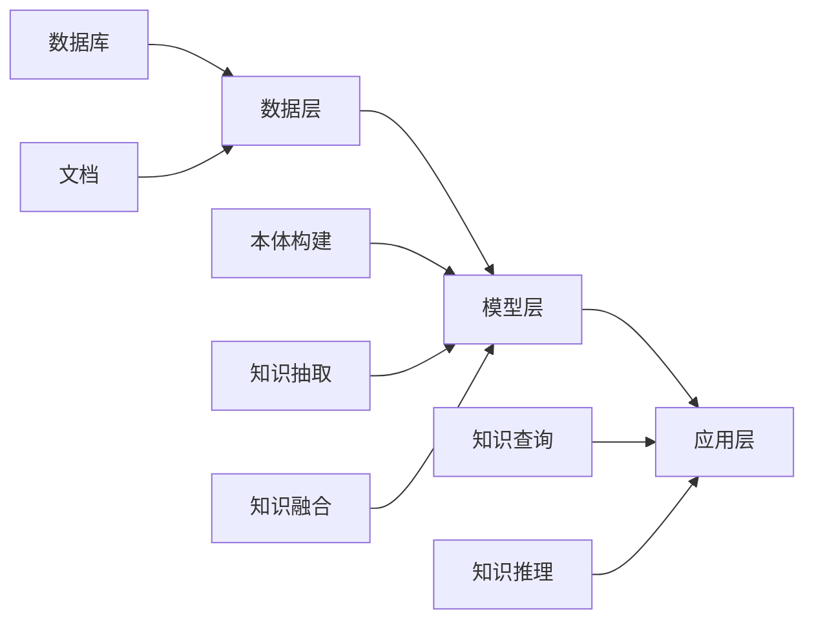
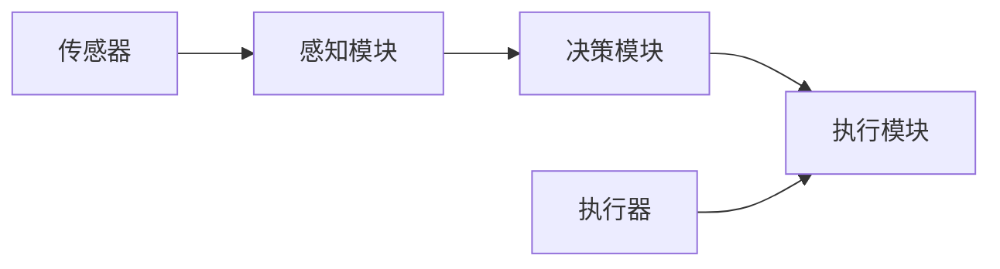

# 企业知识图谱与AI Agent的深度融合应用

> 关键词：企业知识图谱、AI Agent、深度融合、应用场景、知识推理

> 摘要：本文聚焦于企业知识图谱与AI Agent的深度融合应用。首先介绍了相关背景，包括目的范围、预期读者等内容。接着阐述了企业知识图谱和AI Agent的核心概念及其联系，给出了原理和架构的文本示意图与Mermaid流程图。详细讲解了核心算法原理和具体操作步骤，运用Python源代码进行说明。同时给出了相关的数学模型和公式，并举例说明。通过项目实战展示了融合应用的代码实现与解读。探讨了实际应用场景，推荐了相关工具和资源。最后总结了未来发展趋势与挑战，解答常见问题并提供扩展阅读和参考资料，旨在为企业更好地实现两者融合应用提供全面的技术指导。

## 1. 背景介绍 
### 1.1 目的和范围
在当今数字化快速发展的时代，企业积累了海量的数据和知识。企业知识图谱作为一种有效的知识表示和管理方式，能够将企业内的各种知识进行结构化整合，揭示实体之间的关系。而AI Agent则具有自主决策和执行任务的能力。将企业知识图谱与AI Agent深度融合，目的在于充分发挥两者的优势，实现更智能、高效的企业知识管理和应用。

本文的范围涵盖了企业知识图谱与AI Agent融合的核心概念、算法原理、实际应用场景等多个方面。从理论基础到实践操作，全面探讨如何实现两者的深度融合，以及融合后在企业中的具体应用。

### 1.2 预期读者
本文预期读者包括企业的技术管理人员、数据科学家、AI工程师、知识图谱开发者等。对于希望了解企业知识图谱与AI Agent融合技术的相关人员，以及对企业智能化升级有兴趣的从业者都具有参考价值。

### 1.3 文档结构概述
本文将按照以下结构进行阐述：首先介绍核心概念与联系，明确企业知识图谱和AI Agent的定义、原理及两者之间的关联；接着讲解核心算法原理和具体操作步骤，通过Python代码进行详细说明；然后给出数学模型和公式，并举例说明；通过项目实战展示融合应用的具体实现；探讨实际应用场景；推荐相关的工具和资源；总结未来发展趋势与挑战；解答常见问题；最后提供扩展阅读和参考资料。

### 1.4 术语表
#### 1.4.1 核心术语定义
- **企业知识图谱**：是一种基于图的数据结构，用于表示企业内的实体（如人员、产品、事件等）以及它们之间的关系。它将企业的各种知识进行结构化整合，以便更好地进行知识管理和推理。
- **AI Agent**：是一种具有自主感知、决策和执行能力的智能实体。它能够根据环境信息和预设目标，自主地采取行动，完成各种任务。
- **知识推理**：是指从已有的知识中推导出新的知识的过程。在企业知识图谱与AI Agent融合中，知识推理可以帮助AI Agent利用知识图谱中的信息做出更准确的决策。

#### 1.4.2 相关概念解释
- **本体**：是对概念和概念之间关系的一种形式化描述。在企业知识图谱中，本体用于定义实体的类型和它们之间的关系，是构建知识图谱的基础。
- **语义网**：是一种基于互联网的知识表示和共享方式，它强调数据的语义信息，使得计算机能够更好地理解和处理信息。企业知识图谱可以看作是语义网在企业内部的应用。

#### 1.4.3 缩略词列表
- **KG**：Knowledge Graph，知识图谱
- **AI**：Artificial Intelligence，人工智能

## 2. 核心概念与联系 

### 企业知识图谱原理和架构
企业知识图谱的核心原理是将企业内的各种数据和知识进行抽取、转换和加载（ETL），构建成图数据结构。它主要由实体、属性和关系组成。实体可以是企业中的人员、产品、部门等，属性是实体的特征，关系则描述了实体之间的联系。

其架构通常包括数据层、模型层和应用层。数据层负责存储企业的各种原始数据，如数据库、文档等；模型层用于构建知识图谱的本体和图结构，进行知识抽取和融合；应用层则基于知识图谱提供各种服务，如知识查询、知识推理等。

文本示意图如下：
```plaintext
         应用层
         |   |
         |   | 知识查询、知识推理等服务
         |   |
       模型层
       |   |
       |   | 本体构建、知识抽取、知识融合
       |   |
       数据层
       |   |
       |   | 数据库、文档等原始数据
       |   |
```

Mermaid流程图如下：


### AI Agent原理和架构
AI Agent的原理是基于感知、决策和执行的循环过程。它通过传感器感知环境信息，根据预设的目标和规则进行决策，然后通过执行器采取行动。

其架构一般包括感知模块、决策模块和执行模块。感知模块负责收集环境信息，决策模块根据感知信息和目标进行决策，执行模块将决策结果转化为具体的行动。

文本示意图如下：
```plaintext
       感知模块
       |       |
       |       | 收集环境信息
       |       |
     决策模块
     |       |
     |       | 根据信息和目标决策
     |       |
    执行模块
    |       |
    |       | 执行决策行动
    |       |
```

Mermaid流程图如下：


### 两者联系
企业知识图谱为AI Agent提供了丰富的背景知识。AI Agent在决策过程中，可以利用知识图谱中的信息进行推理，从而做出更准确的决策。例如，在企业客户服务场景中，AI Agent可以根据知识图谱中客户的历史信息和产品信息，为客户提供更个性化的服务。

同时，AI Agent也可以为企业知识图谱的更新和维护提供支持。AI Agent在执行任务过程中，可以发现新的知识和信息，并将其反馈到知识图谱中，实现知识图谱的动态更新。

## 3. 核心算法原理 & 具体操作步骤 

### 知识抽取算法
知识抽取是构建企业知识图谱的关键步骤，主要包括实体抽取和关系抽取。下面以命名实体识别（NER）为例，介绍实体抽取的算法原理和Python代码实现。

#### 算法原理
命名实体识别是指从文本中识别出具有特定意义的实体，如人名、地名、组织机构名等。常见的NER算法有基于规则的方法、基于机器学习的方法和基于深度学习的方法。这里我们使用基于深度学习的BiLSTM-CRF模型。

BiLSTM（双向长短期记忆网络）可以捕捉文本中的上下文信息，CRF（条件随机场）则用于对标签序列进行全局优化。

#### Python代码实现
```python
import torch
import torch.nn as nn
import torch.optim as optim
from torch.utils.data import Dataset, DataLoader

# 定义数据集类
class NERDataset(Dataset):
    def __init__(self, texts, labels):
        self.texts = texts
        self.labels = labels

    def __len__(self):
        return len(self.texts)

    def __getitem__(self, idx):
        text = self.texts[idx]
        label = self.labels[idx]
        return text, label

# 定义BiLSTM-CRF模型
class BiLSTM_CRF(nn.Module):
    def __init__(self, vocab_size, tag_to_ix, embedding_dim, hidden_dim):
        super(BiLSTM_CRF, self).__init__()
        self.embedding_dim = embedding_dim
        self.hidden_dim = hidden_dim
        self.vocab_size = vocab_size
        self.tag_to_ix = tag_to_ix
        self.tagset_size = len(tag_to_ix)

        self.word_embeds = nn.Embedding(vocab_size, embedding_dim)
        self.lstm = nn.LSTM(embedding_dim, hidden_dim // 2,
                            num_layers=1, bidirectional=True)

        self.hidden2tag = nn.Linear(hidden_dim, self.tagset_size)

        self.transitions = nn.Parameter(
            torch.randn(self.tagset_size, self.tagset_size))

        self.start_tag = "<START>"
        self.stop_tag = "<STOP>"
        self.tag_to_ix[self.start_tag] = len(tag_to_ix)
        self.tag_to_ix[self.stop_tag] = len(tag_to_ix)

    def _forward_alg(self, feats):
        # 前向算法
        init_alphas = torch.full((1, self.tagset_size), -10000.)
        init_alphas[0][self.tag_to_ix[self.start_tag]] = 0.

        forward_var = init_alphas

        for feat in feats:
            alphas_t = []
            for next_tag in range(self.tagset_size):
                emit_score = feat[next_tag].view(
                    1, -1).expand(1, self.tagset_size)
                trans_score = self.transitions[next_tag].view(1, -1)
                next_tag_var = forward_var + trans_score + emit_score
                alphas_t.append(log_sum_exp(next_tag_var).view(1))
            forward_var = torch.cat(alphas_t).view(1, -1)
        terminal_var = forward_var + self.transitions[self.tag_to_ix[self.stop_tag]]
        alpha = log_sum_exp(terminal_var)
        return alpha

    def _get_lstm_features(self, sentence):
        # 获取LSTM特征
        embeds = self.word_embeds(sentence).view(len(sentence), 1, -1)
        lstm_out, _ = self.lstm(embeds)
        lstm_out = lstm_out.view(len(sentence), self.hidden_dim)
        lstm_feats = self.hidden2tag(lstm_out)
        return lstm_feats

    def _score_sentence(self, feats, tags):
        # 计算句子的得分
        score = torch.zeros(1)
        tags = torch.cat([torch.tensor([self.tag_to_ix[self.start_tag]], dtype=torch.long), tags])
        for i, feat in enumerate(feats):
            score = score + \
                    self.transitions[tags[i + 1], tags[i]] + feat[tags[i + 1]]
        score = score + self.transitions[self.tag_to_ix[self.stop_tag], tags[-1]]
        return score

    def _viterbi_decode(self, feats):
        # Viterbi解码
        backpointers = []

        init_vvars = torch.full((1, self.tagset_size), -10000.)
        init_vvars[0][self.tag_to_ix[self.start_tag]] = 0

        forward_var = init_vvars
        for feat in feats:
            bptrs_t = []
            viterbivars_t = []

            for next_tag in range(self.tagset_size):
                next_tag_var = forward_var + self.transitions[next_tag]
                best_tag_id = argmax(next_tag_var)
                bptrs_t.append(best_tag_id)
                viterbivars_t.append(next_tag_var[0][best_tag_id].view(1))
            forward_var = (torch.cat(viterbivars_t) + feat).view(1, -1)
            backpointers.append(bptrs_t)

        terminal_var = forward_var + self.transitions[self.tag_to_ix[self.stop_tag]]
        best_tag_id = argmax(terminal_var)
        path_score = terminal_var[0][best_tag_id]

        best_path = [best_tag_id]
        for bptrs_t in reversed(backpointers):
            best_tag_id = bptrs_t[best_tag_id]
            best_path.append(best_tag_id)
        start = best_path.pop()
        assert start == self.tag_to_ix[self.start_tag]
        best_path.reverse()
        return path_score, best_path

    def neg_log_likelihood(self, sentence, tags):
        feats = self._get_lstm_features(sentence)
        forward_score = self._forward_alg(feats)
        gold_score = self._score_sentence(feats, tags)
        return forward_score - gold_score

    def forward(self, sentence):
        lstm_feats = self._get_lstm_features(sentence)
        score, tag_seq = self._viterbi_decode(lstm_feats)
        return score, tag_seq

# 辅助函数
def argmax(vec):
    _, idx = torch.max(vec, 1)
    return idx.item()

def log_sum_exp(vec):
    max_score = vec[0, argmax(vec)]
    return max_score + \
           torch.log(torch.sum(torch.exp(vec - max_score)))

# 训练模型
def train_model(model, dataloader, optimizer, epochs):
    for epoch in range(epochs):
        total_loss = 0
        for texts, labels in dataloader:
            model.zero_grad()
            loss = model.neg_log_likelihood(texts, labels)
            loss.backward()
            optimizer.step()
            total_loss += loss.item()
        print(f'Epoch {epoch + 1}, Loss: {total_loss}')

# 示例数据
texts = [[1, 2, 3], [4, 5, 6]]
labels = [[0, 1, 0], [1, 0, 1]]
vocab_size = 10
tag_to_ix = {"B-PER": 0, "I-PER": 1}
embedding_dim = 5
hidden_dim = 4

dataset = NERDataset(texts, labels)
dataloader = DataLoader(dataset, batch_size=2)

model = BiLSTM_CRF(vocab_size, tag_to_ix, embedding_dim, hidden_dim)
optimizer = optim.SGD(model.parameters(), lr=0.01, weight_decay=1e-4)

train_model(model, dataloader, optimizer, epochs=10)
```

### AI Agent决策算法
AI Agent的决策算法可以基于规则、强化学习等方法。这里以简单的基于规则的决策算法为例，介绍具体操作步骤。

#### 算法原理
基于规则的决策算法是根据预设的规则和条件进行决策。例如，在企业客户服务场景中，如果客户询问产品价格，AI Agent根据知识图谱中产品的价格信息进行回复。

#### Python代码实现
```python
# 模拟企业知识图谱
knowledge_graph = {
    "产品A": {
        "价格": 100,
        "库存": 20
    },
    "产品B": {
        "价格": 200,
        "库存": 10
    }
}

# 定义AI Agent类
class AIAgent:
    def __init__(self, knowledge_graph):
        self.knowledge_graph = knowledge_graph

    def make_decision(self, question):
        if "产品A价格" in question:
            price = self.knowledge_graph["产品A"]["价格"]
            return f"产品A的价格是{price}元。"
        elif "产品B价格" in question:
            price = self.knowledge_graph["产品B"]["价格"]
            return f"产品B的价格是{price}元。"
        else:
            return "抱歉，我无法回答这个问题。"

# 创建AI Agent实例
agent = AIAgent(knowledge_graph)

# 模拟用户问题
question = "产品A价格是多少？"
answer = agent.make_decision(question)
print(answer)
```

## 4. 数学模型和公式 & 详细讲解 & 举例说明 

### 知识推理中的数学模型
在知识推理中，常见的数学模型有基于逻辑的模型和基于概率的模型。这里以基于概率的马尔可夫逻辑网络（MLN）为例进行介绍。

#### 马尔可夫逻辑网络原理
马尔可夫逻辑网络是将一阶逻辑和概率图模型相结合的一种知识表示和推理方法。它通过给一阶逻辑公式赋予权重，将逻辑规则和概率信息统一起来。

#### 数学公式
马尔可夫逻辑网络的联合概率分布可以表示为：
$$P(x) = \frac{1}{Z} \exp \left( \sum_{i=1}^{m} w_i n_i(x) \right)$$
其中，$x$ 是所有可能的世界状态，$Z$ 是归一化常数，$w_i$ 是第 $i$ 个一阶逻辑公式的权重，$n_i(x)$ 是第 $i$ 个一阶逻辑公式在状态 $x$ 中满足的次数。

#### 详细讲解
在马尔可夫逻辑网络中，每个一阶逻辑公式代表一个约束条件，权重表示该约束条件的重要程度。通过计算联合概率分布，可以进行知识推理，例如计算某个事实成立的概率。

#### 举例说明
假设我们有以下一阶逻辑公式：
- 公式1：$\text{Friend}(x, y) \Rightarrow \text{Trust}(x, y)$，权重 $w_1 = 2$
- 公式2：$\text{Trust}(x, y) \land \text{Trust}(y, z) \Rightarrow \text{Trust}(x, z)$，权重 $w_2 = 3$

现在我们有一个世界状态 $x$，其中公式1满足2次，公式2满足1次。则联合概率分布为：
$$P(x) = \frac{1}{Z} \exp \left( 2 \times 2 + 3 \times 1 \right) = \frac{1}{Z} \exp(7)$$

### AI Agent决策中的数学模型
在AI Agent决策中，强化学习是一种常用的方法。以Q学习为例进行介绍。

#### Q学习原理
Q学习是一种无模型的强化学习算法，它通过学习一个动作价值函数 $Q(s, a)$ 来进行决策。$Q(s, a)$ 表示在状态 $s$ 下采取动作 $a$ 的预期累积奖励。

#### 数学公式
Q学习的更新公式为：
$$Q(s_t, a_t) \leftarrow Q(s_t, a_t) + \alpha \left[ r_{t+1} + \gamma \max_{a} Q(s_{t+1}, a) - Q(s_t, a_t) \right]$$
其中，$s_t$ 是当前状态，$a_t$ 是当前动作，$r_{t+1}$ 是执行动作 $a_t$ 后获得的奖励，$s_{t+1}$ 是下一个状态，$\alpha$ 是学习率，$\gamma$ 是折扣因子。

#### 详细讲解
Q学习的核心思想是通过不断地尝试不同的动作，根据获得的奖励来更新动作价值函数。学习率 $\alpha$ 控制了每次更新的步长，折扣因子 $\gamma$ 表示对未来奖励的重视程度。

#### 举例说明
假设我们有一个简单的游戏，状态空间 $S = \{s_1, s_2\}$，动作空间 $A = \{a_1, a_2\}$。初始时，$Q(s_1, a_1) = 0$，$Q(s_1, a_2) = 0$。

在状态 $s_1$ 下，我们选择动作 $a_1$，获得奖励 $r = 1$，进入状态 $s_2$。假设 $\alpha = 0.1$，$\gamma = 0.9$，则更新后的 $Q(s_1, a_1)$ 为：
$$Q(s_1, a_1) = 0 + 0.1 \left[ 1 + 0.9 \max_{a} Q(s_2, a) - 0 \right]$$

如果 $Q(s_2, a_1) = 0.5$，$Q(s_2, a_2) = 0.3$，则 $\max_{a} Q(s_2, a) = 0.5$，代入公式可得：
$$Q(s_1, a_1) = 0 + 0.1 \left[ 1 + 0.9 \times 0.5 - 0 \right] = 0.145$$

## 5. 项目实战：代码实际案例和详细解释说明 

### 5.1  开发环境搭建
#### 硬件环境
- 处理器：Intel Core i7及以上
- 内存：16GB及以上
- 硬盘：至少500GB可用空间

#### 软件环境
- 操作系统：Windows 10、Linux（如Ubuntu）或macOS
- Python版本：3.7及以上
- 相关库和框架：
  - PyTorch：用于深度学习模型的开发
  - Neo4j：用于存储和管理企业知识图谱
  - Flask：用于构建Web服务，实现AI Agent与用户的交互

#### 安装步骤
1. 安装Python：从Python官方网站下载并安装Python 3.7及以上版本。
2. 安装PyTorch：根据自己的系统和CUDA版本，从PyTorch官方网站选择合适的安装命令进行安装。
3. 安装Neo4j：从Neo4j官方网站下载并安装Neo4j数据库。
4. 安装Flask：使用pip命令安装Flask库：`pip install flask`

### 5.2  源代码详细实现和代码解读
#### 企业知识图谱构建
```python
from py2neo import Graph, Node, Relationship

# 连接Neo4j数据库
graph = Graph("bolt://localhost:7687", auth=("neo4j", "password"))

# 创建实体节点
person = Node("Person", name="张三")
product = Node("Product", name="产品A")

# 将节点添加到图数据库中
graph.create(person)
graph.create(product)

# 创建关系
purchase = Relationship(person, "PURCHASED", product)
graph.create(purchase)
```
代码解读：
- 首先使用`py2neo`库连接到Neo4j数据库。
- 创建`Person`和`Product`类型的节点，并将它们添加到图数据库中。
- 创建`PURCHASED`关系，表示`Person`购买了`Product`，并将该关系添加到图数据库中。

#### AI Agent实现
```python
from flask import Flask, request

app = Flask(__name__)

# 模拟企业知识图谱查询
def query_knowledge_graph(question):
    if "张三购买了什么产品" in question:
        query = "MATCH (p:Person {name: '张三'})-[:PURCHASED]->(pr:Product) RETURN pr.name"
        result = graph.run(query)
        products = [record["pr.name"] for record in result]
        return f"张三购买了{', '.join(products)}。"
    else:
        return "抱歉，我无法回答这个问题。"

@app.route('/ask', methods=['POST'])
def ask():
    question = request.json.get('question')
    answer = query_knowledge_graph(question)
    return {'answer': answer}

if __name__ == '__main__':
    app.run(debug=True)
```
代码解读：
- 使用Flask框架创建一个Web服务。
- `query_knowledge_graph`函数根据用户的问题在企业知识图谱中进行查询，并返回相应的答案。
- `/ask`接口接收用户的问题，调用`query_knowledge_graph`函数进行查询，并返回答案。

### 5.3  代码解读与分析
#### 企业知识图谱构建代码分析
- 使用`py2neo`库可以方便地与Neo4j数据库进行交互，创建节点和关系。
- 在实际应用中，可以从企业的各种数据源中抽取实体和关系，然后批量添加到图数据库中。

#### AI Agent代码分析
- Flask框架提供了简单易用的Web服务接口，方便与用户进行交互。
- `query_knowledge_graph`函数根据用户的问题进行知识图谱查询，这里只是一个简单的示例，实际应用中可以使用更复杂的查询语句和推理算法。

## 6. 实际应用场景 
### 智能客服
在企业客服场景中，企业知识图谱与AI Agent的融合可以实现更智能的客户服务。AI Agent可以利用知识图谱中的客户信息、产品信息和历史服务记录，为客户提供个性化的解决方案。例如，当客户询问产品的使用方法时，AI Agent可以根据知识图谱中产品的特点和客户的使用习惯，提供详细的操作指南。

### 供应链管理
在供应链管理中，企业知识图谱可以整合供应商、产品、库存等信息，AI Agent可以根据这些信息进行实时决策。例如，当库存水平低于阈值时，AI Agent可以自动触发采购流程，并根据知识图谱中供应商的信誉和交货时间，选择最合适的供应商。

### 风险评估
企业知识图谱可以收集企业的各种风险信息，如市场风险、信用风险等。AI Agent可以利用这些信息进行风险评估和预警。例如，当某个客户的信用评分下降时，AI Agent可以及时提醒企业采取相应的措施，降低风险。

### 智能推荐
在企业的营销和销售场景中，企业知识图谱与AI Agent的融合可以实现智能推荐。AI Agent可以根据知识图谱中客户的偏好和购买历史，为客户推荐合适的产品和服务。例如，在电商平台上，AI Agent可以根据用户的浏览记录和购买行为，推荐相关的商品。

## 7. 工具和资源推荐
### 7.1 学习资源推荐
#### 7.1.1 书籍推荐
- 《知识图谱：方法、实践与应用》：全面介绍了知识图谱的基本概念、构建方法和应用场景。
- 《人工智能：一种现代方法》：经典的人工智能教材，涵盖了AI Agent、机器学习等多个方面的内容。
- 《Python深度学习》：详细介绍了Python在深度学习中的应用，对于实现知识抽取和推理算法有很大帮助。

#### 7.1.2 在线课程
- Coursera上的“人工智能基础”课程：由知名高校教授授课，系统介绍了人工智能的基本概念和方法。
- edX上的“知识图谱与语义网”课程：深入讲解了知识图谱的构建和应用。
- 中国大学MOOC上的“Python语言程序设计”课程：适合初学者快速掌握Python编程。

#### 7.1.3 技术博客和网站
- 开源中国（OSChina）：提供了丰富的技术文章和开源项目，对于了解最新的技术动态有很大帮助。
- 博客园：众多技术开发者分享自己的经验和心得，有很多关于知识图谱和AI Agent的优秀文章。
- 机器之心：专注于人工智能领域的资讯和技术解读，提供了很多有价值的深度文章。

### 7.2 开发工具框架推荐
#### 7.2.1 IDE和编辑器
- PyCharm：功能强大的Python集成开发环境，提供了代码编辑、调试、版本控制等一系列功能。
- Visual Studio Code：轻量级的代码编辑器，支持多种编程语言，有丰富的插件扩展。
- Jupyter Notebook：交互式的开发环境，适合进行数据探索和模型实验。

#### 7.2.2 调试和性能分析工具
- PySnooper：可以方便地调试Python代码，自动记录函数的调用过程和变量的值。
- cProfile：Python自带的性能分析工具，可以分析代码的运行时间和函数调用次数。
- TensorBoard：用于可视化深度学习模型的训练过程和性能指标。

#### 7.2.3 相关框架和库
- PyTorch：开源的深度学习框架，提供了丰富的神经网络模型和优化算法。
- Neo4j：图数据库，用于存储和管理企业知识图谱。
- NLTK：自然语言处理工具包，提供了很多文本处理和分析的功能。

### 7.3 相关论文著作推荐
#### 7.3.1 经典论文
- “Knowledge Graph Embedding: A Survey of Approaches and Applications”：对知识图谱嵌入的方法和应用进行了全面的综述。
- “Artificial Intelligence as an Agent”：介绍了AI Agent的基本概念和理论。
- “Markov Logic Networks”：马尔可夫逻辑网络的经典论文，详细阐述了其原理和应用。

#### 7.3.2 最新研究成果
- 在ACM SIGKDD、NeurIPS等顶级学术会议上可以找到关于企业知识图谱与AI Agent融合的最新研究成果。
- 相关的学术期刊如《Journal of Artificial Intelligence Research》《Artificial Intelligence》等也会发表该领域的前沿研究。

#### 7.3.3 应用案例分析
- 一些知名企业如Google、Microsoft等会在其技术博客上分享企业知识图谱与AI Agent融合的应用案例，可以从中学习到实际应用中的经验和技巧。

## 8. 总结：未来发展趋势与挑战
### 未来发展趋势
- **更加智能化**：随着深度学习和强化学习等技术的不断发展，企业知识图谱与AI Agent的融合将更加智能化。AI Agent将能够更好地理解和处理自然语言，进行更复杂的知识推理和决策。
- **跨领域融合**：企业知识图谱与AI Agent的应用将不再局限于某个特定领域，而是会与其他领域如物联网、大数据等进行深度融合，创造出更多的应用场景。
- **自动化构建**：未来，企业知识图谱的构建将更加自动化。可以通过自动抽取、融合和更新技术，快速构建和维护大规模的企业知识图谱。

### 挑战
- **数据质量问题**：企业知识图谱的质量很大程度上取决于数据的质量。如果数据存在错误、不一致等问题，会影响知识图谱的准确性和可靠性，进而影响AI Agent的决策。
- **知识推理的复杂性**：在实际应用中，知识推理往往面临着复杂的逻辑和语义问题。如何提高知识推理的效率和准确性，是一个亟待解决的问题。
- **安全和隐私问题**：企业知识图谱中包含了大量的敏感信息，如客户信息、商业机密等。如何保障这些信息的安全和隐私，防止数据泄露，是企业面临的重要挑战。

## 9. 附录：常见问题与解答
### 问题1：企业知识图谱与传统数据库有什么区别？
解答：传统数据库主要以表格形式存储数据，注重数据的结构化和一致性。而企业知识图谱以图结构存储数据，更强调实体之间的关系。知识图谱可以更直观地展示企业内的各种知识和信息，支持更复杂的知识推理和查询。

### 问题2：AI Agent如何与企业知识图谱进行交互？
解答：AI Agent可以通过查询接口与企业知识图谱进行交互。在决策过程中，AI Agent可以根据需要从知识图谱中获取相关的知识和信息，用于推理和决策。同时，AI Agent也可以将新的知识和信息反馈到知识图谱中，实现知识图谱的更新和维护。

### 问题3：构建企业知识图谱需要哪些数据？
解答：构建企业知识图谱需要多种类型的数据，包括结构化数据（如数据库中的数据）、半结构化数据（如XML、JSON文件）和非结构化数据（如文本、图片、视频等）。可以从企业的各种业务系统、文档、社交媒体等渠道收集这些数据。

### 问题4：如何评估企业知识图谱与AI Agent融合的效果？
解答：可以从多个方面评估融合的效果，如准确性、效率、可用性等。准确性可以通过对比AI Agent的决策结果与实际情况来评估；效率可以通过测量AI Agent的响应时间和处理能力来评估；可用性可以通过用户的反馈和满意度来评估。

## 10. 扩展阅读 & 参考资料
### 扩展阅读
- 《大数据时代：生活、工作与思维的大变革》：介绍了大数据对企业和社会的影响，对于理解企业知识图谱和AI Agent的应用背景有帮助。
- 《智能时代：大数据与智能革命重新定义未来》：探讨了智能技术在各个领域的应用和发展趋势。

### 参考资料
- 相关学术论文和研究报告，如ACM SIGKDD、NeurIPS等会议的论文集。
- 企业知识图谱和AI Agent相关的开源项目和代码库，如GitHub上的相关项目。
- 官方文档和技术手册，如PyTorch、Neo4j等工具和框架的官方文档。