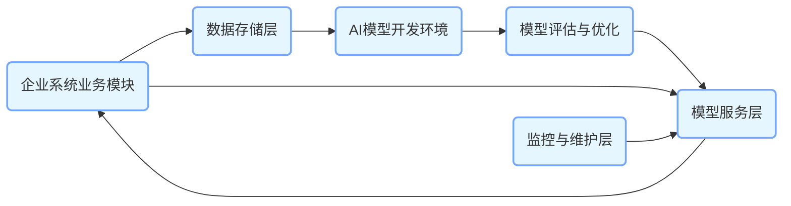

# 企业系统中AI模型的集成与部署

> 关键词：企业系统、AI模型、集成、部署、机器学习、深度学习、自动化

> 摘要：本文聚焦于企业系统中AI模型的集成与部署这一关键议题。首先介绍了相关背景，包括目的范围、预期读者等内容。接着深入阐述了核心概念与联系，剖析AI模型在企业系统中的原理和架构。详细讲解了核心算法原理，结合Python代码进行具体操作步骤的演示。通过数学模型和公式进一步揭示其内在逻辑，并举例说明。在项目实战部分，给出了开发环境搭建、源代码实现与解读等内容。探讨了实际应用场景，推荐了学习资源、开发工具框架以及相关论文著作。最后总结了未来发展趋势与挑战，提供常见问题解答和扩展阅读参考资料，旨在为企业在AI模型的集成与部署方面提供全面且深入的技术指导。

## 1. 背景介绍 
### 1.1 目的和范围
在当今数字化时代，企业面临着日益激烈的竞争，需要不断提升自身的效率和竞争力。AI模型作为一种强大的工具，可以帮助企业从海量数据中提取有价值的信息，实现智能化决策、自动化流程等。本文章的目的在于深入探讨如何将AI模型有效地集成到企业现有的系统中，并进行稳定可靠的部署，以充分发挥AI模型的优势。

范围涵盖了常见的企业系统，如企业资源规划（ERP）系统、客户关系管理（CRM）系统、供应链管理系统等。同时涉及多种类型的AI模型，包括机器学习模型（如决策树、支持向量机等）和深度学习模型（如卷积神经网络、循环神经网络等）。

### 1.2 预期读者
本文的预期读者主要包括企业的技术管理人员、IT开发人员、数据科学家以及对AI在企业应用感兴趣的相关人员。技术管理人员可以从本文中了解AI模型集成与部署的战略意义和整体流程，以便进行合理的规划和决策。IT开发人员能够获取具体的技术实现细节，包括算法原理、代码实现等，从而更好地完成开发任务。数据科学家可以进一步思考如何将自己训练的AI模型更好地融入企业系统。而对AI在企业应用感兴趣的相关人员可以通过本文对整个过程有一个全面的认识。

### 1.3 文档结构概述
本文将按照以下结构展开：首先介绍背景信息，包括目的范围、预期读者等。接着阐述核心概念与联系，明确AI模型与企业系统的关系和原理架构。然后详细讲解核心算法原理和具体操作步骤，结合Python代码进行说明。通过数学模型和公式深入分析其内在逻辑，并举例说明。在项目实战部分，给出开发环境搭建、源代码实现与解读等内容。探讨实际应用场景，推荐学习资源、开发工具框架以及相关论文著作。最后总结未来发展趋势与挑战，提供常见问题解答和扩展阅读参考资料。

### 1.4 术语表
#### 1.4.1 核心术语定义
- **企业系统**：指企业为了实现自身的业务目标，采用计算机技术和信息技术构建的一系列信息系统，用于管理企业的各种资源和业务流程，如ERP、CRM等系统。
- **AI模型**：基于人工智能技术构建的模型，通过对大量数据的学习和分析，能够完成各种任务，如分类、预测、聚类等。
- **集成**：将AI模型与企业现有的系统进行整合，使它们能够协同工作，实现数据的共享和业务流程的自动化。
- **部署**：将训练好的AI模型投入到实际的生产环境中，使其能够稳定、可靠地运行，为企业提供服务。

#### 1.4.2 相关概念解释
- **机器学习**：是一门多领域交叉学科，涉及概率论、统计学、逼近论、凸分析、算法复杂度理论等多门学科。它专门研究计算机怎样模拟或实现人类的学习行为，以获取新的知识或技能，重新组织已有的知识结构使之不断改善自身的性能。
- **深度学习**：是机器学习的一个分支领域，它是一种基于对数据进行表征学习的方法。深度学习通过构建具有很多层的神经网络模型，自动从大量数据中学习特征和模式，从而实现对数据的分类、预测等任务。

#### 1.4.3 缩略词列表
- **ERP**：Enterprise Resource Planning，企业资源规划
- **CRM**：Customer Relationship Management，客户关系管理
- **SCM**：Supply Chain Management，供应链管理
- **CNN**：Convolutional Neural Network，卷积神经网络
- **RNN**：Recurrent Neural Network，循环神经网络

## 2. 核心概念与联系 
在企业系统中集成与部署AI模型，涉及到多个核心概念，这些概念相互关联，共同构成了整个流程的基础。

### 核心概念原理
- **企业系统**：企业系统是企业运营的数字化支撑平台，它包含了企业的各种业务流程和数据。不同的企业系统有不同的功能和架构，但它们的主要目的都是提高企业的运营效率和管理水平。例如，ERP系统主要用于管理企业的财务、采购、生产、销售等核心业务流程；CRM系统则专注于管理企业与客户之间的关系，包括客户信息、销售机会、客户服务等。
- **AI模型**：AI模型是基于人工智能技术构建的，它通过对大量数据的学习和分析，能够发现数据中的模式和规律，并根据这些模式和规律进行预测和决策。AI模型可以分为监督学习模型、无监督学习模型和强化学习模型等不同类型。监督学习模型通过有标签的数据进行学习，用于分类和回归等任务；无监督学习模型则从无标签的数据中发现数据的结构和模式，如聚类分析；强化学习模型通过与环境进行交互，不断优化自己的行为策略。
- **集成**：集成是将AI模型与企业系统进行整合的过程。在集成过程中，需要解决数据的共享、接口的对接、业务流程的协调等问题。通过集成，AI模型可以从企业系统中获取所需的数据进行分析和处理，并将分析结果反馈给企业系统，从而实现业务流程的自动化和智能化。
- **部署**：部署是将训练好的AI模型投入到实际生产环境中的过程。在部署过程中，需要考虑模型的性能、可靠性、安全性等因素。同时，还需要对模型进行监控和维护，及时发现和解决模型运行过程中出现的问题。

### 架构的文本示意图
企业系统中AI模型的集成与部署架构可以描述如下：

企业系统作为核心的业务运营平台，包含了多个业务模块，如财务模块、销售模块、采购模块等。这些业务模块产生和存储了大量的业务数据。数据存储层负责存储这些业务数据，包括关系型数据库、非关系型数据库等。

AI模型开发环境是训练和优化AI模型的地方。数据科学家从数据存储层获取数据，进行数据预处理、特征工程等操作，然后使用机器学习或深度学习算法训练AI模型。训练好的AI模型经过评估和优化后，被部署到模型服务层。

模型服务层是AI模型与企业系统进行交互的接口。它提供了一系列的API接口，企业系统可以通过这些接口调用AI模型的服务。当企业系统中的业务流程需要进行智能决策或分析时，它会调用模型服务层的API接口，将相关的数据发送给AI模型进行处理。AI模型处理完数据后，将结果返回给企业系统，企业系统根据这些结果进行相应的业务操作。

监控与维护层负责对AI模型的运行状态进行监控和维护。它可以实时监测AI模型的性能指标，如准确率、召回率、响应时间等。当发现模型的性能出现异常时，监控与维护层可以及时采取措施进行调整和优化，保证AI模型的稳定运行。

### Mermaid 流程图


## 3. 核心算法原理 & 具体操作步骤 
### 核心算法原理
在企业系统中集成与部署AI模型，常用的算法包括机器学习算法和深度学习算法。下面以决策树算法和卷积神经网络（CNN）为例进行介绍。

#### 决策树算法原理
决策树是一种基于树结构进行决策的机器学习算法。它通过对数据的特征进行划分，构建一个树形结构，每个内部节点表示一个特征上的测试，每个分支表示一个测试输出，每个叶节点表示一个类别或值。决策树的构建过程是一个递归的过程，通过选择最优的特征和划分点，将数据集不断地划分为更小的子集，直到满足停止条件。

决策树算法的优点是简单易懂、可解释性强，能够处理多分类问题和回归问题。缺点是容易过拟合，需要进行剪枝等操作来提高模型的泛化能力。

#### 卷积神经网络（CNN）原理
卷积神经网络是一种专门用于处理具有网格结构数据（如图像、音频等）的深度学习模型。它主要由卷积层、池化层和全连接层组成。

卷积层通过卷积核在输入数据上进行滑动卷积操作，提取数据的局部特征。卷积核是一个小的矩阵，它在输入数据上进行滑动，与输入数据的局部区域进行点积运算，得到一个特征图。不同的卷积核可以提取不同的特征。

池化层用于对卷积层输出的特征图进行下采样，减少数据的维度，同时保留重要的特征信息。常用的池化操作有最大池化和平均池化。

全连接层将池化层输出的特征图展开成一维向量，然后通过全连接的方式连接到输出层，进行分类或回归等任务。

### 具体操作步骤及Python源代码实现
#### 决策树算法实现
以下是一个使用Python的`scikit-learn`库实现决策树分类的示例代码：
```python
from sklearn.datasets import load_iris
from sklearn.model_selection import train_test_split
from sklearn.tree import DecisionTreeClassifier
from sklearn.metrics import accuracy_score

# 加载数据集
iris = load_iris()
X = iris.data
y = iris.target

# 划分训练集和测试集
X_train, X_test, y_train, y_test = train_test_split(X, y, test_size=0.3, random_state=42)

# 创建决策树分类器
clf = DecisionTreeClassifier()

# 训练模型
clf.fit(X_train, y_train)

# 预测
y_pred = clf.predict(X_test)

# 计算准确率
accuracy = accuracy_score(y_test, y_pred)
print(f"决策树模型的准确率: {accuracy}")
```
代码解释：
1. **加载数据集**：使用`load_iris`函数加载鸢尾花数据集，该数据集包含了150个样本，每个样本有4个特征，分为3个类别。
2. **划分训练集和测试集**：使用`train_test_split`函数将数据集划分为训练集和测试集，测试集占总数据集的30%。
3. **创建决策树分类器**：使用`DecisionTreeClassifier`类创建一个决策树分类器对象。
4. **训练模型**：使用`fit`方法对决策树分类器进行训练，传入训练集的特征和标签。
5. **预测**：使用`predict`方法对测试集的特征进行预测，得到预测结果。
6. **计算准确率**：使用`accuracy_score`函数计算预测结果的准确率。

#### 卷积神经网络（CNN）实现
以下是一个使用Python的`TensorFlow`库实现简单CNN分类的示例代码：
```python
import tensorflow as tf
from tensorflow.keras.datasets import mnist
from tensorflow.keras.models import Sequential
from tensorflow.keras.layers import Conv2D, MaxPooling2D, Flatten, Dense

# 加载MNIST数据集
(train_images, train_labels), (test_images, test_labels) = mnist.load_data()

# 数据预处理
train_images = train_images.reshape((60000, 28, 28, 1)).astype('float32') / 255
test_images = test_images.reshape((10000, 28, 28, 1)).astype('float32') / 255

train_labels = tf.keras.utils.to_categorical(train_labels)
test_labels = tf.keras.utils.to_categorical(test_labels)

# 构建CNN模型
model = Sequential([
    Conv2D(32, (3, 3), activation='relu', input_shape=(28, 28, 1)),
    MaxPooling2D((2, 2)),
    Conv2D(64, (3, 3), activation='relu'),
    MaxPooling2D((2, 2)),
    Flatten(),
    Dense(64, activation='relu'),
    Dense(10, activation='softmax')
])

# 编译模型
model.compile(optimizer='adam',
              loss='categorical_crossentropy',
              metrics=['accuracy'])

# 训练模型
model.fit(train_images, train_labels, epochs=5, batch_size=64)

# 评估模型
test_loss, test_acc = model.evaluate(test_images, test_labels)
print(f"CNN模型的测试准确率: {test_acc}")
```
代码解释：
1. **加载MNIST数据集**：使用`mnist.load_data`函数加载MNIST手写数字数据集，该数据集包含60000个训练样本和10000个测试样本。
2. **数据预处理**：将图像数据的形状调整为`(样本数, 高度, 宽度, 通道数)`，并将像素值归一化到0-1之间。将标签数据进行one-hot编码。
3. **构建CNN模型**：使用`Sequential`模型构建一个简单的CNN模型，包含卷积层、池化层、全连接层等。
4. **编译模型**：使用`compile`方法编译模型，指定优化器、损失函数和评估指标。
5. **训练模型**：使用`fit`方法对模型进行训练，指定训练数据、训练轮数和批次大小。
6. **评估模型**：使用`evaluate`方法对模型进行评估，得到测试集的损失和准确率。

## 4. 数学模型和公式 & 详细讲解 & 举例说明 
### 决策树算法的数学模型和公式
#### 信息熵
信息熵是衡量数据不确定性的一个指标。对于一个分类问题，设数据集 $D$ 中包含 $n$ 个类别，第 $i$ 个类别的样本数为 $n_i$，则数据集 $D$ 的信息熵 $H(D)$ 定义为：
$$H(D)=-\sum_{i=1}^{n}p_i\log_2p_i$$
其中，$p_i=\frac{n_i}{|D|}$ 表示第 $i$ 个类别的样本在数据集中所占的比例，$|D|$ 表示数据集 $D$ 的样本总数。

信息熵越大，说明数据的不确定性越大；信息熵越小，说明数据的纯度越高。

#### 信息增益
信息增益是衡量特征对分类的重要性的一个指标。对于一个特征 $A$，设数据集 $D$ 按照特征 $A$ 的取值划分为 $v$ 个子集 $D_1,D_2,\cdots,D_v$，则特征 $A$ 对数据集 $D$ 的信息增益 $Gain(D,A)$ 定义为：
$$Gain(D,A)=H(D)-\sum_{i=1}^{v}\frac{|D_i|}{|D|}H(D_i)$$
其中，$|D_i|$ 表示子集 $D_i$ 的样本数，$H(D_i)$ 表示子集 $D_i$ 的信息熵。

信息增益越大，说明特征 $A$ 对分类的贡献越大，越适合作为决策树的划分特征。

#### 举例说明
假设有一个数据集 $D$ 包含10个样本，分为两个类别：正类和负类，其中正类有6个样本，负类有4个样本。则数据集 $D$ 的信息熵为：
$$p_1=\frac{6}{10}=0.6, p_2=\frac{4}{10}=0.4$$
$$H(D)=-0.6\log_20.6 - 0.4\log_20.4\approx 0.971$$
假设现在有一个特征 $A$，按照特征 $A$ 的取值将数据集 $D$ 划分为两个子集 $D_1$ 和 $D_2$，$D_1$ 包含4个样本，其中正类有3个，负类有1个；$D_2$ 包含6个样本，其中正类有3个，负类有3个。则子集 $D_1$ 和 $D_2$ 的信息熵分别为：
$$p_{11}=\frac{3}{4}=0.75, p_{12}=\frac{1}{4}=0.25$$
$$H(D_1)=-0.75\log_20.75 - 0.25\log_20.25\approx 0.811$$
$$p_{21}=\frac{3}{6}=0.5, p_{22}=\frac{3}{6}=0.5$$
$$H(D_2)=-0.5\log_20.5 - 0.5\log_20.5 = 1$$
则特征 $A$ 对数据集 $D$ 的信息增益为：
$$Gain(D,A)=0.971-\frac{4}{10}\times0.811-\frac{6}{10}\times1\approx 0.147$$

### 卷积神经网络（CNN）的数学模型和公式
#### 卷积操作
卷积操作是CNN的核心操作之一。设输入特征图为 $X$，卷积核为 $W$，则卷积操作的输出特征图 $Y$ 可以表示为：
$$Y_{i,j}=\sum_{m=0}^{M-1}\sum_{n=0}^{N-1}X_{i+m,j+n}W_{m,n}+b$$
其中，$Y_{i,j}$ 表示输出特征图中第 $(i,j)$ 位置的元素，$X_{i+m,j+n}$ 表示输入特征图中第 $(i+m,j+n)$ 位置的元素，$W_{m,n}$ 表示卷积核中第 $(m,n)$ 位置的元素，$b$ 是偏置项，$M$ 和 $N$ 分别是卷积核的高度和宽度。

#### 池化操作
池化操作用于对特征图进行下采样。以最大池化为例，设输入特征图为 $X$，池化窗口的大小为 $k\times k$，步长为 $s$，则最大池化操作的输出特征图 $Y$ 可以表示为：
$$Y_{i,j}=\max_{m=0}^{k-1}\max_{n=0}^{k-1}X_{i\times s + m,j\times s + n}$$
其中，$Y_{i,j}$ 表示输出特征图中第 $(i,j)$ 位置的元素，$X_{i\times s + m,j\times s + n}$ 表示输入特征图中第 $(i\times s + m,j\times s + n)$ 位置的元素。

#### 举例说明
假设输入特征图 $X$ 是一个 $3\times 3$ 的矩阵：
$$X=\begin{bmatrix}
1 & 2 & 3 \\
4 & 5 & 6 \\
7 & 8 & 9
\end{bmatrix}$$
卷积核 $W$ 是一个 $2\times 2$ 的矩阵：
$$W=\begin{bmatrix}
1 & 2 \\
3 & 4
\end{bmatrix}$$
偏置项 $b = 1$。则卷积操作的输出特征图 $Y$ 为：
$$Y_{0,0}=1\times1 + 2\times2 + 4\times3 + 5\times4 + 1 = 38$$
$$Y_{0,1}=2\times1 + 3\times2 + 5\times3 + 6\times4 + 1 = 48$$
$$Y_{1,0}=4\times1 + 5\times2 + 7\times3 + 8\times4 + 1 = 68$$
$$Y_{1,1}=5\times1 + 6\times2 + 8\times3 + 9\times4 + 1 = 78$$
即：
$$Y=\begin{bmatrix}
38 & 48 \\
68 & 78
\end{bmatrix}$$
假设使用 $2\times 2$ 的最大池化窗口对 $Y$ 进行池化操作，步长为 2，则池化操作的输出为：
$$Y_{pool}=\begin{bmatrix}
78
\end{bmatrix}$$

## 5. 项目实战：代码实际案例和详细解释说明 
### 5.1  开发环境搭建
在进行企业系统中AI模型的集成与部署项目实战之前，需要搭建相应的开发环境。以下是具体的步骤：

#### 安装Python
Python是一种广泛使用的编程语言，许多机器学习和深度学习库都是基于Python开发的。可以从Python官方网站（https://www.python.org/downloads/） 下载适合自己操作系统的Python版本进行安装。建议安装Python 3.6及以上版本。

#### 安装虚拟环境
为了避免不同项目之间的依赖冲突，建议使用虚拟环境来管理项目的依赖。可以使用`venv`或`conda`来创建虚拟环境。

使用`venv`创建虚拟环境的命令如下：
```bash
python -m venv myenv
```
激活虚拟环境：
- 在Windows上：
```bash
myenv\Scripts\activate
```
- 在Linux或Mac上：
```bash
source myenv/bin/activate
```

#### 安装必要的库
在虚拟环境中安装必要的机器学习和深度学习库，如`scikit-learn`、`TensorFlow`、`Keras`等。可以使用`pip`来安装这些库：
```bash
pip install scikit-learn tensorflow keras
```

### 5.2  源代码详细实现和代码解读
#### 项目背景
假设我们要将一个简单的机器学习模型集成到一个企业的客户关系管理（CRM）系统中，用于预测客户是否会购买某种产品。我们使用一个基于逻辑回归的分类模型。

#### 数据准备
首先，我们需要准备数据集。假设我们已经有一个包含客户信息和购买记录的CSV文件`customer_data.csv`，其中包含客户的年龄、性别、收入等特征，以及是否购买的标签。

以下是读取和预处理数据的代码：
```python
import pandas as pd
from sklearn.model_selection import train_test_split
from sklearn.preprocessing import StandardScaler
from sklearn.linear_model import LogisticRegression
from sklearn.metrics import accuracy_score

# 读取数据
data = pd.read_csv('customer_data.csv')

# 分离特征和标签
X = data.drop('purchased', axis=1)
y = data['purchased']

# 数据预处理
scaler = StandardScaler()
X_scaled = scaler.fit_transform(X)

# 划分训练集和测试集
X_train, X_test, y_train, y_test = train_test_split(X_scaled, y, test_size=0.2, random_state=42)
```
代码解读：
1. **读取数据**：使用`pandas`库的`read_csv`函数读取CSV文件中的数据。
2. **分离特征和标签**：将数据集中的特征（除了`purchased`列）和标签（`purchased`列）分离。
3. **数据预处理**：使用`StandardScaler`对特征数据进行标准化处理，使数据具有零均值和单位方差。
4. **划分训练集和测试集**：使用`train_test_split`函数将数据集划分为训练集和测试集，测试集占总数据集的20%。

#### 模型训练和评估
以下是训练逻辑回归模型并评估其性能的代码：
```python
# 创建逻辑回归模型
model = LogisticRegression()

# 训练模型
model.fit(X_train, y_train)

# 预测
y_pred = model.predict(X_test)

# 计算准确率
accuracy = accuracy_score(y_test, y_pred)
print(f"逻辑回归模型的准确率: {accuracy}")
```
代码解读：
1. **创建逻辑回归模型**：使用`LogisticRegression`类创建一个逻辑回归模型对象。
2. **训练模型**：使用`fit`方法对模型进行训练，传入训练集的特征和标签。
3. **预测**：使用`predict`方法对测试集的特征进行预测，得到预测结果。
4. **计算准确率**：使用`accuracy_score`函数计算预测结果的准确率。

#### 集成到企业系统
假设企业的CRM系统是一个基于Web的应用程序，我们可以使用Flask框架将训练好的模型封装成一个API，供CRM系统调用。

以下是使用Flask框架实现API的代码：
```python
from flask import Flask, request, jsonify
import pandas as pd
from sklearn.preprocessing import StandardScaler
import joblib

app = Flask(__name__)

# 加载模型和数据预处理对象
model = joblib.load('logistic_regression_model.pkl')
scaler = joblib.load('scaler.pkl')

@app.route('/predict', methods=['POST'])
def predict():
    data = request.get_json(force=True)
    df = pd.DataFrame(data, index=[0])
    X_scaled = scaler.transform(df)
    prediction = model.predict(X_scaled)
    return jsonify({'prediction': int(prediction[0])})

if __name__ == '__main__':
    app.run(debug=True)
```
代码解读：
1. **加载模型和数据预处理对象**：使用`joblib`库加载之前训练好的逻辑回归模型和数据预处理对象。
2. **定义API接口**：使用`@app.route`装饰器定义一个`/predict`的POST请求接口。
3. **处理请求**：在`predict`函数中，获取请求中的JSON数据，将其转换为`pandas`的`DataFrame`对象，然后使用数据预处理对象对数据进行标准化处理，最后使用模型进行预测，并将预测结果以JSON格式返回。
4. **运行Flask应用**：使用`app.run`方法启动Flask应用。

### 5.3  代码解读与分析
#### 数据预处理的重要性
在机器学习中，数据预处理是非常重要的一步。通过对数据进行标准化处理，可以使不同特征具有相同的尺度，避免某些特征因为数值范围过大而对模型产生过大的影响。同时，数据预处理还可以处理缺失值、异常值等问题，提高数据的质量。

#### 模型选择和评估
在本项目中，我们选择了逻辑回归模型，这是一种简单而有效的分类模型。在实际应用中，需要根据具体的问题和数据特点选择合适的模型。同时，使用准确率等评估指标来评估模型的性能，确保模型具有较好的泛化能力。

#### 集成到企业系统的方式
通过使用Flask框架将模型封装成API，实现了模型与企业系统的集成。这种方式具有灵活性和可扩展性，可以方便地与不同的企业系统进行对接。同时，使用API接口可以实现数据的隔离和安全，避免敏感数据的泄露。

## 6. 实际应用场景 
### 客户关系管理（CRM）系统
在CRM系统中，AI模型可以用于客户细分、客户流失预测、客户购买意向预测等。通过对客户的历史数据进行分析，AI模型可以将客户分为不同的群体，为企业制定个性化的营销策略提供依据。同时，预测客户流失和购买意向可以帮助企业及时采取措施，提高客户满意度和忠诚度。

### 企业资源规划（ERP）系统
在ERP系统中，AI模型可以用于生产计划优化、库存管理、供应链风险管理等。通过对生产数据、库存数据和供应链数据的分析，AI模型可以预测生产需求、优化库存水平、识别供应链中的风险因素，从而提高企业的生产效率和降低成本。

### 供应链管理系统
在供应链管理系统中，AI模型可以用于供应商选择、物流路径优化、需求预测等。通过对供应商的历史数据、物流数据和市场需求数据的分析，AI模型可以选择最优的供应商、优化物流路径、准确预测市场需求，从而提高供应链的效率和灵活性。

### 财务风险管理系统
在财务风险管理系统中，AI模型可以用于信用风险评估、欺诈检测、市场风险预测等。通过对客户的财务数据、交易数据和市场数据的分析，AI模型可以评估客户的信用风险、检测欺诈行为、预测市场风险，从而帮助企业降低财务风险。

## 7. 工具和资源推荐
### 7.1 学习资源推荐
#### 7.1.1 书籍推荐
- 《机器学习》（周志华著）：这本书全面介绍了机器学习的基本概念、算法和应用，是机器学习领域的经典教材。
- 《深度学习》（Ian Goodfellow、Yoshua Bengio和Aaron Courville著）：这本书系统地介绍了深度学习的理论和实践，是深度学习领域的权威著作。
- 《Python机器学习实战》（Sebastian Raschka著）：这本书通过大量的实例介绍了如何使用Python进行机器学习，适合初学者入门。

#### 7.1.2 在线课程
- Coursera上的“机器学习”课程（Andrew Ng教授主讲）：这是一门非常经典的机器学习课程，通过视频讲解、作业和考试等方式，系统地介绍了机器学习的基本概念和算法。
- edX上的“深度学习”课程（由麻省理工学院等机构提供）：这门课程深入介绍了深度学习的理论和实践，适合有一定机器学习基础的学习者。
- 阿里云天池平台的AI相关课程：这些课程提供了丰富的AI实践案例和教程，适合想要进行实战练习的学习者。

#### 7.1.3 技术博客和网站
- Medium：这是一个技术博客平台，上面有很多关于AI、机器学习和深度学习的优质文章。
- Towards Data Science：这是一个专注于数据科学和机器学习的技术博客，上面有很多专业的技术文章和案例分享。
- Kaggle：这是一个数据科学竞赛平台，上面有很多数据集和优秀的代码实现，可以学习到很多先进的机器学习和深度学习技术。

### 7.2 开发工具框架推荐
#### 7.2.1 IDE和编辑器
- PyCharm：这是一个专门用于Python开发的集成开发环境，具有代码自动补全、调试、版本控制等功能，非常适合Python开发者使用。
- Jupyter Notebook：这是一个交互式的开发环境，可以将代码、文本、图像等内容整合在一起，方便进行数据探索和模型实验。
- Visual Studio Code：这是一个轻量级的代码编辑器，支持多种编程语言，具有丰富的插件和扩展功能，可以提高开发效率。

#### 7.2.2 调试和性能分析工具
- TensorBoard：这是TensorFlow提供的一个可视化工具，可以用于查看模型的训练过程、性能指标、网络结构等信息，帮助开发者调试和优化模型。
- PyTorch Profiler：这是PyTorch提供的一个性能分析工具，可以用于分析模型的运行时间、内存占用等性能指标，帮助开发者优化模型的性能。
- cProfile：这是Python标准库中的一个性能分析工具，可以用于分析Python代码的运行时间和函数调用情况，帮助开发者找出代码中的性能瓶颈。

#### 7.2.3 相关框架和库
- scikit-learn：这是一个简单而有效的机器学习库，提供了各种机器学习算法和工具，如分类、回归、聚类等，适合初学者使用。
- TensorFlow：这是一个开源的深度学习框架，由Google开发，提供了丰富的深度学习模型和工具，支持分布式训练和部署。
- PyTorch：这是一个开源的深度学习框架，由Facebook开发，具有动态图和静态图两种模式，适合快速原型开发和研究。

### 7.3 相关论文著作推荐
#### 7.3.1 经典论文
- “Gradient-based learning applied to document recognition”（Yann LeCun、Léon Bottou、Yoshua Bengio和Patrick Haffner著）：这篇论文介绍了卷积神经网络（CNN）在手写数字识别中的应用，是CNN领域的经典论文。
- “Long Short-Term Memory”（Sepp Hochreiter和Jürgen Schmidhuber著）：这篇论文介绍了长短期记忆网络（LSTM），是循环神经网络（RNN）领域的经典论文。
- “Attention Is All You Need”（Ashish Vaswani、Noam Shazeer等著）：这篇论文介绍了Transformer架构，是自然语言处理领域的重要突破。

#### 7.3.2 最新研究成果
- 关注顶级学术会议，如NeurIPS（神经信息处理系统大会）、ICML（国际机器学习会议）、CVPR（计算机视觉与模式识别会议）等，这些会议上会发表很多最新的AI研究成果。
- 关注知名学术期刊，如Journal of Artificial Intelligence Research（JAIR）、Artificial Intelligence等，这些期刊上会发表很多高质量的AI研究论文。

#### 7.3.3 应用案例分析
- 《AI in Business: The Ultimate Guide to Transforming Your Company with Artificial Intelligence》（Thomas H. Davenport和Rajeev Ronanki著）：这本书介绍了AI在企业中的各种应用案例，包括客户服务、供应链管理、财务等领域。
- 《Machine Learning for Business: What You Need to Know to Get Started》（John D. Kelleher和Brendan Tierney著）：这本书通过实际案例介绍了如何将机器学习应用于企业的业务决策和流程优化。

## 8. 总结：未来发展趋势与挑战
### 未来发展趋势
#### 自动化集成与部署
未来，企业系统中AI模型的集成与部署将越来越自动化。通过使用自动化工具和平台，可以实现模型的自动训练、评估、部署和监控，减少人工干预，提高效率和准确性。

#### 边缘计算与AI模型部署
随着物联网技术的发展，越来越多的设备产生大量的数据。边缘计算可以将AI模型部署到边缘设备上，实现数据的实时处理和分析，减少数据传输延迟和带宽消耗。

#### 多模态AI模型集成
未来的AI模型将不仅仅局限于单一的模态（如图像、文本、音频等），而是会集成多种模态的信息，实现更加智能和全面的分析和决策。例如，在客户服务中，可以同时结合语音、文本和图像等信息，提供更加个性化的服务。

#### 联邦学习与隐私保护
联邦学习是一种在不共享原始数据的情况下进行模型训练的技术。未来，在企业系统中，联邦学习将得到更广泛的应用，以保护用户的隐私和数据安全。

### 挑战
#### 数据质量和安全
数据是AI模型的基础，数据质量的好坏直接影响模型的性能。同时，企业系统中的数据往往包含敏感信息，数据安全和隐私保护是一个重要的挑战。如何确保数据的质量和安全，是企业在集成与部署AI模型时需要解决的问题。

#### 模型可解释性
AI模型，尤其是深度学习模型，往往是一个黑盒模型，其决策过程难以解释。在企业系统中，模型的可解释性非常重要，因为企业需要了解模型的决策依据，以便进行合理的决策和风险管理。如何提高模型的可解释性，是当前AI领域的一个研究热点。

#### 技术人才短缺
AI技术的发展非常迅速，对技术人才的需求也越来越大。然而，目前市场上具备AI技术和企业系统集成经验的人才相对短缺。企业需要加大对人才的培养和引进力度，以满足业务发展的需求。

#### 成本和资源限制
集成与部署AI模型需要投入大量的计算资源和成本，包括硬件设备、软件工具、人员培训等。对于一些中小企业来说，成本和资源限制可能是一个重要的挑战。如何在有限的资源下实现AI模型的有效集成与部署，是企业需要考虑的问题。

## 9. 附录：常见问题与解答
### 1. 如何选择适合企业系统的AI模型？
选择适合企业系统的AI模型需要考虑以下几个因素：
- **问题类型**：首先要明确企业系统中需要解决的问题类型，如分类、回归、聚类等。不同的问题类型需要选择不同的模型。
- **数据特点**：考虑数据的规模、维度、分布等特点。如果数据规模较小，可以选择简单的模型；如果数据维度较高，可以选择具有特征提取能力的模型，如CNN。
- **可解释性要求**：如果企业需要了解模型的决策依据，那么需要选择可解释性较强的模型，如决策树。
- **性能要求**：根据企业系统的性能要求，选择计算效率高、准确率高的模型。

### 2. 如何确保AI模型在企业系统中的稳定性和可靠性？
确保AI模型在企业系统中的稳定性和可靠性可以从以下几个方面入手：
- **数据质量控制**：确保输入模型的数据质量，处理缺失值、异常值等问题，进行数据清洗和预处理。
- **模型评估和优化**：在模型训练过程中，使用交叉验证等方法对模型进行评估和优化，选择性能最优的模型。
- **监控和维护**：在模型部署后，对模型的运行状态进行实时监控，及时发现和处理模型性能下降等问题。定期对模型进行更新和优化，以适应数据的变化。
- **备份和恢复**：对模型和相关数据进行定期备份，以防止数据丢失和模型损坏。在出现问题时，能够及时恢复模型和数据。

### 3. 如何解决AI模型与企业系统的数据交互问题？
解决AI模型与企业系统的数据交互问题可以采用以下方法：
- **API接口**：将AI模型封装成API接口，企业系统通过调用API接口来获取模型的服务。这种方式具有灵活性和可扩展性，方便与不同的企业系统进行对接。
- **数据中间件**：使用数据中间件来实现AI模型与企业系统之间的数据传输和转换。数据中间件可以对数据进行格式化、加密等处理，确保数据的安全和一致性。
- **数据同步机制**：建立数据同步机制，确保AI模型和企业系统中的数据保持一致。可以采用定时同步、实时同步等方式。

### 4. 如何处理AI模型的更新和升级？
处理AI模型的更新和升级可以按照以下步骤进行：
- **需求分析**：根据企业系统的业务需求和数据变化，确定是否需要对AI模型进行更新和升级。
- **模型训练**：使用新的数据对模型进行重新训练和优化，得到更新后的模型。
- **测试和验证**：对更新后的模型进行测试和验证，确保其性能和稳定性符合要求。
- **部署和切换**：将更新后的模型部署到生产环境中，并逐步切换到新模型，确保业务的连续性。
- **监控和评估**：在模型更新和升级后，对模型的运行状态进行监控和评估，及时发现和解决问题。

## 10. 扩展阅读 & 参考资料
### 扩展阅读
- 《AI时代的企业转型》：这本书介绍了AI技术对企业的影响以及企业如何进行转型，以适应AI时代的发展。
- 《数据驱动的企业决策》：这本书介绍了如何通过数据分析和AI模型进行企业决策，提高企业的决策效率和准确性。
- 《AI伦理与法律》：这本书探讨了AI技术带来的伦理和法律问题，以及如何在企业系统中应用AI技术时遵守相关的伦理和法律规定。

### 参考资料
- 相关学术论文和研究报告：可以从IEEE Xplore、ACM Digital Library等学术数据库中查找相关的学术论文和研究报告，了解AI模型集成与部署的最新研究成果。
- 企业技术博客和官方文档：许多企业会在自己的技术博客和官方文档中分享AI模型集成与部署的实践经验和技术细节，可以参考这些资料。
- 开源项目和代码库：可以从GitHub等开源代码库中查找相关的开源项目和代码实现，学习和借鉴他人的经验。