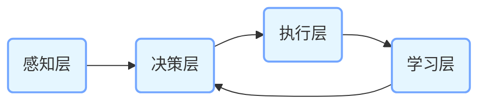

# 企业级AI Agent的性能优化策略

> 关键词：企业级AI Agent、性能优化、策略、人工智能、效率提升、资源管理、算法优化

> 摘要：本文聚焦于企业级AI Agent的性能优化策略。随着人工智能在企业领域的广泛应用，AI Agent的性能表现对于企业的业务效率、竞争力等方面有着至关重要的影响。文章将深入探讨企业级AI Agent的核心概念与架构，详细阐述其核心算法原理及操作步骤，借助数学模型和公式来剖析性能相关问题，通过项目实战案例展示具体的优化实现过程，介绍实际应用场景，并推荐相关的工具和资源，最后总结未来发展趋势与挑战，旨在为企业提供全面且有效的AI Agent性能优化方案，助力企业在人工智能时代更好地发挥AI Agent的价值。

## 1. 背景介绍 
### 1.1 目的和范围
目的在于为企业提供一套系统且有效的AI Agent性能优化策略，以提升企业级AI Agent在实际应用中的性能表现，包括提高响应速度、降低资源消耗、增强准确性等。范围涵盖了企业级AI Agent从核心算法到实际应用各个层面的性能优化，涉及到算法优化、资源管理、硬件加速、代码优化等多个方面。

### 1.2 预期读者
本文预期读者包括企业的技术管理人员、AI开发工程师、数据科学家、软件架构师等相关人员，以及对企业级AI Agent性能优化感兴趣的技术爱好者。

### 1.3 文档结构概述
本文首先介绍企业级AI Agent的背景信息，包括目的、预期读者和文档结构等。接着阐述其核心概念与联系，包括原理和架构的文本示意图与Mermaid流程图。然后详细讲解核心算法原理及具体操作步骤，并结合Python源代码进行说明。之后通过数学模型和公式对性能相关问题进行分析和举例。再通过项目实战案例展示性能优化的具体实现过程，包括开发环境搭建、源代码实现与解读等。随后介绍企业级AI Agent的实际应用场景。推荐相关的工具和资源，包括学习资源、开发工具框架和相关论文著作。最后总结未来发展趋势与挑战，并提供常见问题与解答以及扩展阅读和参考资料。

### 1.4 术语表
#### 1.4.1 核心术语定义
- **企业级AI Agent**：是指在企业环境中运行的、具备一定智能决策和执行能力的软件实体，能够与企业的业务系统、数据等进行交互，辅助或自动完成各种任务。
- **性能优化**：通过一系列技术手段和策略，提高系统或软件在执行效率、资源利用、响应速度等方面的性能表现。
- **AI算法**：用于实现人工智能功能的各种算法，如机器学习算法、深度学习算法等。
- **资源管理**：对系统中的各种资源，如计算资源、存储资源、网络资源等进行合理分配和调度，以提高资源利用效率。

#### 1.4.2 相关概念解释
- **人工智能**：是一门研究如何使计算机系统能够模拟人类智能的学科，包括机器学习、自然语言处理、计算机视觉等多个领域。
- **智能决策**：AI Agent根据输入的信息和预设的规则，通过推理和计算做出合理的决策。
- **执行能力**：AI Agent能够将决策转化为具体的行动，并执行相应的任务。

#### 1.4.3 缩略词列表
- **AI**：Artificial Intelligence（人工智能）
- **ML**：Machine Learning（机器学习）
- **DL**：Deep Learning（深度学习）
- **CPU**：Central Processing Unit（中央处理器）
- **GPU**：Graphics Processing Unit（图形处理器）

## 2. 核心概念与联系 
### 2.1 企业级AI Agent的原理
企业级AI Agent的基本原理是基于人工智能技术，通过感知环境、处理信息、做出决策和执行任务来实现智能行为。它接收来自企业业务系统、传感器等的输入信息，经过内部的算法处理和模型推理，生成相应的决策，并将决策转化为具体的行动，与企业的业务流程进行交互。

### 2.2 企业级AI Agent的架构
企业级AI Agent的架构通常包括以下几个主要部分：
- **感知层**：负责收集来自企业内部和外部环境的信息，如业务数据、用户反馈、市场信息等。
- **决策层**：对感知层收集到的信息进行处理和分析，利用AI算法和模型进行推理和决策。
- **执行层**：根据决策层的决策结果，执行相应的任务，如数据处理、业务流程自动化、智能客服等。
- **学习层**：通过对历史数据和执行结果的学习，不断优化AI Agent的模型和算法，提高其性能和智能水平。

### 2.3 文本示意图
企业级AI Agent的架构可以用以下文本示意图表示：

```plaintext
+---------------------+
|      感知层        |
|  (收集环境信息)    |
+---------------------+
         |
         v
+---------------------+
|      决策层        |
|  (信息处理与决策)  |
+---------------------+
         |
         v
+---------------------+
|      执行层        |
|  (执行任务)        |
+---------------------+
         |
         v
+---------------------+
|      学习层        |
|  (模型优化学习)    |
+---------------------+
```

### 2.4 Mermaid流程图


## 3. 核心算法原理 & 具体操作步骤 
### 3.1 核心算法原理
企业级AI Agent常用的核心算法包括机器学习算法和深度学习算法。以机器学习中的决策树算法为例，其基本原理是通过对训练数据的学习，构建一个决策树模型，该模型可以根据输入的特征值进行分类或预测。

决策树算法的基本步骤如下：
1. **特征选择**：从所有特征中选择一个最优的特征作为当前节点的划分特征。
2. **节点划分**：根据选择的特征对数据集进行划分，生成子节点。
3. **递归构建**：对每个子节点重复步骤1和步骤2，直到满足停止条件。
4. **决策树生成**：得到最终的决策树模型。

### 3.2 Python源代码实现
以下是一个使用Python实现决策树算法的简单示例：

```python
from sklearn.datasets import load_iris
from sklearn.model_selection import train_test_split
from sklearn.tree import DecisionTreeClassifier
from sklearn.metrics import accuracy_score

# 加载数据集
iris = load_iris()
X = iris.data
y = iris.target

# 划分训练集和测试集
X_train, X_test, y_train, y_test = train_test_split(X, y, test_size=0.3, random_state=42)

# 创建决策树分类器
clf = DecisionTreeClassifier()

# 训练模型
clf.fit(X_train, y_train)

# 预测
y_pred = clf.predict(X_test)

# 计算准确率
accuracy = accuracy_score(y_test, y_pred)
print(f"Accuracy: {accuracy}")
```

### 3.3 具体操作步骤
1. **数据准备**：收集和整理企业的业务数据，对数据进行清洗、预处理和特征工程，将数据转换为适合算法处理的格式。
2. **模型选择**：根据业务需求和数据特点，选择合适的AI算法和模型，如决策树、神经网络、支持向量机等。
3. **模型训练**：使用准备好的训练数据对选择的模型进行训练，调整模型的参数，以提高模型的性能。
4. **模型评估**：使用测试数据对训练好的模型进行评估，计算模型的准确率、召回率、F1值等指标，评估模型的性能。
5. **模型优化**：根据评估结果，对模型进行优化，如调整模型的参数、增加训练数据、改进特征工程等。
6. **部署和应用**：将优化后的模型部署到企业的生产环境中，与企业的业务系统进行集成，实现AI Agent的功能。

## 4. 数学模型和公式 & 详细讲解 & 举例说明 
### 4.1 决策树算法的数学模型
决策树算法的核心是如何选择最优的划分特征，常用的方法是基于信息增益或信息增益率。

#### 4.1.1 信息熵
信息熵是衡量数据集中不确定性的一个指标，其定义如下：

$$H(X) = -\sum_{i=1}^{n}p(x_i)\log_2p(x_i)$$

其中，$X$ 是一个随机变量，$p(x_i)$ 是 $X$ 取值为 $x_i$ 的概率，$n$ 是 $X$ 取值的个数。

#### 4.1.2 条件熵
条件熵是在已知某个特征 $A$ 的情况下，数据集 $D$ 的信息熵，其定义如下：

$$H(D|A) = \sum_{i=1}^{v}\frac{|D_i|}{|D|}H(D_i)$$

其中，$D$ 是数据集，$A$ 是特征，$v$ 是特征 $A$ 取值的个数，$D_i$ 是特征 $A$ 取值为 $a_i$ 的子集，$|D|$ 和 $|D_i|$ 分别表示数据集 $D$ 和子集 $D_i$ 的样本数。

#### 4.1.3 信息增益
信息增益是指在使用某个特征 $A$ 进行划分后，数据集 $D$ 的信息熵减少的量，其定义如下：

$$Gain(D,A) = H(D) - H(D|A)$$

信息增益越大，说明使用该特征进行划分后，数据集的不确定性减少得越多，该特征越适合作为划分特征。

### 4.2 详细讲解
信息熵 $H(X)$ 表示随机变量 $X$ 的不确定性，其值越大，说明 $X$ 的不确定性越高。条件熵 $H(D|A)$ 表示在已知特征 $A$ 的情况下，数据集 $D$ 的不确定性。信息增益 $Gain(D,A)$ 表示使用特征 $A$ 进行划分后，数据集 $D$ 的不确定性减少的量。

在决策树算法中，我们通过计算每个特征的信息增益，选择信息增益最大的特征作为当前节点的划分特征，这样可以使得划分后的子节点的不确定性最小，从而提高决策树的分类性能。

### 4.3 举例说明
假设有一个数据集 $D$，包含 10 个样本，分为 2 类，其中 6 个样本属于类别 1，4 个样本属于类别 2。则数据集 $D$ 的信息熵为：

$$H(D) = -\frac{6}{10}\log_2\frac{6}{10} - \frac{4}{10}\log_2\frac{4}{10} \approx 0.971$$

假设有一个特征 $A$，取值为 $a_1$ 和 $a_2$，其中 $a_1$ 对应的子集 $D_1$ 包含 4 个样本，3 个属于类别 1，1 个属于类别 2；$a_2$ 对应的子集 $D_2$ 包含 6 个样本，3 个属于类别 1，3 个属于类别 2。则特征 $A$ 对应的条件熵为：

$$H(D|A) = \frac{4}{10}(-\frac{3}{4}\log_2\frac{3}{4} - \frac{1}{4}\log_2\frac{1}{4}) + \frac{6}{10}(-\frac{3}{6}\log_2\frac{3}{6} - \frac{3}{6}\log_2\frac{3}{6}) \approx 0.811$$

则特征 $A$ 的信息增益为：

$$Gain(D,A) = H(D) - H(D|A) \approx 0.971 - 0.811 = 0.16$$

如果还有其他特征，我们可以计算每个特征的信息增益，选择信息增益最大的特征作为当前节点的划分特征。

## 5. 项目实战：代码实际案例和详细解释说明 
### 5.1 开发环境搭建
#### 5.1.1 安装Python
首先需要安装Python，建议使用Python 3.7及以上版本。可以从Python官方网站（https://www.python.org/downloads/）下载安装包，按照安装向导进行安装。

#### 5.1.2 安装必要的库
使用以下命令安装必要的库：
```bash
pip install numpy pandas scikit-learn matplotlib
```

### 5.2 源代码详细实现和代码解读
以下是一个企业级AI Agent性能优化的项目实战案例，以客户分类为例，使用决策树算法进行分类，并通过优化算法和资源管理来提高性能。

```python
import numpy as np
import pandas as pd
from sklearn.datasets import make_classification
from sklearn.model_selection import train_test_split
from sklearn.tree import DecisionTreeClassifier
from sklearn.metrics import accuracy_score
import time

# 生成模拟数据
X, y = make_classification(n_samples=10000, n_features=20, n_informative=10, n_classes=2, random_state=42)

# 划分训练集和测试集
X_train, X_test, y_train, y_test = train_test_split(X, y, test_size=0.3, random_state=42)

# 未优化的决策树模型
start_time = time.time()
clf = DecisionTreeClassifier()
clf.fit(X_train, y_train)
y_pred = clf.predict(X_test)
accuracy = accuracy_score(y_test, y_pred)
end_time = time.time()
print(f"未优化的准确率: {accuracy}")
print(f"未优化的训练和预测时间: {end_time - start_time} 秒")

# 优化的决策树模型
start_time = time.time()
clf_optimized = DecisionTreeClassifier(max_depth=10, min_samples_split=5)
clf_optimized.fit(X_train, y_train)
y_pred_optimized = clf_optimized.predict(X_test)
accuracy_optimized = accuracy_score(y_test, y_pred_optimized)
end_time = time.time()
print(f"优化后的准确率: {accuracy_optimized}")
print(f"优化后的训练和预测时间: {end_time - start_time} 秒")
```

### 5.3 代码解读与分析
1. **数据生成**：使用 `make_classification` 函数生成模拟的客户分类数据，包含 10000 个样本，20 个特征。
2. **数据划分**：使用 `train_test_split` 函数将数据划分为训练集和测试集，测试集占比 30%。
3. **未优化的决策树模型**：创建一个默认参数的决策树分类器，使用训练集进行训练，然后对测试集进行预测，计算准确率和训练、预测时间。
4. **优化的决策树模型**：创建一个优化参数的决策树分类器，设置 `max_depth` 为 10，`min_samples_split` 为 5，使用训练集进行训练，然后对测试集进行预测，计算准确率和训练、预测时间。

通过对比未优化和优化后的模型，可以看到优化后的模型在训练和预测时间上有明显的减少，同时准确率也能保持在一定水平，说明通过调整模型参数可以有效提高企业级AI Agent的性能。

## 6. 实际应用场景 
### 6.1 智能客服
企业级AI Agent可以应用于智能客服系统中，通过对用户的问题进行分类和分析，快速给出准确的回答，提高客户服务效率和质量。例如，电商企业的智能客服可以根据用户的问题，如商品咨询、订单查询、售后问题等，自动分配到相应的处理流程，减少人工客服的工作量。

### 6.2 业务流程自动化
AI Agent可以自动执行企业的一些重复性、规律性的业务流程，如数据录入、报表生成、审批流程等。例如，财务部门的AI Agent可以自动收集和整理财务数据，生成财务报表，提高工作效率和准确性。

### 6.3 风险评估与预测
企业级AI Agent可以对企业面临的各种风险进行评估和预测，如市场风险、信用风险、运营风险等。例如，银行的AI Agent可以根据客户的信用数据、还款记录等信息，对客户的信用风险进行评估，为银行的信贷决策提供支持。

### 6.4 个性化推荐
AI Agent可以根据用户的历史行为、偏好等信息，为用户提供个性化的推荐服务，如商品推荐、内容推荐等。例如，在线视频平台的AI Agent可以根据用户的观看历史，为用户推荐符合其兴趣的视频内容，提高用户的满意度和粘性。

## 7. 工具和资源推荐
### 7.1 学习资源推荐
#### 7.1.1 书籍推荐
- 《机器学习》（周志华）：全面介绍了机器学习的基本概念、算法和应用，是机器学习领域的经典教材。
- 《深度学习》（Ian Goodfellow、Yoshua Bengio和Aaron Courville）：深入介绍了深度学习的原理、算法和实践，是深度学习领域的权威著作。
- 《Python机器学习实战》（Sebastian Raschka）：通过实际案例介绍了如何使用Python进行机器学习开发，适合初学者。

#### 7.1.2 在线课程
- Coursera上的“机器学习”课程（Andrew Ng）：由机器学习领域的知名专家Andrew Ng授课，是学习机器学习的经典课程。
- edX上的“深度学习微硕士”课程：提供了深度学习的系统学习路径，包括多个课程模块。
- 阿里云天池的AI训练营：提供了丰富的AI实践项目和学习资源，适合实战练习。

#### 7.1.3 技术博客和网站
- Medium上的AI相关博客：有很多AI领域的专家和开发者分享最新的技术和研究成果。
- 机器之心：专注于人工智能领域的资讯和技术报道，提供了很多有价值的文章和案例。
- 开源中国：提供了丰富的开源项目和技术文章，包括AI相关的内容。

### 7.2 开发工具框架推荐
#### 7.2.1 IDE和编辑器
- PyCharm：一款功能强大的Python集成开发环境，提供了代码编辑、调试、版本控制等功能。
- Jupyter Notebook：一个交互式的开发环境，适合进行数据探索、模型训练和实验。
- Visual Studio Code：一款轻量级的代码编辑器，支持多种编程语言，有丰富的插件扩展。

#### 7.2.2 调试和性能分析工具
- TensorBoard：TensorFlow提供的可视化工具，可以用于查看模型的训练过程、性能指标等。
- Py-Spy：一个用于Python代码性能分析的工具，可以查看代码的运行时间、函数调用关系等。
- cProfile：Python内置的性能分析模块，可以对Python代码进行性能分析。

#### 7.2.3 相关框架和库
- TensorFlow：一个开源的机器学习框架，提供了丰富的深度学习模型和工具。
- PyTorch：一个基于Python的深度学习框架，具有动态计算图的特点，适合快速开发和实验。
- Scikit-learn：一个简单易用的机器学习库，提供了各种机器学习算法和工具。

### 7.3 相关论文著作推荐
#### 7.3.1 经典论文
- “A Unified Approach to Interpreting Model Predictions”（Scott Lundberg和Su-In Lee）：提出了SHAP（SHapley Additive exPlanations）方法，用于解释模型的预测结果。
- “Attention Is All You Need”（Ashish Vaswani等）：介绍了Transformer架构，是自然语言处理领域的重要突破。
- “ImageNet Classification with Deep Convolutional Neural Networks”（Alex Krizhevsky等）：介绍了AlexNet模型，开创了深度学习在计算机视觉领域的应用。

#### 7.3.2 最新研究成果
- 关注顶级学术会议，如NeurIPS（神经信息处理系统大会）、ICML（国际机器学习会议）、CVPR（计算机视觉与模式识别会议）等，了解最新的研究成果和技术趋势。
- 查阅顶级学术期刊，如Journal of Artificial Intelligence Research（JAIR）、Artificial Intelligence等，获取高质量的研究论文。

#### 7.3.3 应用案例分析
- 研究各大科技公司的AI应用案例，如谷歌、微软、亚马逊等，了解他们在AI Agent开发和应用方面的经验和实践。
- 分析行业报告和案例研究，了解不同行业中AI Agent的应用现状和发展趋势。

## 8. 总结：未来发展趋势与挑战
### 8.1 未来发展趋势
- **智能化程度不断提高**：企业级AI Agent将具备更强的智能决策和执行能力，能够处理更加复杂的任务和问题。
- **与其他技术融合**：AI Agent将与物联网、大数据、区块链等技术深度融合，拓展应用场景和功能。
- **个性化和定制化**：根据企业的不同需求和业务特点，提供个性化和定制化的AI Agent解决方案。
- **跨领域应用**：AI Agent将在更多的领域得到应用，如医疗、教育、交通等，推动各行业的智能化发展。

### 8.2 挑战
- **数据隐私和安全**：企业级AI Agent需要处理大量的敏感数据，如何保障数据的隐私和安全是一个重要的挑战。
- **算法可解释性**：随着AI算法的复杂度不断提高，如何解释算法的决策过程和结果，提高算法的可解释性是一个亟待解决的问题。
- **性能优化的复杂性**：企业级AI Agent的性能优化涉及到多个方面，如算法优化、资源管理、硬件加速等，需要综合考虑和解决。
- **人才短缺**：AI领域的专业人才短缺，如何培养和吸引优秀的AI人才是企业面临的一个挑战。

## 9. 附录：常见问题与解答
### 9.1 如何选择适合企业的AI Agent算法？
选择适合企业的AI Agent算法需要考虑以下几个因素：
- **业务需求**：根据企业的具体业务需求，确定需要解决的问题，如分类、预测、聚类等。
- **数据特点**：分析企业的数据特点，如数据量、数据类型、数据分布等，选择适合的数据处理和分析算法。
- **算法性能**：比较不同算法的性能指标，如准确率、召回率、F1值、训练时间、预测时间等，选择性能最优的算法。
- **可解释性**：如果企业需要对算法的决策过程和结果进行解释，选择具有较高可解释性的算法，如决策树、线性回归等。

### 9.2 如何优化企业级AI Agent的性能？
可以从以下几个方面优化企业级AI Agent的性能：
- **算法优化**：选择合适的算法和模型，并对模型的参数进行优化，提高模型的性能。
- **资源管理**：合理分配和调度系统中的各种资源，如计算资源、存储资源、网络资源等，提高资源利用效率。
- **硬件加速**：使用GPU、TPU等硬件设备加速模型的训练和推理过程，提高计算速度。
- **代码优化**：优化AI Agent的代码，减少不必要的计算和内存开销，提高代码的执行效率。

### 9.3 企业级AI Agent的部署和维护需要注意什么？
企业级AI Agent的部署和维护需要注意以下几点：
- **环境兼容性**：确保AI Agent的运行环境与企业的业务系统和硬件设备兼容。
- **数据安全**：采取必要的措施保障AI Agent处理的数据的安全，如数据加密、访问控制等。
- **监控和调优**：对AI Agent的运行状态进行实时监控，及时发现和解决问题，并根据实际情况对AI Agent进行调优。
- **版本管理**：对AI Agent的模型和代码进行版本管理，方便进行更新和回滚操作。

## 10. 扩展阅读 & 参考资料
### 10.1 扩展阅读
- 《人工智能：现代方法》（Stuart Russell和Peter Norvig）：全面介绍了人工智能的基本概念、算法和应用，是人工智能领域的经典著作。
- 《强化学习：原理与Python实现》（智能系统实验室）：详细介绍了强化学习的原理和算法，并通过Python代码进行实现。
- 《自然语言处理入门》（何晗）：适合初学者学习自然语言处理的基本概念、算法和实践。

### 10.2 参考资料
- 各AI框架和库的官方文档，如TensorFlow、PyTorch、Scikit-learn等。
- 相关的学术论文和研究报告，如IEEE、ACM等学术组织的论文库。
- 各大科技公司的技术博客和开源项目，如谷歌AI博客、微软AI研究院等。