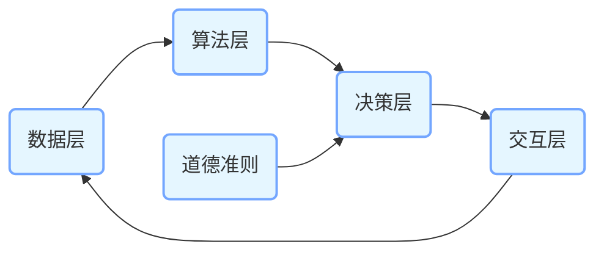

# 伦理AI：设计符合道德标准的AI Agent

> 关键词：伦理AI、道德标准、AI Agent、算法设计、实际应用

> 摘要：本文聚焦于伦理AI，旨在探讨如何设计符合道德标准的AI Agent。首先介绍了伦理AI的背景，包括目的、预期读者、文档结构和相关术语。接着阐述了核心概念及其联系，详细讲解了核心算法原理和具体操作步骤，并给出Python源代码示例。通过数学模型和公式进一步深入剖析，结合实际案例进行解释说明。还探讨了伦理AI在不同场景的实际应用，推荐了相关的学习资源、开发工具和论文著作。最后总结了未来发展趋势与挑战，提供常见问题解答和扩展阅读参考资料，为构建符合道德规范的AI Agent提供全面且深入的指导。

## 1. 背景介绍 
### 1.1 目的和范围
随着人工智能技术的飞速发展，AI Agent在各个领域的应用日益广泛。然而，AI Agent的决策和行为可能会对人类社会、环境和个人产生深远影响。因此，设计符合道德标准的AI Agent变得至关重要。本文的目的在于深入探讨伦理AI的概念和方法，为开发者提供设计符合道德标准AI Agent的理论基础和实践指导。范围涵盖伦理AI的核心概念、算法原理、数学模型、实际应用场景以及相关的工具和资源等方面。

### 1.2 预期读者
本文的预期读者包括人工智能领域的研究人员、开发者、软件架构师、CTO等专业人士，以及对伦理AI感兴趣的学生和爱好者。对于希望了解如何在AI开发中融入道德考量的人群，本文将提供有价值的参考。

### 1.3 文档结构概述
本文将按照以下结构展开：首先介绍伦理AI的核心概念与联系，包括相关原理和架构的示意图和流程图；接着详细讲解核心算法原理和具体操作步骤，并给出Python源代码示例；然后通过数学模型和公式进一步深入分析，结合实际案例进行说明；之后探讨伦理AI在不同场景的实际应用；推荐相关的学习资源、开发工具和论文著作；最后总结未来发展趋势与挑战，提供常见问题解答和扩展阅读参考资料。

### 1.4 术语表
#### 1.4.1 核心术语定义
- **伦理AI（Ethical AI）**：指在人工智能系统的设计、开发和应用过程中，充分考虑道德原则和价值观，确保AI系统的行为和决策符合道德标准。
- **AI Agent**：是一种能够感知环境、进行决策并采取行动的人工智能实体，可以是软件程序、机器人等。
- **道德标准（Moral Standards）**：是社会公认的行为准则和价值观念，用于判断行为的对错和善恶。

#### 1.4.2 相关概念解释
- **公平性（Fairness）**：在AI Agent的决策过程中，确保不同群体不会因为种族、性别、年龄等因素而受到不公平的对待。
- **透明度（Transparency）**：AI Agent的决策过程和算法应该是可解释的，让用户能够理解其决策的依据。
- **责任性（Accountability）**：当AI Agent的行为导致不良后果时，能够明确责任主体，并采取相应的措施进行纠正。

#### 1.4.3 缩略词列表
- **AI**：Artificial Intelligence（人工智能）
- **ML**：Machine Learning（机器学习）
- **DL**：Deep Learning（深度学习）

## 2. 核心概念与联系 

### 核心概念原理
伦理AI的核心原理是将道德原则融入到AI Agent的设计和开发过程中。这需要考虑多个方面，包括数据的公正性、算法的透明度、决策的可解释性等。数据的公正性意味着在收集和使用数据时，要避免存在偏见和歧视。算法的透明度要求算法的决策过程是可理解的，用户能够知道AI Agent是如何做出决策的。决策的可解释性则是指能够为AI Agent的决策提供合理的解释，以便用户进行评估和监督。

### 架构的文本示意图
一个符合道德标准的AI Agent架构通常包括以下几个部分：
- **数据层**：负责收集、存储和预处理数据，确保数据的公正性和质量。
- **算法层**：包含各种机器学习和深度学习算法，用于对数据进行分析和建模。在这一层，需要考虑算法的透明度和可解释性。
- **决策层**：根据算法层的输出，结合道德准则进行决策。决策层需要具备一定的推理和判断能力，能够在不同的道德情境下做出合理的决策。
- **交互层**：负责与用户进行交互，将决策结果反馈给用户，并接受用户的反馈和监督。

### Mermaid流程图


这个流程图展示了符合道德标准的AI Agent的基本架构。数据层为算法层提供数据，算法层进行数据分析和建模，决策层结合道德准则进行决策，交互层与用户进行交互并将用户反馈传递回数据层。道德准则作为一个独立的输入，对决策层的决策过程产生影响。

## 3. 核心算法原理 & 具体操作步骤 

### 核心算法原理
在设计符合道德标准的AI Agent时，常用的算法包括基于规则的算法、基于机器学习的算法和基于强化学习的算法。

#### 基于规则的算法
基于规则的算法是一种简单直观的方法，通过预先定义一系列的规则来指导AI Agent的决策。这些规则通常是根据道德准则和专家知识制定的。例如，在一个自动驾驶汽车的AI Agent中，可以定义规则：“当遇到行人时，必须停车让行”。

#### 基于机器学习的算法
基于机器学习的算法通过学习大量的数据来发现数据中的模式和规律，从而进行决策。在伦理AI中，需要对机器学习算法进行改进，以确保其决策符合道德标准。例如，可以使用公平性算法来减少模型在不同群体之间的偏见。

#### 基于强化学习的算法
基于强化学习的算法通过与环境进行交互，不断尝试不同的行动，并根据环境的反馈来调整自己的行为。在伦理AI中，可以将道德准则作为奖励函数的一部分，引导AI Agent做出符合道德标准的决策。

### 具体操作步骤
#### 步骤1：定义道德准则
首先需要明确AI Agent需要遵循的道德准则。这些准则可以是通用的道德原则，也可以是特定领域的道德规范。例如，在医疗领域，道德准则可能包括尊重患者的隐私、保护患者的生命安全等。

#### 步骤2：收集和预处理数据
收集与道德决策相关的数据，并对数据进行预处理，确保数据的公正性和质量。在预处理过程中，需要去除数据中的噪声和异常值，对数据进行归一化和编码等操作。

#### 步骤3：选择合适的算法
根据具体的应用场景和道德准则，选择合适的算法。如果道德准则比较明确，可以选择基于规则的算法；如果数据量较大且模式复杂，可以选择基于机器学习或强化学习的算法。

#### 步骤4：训练和优化模型
使用收集到的数据对选择的算法进行训练，并根据训练结果对模型进行优化。在训练过程中，需要注意模型的公平性、透明度和可解释性。

#### 步骤5：测试和评估模型
使用测试数据对训练好的模型进行测试和评估，检查模型的决策是否符合道德准则。可以使用各种评估指标，如准确率、召回率、公平性指标等。

#### 步骤6：部署和监控模型
将训练好的模型部署到实际应用中，并对模型的运行情况进行监控。在监控过程中，需要及时发现和处理模型的异常行为，确保模型始终符合道德标准。

### Python源代码示例
以下是一个简单的基于规则的AI Agent示例，用于判断一个贷款申请是否应该被批准：

```python
# 定义道德准则：年收入低于20000元的申请人不批准贷款
def moral_rule(income):
    if income < 20000:
        return False
    return True

# 定义AI Agent
def loan_approval_agent(income):
    if moral_rule(income):
        return "批准贷款"
    return "拒绝贷款"

# 测试AI Agent
income = 15000
result = loan_approval_agent(income)
print(f"年收入为 {income} 元的申请人，贷款申请结果：{result}")
```

在这个示例中，我们定义了一个道德准则：年收入低于20000元的申请人不批准贷款。AI Agent根据这个道德准则对贷款申请进行决策。

## 4. 数学模型和公式 & 详细讲解 & 举例说明 

### 公平性数学模型
公平性是伦理AI中的一个重要问题，常用的公平性数学模型包括统计平等（Statistical Parity）和机会平等（Equal Opportunity）。

#### 统计平等
统计平等要求不同群体的正例率（Positive Predictive Value）相等。假设我们有两个群体 $A$ 和 $B$，$Y$ 是真实标签，$\hat{Y}$ 是预测标签，则统计平等可以表示为：

$$P(\hat{Y}=1|A) = P(\hat{Y}=1|B)$$

#### 机会平等
机会平等要求不同群体在真实标签为正的情况下，预测为正的概率相等。即：

$$P(\hat{Y}=1|Y = 1, A) = P(\hat{Y}=1|Y = 1, B)$$

### 举例说明
假设我们有一个招聘模型，用于预测求职者是否适合某个职位。数据集中有男性和女性两个群体，真实标签 $Y$ 表示求职者是否适合该职位，预测标签 $\hat{Y}$ 表示模型的预测结果。

| 群体 | 适合人数 | 不适合人数 | 预测适合人数 | 预测不适合人数 |
| ---- | ---- | ---- | ---- | ---- |
| 男性 | 50 | 100 | 30 | 120 |
| 女性 | 30 | 80 | 10 | 100 |

#### 统计平等计算
男性预测适合的概率为：$P(\hat{Y}=1|男性)=\frac{30}{30 + 120}=0.2$

女性预测适合的概率为：$P(\hat{Y}=1|女性)=\frac{10}{10 + 100}\approx0.091$

由于 $0.2\neq0.091$，该模型不满足统计平等。

#### 机会平等计算
男性在适合的情况下预测适合的概率为：$P(\hat{Y}=1|Y = 1, 男性)=\frac{30}{50}=0.6$

女性在适合的情况下预测适合的概率为：$P(\hat{Y}=1|Y = 1, 女性)=\frac{10}{30}\approx0.333$

由于 $0.6\neq0.333$，该模型也不满足机会平等。

### 可解释性数学模型
可解释性是伦理AI的另一个重要方面，常用的可解释性数学模型包括局部可解释模型无关解释（Local Interpretable Model-agnostic Explanations，LIME）和特征重要性分析。

#### LIME
LIME通过在局部区域内训练一个可解释的模型来解释复杂模型的预测结果。假设我们有一个复杂模型 $f(x)$，对于一个特定的输入 $x_0$，LIME会在 $x_0$ 的邻域内生成一些扰动样本，然后训练一个简单的线性模型 $g(z)$ 来近似 $f(x)$ 在 $x_0$ 附近的行为。

#### 特征重要性分析
特征重要性分析用于确定每个特征对模型预测结果的影响程度。常用的方法包括基于随机森林的特征重要性分析和基于梯度的特征重要性分析。

### 举例说明
假设我们有一个基于决策树的疾病诊断模型，输入特征包括年龄、血压、血糖等。通过特征重要性分析，我们可以得到每个特征对诊断结果的重要性得分。例如，年龄的重要性得分是 0.3，血压的重要性得分是 0.5，血糖的重要性得分是 0.2。这表明血压对诊断结果的影响最大，年龄次之，血糖最小。

## 5. 项目实战：代码实际案例和详细解释说明 

### 5.1  开发环境搭建
#### 安装Python
首先需要安装Python，建议使用Python 3.7及以上版本。可以从Python官方网站（https://www.python.org/downloads/）下载安装包进行安装。

#### 安装必要的库
在本项目中，我们将使用以下库：
- `numpy`：用于数值计算
- `pandas`：用于数据处理
- `scikit-learn`：用于机器学习算法
- `matplotlib`：用于数据可视化

可以使用以下命令进行安装：
```sh
pip install numpy pandas scikit-learn matplotlib
```

### 5.2  源代码详细实现和代码解读
以下是一个基于机器学习的信用评分模型的示例，该模型考虑了公平性问题：

```python
import numpy as np
import pandas as pd
from sklearn.model_selection import train_test_split
from sklearn.linear_model import LogisticRegression
from sklearn.metrics import accuracy_score, f1_score
from aif360.datasets import GermanDataset
from aif360.metrics import BinaryLabelDatasetMetric
from aif360.algorithms.preprocessing import Reweighing

# 加载德国信用数据集
dataset_orig = GermanDataset()

# 划分训练集和测试集
train, test = dataset_orig.split([0.7], shuffle=True)

# 定义受保护的属性和特权群体
protected_attribute = 'sex'
privileged_groups = [{'sex': 1}]
unprivileged_groups = [{'sex': 0}]

# 计算训练集的公平性指标
metric_orig_train = BinaryLabelDatasetMetric(train,
                                             unprivileged_groups=unprivileged_groups,
                                             privileged_groups=privileged_groups)
print("原始训练集的统计平等差异: ", metric_orig_train.statistical_parity_difference())

# 使用重加权方法进行预处理
RW = Reweighing(unprivileged_groups=unprivileged_groups,
                privileged_groups=privileged_groups)
train_transf = RW.fit_transform(train)

# 计算处理后训练集的公平性指标
metric_transf_train = BinaryLabelDatasetMetric(train_transf,
                                               unprivileged_groups=unprivileged_groups,
                                               privileged_groups=privileged_groups)
print("处理后训练集的统计平等差异: ", metric_transf_train.statistical_parity_difference())

# 提取特征和标签
X_train = train_transf.features
y_train = train_transf.labels.ravel()
X_test = test.features
y_test = test.labels.ravel()

# 训练逻辑回归模型
model = LogisticRegression()
model.fit(X_train, y_train)

# 进行预测
y_pred = model.predict(X_test)

# 计算准确率和F1分数
accuracy = accuracy_score(y_test, y_pred)
f1 = f1_score(y_test, y_pred)
print(f"准确率: {accuracy}")
print(f"F1分数: {f1}")
```

### 5.3  代码解读与分析
#### 加载数据集
使用 `GermanDataset` 加载德国信用数据集，该数据集包含了关于个人信用状况的信息。

#### 划分训练集和测试集
使用 `split` 方法将数据集划分为训练集和测试集，比例为 7:3。

#### 定义受保护的属性和特权群体
在这个示例中，受保护的属性是 `sex`，特权群体是男性（`sex = 1`），非特权群体是女性（`sex = 0`）。

#### 计算公平性指标
使用 `BinaryLabelDatasetMetric` 计算原始训练集的统计平等差异，该指标用于衡量不同群体之间的公平性。

#### 重加权预处理
使用 `Reweighing` 方法对训练集进行预处理，该方法通过调整样本的权重来减少不同群体之间的不公平性。

#### 计算处理后训练集的公平性指标
再次使用 `BinaryLabelDatasetMetric` 计算处理后训练集的统计平等差异，可以看到该指标得到了改善。

#### 训练模型
使用逻辑回归模型对处理后的训练集进行训练。

#### 进行预测和评估
使用训练好的模型对测试集进行预测，并计算准确率和 F1 分数，评估模型的性能。

## 6. 实际应用场景 
### 医疗领域
在医疗领域，AI Agent可以用于疾病诊断、治疗方案推荐等。例如，一个基于伦理AI的疾病诊断系统可以确保在诊断过程中不会因为患者的种族、性别等因素而产生偏见。同时，该系统的决策过程应该是可解释的，医生能够理解系统是如何做出诊断的。

### 金融领域
在金融领域，AI Agent可以用于信用评分、贷款审批等。一个符合道德标准的信用评分模型可以避免对某些群体的歧视，确保公平的信贷机会。例如，在贷款审批过程中，模型不会因为申请人的性别、年龄等因素而做出不公正的决策。

### 交通领域
在交通领域，AI Agent可以用于自动驾驶汽车的决策和控制。自动驾驶汽车的AI Agent需要遵循道德准则，如保护行人的生命安全、避免碰撞等。例如，当遇到行人突然出现在道路上时，AI Agent应该能够及时做出停车让行的决策。

### 教育领域
在教育领域，AI Agent可以用于个性化学习、智能辅导等。一个符合道德标准的教育AI Agent可以确保为每个学生提供公平的学习机会，不会因为学生的家庭背景、学习成绩等因素而产生偏见。同时，该系统应该保护学生的隐私，不泄露学生的个人信息。

## 7. 工具和资源推荐
### 7.1 学习资源推荐
#### 7.1.1 书籍推荐
- 《Ethics of Artificial Intelligence and Robotics》：这本书全面探讨了人工智能和机器人领域的伦理问题，包括道德理论、算法设计、应用案例等方面。
- 《Artificial Intelligence: A Modern Approach》：这是一本经典的人工智能教材，涵盖了人工智能的各个方面，包括机器学习、自然语言处理、知识表示等。虽然没有专门讨论伦理问题，但为理解人工智能的技术基础提供了重要的参考。
- 《The Alignment Problem: Machine Learning and Human Values》：这本书聚焦于人工智能与人类价值观的对齐问题，深入分析了如何设计符合人类道德标准的AI系统。

#### 7.1.2 在线课程
- Coursera上的“AI Ethics”课程：由知名专家授课，系统地介绍了人工智能伦理的基本概念、理论和方法。
- edX上的“Responsible AI”课程：该课程强调在人工智能开发过程中如何考虑社会责任和道德问题，提供了实际案例和实践指导。
- Udemy上的“Ethical AI and Machine Learning”课程：通过具体的代码示例和项目实践，帮助学习者掌握如何在机器学习中融入伦理考量。

#### 7.1.3 技术博客和网站
- AI Ethics.org：这是一个专门关注人工智能伦理问题的网站，提供了最新的研究成果、新闻资讯和案例分析。
- Medium上的AI Ethics专栏：汇集了众多专家和从业者的文章，涵盖了人工智能伦理的各个方面。
- arXiv.org：可以搜索到关于人工智能伦理的最新研究论文，了解该领域的前沿动态。

### 7.2 开发工具框架推荐
#### 7.2.1 IDE和编辑器
- PyCharm：是一款专门为Python开发设计的集成开发环境，具有强大的代码编辑、调试和项目管理功能。
- Jupyter Notebook：是一个交互式的开发环境，适合进行数据分析、模型训练和可视化展示。
- Visual Studio Code：是一款轻量级的代码编辑器，支持多种编程语言，拥有丰富的插件扩展。

#### 7.2.2 调试和性能分析工具
- TensorBoard：是TensorFlow的可视化工具，可以用于监控模型的训练过程、查看模型的结构和性能指标。
- Py-Spy：是一个用于分析Python代码性能的工具，可以找出代码中的性能瓶颈。
- Pylint：是一个Python代码静态分析工具，可以检查代码中的语法错误、风格问题和潜在的逻辑错误。

#### 7.2.3 相关框架和库
- AIF360：是一个用于评估和改进人工智能公平性的开源工具包，提供了多种公平性指标和算法。
- LIME：是一个用于解释机器学习模型预测结果的开源库，支持多种模型类型。
- SHAP：是一个用于解释机器学习模型的开源库，通过计算特征的Shapley值来衡量特征的重要性。

### 7.3 相关论文著作推荐
#### 7.3.1 经典论文
- “On Fairness and Calibration”：该论文深入探讨了公平性和校准之间的关系，提出了一种新的公平性评估指标。
- “Explaining and Harnessing Adversarial Examples”：这篇论文介绍了对抗样本的概念和生成方法，对理解机器学习模型的脆弱性和安全性具有重要意义。
- “The Moral Machine Experiment”：通过大规模的在线实验，研究了人类在自动驾驶汽车面临道德困境时的决策偏好。

#### 7.3.2 最新研究成果
- 近年来，关于人工智能伦理的研究不断涌现。可以通过arXiv、ACM Digital Library、IEEE Xplore等学术数据库搜索最新的研究论文，了解该领域的前沿动态。

#### 7.3.3 应用案例分析
- 许多知名企业和研究机构都发布了关于伦理AI的应用案例分析报告，如Google的AI Principles、Microsoft的Responsible AI等。这些报告可以帮助我们了解伦理AI在实际应用中的挑战和解决方案。

## 8. 总结：未来发展趋势与挑战
### 未来发展趋势
#### 法规和标准的完善
随着人工智能技术的广泛应用，政府和国际组织将出台更多的法规和标准来规范AI Agent的开发和使用。这些法规和标准将对AI Agent的道德性、安全性和可靠性提出更高的要求。

#### 技术创新
研究人员将不断探索新的技术和方法来设计符合道德标准的AI Agent。例如，开发更加可解释的机器学习模型、引入新的公平性算法等。

#### 跨学科研究
伦理AI是一个跨学科的领域，需要计算机科学、哲学、伦理学、社会学等多个学科的共同参与。未来，跨学科研究将更加深入，为伦理AI的发展提供更坚实的理论基础。

### 挑战
#### 道德准则的多样性
不同的文化、宗教和社会群体可能有不同的道德准则，如何在设计AI Agent时考虑这些多样性是一个挑战。

#### 技术的复杂性
人工智能技术本身非常复杂，如何确保AI Agent的决策过程符合道德标准是一个技术难题。例如，如何在深度学习模型中实现可解释性和公平性。

#### 责任界定
当AI Agent的行为导致不良后果时，如何界定责任主体是一个法律和伦理问题。是开发者、使用者还是AI Agent本身应该承担责任？

## 9. 附录：常见问题与解答
### 问题1：如何确保AI Agent的决策符合道德标准？
答：可以通过以下几个方面来确保AI Agent的决策符合道德标准：首先，明确道德准则，并将其融入到AI Agent的设计和开发过程中。其次，使用公平性算法和可解释性技术来减少模型的偏见和提高决策的透明度。最后，对AI Agent的决策进行监控和评估，及时发现和纠正不符合道德标准的行为。

### 问题2：伦理AI与传统AI有什么区别？
答：传统AI主要关注模型的性能和效率，而伦理AI在关注性能和效率的同时，更加注重模型的道德性和社会影响。伦理AI需要考虑数据的公正性、算法的透明度、决策的可解释性等方面，以确保AI Agent的行为符合道德标准。

### 问题3：如何衡量AI Agent的公平性？
答：可以使用多种公平性指标来衡量AI Agent的公平性，如统计平等、机会平等、平均绝对误差等。这些指标可以从不同的角度评估模型在不同群体之间的公平性。

### 问题4：AI Agent的可解释性有什么重要性？
答：AI Agent的可解释性具有重要意义。首先，可解释性可以让用户理解AI Agent的决策过程，增加用户对模型的信任。其次，可解释性有助于发现模型中的问题和偏见，及时进行调整和改进。最后，在一些关键领域，如医疗和金融，可解释性是法律和伦理的要求。

## 10. 扩展阅读 & 参考资料
### 扩展阅读
- 《The Age of AI: And Our Human Future》：这本书探讨了人工智能对人类社会的影响，以及我们应该如何应对人工智能带来的挑战。
- 《Weapons of Math Destruction: How Big Data Increases Inequality and Threatens Democracy》：揭示了大数据和算法在社会中可能带来的不公平和危害。
- 《AI Superpowers: China, Silicon Valley, and the New World Order》：分析了中国和美国在人工智能领域的竞争和合作，以及人工智能对全球秩序的影响。

### 参考资料
- [AI Fairness 360 Documentation](https://aif360.readthedocs.io/en/latest/)
- [LIME Documentation](https://lime-ml.readthedocs.io/en/latest/)
- [SHAP Documentation](https://shap.readthedocs.io/en/latest/)
- [Google AI Principles](https://ai.google/principles/)
- [Microsoft Responsible AI](https://www.microsoft.com/en-us/ai/responsible-ai)