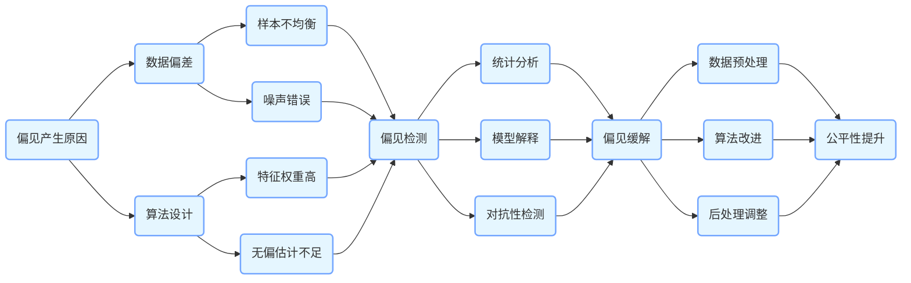

# 偏见检测与缓解：确保AI Agent的公平性

> 关键词：偏见检测、AI Agent、公平性、偏见缓解、机器学习

> 摘要：本文围绕AI Agent中的偏见检测与缓解展开，深入探讨了确保其公平性的重要性。首先介绍了偏见在AI系统中产生的背景，包括目的和范围、预期读者、文档结构等内容。接着阐述了偏见检测与缓解的核心概念及联系，详细讲解了核心算法原理与具体操作步骤，并结合数学模型和公式进行说明。通过项目实战展示了代码实际案例及详细解释，分析了其在实际应用场景中的表现。同时推荐了相关的学习资源、开发工具框架以及论文著作。最后总结了未来发展趋势与挑战，并提供常见问题与解答及扩展阅读和参考资料，旨在为研究者和开发者提供全面的技术指导，促进AI Agent公平性的提升。

## 1. 背景介绍 
### 1.1 目的和范围
随着人工智能技术的飞速发展，AI Agent在各个领域得到了广泛应用，如金融、医疗、招聘等。然而，AI Agent中存在的偏见问题逐渐引起了人们的关注。偏见可能导致不公平的决策，对某些群体造成歧视，影响社会的公平与和谐。本文章的目的在于深入探讨AI Agent中偏见的检测与缓解方法，以确保其公平性。范围涵盖了偏见的产生原因、检测技术、缓解策略以及相关的数学模型和实际应用案例。

### 1.2 预期读者
本文预期读者包括人工智能领域的研究者、开发者、数据科学家、政策制定者以及对AI公平性问题感兴趣的人士。对于研究者，本文提供了最新的研究成果和技术思路；对于开发者，详细的算法原理和代码实现可用于实际项目开发；对于政策制定者，有助于了解AI偏见问题的严重性和相关解决方案，从而制定合理的政策；对于普通读者，能增加对AI公平性的认识和理解。

### 1.3 文档结构概述
本文共分为十个部分。第一部分为背景介绍，阐述文章的目的、范围、预期读者和文档结构；第二部分介绍偏见检测与缓解的核心概念及联系；第三部分讲解核心算法原理和具体操作步骤，并给出Python源代码；第四部分介绍相关的数学模型和公式，并举例说明；第五部分通过项目实战展示代码实际案例和详细解释；第六部分分析实际应用场景；第七部分推荐相关的工具和资源；第八部分总结未来发展趋势与挑战；第九部分为附录，提供常见问题与解答；第十部分为扩展阅读和参考资料。

### 1.4 术语表
#### 1.4.1 核心术语定义
- **AI Agent**：人工智能代理，是一种能够感知环境、进行决策并采取行动的智能实体。
- **偏见**：在AI系统中，偏见指的是模型在处理数据时对某些群体或特征存在不公正的倾向，导致不公平的结果。
- **公平性**：AI系统的公平性意味着模型在处理不同群体的数据时，能够做出公正、无歧视的决策。
- **偏见检测**：通过各种技术和方法，识别AI系统中存在的偏见。
- **偏见缓解**：采取措施减少或消除AI系统中的偏见，提高其公平性。

#### 1.4.2 相关概念解释
- **数据偏见**：数据集中存在的偏差，可能导致模型学习到不准确或不公平的模式。例如，数据集中某些群体的样本数量过少，可能导致模型对这些群体的预测不准确。
- **算法偏见**：算法本身的设计或实现可能导致偏见的产生。例如，某些算法在处理数据时可能对某些特征赋予过高的权重，从而导致不公平的决策。
- **社会偏见**：社会中存在的偏见可能会反映在数据和算法中。例如，在招聘数据中，可能存在对某些性别或种族的偏见，从而影响AI招聘模型的公平性。

#### 1.4.3 缩略词列表
- **ML**：Machine Learning，机器学习
- **AI**：Artificial Intelligence，人工智能
- **DEI**：Diversity, Equity, and Inclusion，多样性、公平性和包容性

## 2. 核心概念与联系 
### 2.1 偏见的产生原因
偏见在AI Agent中产生的原因是多方面的。首先，数据是AI模型训练的基础，如果数据集中存在偏差，模型就可能学习到不准确或不公平的模式。例如，在人脸识别系统中，如果训练数据集中主要是白人的面部图像，那么该系统在识别其他种族的面部时可能会出现较高的错误率。

其次，算法的设计和实现也可能导致偏见的产生。某些算法在处理数据时可能对某些特征赋予过高的权重，从而导致不公平的决策。例如，在信用评分模型中，如果算法过度依赖收入等因素，可能会对低收入群体产生歧视。

此外，社会偏见也会影响AI系统的公平性。社会中存在的对某些群体的偏见可能会反映在数据和算法中。例如，在招聘数据中，可能存在对某些性别或种族的偏见，从而影响AI招聘模型的公平性。

### 2.2 偏见检测的方法
偏见检测是识别AI系统中存在的偏见的过程。常见的偏见检测方法包括：
- **统计分析**：通过对数据集和模型输出进行统计分析，检测是否存在对某些群体的不公平现象。例如，计算不同群体的错误率、召回率等指标，比较它们之间的差异。
- **模型解释**：通过解释模型的决策过程，分析模型是否对某些特征或群体存在偏见。例如，使用特征重要性分析、局部解释等方法，了解模型在决策时对不同特征的依赖程度。
- **对抗性检测**：使用对抗性样本或攻击方法，检测模型是否对某些群体存在脆弱性。例如，通过生成对抗性样本，观察模型对不同群体的预测结果是否发生变化。

### 2.3 偏见缓解的策略
偏见缓解是采取措施减少或消除AI系统中偏见的过程。常见的偏见缓解策略包括：
- **数据预处理**：对数据集进行预处理，减少数据中的偏差。例如，进行数据平衡处理，增加少数群体的样本数量；进行数据清洗，去除数据中的噪声和错误信息。
- **算法改进**：改进算法的设计和实现，减少算法偏见。例如，使用公平性约束的优化算法，在训练模型时考虑公平性因素；使用无偏估计方法，减少模型对某些特征的依赖。
- **后处理调整**：对模型的输出进行后处理调整，提高公平性。例如，使用阈值调整方法，根据不同群体的情况调整模型的预测阈值；使用校准方法，对模型的预测结果进行校准，使其更加准确和公平。

### 2.4 核心概念的联系
偏见的产生原因、检测方法和缓解策略之间存在着密切的联系。偏见的产生原因是偏见检测和缓解的基础，只有了解了偏见产生的原因，才能选择合适的检测方法和缓解策略。偏见检测是偏见缓解的前提，只有准确地检测出偏见，才能采取有效的缓解措施。偏见缓解是最终的目标，通过采取各种缓解策略，减少或消除AI系统中的偏见，提高其公平性。

### 2.5 文本示意图
```plaintext
              偏见产生原因
             /             \
       数据偏差          算法设计
      /      \           /      \
样本不均衡  噪声错误  特征权重高  无偏估计不足
           |               |
         偏见检测        偏见检测
        /    |    \      /    |    \
统计分析 模型解释 对抗性检测 统计分析 模型解释 对抗性检测
           |               |
         偏见缓解        偏见缓解
        /    |    \      /    |    \
数据预处理 算法改进 后处理调整 数据预处理 算法改进 后处理调整
           |               |
         公平性提升      公平性提升
```

### 2.6 Mermaid流程图


## 3. 核心算法原理 & 具体操作步骤 
### 3.1 统计分析算法原理
统计分析是一种常用的偏见检测方法，其核心思想是通过对数据集和模型输出进行统计分析，检测是否存在对某些群体的不公平现象。常见的统计指标包括错误率、召回率、精确率等。

以下是一个简单的Python代码示例，用于计算不同群体的错误率：

```python
import numpy as np

# 假设这是真实标签
y_true = np.array([1, 0, 1, 0, 1, 0])
# 假设这是模型预测的标签
y_pred = np.array([1, 1, 1, 0, 0, 0])
# 假设这是群体标签，0表示群体A，1表示群体B
group_labels = np.array([0, 0, 1, 1, 0, 1])

# 计算不同群体的错误率
group_A_indices = group_labels == 0
group_B_indices = group_labels == 1

error_rate_A = np.mean(y_true[group_A_indices] != y_pred[group_A_indices])
error_rate_B = np.mean(y_true[group_B_indices] != y_pred[group_B_indices])

print(f"Group A error rate: {error_rate_A}")
print(f"Group B error rate: {error_rate_B}")
```

### 3.2 模型解释算法原理
模型解释是通过解释模型的决策过程，分析模型是否对某些特征或群体存在偏见。常见的模型解释方法包括特征重要性分析、局部解释等。

以下是一个使用`shap`库进行特征重要性分析的Python代码示例：

```python
import shap
import xgboost as xgb
import numpy as np

# 生成一些示例数据
X = np.random.randn(100, 5)
y = np.random.randint(0, 2, 100)

# 训练一个XGBoost模型
model = xgb.XGBClassifier()
model.fit(X, y)

# 计算SHAP值
explainer = shap.Explainer(model)
shap_values = explainer(X)

# 绘制特征重要性图
shap.summary_plot(shap_values, X)
```

### 3.3 对抗性检测算法原理
对抗性检测是使用对抗性样本或攻击方法，检测模型是否对某些群体存在脆弱性。常见的对抗性攻击方法包括FGSM（Fast Gradient Sign Method）等。

以下是一个使用`torchattacks`库进行FGSM攻击的Python代码示例：

```python
import torch
import torch.nn as nn
import torch.optim as optim
import torchattacks

# 定义一个简单的神经网络模型
class SimpleNet(nn.Module):
    def __init__(self):
        super(SimpleNet, self).__init__()
        self.fc1 = nn.Linear(10, 20)
        self.fc2 = nn.Linear(20, 2)

    def forward(self, x):
        x = torch.relu(self.fc1(x))
        x = self.fc2(x)
        return x

# 初始化模型
model = SimpleNet()
criterion = nn.CrossEntropyLoss()
optimizer = optim.Adam(model.parameters(), lr=0.001)

# 生成一些示例数据
X = torch.randn(100, 10)
y = torch.randint(0, 2, (100,))

# 定义FGSM攻击
atk = torchattacks.FGSM(model, eps=0.01)

# 进行攻击
adv_images = atk(X, y)

# 计算攻击后的损失
outputs = model(adv_images)
loss = criterion(outputs, y)

print(f"Loss after attack: {loss.item()}")
```

### 3.4 具体操作步骤
1. **数据准备**：收集和整理相关的数据，包括特征数据、标签数据和群体标签数据。
2. **模型训练**：使用合适的机器学习或深度学习算法训练模型。
3. **偏见检测**：选择合适的偏见检测方法，如统计分析、模型解释、对抗性检测等，对模型进行检测。
4. **偏见缓解**：根据检测结果，选择合适的偏见缓解策略，如数据预处理、算法改进、后处理调整等，对模型进行缓解。
5. **评估和验证**：使用评估指标对缓解后的模型进行评估和验证，确保其公平性得到提升。

## 4. 数学模型和公式 & 详细讲解 & 举例说明 
### 4.1 错误率公式
错误率（Error Rate）是指模型预测错误的样本数占总样本数的比例。其数学公式为：

$$
\text{Error Rate} = \frac{\text{Number of misclassified samples}}{\text{Total number of samples}}
$$

例如，在一个二分类问题中，总共有100个样本，模型预测错误的样本数为10个，则错误率为：

$$
\text{Error Rate} = \frac{10}{100} = 0.1
$$

### 4.2 召回率公式
召回率（Recall）是指模型正确预测为正类的样本数占实际正类样本数的比例。其数学公式为：

$$
\text{Recall} = \frac{\text{True Positives}}{\text{True Positives} + \text{False Negatives}}
$$

例如，在一个二分类问题中，实际正类样本数为50个，模型正确预测为正类的样本数为40个，错误预测为负类的样本数为10个，则召回率为：

$$
\text{Recall} = \frac{40}{40 + 10} = 0.8
$$

### 4.3 精确率公式
精确率（Precision）是指模型正确预测为正类的样本数占预测为正类的样本数的比例。其数学公式为：

$$
\text{Precision} = \frac{\text{True Positives}}{\text{True Positives} + \text{False Positives}}
$$

例如，在一个二分类问题中，预测为正类的样本数为60个，其中正确预测为正类的样本数为40个，错误预测为正类的样本数为20个，则精确率为：

$$
\text{Precision} = \frac{40}{40 + 20} = \frac{2}{3} \approx 0.67
$$

### 4.4 公平性指标公式
常见的公平性指标包括平等机会（Equal Opportunity）、均等赔率（Equal Odds）等。

平等机会是指不同群体的召回率相等。其数学公式为：

$$
\text{Equal Opportunity} = \text{Recall}_{A} - \text{Recall}_{B} = 0
$$

其中，$\text{Recall}_{A}$ 和 $\text{Recall}_{B}$ 分别表示群体A和群体B的召回率。

均等赔率是指不同群体在正类和负类上的召回率都相等。其数学公式为：

$$
\begin{cases}
\text{Recall}_{A}^{+} - \text{Recall}_{B}^{+} = 0 \\
\text{Recall}_{A}^{-} - \text{Recall}_{B}^{-} = 0
\end{cases}
$$

其中，$\text{Recall}_{A}^{+}$ 和 $\text{Recall}_{B}^{+}$ 分别表示群体A和群体B在正类上的召回率，$\text{Recall}_{A}^{-}$ 和 $\text{Recall}_{B}^{-}$ 分别表示群体A和群体B在负类上的召回率。

### 4.5 举例说明
假设我们有一个招聘模型，用于预测求职者是否能被录用。数据集中包含求职者的性别（男性和女性）和是否被录用的标签。我们可以计算男性和女性的召回率，来检测模型是否存在性别偏见。

以下是一个简单的Python代码示例：

```python
import numpy as np

# 真实标签
y_true = np.array([1, 0, 1, 0, 1, 0])
# 模型预测的标签
y_pred = np.array([1, 1, 1, 0, 0, 0])
# 性别标签，0表示男性，1表示女性
gender_labels = np.array([0, 0, 1, 1, 0, 1])

# 计算男性和女性的召回率
male_indices = gender_labels == 0
female_indices = gender_labels == 1

true_positives_male = np.sum(y_true[male_indices] == 1 and y_pred[male_indices] == 1)
false_negatives_male = np.sum(y_true[male_indices] == 1 and y_pred[male_indices] == 0)
recall_male = true_positives_male / (true_positives_male + false_negatives_male)

true_positives_female = np.sum(y_true[female_indices] == 1 and y_pred[female_indices] == 1)
false_negatives_female = np.sum(y_true[female_indices] == 1 and y_pred[female_indices] == 0)
recall_female = true_positives_female / (true_positives_female + false_negatives_female)

print(f"Male recall: {recall_male}")
print(f"Female recall: {recall_female}")

# 计算平等机会
equal_opportunity = recall_male - recall_female
print(f"Equal opportunity: {equal_opportunity}")
```

## 5. 项目实战：代码实际案例和详细解释说明 
### 5.1  开发环境搭建
在进行项目实战之前，需要搭建相应的开发环境。以下是具体的步骤：

1. **安装Python**：建议使用Python 3.7及以上版本。可以从Python官方网站（https://www.python.org/downloads/）下载并安装。
2. **安装必要的库**：使用`pip`或`conda`安装必要的库，如`numpy`、`pandas`、`scikit-learn`、`torch`、`torchattacks`、`shap`、`xgboost`等。示例命令如下：
```bash
pip install numpy pandas scikit-learn torch torchattacks shap xgboost
```

### 5.2  源代码详细实现和代码解读
以下是一个完整的项目实战代码示例，包括数据加载、模型训练、偏见检测和缓解：

```python
import numpy as np
import pandas as pd
from sklearn.model_selection import train_test_split
from sklearn.linear_model import LogisticRegression
from sklearn.metrics import accuracy_score, recall_score

# 数据加载
data = pd.read_csv('data.csv')
X = data.drop('label', axis=1)
y = data['label']
group_labels = data['group']

# 数据划分
X_train, X_test, y_train, y_test, group_train, group_test = train_test_split(X, y, group_labels, test_size=0.2, random_state=42)

# 模型训练
model = LogisticRegression()
model.fit(X_train, y_train)

# 模型预测
y_pred = model.predict(X_test)

# 偏见检测：计算不同群体的召回率
group_A_indices = group_test == 0
group_B_indices = group_test == 1

recall_A = recall_score(y_test[group_A_indices], y_pred[group_A_indices])
recall_B = recall_score(y_test[group_B_indices], y_pred[group_B_indices])

print(f"Group A recall: {recall_A}")
print(f"Group B recall: {recall_B}")

# 偏见缓解：数据重采样
from imblearn.over_sampling import SMOTE

smote = SMOTE()
X_train_resampled, y_train_resampled = smote.fit_resample(X_train, y_train)

# 重新训练模型
model_resampled = LogisticRegression()
model_resampled.fit(X_train_resampled, y_train_resampled)

# 重新预测
y_pred_resampled = model_resampled.predict(X_test)

# 重新计算不同群体的召回率
recall_A_resampled = recall_score(y_test[group_A_indices], y_pred_resampled[group_A_indices])
recall_B_resampled = recall_score(y_test[group_B_indices], y_pred_resampled[group_B_indices])

print(f"Group A recall after resampling: {recall_A_resampled}")
print(f"Group B recall after resampling: {recall_B_resampled}")
```

### 5.3  代码解读与分析
1. **数据加载**：使用`pandas`库加载数据集，并将特征数据、标签数据和群体标签数据分别存储在`X`、`y`和`group_labels`中。
2. **数据划分**：使用`train_test_split`函数将数据集划分为训练集和测试集。
3. **模型训练**：使用`LogisticRegression`模型进行训练。
4. **模型预测**：使用训练好的模型对测试集进行预测。
5. **偏见检测**：计算不同群体的召回率，以检测模型是否存在偏见。
6. **偏见缓解**：使用`SMOTE`算法对训练集进行重采样，以减少数据不平衡问题。
7. **重新训练和预测**：使用重采样后的训练集重新训练模型，并对测试集进行预测。
8. **重新计算召回率**：计算重采样后不同群体的召回率，以评估偏见缓解的效果。

## 6. 实际应用场景 
### 6.1 金融领域
在金融领域，AI Agent被广泛应用于信用评分、贷款审批等决策过程中。然而，如果模型存在偏见，可能会导致对某些群体的不公平对待，如对低收入群体、少数族裔群体的歧视。通过偏见检测与缓解，可以确保金融决策的公平性，提高金融服务的可及性和包容性。

例如，在信用评分模型中，通过检测模型是否对某些群体存在过高或过低的评分倾向，采取相应的缓解措施，如调整特征权重、进行数据重采样等，可以减少偏见的影响，使信用评分更加公平和准确。

### 6.2 医疗领域
在医疗领域，AI Agent可用于疾病诊断、治疗方案推荐等。如果模型存在偏见，可能会导致对某些患者群体的误诊或漏诊，影响患者的健康和生命安全。通过偏见检测与缓解，可以提高医疗决策的准确性和公平性。

例如，在疾病诊断模型中，通过检测模型是否对不同性别、种族的患者存在差异，采取相应的缓解措施，如增加多样化的训练数据、优化算法结构等，可以减少偏见的影响，使疾病诊断更加准确和公平。

### 6.3 招聘领域
在招聘领域，AI Agent可用于筛选简历、面试评估等。如果模型存在偏见，可能会导致对某些求职者群体的不公平筛选，影响人才的选拔和企业的发展。通过偏见检测与缓解，可以确保招聘过程的公平性和公正性。

例如，在简历筛选模型中，通过检测模型是否对某些性别、年龄、学历的求职者存在偏见，采取相应的缓解措施，如去除敏感特征、进行公平性约束的训练等，可以减少偏见的影响，使简历筛选更加公平和客观。

### 6.4 教育领域
在教育领域，AI Agent可用于学生成绩预测、个性化学习推荐等。如果模型存在偏见，可能会导致对某些学生群体的不公平评价和资源分配，影响学生的学习和发展。通过偏见检测与缓解，可以提高教育决策的公平性和有效性。

例如，在学生成绩预测模型中，通过检测模型是否对不同地区、家庭背景的学生存在偏见，采取相应的缓解措施，如增加相关特征、进行数据增强等，可以减少偏见的影响，使学生成绩预测更加准确和公平。

## 7. 工具和资源推荐
### 7.1 学习资源推荐
#### 7.1.1 书籍推荐
- 《人工智能：现代方法》（Artificial Intelligence: A Modern Approach）：这本书是人工智能领域的经典教材，涵盖了人工智能的各个方面，包括机器学习、自然语言处理、计算机视觉等。
- 《Python机器学习》（Python Machine Learning）：这本书详细介绍了使用Python进行机器学习的方法和技巧，包括数据预处理、模型选择、模型评估等。
- 《公平性、问责制和透明度的AI》（AI for Fairness, Accountability, and Transparency）：这本书专注于AI公平性、问责制和透明度的问题，介绍了相关的理论和方法。

#### 7.1.2 在线课程
- Coursera上的“机器学习”课程：由斯坦福大学的Andrew Ng教授授课，是机器学习领域的经典课程。
- edX上的“人工智能基础”课程：介绍了人工智能的基本概念、算法和应用。
- Udemy上的“AI公平性与偏见检测”课程：专门讲解AI公平性和偏见检测的相关知识和技术。

#### 7.1.3 技术博客和网站
- Medium上的AI相关博客：有很多关于AI公平性、偏见检测与缓解的文章和讨论。
- arXiv.org：一个预印本平台，提供了大量关于AI公平性的最新研究成果。
- AI Now Institute：一个专注于AI社会影响的研究机构，其网站上有很多关于AI公平性的报告和资源。

### 7.2 开发工具框架推荐
#### 7.2.1 IDE和编辑器
- PyCharm：一款功能强大的Python集成开发环境，提供了代码编辑、调试、版本控制等功能。
- Jupyter Notebook：一个交互式的开发环境，适合进行数据探索、模型训练和可视化。
- Visual Studio Code：一款轻量级的代码编辑器，支持多种编程语言和插件扩展。

#### 7.2.2 调试和性能分析工具
- TensorBoard：一个用于可视化和分析深度学习模型训练过程的工具。
- Py-Spy：一个用于分析Python程序性能的工具，可以帮助找出性能瓶颈。
- Scikit-learn的`GridSearchCV`和`RandomizedSearchCV`：用于模型调优和参数搜索的工具。

#### 7.2.3 相关框架和库
- Scikit-learn：一个用于机器学习的Python库，提供了丰富的算法和工具。
- PyTorch：一个深度学习框架，具有高效的计算能力和灵活的编程接口。
- TensorFlow：一个广泛使用的深度学习框架，提供了丰富的工具和资源。
- AIF360：一个用于AI公平性的开源工具包，提供了多种偏见检测和缓解的算法和方法。

### 7.3 相关论文著作推荐
#### 7.3.1 经典论文
- “On the Measure of Fairness in Machine Learning”：这篇论文介绍了机器学习中公平性的度量方法和相关理论。
- “Algorithmic Bias Detection and Mitigation: Best Practices and Policies to Reduce Consumer Harms”：这篇论文探讨了算法偏见的检测和缓解方法，以及相关的政策建议。
- “Fairness in Machine Learning: A Tutorial”：这篇论文是关于机器学习公平性的教程，介绍了公平性的概念、检测方法和缓解策略。

#### 7.3.2 最新研究成果
- 关注顶级学术会议如NeurIPS、ICML、CVPR等，这些会议上有很多关于AI公平性的最新研究成果。
- 关注知名学术期刊如Journal of Artificial Intelligence Research（JAIR）、Artificial Intelligence等，这些期刊上也有很多高质量的AI公平性研究论文。

#### 7.3.3 应用案例分析
- 一些知名企业和研究机构会发布关于AI公平性的应用案例分析报告，如Google、Microsoft、IBM等。这些报告可以帮助我们了解实际应用中AI公平性的问题和解决方案。

## 8. 总结：未来发展趋势与挑战
### 8.1 未来发展趋势
- **多学科融合**：AI公平性问题涉及到计算机科学、统计学、社会学、伦理学等多个学科。未来，多学科融合的研究将成为解决AI公平性问题的重要趋势。例如，结合社会学的理论和方法，深入研究社会偏见在AI系统中的传播机制；结合伦理学的原则，制定AI公平性的道德准则。
- **自动化和智能化**：随着技术的发展，偏见检测和缓解的过程将越来越自动化和智能化。例如，开发自动化的偏见检测工具，能够快速准确地检测出AI系统中的偏见；利用强化学习等技术，实现偏见缓解策略的自动优化。
- **标准化和规范化**：为了确保AI系统的公平性，未来将制定更多的标准和规范。例如，制定AI公平性的评估标准，明确公平性的度量方法和指标；制定AI开发和使用的规范，要求开发者在开发过程中考虑公平性问题。

### 8.2 挑战
- **数据质量和多样性**：数据是AI模型训练的基础，如果数据质量不高或缺乏多样性，可能会导致模型存在偏见。然而，获取高质量、多样化的数据是一项具有挑战性的任务，需要解决数据隐私、数据安全等问题。
- **算法复杂度和可解释性**：随着AI算法的不断发展，算法的复杂度越来越高，导致模型的可解释性变差。这给偏见检测和缓解带来了困难，因为难以理解模型的决策过程和偏见产生的原因。
- **社会认知和接受度**：AI公平性问题不仅仅是技术问题，还涉及到社会认知和接受度。一些人可能对AI系统存在偏见的问题认识不足，或者对偏见缓解的措施存在抵触情绪。因此，需要加强对AI公平性问题的宣传和教育，提高社会的认知和接受度。

## 9. 附录：常见问题与解答
### 9.1 什么是AI Agent中的偏见？
AI Agent中的偏见指的是模型在处理数据时对某些群体或特征存在不公正的倾向，导致不公平的结果。偏见可能来源于数据、算法或社会因素。

### 9.2 为什么要检测和缓解AI Agent中的偏见？
检测和缓解AI Agent中的偏见是为了确保其公平性，避免对某些群体造成歧视，影响社会的公平与和谐。公平的AI系统可以提高决策的公正性和可信度，促进社会的发展和进步。

### 9.3 常见的偏见检测方法有哪些？
常见的偏见检测方法包括统计分析、模型解释、对抗性检测等。统计分析通过对数据集和模型输出进行统计分析，检测是否存在对某些群体的不公平现象；模型解释通过解释模型的决策过程，分析模型是否对某些特征或群体存在偏见；对抗性检测使用对抗性样本或攻击方法，检测模型是否对某些群体存在脆弱性。

### 9.4 常见的偏见缓解策略有哪些？
常见的偏见缓解策略包括数据预处理、算法改进、后处理调整等。数据预处理对数据集进行预处理，减少数据中的偏差；算法改进改进算法的设计和实现，减少算法偏见；后处理调整对模型的输出进行后处理调整，提高公平性。

### 9.5 如何评估偏见缓解的效果？
可以使用公平性指标如平等机会、均等赔率等评估偏见缓解的效果。这些指标可以衡量不同群体在模型预测中的公平程度。此外，还可以使用传统的评估指标如准确率、召回率等，比较缓解前后模型的性能变化。

## 10. 扩展阅读 & 参考资料
### 10.1 扩展阅读
- 《算法霸权：数学杀伤性武器的威胁与反抗》（Weapons of Math Destruction: How Big Data Increases Inequality and Threatens Democracy）：这本书探讨了算法偏见对社会的影响，以及如何应对算法霸权的问题。
- 《AI 2030：人工智能时代的我们》（AI 2030: Our Future in Artificial Intelligence）：这本书展望了人工智能的未来发展，包括AI公平性等方面的问题。

### 10.2 参考资料
- 相关的学术论文和研究报告，如上述推荐的经典论文和最新研究成果。
- 开源项目和代码库，如AIF360等。
- 官方文档和技术手册，如Scikit-learn、PyTorch、TensorFlow等的官方文档。