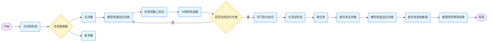

# 元学习优化AI推理的快速适应与泛化能力

> 关键词：元学习、AI推理、快速适应、泛化能力、优化算法

> 摘要：本文聚焦于元学习在优化AI推理的快速适应与泛化能力方面的应用。首先介绍了元学习及AI推理相关背景知识，阐述其目的、预期读者等内容。接着深入讲解核心概念、算法原理与具体操作步骤，结合数学模型和公式进行理论分析。通过项目实战给出代码实际案例及详细解释，探讨实际应用场景。推荐了学习、开发工具框架以及相关论文著作等资源。最后总结元学习在该领域的未来发展趋势与挑战，并对常见问题进行解答，提供扩展阅读与参考资料，旨在全面剖析元学习对AI推理能力优化的关键作用。

## 1. 背景介绍 
### 1.1 目的和范围
在当今人工智能飞速发展的时代，AI系统面临着越来越复杂多变的任务和环境。传统的机器学习方法往往需要大量的数据和长时间的训练才能达到较好的性能，并且在面对新的、未见过的任务时，其适应能力和泛化能力较差。元学习（Meta - learning）作为一种新兴的机器学习范式，旨在让模型能够快速学习和适应新任务，提高模型的泛化能力。

本文的目的在于深入探讨元学习如何优化AI推理的快速适应与泛化能力。范围涵盖元学习的核心概念、算法原理、数学模型，通过项目实战展示其在实际中的应用，分析其在不同场景下的实际应用价值，为相关研究人员和开发者提供全面的技术参考和实践指导。

### 1.2 预期读者
本文预期读者包括人工智能领域的研究人员，他们可以从本文中获取元学习在优化AI推理方面的最新研究进展和理论基础，为其进一步的学术研究提供思路和参考；机器学习和深度学习的开发者，通过阅读本文可以学习到元学习的具体实现方法和优化技巧，将其应用到实际的项目开发中；对人工智能技术感兴趣的学生和爱好者，能够通过本文了解元学习的基本概念和应用场景，激发他们对人工智能领域的学习热情。

### 1.3 文档结构概述
本文将按照以下结构进行组织：首先介绍背景知识，包括目的、预期读者和文档结构概述以及相关术语的定义和解释。接着阐述元学习和AI推理的核心概念与联系，通过文本示意图和Mermaid流程图进行直观展示。然后详细讲解元学习的核心算法原理和具体操作步骤，并使用Python源代码进行详细阐述。之后介绍相关的数学模型和公式，并举例说明。通过项目实战展示代码实际案例和详细解释说明。探讨元学习优化AI推理的快速适应与泛化能力的实际应用场景。推荐相关的学习资源、开发工具框架和论文著作。最后总结未来发展趋势与挑战，解答常见问题，并提供扩展阅读与参考资料。

### 1.4 术语表
#### 1.4.1 核心术语定义
- **元学习（Meta - learning）**：也称为“学习如何学习”，是一种机器学习方法，其目标是通过从多个相关任务中学习，使模型能够快速适应新的任务，而不需要大量的训练数据和长时间的训练过程。
- **AI推理（AI Inference）**：指的是在训练好的AI模型上，使用新的数据进行预测或决策的过程。它是AI模型在实际应用中的关键环节。
- **快速适应（Fast Adaptation）**：元学习中的一个重要概念，指的是模型在面对新任务时，能够在少量的训练数据上快速调整自身的参数，以达到较好的性能。
- **泛化能力（Generalization Ability）**：模型在未见过的数据上能够表现出良好性能的能力。泛化能力强的模型能够更好地适应不同的任务和环境。

#### 1.4.2 相关概念解释
- **元知识（Meta - knowledge）**：元学习中学习到的关于学习过程的知识，包括如何选择合适的模型架构、优化算法和超参数等。元知识可以帮助模型在新任务上更快地学习和适应。
- **元训练（Meta - training）**：元学习中的训练过程，在这个过程中，模型从多个相关任务中学习元知识。元训练的目标是使模型能够在不同的任务上都具有较好的泛化能力和快速适应能力。
- **元测试（Meta - testing）**：在元训练之后，使用新的任务对模型进行测试的过程。元测试的目的是评估模型在未见过的任务上的快速适应能力和泛化能力。

#### 1.4.3 缩略词列表
- **MAML（Model - Agnostic Meta - Learning）**：模型无关元学习，是一种经典的元学习算法。
- **FOMAML（First - Order Model - Agnostic Meta - Learning）**：一阶模型无关元学习，是MAML的简化版本。
- **RL（Reinforcement Learning）**：强化学习，一种通过智能体与环境进行交互来学习最优策略的机器学习方法。

## 2. 核心概念与联系 

### 核心概念原理
元学习的核心思想是通过从多个相关任务中学习，提取出通用的学习策略和元知识，使得模型能够在面对新任务时，利用这些元知识快速调整自身的参数，从而实现快速适应和泛化。

在传统的机器学习中，模型是针对单个任务进行训练的，每个任务都需要大量的数据和长时间的训练。而元学习则是从多个任务中学习，关注的是学习过程本身，而不是具体的任务。例如，在图像分类任务中，传统的方法是针对每个不同的图像类别数据集进行训练，而元学习可以从多个不同的图像分类任务中学习到一些通用的特征提取和分类策略，当遇到新的图像分类任务时，能够快速适应。

AI推理是在训练好的模型上进行预测或决策的过程。在实际应用中，AI推理需要面对不同的输入数据和任务场景，因此需要模型具有良好的快速适应和泛化能力。元学习可以为AI推理提供优化的方法，通过学习到的元知识，使得模型在推理过程中能够更快地适应新的任务和数据，提高推理的准确性和效率。

### 架构的文本示意图
元学习优化AI推理的架构主要包括元训练阶段和元测试阶段。

在元训练阶段，有多个相关的任务数据集，这些数据集被划分为支持集（Support Set）和查询集（Query Set）。模型在支持集上进行快速适应训练，调整自身的参数，然后在查询集上进行验证，计算损失函数。通过多次迭代，模型学习到元知识，即如何在少量数据上快速调整参数以达到较好的性能。

在元测试阶段，当遇到新的任务时，使用新任务的少量数据作为支持集，对模型进行快速适应训练，然后使用新任务的其他数据进行推理，得到预测结果。

### Mermaid流程图


## 3. 核心算法原理 & 具体操作步骤 

### 模型无关元学习（MAML）算法原理
MAML是一种经典的元学习算法，其核心思想是找到一组初始参数，使得模型在经过少量的梯度更新后，能够在新任务上取得较好的性能。

假设我们有一个模型 $f_{\theta}$，其中 $\theta$ 是模型的参数。在元训练阶段，我们有多个任务 $\mathcal{T}_i$，每个任务有一个支持集 $S_i$ 和一个查询集 $Q_i$。

MAML的具体步骤如下：
1. 初始化模型参数 $\theta$。
2. 对于每个任务 $\mathcal{T}_i$：
    - 计算在支持集 $S_i$ 上的损失函数 $\mathcal{L}(f_{\theta}, S_i)$。
    - 对损失函数进行一次梯度更新，得到更新后的参数 $\theta_i'=\theta - \alpha \nabla_{\theta}\mathcal{L}(f_{\theta}, S_i)$，其中 $\alpha$ 是学习率。
    - 计算在查询集 $Q_i$ 上的损失函数 $\mathcal{L}(f_{\theta_i'}, Q_i)$。
3. 计算所有任务在查询集上的损失函数的平均值 $\mathcal{L}_{meta}=\frac{1}{N}\sum_{i = 1}^{N}\mathcal{L}(f_{\theta_i'}, Q_i)$，其中 $N$ 是任务的数量。
4. 对 $\mathcal{L}_{meta}$ 进行梯度更新，更新模型的参数 $\theta=\theta - \beta \nabla_{\theta}\mathcal{L}_{meta}$，其中 $\beta$ 是元学习率。

### Python源代码实现
```python
import torch
import torch.nn as nn
import torch.optim as optim

# 定义一个简单的神经网络模型
class SimpleNet(nn.Module):
    def __init__(self, input_size, hidden_size, output_size):
        super(SimpleNet, self).__init__()
        self.fc1 = nn.Linear(input_size, hidden_size)
        self.relu = nn.ReLU()
        self.fc2 = nn.Linear(hidden_size, output_size)

    def forward(self, x):
        out = self.fc1(x)
        out = self.relu(out)
        out = self.fc2(out)
        return out

# 初始化模型
input_size = 10
hidden_size = 20
output_size = 2
model = SimpleNet(input_size, hidden_size, output_size)

# 定义损失函数和优化器
criterion = nn.CrossEntropyLoss()
meta_optimizer = optim.Adam(model.parameters(), lr=0.001)

# 元训练阶段
num_tasks = 10
num_epochs = 100
alpha = 0.01  # 内部学习率
beta = 0.001  # 元学习率

for epoch in range(num_epochs):
    meta_loss = 0
    for task in range(num_tasks):
        # 生成支持集和查询集（这里简单模拟）
        support_x = torch.randn(10, input_size)
        support_y = torch.randint(0, output_size, (10,))
        query_x = torch.randn(10, input_size)
        query_y = torch.randint(0, output_size, (10,))

        # 保存原始参数
        original_params = [p.clone() for p in model.parameters()]

        # 在支持集上进行一次梯度更新
        output = model(support_x)
        loss = criterion(output, support_y)
        grads = torch.autograd.grad(loss, model.parameters())
        fast_weights = [p - alpha * g for p, g in zip(model.parameters(), grads)]

        # 在查询集上计算损失
        with torch.no_grad():
            query_output = model.forward_with_params(query_x, fast_weights)
            query_loss = criterion(query_output, query_y)

        meta_loss += query_loss

        # 恢复原始参数
        for p, original_p in zip(model.parameters(), original_params):
            p.data.copy_(original_p.data)

    # 元梯度更新
    meta_loss = meta_loss / num_tasks
    meta_optimizer.zero_grad()
    meta_loss.backward()
    meta_optimizer.step()

    if (epoch + 1) % 10 == 0:
        print(f'Epoch [{epoch + 1}/{num_epochs}], Meta Loss: {meta_loss.item()}')
```

### 具体操作步骤总结
1. **模型初始化**：定义模型的架构并初始化模型的参数。
2. **数据准备**：对于每个任务，准备支持集和查询集。
3. **内部梯度更新**：在支持集上对模型进行一次梯度更新，得到更新后的参数。
4. **查询集损失计算**：使用更新后的参数在查询集上计算损失。
5. **元梯度更新**：计算所有任务在查询集上的损失的平均值，对该平均值进行梯度更新，更新模型的原始参数。
6. **迭代训练**：重复步骤2 - 5，直到达到指定的训练轮数。

## 4. 数学模型和公式 & 详细讲解 & 举例说明 

### 数学模型
元学习的数学模型可以用以下公式表示：

#### 任务损失函数
对于每个任务 $\mathcal{T}_i$，其损失函数可以表示为 $\mathcal{L}(f_{\theta}, D_i)$，其中 $f_{\theta}$ 是模型，$D_i$ 是任务 $\mathcal{T}_i$ 的数据集。在MAML中，我们将数据集分为支持集 $S_i$ 和查询集 $Q_i$，则在支持集上的损失函数为 $\mathcal{L}(f_{\theta}, S_i)$，在查询集上的损失函数为 $\mathcal{L}(f_{\theta_i'}, Q_i)$，其中 $\theta_i'$ 是在支持集上进行一次梯度更新后的参数。

#### 元损失函数
元损失函数是所有任务在查询集上的损失函数的平均值，即：
$$\mathcal{L}_{meta}=\frac{1}{N}\sum_{i = 1}^{N}\mathcal{L}(f_{\theta_i'}, Q_i)$$
其中 $N$ 是任务的数量。

#### 梯度更新公式
在支持集上的梯度更新公式为：
$$\theta_i'=\theta - \alpha \nabla_{\theta}\mathcal{L}(f_{\theta}, S_i)$$
其中 $\alpha$ 是学习率。

在元训练阶段，对元损失函数进行梯度更新的公式为：
$$\theta=\theta - \beta \nabla_{\theta}\mathcal{L}_{meta}$$
其中 $\beta$ 是元学习率。

### 详细讲解
- **任务损失函数**：任务损失函数衡量了模型在一个具体任务上的性能。在元学习中，我们将任务的数据集分为支持集和查询集，支持集用于快速调整模型的参数，查询集用于评估调整后的模型的性能。
- **元损失函数**：元损失函数是所有任务在查询集上的损失的平均值，它反映了模型在多个任务上的泛化能力。通过最小化元损失函数，我们可以学习到一组通用的初始参数，使得模型在面对新任务时能够快速适应。
- **梯度更新公式**：在支持集上的梯度更新是为了让模型在少量数据上快速调整参数，以适应新任务。而在元训练阶段的梯度更新是为了优化模型的初始参数，使得模型在多个任务上都能取得较好的性能。

### 举例说明
假设我们有两个任务 $\mathcal{T}_1$ 和 $\mathcal{T}_2$，每个任务的数据集都分为支持集和查询集。

对于任务 $\mathcal{T}_1$，支持集 $S_1=\{(x_1, y_1), (x_2, y_2), \cdots, (x_{10}, y_{10})\}$，查询集 $Q_1=\{(x_{11}, y_{11}), (x_{12}, y_{12}), \cdots, (x_{20}, y_{20})\}$。

对于任务 $\mathcal{T}_2$，支持集 $S_2=\{(x_{21}, y_{21}), (x_{22}, y_{22}), \cdots, (x_{30}, y_{30})\}$，查询集 $Q_2=\{(x_{31}, y_{31}), (x_{32}, y_{32}), \cdots, (x_{40}, y_{40})\}$。

我们首先初始化模型的参数 $\theta$，然后对于任务 $\mathcal{T}_1$，计算在支持集 $S_1$ 上的损失函数 $\mathcal{L}(f_{\theta}, S_1)$，并进行一次梯度更新，得到 $\theta_1'=\theta - \alpha \nabla_{\theta}\mathcal{L}(f_{\theta}, S_1)$。接着计算在查询集 $Q_1$ 上的损失函数 $\mathcal{L}(f_{\theta_1'}, Q_1)$。

对于任务 $\mathcal{T}_2$，同样计算在支持集 $S_2$ 上的损失函数 $\mathcal{L}(f_{\theta}, S_2)$，进行一次梯度更新得到 $\theta_2'=\theta - \alpha \nabla_{\theta}\mathcal{L}(f_{\theta}, S_2)$，然后计算在查询集 $Q_2$ 上的损失函数 $\mathcal{L}(f_{\theta_2'}, Q_2)$。

最后计算元损失函数 $\mathcal{L}_{meta}=\frac{1}{2}(\mathcal{L}(f_{\theta_1'}, Q_1)+\mathcal{L}(f_{\theta_2'}, Q_2))$，并对 $\mathcal{L}_{meta}$ 进行梯度更新，更新模型的参数 $\theta$。

## 5. 项目实战：代码实际案例和详细解释说明 

### 5.1  开发环境搭建
#### 硬件环境
- **CPU**：Intel Core i7 及以上处理器，以保证有足够的计算能力进行模型训练和推理。
- **GPU**：NVIDIA GPU（如 NVIDIA GeForce RTX 2080 Ti 或更高版本），用于加速深度学习模型的训练过程。
- **内存**：16GB 及以上的内存，以满足数据加载和模型运行的需求。

#### 软件环境
- **操作系统**：Ubuntu 18.04 或更高版本的 Linux 系统，或者 Windows 10 操作系统。
- **Python**：Python 3.7 及以上版本，建议使用 Anaconda 来管理 Python 环境。
- **深度学习框架**：PyTorch 1.7 及以上版本，可通过以下命令安装：
```bash
pip install torch torchvision
```
- **其他依赖库**：NumPy、Matplotlib 等，可通过以下命令安装：
```bash
pip install numpy matplotlib
```

### 5.2  源代码详细实现和代码解读
```python
import torch
import torch.nn as nn
import torch.optim as optim
import numpy as np
import matplotlib.pyplot as plt

# 定义一个简单的神经网络模型
class SimpleNet(nn.Module):
    def __init__(self, input_size, hidden_size, output_size):
        super(SimpleNet, self).__init__()
        self.fc1 = nn.Linear(input_size, hidden_size)
        self.relu = nn.ReLU()
        self.fc2 = nn.Linear(hidden_size, output_size)

    def forward(self, x):
        out = self.fc1(x)
        out = self.relu(out)
        out = self.fc2(out)
        return out

    def forward_with_params(self, x, params):
        fc1_weight, fc1_bias = params[:2]
        fc2_weight, fc2_bias = params[2:]
        out = nn.functional.linear(x, fc1_weight, fc1_bias)
        out = self.relu(out)
        out = nn.functional.linear(out, fc2_weight, fc2_bias)
        return out

# 生成任务数据
def generate_task_data(num_tasks, num_samples_per_task, input_size, output_size):
    tasks = []
    for _ in range(num_tasks):
        x = torch.randn(num_samples_per_task, input_size)
        y = torch.randint(0, output_size, (num_samples_per_task,))
        tasks.append((x, y))
    return tasks

# 元训练函数
def meta_train(model, tasks, num_epochs, alpha, beta, num_inner_steps):
    criterion = nn.CrossEntropyLoss()
    meta_optimizer = optim.Adam(model.parameters(), lr=beta)
    meta_losses = []

    for epoch in range(num_epochs):
        meta_loss = 0
        for task_x, task_y in tasks:
            support_x = task_x[:num_inner_steps]
            support_y = task_y[:num_inner_steps]
            query_x = task_x[num_inner_steps:]
            query_y = task_y[num_inner_steps:]

            # 保存原始参数
            original_params = [p.clone() for p in model.parameters()]

            # 内部梯度更新
            for _ in range(num_inner_steps):
                output = model(support_x)
                loss = criterion(output, support_y)
                grads = torch.autograd.grad(loss, model.parameters())
                fast_weights = [p - alpha * g for p, g in zip(model.parameters(), grads)]
                for p, fast_p in zip(model.parameters(), fast_weights):
                    p.data.copy_(fast_p.data)

            # 在查询集上计算损失
            query_output = model(query_x)
            query_loss = criterion(query_output, query_y)
            meta_loss += query_loss

            # 恢复原始参数
            for p, original_p in zip(model.parameters(), original_params):
                p.data.copy_(original_p.data)

        # 元梯度更新
        meta_loss = meta_loss / len(tasks)
        meta_optimizer.zero_grad()
        meta_loss.backward()
        meta_optimizer.step()
        meta_losses.append(meta_loss.item())

        if (epoch + 1) % 10 == 0:
            print(f'Epoch [{epoch + 1}/{num_epochs}], Meta Loss: {meta_loss.item()}')

    return meta_losses

# 超参数设置
input_size = 10
hidden_size = 20
output_size = 2
num_tasks = 10
num_samples_per_task = 20
num_epochs = 100
alpha = 0.01
beta = 0.001
num_inner_steps = 5

# 初始化模型
model = SimpleNet(input_size, hidden_size, output_size)

# 生成任务数据
tasks = generate_task_data(num_tasks, num_samples_per_task, input_size, output_size)

# 元训练
meta_losses = meta_train(model, tasks, num_epochs, alpha, beta, num_inner_steps)

# 绘制元损失曲线
plt.plot(meta_losses)
plt.xlabel('Epoch')
plt.ylabel('Meta Loss')
plt.title('Meta Training Loss')
plt.show()
```

### 5.3  代码解读与分析
- **模型定义**：`SimpleNet` 类定义了一个简单的两层神经网络模型，包含一个全连接层、一个 ReLU 激活函数和另一个全连接层。`forward_with_params` 方法用于使用给定的参数进行前向传播。
- **数据生成**：`generate_task_data` 函数用于生成多个任务的数据，每个任务包含输入数据和对应的标签。
- **元训练函数**：`meta_train` 函数实现了元训练的过程。在每个 epoch 中，对于每个任务，首先将数据分为支持集和查询集。然后在支持集上进行多次内部梯度更新，得到快速调整后的参数。接着在查询集上计算损失，将所有任务的查询集损失相加得到元损失。最后对元损失进行梯度更新，更新模型的原始参数。
- **超参数设置**：设置了输入大小、隐藏层大小、输出大小、任务数量、每个任务的样本数量、训练轮数、内部学习率、元学习率和内部梯度更新步数等超参数。
- **训练过程**：初始化模型，生成任务数据，调用 `meta_train` 函数进行元训练，并记录元损失。最后绘制元损失曲线，观察训练过程中损失的变化情况。

通过这个项目实战，我们可以看到元学习如何在多个任务上进行训练，学习到通用的元知识，从而提高模型的快速适应和泛化能力。

## 6. 实际应用场景 
### 图像识别领域
在图像识别任务中，新的图像类别和场景不断涌现。传统的图像识别模型需要大量的标注数据来训练新的类别，而元学习可以让模型在少量标注数据的情况下快速适应新的图像类别。例如，在医疗图像识别中，对于一些罕见疾病的图像，标注数据非常有限，使用元学习可以在少量标注数据上快速训练出准确的识别模型。

### 自然语言处理领域
在自然语言处理中，不同的语言任务和领域的语言风格差异较大。元学习可以帮助模型快速适应新的语言任务和领域。例如，在机器翻译中，当需要翻译新的语言对时，元学习可以利用之前学习到的语言知识和翻译策略，在少量的平行语料上快速训练出有效的翻译模型。

### 机器人领域
机器人在不同的环境中需要执行不同的任务。元学习可以让机器人在面对新的任务和环境时，快速学习到合适的行为策略。例如，在救援机器人中，当遇到新的灾难场景时，机器人可以利用元学习在少量的环境数据上快速调整自己的运动和操作策略，提高救援效率。

### 推荐系统领域
推荐系统需要根据用户的不同偏好和行为进行个性化推荐。元学习可以帮助推荐系统快速适应新用户的偏好。例如，当新用户注册时，推荐系统可以利用元学习在少量的用户行为数据上快速生成个性化的推荐列表，提高用户的满意度。

## 7. 工具和资源推荐
### 7.1 学习资源推荐
#### 7.1.1 书籍推荐
- 《深度学习》（Deep Learning）：由 Ian Goodfellow、Yoshua Bengio 和 Aaron Courville 合著，是深度学习领域的经典教材，涵盖了深度学习的基本原理、算法和应用。
- 《机器学习》（Machine Learning）：由 Tom M. Mitchell 著，是机器学习领域的经典教材，对机器学习的基本概念、算法和理论进行了系统的介绍。
- 《元学习：理论与实践》（Meta - Learning: Theory and Practice）：专门介绍元学习的书籍，深入探讨了元学习的理论和应用。

#### 7.1.2 在线课程
- Coursera 上的“深度学习专项课程”（Deep Learning Specialization）：由 Andrew Ng 教授讲授，涵盖了深度学习的各个方面，包括神经网络、卷积神经网络、循环神经网络等。
- edX 上的“人工智能基础”（Fundamentals of Artificial Intelligence）：系统介绍了人工智能的基本概念、算法和应用，包括机器学习、深度学习、自然语言处理等。
- 哔哩哔哩上的一些深度学习和元学习相关的教学视频，有很多优秀的博主分享了详细的教学内容和实践案例。

#### 7.1.3 技术博客和网站
- Medium 上的 Towards Data Science：有很多关于机器学习、深度学习和元学习的技术文章和案例分享。
- arXiv.org：是一个预印本服务器，提供了大量的学术论文，包括元学习领域的最新研究成果。
- 博客园、CSDN 等国内技术博客平台，有很多开发者分享了元学习的实践经验和代码实现。

### 7.2 开发工具框架推荐
#### 7.2.1 IDE和编辑器
- PyCharm：是一款专门为 Python 开发设计的集成开发环境，具有代码编辑、调试、版本控制等功能，非常适合深度学习项目的开发。
- Jupyter Notebook：是一个交互式的开发环境，可以方便地进行代码编写、运行和可视化展示，常用于深度学习模型的实验和调试。
- Visual Studio Code：是一款轻量级的代码编辑器，支持多种编程语言和插件，具有丰富的扩展功能，可用于深度学习项目的开发。

#### 7.2.2 调试和性能分析工具
- TensorBoard：是 TensorFlow 提供的可视化工具，可以用于可视化训练过程中的损失函数、准确率、模型结构等信息，帮助开发者调试和优化模型。
- PyTorch Profiler：是 PyTorch 提供的性能分析工具，可以帮助开发者分析模型的性能瓶颈，优化模型的计算效率。
- NVIDIA Nsight Systems：是 NVIDIA 提供的性能分析工具，可用于分析 GPU 加速的深度学习模型的性能，优化 GPU 资源的使用。

#### 7.2.3 相关框架和库
- PyTorch：是一个开源的深度学习框架，具有动态计算图、自动求导等功能，非常适合元学习的开发和实验。
- TensorFlow：是另一个广泛使用的深度学习框架，提供了丰富的工具和库，支持分布式训练和模型部署。
- Higher：是一个基于 PyTorch 的元学习库，提供了方便的接口和工具，简化了元学习模型的实现和训练过程。

### 7.3 相关论文著作推荐
#### 7.3.1 经典论文
- "Model - Agnostic Meta - Learning for Fast Adaptation of Deep Networks"：提出了 MAML 算法，是元学习领域的经典论文。
- "Learning to Learn by Gradient Descent by Gradient Descent"：探讨了通过梯度下降来学习学习率的方法，为元学习的发展提供了重要的理论基础。
- "Meta - Learning with Memory - Augmented Neural Networks"：介绍了使用记忆增强神经网络进行元学习的方法，为元学习的模型设计提供了新的思路。

#### 7.3.2 最新研究成果
可以通过 arXiv.org、ACM Digital Library、IEEE Xplore 等学术数据库查找元学习领域的最新研究论文，了解该领域的最新发展动态和技术趋势。

#### 7.3.3 应用案例分析
一些顶级学术会议（如 NeurIPS、ICML、CVPR 等）的论文集中包含了很多元学习在不同领域的应用案例分析，可以从中学习到元学习在实际应用中的具体方法和经验。

## 8. 总结：未来发展趋势与挑战
### 未来发展趋势
- **与其他技术的融合**：元学习将与强化学习、迁移学习、生成对抗网络等其他机器学习技术进一步融合，形成更强大的学习范式。例如，将元学习与强化学习相结合，可以让智能体在不同的环境中更快地学习到最优策略。
- **应用领域的拓展**：元学习将在更多的领域得到应用，如自动驾驶、金融风控、生物信息学等。在这些领域中，数据的多样性和任务的复杂性对模型的快速适应和泛化能力提出了更高的要求，元学习可以为解决这些问题提供有效的方法。
- **理论研究的深入**：随着元学习的发展，对其理论基础的研究将更加深入。例如，研究元学习的收敛性、泛化性等理论问题，为元学习的应用提供更坚实的理论支持。
- **硬件的优化支持**：随着硬件技术的发展，专门为元学习设计的硬件设备将不断涌现。例如，开发具有更高计算效率和更低能耗的芯片，以加速元学习模型的训练和推理过程。

### 挑战
- **计算资源的需求**：元学习通常需要在多个任务上进行训练，计算量较大，对计算资源的需求较高。如何在有限的计算资源下提高元学习的效率是一个亟待解决的问题。
- **数据的质量和多样性**：元学习的性能很大程度上依赖于数据的质量和多样性。如果数据存在偏差或噪声，或者数据的多样性不足，将影响元学习的效果。因此，如何获取高质量、多样化的数据是元学习面临的一个挑战。
- **模型的可解释性**：元学习模型通常比较复杂，其决策过程难以解释。在一些对模型可解释性要求较高的领域（如医疗、金融等），模型的可解释性问题限制了元学习的应用。如何提高元学习模型的可解释性是一个重要的研究方向。
- **算法的通用性**：目前的元学习算法大多是针对特定的任务和领域设计的，缺乏通用性。如何设计出更通用的元学习算法，使其能够在不同的任务和领域中都能取得良好的效果，是元学习领域需要解决的问题。

## 9. 附录：常见问题与解答
### 问题1：元学习和传统机器学习有什么区别？
传统机器学习是针对单个任务进行训练，需要大量的数据和长时间的训练才能达到较好的性能。而元学习是从多个相关任务中学习，关注的是学习过程本身，能够让模型在面对新任务时快速适应，只需要少量的训练数据。

### 问题2：MAML 算法的复杂度高吗？
MAML 算法的复杂度相对较高，因为它需要在每个任务上进行多次梯度更新，并且需要计算二阶导数。为了降低复杂度，出现了 FOMAML 等简化版本的算法。

### 问题3：元学习在实际应用中需要注意什么？
在实际应用中，需要注意数据的质量和多样性，选择合适的元学习算法和超参数，并且要考虑计算资源的限制。同时，对于一些对模型可解释性要求较高的领域，需要关注模型的可解释性问题。

### 问题4：如何评估元学习模型的性能？
可以使用元测试集来评估元学习模型的性能，计算模型在元测试集上的准确率、损失函数等指标。此外，还可以比较模型在不同任务上的快速适应能力和泛化能力。

## 10. 扩展阅读 & 参考资料
### 扩展阅读
- "Meta - Learning in Neural Networks: A Survey"：对元学习在神经网络中的应用进行了全面的综述，介绍了不同的元学习方法和应用场景。
- "Meta - Reinforcement Learning: A Survey"：专门探讨了元学习与强化学习相结合的方法和应用，为进一步研究提供了参考。

### 参考资料
- 相关学术论文的引用信息，如 MAML 算法的论文引用信息等。
- 开发工具和框架的官方文档，如 PyTorch、TensorFlow 的官方文档。
- 在线课程和技术博客的链接，如 Coursera、Medium 等平台上的相关内容链接。