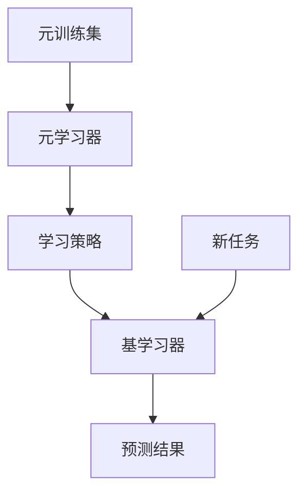

# 元学习在AI模型快速适应新任务中的作用

> 关键词：元学习、AI模型、快速适应、新任务、学习策略、泛化能力

> 摘要：本文深入探讨了元学习在AI模型快速适应新任务中的关键作用。首先介绍了元学习的背景和相关概念，阐述其核心原理与架构，包括数学模型和公式。接着通过Python代码详细讲解了核心算法原理和具体操作步骤，并给出项目实战案例，对代码进行详细解读。然后分析了元学习在不同实际应用场景中的表现，推荐了相关的学习资源、开发工具框架以及论文著作。最后总结了元学习的未来发展趋势与挑战，并对常见问题进行了解答，为深入理解和应用元学习提供了全面且深入的参考。

## 1. 背景介绍 
### 1.1 目的和范围
随着人工智能的不断发展，AI模型面临着越来越多复杂多变的任务。传统的机器学习方法在面对新任务时，往往需要大量的数据和长时间的训练来调整模型参数，效率较低。元学习（Meta-learning）作为一种新兴的学习范式，旨在让AI模型能够快速适应新任务，减少对大量训练数据的依赖。本文的目的是全面深入地探讨元学习在AI模型快速适应新任务中的作用，范围涵盖元学习的基本概念、核心算法、数学模型、实际应用案例以及未来发展趋势等方面。

### 1.2 预期读者
本文预期读者包括人工智能领域的研究人员、开发者、学生以及对元学习和AI模型快速适应新任务感兴趣的技术爱好者。对于有一定机器学习基础的读者，能够通过本文深入理解元学习的原理和应用；对于初学者，也能通过详细的讲解和案例，逐步建立对元学习的认识。

### 1.3 文档结构概述
本文将按照以下结构展开：首先介绍元学习的背景知识，包括目的、预期读者和术语表；接着阐述元学习的核心概念与联系，给出原理和架构的文本示意图以及Mermaid流程图；然后详细讲解核心算法原理和具体操作步骤，使用Python源代码进行阐述；之后介绍元学习的数学模型和公式，并举例说明；再通过项目实战案例，展示元学习在实际中的应用和代码实现；分析元学习的实际应用场景；推荐相关的工具和资源；最后总结元学习的未来发展趋势与挑战，解答常见问题，并提供扩展阅读和参考资料。

### 1.4 术语表
#### 1.4.1 核心术语定义
- **元学习（Meta-learning）**：也称为“学习如何学习”，是一种让模型能够从多个学习任务中学习到通用的学习策略，从而在面对新任务时能够快速适应的学习范式。
- **基学习器（Base learner）**：在元学习中，负责在具体任务上进行学习和预测的模型。
- **元学习器（Meta-learner）**：负责学习基学习器的学习策略，帮助基学习器快速适应新任务的模型。
- **任务（Task）**：在元学习中，任务是指一个具体的学习问题，例如图像分类任务、回归任务等。
- **元训练集（Meta-training set）**：用于训练元学习器的数据集，包含多个任务。
- **元测试集（Meta-testing set）**：用于测试元学习器性能的数据集，包含未在元训练集中出现过的新任务。

#### 1.4.2 相关概念解释
- **快速适应（Fast adaptation）**：指模型在面对新任务时，能够在少量数据和较短时间内调整自身参数，达到较好的性能。
- **泛化能力（Generalization ability）**：模型在未见过的数据上表现出的性能，元学习通过学习通用的学习策略来提高模型的泛化能力。
- **学习策略（Learning strategy）**：元学习所学习的内容，包括如何初始化模型参数、如何更新模型参数等。

#### 1.4.3 缩略词列表
- **MAML（Model-Agnostic Meta-Learning）**：与模型无关的元学习算法。
- **FOMAML（First-Order Model-Agnostic Meta-Learning）**：MAML的一阶近似算法。

## 2. 核心概念与联系 
元学习的核心思想是“学习如何学习”，它试图从多个学习任务中提取通用的学习策略，使得模型在面对新任务时能够快速适应。元学习的基本架构通常包含元学习器和基学习器两个部分。

### 文本示意图
元学习的基本架构可以用以下文本描述：元学习器从元训练集中的多个任务中学习通用的学习策略，然后将这些学习策略传递给基学习器。基学习器在面对新任务时，利用这些学习策略快速调整自身参数，以适应新任务。

### Mermaid流程图


在这个流程图中，元训练集为元学习器提供数据，元学习器从中学习到学习策略，将其传递给基学习器。当基学习器接收到新任务时，利用学习策略进行预测，输出预测结果。

## 3. 核心算法原理 & 具体操作步骤 
### 模型无关的元学习（MAML）算法原理
MAML是一种经典的元学习算法，其核心思想是找到一组初始化参数，使得模型在经过少量梯度更新后，能够在新任务上取得较好的性能。

#### 算法步骤
1. **初始化参数**：随机初始化基学习器的参数 $\theta$。
2. **元训练循环**：
    - 从元训练集中随机采样一个任务 $T_i$。
    - 在任务 $T_i$ 上进行一次或多次梯度更新，得到临时参数 $\theta'_i$。
    - 计算在任务 $T_i$ 上使用临时参数 $\theta'_i$ 时的损失 $L(T_i, \theta'_i)$。
    - 计算损失 $L(T_i, \theta'_i)$ 关于原始参数 $\theta$ 的梯度 $\nabla_{\theta} L(T_i, \theta'_i)$。
    - 累加所有任务的梯度，更新原始参数 $\theta$。
3. **元测试**：在元测试集上测试训练好的模型的性能。

### Python代码实现
```python
import torch
import torch.nn as nn
import torch.optim as optim

# 定义基学习器
class BaseLearner(nn.Module):
    def __init__(self, input_size, hidden_size, output_size):
        super(BaseLearner, self).__init__()
        self.fc1 = nn.Linear(input_size, hidden_size)
        self.relu = nn.ReLU()
        self.fc2 = nn.Linear(hidden_size, output_size)

    def forward(self, x):
        out = self.fc1(x)
        out = self.relu(out)
        out = self.fc2(out)
        return out

# 定义MAML算法
class MAML:
    def __init__(self, base_learner, meta_lr, inner_lr, num_inner_steps):
        self.base_learner = base_learner
        self.meta_optimizer = optim.Adam(self.base_learner.parameters(), lr=meta_lr)
        self.inner_lr = inner_lr
        self.num_inner_steps = num_inner_steps

    def meta_train(self, meta_train_tasks):
        meta_loss = 0
        for task in meta_train_tasks:
            # 复制当前参数
            fast_weights = list(self.base_learner.parameters())

            # 内循环更新
            for _ in range(self.num_inner_steps):
                support_inputs, support_labels = task.sample_support_set()
                support_outputs = self.base_learner.forward(support_inputs)
                support_loss = nn.CrossEntropyLoss()(support_outputs, support_labels)
                grads = torch.autograd.grad(support_loss, fast_weights)
                fast_weights = [w - self.inner_lr * g for w, g in zip(fast_weights, grads)]

            # 计算元损失
            query_inputs, query_labels = task.sample_query_set()
            query_outputs = self.base_learner.forward_with_weights(query_inputs, fast_weights)
            query_loss = nn.CrossEntropyLoss()(query_outputs, query_labels)
            meta_loss += query_loss

        # 元更新
        self.meta_optimizer.zero_grad()
        meta_loss.backward()
        self.meta_optimizer.step()

        return meta_loss.item()
```

### 代码解释
1. **BaseLearner类**：定义了基学习器的结构，这里使用了一个简单的两层全连接神经网络。
2. **MAML类**：实现了MAML算法的核心逻辑。
    - `__init__` 方法：初始化基学习器、元优化器、内循环学习率和内循环步数。
    - `meta_train` 方法：实现了元训练的过程，包括内循环更新和元更新。

## 4. 数学模型和公式 & 详细讲解 & 举例说明 
### MAML的数学模型
MAML的目标是找到一组初始化参数 $\theta$，使得模型在经过少量梯度更新后，能够在新任务上取得较好的性能。具体来说，对于一个任务 $T$，其损失函数为 $L(T, \theta)$。在MAML中，首先在任务 $T$ 上进行一次或多次梯度更新，得到临时参数 $\theta'$：

$$\theta' = \theta - \alpha \nabla_{\theta} L(T, \theta)$$

其中，$\alpha$ 是内循环学习率。然后，计算在任务 $T$ 上使用临时参数 $\theta'$ 时的损失 $L(T, \theta')$。MAML的元损失函数为：

$$\mathcal{L}(\theta) = \sum_{T \in \mathcal{T}} L(T, \theta')$$

其中，$\mathcal{T}$ 是元训练集。最后，通过最小化元损失函数来更新原始参数 $\theta$：

$$\theta \leftarrow \theta - \beta \nabla_{\theta} \mathcal{L}(\theta)$$

其中，$\beta$ 是元学习率。

### 详细讲解
MAML的核心思想是在多个任务上进行元训练，找到一组通用的初始化参数，使得模型在面对新任务时能够快速适应。内循环更新的目的是让模型在具体任务上进行微调，而元更新的目的是让模型学习到通用的学习策略。

### 举例说明
假设我们有一个图像分类任务，元训练集包含多个不同类别的图像数据集。MAML首先随机初始化基学习器的参数 $\theta$，然后在每个任务上进行内循环更新，得到临时参数 $\theta'$。接着，计算在每个任务上使用临时参数 $\theta'$ 时的损失，累加得到元损失。最后，通过元更新来更新原始参数 $\theta$。经过多次元训练后，模型学习到了通用的学习策略，在面对新的图像分类任务时，只需要进行少量的梯度更新，就能够快速适应新任务。

## 5. 项目实战：代码实际案例和详细解释说明 
### 5.1  开发环境搭建
- **操作系统**：Ubuntu 20.04
- **Python版本**：Python 3.8
- **深度学习框架**：PyTorch 1.9.0
- **其他依赖库**：NumPy、Matplotlib

可以使用以下命令安装所需的依赖库：
```bash
pip install torch numpy matplotlib
```

### 5.2  源代码详细实现和代码解读
```python
import torch
import torch.nn as nn
import torch.optim as optim
import numpy as np
import matplotlib.pyplot as plt

# 定义基学习器
class BaseLearner(nn.Module):
    def __init__(self, input_size, hidden_size, output_size):
        super(BaseLearner, self).__init__()
        self.fc1 = nn.Linear(input_size, hidden_size)
        self.relu = nn.ReLU()
        self.fc2 = nn.Linear(hidden_size, output_size)

    def forward(self, x):
        out = self.fc1(x)
        out = self.relu(out)
        out = self.fc2(out)
        return out

    def forward_with_weights(self, x, weights):
        fc1_weight, fc1_bias, fc2_weight, fc2_bias = weights
        out = nn.functional.linear(x, fc1_weight, fc1_bias)
        out = self.relu(out)
        out = nn.functional.linear(out, fc2_weight, fc2_bias)
        return out

# 定义任务类
class Task:
    def __init__(self, num_support, num_query):
        self.num_support = num_support
        self.num_query = num_query
        self.input_size = 10
        self.output_size = 2
        self.weights = [torch.randn(self.input_size, 20), torch.randn(20),
                        torch.randn(20, self.output_size), torch.randn(self.output_size)]

    def sample_support_set(self):
        inputs = torch.randn(self.num_support, self.input_size)
        labels = torch.randint(0, self.output_size, (self.num_support,))
        return inputs, labels

    def sample_query_set(self):
        inputs = torch.randn(self.num_query, self.input_size)
        labels = torch.randint(0, self.output_size, (self.num_query,))
        return inputs, labels

# 定义MAML算法
class MAML:
    def __init__(self, base_learner, meta_lr, inner_lr, num_inner_steps):
        self.base_learner = base_learner
        self.meta_optimizer = optim.Adam(self.base_learner.parameters(), lr=meta_lr)
        self.inner_lr = inner_lr
        self.num_inner_steps = num_inner_steps

    def meta_train(self, meta_train_tasks):
        meta_loss = 0
        for task in meta_train_tasks:
            # 复制当前参数
            fast_weights = list(self.base_learner.parameters())

            # 内循环更新
            for _ in range(self.num_inner_steps):
                support_inputs, support_labels = task.sample_support_set()
                support_outputs = self.base_learner.forward_with_weights(support_inputs, fast_weights)
                support_loss = nn.CrossEntropyLoss()(support_outputs, support_labels)
                grads = torch.autograd.grad(support_loss, fast_weights)
                fast_weights = [w - self.inner_lr * g for w, g in zip(fast_weights, grads)]

            # 计算元损失
            query_inputs, query_labels = task.sample_query_set()
            query_outputs = self.base_learner.forward_with_weights(query_inputs, fast_weights)
            query_loss = nn.CrossEntropyLoss()(query_outputs, query_labels)
            meta_loss += query_loss

        # 元更新
        self.meta_optimizer.zero_grad()
        meta_loss.backward()
        self.meta_optimizer.step()

        return meta_loss.item()

# 训练过程
input_size = 10
hidden_size = 20
output_size = 2
base_learner = BaseLearner(input_size, hidden_size, output_size)
maml = MAML(base_learner, meta_lr=0.001, inner_lr=0.01, num_inner_steps=5)

num_meta_train_tasks = 100
meta_train_tasks = [Task(num_support=10, num_query=5) for _ in range(num_meta_train_tasks)]

num_epochs = 100
meta_losses = []
for epoch in range(num_epochs):
    meta_loss = maml.meta_train(meta_train_tasks)
    meta_losses.append(meta_loss)
    print(f'Epoch {epoch + 1}/{num_epochs}, Meta Loss: {meta_loss}')

# 绘制元损失曲线
plt.plot(meta_losses)
plt.xlabel('Epoch')
plt.ylabel('Meta Loss')
plt.title('Meta Loss over Epochs')
plt.show()
```

### 5.3  代码解读与分析
1. **BaseLearner类**：定义了基学习器的结构，包含一个全连接层、一个ReLU激活函数和另一个全连接层。`forward_with_weights` 方法用于在给定参数的情况下进行前向传播。
2. **Task类**：定义了任务的结构，包括支持集和查询集的采样方法。
3. **MAML类**：实现了MAML算法的核心逻辑，包括内循环更新和元更新。
4. **训练过程**：创建基学习器和MAML对象，生成元训练任务，进行多个epoch的元训练，并记录元损失。
5. **绘制元损失曲线**：使用Matplotlib绘制元损失随epoch变化的曲线，帮助我们观察训练过程。

通过这个项目实战，我们可以看到MAML算法在元训练过程中，元损失逐渐下降，说明模型在不断学习到通用的学习策略，能够更好地适应新任务。

## 6. 实际应用场景 
### 少样本学习（Few-shot Learning）
在少样本学习中，训练数据往往非常有限。元学习可以帮助模型从少量样本中快速学习到新的概念和模式。例如，在图像分类任务中，当只有少量样本的新类别出现时，元学习模型可以利用之前学习到的学习策略，快速调整参数，对新类别进行分类。

### 个性化推荐
在个性化推荐系统中，不同用户的兴趣和偏好各不相同。元学习可以让推荐模型快速适应每个用户的个性化需求。例如，通过学习不同用户的历史行为数据，元学习模型可以快速调整推荐策略，为每个用户提供更加个性化的推荐结果。

### 机器人自适应控制
在机器人领域，机器人需要在不同的环境和任务中快速适应。元学习可以帮助机器人学习到通用的控制策略，使得机器人在面对新的任务和环境时，能够快速调整自身的行为。例如，机器人在不同的地形上行走时，元学习模型可以根据地形的特点，快速调整机器人的运动参数，保证机器人的稳定行走。

### 医疗诊断
在医疗诊断中，疾病的种类繁多，且新的疾病不断出现。元学习可以帮助医疗诊断模型快速适应新的疾病类型。例如，当出现一种新的疾病时，元学习模型可以利用之前学习到的疾病诊断策略，结合少量的新疾病样本，快速进行诊断。

## 7. 工具和资源推荐
### 7.1 学习资源推荐
#### 7.1.1 书籍推荐
- 《深度学习》（Deep Learning）：由Ian Goodfellow、Yoshua Bengio和Aaron Courville合著，是深度学习领域的经典教材，涵盖了深度学习的基本概念、算法和应用。
- 《机器学习》（Machine Learning: A Probabilistic Perspective）：由Kevin P. Murphy编写，从概率的角度介绍了机器学习的基本原理和算法，对理解元学习的理论基础有很大帮助。
- 《元学习：理论与应用》（Meta-Learning: Theory and Applications）：专门介绍元学习的书籍，深入探讨了元学习的各种算法和应用场景。

#### 7.1.2 在线课程
- Coursera上的“深度学习专项课程”（Deep Learning Specialization）：由Andrew Ng教授授课，系统地介绍了深度学习的各个方面，包括元学习的相关内容。
- edX上的“人工智能基础”（Foundations of Artificial Intelligence）：涵盖了人工智能的基本概念和算法，对元学习的入门有很大帮助。
- 哔哩哔哩上的“李宏毅机器学习”：由李宏毅教授授课，课程内容生动有趣，对元学习的讲解深入浅出。

#### 7.1.3 技术博客和网站
- Medium：是一个技术博客平台，有很多关于元学习的优质文章。
- arXiv：是一个预印本数据库，包含了很多元学习领域的最新研究成果。
- 机器之心：是一个专注于人工智能领域的媒体平台，经常发布关于元学习的最新技术和应用案例。

### 7.2 开发工具框架推荐
#### 7.2.1 IDE和编辑器
- PyCharm：是一款专门为Python开发设计的集成开发环境，具有强大的代码编辑、调试和自动完成功能。
- Jupyter Notebook：是一个交互式的开发环境，适合进行数据分析和模型实验，方便展示代码和结果。
- Visual Studio Code：是一款轻量级的代码编辑器，支持多种编程语言和插件，可用于元学习的开发。

#### 7.2.2 调试和性能分析工具
- TensorBoard：是TensorFlow的可视化工具，也可以用于PyTorch模型的可视化，帮助我们观察模型的训练过程和性能指标。
- PyTorch Profiler：是PyTorch的性能分析工具，可以帮助我们找出模型中的性能瓶颈，优化模型的训练和推理速度。
- cProfile：是Python的内置性能分析工具，可以帮助我们分析Python代码的性能。

#### 7.2.3 相关框架和库
- PyTorch：是一个开源的深度学习框架，提供了丰富的深度学习工具和算法，方便我们实现元学习模型。
- TensorFlow：是另一个流行的深度学习框架，也支持元学习的实现。
- Torchmeta：是一个专门用于元学习的PyTorch库，提供了各种元学习的数据集和算法实现。

### 7.3 相关论文著作推荐
#### 7.3.1 经典论文
- “Model-Agnostic Meta-Learning for Fast Adaptation of Deep Networks”：介绍了MAML算法的经典论文，奠定了元学习的基础。
- “Matching Networks for One Shot Learning”：提出了匹配网络（Matching Networks）的论文，是少样本学习领域的经典之作。
- “Prototypical Networks for Few-shot Learning”：介绍了原型网络（Prototypical Networks）的论文，在少样本学习中取得了很好的效果。

#### 7.3.2 最新研究成果
- 关注arXiv上关于元学习的最新论文，了解元学习领域的最新研究进展。
- 参加人工智能领域的顶级学术会议，如NeurIPS、ICML、CVPR等，获取元学习的最新研究成果。

#### 7.3.3 应用案例分析
- 研究一些元学习在实际应用中的案例，如元学习在医疗诊断、机器人控制等领域的应用，了解元学习的实际效果和挑战。

## 8. 总结：未来发展趋势与挑战
### 未来发展趋势
- **与其他技术的融合**：元学习将与强化学习、迁移学习等技术进一步融合，实现更加智能和高效的学习。例如，将元学习与强化学习结合，可以让智能体在不同的环境中快速学习到最优策略。
- **应用领域的拓展**：元学习将在更多的领域得到应用，如自动驾驶、金融、教育等。例如，在自动驾驶中，元学习可以帮助车辆快速适应不同的路况和环境。
- **理论研究的深入**：元学习的理论研究将不断深入，如元学习的泛化理论、收敛性分析等。这将有助于我们更好地理解元学习的本质，设计出更加高效的元学习算法。

### 挑战
- **计算资源的需求**：元学习通常需要大量的计算资源，尤其是在处理大规模数据集和复杂任务时。如何降低元学习的计算成本，提高计算效率，是一个亟待解决的问题。
- **数据的多样性和质量**：元学习的性能很大程度上依赖于数据的多样性和质量。如何获取高质量、多样化的数据，以及如何处理数据中的噪声和偏差，是元学习面临的挑战之一。
- **模型的可解释性**：元学习模型通常比较复杂，其决策过程难以解释。如何提高元学习模型的可解释性，让人们更好地理解模型的决策依据，是元学习领域需要解决的重要问题。

## 9. 附录：常见问题与解答
### 问题1：元学习和传统机器学习有什么区别？
传统机器学习通常在一个固定的任务上进行训练，需要大量的数据来调整模型参数。而元学习的目标是学习通用的学习策略，使得模型能够在面对新任务时快速适应，减少对大量训练数据的依赖。

### 问题2：MAML算法的复杂度高吗？
MAML算法的复杂度相对较高，主要是因为它需要进行内循环更新和元更新，涉及到多次的梯度计算。为了降低复杂度，可以使用MAML的一阶近似算法FOMAML。

### 问题3：元学习在实际应用中需要注意什么？
在实际应用中，需要注意数据的多样性和质量，选择合适的元学习算法和超参数，以及进行充分的实验和调优。同时，还需要考虑计算资源的限制和模型的可解释性。

### 问题4：元学习可以应用于无监督学习吗？
可以，元学习可以应用于无监督学习任务，如聚类、降维等。在无监督学习中，元学习可以帮助模型快速适应新的数据集，学习到更好的特征表示。

## 10. 扩展阅读 & 参考资料
### 扩展阅读
- 阅读更多关于元学习的研究论文和技术博客，深入了解元学习的最新进展和应用案例。
- 学习其他相关的机器学习和人工智能技术，如强化学习、迁移学习等，以便更好地理解元学习的原理和应用。

### 参考资料
- Goodfellow, I., Bengio, Y., & Courville, A. (2016). Deep Learning. MIT Press.
- Murphy, K. P. (2012). Machine Learning: A Probabilistic Perspective. MIT Press.
- Finn, C., Abbeel, P., & Levine, S. (2017). Model-Agnostic Meta-Learning for Fast Adaptation of Deep Networks. arXiv preprint arXiv:1703.03400.
- Vinyals, O., Blundell, C., Lillicrap, T., Wierstra, D., & others. (2016). Matching Networks for One Shot Learning. In Advances in neural information processing systems (pp. 3630-3638).
- Snell, J., Swersky, K., & Zemel, R. S. (2017). Prototypical Networks for Few-shot Learning. arXiv preprint arXiv:1703.05175.