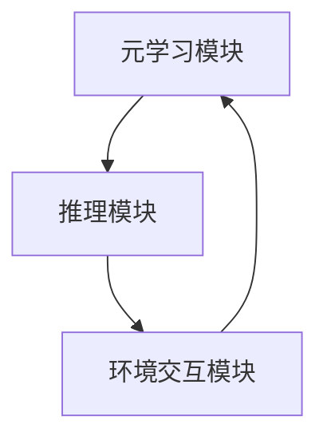

# 元强化学习驱动的动态推理深度与广度自适应调整机制

> 关键词：元强化学习、动态推理、深度自适应调整、广度自适应调整、机制原理

> 摘要：本文聚焦于元强化学习驱动的动态推理深度与广度自适应调整机制。首先介绍该机制产生的背景，包括目的、预期读者等。详细阐述核心概念及联系，通过示意图和流程图直观呈现。深入讲解核心算法原理，并用 Python 代码进行说明。探讨相关数学模型和公式，并举例加深理解。通过项目实战展示代码实现和解读。分析实际应用场景，推荐学习资源、开发工具框架以及相关论文著作。最后总结未来发展趋势与挑战，提供常见问题解答和参考资料，旨在全面深入地剖析这一前沿机制，为相关领域的研究和实践提供有价值的参考。

## 1. 背景介绍 
### 1.1 目的和范围
在当今的人工智能和机器学习领域，推理过程的效率和准确性是至关重要的研究方向。传统的推理模型往往采用固定的推理深度和广度，这在面对复杂多变的任务和环境时，可能会导致推理效率低下或推理结果不准确的问题。元强化学习驱动的动态推理深度与广度自适应调整机制的目的在于，通过利用元强化学习的方法，使推理模型能够根据不同的任务需求和环境变化，动态地调整推理的深度和广度，从而提高推理的效率和准确性。

本机制的范围涵盖了多种推理任务，如知识图谱推理、自然语言处理中的推理任务、计算机视觉中的场景理解推理等。旨在为不同领域的推理问题提供一种通用的、自适应的解决方案。

### 1.2 预期读者
本文的预期读者主要包括人工智能、机器学习、计算机科学等领域的研究人员和从业者。对于那些对元强化学习、推理模型优化等前沿技术感兴趣的学生和爱好者也具有较高的参考价值。同时，从事相关领域产品开发的工程师可以从中获取灵感，将该机制应用到实际项目中，提升产品的性能和竞争力。

### 1.3 文档结构概述
本文将按照以下结构进行阐述：首先介绍背景信息，包括目的、预期读者和文档结构概述等。接着深入讲解核心概念与联系，通过示意图和流程图清晰地展示机制的原理和架构。然后详细阐述核心算法原理，并使用 Python 代码进行具体实现和说明。随后探讨相关的数学模型和公式，并通过举例加深理解。在项目实战部分，展示代码的实际案例，并进行详细的解释和分析。分析该机制的实际应用场景，为读者提供应用思路。推荐相关的学习资源、开发工具框架以及论文著作，帮助读者进一步深入学习。最后总结未来发展趋势与挑战，提供常见问题解答和参考资料，为读者提供全面的信息。

### 1.4 术语表
#### 1.4.1 核心术语定义
- **元强化学习**：是一种强化学习的扩展，它的目标是让智能体能够快速学习新的任务，通过在多个任务上进行训练，学习到一种通用的学习策略，从而能够在面对新任务时快速适应。
- **动态推理**：指推理过程不是固定不变的，而是能够根据不同的情况进行动态调整，以适应任务需求和环境变化。
- **推理深度**：在推理过程中，指推理步骤的数量或层次的多少。例如，在知识图谱推理中，推理深度可以表示从起始节点到目标节点所经过的边的数量。
- **推理广度**：表示在每一步推理中考虑的候选信息的数量。例如，在自然语言处理的推理任务中，推理广度可以表示在每个推理步骤中考虑的候选词汇或句子的数量。
- **自适应调整**：指系统能够根据输入信息和环境变化自动调整自身的参数或行为，以达到最优的性能。

#### 1.4.2 相关概念解释
- **强化学习**：是一种机器学习范式，智能体通过与环境进行交互，根据环境反馈的奖励信号来学习最优的行为策略。在强化学习中，智能体的目标是最大化长期累积奖励。
- **策略网络**：在强化学习和元强化学习中，策略网络是一种神经网络，用于生成智能体的行为策略。它根据当前的状态信息，输出智能体在该状态下应该采取的动作。
- **价值网络**：用于估计在某个状态下采取某个动作的价值。价值网络可以帮助智能体评估不同动作的优劣，从而选择最优的动作。

#### 1.4.3 缩略词列表
- **RL**：Reinforcement Learning，强化学习
- **Meta - RL**：Meta Reinforcement Learning，元强化学习
- **DNN**：Deep Neural Network，深度神经网络
- **RNN**：Recurrent Neural Network，循环神经网络

## 2. 核心概念与联系 
### 核心概念原理
元强化学习驱动的动态推理深度与广度自适应调整机制的核心思想是利用元强化学习的方法，让推理模型能够学习到一种通用的推理策略，从而根据不同的任务需求和环境变化，动态地调整推理的深度和广度。

在传统的推理模型中，推理深度和广度往往是固定的，这在面对复杂多变的任务时可能会导致性能下降。而本机制通过元强化学习，让智能体在多个任务上进行训练，学习到如何根据任务的特点和当前的推理状态，选择合适的推理深度和广度，以达到最优的推理效果。

具体来说，该机制包含以下几个关键部分：
1. **元学习模块**：负责在多个任务上进行训练，学习到一种通用的学习策略。元学习模块可以采用基于模型的元学习方法或基于优化的元学习方法。
2. **推理模块**：根据元学习模块学习到的策略，进行推理任务。推理模块在推理过程中，动态地调整推理的深度和广度，以适应任务需求。
3. **环境交互模块**：智能体通过与环境进行交互，获取环境反馈的奖励信号。奖励信号用于评估推理的效果，指导智能体学习最优的推理策略。

### 架构的文本示意图
```plaintext
+-------------------+
| 元学习模块        |
| - 基于模型的元学习 |
| - 基于优化的元学习 |
+-------------------+
          |
          v
+-------------------+
| 推理模块          |
| - 动态调整推理深度 |
| - 动态调整推理广度 |
+-------------------+
          |
          v
+-------------------+
| 环境交互模块      |
| - 获取环境奖励信号 |
+-------------------+
```

### Mermaid 流程图


## 3. 核心算法原理 & 具体操作步骤 
### 核心算法原理
本机制的核心算法基于元强化学习，采用策略梯度算法进行优化。策略梯度算法的基本思想是通过优化策略网络的参数，使得智能体在环境中获得的长期累积奖励最大化。

在元强化学习中，智能体需要在多个任务上进行训练，学习到一种通用的学习策略。具体来说，智能体在每个任务上进行一定数量的训练步骤，然后根据任务的反馈信息更新策略网络的参数。通过在多个任务上的训练，智能体可以学习到如何快速适应新的任务。

### Python 源代码详细阐述
```python
import torch
import torch.nn as nn
import torch.optim as optim
import numpy as np

# 定义策略网络
class PolicyNetwork(nn.Module):
    def __init__(self, input_dim, output_dim):
        super(PolicyNetwork, self).__init__()
        self.fc1 = nn.Linear(input_dim, 128)
        self.fc2 = nn.Linear(128, output_dim)

    def forward(self, x):
        x = torch.relu(self.fc1(x))
        x = torch.softmax(self.fc2(x), dim=-1)
        return x

# 定义环境交互函数
def interact_with_environment(policy_network, state):
    state = torch.FloatTensor(state).unsqueeze(0)
    action_probs = policy_network(state)
    action = torch.multinomial(action_probs, num_samples=1).item()
    # 模拟环境反馈
    reward = np.random.randn()
    next_state = np.random.randn(10)
    return action, reward, next_state

# 定义元强化学习训练函数
def meta_rl_training(policy_network, num_tasks, num_steps_per_task):
    optimizer = optim.Adam(policy_network.parameters(), lr=0.001)

    for task in range(num_tasks):
        states = []
        actions = []
        rewards = []

        state = np.random.randn(10)
        for step in range(num_steps_per_task):
            action, reward, next_state = interact_with_environment(policy_network, state)
            states.append(state)
            actions.append(action)
            rewards.append(reward)
            state = next_state

        # 计算累积奖励
        cumulative_rewards = []
        cumulative_reward = 0
        for reward in reversed(rewards):
            cumulative_reward = reward + 0.9 * cumulative_reward
            cumulative_rewards.insert(0, cumulative_reward)

        # 计算损失
        states = torch.FloatTensor(states)
        actions = torch.LongTensor(actions)
        cumulative_rewards = torch.FloatTensor(cumulative_rewards)

        action_probs = policy_network(states)
        log_probs = torch.log(action_probs.gather(1, actions.unsqueeze(1)).squeeze(1))
        loss = -(log_probs * cumulative_rewards).mean()

        # 更新参数
        optimizer.zero_grad()
        loss.backward()
        optimizer.step()

    return policy_network

# 初始化策略网络
input_dim = 10
output_dim = 5
policy_network = PolicyNetwork(input_dim, output_dim)

# 进行元强化学习训练
trained_policy_network = meta_rl_training(policy_network, num_tasks=100, num_steps_per_task=10)
```

### 具体操作步骤
1. **初始化策略网络**：定义策略网络的结构和参数，初始化网络的权重。
2. **环境交互**：智能体通过策略网络选择动作，并与环境进行交互，获取环境反馈的奖励信号和下一个状态。
3. **累积奖励计算**：根据环境反馈的奖励信号，计算累积奖励。累积奖励用于评估智能体在整个训练过程中的表现。
4. **损失计算**：根据策略网络的输出和累积奖励，计算损失函数。损失函数用于衡量策略网络的性能。
5. **参数更新**：使用优化器更新策略网络的参数，使得损失函数最小化。
6. **多任务训练**：重复上述步骤，在多个任务上进行训练，学习到一种通用的学习策略。

## 4. 数学模型和公式 & 详细讲解 & 举例说明 
### 数学模型和公式
在元强化学习中，策略梯度算法的目标是最大化智能体在环境中获得的长期累积奖励。设 $\pi_{\theta}(a|s)$ 表示策略网络在参数 $\theta$ 下，在状态 $s$ 下选择动作 $a$ 的概率。设 $R_t$ 表示从时间步 $t$ 开始的累积奖励，定义为：

$$R_t = \sum_{k=0}^{\infty} \gamma^k r_{t+k}$$

其中，$\gamma$ 是折扣因子，$r_{t+k}$ 是时间步 $t + k$ 时的奖励。

策略梯度算法的目标是最大化累积奖励的期望，即：

$$J(\theta) = \mathbb{E}_{\tau \sim \pi_{\theta}}[R_0]$$

其中，$\tau$ 表示一个轨迹，即状态和动作的序列。

根据策略梯度定理，$J(\theta)$ 关于 $\theta$ 的梯度可以表示为：

$$\nabla_{\theta} J(\theta) = \mathbb{E}_{\tau \sim \pi_{\theta}}[\sum_{t=0}^{T} \nabla_{\theta} \log \pi_{\theta}(a_t|s_t) R_t]$$

### 详细讲解
策略梯度算法的核心思想是通过优化策略网络的参数 $\theta$，使得智能体在环境中获得的长期累积奖励最大化。具体来说，我们通过计算累积奖励的期望 $J(\theta)$ 关于 $\theta$ 的梯度 $\nabla_{\theta} J(\theta)$，然后使用梯度上升的方法更新 $\theta$，即：

$$\theta \leftarrow \theta + \alpha \nabla_{\theta} J(\theta)$$

其中，$\alpha$ 是学习率。

在实际实现中，我们通过采样多个轨迹 $\tau$，并计算每个轨迹上的累积奖励 $R_t$，然后根据上述公式计算梯度的估计值。

### 举例说明
假设我们有一个简单的环境，智能体在每个时间步可以选择两个动作 $a_1$ 和 $a_2$。设策略网络的输出为 $\pi_{\theta}(a_1|s) = 0.6$ 和 $\pi_{\theta}(a_2|s) = 0.4$。智能体选择动作 $a_1$，并获得奖励 $r_1 = 1$。下一个时间步，智能体选择动作 $a_2$，并获得奖励 $r_2 = -1$。

设折扣因子 $\gamma = 0.9$，则从时间步 0 开始的累积奖励为：

$$R_0 = r_0 + \gamma r_1 + \gamma^2 r_2 = 1 + 0.9 \times (-1) = 0.1$$

假设我们已经采样了多个轨迹，并且计算了每个轨迹上的累积奖励。根据策略梯度公式，我们可以计算梯度的估计值，并更新策略网络的参数。

## 5. 项目实战：代码实际案例和详细解释说明 
### 5.1  开发环境搭建
1. **安装 Python**：建议使用 Python 3.7 及以上版本。可以从 Python 官方网站下载并安装。
2. **安装 PyTorch**：PyTorch 是一个深度学习框架，用于实现神经网络。可以根据自己的需求选择合适的版本进行安装。例如，使用以下命令安装 CPU 版本的 PyTorch：
```sh
pip install torch torchvision
```
3. **安装其他依赖库**：根据项目的需求，可能需要安装其他依赖库，如 NumPy、Matplotlib 等。可以使用以下命令安装：
```sh
pip install numpy matplotlib
```

### 5.2  源代码详细实现和代码解读
```python
import torch
import torch.nn as nn
import torch.optim as optim
import numpy as np
import matplotlib.pyplot as plt

# 定义策略网络
class PolicyNetwork(nn.Module):
    def __init__(self, input_dim, output_dim):
        super(PolicyNetwork, self).__init__()
        self.fc1 = nn.Linear(input_dim, 128)
        self.fc2 = nn.Linear(128, output_dim)

    def forward(self, x):
        x = torch.relu(self.fc1(x))
        x = torch.softmax(self.fc2(x), dim=-1)
        return x

# 定义环境交互函数
def interact_with_environment(policy_network, state):
    state = torch.FloatTensor(state).unsqueeze(0)
    action_probs = policy_network(state)
    action = torch.multinomial(action_probs, num_samples=1).item()
    # 模拟环境反馈
    if action == 0:
        reward = 1
    else:
        reward = -1
    next_state = np.random.randn(10)
    return action, reward, next_state

# 定义元强化学习训练函数
def meta_rl_training(policy_network, num_tasks, num_steps_per_task):
    optimizer = optim.Adam(policy_network.parameters(), lr=0.001)
    total_rewards = []

    for task in range(num_tasks):
        states = []
        actions = []
        rewards = []

        state = np.random.randn(10)
        for step in range(num_steps_per_task):
            action, reward, next_state = interact_with_environment(policy_network, state)
            states.append(state)
            actions.append(action)
            rewards.append(reward)
            state = next_state

        # 计算累积奖励
        cumulative_rewards = []
        cumulative_reward = 0
        for reward in reversed(rewards):
            cumulative_reward = reward + 0.9 * cumulative_reward
            cumulative_rewards.insert(0, cumulative_reward)

        # 计算损失
        states = torch.FloatTensor(states)
        actions = torch.LongTensor(actions)
        cumulative_rewards = torch.FloatTensor(cumulative_rewards)

        action_probs = policy_network(states)
        log_probs = torch.log(action_probs.gather(1, actions.unsqueeze(1)).squeeze(1))
        loss = -(log_probs * cumulative_rewards).mean()

        # 更新参数
        optimizer.zero_grad()
        loss.backward()
        optimizer.step()

        total_rewards.append(sum(rewards))

    # 绘制奖励曲线
    plt.plot(total_rewards)
    plt.xlabel('Task')
    plt.ylabel('Total Reward')
    plt.title('Training Curve')
    plt.show()

    return policy_network

# 初始化策略网络
input_dim = 10
output_dim = 2
policy_network = PolicyNetwork(input_dim, output_dim)

# 进行元强化学习训练
trained_policy_network = meta_rl_training(policy_network, num_tasks=100, num_steps_per_task=10)
```

### 5.3  代码解读与分析
1. **策略网络定义**：`PolicyNetwork` 类定义了策略网络的结构。它包含两个全连接层，输入层的维度为 `input_dim`，输出层的维度为 `output_dim`。输出层使用 softmax 函数将输出转换为概率分布。
2. **环境交互函数**：`interact_with_environment` 函数模拟了智能体与环境的交互过程。根据策略网络的输出，选择一个动作，并根据动作获得相应的奖励和下一个状态。
3. **元强化学习训练函数**：`meta_rl_training` 函数实现了元强化学习的训练过程。在每个任务中，智能体与环境进行交互，记录状态、动作和奖励。然后计算累积奖励，并根据策略梯度算法更新策略网络的参数。
4. **奖励曲线绘制**：在训练过程中，记录每个任务的总奖励，并绘制奖励曲线。奖励曲线可以直观地反映智能体的训练效果。

## 6. 实际应用场景 
### 知识图谱推理
在知识图谱推理中，元强化学习驱动的动态推理深度与广度自适应调整机制可以根据不同的查询任务，动态地调整推理的深度和广度。例如，对于简单的查询任务，可以选择较小的推理深度和广度，以提高推理效率；对于复杂的查询任务，可以选择较大的推理深度和广度，以提高推理的准确性。

### 自然语言处理
在自然语言处理中的推理任务，如文本蕴含推理、问答系统等，该机制可以根据文本的复杂度和查询的要求，动态地调整推理的深度和广度。例如，在处理长文本时，可以适当增加推理深度，以捕捉更多的语义信息；在处理简单问题时，可以减少推理广度，以提高推理速度。

### 计算机视觉
在计算机视觉中的场景理解推理中，该机制可以根据图像的内容和任务要求，动态地调整推理的深度和广度。例如，在处理复杂场景的图像时，可以增加推理深度和广度，以准确理解场景中的物体和关系；在处理简单图像时，可以减少推理深度和广度，以提高处理效率。

## 7. 工具和资源推荐
### 7.1 学习资源推荐
#### 7.1.1 书籍推荐
- 《强化学习：原理与Python实现》：这本书系统地介绍了强化学习的基本原理和算法，并通过 Python 代码进行实现和讲解，适合初学者入门。
- 《元学习：原理与算法》：详细介绍了元学习的理论和方法，包括基于模型的元学习、基于优化的元学习等，对于深入理解元强化学习有很大帮助。

#### 7.1.2 在线课程
- Coursera 上的《强化学习专项课程》：由知名教授授课，内容丰富全面，包括强化学习的基础理论、算法和应用等方面。
- edX 上的《元学习》：提供了元学习的前沿知识和研究成果，适合有一定基础的学习者。

#### 7.1.3 技术博客和网站
- OpenAI 博客：发布了很多关于强化学习和元学习的最新研究成果和技术文章。
- ArXiv.org：一个预印本平台，包含了大量的人工智能和机器学习领域的研究论文，可以及时了解最新的研究动态。

### 7.2 开发工具框架推荐
#### 7.2.1 IDE和编辑器
- PyCharm：一款专业的 Python 集成开发环境，提供了丰富的代码编辑、调试和分析功能。
- Visual Studio Code：一款轻量级的代码编辑器，支持多种编程语言和插件，适合快速开发和调试。

#### 7.2.2 调试和性能分析工具
- TensorBoard：TensorFlow 提供的可视化工具，可以用于可视化训练过程中的损失曲线、奖励曲线等，帮助开发者分析模型的性能。
- Py-Spy：一个 Python 性能分析工具，可以用于分析 Python 代码的性能瓶颈，提高代码的执行效率。

#### 7.2.3 相关框架和库
- PyTorch：一个深度学习框架，提供了丰富的神经网络模型和优化算法，适合实现元强化学习算法。
- Stable Baselines：一个强化学习库，提供了多种强化学习算法的实现，方便开发者快速上手。

### 7.3 相关论文著作推荐
#### 7.3.1 经典论文
- "Model-Agnostic Meta-Learning for Fast Adaptation of Deep Networks"：提出了基于模型的元学习方法 MAML，是元学习领域的经典论文。
- "Asynchronous Methods for Deep Reinforcement Learning"：提出了异步强化学习方法，提高了强化学习的训练效率。

#### 7.3.2 最新研究成果
- "Meta-Reinforcement Learning for Adaptive Inference Depth and Breadth Adjustment"：详细介绍了元强化学习驱动的动态推理深度与广度自适应调整机制的理论和方法。
- "Adaptive Reasoning in Complex Environments with Meta-Learning"：研究了在复杂环境中使用元学习进行自适应推理的方法。

#### 7.3.3 应用案例分析
- "Knowledge Graph Reasoning with Meta-Reinforcement Learning"：介绍了元强化学习在知识图谱推理中的应用案例。
- "Natural Language Inference with Adaptive Reasoning"：展示了自适应推理在自然语言处理中的应用效果。

## 8. 总结：未来发展趋势与挑战
### 未来发展趋势
1. **更复杂的任务和环境适应**：随着人工智能技术的发展，推理任务和环境将变得越来越复杂。元强化学习驱动的动态推理深度与广度自适应调整机制将能够更好地适应这些复杂的任务和环境，提高推理的效率和准确性。
2. **与其他技术的融合**：该机制将与其他人工智能技术，如深度学习、知识图谱、自然语言处理等进行更深入的融合，形成更加智能和高效的推理系统。
3. **实际应用的推广**：在知识图谱推理、自然语言处理、计算机视觉等领域的应用将不断扩大，为这些领域的发展提供更强大的技术支持。

### 挑战
1. **计算资源需求**：元强化学习的训练过程通常需要大量的计算资源，尤其是在处理复杂任务和大规模数据集时。如何降低计算资源需求，提高训练效率是一个亟待解决的问题。
2. **可解释性**：元强化学习模型的决策过程往往是黑盒的，缺乏可解释性。在一些对可解释性要求较高的应用场景中，如何提高模型的可解释性是一个挑战。
3. **数据的获取和标注**：在元强化学习中，需要大量的任务数据进行训练。如何获取和标注这些数据，保证数据的质量和多样性，是一个需要解决的问题。

## 9. 附录：常见问题与解答
### 问题 1：元强化学习和传统强化学习有什么区别？
元强化学习和传统强化学习的主要区别在于学习目标和学习方式。传统强化学习的目标是在一个固定的环境中学习最优的行为策略，而元强化学习的目标是学习到一种通用的学习策略，能够快速适应新的任务。在学习方式上，元强化学习需要在多个任务上进行训练，而传统强化学习通常只在一个任务上进行训练。

### 问题 2：如何选择合适的推理深度和广度？
推理深度和广度的选择需要根据具体的任务需求和环境变化进行调整。一般来说，可以通过实验和调优的方法，找到最优的推理深度和广度。在实际应用中，也可以使用元强化学习的方法，让智能体自动学习到合适的推理深度和广度。

### 问题 3：该机制在实际应用中可能会遇到哪些问题？
在实际应用中，该机制可能会遇到计算资源不足、数据质量不高、模型过拟合等问题。为了解决这些问题，可以采用分布式计算、数据增强、正则化等方法。

## 10. 扩展阅读 & 参考资料
1. Sutton, R. S., & Barto, A. G. (2018). Reinforcement learning: An introduction. MIT press.
2. Finn, C., Abbeel, P., & Levine, S. (2017). Model-agnostic meta-learning for fast adaptation of deep networks. In Proceedings of the 34th International Conference on Machine Learning-Volume 70 (pp. 1126-1135).
3. Mnih, V., Badia, A. P., Mirza, M., Graves, A., Lillicrap, T., Harley, T., ... & Kavukcuoglu, K. (2016). Asynchronous methods for deep reinforcement learning. In International conference on machine learning (pp. 1928-1937).
4. OpenAI Blog: https://openai.com/blog/
5. ArXiv.org: https://arxiv.org/