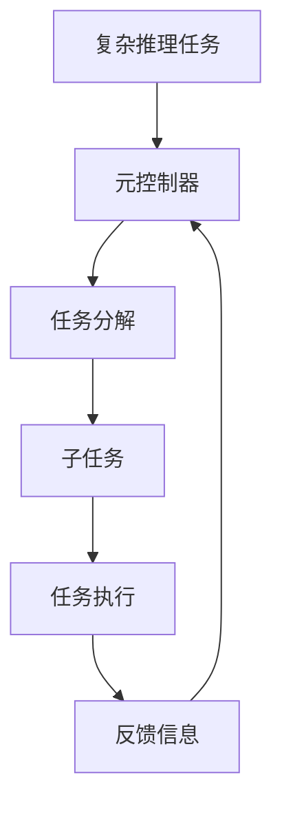

# 元控制器在复杂推理任务分解中的决策优化

> 关键词：元控制器、复杂推理任务、任务分解、决策优化、人工智能

> 摘要：本文聚焦于元控制器在复杂推理任务分解中的决策优化问题。首先介绍了研究的背景和相关概念，深入剖析了元控制器的核心原理及其与任务分解的联系。通过详细的算法原理阐述和Python代码示例，展示了元控制器在任务分解决策中的具体操作步骤。同时，给出了相关的数学模型和公式，并结合实际例子进行说明。在项目实战部分，通过具体的代码案例展示了元控制器在实际开发中的应用和实现细节。此外，探讨了元控制器在不同领域的实际应用场景，推荐了相关的学习资源、开发工具和论文著作。最后，总结了元控制器的未来发展趋势与面临的挑战，并提供了常见问题的解答和扩展阅读参考资料，旨在为相关领域的研究和实践提供全面且深入的技术指导。

## 1. 背景介绍 
### 1.1 目的和范围
在当今复杂多变的人工智能和计算机科学领域，复杂推理任务的处理成为了研究的热点和难点。复杂推理任务通常具有高度的复杂性、不确定性和动态性，单一的推理策略往往难以有效地解决这些问题。元控制器作为一种高级的决策机制，旨在对复杂推理任务进行合理的分解和优化决策，以提高任务处理的效率和准确性。

本文章的范围涵盖了元控制器的基本概念、核心算法原理、数学模型、实际应用案例等多个方面。通过全面的阐述，帮助读者深入理解元控制器在复杂推理任务分解中的决策优化过程和方法。

### 1.2 预期读者
本文预期读者包括人工智能领域的研究人员、计算机科学专业的学生、软件开发者以及对复杂推理任务处理感兴趣的技术爱好者。对于那些希望深入了解元控制器技术和应用的读者，本文将提供系统而深入的知识和实践指导。

### 1.3 文档结构概述
本文共分为十个部分。第一部分为背景介绍，阐述了研究的目的、范围、预期读者和文档结构。第二部分介绍核心概念与联系，包括元控制器和复杂推理任务分解的原理及它们之间的关系，并通过示意图和流程图进行直观展示。第三部分详细讲解核心算法原理和具体操作步骤，同时给出Python源代码示例。第四部分介绍数学模型和公式，并结合具体例子进行说明。第五部分是项目实战，包括开发环境搭建、源代码实现和代码解读。第六部分探讨实际应用场景。第七部分推荐相关的工具和资源，包括学习资源、开发工具框架和论文著作。第八部分总结未来发展趋势与挑战。第九部分是附录，提供常见问题与解答。第十部分是扩展阅读和参考资料。

### 1.4 术语表
#### 1.4.1 核心术语定义
- **元控制器**：一种高级的决策机制，负责对复杂推理任务进行整体的规划、调度和控制，通过对任务的分解和优化决策，提高任务处理的效率和准确性。
- **复杂推理任务**：具有高度复杂性、不确定性和动态性的推理任务，通常需要综合运用多种知识和推理策略才能解决。
- **任务分解**：将复杂推理任务分解为多个子任务的过程，以便于更高效地进行处理。
- **决策优化**：在任务分解和执行过程中，通过合理的决策方法，选择最优的任务执行顺序和策略，以达到最佳的任务处理效果。

#### 1.4.2 相关概念解释
- **推理策略**：在解决推理任务时所采用的具体方法和规则，如基于规则的推理、基于案例的推理等。
- **子任务**：复杂推理任务分解后得到的较小的、相对独立的任务单元。
- **任务执行顺序**：子任务执行的先后顺序，合理的任务执行顺序可以提高任务处理的效率。

#### 1.4.3 缩略词列表
- **AI**：Artificial Intelligence，人工智能
- **ML**：Machine Learning，机器学习

## 2. 核心概念与联系 

### 2.1 元控制器原理
元控制器是一种高层次的决策系统，它的主要作用是对复杂推理任务进行全局的管理和控制。元控制器通过对任务的分析和理解，将复杂任务分解为多个子任务，并根据任务的特点和目标，制定合理的任务执行计划。元控制器还会在任务执行过程中实时监控任务的进展情况，根据反馈信息对任务执行计划进行调整和优化，以确保任务能够高效、准确地完成。

### 2.2 复杂推理任务分解原理
复杂推理任务分解是将一个复杂的推理任务分解为多个相对简单的子任务的过程。分解的目的是将复杂问题简化，便于采用合适的推理策略和算法进行处理。任务分解的方法有很多种，常见的包括基于功能的分解、基于层次的分解等。基于功能的分解是将任务按照功能模块进行划分，每个子任务负责实现一个特定的功能；基于层次的分解是将任务按照层次结构进行划分，上层任务可以进一步分解为下层任务。

### 2.3 元控制器与任务分解的联系
元控制器在复杂推理任务分解中起着关键的作用。元控制器根据任务的特点和目标，选择合适的任务分解方法，并对分解后的子任务进行合理的调度和控制。元控制器可以根据子任务之间的依赖关系和优先级，确定任务的执行顺序，以确保任务能够顺利进行。同时，元控制器还可以根据任务执行过程中的反馈信息，对任务分解和执行计划进行动态调整，以适应任务的变化和不确定性。

### 2.4 文本示意图
元控制器与复杂推理任务分解的关系可以用以下文本示意图表示：

复杂推理任务 -> 元控制器 -> 任务分解 -> 子任务 -> 任务执行 -> 反馈信息 -> 元控制器（调整决策）

### 2.5 Mermaid 流程图


## 3. 核心算法原理 & 具体操作步骤 

### 3.1 核心算法原理
元控制器在复杂推理任务分解中的决策优化主要基于强化学习算法。强化学习是一种通过智能体与环境进行交互，不断学习最优策略的机器学习方法。在元控制器中，智能体根据当前的任务状态和环境信息，选择合适的任务分解和执行策略，环境会根据智能体的决策给出相应的奖励信号，智能体通过不断地学习和调整策略，以最大化长期奖励。

### 3.2 具体操作步骤
1. **任务表示**：将复杂推理任务表示为一个状态空间，每个状态包含任务的相关信息，如任务的目标、约束条件、当前进展等。
2. **动作空间定义**：定义智能体可以采取的动作，包括任务分解方法的选择、子任务的调度和执行策略等。
3. **奖励函数设计**：设计一个奖励函数，用于评估智能体的决策效果。奖励函数可以根据任务的完成情况、执行效率、准确性等因素进行设计。
4. **策略学习**：智能体通过与环境进行交互，不断尝试不同的动作，并根据奖励信号更新自己的策略。常用的强化学习算法包括Q - learning、深度Q网络（DQN）等。
5. **任务执行与优化**：根据学习到的策略，元控制器对复杂推理任务进行分解和执行，并在执行过程中根据反馈信息进行动态调整和优化。

### 3.3 Python源代码示例
```python
import numpy as np

# 定义任务状态空间
class TaskState:
    def __init__(self, goal, constraints, progress):
        self.goal = goal
        self.constraints = constraints
        self.progress = progress

    def get_state(self):
        return (self.goal, self.constraints, self.progress)

# 定义动作空间
class ActionSpace:
    def __init__(self, actions):
        self.actions = actions

    def sample(self):
        return np.random.choice(self.actions)

# 定义奖励函数
def reward_function(state, action, next_state):
    # 简单示例：根据任务完成情况给予奖励
    if next_state.progress == 100:
        return 100
    else:
        return -1

# 定义Q - learning算法
class QLearningAgent:
    def __init__(self, state_space, action_space, learning_rate=0.1, discount_factor=0.9):
        self.state_space = state_space
        self.action_space = action_space
        self.learning_rate = learning_rate
        self.discount_factor = discount_factor
        self.q_table = {}

    def get_q_value(self, state, action):
        if (state, action) not in self.q_table:
            self.q_table[(state, action)] = 0
        return self.q_table[(state, action)]

    def update_q_value(self, state, action, reward, next_state):
        max_q_next = max([self.get_q_value(next_state, a) for a in self.action_space.actions])
        self.q_table[(state, action)] += self.learning_rate * (reward + self.discount_factor * max_q_next - self.get_q_value(state, action))

    def choose_action(self, state):
        actions = self.action_space.actions
        q_values = [self.get_q_value(state, a) for a in actions]
        max_q_index = np.argmax(q_values)
        return actions[max_q_index]

# 模拟任务执行过程
def simulate_task():
    # 初始化任务状态
    initial_state = TaskState(goal="Solve complex problem", constraints=[], progress=0)
    action_space = ActionSpace(actions=["Decompose by function", "Decompose by hierarchy"])
    agent = QLearningAgent(state_space=None, action_space=action_space)

    current_state = initial_state
    for step in range(100):
        action = agent.choose_action(current_state.get_state())
        # 模拟任务执行，更新状态
        next_progress = current_state.progress + 10
        next_state = TaskState(goal=current_state.goal, constraints=current_state.constraints, progress=next_progress)
        reward = reward_function(current_state.get_state(), action, next_state.get_state())
        agent.update_q_value(current_state.get_state(), action, reward, next_state.get_state())
        current_state = next_state

        if current_state.progress == 100:
            print("Task completed!")
            break

if __name__ == "__main__":
    simulate_task()
```

## 4. 数学模型和公式 & 详细讲解 & 举例说明 

### 4.1 数学模型
元控制器在复杂推理任务分解中的决策优化可以用马尔可夫决策过程（MDP）来建模。马尔可夫决策过程是一个五元组 $(S, A, P, R, \gamma)$，其中：
- $S$ 是状态空间，表示任务的所有可能状态。
- $A$ 是动作空间，表示智能体可以采取的所有动作。
- $P(s'|s, a)$ 是状态转移概率，表示在状态 $s$ 下采取动作 $a$ 后转移到状态 $s'$ 的概率。
- $R(s, a, s')$ 是奖励函数，表示在状态 $s$ 下采取动作 $a$ 转移到状态 $s'$ 时获得的奖励。
- $\gamma$ 是折扣因子，用于权衡当前奖励和未来奖励的重要性，取值范围为 $[0, 1]$。

### 4.2 公式
在马尔可夫决策过程中，智能体的目标是学习一个最优策略 $\pi^*$，使得长期累积奖励最大化。长期累积奖励可以用以下公式表示：

$$G_t = \sum_{k = 0}^{\infty} \gamma^k R_{t + k + 1}$$

其中，$G_t$ 是在时间步 $t$ 时的长期累积奖励，$R_{t + k + 1}$ 是在时间步 $t + k + 1$ 时获得的奖励。

Q - learning 算法通过更新Q值来学习最优策略，Q值表示在状态 $s$ 下采取动作 $a$ 的预期长期累积奖励。Q值的更新公式如下：

$$Q(s, a) \leftarrow Q(s, a) + \alpha [R(s, a, s') + \gamma \max_{a'} Q(s', a') - Q(s, a)]$$

其中，$\alpha$ 是学习率，$s'$ 是采取动作 $a$ 后转移到的下一个状态。

### 4.3 详细讲解
马尔可夫决策过程为元控制器的决策优化提供了一个数学框架。状态空间 $S$ 描述了任务的各种可能状态，动作空间 $A$ 定义了智能体可以采取的行动。状态转移概率 $P(s'|s, a)$ 反映了任务在不同状态之间的转移规律，奖励函数 $R(s, a, s')$ 用于评估智能体的决策效果。折扣因子 $\gamma$ 用于平衡当前奖励和未来奖励的重要性，当 $\gamma$ 接近 1 时，智能体更注重未来的奖励；当 $\gamma$ 接近 0 时，智能体更注重当前的奖励。

Q - learning 算法通过不断更新Q值来学习最优策略。在每个时间步，智能体根据当前状态选择一个动作，执行动作后观察到下一个状态和奖励，然后根据Q值更新公式更新Q值。通过多次迭代，Q值逐渐收敛到最优值，智能体也学习到了最优策略。

### 4.4 举例说明
假设一个复杂推理任务是解决一个数学问题，状态空间 $S$ 可以包括问题的当前进度、剩余的时间、已使用的方法等信息。动作空间 $A$ 可以包括选择不同的解题方法、分解问题的方式等。奖励函数 $R(s, a, s')$ 可以根据问题的解决情况和解题效率来设计，例如，如果成功解决问题则给予正奖励，解题时间过长则给予负奖励。

假设在某个状态 $s$ 下，智能体选择了动作 $a$，执行动作后转移到了状态 $s'$，获得了奖励 $R(s, a, s') = 10$。当前的Q值 $Q(s, a) = 20$，下一个状态 $s'$ 的最大Q值 $\max_{a'} Q(s', a') = 30$，学习率 $\alpha = 0.1$，折扣因子 $\gamma = 0.9$。根据Q值更新公式，更新后的Q值为：

$$Q(s, a) = 20 + 0.1 [10 + 0.9 \times 30 - 20] = 20 + 0.1 [10 + 27 - 20] = 20 + 0.1 \times 17 = 21.7$$

通过不断地更新Q值，智能体可以学习到在不同状态下选择最优动作的策略，从而实现复杂推理任务分解中的决策优化。

## 5. 项目实战：代码实际案例和详细解释说明 

### 5.1  开发环境搭建
本项目使用Python语言进行开发，所需的开发环境和库如下：
- **Python**：建议使用Python 3.7及以上版本。
- **NumPy**：用于数值计算。
- **Matplotlib**：用于数据可视化（可选）。

可以使用以下命令安装所需的库：
```sh
pip install numpy matplotlib
```

### 5.2  源代码详细实现和代码解读
```python
import numpy as np
import matplotlib.pyplot as plt

# 定义任务状态空间
class TaskState:
    def __init__(self, goal, constraints, progress):
        # 任务目标
        self.goal = goal
        # 任务约束条件
        self.constraints = constraints
        # 任务进度
        self.progress = progress

    def get_state(self):
        # 返回任务状态的元组表示
        return (self.goal, self.constraints, self.progress)

# 定义动作空间
class ActionSpace:
    def __init__(self, actions):
        # 动作列表
        self.actions = actions

    def sample(self):
        # 随机选择一个动作
        return np.random.choice(self.actions)

# 定义奖励函数
def reward_function(state, action, next_state):
    # 根据任务完成情况给予奖励
    if next_state.progress == 100:
        return 100
    else:
        return -1

# 定义Q - learning算法
class QLearningAgent:
    def __init__(self, state_space, action_space, learning_rate=0.1, discount_factor=0.9):
        # 状态空间
        self.state_space = state_space
        # 动作空间
        self.action_space = action_space
        # 学习率
        self.learning_rate = learning_rate
        # 折扣因子
        self.discount_factor = discount_factor
        # Q表，用于存储Q值
        self.q_table = {}

    def get_q_value(self, state, action):
        # 获取Q值，如果Q值不存在则初始化为0
        if (state, action) not in self.q_table:
            self.q_table[(state, action)] = 0
        return self.q_table[(state, action)]

    def update_q_value(self, state, action, reward, next_state):
        # 获取下一个状态的最大Q值
        max_q_next = max([self.get_q_value(next_state, a) for a in self.action_space.actions])
        # 根据Q值更新公式更新Q值
        self.q_table[(state, action)] += self.learning_rate * (reward + self.discount_factor * max_q_next - self.get_q_value(state, action))

    def choose_action(self, state):
        # 获取所有动作
        actions = self.action_space.actions
        # 获取所有动作的Q值
        q_values = [self.get_q_value(state, a) for a in actions]
        # 选择Q值最大的动作
        max_q_index = np.argmax(q_values)
        return actions[max_q_index]

# 模拟任务执行过程
def simulate_task():
    # 初始化任务状态
    initial_state = TaskState(goal="Solve complex problem", constraints=[], progress=0)
    # 定义动作空间
    action_space = ActionSpace(actions=["Decompose by function", "Decompose by hierarchy"])
    # 初始化QLearning智能体
    agent = QLearningAgent(state_space=None, action_space=action_space)

    current_state = initial_state
    rewards = []
    for step in range(100):
        # 选择动作
        action = agent.choose_action(current_state.get_state())
        # 模拟任务执行，更新状态
        next_progress = current_state.progress + 10
        next_state = TaskState(goal=current_state.goal, constraints=current_state.constraints, progress=next_progress)
        # 计算奖励
        reward = reward_function(current_state.get_state(), action, next_state.get_state())
        # 更新Q值
        agent.update_q_value(current_state.get_state(), action, reward, next_state.get_state())
        current_state = next_state
        rewards.append(reward)

        if current_state.progress == 100:
            print("Task completed!")
            break

    # 绘制奖励曲线
    plt.plot(rewards)
    plt.xlabel('Step')
    plt.ylabel('Reward')
    plt.title('Reward Curve')
    plt.show()

if __name__ == "__main__":
    simulate_task()
```

### 5.3  代码解读与分析
- **TaskState类**：用于表示任务的状态，包含任务的目标、约束条件和进度。`get_state` 方法返回任务状态的元组表示。
- **ActionSpace类**：用于定义动作空间，包含所有可能的动作。`sample` 方法用于随机选择一个动作。
- **reward_function函数**：根据任务的完成情况给予奖励，如果任务完成则给予 100 的奖励，否则给予 - 1 的奖励。
- **QLearningAgent类**：实现了Q - learning算法。`get_q_value` 方法用于获取Q值，`update_q_value` 方法根据Q值更新公式更新Q值，`choose_action` 方法选择Q值最大的动作。
- **simulate_task函数**：模拟任务的执行过程。在每个时间步，智能体选择一个动作，执行动作后更新状态和Q值，直到任务完成。同时，记录每个时间步的奖励，并绘制奖励曲线。

通过这个项目实战，我们可以看到如何使用Q - learning算法实现元控制器在复杂推理任务分解中的决策优化。

## 6. 实际应用场景 
### 6.1 自然语言处理
在自然语言处理中，复杂的文本推理任务可以通过元控制器进行分解和优化决策。例如，在机器阅读理解任务中，元控制器可以将问题分解为多个子问题，如实体识别、关系提取、语义理解等子任务，并根据任务的特点和目标，选择合适的推理策略和模型进行处理。通过元控制器的决策优化，可以提高机器阅读理解的准确性和效率。

### 6.2 计算机视觉
在计算机视觉领域，复杂的图像推理任务，如图像语义分割、目标检测与跟踪等，也可以利用元控制器进行任务分解和决策优化。元控制器可以将图像推理任务分解为多个子任务，如特征提取、分类、定位等，并根据图像的特点和任务要求，选择合适的算法和模型进行处理。通过合理的任务分解和决策优化，可以提高计算机视觉任务的性能和效果。

### 6.3 智能机器人
在智能机器人领域，机器人需要完成各种复杂的任务，如导航、抓取、操作等。元控制器可以对机器人的任务进行分解和调度，根据环境信息和任务目标，选择合适的动作和策略。例如，在机器人导航任务中，元控制器可以将导航任务分解为路径规划、避障、运动控制等子任务，并根据实时的环境信息和机器人的状态，动态调整任务执行计划，以确保机器人能够安全、高效地完成任务。

### 6.4 医疗诊断
在医疗诊断领域，复杂的疾病诊断任务可以通过元控制器进行分解和优化决策。元控制器可以将诊断任务分解为多个子任务，如症状分析、检查结果解读、疾病分类等，并根据患者的具体情况和医学知识，选择合适的诊断方法和模型。通过元控制器的决策优化，可以提高医疗诊断的准确性和效率，减少误诊和漏诊的发生。

## 7. 工具和资源推荐
### 7.1 学习资源推荐
#### 7.1.1 书籍推荐
- 《强化学习：原理与Python实现》：这本书详细介绍了强化学习的基本原理和算法，并通过Python代码示例进行了实现，对于理解元控制器所使用的强化学习算法非常有帮助。
- 《人工智能：一种现代的方法》：这是一本经典的人工智能教材，涵盖了人工智能的各个领域，包括知识表示、推理、机器学习等，对于全面了解复杂推理任务和元控制器的相关知识有很大的帮助。

#### 7.1.2 在线课程
- Coursera上的“强化学习专项课程”：由知名学者授课，系统地介绍了强化学习的理论和实践，包括马尔可夫决策过程、Q - learning算法、深度强化学习等内容。
- edX上的“人工智能基础”：该课程涵盖了人工智能的基本概念、算法和应用，对于初学者来说是一个很好的入门课程。

#### 7.1.3 技术博客和网站
- OpenAI官方博客：OpenAI是人工智能领域的领先研究机构，其官方博客会发布最新的研究成果和技术动态，对于了解元控制器和强化学习的前沿进展非常有帮助。
- 机器之心：这是一个专注于人工智能领域的技术媒体，提供了丰富的技术文章、研究报告和案例分析，对于学习和了解元控制器的应用场景和实践经验有很大的帮助。

### 7.2 开发工具框架推荐
#### 7.2.1 IDE和编辑器
- PyCharm：这是一款专业的Python集成开发环境，提供了丰富的代码编辑、调试、测试等功能，对于开发基于Python的元控制器项目非常方便。
- Visual Studio Code：这是一款轻量级的代码编辑器，支持多种编程语言和插件扩展，具有良好的可定制性和开发效率。

#### 7.2.2 调试和性能分析工具
- pdb：Python自带的调试器，可以帮助开发者在代码中设置断点、查看变量值、单步执行等，方便调试元控制器的代码。
- cProfile：Python的性能分析工具，可以分析代码的执行时间和函数调用关系，帮助开发者优化代码性能。

#### 7.2.3 相关框架和库
- OpenAI Gym：这是一个开源的强化学习环境库，提供了多种模拟环境和任务，方便开发者进行强化学习算法的实验和验证。
- Stable Baselines：这是一个基于OpenAI Gym的强化学习算法库，实现了多种常见的强化学习算法，如A2C、PPO等，方便开发者快速实现元控制器的决策优化算法。

### 7.3 相关论文著作推荐
#### 7.3.1 经典论文
- “Reinforcement Learning: A Survey”：这篇论文是强化学习领域的经典综述论文，系统地介绍了强化学习的基本概念、算法和应用，对于理解元控制器所使用的强化学习算法有很大的帮助。
- “Human - Level Control through Deep Reinforcement Learning”：这篇论文介绍了深度Q网络（DQN）算法，通过深度神经网络实现了强化学习中的值函数估计，为元控制器的决策优化提供了一种有效的方法。

#### 7.3.2 最新研究成果
- 关注NeurIPS、ICML、AAAI等人工智能领域的顶级学术会议，这些会议会发布最新的研究成果和技术进展，对于了解元控制器和强化学习的前沿研究非常有帮助。
- 阅读《Journal of Artificial Intelligence Research》、《Artificial Intelligence》等人工智能领域的顶级学术期刊，这些期刊发表了大量高质量的研究论文，对于深入研究元控制器的理论和应用有很大的帮助。

#### 7.3.3 应用案例分析
- 参考一些实际应用案例的研究报告和论文，如智能机器人、医疗诊断、自然语言处理等领域的应用案例，了解元控制器在实际应用中的实现方法和效果评估。

## 8. 总结：未来发展趋势与挑战
### 8.1 未来发展趋势
- **与深度学习的深度融合**：随着深度学习技术的不断发展，元控制器将与深度学习更加紧密地结合。通过深度学习模型对任务状态和环境信息进行更准确的表示和理解，提高元控制器的决策能力和适应性。
- **多智能体协作**：在复杂的任务环境中，多个元控制器可以协同工作，共同完成复杂的推理任务。多智能体协作可以提高任务处理的效率和灵活性，适用于更广泛的应用场景。
- **可解释性增强**：元控制器的决策过程往往是复杂和难以理解的，未来的研究将更加注重元控制器的可解释性。通过开发可解释的强化学习算法和模型，使元控制器的决策过程更加透明和可解释，提高用户对元控制器的信任和接受度。

### 8.2 挑战
- **计算资源需求**：元控制器的决策优化通常需要大量的计算资源，特别是在使用深度学习模型和大规模强化学习算法时。如何在有限的计算资源下实现高效的决策优化是一个亟待解决的问题。
- **环境不确定性**：复杂推理任务的环境往往具有高度的不确定性，元控制器需要在不确定的环境中做出合理的决策。如何处理环境的不确定性，提高元控制器的鲁棒性和适应性是一个挑战。
- **任务复杂性建模**：复杂推理任务的复杂性难以准确建模，如何对任务的复杂性进行有效的表示和分析，以便元控制器能够更好地进行任务分解和决策优化是一个关键问题。

## 9. 附录：常见问题与解答
### 9.1 元控制器与传统控制器有什么区别？
元控制器与传统控制器的主要区别在于其决策层次和功能。传统控制器通常是针对具体的任务或过程进行控制，其决策主要基于预先设定的规则和模型。而元控制器是一种高层次的决策机制，负责对复杂推理任务进行整体的规划、调度和控制，它可以根据任务的特点和环境信息，动态地调整任务分解和执行策略。

### 9.2 元控制器在任务分解时如何选择合适的方法？
元控制器在任务分解时选择合适的方法通常基于任务的特点和目标。例如，如果任务具有明显的功能模块划分，则可以选择基于功能的分解方法；如果任务具有层次结构，则可以选择基于层次的分解方法。此外，元控制器还可以通过强化学习算法，根据任务执行的反馈信息，不断学习和优化任务分解方法的选择策略。

### 9.3 如何评估元控制器的决策效果？
可以通过多种指标来评估元控制器的决策效果，如任务完成时间、任务完成准确率、资源利用率等。在强化学习中，通常使用奖励函数来评估智能体的决策效果，奖励函数可以根据具体的任务和目标进行设计。此外，还可以通过对比实验，将元控制器的决策结果与其他方法进行比较，来评估其性能和效果。

### 9.4 元控制器在实际应用中面临哪些困难？
元控制器在实际应用中面临的困难包括计算资源需求大、环境不确定性、任务复杂性建模困难等。此外，元控制器的决策过程往往是复杂和难以理解的，其可解释性也是一个需要解决的问题。在实际应用中，还需要考虑元控制器与其他系统和组件的集成问题，以及如何确保元控制器的安全性和可靠性。

## 10. 扩展阅读 & 参考资料
### 10.1 扩展阅读
- 《深度强化学习实战》：这本书详细介绍了深度强化学习的算法和应用，对于深入理解元控制器所使用的强化学习技术有很大的帮助。
- 《知识图谱：方法、实践与应用》：知识图谱在复杂推理任务中具有重要的应用，了解知识图谱的相关知识可以帮助更好地理解元控制器在知识推理任务中的应用。

### 10.2 参考资料
- Sutton, R. S., & Barto, A. G. (2018). Reinforcement learning: An introduction. MIT press.
- Mnih, V., Kavukcuoglu, K., Silver, D., Rusu, A. A., Veness, J., Bellemare, M. G., ... & Petersen, S. (2015). Human - level control through deep reinforcement learning. Nature, 518(7540), 529 - 533.
- OpenAI Gym官方文档：https://gym.openai.com/docs/
- Stable Baselines官方文档：https://stable - baselines.readthedocs.io/en/master/