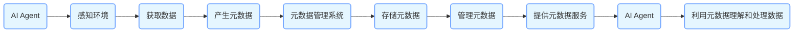

# 元数据管理：组织和利用AI Agent的数据资产

> 关键词：元数据管理、AI Agent、数据资产、组织、利用

> 摘要：本文围绕元数据管理在组织和利用AI Agent的数据资产方面展开深入探讨。首先介绍元数据管理的背景，包括目的范围、预期读者等内容。接着阐述元数据管理与AI Agent的核心概念及联系，详细讲解核心算法原理和具体操作步骤，同时给出相关数学模型和公式并举例说明。通过项目实战展示代码实际案例并进行详细解释。探讨元数据管理在AI Agent中的实际应用场景，推荐相关工具和资源。最后总结未来发展趋势与挑战，提供常见问题解答和扩展阅读参考资料，旨在帮助读者全面了解如何通过元数据管理有效组织和利用AI Agent的数据资产。

## 1. 背景介绍 
### 1.1 目的和范围
在当今数字化时代，AI Agent（人工智能代理）在各个领域得到了广泛应用。AI Agent在运行过程中会产生大量的数据资产，这些数据资产包含了丰富的信息，但如果缺乏有效的管理，将难以发挥其应有的价值。元数据管理的目的就是为了对AI Agent的数据资产进行系统的组织和高效的利用，使得数据能够被更好地理解、访问和分析。

本文章的范围涵盖了元数据管理的基本概念、与AI Agent的关系、相关算法原理、数学模型、实际应用案例以及未来发展趋势等方面，旨在为读者提供一个全面的关于元数据管理在AI Agent数据资产处理中的知识体系。

### 1.2 预期读者
本文预期读者包括从事人工智能、数据管理、软件开发等领域的专业技术人员，如数据科学家、软件工程师、数据管理员等。同时，对AI Agent和元数据管理感兴趣的研究人员、学生以及企业中负责数据战略规划和管理的相关人员也能从本文中获取有价值的信息。

### 1.3 文档结构概述
本文将按照以下结构进行阐述：首先介绍元数据管理和AI Agent的背景知识，包括术语表等内容；接着讲解核心概念与联系，通过文本示意图和Mermaid流程图进行直观展示；然后深入探讨核心算法原理和具体操作步骤，结合Python源代码详细说明；再介绍相关的数学模型和公式，并举例进行详细讲解；通过项目实战展示代码实际案例并进行详细解释；探讨实际应用场景；推荐相关的工具和资源；最后总结未来发展趋势与挑战，提供常见问题解答和扩展阅读参考资料。

### 1.4 术语表
#### 1.4.1 核心术语定义
- **元数据（Metadata）**：关于数据的数据，它描述了数据的结构、内容、来源、用途等信息。例如，在一个数据库中，表的字段名、数据类型、长度等信息就是该表数据的元数据。
- **AI Agent（人工智能代理）**：能够感知环境、进行推理和决策，并采取行动以实现特定目标的人工智能实体。它可以是智能机器人、智能客服系统等。
- **数据资产（Data Asset）**：企业或组织拥有的有价值的数据资源，包括结构化数据（如数据库中的数据）和非结构化数据（如文本、图像、视频等）。

#### 1.4.2 相关概念解释
- **数据治理（Data Governance）**：对数据资产进行全面管理和控制的一系列活动，包括数据策略制定、数据质量管控、数据安全管理等。元数据管理是数据治理的重要组成部分。
- **数据仓库（Data Warehouse）**：一个集成的、面向主题的、非易失的、随时间变化的数据集合，用于支持企业的决策分析。元数据管理在数据仓库的建设和维护中起着关键作用。

#### 1.4.3 缩略词列表
- **ETL（Extract, Transform, Load）**：数据抽取、转换和加载的过程，用于将不同来源的数据整合到数据仓库中。
- **API（Application Programming Interface）**：应用程序编程接口，用于不同软件系统之间的交互和数据共享。

## 2. 核心概念与联系 
### 2.1 元数据管理的核心概念
元数据管理是对元数据进行创建、存储、维护、使用和共享的过程。元数据可以分为技术元数据、业务元数据和操作元数据。

- **技术元数据**：描述数据的技术特征，如数据库表结构、数据类型、数据存储位置等。例如，在一个关系型数据库中，表的列名、数据类型、索引信息等都属于技术元数据。
- **业务元数据**：描述数据的业务含义和业务规则，如数据的业务定义、业务流程、数据的使用权限等。例如，在一个企业的销售业务中，订单数据的业务定义为“客户购买产品的记录”，订单数据的使用权限为“销售部门和财务部门可见”。
- **操作元数据**：描述数据的操作和处理过程，如数据的抽取、转换、加载时间，数据的备份和恢复信息等。例如，在一个ETL过程中，数据抽取的时间、转换的规则、加载的目标表等信息都属于操作元数据。

### 2.2 AI Agent的核心概念
AI Agent是一种具有智能行为的实体，它能够感知环境中的信息，通过内部的推理和决策机制，选择合适的行动来实现特定的目标。AI Agent通常由感知模块、推理模块、决策模块和行动模块组成。

- **感知模块**：负责从环境中获取信息，如传感器获取物理环境的信息，网络接口获取网络数据等。
- **推理模块**：根据感知到的信息进行推理和分析，如使用机器学习算法进行数据分析和预测。
- **决策模块**：根据推理结果做出决策，选择合适的行动方案。
- **行动模块**：执行决策模块选择的行动，如控制机器人的运动、发送消息等。

### 2.3 元数据管理与AI Agent的联系
元数据管理对于AI Agent的数据资产组织和利用具有重要意义。一方面，元数据可以帮助AI Agent更好地理解和处理数据。例如，通过技术元数据，AI Agent可以知道数据的结构和存储位置，从而更高效地访问和处理数据；通过业务元数据，AI Agent可以理解数据的业务含义，从而进行更准确的推理和决策。另一方面，AI Agent在运行过程中产生的元数据也需要进行有效的管理，以便对AI Agent的行为和性能进行监控和优化。

### 2.4 文本示意图
```plaintext
           +-----------------+
           |  AI Agent       |
           |                 |
           |  +-----------+  |
           |  | 感知模块 |  |
           |  +-----------+  |
           |  | 推理模块 |  |
           |  +-----------+  |
           |  | 决策模块 |  |
           |  +-----------+  |
           |  | 行动模块 |  |
           |  +-----------+  |
           |                 |
           +-----------------+
                     |
                     | 数据和元数据交互
                     v
           +-----------------+
           | 元数据管理系统 |
           |                 |
           |  +-----------+  |
           |  | 技术元数据 |  |
           |  +-----------+  |
           |  | 业务元数据 |  |
           |  +-----------+  |
           |  | 操作元数据 |  |
           |  +-----------+  |
           |                 |
           +-----------------+
```

### 2.5 Mermaid流程图


## 3. 核心算法原理 & 具体操作步骤 
### 3.1 元数据采集算法原理
元数据采集是元数据管理的第一步，其目的是从不同的数据源中获取元数据信息。常见的数据源包括数据库、文件系统、API接口等。以下是一个基于Python的简单元数据采集示例，用于采集数据库表的元数据信息。

```python
import psycopg2

def collect_database_metadata(database, user, password, host, port):
    try:
        # 连接到数据库
        connection = psycopg2.connect(
            database=database,
            user=user,
            password=password,
            host=host,
            port=port
        )
        cursor = connection.cursor()

        # 获取所有表名
        cursor.execute("SELECT table_name FROM information_schema.tables WHERE table_schema = 'public'")
        table_names = cursor.fetchall()

        metadata = {}
        for table_name in table_names:
            table_name = table_name[0]
            # 获取表的列信息
            cursor.execute(f"SELECT column_name, data_type FROM information_schema.columns WHERE table_name = '{table_name}'")
            columns = cursor.fetchall()

            table_metadata = {
                "columns": []
            }
            for column in columns:
                column_name = column[0]
                data_type = column[1]
                table_metadata["columns"].append({
                    "name": column_name,
                    "data_type": data_type
                })

            metadata[table_name] = table_metadata

        return metadata

    except (Exception, psycopg2.Error) as error:
        print("Error while connecting to PostgreSQL", error)
    finally:
        # 关闭数据库连接
        if connection:
            cursor.close()
            connection.close()
            print("PostgreSQL connection is closed")

# 示例调用
database_metadata = collect_database_metadata(
    database="your_database",
    user="your_user",
    password="your_password",
    host="your_host",
    port="your_port"
)
print(database_metadata)
```

### 3.2 元数据清洗算法原理
元数据清洗的目的是去除元数据中的噪声和错误信息，提高元数据的质量。常见的元数据清洗操作包括数据去重、数据标准化、数据验证等。以下是一个简单的元数据清洗示例，用于去除元数据中的重复记录。

```python
def clean_metadata(metadata):
    unique_metadata = {}
    for key, value in metadata.items():
        if key not in unique_metadata:
            unique_metadata[key] = value
    return unique_metadata

# 示例调用
cleaned_metadata = clean_metadata(database_metadata)
print(cleaned_metadata)
```

### 3.3 元数据存储算法原理
元数据存储是将采集和清洗后的元数据保存到合适的存储系统中。常见的元数据存储系统包括关系型数据库、非关系型数据库、文件系统等。以下是一个基于Python的将元数据存储到JSON文件的示例。

```python
import json

def store_metadata(metadata, file_path):
    with open(file_path, 'w') as file:
        json.dump(metadata, file, indent=4)

# 示例调用
store_metadata(cleaned_metadata, 'metadata.json')
```

### 3.4 具体操作步骤
1. **元数据采集**：根据数据源的类型，选择合适的采集方法和工具，获取元数据信息。
2. **元数据清洗**：对采集到的元数据进行清洗，去除噪声和错误信息。
3. **元数据存储**：将清洗后的元数据存储到合适的存储系统中。
4. **元数据维护**：定期对元数据进行更新和维护，确保元数据的准确性和完整性。
5. **元数据使用**：根据业务需求，利用元数据进行数据查询、数据分析、数据集成等操作。

## 4. 数学模型和公式 & 详细讲解 & 举例说明 
### 4.1 元数据相似度计算模型
在元数据管理中，经常需要计算元数据之间的相似度，以便进行元数据的匹配和关联。常见的元数据相似度计算方法包括编辑距离、余弦相似度等。

#### 4.1.1 编辑距离
编辑距离（Levenshtein距离）是指两个字符串之间，由一个字符串转换成另一个字符串所需的最少编辑操作次数（插入、删除、替换）。编辑距离的计算公式如下：

设 $s_1$ 和 $s_2$ 是两个字符串，$m$ 和 $n$ 分别是 $s_1$ 和 $s_2$ 的长度，$d[i][j]$ 表示 $s_1$ 的前 $i$ 个字符和 $s_2$ 的前 $j$ 个字符之间的编辑距离，则有：

$$
d[i][j] = \begin{cases}
i & \text{if } j = 0 \\
j & \text{if } i = 0 \\
d[i-1][j-1] & \text{if } s_1[i-1] = s_2[j-1] \\
1 + \min(d[i-1][j], d[i][j-1], d[i-1][j-1]) & \text{if } s_1[i-1] \neq s_2[j-1]
\end{cases}
$$

以下是一个基于Python的编辑距离计算示例：

```python
def levenshtein_distance(s1, s2):
    m = len(s1)
    n = len(s2)
    d = [[0] * (n + 1) for _ in range(m + 1)]

    for i in range(m + 1):
        d[i][0] = i
    for j in range(n + 1):
        d[0][j] = j

    for i in range(1, m + 1):
        for j in range(1, n + 1):
            if s1[i - 1] == s2[j - 1]:
                d[i][j] = d[i - 1][j - 1]
            else:
                d[i][j] = 1 + min(d[i - 1][j], d[i][j - 1], d[i - 1][j - 1])

    return d[m][n]

# 示例调用
s1 = "kitten"
s2 = "sitting"
distance = levenshtein_distance(s1, s2)
print(f"编辑距离: {distance}")
```

#### 4.1.2 余弦相似度
余弦相似度是指两个向量之间的夹角余弦值，用于衡量两个向量的相似程度。在元数据管理中，可以将元数据表示为向量，然后计算向量之间的余弦相似度。

设 $\vec{A}$ 和 $\vec{B}$ 是两个向量，$\vec{A} = (a_1, a_2, \cdots, a_n)$，$\vec{B} = (b_1, b_2, \cdots, b_n)$，则 $\vec{A}$ 和 $\vec{B}$ 的余弦相似度计算公式如下：

$$
\cos(\theta) = \frac{\vec{A} \cdot \vec{B}}{\|\vec{A}\| \|\vec{B}\|} = \frac{\sum_{i=1}^{n} a_i b_i}{\sqrt{\sum_{i=1}^{n} a_i^2} \sqrt{\sum_{i=1}^{n} b_i^2}}
$$

以下是一个基于Python的余弦相似度计算示例：

```python
import numpy as np

def cosine_similarity(A, B):
    dot_product = np.dot(A, B)
    norm_A = np.linalg.norm(A)
    norm_B = np.linalg.norm(B)
    if norm_A == 0 or norm_B == 0:
        return 0
    else:
        return dot_product / (norm_A * norm_B)

# 示例调用
A = np.array([1, 2, 3])
B = np.array([4, 5, 6])
similarity = cosine_similarity(A, B)
print(f"余弦相似度: {similarity}")
```

### 4.2 元数据质量评估模型
元数据质量评估是元数据管理的重要环节，用于评估元数据的准确性、完整性、一致性等质量指标。常见的元数据质量评估方法包括基于规则的评估、基于统计的评估等。

#### 4.2.1 基于规则的评估
基于规则的评估是指根据预先定义的规则对元数据进行评估。例如，定义规则“元数据中的数据类型必须为合法的数据类型”，然后检查元数据中的数据类型是否符合该规则。

#### 4.2.2 基于统计的评估
基于统计的评估是指通过对元数据进行统计分析，评估元数据的质量。例如，计算元数据中缺失值的比例、重复值的比例等。

设 $N$ 是元数据的总数，$N_{missing}$ 是元数据中缺失值的数量，$N_{duplicate}$ 是元数据中重复值的数量，则缺失值比例 $P_{missing}$ 和重复值比例 $P_{duplicate}$ 的计算公式如下：

$$
P_{missing} = \frac{N_{missing}}{N}
$$

$$
P_{duplicate} = \frac{N_{duplicate}}{N}
$$

以下是一个基于Python的元数据质量评估示例：

```python
import pandas as pd

def metadata_quality_evaluation(metadata):
    df = pd.DataFrame(metadata)
    missing_values = df.isna().sum().sum()
    duplicate_values = df.duplicated().sum()
    total_values = df.size

    missing_ratio = missing_values / total_values
    duplicate_ratio = duplicate_values / total_values

    print(f"缺失值比例: {missing_ratio}")
    print(f"重复值比例: {duplicate_ratio}")

# 示例调用
metadata = {
    "column1": [1, 2, None, 4],
    "column2": [5, 6, 7, 6]
}
metadata_quality_evaluation(metadata)
```

## 5. 项目实战：代码实际案例和详细解释说明 
### 5.1  开发环境搭建
#### 5.1.1 安装Python
首先，需要安装Python开发环境。可以从Python官方网站（https://www.python.org/downloads/）下载适合自己操作系统的Python安装包，并按照安装向导进行安装。

#### 5.1.2 安装必要的库
在本项目中，需要使用到一些Python库，如 `psycopg2`（用于连接PostgreSQL数据库）、`pandas`（用于数据处理）、`numpy`（用于数值计算）等。可以使用以下命令进行安装：

```sh
pip install psycopg2 pandas numpy
```

### 5.2  源代码详细实现和代码解读
#### 5.2.1 元数据采集模块
```python
import psycopg2

def collect_database_metadata(database, user, password, host, port):
    try:
        # 连接到数据库
        connection = psycopg2.connect(
            database=database,
            user=user,
            password=password,
            host=host,
            port=port
        )
        cursor = connection.cursor()

        # 获取所有表名
        cursor.execute("SELECT table_name FROM information_schema.tables WHERE table_schema = 'public'")
        table_names = cursor.fetchall()

        metadata = {}
        for table_name in table_names:
            table_name = table_name[0]
            # 获取表的列信息
            cursor.execute(f"SELECT column_name, data_type FROM information_schema.columns WHERE table_name = '{table_name}'")
            columns = cursor.fetchall()

            table_metadata = {
                "columns": []
            }
            for column in columns:
                column_name = column[0]
                data_type = column[1]
                table_metadata["columns"].append({
                    "name": column_name,
                    "data_type": data_type
                })

            metadata[table_name] = table_metadata

        return metadata

    except (Exception, psycopg2.Error) as error:
        print("Error while connecting to PostgreSQL", error)
    finally:
        # 关闭数据库连接
        if connection:
            cursor.close()
            connection.close()
            print("PostgreSQL connection is closed")
```
**代码解读**：
- 该函数接受数据库的连接信息作为参数，包括数据库名、用户名、密码、主机地址和端口号。
- 使用 `psycopg2` 库连接到PostgreSQL数据库。
- 通过执行SQL查询语句，获取数据库中所有表的名称。
- 对于每个表，获取其列信息，包括列名和数据类型。
- 将表和列的元数据信息存储在一个字典中，并返回该字典。

#### 5.2.2 元数据清洗模块
```python
def clean_metadata(metadata):
    unique_metadata = {}
    for key, value in metadata.items():
        if key not in unique_metadata:
            unique_metadata[key] = value
    return unique_metadata
```
**代码解读**：
- 该函数接受一个元数据字典作为参数。
- 遍历元数据字典，将不重复的键值对存储在一个新的字典中。
- 返回清洗后的元数据字典。

#### 5.2.3 元数据存储模块
```python
import json

def store_metadata(metadata, file_path):
    with open(file_path, 'w') as file:
        json.dump(metadata, file, indent=4)
```
**代码解读**：
- 该函数接受元数据字典和文件路径作为参数。
- 使用 `json.dump()` 函数将元数据字典以JSON格式写入指定的文件中。

#### 5.2.4 主程序模块
```python
if __name__ == "__main__":
    # 数据库连接信息
    database = "your_database"
    user = "your_user"
    password = "your_password"
    host = "your_host"
    port = "your_port"

    # 采集元数据
    database_metadata = collect_database_metadata(database, user, password, host, port)

    # 清洗元数据
    cleaned_metadata = clean_metadata(database_metadata)

    # 存储元数据
    store_metadata(cleaned_metadata, 'metadata.json')
```
**代码解读**：
- 在主程序中，首先定义了数据库的连接信息。
- 调用 `collect_database_metadata()` 函数采集数据库的元数据。
- 调用 `clean_metadata()` 函数清洗元数据。
- 调用 `store_metadata()` 函数将清洗后的元数据存储到JSON文件中。

### 5.3  代码解读与分析
#### 5.3.1 代码优点
- **模块化设计**：代码采用了模块化设计，将元数据采集、清洗和存储的功能分别封装在不同的函数中，提高了代码的可维护性和可扩展性。
- **异常处理**：在元数据采集模块中，使用了异常处理机制，捕获并处理了数据库连接和查询过程中可能出现的异常，提高了代码的健壮性。
- **数据持久化**：将清洗后的元数据存储到JSON文件中，实现了数据的持久化，方便后续的使用和分析。

#### 5.3.2 代码不足
- **缺乏数据验证**：在元数据采集和清洗过程中，缺乏对数据的验证机制，可能会导致采集到的元数据存在错误或不一致的情况。
- **可扩展性有限**：目前的代码只支持采集PostgreSQL数据库的元数据，对于其他类型的数据源（如MySQL、Oracle等），需要进行较大的修改。
- **性能问题**：在处理大量元数据时，代码的性能可能会受到影响，需要进行优化。

## 6. 实际应用场景 
### 6.1 数据集成与整合
在企业的数据集成和整合过程中，元数据管理可以帮助不同数据源之间的数据进行匹配和关联。通过对不同数据源的元数据进行采集、清洗和分析，可以找到数据之间的对应关系，从而实现数据的无缝集成。例如，在将多个业务系统的数据整合到数据仓库中时，元数据管理可以帮助确定不同系统中相同业务含义的数据字段，确保数据的一致性和准确性。

### 6.2 数据质量管理
元数据管理可以用于数据质量的监控和管理。通过定义元数据质量规则，如数据类型、数据范围、数据唯一性等，可以对数据进行实时监测和验证。当数据违反质量规则时，可以及时发现并进行处理。例如，在一个客户信息管理系统中，通过元数据管理可以确保客户姓名、电话号码等数据的完整性和准确性。

### 6.3 AI Agent训练与优化
在AI Agent的训练和优化过程中，元数据管理可以提供重要的支持。元数据可以帮助AI Agent更好地理解训练数据的结构和含义，从而提高训练效果。同时，通过对AI Agent运行过程中产生的元数据进行分析，可以发现AI Agent的性能瓶颈和问题，及时进行优化。例如，在一个智能客服系统中，通过分析用户与客服系统的对话元数据，可以了解用户的需求和问题，优化客服系统的回复策略。

### 6.4 数据安全与合规
元数据管理可以用于数据安全和合规性管理。通过定义元数据的访问权限和安全级别，可以控制不同用户对数据的访问和使用。同时，元数据可以记录数据的来源、处理过程和使用情况，满足数据合规性的要求。例如，在一个金融企业中，通过元数据管理可以确保客户的敏感信息（如账户信息、交易记录等）得到严格的保护，符合相关法规和政策的要求。

## 7. 工具和资源推荐
### 7.1 学习资源推荐
#### 7.1.1 书籍推荐
- 《数据管理概论》：全面介绍了数据管理的基本概念、方法和技术，包括元数据管理、数据质量管理、数据安全管理等内容。
- 《Python数据分析实战》：通过实际案例介绍了Python在数据分析和处理中的应用，包括数据采集、清洗、存储和分析等方面的内容。
- 《人工智能：一种现代的方法》：系统地介绍了人工智能的基本概念、算法和应用，包括AI Agent的相关知识。

#### 7.1.2 在线课程
- Coursera上的“Data Science Specialization”：由多所知名大学的教授授课，涵盖了数据科学的各个方面，包括数据管理、数据分析、机器学习等内容。
- edX上的“Artificial Intelligence”：介绍了人工智能的基本原理、算法和应用，包括AI Agent的设计和实现。
- 中国大学MOOC上的“数据仓库与数据挖掘”：讲解了数据仓库的建设和数据挖掘的方法，包括元数据管理在数据仓库中的应用。

#### 7.1.3 技术博客和网站
- 数据经纬（https://www.datag经纬.com/）：专注于数据管理和数据分析领域的技术博客，提供了丰富的元数据管理和数据治理的文章和案例。
- 人工智能前沿（https://www.ai前沿.com/）：关注人工智能领域的最新技术和研究成果，包括AI Agent的相关内容。
- 开源中国（https://www.oschina.net/）：提供了大量的开源项目和技术文章，涵盖了数据管理、人工智能等多个领域。

### 7.2 开发工具框架推荐
#### 7.2.1 IDE和编辑器
- PyCharm：一款专门为Python开发设计的集成开发环境，提供了代码编辑、调试、版本控制等功能，方便Python项目的开发和管理。
- Visual Studio Code：一款轻量级的代码编辑器，支持多种编程语言和插件扩展，具有丰富的代码编辑和调试功能。
- Jupyter Notebook：一个交互式的笔记本环境，支持Python、R等多种编程语言，适合进行数据探索、分析和可视化。

#### 7.2.2 调试和性能分析工具
- PDB：Python自带的调试器，可以帮助开发者在代码中设置断点、查看变量值、单步执行等，方便调试Python代码。
- cProfile：Python的性能分析工具，可以帮助开发者分析代码的执行时间和性能瓶颈，优化代码性能。
- Py-Spy：一个基于采样的Python性能分析工具，可以实时监测Python程序的性能，找出性能瓶颈。

#### 7.2.3 相关框架和库
- SQLAlchemy：一个Python的数据库抽象层库，支持多种数据库系统，如MySQL、PostgreSQL、Oracle等，方便进行数据库操作。
- Pandas：一个强大的Python数据处理库，提供了数据结构和数据操作方法，如数据读取、清洗、转换、分析等，适合进行元数据处理和分析。
- Scikit-learn：一个流行的Python机器学习库，提供了多种机器学习算法和工具，如分类、回归、聚类等，适合用于AI Agent的训练和优化。

### 7.3 相关论文著作推荐
#### 7.3.1 经典论文
- “A Metadata Management Framework for Data Warehousing”：提出了一个数据仓库元数据管理的框架，介绍了元数据的分类、采集、存储和使用方法。
- “Artificial Agents: Theory and Practice”：对AI Agent的理论和实践进行了系统的阐述，包括AI Agent的定义、结构、行为和应用等方面的内容。
- “Data Quality Assessment: A Review”：对数据质量评估的方法和技术进行了综述，介绍了常见的数据质量指标和评估模型。

#### 7.3.2 最新研究成果
- 关注顶级学术会议（如ACM SIGMOD、VLDB、AAAI等）和期刊（如Journal of Data and Information Quality、Artificial Intelligence等）上发表的关于元数据管理和AI Agent的最新研究成果。

#### 7.3.3 应用案例分析
- 参考一些知名企业（如Google、Amazon、Microsoft等）在元数据管理和AI Agent应用方面的案例分析，了解实际应用中的经验和教训。

## 8. 总结：未来发展趋势与挑战
### 8.1 未来发展趋势
#### 8.1.1 智能化元数据管理
随着人工智能技术的不断发展，元数据管理将越来越智能化。例如，利用机器学习算法自动识别和分类元数据，利用自然语言处理技术实现元数据的语义理解和查询。

#### 8.1.2 云原生元数据管理
云原生技术的兴起将推动元数据管理向云原生方向发展。云原生元数据管理可以提供更高的可扩展性、弹性和容错性，满足企业在云计算环境下的元数据管理需求。

#### 8.1.3 跨领域元数据融合
随着不同领域的数据融合需求的增加，元数据管理将面临跨领域元数据融合的挑战。未来的元数据管理系统需要能够支持不同领域元数据的集成和关联，实现跨领域的数据共享和协同。

### 8.2 挑战
#### 8.2.1 元数据标准不统一
目前，元数据的标准和规范还不统一，不同的行业和组织可能采用不同的元数据定义和表示方法。这给元数据的共享和集成带来了很大的困难。

#### 8.2.2 元数据安全与隐私
随着数据的价值不断提升，元数据的安全和隐私问题也越来越受到关注。元数据中可能包含敏感信息，如数据的来源、处理过程、使用权限等，需要采取有效的安全措施来保护元数据的安全和隐私。

#### 8.2.3 元数据管理的复杂性
随着数据量的不断增加和数据类型的日益复杂，元数据管理的复杂性也在不断提高。元数据的采集、清洗、存储和使用需要处理大量的数据和复杂的关系，对元数据管理系统的性能和可扩展性提出了很高的要求。

## 9. 附录：常见问题与解答
### 9.1 元数据管理和数据管理有什么区别？
数据管理是对数据资产进行全面管理和控制的一系列活动，包括数据策略制定、数据质量管控、数据安全管理等。元数据管理是数据管理的重要组成部分，主要关注数据的描述信息（元数据）的管理，包括元数据的采集、清洗、存储、使用和共享等。

### 9.2 如何选择合适的元数据存储系统？
选择合适的元数据存储系统需要考虑以下因素：
- **数据量**：如果元数据量较小，可以选择文件系统或关系型数据库；如果元数据量较大，可以选择非关系型数据库或分布式文件系统。
- **数据类型**：如果元数据主要是结构化数据，可以选择关系型数据库；如果元数据包含大量的非结构化数据，可以选择非关系型数据库。
- **性能要求**：如果对元数据的读写性能要求较高，可以选择内存数据库或分布式数据库；如果对元数据的读写性能要求较低，可以选择传统的关系型数据库。
- **可扩展性**：如果需要支持大规模的元数据存储和处理，可以选择分布式数据库或分布式文件系统。

### 9.3 元数据管理对AI Agent的性能有什么影响？
元数据管理可以帮助AI Agent更好地理解和处理数据，从而提高AI Agent的性能。通过元数据，AI Agent可以知道数据的结构、含义和来源，从而更高效地进行数据访问和处理。同时，元数据管理可以对AI Agent运行过程中产生的元数据进行分析，发现AI Agent的性能瓶颈和问题，及时进行优化。

## 10. 扩展阅读 & 参考资料
### 10.1 扩展阅读
- 《大数据时代：生活、工作与思维的大变革》：介绍了大数据时代的特点和影响，包括数据管理和利用的重要性。
- 《智能时代：大数据与智能革命重新定义未来》：探讨了智能时代的发展趋势和挑战，包括人工智能和数据科学的应用。
- 《数据驱动的决策：如何利用数据做出明智的商业决策》：介绍了如何利用数据进行决策，包括数据管理、数据分析和数据可视化等方面的内容。

### 10.2 参考资料
- 相关的技术文档和官方网站，如Python官方文档、PostgreSQL官方文档、SQLAlchemy官方文档等。
- 学术论文和研究报告，如ACM SIGMOD、VLDB、AAAI等会议和期刊上发表的论文。
- 行业报告和白皮书，如Gartner、IDC等机构发布的关于数据管理和人工智能的报告。