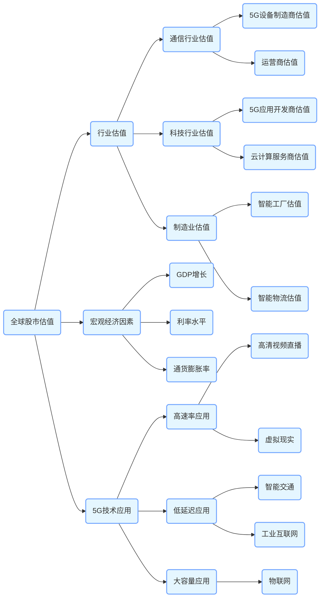

# 全球股市估值与5G技术应用的关系

> 关键词：全球股市估值、5G技术应用、市场趋势、经济影响、投资策略、行业变革、技术驱动

> 摘要：本文深入探讨了全球股市估值与5G技术应用之间的关系。通过对5G技术原理、发展现状以及股市估值基本概念的介绍，分析了5G技术应用对不同行业的影响以及如何反映在股市估值中。结合具体的数学模型和实际案例，阐述了两者之间的内在联系。同时，给出了在5G技术背景下的投资策略建议和相关工具资源推荐，最后对未来的发展趋势和挑战进行了总结。

## 1. 背景介绍 

### 1.1 目的和范围
本研究旨在全面分析全球股市估值与5G技术应用之间的关系。随着5G技术的快速发展和广泛应用，其对各个行业产生了深远的影响，进而影响到全球股市的估值。我们将探讨5G技术应用如何改变企业的盈利预期、市场竞争格局，以及这些变化如何在股市中得到体现。研究范围涵盖全球主要股市和与5G技术相关的多个行业，包括通信、科技、制造业等。

### 1.2 预期读者
本文的预期读者包括投资者、金融分析师、科技行业从业者、学术研究人员以及对5G技术和股市投资感兴趣的人士。投资者可以通过本文了解5G技术应用对股市估值的影响，从而制定更合理的投资策略；金融分析师可以从中获取分析思路和方法，为客户提供更准确的投资建议；科技行业从业者可以了解5G技术在商业层面的影响，为企业的发展战略提供参考；学术研究人员可以在此基础上进行更深入的理论研究；而普通读者可以通过本文了解5G技术和股市之间的联系，增加对金融和科技领域的认识。

### 1.3 文档结构概述
本文将按照以下结构进行阐述：首先介绍核心概念，包括全球股市估值和5G技术应用的基本原理和相互联系；接着讲解核心算法原理和具体操作步骤，通过Python代码进行详细说明；然后给出相关的数学模型和公式，并进行详细讲解和举例；再通过实际项目案例，展示代码实现和分析；之后探讨5G技术应用的实际场景以及对股市估值的影响；接着推荐相关的工具和资源；最后总结未来发展趋势与挑战，并提供常见问题解答和扩展阅读资料。

### 1.4 术语表

#### 1.4.1 核心术语定义
- **全球股市估值**：指对全球范围内各个股票市场中上市公司的价值进行评估的过程和结果。通常通过各种估值方法，如市盈率（P/E）、市净率（P/B）等，来衡量股票的相对价值。
- **5G技术应用**：指第五代移动通信技术在各个领域的实际应用，包括但不限于智能交通、工业互联网、物联网、虚拟现实等。

#### 1.4.2 相关概念解释
- **市盈率（P/E）**：是指股票价格除以每股收益（EPS）的比率，反映了投资者为获得每一元利润所愿意支付的价格。
- **市净率（P/B）**：是指股票价格与每股净资产的比率，用于衡量股票的市场价值与账面价值之间的关系。
- **物联网（IoT）**：通过各种信息传感器、射频识别技术、全球定位系统等技术和装置，实时采集任何需要监控、连接、互动的物体或过程的信息，通过各类可能的网络接入，实现物与物、物与人的泛在连接，实现对物品和过程的智能化感知、识别和管理。

#### 1.4.3 缩略词列表
- **P/E**：Price-to-Earnings Ratio，市盈率
- **P/B**：Price-to-Book Ratio，市净率
- **IoT**：Internet of Things，物联网

## 2. 核心概念与联系 

### 2.1 全球股市估值的基本原理
全球股市估值是一个复杂的过程，涉及到对上市公司的财务状况、行业前景、宏观经济环境等多个因素的综合评估。常见的估值方法包括绝对估值法和相对估值法。

绝对估值法是通过对上市公司未来现金流的折现来计算其内在价值，常用的模型有现金流折现模型（DCF）。该模型的基本公式为：

$$V = \sum_{t=1}^{n} \frac{CF_t}{(1 + r)^t}$$

其中，$V$ 表示公司的内在价值，$CF_t$ 表示第 $t$ 期的现金流，$r$ 表示折现率，$n$ 表示预测期数。

相对估值法是通过比较同行业其他公司的估值指标来评估目标公司的价值，常用的指标有市盈率（P/E）、市净率（P/B）等。

### 2.2 5G技术应用的原理和特点
5G技术是第五代移动通信技术，具有高速率、低延迟、大容量等特点。其核心技术包括毫米波通信、大规模MIMO（多输入多输出）、网络切片等。

毫米波通信是指使用毫米波频段进行通信，毫米波频段具有丰富的频谱资源，可以提供更高的传输速率。大规模MIMO技术通过增加天线数量，提高了通信系统的容量和可靠性。网络切片技术可以将一个物理网络划分为多个虚拟网络，满足不同应用场景的需求。

### 2.3 5G技术应用与全球股市估值的联系
5G技术应用对全球股市估值产生了多方面的影响。首先，5G技术的应用推动了相关行业的发展，如通信设备制造、软件开发等，这些行业的企业盈利预期增加，从而导致其股市估值上升。其次，5G技术的普及促进了产业升级和转型，一些传统行业通过与5G技术的融合，提高了生产效率和竞争力，也会对其股市估值产生积极影响。此外，5G技术的发展还带动了新兴产业的兴起，如物联网、智能交通等，这些新兴产业的发展前景广阔，吸引了大量投资者的关注，从而影响了股市的整体估值。

### 2.4 文本示意图和Mermaid流程图
#### 文本示意图
```plaintext
全球股市估值
|
|-- 行业估值
|   |-- 通信行业估值
|   |   |-- 5G设备制造商估值
|   |   |-- 运营商估值
|   |-- 科技行业估值
|   |   |-- 5G应用开发商估值
|   |   |-- 云计算服务商估值
|   |-- 制造业估值
|       |-- 智能工厂估值
|       |-- 智能物流估值
|
|-- 宏观经济因素
|   |-- GDP增长
|   |-- 利率水平
|   |-- 通货膨胀率
|
|-- 5G技术应用
|   |-- 高速率应用
|   |   |-- 高清视频直播
|   |   |-- 虚拟现实
|   |-- 低延迟应用
|   |   |-- 智能交通
|   |   |-- 工业互联网
|   |-- 大容量应用
|       |-- 物联网
```

#### Mermaid流程图


## 3. 核心算法原理 & 具体操作步骤 

### 3.1 基于市盈率的股市估值算法
市盈率（P/E）是一种常用的相对估值方法，其基本原理是通过比较目标公司的市盈率与同行业其他公司的市盈率来评估其价值。具体步骤如下：

1. 收集同行业其他公司的市盈率数据。
2. 计算同行业的平均市盈率。
3. 获取目标公司的每股收益（EPS）。
4. 用同行业平均市盈率乘以目标公司的每股收益，得到目标公司的估值。

以下是使用Python实现的代码示例：

```python
# 同行业其他公司的市盈率数据
pe_ratios = [15, 18, 20, 22, 25]

# 计算同行业平均市盈率
average_pe = sum(pe_ratios) / len(pe_ratios)

# 目标公司的每股收益
eps = 2.5

# 计算目标公司的估值
valuation = average_pe * eps

print(f"目标公司的估值为: {valuation}")
```

### 3.2 5G技术应用对股市估值影响的量化分析算法
为了量化5G技术应用对股市估值的影响，我们可以构建一个回归模型。假设我们有以下变量：

- $Y$：股票价格
- $X_1$：公司的5G技术应用程度
- $X_2$：公司的财务指标（如每股收益、净资产收益率等）
- $X_3$：宏观经济指标（如GDP增长率、利率等）

我们可以建立如下的线性回归模型：

$$Y = \beta_0 + \beta_1X_1 + \beta_2X_2 + \beta_3X_3 + \epsilon$$

其中，$\beta_0$ 是截距项，$\beta_1$、$\beta_2$、$\beta_3$ 是回归系数，$\epsilon$ 是误差项。

以下是使用Python和`scikit-learn`库实现的代码示例：

```python
import numpy as np
from sklearn.linear_model import LinearRegression

# 生成示例数据
np.random.seed(0)
n_samples = 100
x1 = np.random.rand(n_samples)  # 公司的5G技术应用程度
x2 = np.random.rand(n_samples)  # 公司的财务指标
x3 = np.random.rand(n_samples)  # 宏观经济指标
y = 2 * x1 + 3 * x2 + 4 * x3 + np.random.randn(n_samples)  # 股票价格

# 构建特征矩阵
X = np.column_stack((x1, x2, x3))

# 创建线性回归模型
model = LinearRegression()

# 拟合模型
model.fit(X, y)

# 输出回归系数
print(f"截距项: {model.intercept_}")
print(f"回归系数: {model.coef_}")
```

### 3.3 具体操作步骤
#### 数据收集
- 收集全球股市中相关公司的财务数据，包括每股收益、净资产收益率等。
- 收集公司的5G技术应用程度数据，可以通过公司的研发投入、专利数量、应用案例等方面进行评估。
- 收集宏观经济数据，如GDP增长率、利率、通货膨胀率等。

#### 数据预处理
- 对收集到的数据进行清洗，去除缺失值和异常值。
- 对数据进行标准化处理，使不同变量具有相同的尺度。

#### 模型训练
- 根据上述算法，选择合适的模型进行训练。
- 使用训练数据对模型进行拟合，得到回归系数。

#### 模型评估
- 使用测试数据对模型进行评估，计算模型的准确率、均方误差等指标。
- 根据评估结果对模型进行调整和优化。

#### 预测和分析
- 使用训练好的模型对股票价格进行预测。
- 分析5G技术应用程度对股票价格的影响，为投资决策提供参考。

## 4. 数学模型和公式 & 详细讲解 & 举例说明 

### 4.1 现金流折现模型（DCF）
现金流折现模型（DCF）是一种常用的绝对估值方法，其基本思想是将公司未来的现金流折现到当前时刻，从而得到公司的内在价值。

#### 公式
$$V = \sum_{t=1}^{n} \frac{CF_t}{(1 + r)^t}$$

其中，$V$ 表示公司的内在价值，$CF_t$ 表示第 $t$ 期的现金流，$r$ 表示折现率，$n$ 表示预测期数。

#### 详细讲解
- **现金流（$CF_t$）**：指公司在未来第 $t$ 期产生的现金流量。现金流可以分为经营现金流、投资现金流和筹资现金流。在实际应用中，通常使用自由现金流（FCF），即经营现金流减去资本支出。
- **折现率（$r$）**：指将未来现金流折现到当前时刻的利率。折现率反映了投资者对资金时间价值和风险的要求。通常使用加权平均资本成本（WACC）作为折现率。
- **预测期数（$n$）**：指预测公司未来现金流的期限。预测期数的选择需要考虑公司的行业特点、发展阶段等因素。

#### 举例说明
假设一家公司未来三年的自由现金流分别为100万元、120万元和150万元，折现率为10%，预测期数为3年。则该公司的内在价值为：

$$V = \frac{100}{(1 + 0.1)^1} + \frac{120}{(1 + 0.1)^2} + \frac{150}{(1 + 0.1)^3}$$

```python
cf1 = 100
cf2 = 120
cf3 = 150
r = 0.1

v = cf1 / (1 + r) + cf2 / (1 + r) ** 2 + cf3 / (1 + r) ** 3
print(f"公司的内在价值为: {v} 万元")
```

### 4.2 市盈率模型
市盈率模型是一种常用的相对估值方法，其基本思想是通过比较目标公司的市盈率与同行业其他公司的市盈率来评估其价值。

#### 公式
$$V = P/E \times EPS$$

其中，$V$ 表示公司的估值，$P/E$ 表示市盈率，$EPS$ 表示每股收益。

#### 详细讲解
- **市盈率（$P/E$）**：指股票价格除以每股收益的比率。市盈率反映了投资者为获得每一元利润所愿意支付的价格。不同行业的市盈率水平可能存在较大差异。
- **每股收益（$EPS$）**：指公司净利润除以总股本的比率。每股收益反映了公司的盈利能力。

#### 举例说明
假设同行业平均市盈率为20倍，目标公司的每股收益为2元。则该公司的估值为：

$$V = 20 \times 2 = 40$$（元）

### 4.3 5G技术应用对股市估值影响的回归模型
为了量化5G技术应用对股市估值的影响，我们可以构建一个回归模型。

#### 公式
$$Y = \beta_0 + \beta_1X_1 + \beta_2X_2 + \beta_3X_3 + \epsilon$$

其中，$Y$ 表示股票价格，$X_1$ 表示公司的5G技术应用程度，$X_2$ 表示公司的财务指标，$X_3$ 表示宏观经济指标，$\beta_0$ 是截距项，$\beta_1$、$\beta_2$、$\beta_3$ 是回归系数，$\epsilon$ 是误差项。

#### 详细讲解
- **回归系数（$\beta_1$、$\beta_2$、$\beta_3$）**：表示各个自变量对因变量的影响程度。例如，$\beta_1$ 表示公司的5G技术应用程度每增加一个单位，股票价格的变化量。
- **误差项（$\epsilon$）**：表示模型无法解释的随机误差。误差项的存在反映了实际情况的复杂性和不确定性。

#### 举例说明
假设通过回归分析得到以下回归方程：

$$Y = 10 + 2X_1 + 3X_2 + 4X_3 + \epsilon$$

如果一家公司的5G技术应用程度为5，财务指标为3，宏观经济指标为2，则预测该公司的股票价格为：

$$Y = 10 + 2 \times 5 + 3 \times 3 + 4 \times 2$$

```python
x1 = 5
x2 = 3
x3 = 2

y = 10 + 2 * x1 + 3 * x2 + 4 * x3
print(f"预测的股票价格为: {y}")
```

## 5. 项目实战：代码实际案例和详细解释说明 

### 5.1 开发环境搭建
#### 安装Python
首先，需要安装Python编程语言。可以从Python官方网站（https://www.python.org/downloads/）下载适合自己操作系统的Python版本，并按照安装向导进行安装。

#### 安装必要的库
在Python环境中，需要安装一些必要的库，如`pandas`、`numpy`、`scikit-learn`等。可以使用`pip`命令进行安装：

```sh
pip install pandas numpy scikit-learn
```

### 5.2 源代码详细实现和代码解读
#### 数据收集和预处理
```python
import pandas as pd
import numpy as np

# 模拟收集到的数据
data = {
    'stock_price': [100, 110, 120, 130, 140],
    '5g_application': [0.1, 0.2, 0.3, 0.4, 0.5],
    'financial_index': [0.2, 0.3, 0.4, 0.5, 0.6],
    'macro_index': [0.3, 0.4, 0.5, 0.6, 0.7]
}

df = pd.DataFrame(data)

# 数据预处理：标准化处理
from sklearn.preprocessing import StandardScaler

scaler = StandardScaler()
X = df[['5g_application', 'financial_index', 'macro_index']]
y = df['stock_price']

X_scaled = scaler.fit_transform(X)
```

代码解读：
- 首先，我们模拟了一些数据，包括股票价格、5G技术应用程度、公司财务指标和宏观经济指标。
- 然后，使用`pandas`库将数据转换为DataFrame格式。
- 最后，使用`StandardScaler`对特征数据进行标准化处理，使不同特征具有相同的尺度。

#### 模型训练和评估
```python
from sklearn.model_selection import train_test_split
from sklearn.linear_model import LinearRegression
from sklearn.metrics import mean_squared_error

# 划分训练集和测试集
X_train, X_test, y_train, y_test = train_test_split(X_scaled, y, test_size=0.2, random_state=42)

# 创建线性回归模型
model = LinearRegression()

# 拟合模型
model.fit(X_train, y_train)

# 预测
y_pred = model.predict(X_test)

# 评估模型
mse = mean_squared_error(y_test, y_pred)
print(f"均方误差: {mse}")
```

代码解读：
- 使用`train_test_split`函数将数据集划分为训练集和测试集，其中测试集占比为20%。
- 创建线性回归模型，并使用训练集数据进行拟合。
- 使用训练好的模型对测试集数据进行预测。
- 使用`mean_squared_error`函数计算预测结果的均方误差，评估模型的性能。

### 5.3 代码解读与分析
#### 数据预处理的重要性
数据预处理是机器学习中非常重要的一步。通过标准化处理，可以使不同特征具有相同的尺度，避免某些特征因为数值范围过大而对模型产生过大的影响。例如，在本案例中，如果不进行标准化处理，`5g_application`、`financial_index`和`macro_index`的数值范围可能不同，会影响模型的训练效果。

#### 模型评估指标的意义
均方误差（MSE）是一种常用的回归模型评估指标，它衡量了预测值与真实值之间的平均误差。均方误差越小，说明模型的预测效果越好。在本案例中，我们可以通过比较不同模型的均方误差来选择最优模型。

#### 模型的局限性
线性回归模型是一种简单的模型，它假设自变量与因变量之间存在线性关系。在实际应用中，股票价格的影响因素可能非常复杂，不一定满足线性关系。因此，线性回归模型可能存在一定的局限性。在后续的研究中，可以考虑使用更复杂的模型，如决策树、神经网络等。

## 6. 实际应用场景 

### 6.1 通信行业
5G技术的应用对通信行业产生了深远的影响。通信设备制造商需要加大研发投入，生产支持5G技术的设备，如基站、终端等。这些设备的需求增加，会带动通信设备制造商的业绩增长，从而提高其股市估值。例如，华为、中兴通讯等通信设备制造商在5G技术的推动下，市场份额不断扩大，股市估值也相应提高。

通信运营商需要建设5G网络，提供5G通信服务。5G网络的建设需要大量的资金投入，但随着5G用户的增加，运营商的收入也会相应增加。同时，5G技术的低延迟、高带宽等特点，为运营商开展新的业务提供了可能，如高清视频直播、物联网等。这些新业务的开展会进一步提高运营商的盈利能力和股市估值。例如，中国移动、中国联通等通信运营商在5G网络建设和业务拓展方面取得了一定的进展，其股市估值也受到了市场的关注。

### 6.2 科技行业
5G技术的应用为科技行业带来了新的发展机遇。软件开发企业可以开发基于5G技术的应用程序，如虚拟现实、增强现实等。这些应用程序具有更好的用户体验，市场需求较大。例如，一些游戏开发企业推出了基于5G技术的虚拟现实游戏，受到了玩家的欢迎，企业的业绩和股市估值也得到了提升。

云计算服务商可以利用5G技术提供更高效的云计算服务。5G技术的高速率和低延迟特点，使得云计算服务可以实现更快速的数据传输和处理。例如，阿里云、腾讯云等云计算服务商在5G技术的支持下，不断提升其服务质量和性能，吸引了更多的客户，股市估值也相应提高。

### 6.3 制造业
5G技术的应用推动了制造业的智能化转型。智能工厂可以通过5G网络实现设备之间的互联互通，提高生产效率和质量。例如，汽车制造企业可以利用5G技术实现生产线的自动化控制和远程监控，减少人工干预，提高生产效率。这些智能工厂的建设和应用，会提高制造业企业的竞争力，从而影响其股市估值。

智能物流可以利用5G技术实现货物的实时跟踪和调度。通过5G网络，物流企业可以实时获取货物的位置、状态等信息，优化物流配送路线，提高物流效率。例如，京东物流、顺丰速运等物流企业在5G技术的应用方面进行了积极的探索，提升了自身的服务水平和市场竞争力，股市估值也得到了提升。

### 6.4 金融行业
5G技术的应用对金融行业也产生了一定的影响。金融机构可以利用5G技术实现更快速的交易和风险评估。例如，证券公司可以利用5G网络实现高频交易，提高交易效率。同时，金融机构可以通过5G技术获取更多的市场信息，进行更准确的风险评估。这些应用会提高金融机构的盈利能力和竞争力，从而影响其股市估值。

此外，5G技术的应用还推动了金融科技的发展。一些金融科技公司利用5G技术开发了创新的金融产品和服务，如移动支付、数字货币等。这些金融科技公司的发展前景广阔，吸引了大量投资者的关注，股市估值也相应提高。

## 7. 工具和资源推荐

### 7.1 学习资源推荐

#### 7.1.1 书籍推荐
- 《5G NR 标准：下一代无线通信技术》：本书详细介绍了5G NR的标准和技术原理，是学习5G技术的经典书籍。
- 《金融市场与金融机构基础》：该书全面介绍了金融市场和金融机构的基本知识，对于理解股市估值和金融行业有很大的帮助。
- 《Python数据分析实战》：通过实际案例介绍了Python在数据分析中的应用，适合想要使用Python进行股市数据分析的读者。

#### 7.1.2 在线课程
- Coursera上的“5G技术基础”课程：由知名高校的教授授课，系统地介绍了5G技术的基本原理和应用。
- edX上的“金融市场分析”课程：讲解了金融市场的分析方法和工具，对于分析股市估值有很大的帮助。
- 慕课网上的“Python数据分析与挖掘实战”课程：通过实际项目介绍了Python在数据分析和挖掘中的应用，适合初学者学习。

#### 7.1.3 技术博客和网站
- 5G技术权威发布（https://www.5g-technologies.com/）：提供了5G技术的最新动态和研究成果。
- 雪球网（https://xueqiu.com/）：是一个财经社区，提供了丰富的股市分析和投资建议。
- 开源中国（https://www.oschina.net/）：是一个开源技术社区，提供了大量的技术文章和开源项目。

### 7.2 开发工具框架推荐

#### 7.2.1 IDE和编辑器
- PyCharm：是一款专门为Python开发设计的集成开发环境（IDE），具有强大的代码编辑、调试和项目管理功能。
- Jupyter Notebook：是一个交互式的开发环境，适合进行数据分析和模型开发。可以在浏览器中编写和运行代码，方便展示和分享。
- Visual Studio Code：是一款轻量级的代码编辑器，支持多种编程语言和插件扩展。可以安装Python相关的插件，实现Python代码的编辑和调试。

#### 7.2.2 调试和性能分析工具
- PDB：是Python自带的调试工具，可以在代码中设置断点，逐步执行代码，查看变量的值和程序的执行流程。
- cProfile：是Python的性能分析工具，可以分析代码的执行时间和函数调用情况，找出代码中的性能瓶颈。
- Py-Spy：是一个用于Python程序的性能分析工具，可以实时监控Python程序的CPU使用率和函数调用情况。

#### 7.2.3 相关框架和库
- Pandas：是一个用于数据处理和分析的Python库，提供了高效的数据结构和数据操作方法。
- NumPy：是一个用于科学计算的Python库，提供了高效的多维数组对象和数学函数。
- Scikit-learn：是一个用于机器学习的Python库，提供了各种机器学习算法和工具，如分类、回归、聚类等。

### 7.3 相关论文著作推荐

#### 7.3.1 经典论文
- “5G: A Tutorial Overview of Standards, Trials, Challenges, Deployment, and Practice”：该论文对5G技术的标准、试验、挑战、部署和实践进行了全面的介绍，是研究5G技术的经典论文。
- “The Equity Risk Premium: A Review of the Literature”：该论文对股市风险溢价进行了综述，对于理解股市估值和投资决策有重要的参考价值。
- “Machine Learning in Finance: From Theory to Practice”：该论文介绍了机器学习在金融领域的应用，包括股市预测、风险评估等方面。

#### 7.3.2 最新研究成果
- 可以关注IEEE、ACM等学术会议和期刊上的最新研究成果，了解5G技术和股市估值领域的最新进展。例如，IEEE Transactions on Wireless Communications、ACM SIGKDD等。
- 一些知名研究机构和高校的研究报告也是获取最新研究成果的重要途径，如麦肯锡、波士顿咨询集团、麻省理工学院等。

#### 7.3.3 应用案例分析
- 可以参考一些金融机构和企业的研究报告和案例分析，了解5G技术在实际应用中的效果和对股市估值的影响。例如，高盛、摩根大通等金融机构的研究报告，以及华为、中兴通讯等企业的案例分析。

## 8. 总结：未来发展趋势与挑战

### 8.1 未来发展趋势
#### 5G技术的持续创新和应用拓展
5G技术将不断进行创新和升级，如6G技术的研究已经开始。同时，5G技术的应用领域将不断拓展，除了现有的通信、科技、制造业等行业，还将在医疗、教育、能源等领域得到广泛应用。这些应用的拓展将进一步推动相关行业的发展，从而影响全球股市的估值。

#### 股市估值方法的多元化和智能化
随着科技的发展和数据的丰富，股市估值方法将越来越多元化和智能化。除了传统的市盈率、市净率等方法，还将出现基于大数据、人工智能等技术的估值方法。这些新的估值方法将更加准确地反映公司的价值，为投资者提供更科学的投资决策依据。

#### 全球股市的互联互通和一体化
随着全球化的发展，全球股市的互联互通和一体化趋势将越来越明显。投资者可以更加方便地投资全球股市，不同国家和地区的股市之间的相关性也将增强。5G技术的应用将进一步促进全球股市的信息流通和交易效率，使全球股市的估值更加趋于合理。

### 8.2 挑战
#### 技术风险
5G技术的发展还面临一些技术风险，如毫米波通信的覆盖范围有限、网络安全等问题。这些技术风险可能会影响5G技术的应用和推广，从而对相关行业的发展和股市估值产生不利影响。

#### 市场风险
全球股市受到宏观经济环境、政策变化等多种因素的影响，存在一定的市场风险。5G技术的应用虽然为相关行业带来了发展机遇，但也可能导致市场竞争加剧，一些企业可能会面临生存压力。投资者需要充分认识到市场风险，合理制定投资策略。

#### 监管风险
随着5G技术的应用和股市的发展，监管部门需要加强对相关领域的监管。监管政策的变化可能会对企业的经营和股市估值产生影响。例如，对于5G技术的知识产权保护、数据隐私等方面的监管政策，可能会影响企业的创新和发展。

## 9. 附录：常见问题与解答

### 9.1 5G技术应用对股市估值的影响是短期还是长期的？
5G技术应用对股市估值的影响既有短期的也有长期的。短期来看，5G技术的发展和应用可能会引发市场的炒作，导致相关股票价格的波动。例如，当5G网络开始建设时，通信设备制造商的股票价格可能会短期内上涨。长期来看，5G技术的应用将推动相关行业的转型升级，提高企业的盈利能力和竞争力，从而对股市估值产生长期的积极影响。例如，随着5G技术在工业互联网、物联网等领域的广泛应用，相关企业的业绩将得到持续提升，股市估值也会相应提高。

### 9.2 如何判断一家公司的5G技术应用程度？
可以从以下几个方面判断一家公司的5G技术应用程度：
- **研发投入**：公司在5G技术研发方面的投入越大，说明其对5G技术的重视程度越高，应用程度可能也越高。
- **专利数量**：拥有较多5G技术相关专利的公司，通常在5G技术领域具有较强的技术实力和应用能力。
- **应用案例**：公司是否有实际的5G技术应用案例，以及这些案例的规模和效果如何。例如，一家制造企业是否已经在工厂中应用了5G技术实现智能化生产。
- **合作情况**：公司是否与其他5G技术相关企业进行合作，如与通信设备制造商、运营商等合作开展5G项目。

### 9.3 股市估值模型是否适用于所有行业？
股市估值模型并不适用于所有行业。不同行业的特点和发展规律不同，适用的估值模型也可能不同。例如，对于传统制造业，市盈率、市净率等相对估值模型可能比较适用；而对于一些新兴行业，如互联网、科技等行业，由于其盈利模式和发展前景与传统行业有较大差异，可能需要使用更适合的估值模型，如现金流折现模型、市销率模型等。此外，一些处于亏损状态的企业，传统的估值模型可能无法准确评估其价值，需要结合企业的发展战略、市场份额等因素进行综合评估。

## 10. 扩展阅读 & 参考资料
### 扩展阅读
- 《5G时代：从连接到智能》：进一步探讨了5G技术在智能时代的应用和发展趋势。
- 《投资中最简单的事》：介绍了一些简单实用的投资方法和理念，对于理解股市投资有很大的帮助。
- 《人工智能：现代方法》：全面介绍了人工智能的基本原理和应用，对于了解基于人工智能的股市估值方法有一定的参考价值。

### 参考资料
- 5G技术相关标准和规范，如3GPP发布的5G NR标准。
- 全球主要股市的历史数据和相关研究报告，如纽约证券交易所、纳斯达克证券交易所等的公开数据。
- 学术期刊和会议上的相关论文，如IEEE Transactions on Wireless Communications、ACM SIGKDD等。