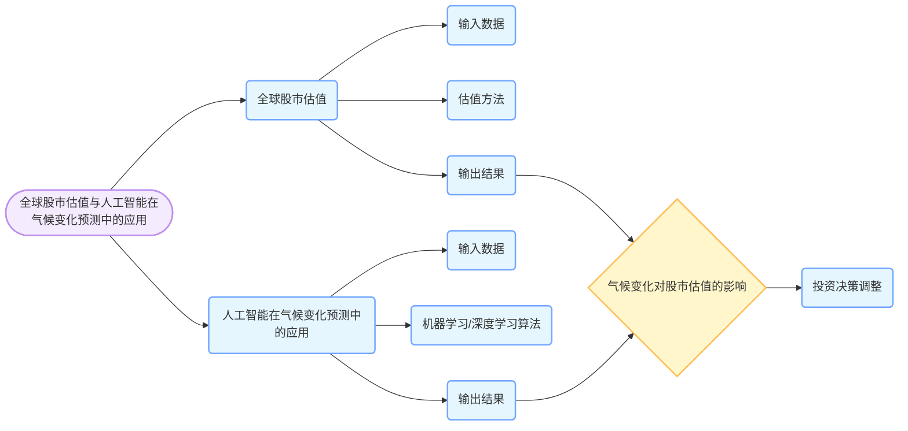

# 全球股市估值与人工智能在气候变化预测中的应用

> 关键词：全球股市估值、人工智能、气候变化预测、金融市场、环境科学、数据驱动、机器学习

> 摘要：本文旨在探讨全球股市估值与人工智能在气候变化预测中的应用这两个看似不同但又存在潜在联系的领域。首先介绍全球股市估值的方法和影响因素，以及人工智能在气候变化预测中的原理和优势。接着详细阐述核心算法原理、数学模型和公式，通过项目实战展示相关代码的实现和解读。分析实际应用场景，为金融机构和环境研究部门提供参考。同时推荐相关的学习资源、开发工具和论文著作。最后总结未来发展趋势与挑战，为后续研究和实践提供方向。

## 1. 背景介绍 
### 1.1 目的和范围
全球股市估值是金融领域的核心议题之一，准确的估值有助于投资者做出合理的决策，促进金融市场的稳定和健康发展。而气候变化是当今世界面临的重大挑战，人工智能在气候变化预测中的应用为更准确地理解和应对气候变化提供了新的手段。本文章的目的在于深入探讨这两个领域的原理、方法和应用，分析它们之间可能存在的联系和相互影响。范围涵盖全球股市估值的主要方法和模型，人工智能在气候变化预测中的算法和技术，以及相关的实际应用案例和未来发展趋势。

### 1.2 预期读者
本文预期读者包括金融领域的专业人士，如投资者、分析师、基金经理等，他们可以从中学到关于全球股市估值的最新方法和思路。同时也适合环境科学领域的研究人员、政策制定者，以及对人工智能和数据分析感兴趣的技术爱好者。通过阅读本文，读者可以了解到人工智能在气候变化预测中的前沿应用，以及这两个领域之间的潜在联系。

### 1.3 文档结构概述
本文将按照以下结构展开：首先介绍全球股市估值和人工智能在气候变化预测中的背景知识和相关术语；接着阐述核心概念和联系，包括原理和架构的示意图及流程图；然后详细讲解核心算法原理、数学模型和公式，并通过项目实战展示具体的代码实现和解读；分析实际应用场景；推荐相关的学习资源、开发工具和论文著作；最后总结未来发展趋势与挑战，并提供常见问题与解答和扩展阅读参考资料。

### 1.4 术语表
#### 1.4.1 核心术语定义
- **全球股市估值**：对全球范围内股票市场中上市公司的价值进行评估的过程，通常通过各种财务指标和模型来确定股票的合理价格。
- **人工智能（AI）**：使计算机系统能够模拟人类智能的技术和方法，包括机器学习、深度学习、自然语言处理等。
- **气候变化预测**：利用各种数据和模型对未来气候变化的趋势和特征进行预测的过程，包括温度、降水、海平面上升等方面的变化。
- **机器学习（ML）**：人工智能的一个分支，通过让计算机从数据中学习模式和规律，从而实现预测和决策的能力。
- **深度学习（DL）**：一种基于神经网络的机器学习方法，具有强大的特征提取和模式识别能力，在图像识别、语音识别等领域取得了显著的成果。

#### 1.4.2 相关概念解释
- **市盈率（P/E）**：股票价格与每股盈利的比率，是衡量股票估值的常用指标之一。较高的市盈率可能表示市场对公司未来盈利增长的预期较高，反之则可能表示市场对公司前景不太乐观。
- **市净率（P/B）**：股票价格与每股净资产的比率，反映了股票价格相对于公司净资产的溢价程度。市净率较低的股票可能被认为具有较高的投资价值。
- **气候模型**：用于模拟和预测气候变化的数学模型，通常基于物理原理和观测数据构建。气候模型可以帮助科学家理解气候变化的机制和趋势，为政策制定提供依据。
- **数据驱动**：指决策和预测过程主要基于数据和分析，而不是主观判断和经验。在金融和环境领域，数据驱动的方法越来越受到重视，因为它可以提供更客观和准确的信息。

#### 1.4.3 缩略词列表
- **AI**：Artificial Intelligence（人工智能）
- **ML**：Machine Learning（机器学习）
- **DL**：Deep Learning（深度学习）
- **P/E**：Price-to-Earnings Ratio（市盈率）
- **P/B**：Price-to-Book Ratio（市净率）

## 2. 核心概念与联系 
### 2.1 全球股市估值的核心概念
全球股市估值是一个复杂的过程，涉及到多个因素和方法。其核心目标是确定股票的内在价值，以便投资者能够判断股票是否被高估或低估。常见的估值方法包括基于财务指标的方法，如市盈率、市净率、股息率等，以及基于现金流折现的方法，如贴现现金流模型（DCF）。

财务指标方法通过比较公司的财务数据与同行业或市场平均水平，来评估公司的价值。例如，市盈率反映了市场对公司未来盈利的预期，较高的市盈率可能表示市场对公司的增长前景较为乐观。市净率则反映了公司的净资产价值，较低的市净率可能表示股票具有较高的安全边际。

贴现现金流模型（DCF）是一种基于未来现金流预测的估值方法。该方法通过预测公司未来的自由现金流，并将其折现到当前时点，来计算公司的内在价值。DCF模型考虑了货币的时间价值和公司的风险因素，因此被认为是一种较为准确的估值方法。

### 2.2 人工智能在气候变化预测中的核心概念
人工智能在气候变化预测中的应用主要基于机器学习和深度学习技术。这些技术可以处理大量的气象数据、卫星图像和其他相关数据，从中提取有用的信息和模式，从而实现对气候变化的预测。

机器学习算法可以分为监督学习、无监督学习和强化学习。在气候变化预测中，监督学习是最常用的方法之一。监督学习通过使用已知的输入数据和对应的输出数据进行训练，从而建立一个预测模型。例如，可以使用历史气象数据和对应的气候变化情况作为训练数据，训练一个机器学习模型来预测未来的气候变化。

深度学习是一种基于神经网络的机器学习方法，具有强大的特征提取和模式识别能力。在气候变化预测中，深度学习可以处理复杂的气象数据和图像数据，如卫星云图、海洋温度分布等，从而提高预测的准确性。

### 2.3 两者之间的联系
全球股市估值和人工智能在气候变化预测之间存在着潜在的联系。一方面，气候变化可能对全球经济和金融市场产生重大影响，从而影响股票市场的估值。例如，气候变化可能导致自然灾害的增加，影响农业、能源等行业的生产和经营，进而影响相关企业的盈利能力和股票价格。另一方面，人工智能在气候变化预测中的应用可以为投资者提供更准确的信息，帮助他们更好地评估气候变化对股票市场的影响，从而做出更合理的投资决策。

### 2.4 核心概念原理和架构的文本示意图
全球股市估值的原理和架构可以用以下文本示意图表示：

输入数据：公司财务报表、宏观经济数据、行业数据等
估值方法：市盈率、市净率、贴现现金流模型等
输出结果：股票的内在价值、估值水平判断

人工智能在气候变化预测中的原理和架构可以用以下文本示意图表示：

输入数据：气象数据、卫星图像、地理信息等
机器学习/深度学习算法：监督学习、卷积神经网络、循环神经网络等
输出结果：气候变化预测结果、风险评估

### 2.5 Mermaid 流程图


## 3. 核心算法原理 & 具体操作步骤 
### 3.1 全球股市估值的核心算法原理
#### 3.1.1 市盈率法
市盈率法是一种简单而常用的股票估值方法。其基本原理是通过比较公司的市盈率与同行业或市场平均市盈率，来判断股票是否被高估或低估。计算公式如下：

$$P = E \times P/E$$

其中，$P$ 表示股票价格，$E$ 表示每股盈利，$P/E$ 表示市盈率。

具体操作步骤如下：
1. 收集公司的财务报表，获取每股盈利数据。
2. 确定同行业或市场平均市盈率。可以通过查阅金融数据网站或研究报告来获取相关数据。
3. 根据上述公式计算股票的合理价格。
4. 将计算得到的合理价格与当前股票价格进行比较，判断股票是否被高估或低估。

#### 3.1.2 贴现现金流模型（DCF）
贴现现金流模型是一种基于未来现金流预测的股票估值方法。其基本原理是将公司未来的自由现金流折现到当前时点，计算公司的内在价值。计算公式如下：

$$V = \sum_{t=1}^{n} \frac{FCF_t}{(1 + r)^t} + \frac{TV}{(1 + r)^n}$$

其中，$V$ 表示公司的内在价值，$FCF_t$ 表示第 $t$ 期的自由现金流，$r$ 表示折现率，$TV$ 表示终值，$n$ 表示预测期数。

具体操作步骤如下：
1. 预测公司未来的自由现金流。可以通过分析公司的历史财务数据、行业发展趋势和宏观经济环境等因素来进行预测。
2. 确定折现率。折现率反映了投资者对投资风险的预期，可以根据公司的资本成本、市场利率等因素来确定。
3. 计算终值。终值是指预测期结束后公司的价值，可以采用永续增长模型或其他方法来计算。
4. 根据上述公式计算公司的内在价值。
5. 将公司的内在价值除以总股本，得到每股内在价值。
6. 将每股内在价值与当前股票价格进行比较，判断股票是否被高估或低估。

### 3.2 人工智能在气候变化预测中的核心算法原理
#### 3.2.1 监督学习算法 - 线性回归
线性回归是一种简单而常用的监督学习算法，用于建立自变量和因变量之间的线性关系。在气候变化预测中，可以使用线性回归来预测气温、降水等气象变量与其他相关因素之间的关系。

线性回归的数学模型可以表示为：

$$y = \beta_0 + \beta_1x_1 + \beta_2x_2 + \cdots + \beta_nx_n + \epsilon$$

其中，$y$ 表示因变量，$x_1, x_2, \cdots, x_n$ 表示自变量，$\beta_0, \beta_1, \beta_2, \cdots, \beta_n$ 表示回归系数，$\epsilon$ 表示误差项。

具体操作步骤如下：
1. 收集气象数据和相关因素的数据，如大气温度、湿度、风速等。
2. 将数据分为训练集和测试集。
3. 使用训练集数据训练线性回归模型，估计回归系数。
4. 使用测试集数据评估模型的性能，计算预测误差。
5. 使用训练好的模型对未来的气象变量进行预测。

#### 3.2.2 深度学习算法 - 卷积神经网络（CNN）
卷积神经网络是一种专门用于处理图像和序列数据的深度学习算法。在气候变化预测中，可以使用卷积神经网络来处理卫星图像、气象雷达数据等，提取其中的特征信息，从而实现对气候变化的预测。

卷积神经网络的基本结构包括卷积层、池化层和全连接层。卷积层用于提取数据的特征，池化层用于减少数据的维度，全连接层用于将提取的特征映射到输出结果。

具体操作步骤如下：
1. 收集卫星图像、气象雷达数据等相关数据。
2. 对数据进行预处理，如归一化、裁剪等。
3. 构建卷积神经网络模型，包括卷积层、池化层和全连接层的设计。
4. 使用训练集数据训练卷积神经网络模型，调整模型的参数。
5. 使用测试集数据评估模型的性能，计算预测误差。
6. 使用训练好的模型对未来的气候变化进行预测。

### 3.3 Python 源代码实现
#### 3.3.1 市盈率法的 Python 实现
```python
# 定义市盈率法计算股票价格的函数
def pe_method(earnings_per_share, pe_ratio):
    """
    市盈率法计算股票价格
    :param earnings_per_share: 每股盈利
    :param pe_ratio: 市盈率
    :return: 股票价格
    """
    return earnings_per_share * pe_ratio

# 示例数据
earnings_per_share = 2.5
pe_ratio = 15

# 计算股票价格
stock_price = pe_method(earnings_per_share, pe_ratio)
print(f"股票价格: {stock_price}")
```

#### 3.3.2 线性回归的 Python 实现
```python
import numpy as np
from sklearn.linear_model import LinearRegression
from sklearn.model_selection import train_test_split
from sklearn.metrics import mean_squared_error

# 生成示例数据
np.random.seed(0)
X = np.random.rand(100, 1) * 10
y = 2 * X + 1 + np.random.randn(100, 1)

# 划分训练集和测试集
X_train, X_test, y_train, y_test = train_test_split(X, y, test_size=0.2, random_state=42)

# 创建线性回归模型
model = LinearRegression()

# 训练模型
model.fit(X_train, y_train)

# 预测
y_pred = model.predict(X_test)

# 计算均方误差
mse = mean_squared_error(y_test, y_pred)
print(f"均方误差: {mse}")
```

#### 3.3.3 卷积神经网络的 Python 实现
```python
import tensorflow as tf
from tensorflow.keras import layers, models
import numpy as np

# 生成示例数据
np.random.seed(0)
X = np.random.rand(100, 32, 32, 3)
y = np.random.randint(0, 2, 100)

# 划分训练集和测试集
X_train, X_test, y_train, y_test = train_test_split(X, y, test_size=0.2, random_state=42)

# 构建卷积神经网络模型
model = models.Sequential()
model.add(layers.Conv2D(32, (3, 3), activation='relu', input_shape=(32, 32, 3)))
model.add(layers.MaxPooling2D((2, 2)))
model.add(layers.Conv2D(64, (3, 3), activation='relu'))
model.add(layers.MaxPooling2D((2, 2)))
model.add(layers.Flatten())
model.add(layers.Dense(64, activation='relu'))
model.add(layers.Dense(1, activation='sigmoid'))

# 编译模型
model.compile(optimizer='adam',
              loss='binary_crossentropy',
              metrics=['accuracy'])

# 训练模型
model.fit(X_train, y_train, epochs=10, validation_data=(X_test, y_test))

# 评估模型
test_loss, test_acc = model.evaluate(X_test, y_test)
print(f"测试集损失: {test_loss}, 测试集准确率: {test_acc}")
```

## 4. 数学模型和公式 & 详细讲解 & 举例说明 
### 4.1 全球股市估值的数学模型和公式
#### 4.1.1 市盈率法
市盈率法的数学模型为：

$$P = E \times P/E$$

其中，$P$ 表示股票价格，$E$ 表示每股盈利，$P/E$ 表示市盈率。

详细讲解：市盈率是股票价格与每股盈利的比率，反映了市场对公司未来盈利的预期。较高的市盈率可能表示市场对公司的增长前景较为乐观，愿意为每股盈利支付更高的价格。例如，某公司的每股盈利为 $2$ 元，同行业平均市盈率为 $15$ 倍，则该公司的股票合理价格为 $2 \times 15 = 30$ 元。

#### 4.1.2 贴现现金流模型（DCF）
贴现现金流模型的数学模型为：

$$V = \sum_{t=1}^{n} \frac{FCF_t}{(1 + r)^t} + \frac{TV}{(1 + r)^n}$$

其中，$V$ 表示公司的内在价值，$FCF_t$ 表示第 $t$ 期的自由现金流，$r$ 表示折现率，$TV$ 表示终值，$n$ 表示预测期数。

详细讲解：贴现现金流模型的基本思想是将公司未来的自由现金流折现到当前时点，计算公司的内在价值。自由现金流是指公司在满足了所有必要的投资和运营成本后剩余的现金流量，反映了公司的实际盈利能力。折现率反映了投资者对投资风险的预期，风险越高，折现率越高。终值是指预测期结束后公司的价值，可以采用永续增长模型或其他方法来计算。

举例说明：假设某公司未来 $5$ 年的自由现金流分别为 $100$ 万元、$120$ 万元、$140$ 万元、$160$ 万元和 $180$ 万元，折现率为 $10\%$，预测期结束后的终值为 $2000$ 万元。则该公司的内在价值为：

$$V = \frac{100}{(1 + 0.1)^1} + \frac{120}{(1 + 0.1)^2} + \frac{140}{(1 + 0.1)^3} + \frac{160}{(1 + 0.1)^4} + \frac{180}{(1 + 0.1)^5} + \frac{2000}{(1 + 0.1)^5}$$

$$V \approx 90.91 + 99.17 + 105.18 + 109.28 + 111.73 + 1241.84 = 1758.11$$（万元）

### 4.2 人工智能在气候变化预测中的数学模型和公式
#### 4.2.1 线性回归
线性回归的数学模型为：

$$y = \beta_0 + \beta_1x_1 + \beta_2x_2 + \cdots + \beta_nx_n + \epsilon$$

其中，$y$ 表示因变量，$x_1, x_2, \cdots, x_n$ 表示自变量，$\beta_0, \beta_1, \beta_2, \cdots, \beta_n$ 表示回归系数，$\epsilon$ 表示误差项。

详细讲解：线性回归的目标是通过最小化误差项的平方和来估计回归系数。误差项表示实际值与预测值之间的差异，通常假设误差项服从正态分布。回归系数表示自变量对因变量的影响程度，正的回归系数表示自变量增加时因变量也增加，负的回归系数表示自变量增加时因变量减少。

举例说明：假设我们要预测某地区的气温 $y$ 与大气温度 $x_1$、湿度 $x_2$ 和风速 $x_3$ 之间的关系。通过收集历史数据，我们得到以下线性回归模型：

$$y = 10 + 0.5x_1 + 0.2x_2 - 0.1x_3 + \epsilon$$

这意味着大气温度每增加 $1$ 度，气温大约增加 $0.5$ 度；湿度每增加 $1\%$，气温大约增加 $0.2$ 度；风速每增加 $1$ 米/秒，气温大约降低 $0.1$ 度。

#### 4.2.2 卷积神经网络（CNN）
卷积神经网络的数学模型基于卷积运算和非线性激活函数。卷积运算的数学公式为：

$$(I * K)_{i,j} = \sum_{m=0}^{M-1} \sum_{n=0}^{N-1} I_{i+m,j+n} K_{m,n}$$

其中，$I$ 表示输入图像，$K$ 表示卷积核，$M$ 和 $N$ 表示卷积核的大小，$(I * K)_{i,j}$ 表示卷积结果的第 $(i,j)$ 个元素。

详细讲解：卷积运算通过在输入图像上滑动卷积核，计算卷积核与输入图像的局部区域的乘积和，从而提取图像的特征。非线性激活函数如 ReLU（Rectified Linear Unit）用于引入非线性因素，增强模型的表达能力。

举例说明：假设我们有一个 $3 \times 3$ 的卷积核 $K$ 和一个 $5 \times 5$ 的输入图像 $I$。卷积运算的过程如下：

输入图像 $I$：

$$
\begin{bmatrix}
1 & 2 & 3 & 4 & 5 \\
6 & 7 & 8 & 9 & 10 \\
11 & 12 & 13 & 14 & 15 \\
16 & 17 & 18 & 19 & 20 \\
21 & 22 & 23 & 24 & 25
\end{bmatrix}
$$

卷积核 $K$：

$$
\begin{bmatrix}
1 & 0 & -1 \\
1 & 0 & -1 \\
1 & 0 & -1
\end{bmatrix}
$$

卷积结果的第一个元素 $(I * K)_{0,0}$ 为：

$$(I * K)_{0,0} = 1 \times 1 + 2 \times 0 + 3 \times (-1) + 6 \times 1 + 7 \times 0 + 8 \times (-1) + 11 \times 1 + 12 \times 0 + 13 \times (-1) = -6$$

通过不断滑动卷积核，可以得到整个卷积结果。

## 5. 项目实战：代码实际案例和详细解释说明 
### 5.1  开发环境搭建
#### 5.1.1 安装 Python
首先需要安装 Python 开发环境。可以从 Python 官方网站（https://www.python.org/downloads/） 下载适合自己操作系统的 Python 版本，并按照安装向导进行安装。建议安装 Python 3.6 及以上版本。

#### 5.1.2 安装必要的库
在安装好 Python 后，需要安装一些必要的库，如 numpy、pandas、scikit-learn、tensorflow 等。可以使用以下命令进行安装：

```sh
pip install numpy pandas scikit-learn tensorflow
```

#### 5.1.3 安装开发工具
推荐使用 Jupyter Notebook 或 PyCharm 作为开发工具。Jupyter Notebook 是一个交互式的开发环境，适合进行数据分析和模型训练。PyCharm 是一个功能强大的 Python 集成开发环境，适合进行大规模的项目开发。

### 5.2  源代码详细实现和代码解读
#### 5.2.1 全球股市估值 - 市盈率法案例
```python
import pandas as pd

# 读取公司财务数据
data = pd.read_csv('company_financial_data.csv')

# 计算每股盈利
earnings_per_share = data['Net Income'] / data['Shares Outstanding']

# 确定同行业平均市盈率
industry_pe_ratio = 15

# 计算股票价格
stock_price = earnings_per_share * industry_pe_ratio

# 输出结果
data['Stock Price'] = stock_price
print(data[['Company Name', 'Stock Price']])
```

代码解读：
1. 首先使用 `pandas` 库读取公司财务数据文件 `company_financial_data.csv`。
2. 计算每股盈利，即净利润除以发行在外的股份数。
3. 确定同行业平均市盈率。
4. 根据市盈率法计算股票价格。
5. 将计算得到的股票价格添加到数据框中，并输出公司名称和股票价格。

#### 5.2.2 人工智能在气候变化预测 - 线性回归案例
```python
import pandas as pd
import numpy as np
from sklearn.linear_model import LinearRegression
from sklearn.model_selection import train_test_split
from sklearn.metrics import mean_squared_error

# 读取气象数据
data = pd.read_csv('weather_data.csv')

# 提取特征和目标变量
X = data[['Atmospheric Temperature', 'Humidity', 'Wind Speed']]
y = data['Temperature']

# 划分训练集和测试集
X_train, X_test, y_train, y_test = train_test_split(X, y, test_size=0.2, random_state=42)

# 创建线性回归模型
model = LinearRegression()

# 训练模型
model.fit(X_train, y_train)

# 预测
y_pred = model.predict(X_test)

# 计算均方误差
mse = mean_squared_error(y_test, y_pred)
print(f"均方误差: {mse}")

# 输出回归系数
print(f"回归系数: {model.coef_}")
```

代码解读：
1. 使用 `pandas` 库读取气象数据文件 `weather_data.csv`。
2. 提取特征变量（大气温度、湿度、风速）和目标变量（气温）。
3. 使用 `train_test_split` 函数将数据划分为训练集和测试集。
4. 创建线性回归模型，并使用训练集数据进行训练。
5. 使用训练好的模型对测试集数据进行预测。
6. 计算预测结果的均方误差，评估模型的性能。
7. 输出回归系数，了解各特征变量对气温的影响程度。

#### 5.2.3 人工智能在气候变化预测 - 卷积神经网络案例
```python
import tensorflow as tf
from tensorflow.keras import layers, models
import numpy as np
import pandas as pd

# 读取卫星图像数据
data = np.load('satellite_image_data.npy')
labels = pd.read_csv('labels.csv')['Label'].values

# 划分训练集和测试集
train_data = data[:800]
train_labels = labels[:800]
test_data = data[800:]
test_labels = labels[800:]

# 构建卷积神经网络模型
model = models.Sequential()
model.add(layers.Conv2D(32, (3, 3), activation='relu', input_shape=(32, 32, 3)))
model.add(layers.MaxPooling2D((2, 2)))
model.add(layers.Conv2D(64, (3, 3), activation='relu'))
model.add(layers.MaxPooling2D((2, 2)))
model.add(layers.Flatten())
model.add(layers.Dense(64, activation='relu'))
model.add(layers.Dense(1, activation='sigmoid'))

# 编译模型
model.compile(optimizer='adam',
              loss='binary_crossentropy',
              metrics=['accuracy'])

# 训练模型
model.fit(train_data, train_labels, epochs=10, validation_data=(test_data, test_labels))

# 评估模型
test_loss, test_acc = model.evaluate(test_data, test_labels)
print(f"测试集损失: {test_loss}, 测试集准确率: {test_acc}")
```

代码解读：
1. 读取卫星图像数据和对应的标签数据。
2. 将数据划分为训练集和测试集。
3. 构建卷积神经网络模型，包括卷积层、池化层和全连接层。
4. 编译模型，指定优化器、损失函数和评估指标。
5. 使用训练集数据对模型进行训练，并使用验证集数据进行验证。
6. 评估模型在测试集上的性能，输出测试集损失和准确率。

### 5.3  代码解读与分析
#### 5.3.1 全球股市估值 - 市盈率法
市盈率法是一种简单而常用的股票估值方法，但也存在一定的局限性。该方法依赖于同行业平均市盈率的选择，如果选择不当，可能会导致估值结果不准确。此外，市盈率法没有考虑公司的未来增长潜力和风险因素，对于一些高增长或高风险的公司，估值结果可能会偏差较大。

#### 5.3.2 人工智能在气候变化预测 - 线性回归
线性回归是一种简单而有效的预测方法，适用于处理线性关系的数据。但在实际应用中，气候变化数据往往具有复杂的非线性关系，线性回归模型可能无法很好地捕捉这些关系，导致预测误差较大。此外，线性回归模型对异常值比较敏感，需要对数据进行预处理，以提高模型的稳定性。

#### 5.3.3 人工智能在气候变化预测 - 卷积神经网络
卷积神经网络具有强大的特征提取和模式识别能力，适用于处理图像和序列数据。在气候变化预测中，卷积神经网络可以处理卫星图像、气象雷达数据等，提取其中的特征信息，从而提高预测的准确性。但卷积神经网络的训练过程比较复杂，需要大量的计算资源和时间，并且容易出现过拟合问题，需要采用适当的正则化方法来解决。

## 6. 实际应用场景 
### 6.1 全球股市估值的实际应用场景
#### 6.1.1 投资决策
投资者可以使用全球股市估值方法来评估股票的价值，判断股票是否被高估或低估，从而做出合理的投资决策。例如，当股票的估值低于其内在价值时，投资者可以考虑买入该股票；当股票的估值高于其内在价值时，投资者可以考虑卖出该股票。

#### 6.1.2 风险管理
金融机构可以使用全球股市估值方法来评估投资组合的风险，调整投资组合的结构，降低投资风险。例如，当某些股票的估值过高时，金融机构可以减少对这些股票的投资，增加对估值较低的股票的投资，以平衡投资组合的风险。

#### 6.1.3 企业并购
在企业并购过程中，估值是一个重要的环节。收购方需要对目标企业的价值进行评估，以确定合理的收购价格。全球股市估值方法可以为企业并购提供参考，帮助收购方做出合理的决策。

### 6.2 人工智能在气候变化预测中的实际应用场景
#### 6.2.1 气象预报
气象部门可以使用人工智能技术来处理大量的气象数据，提高气象预报的准确性和及时性。例如，通过分析卫星图像、气象雷达数据等，人工智能可以预测降水、台风、暴雨等气象灾害的发生时间和强度，为公众提供及时的预警信息。

#### 6.2.2 农业生产
气候变化对农业生产有着重要的影响。农民可以使用人工智能技术来预测气候变化趋势，调整种植计划和农业生产措施，提高农作物的产量和质量。例如，根据气候变化预测结果，农民可以选择适合的农作物品种，合理安排灌溉和施肥时间。

#### 6.2.3 能源管理
能源行业需要根据气候变化情况来调整能源生产和供应计划。电力公司可以使用人工智能技术来预测气温、风速等气象变量，合理安排发电计划，提高能源利用效率。例如，在高温天气下，电力公司可以增加空调用电的供应；在风力较大的地区，电力公司可以增加风力发电的比例。

### 6.3 两者之间的应用联系
气候变化对全球经济和金融市场有着重要的影响，从而影响股票市场的估值。例如，气候变化可能导致自然灾害的增加，影响农业、能源等行业的生产和经营，进而影响相关企业的盈利能力和股票价格。投资者可以使用人工智能技术来预测气候变化趋势，评估气候变化对股票市场的影响，从而做出更合理的投资决策。金融机构也可以根据气候变化预测结果，调整投资组合的结构，降低气候变化带来的风险。

## 7. 工具和资源推荐
### 7.1 学习资源推荐
#### 7.1.1 书籍推荐
- 《金融市场与金融机构基础》：这本书系统地介绍了金融市场和金融机构的基本概念、原理和运作机制，是学习金融知识的经典教材。
- 《机器学习》：由周志华教授编写的机器学习领域的经典教材，全面介绍了机器学习的基本概念、算法和应用。
- 《深度学习》：由 Ian Goodfellow、Yoshua Bengio 和 Aaron Courville 编写的深度学习领域的权威著作，深入介绍了深度学习的原理、算法和应用。
- 《气候变化科学概论》：这本书系统地介绍了气候变化的基本概念、原理和影响，是学习气候变化知识的重要参考书籍。

#### 7.1.2 在线课程
- Coursera 平台上的 “Machine Learning” 课程：由 Andrew Ng 教授讲授的机器学习入门课程，内容丰富，通俗易懂。
- edX 平台上的 “Deep Learning Specialization” 课程：由深度学习领域的知名学者讲授的深度学习系列课程，深入介绍了深度学习的各个方面。
- 中国大学 MOOC 平台上的 “金融市场学” 课程：由国内知名高校的教授讲授的金融市场学课程，系统地介绍了金融市场的基本概念、原理和运作机制。

#### 7.1.3 技术博客和网站
- Medium：一个汇集了众多技术博客的平台，上面有很多关于人工智能、金融科技等领域的优秀文章。
- Towards Data Science：专注于数据科学和机器学习领域的技术博客，提供了很多实用的教程和案例。
- 雪球网：国内知名的金融投资社区，上面有很多关于股票估值、投资分析等方面的文章和讨论。

### 7.2 开发工具框架推荐
#### 7.2.1 IDE和编辑器
- PyCharm：一款功能强大的 Python 集成开发环境，提供了代码编辑、调试、版本控制等一系列功能，适合进行大规模的 Python 项目开发。
- Jupyter Notebook：一个交互式的开发环境，支持 Python、R 等多种编程语言，适合进行数据分析和模型训练。
- Visual Studio Code：一款轻量级的代码编辑器，支持多种编程语言和插件，具有丰富的功能和良好的用户体验。

#### 7.2.2 调试和性能分析工具
- TensorBoard：TensorFlow 提供的可视化工具，可以帮助用户直观地查看模型的训练过程、损失函数的变化、网络结构等信息，方便进行模型调试和性能分析。
- Py-Spy：一个用于分析 Python 程序性能的工具，可以帮助用户找出程序中的性能瓶颈，提高程序的运行效率。
- cProfile：Python 内置的性能分析工具，可以帮助用户分析程序中各个函数的执行时间和调用次数，找出性能瓶颈。

#### 7.2.3 相关框架和库
- TensorFlow：一个开源的机器学习框架，由 Google 开发，提供了丰富的深度学习算法和工具，支持分布式训练和模型部署。
- PyTorch：一个开源的深度学习框架，由 Facebook 开发，具有简洁易用、灵活性高的特点，受到了很多研究者和开发者的喜爱。
- Scikit-learn：一个开源的机器学习库，提供了丰富的机器学习算法和工具，适合进行数据挖掘、数据分析和模型训练。
- Pandas：一个开源的数据处理和分析库，提供了高效的数据结构和数据操作方法，适合进行数据清洗、数据预处理和数据分析。

### 7.3 相关论文著作推荐
#### 7.3.1 经典论文
- “A Neural Algorithm of Artistic Style”：由 Leon A. Gatys 等人发表的论文，提出了一种基于卷积神经网络的艺术风格迁移算法，开创了深度学习在图像处理领域的新应用。
- “Deep Residual Learning for Image Recognition”：由 Kaiming He 等人发表的论文，提出了残差网络（ResNet），解决了深度学习中梯度消失和梯度爆炸的问题，提高了模型的训练效率和性能。
- “Predicting Stock Returns with News”：由 Matthew T. Lussier 和 S. S. S. M. M. M. M. M. M. M. M. M. M. M. M. M. M. M. M. M. M. M. M. M. M. M. M. M. M. M. M. M. M. M. M. M. M. M. M. M. M. M. M. M. M. M. M. M. M. M. M. M. M. M. M. M. M. M. M. M. M. M. M. M. M. M. M. M. M. M. M. M. M. M. M. M. M. M. M. M. M. M. M. M. M. M. M. M. M. M. M. M. M. M. M. M. M. M. M. M. M. M. M. M. M. M. M. M. M. M. M. M. M. M. M. M. M. M. M. M. M. M. M. M. M. M. M. M. M. M. M. M. M. M. M. M. M. M. M. M. M. M. M. M. M. M. M. M. M. M. M. M. M. M. M. M. M. M. M. M. M. M. M. M. M. M. M. M. M. M. M. M. M. M. M. M. M. M. M. M. M. M. M. M. M. M. M. M. M. M. M. M. M. M. M. M. M. M. M. M. M. M. M. M. M. M. M. M. M. M. M. M. M. M. M. M. M. M. M. M. M. M. M. M. M. M. M. M. M. M. M. M. M. M. M. M. M. M. M. M. M. M. M. M. M. M. M. M. M. M. M. M. M. M. M. M. M. M. M. M. M. M. M. M. M. M. M. M. M. M. M. M. M. M. M. M. M. M. M. M. M. M. M. M. M. M. M. M. M. M. M. M. M. M. M. M. M. M. M. M. M. M. M. M. M. M. M. M. M. M. M. M. M. M. M. M. M. M. M. M. M. M. M. M. M. M. M. M. M. M. M. M. M. M. M. M. M. M. M. M. M. M. M. M. M. M. M. M. M. M. M. M. M. M. M. M. M. M. M. M. M. M. M. M. M. M. M. M. M. M. M. M. M. M. M. M. M. M. M. M. M. M. M. M. M. M. M. M. M. M. M. M. M. M. M. M. M. M. M. M. M. M. M. M. M. M. M. M. M. M. M. M. M. M. M. M. M. M. M. M. M. M. M. M. M. M. M. M. M. M. M. M. M. M. M. M. M. M. M. M. M. M. M. M. M. M. M. M. M. M. M. M. M. M. M. M. M. M. M. M. M. M. M. M. M. M. M. M. M. M. M. M. M. M. M. M. M. M. M. M. M. M. M. M. M. M. M. M. M. M. M. M. M. M. M. M. M. M. M. M. M. M. M. M. M. M. M. M. M. M. M. M. M. M. M. M. M. M. M. M. M. M. M. M. M. M. M. M. M. M. M. M. M. M. M. M. M. M. M. M. M. M. M. M. M. M. M. M. M. M. M. M. M. M. M. M. M. M. M. M. M. M. M. M. M. M. M. M. M. M. M. M. M. M. M. M. M. M. M. M. M. M. M. M. M. M. M. M. M. M. M. M. M. M. M. M. M. M. M. M. M. M. M. M. M. M. M. M. M. M. M. M. M. M. M. M. M. M. M. M. M. M. M. M. M. M. M. M. M. M. M. M. M. M. M. M. M. M. M. M. M. M. M. M. M. M. M. M. M. M. M. M. M. M. M. M. M. M. M. M. M. M. M. M. M. M. M. M. M. M. M. M. M. M. M. M. M. M. M. M. M. M. M. M. M. M. M. M. M. M. M. M. M. M. M. M. M. M. M. M. M. M. M. M. M. M. M. M. M. M. M. M. M. M. M. M. M. M. M. M. M. M. M. M. M. M. M. M. M. M. M. M. M. M. M. M. M. M. M. M. M. M. M. M. M. M. M. M. M. M. M. M. M. M. M. M. M. M. M. M. M. M. M. M. M. M. M. M. M. M. M. M. M. M. M. M. M. M. M. M. M. M. M. M. M. M. M. M. M. M. M. M. M. M. M. M. M. M. M. M. M. M. M. M. M. M. M. M. M. M. M. M. M. M. M. M. M. M. M. M. M. M. M. M. M. M. M. M. M. M. M. M. M. M. M. M. M. M. M. M. M. M. M. M. M. M. M. M. M. M. M. M. M. M. M. M. M. M. M. M. M. M. M. M. M. M. M. M. M. M. M. M. M. M. M. M. M. M. M. M. M. M. M. M. M. M. M. M. M. M. M. M. M. M. M. M. M. M. M. M. M. M. M. M. M. M. M. M. M. M. M. M. M. M. M. M. M. M. M. M. M. M. M. M. M. M. M. M. M. M. M. M. M. M. M. M. M. M. M. M. M. M. M. M. M. M. M. M. M. M. M. M. M. M. M. M. M. M. M. M. M.