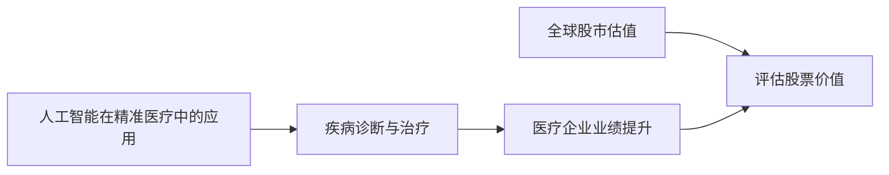

# 全球股市估值与人工智能在精准医疗中的应用

> 关键词：全球股市估值、人工智能、精准医疗、估值模型、医疗应用

> 摘要：本文深入探讨了全球股市估值以及人工智能在精准医疗中的应用。首先介绍了全球股市估值的背景、核心概念、算法原理等内容，包括不同的估值模型及数学公式。接着阐述了人工智能在精准医疗中的应用，从核心概念到算法实现，结合实际案例进行详细分析。还探讨了两者之间可能存在的联系，如人工智能在精准医疗领域的发展对相关医疗企业股市估值的影响。最后对未来发展趋势与挑战进行总结，并提供了丰富的工具和资源推荐以及常见问题解答。

## 1. 背景介绍 
### 1.1 目的和范围
本文旨在全面剖析全球股市估值的相关理论与方法，同时深入研究人工智能在精准医疗领域的具体应用。对于全球股市估值，将涉及不同的估值模型和影响因素分析，范围涵盖主要的全球股票市场。在人工智能在精准医疗的应用方面，将探讨从数据处理到临床决策支持等多个环节的具体应用，旨在为投资者、医疗从业者和相关研究人员提供有价值的参考。

### 1.2 预期读者
本文预期读者包括金融领域的投资者、分析师、研究人员，医疗行业的医生、科研人员、管理人员，以及对人工智能和金融、医疗交叉领域感兴趣的学生和爱好者。

### 1.3 文档结构概述
本文首先介绍背景信息，包括目的、预期读者和文档结构。接着阐述全球股市估值和人工智能在精准医疗中的核心概念与联系。然后分别详细讲解两者的核心算法原理、数学模型和公式。通过项目实战案例进行具体说明，探讨实际应用场景。提供工具和资源推荐，最后总结未来发展趋势与挑战，并解答常见问题，给出扩展阅读和参考资料。

### 1.4 术语表
#### 1.4.1 核心术语定义
- **全球股市估值**：指对全球范围内股票市场中上市公司价值的评估，通过各种方法确定股票的合理价格。
- **人工智能**：是一门研究如何使计算机系统能够模拟人类智能的技术，包括机器学习、深度学习等多种技术手段。
- **精准医疗**：是以个人基因组信息为基础，结合蛋白质组、代谢组等多组学技术，为患者提供个性化医疗方案的医疗模式。

#### 1.4.2 相关概念解释
- **估值模型**：用于评估股票价值的数学模型，常见的有股息贴现模型、市盈率模型等。
- **机器学习**：人工智能的一个分支，通过让计算机从数据中学习模式和规律，从而进行预测和决策。
- **深度学习**：一种基于人工神经网络的机器学习方法，能够自动从大量数据中提取复杂的特征。

#### 1.4.3 缩略词列表
- **AI**：Artificial Intelligence，人工智能
- **ML**：Machine Learning，机器学习
- **DL**：Deep Learning，深度学习
- **P/E**：Price-to-Earnings Ratio，市盈率

## 2. 核心概念与联系 

### 全球股市估值核心概念
全球股市估值是一个复杂的过程，其目的是确定股票的内在价值，从而判断股票是否被高估或低估。常见的估值方法包括绝对估值法和相对估值法。绝对估值法如股息贴现模型（DDM），它基于股票未来股息的现值来计算股票的价值。相对估值法如市盈率（P/E）模型，通过比较同行业公司的市盈率来评估股票的相对价值。

### 人工智能在精准医疗中的核心概念
人工智能在精准医疗中的应用主要是利用机器学习和深度学习等技术，对大量的医疗数据进行分析和挖掘，从而实现疾病的早期诊断、个性化治疗方案的制定等。例如，通过分析患者的基因数据、临床症状和影像数据，人工智能可以预测疾病的发生风险和治疗效果。

### 两者的联系
人工智能在精准医疗领域的发展可能会对相关医疗企业的股市估值产生影响。如果一家医疗企业在人工智能精准医疗技术方面具有领先优势，可能会吸引更多的投资者，从而提高其股票的估值。反之，如果企业在这方面落后，可能会面临股价下跌的风险。

### 文本示意图
全球股市估值与人工智能在精准医疗中的应用存在着一定的关联。全球股市估值关注股票的价值评估，而人工智能在精准医疗中的应用推动着医疗行业的发展。当人工智能在精准医疗领域取得突破时，相关医疗企业的业绩可能会提升，进而影响其股市估值。

### Mermaid 流程图


## 3. 核心算法原理 & 具体操作步骤 

### 全球股市估值核心算法原理
#### 股息贴现模型（DDM）
股息贴现模型认为股票的价值等于其未来股息的现值之和。其基本公式为：
$$V = \sum_{t=1}^{\infty} \frac{D_t}{(1 + r)^t}$$
其中，$V$ 表示股票的内在价值，$D_t$ 表示第 $t$ 期的股息，$r$ 表示贴现率。

#### Python 实现
```python
def ddm_value(D, r, n):
    value = 0
    for t in range(1, n + 1):
        value += D / (1 + r) ** t
    return value

# 示例参数
D = 2  # 每年股息
r = 0.1  # 贴现率
n = 10  # 预测期数

result = ddm_value(D, r, n)
print(f"股票的内在价值为: {result}")
```

#### 市盈率（P/E）模型
市盈率模型通过比较同行业公司的市盈率来评估股票的相对价值。其计算公式为：
$$P = E \times P/E$$
其中，$P$ 表示股票价格，$E$ 表示每股收益，$P/E$ 表示市盈率。

#### Python 实现
```python
def pe_value(E, pe_ratio):
    return E * pe_ratio

# 示例参数
E = 5  # 每股收益
pe_ratio = 15  # 市盈率

result = pe_value(E, pe_ratio)
print(f"股票的价格为: {result}")
```

### 人工智能在精准医疗中的核心算法原理
#### 机器学习算法 - 逻辑回归
逻辑回归是一种常用的分类算法，可用于疾病的诊断。其基本原理是通过对输入特征进行线性组合，然后通过逻辑函数将结果映射到 0 到 1 之间的概率值。

#### Python 实现
```python
import numpy as np
from sklearn.linear_model import LogisticRegression
from sklearn.model_selection import train_test_split
from sklearn.datasets import load_breast_cancer

# 加载数据集
data = load_breast_cancer()
X = data.data
y = data.target

# 划分训练集和测试集
X_train, X_test, y_train, y_test = train_test_split(X, y, test_size=0.2, random_state=42)

# 创建逻辑回归模型
model = LogisticRegression()

# 训练模型
model.fit(X_train, y_train)

# 预测
y_pred = model.predict(X_test)

# 计算准确率
accuracy = np.mean(y_pred == y_test)
print(f"模型准确率: {accuracy}")
```

#### 深度学习算法 - 卷积神经网络（CNN）
卷积神经网络常用于医学影像分析，如图像分类、病变检测等。其通过卷积层、池化层和全连接层等结构，自动提取图像的特征。

#### Python 实现
```python
import tensorflow as tf
from tensorflow.keras.datasets import mnist
from tensorflow.keras.models import Sequential
from tensorflow.keras.layers import Conv2D, MaxPooling2D, Flatten, Dense

# 加载数据集
(x_train, y_train), (x_test, y_test) = mnist.load_data()

# 数据预处理
x_train = x_train.reshape(-1, 28, 28, 1).astype('float32') / 255.0
x_test = x_test.reshape(-1, 28, 28, 1).astype('float32') / 255.0

# 创建 CNN 模型
model = Sequential([
    Conv2D(32, (3, 3), activation='relu', input_shape=(28, 28, 1)),
    MaxPooling2D((2, 2)),
    Flatten(),
    Dense(64, activation='relu'),
    Dense(10, activation='softmax')
])

# 编译模型
model.compile(optimizer='adam',
              loss='sparse_categorical_crossentropy',
              metrics=['accuracy'])

# 训练模型
model.fit(x_train, y_train, epochs=5, batch_size=64)

# 评估模型
test_loss, test_acc = model.evaluate(x_test, y_test)
print(f"模型准确率: {test_acc}")
```

## 4. 数学模型和公式 & 详细讲解 & 举例说明 

### 全球股市估值数学模型和公式
#### 股息贴现模型（DDM）
$$V = \sum_{t=1}^{\infty} \frac{D_t}{(1 + r)^t}$$
详细讲解：该公式中，$D_t$ 表示第 $t$ 期的股息，$r$ 表示贴现率。贴现率反映了投资者对未来现金流的风险偏好，风险越高，贴现率越高。通过将未来各期的股息按照贴现率进行贴现，得到股票的内在价值。

举例说明：假设某股票每年的股息为 $2$ 元，贴现率为 $0.1$，预测期数为 $10$ 年。则该股票的内在价值为：
$$V = \sum_{t=1}^{10} \frac{2}{(1 + 0.1)^t} \approx 12.29$$

#### 市盈率（P/E）模型
$$P = E \times P/E$$
详细讲解：$E$ 表示每股收益，$P/E$ 表示市盈率。市盈率是市场对公司盈利的预期倍数，不同行业的市盈率水平可能不同。通过每股收益乘以市盈率，可以得到股票的价格。

举例说明：假设某公司的每股收益为 $5$ 元，同行业的平均市盈率为 $15$。则该公司股票的价格为：
$$P = 5 \times 15 = 75$$

### 人工智能在精准医疗中的数学模型和公式
#### 逻辑回归
逻辑回归的基本公式为：
$$P(y = 1|x) = \frac{1}{1 + e^{-(w^T x + b)}}$$
详细讲解：其中，$P(y = 1|x)$ 表示在输入特征 $x$ 下，样本属于正类的概率，$w$ 是权重向量，$b$ 是偏置项。通过对输入特征进行线性组合，然后通过逻辑函数将结果映射到 0 到 1 之间的概率值。

举例说明：假设有一个二分类问题，输入特征 $x = [1, 2]$，权重向量 $w = [0.5, 0.3]$，偏置项 $b = 0.1$。则样本属于正类的概率为：
$$P(y = 1|x) = \frac{1}{1 + e^{-(0.5 \times 1 + 0.3 \times 2 + 0.1)}} \approx 0.73$$

#### 卷积神经网络（CNN）
卷积神经网络中的卷积操作可以表示为：
$$y_{i,j}^l = \sum_{m=0}^{M - 1} \sum_{n=0}^{N - 1} x_{i + m, j + n}^{l - 1} \times k_{m,n}^l + b^l$$
详细讲解：其中，$y_{i,j}^l$ 表示第 $l$ 层卷积层在位置 $(i, j)$ 处的输出，$x_{i + m, j + n}^{l - 1}$ 表示第 $l - 1$ 层的输入，$k_{m,n}^l$ 表示第 $l$ 层的卷积核，$b^l$ 表示偏置项。通过卷积操作，可以提取输入特征的局部特征。

举例说明：假设有一个 $3 \times 3$ 的输入特征图和一个 $2 \times 2$ 的卷积核，卷积核的值为 $[[1, 2], [3, 4]]$，偏置项为 $1$。则卷积操作的结果为：
$$y_{0,0}^l = x_{0,0}^{l - 1} \times 1 + x_{0,1}^{l - 1} \times 2 + x_{1,0}^{l - 1} \times 3 + x_{1,1}^{l - 1} \times 4 + 1$$

## 5. 项目实战：代码实际案例和详细解释说明 

### 5.1  开发环境搭建
#### 全球股市估值
- **编程语言**：Python
- **开发环境**：Anaconda
- **相关库**：pandas、numpy、matplotlib

#### 人工智能在精准医疗中的应用
- **编程语言**：Python
- **开发环境**：Anaconda
- **相关库**：tensorflow、keras、scikit-learn

### 5.2  源代码详细实现和代码解读
#### 全球股市估值 - 市盈率模型示例
```python
import pandas as pd

# 读取股票数据
data = pd.read_csv('stock_data.csv')

# 计算每股收益
earnings_per_share = data['Net Income'] / data['Shares Outstanding']

# 计算市盈率
pe_ratio = data['Stock Price'] / earnings_per_share

# 输出结果
print('每股收益:')
print(earnings_per_share)
print('市盈率:')
print(pe_ratio)
```
代码解读：首先使用 `pandas` 库读取股票数据，然后计算每股收益，通过股票价格除以每股收益得到市盈率，最后输出结果。

#### 人工智能在精准医疗中的应用 - 逻辑回归示例
```python
import numpy as np
from sklearn.linear_model import LogisticRegression
from sklearn.model_selection import train_test_split
from sklearn.datasets import load_breast_cancer

# 加载数据集
data = load_breast_cancer()
X = data.data
y = data.target

# 划分训练集和测试集
X_train, X_test, y_train, y_test = train_test_split(X, y, test_size=0.2, random_state=42)

# 创建逻辑回归模型
model = LogisticRegression()

# 训练模型
model.fit(X_train, y_train)

# 预测
y_pred = model.predict(X_test)

# 计算准确率
accuracy = np.mean(y_pred == y_test)
print(f"模型准确率: {accuracy}")
```
代码解读：首先加载乳腺癌数据集，然后将数据集划分为训练集和测试集。创建逻辑回归模型并进行训练，使用训练好的模型进行预测，最后计算模型的准确率。

### 5.3  代码解读与分析
#### 全球股市估值代码分析
通过读取股票数据并计算每股收益和市盈率，可以对股票的估值进行初步分析。市盈率是一个重要的估值指标，不同行业的市盈率水平可能不同，需要结合行业特点进行分析。

#### 人工智能在精准医疗中的应用代码分析
逻辑回归模型是一种简单而有效的分类算法，在疾病诊断等领域有广泛的应用。通过划分训练集和测试集，可以评估模型的性能。准确率是一个常用的性能指标，但在实际应用中，还需要考虑其他指标，如召回率、F1 值等。

## 6. 实际应用场景 

### 全球股市估值的实际应用场景
- **投资决策**：投资者可以通过对股票的估值分析，判断股票是否被高估或低估，从而做出投资决策。
- **公司并购**：在公司并购过程中，需要对目标公司的股票进行估值，以确定合理的收购价格。
- **宏观经济分析**：全球股市估值可以反映宏观经济的运行状况，为宏观经济政策的制定提供参考。

### 人工智能在精准医疗中的实际应用场景
- **疾病诊断**：通过分析患者的基因数据、临床症状和影像数据，人工智能可以辅助医生进行疾病的诊断，提高诊断的准确性和效率。
- **个性化治疗**：根据患者的个体差异，人工智能可以为患者制定个性化的治疗方案，提高治疗效果。
- **药物研发**：人工智能可以通过对大量的生物数据进行分析，加速药物研发的进程，降低研发成本。

## 7. 工具和资源推荐
### 7.1 学习资源推荐
#### 7.1.1 书籍推荐
- 《金融市场与金融机构》：全面介绍金融市场和金融机构的相关知识，对理解全球股市估值有很大帮助。
- 《机器学习》：周志华著，系统介绍机器学习的基本原理和算法，是学习人工智能的经典教材。
- 《深度学习》：Ian Goodfellow 等著，深入讲解深度学习的理论和应用。

#### 7.1.2 在线课程
- Coursera 上的《机器学习》课程：由 Andrew Ng 教授授课，是学习机器学习的优质课程。
- edX 上的《深度学习》课程：提供深度学习的系统学习资源。
- 中国大学 MOOC 上的《金融市场学》课程：帮助学习者了解金融市场的基本原理和运作机制。

#### 7.1.3 技术博客和网站
- Medium：有很多关于金融和人工智能的技术博客，提供最新的研究成果和实践经验。
- arXiv：一个预印本平台，包含大量的学术论文，可用于了解最新的研究动态。
- 雪球网：专注于金融投资领域，提供股票分析和讨论的平台。

### 7.2 开发工具框架推荐
#### 7.2.1 IDE和编辑器
- PyCharm：一款专业的 Python 集成开发环境，提供丰富的代码编辑和调试功能。
- Jupyter Notebook：交互式的开发环境，适合进行数据分析和模型训练。
- Visual Studio Code：轻量级的代码编辑器，支持多种编程语言和插件。

#### 7.2.2 调试和性能分析工具
- TensorBoard：用于可视化深度学习模型的训练过程和性能指标。
- Scikit-learn 的 GridSearchCV：用于模型参数调优和性能评估。
- PyTorch Profiler：用于分析 PyTorch 模型的性能瓶颈。

#### 7.2.3 相关框架和库
- TensorFlow：一个开源的深度学习框架，提供丰富的深度学习模型和工具。
- Keras：一个高级神经网络 API，简化了深度学习模型的构建和训练过程。
- Scikit-learn：一个常用的机器学习库，提供了多种机器学习算法和工具。

### 7.3 相关论文著作推荐
#### 7.3.1 经典论文
- Fama, E. F., & French, K. R. (1992). The cross-section of expected stock returns. The Journal of Finance, 47(2), 427-465.
- LeCun, Y., Bengio, Y., & Hinton, G. (2015). Deep learning. Nature, 521(7553), 436-444.

#### 7.3.2 最新研究成果
- 关注顶级学术会议，如 NeurIPS、ICML、KDD 等，获取人工智能领域的最新研究成果。
- 关注金融领域的顶级期刊，如 The Journal of Finance、The Review of Financial Studies 等，获取全球股市估值的最新研究进展。

#### 7.3.3 应用案例分析
- 分析医疗行业中人工智能应用的成功案例，了解其在疾病诊断、治疗等方面的实际效果。
- 研究金融市场中利用估值模型进行投资决策的案例，总结经验教训。

## 8. 总结：未来发展趋势与挑战

### 全球股市估值的未来发展趋势与挑战
#### 发展趋势
- **多因素模型的应用**：未来的股市估值将更加注重多因素模型的应用，综合考虑宏观经济、行业发展、公司基本面等多种因素。
- **大数据和人工智能的融合**：利用大数据和人工智能技术，可以更准确地分析市场数据和公司信息，提高估值的准确性和效率。
- **国际化估值标准的统一**：随着全球经济的一体化，国际化估值标准将逐渐统一，提高全球股市估值的可比性。

#### 挑战
- **市场不确定性增加**：全球政治、经济环境的不确定性增加，给股市估值带来了更大的挑战。
- **数据质量和隐私问题**：大数据和人工智能的应用依赖于大量的数据，但数据质量和隐私问题可能会影响估值的准确性和可靠性。
- **模型的局限性**：现有的估值模型存在一定的局限性，无法完全准确地反映股票的内在价值。

### 人工智能在精准医疗中的未来发展趋势与挑战
#### 发展趋势
- **多组学数据的整合**：未来的精准医疗将更加注重多组学数据的整合，如基因组、蛋白质组、代谢组等，以提供更全面的患者信息。
- **智能医疗设备的普及**：智能医疗设备的普及将为人工智能在精准医疗中的应用提供更多的数据来源，促进医疗服务的智能化。
- **个性化医疗的发展**：人工智能将为个性化医疗的发展提供有力支持，根据患者的个体差异制定更加精准的治疗方案。

#### 挑战
- **数据安全和伦理问题**：人工智能在精准医疗中的应用涉及大量的患者数据，数据安全和伦理问题需要得到重视。
- **模型的可解释性**：深度学习模型等复杂的人工智能模型往往缺乏可解释性，在医疗领域的应用存在一定的风险。
- **医疗专业知识的融合**：人工智能技术需要与医疗专业知识深度融合，才能更好地应用于精准医疗领域。

## 9. 附录：常见问题与解答

### 全球股市估值常见问题与解答
- **问**：股息贴现模型中的贴现率如何确定？
**答**：贴现率的确定需要考虑多种因素，如市场利率、公司风险等。一般可以参考同行业的平均贴现率或根据资本资产定价模型（CAPM）进行计算。
- **问**：市盈率模型有哪些局限性？
**答**：市盈率模型的局限性在于它只考虑了公司的盈利情况，没有考虑公司的资产负债状况、现金流等因素。此外，不同行业的市盈率水平可能不同，需要进行合理的比较。

### 人工智能在精准医疗中常见问题与解答
- **问**：人工智能在精准医疗中的应用是否会取代医生？
**答**：不会。人工智能在精准医疗中的应用主要是辅助医生进行诊断和治疗，提高医疗效率和准确性。医生的临床经验和人文关怀是人工智能无法替代的。
- **问**：如何保证人工智能模型在精准医疗中的安全性和可靠性？
**答**：需要进行严格的模型验证和评估，包括数据质量控制、模型训练和测试、性能评估等环节。此外，还需要建立完善的监管机制，确保模型的安全和可靠应用。

## 10. 扩展阅读 & 参考资料
- 博迪, 凯恩, 马库斯. 投资学[M]. 机械工业出版社, 2019.
- 李航. 统计学习方法（第 2 版）[M]. 清华大学出版社, 2019.
- 相关学术期刊和会议论文，如《The Journal of Finance》、NeurIPS 等。
- 金融和医疗行业的官方网站和报告，获取最新的行业动态和数据。