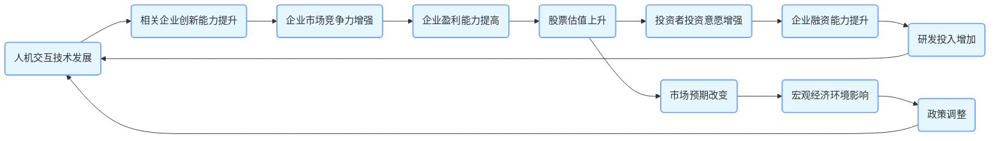

# 全球股市估值与人机交互技术发展的关联

> 关键词：全球股市估值、人机交互技术、市场趋势、技术创新、经济影响、投资策略、产业变革

> 摘要：本文旨在深入探讨全球股市估值与人机交互技术发展之间的关联。通过对背景知识的介绍，明确研究目的和范围，阐述核心概念及联系，分析相关算法原理和数学模型，结合项目实战案例进行详细解读，探讨实际应用场景，并推荐相关工具和资源。最后总结未来发展趋势与挑战，解答常见问题，为读者全面呈现两者之间的复杂关系，帮助投资者和技术从业者更好地理解市场动态和技术走向，制定合理的投资策略和技术发展规划。

## 1. 背景介绍 
### 1.1 目的和范围
本研究的目的在于揭示全球股市估值与人机交互技术发展之间的内在联系，探究人机交互技术的进步如何影响股市估值，以及股市估值的变化又如何反馈到人机交互技术的发展中。研究范围涵盖全球主要股票市场，包括但不限于美国的纳斯达克、纽约证券交易所，中国的上海证券交易所、深圳证券交易所，以及欧洲和亚洲其他重要的证券市场。同时，涉及人机交互技术的各个领域，如虚拟现实（VR）、增强现实（AR）、手势识别、语音交互等。

### 1.2 预期读者
本文预期读者包括金融投资者、金融分析师、技术研发人员、科技行业从业者、经济学者以及对全球股市和人机交互技术发展感兴趣的普通读者。对于投资者来说，了解两者之间的关联有助于制定更合理的投资策略；对于技术研发人员和科技行业从业者，能从股市的反馈中把握技术发展的方向和市场需求；经济学者可以通过研究两者关系，深入理解技术创新对经济增长和市场结构的影响。

### 1.3 文档结构概述
本文首先介绍背景知识，包括目的、预期读者和文档结构概述，以及相关术语的定义和解释。接着阐述全球股市估值和人机交互技术的核心概念与联系，通过文本示意图和 Mermaid 流程图展示其原理和架构。然后分析核心算法原理和具体操作步骤，用 Python 源代码详细阐述。之后介绍相关的数学模型和公式，并举例说明。再通过项目实战案例，包括开发环境搭建、源代码实现和代码解读，深入分析两者的关联。随后探讨实际应用场景，推荐相关的学习资源、开发工具框架和论文著作。最后总结未来发展趋势与挑战，解答常见问题，并提供扩展阅读和参考资料。

### 1.4 术语表
#### 1.4.1 核心术语定义
- **全球股市估值**：指对全球范围内各个股票市场中上市公司股票价值的评估。通常通过各种估值方法，如市盈率（P/E）、市净率（P/B）、现金流折现法（DCF）等，来确定股票的合理价格范围，反映市场对上市公司未来盈利能力和发展前景的预期。
- **人机交互技术**：是指人与计算机之间进行信息交互的技术，旨在实现自然、高效、便捷的人机通信。它包括多种交互方式，如键盘、鼠标、触摸屏、语音识别、手势识别、眼动追踪等，以及虚拟现实、增强现实等沉浸式交互技术。

#### 1.4.2 相关概念解释
- **市盈率（P/E）**：是指股票价格除以每股收益（EPS）的比率，反映了投资者为获取公司每一元盈利所愿意支付的价格。较高的市盈率通常表示市场对公司未来盈利增长的预期较高。
- **市净率（P/B）**：是指股票价格与每股净资产的比率，衡量了市场对公司净资产的估值水平。市净率较低可能表示股票被低估，具有投资价值。
- **现金流折现法（DCF）**：是一种通过预测公司未来的自由现金流，并将其折现到当前价值的估值方法。它考虑了货币的时间价值和公司的长期发展前景，是一种较为全面的估值方法。

#### 1.4.3 缩略词列表
- **VR**：虚拟现实（Virtual Reality）
- **AR**：增强现实（Augmented Reality）
- **P/E**：市盈率（Price-to-Earnings Ratio）
- **P/B**：市净率（Price-to-Book Ratio）
- **DCF**：现金流折现法（Discounted Cash Flow）

## 2. 核心概念与联系 
### 核心概念原理
#### 全球股市估值原理
全球股市估值是基于对上市公司基本面和市场预期的综合评估。基本面因素包括公司的财务状况、盈利能力、资产质量、行业地位等。市场预期则受到宏观经济环境、政策变化、行业发展趋势等多种因素的影响。投资者通过分析这些因素，运用各种估值方法来确定股票的合理价格。例如，市盈率法通过比较不同公司的市盈率水平，来判断股票是否被高估或低估。如果一家公司的市盈率明显高于同行业平均水平，可能意味着市场对其未来增长预期过高，股票存在高估风险；反之，如果市盈率低于平均水平，则可能被低估。

#### 人机交互技术原理
人机交互技术的核心是实现人与计算机之间的高效信息交互。其原理基于多种学科，如计算机科学、认知心理学、传感器技术等。以语音交互技术为例，其工作原理包括语音信号的采集、预处理、特征提取、语音识别和语义理解等步骤。首先，麦克风采集语音信号，然后对信号进行预处理，去除噪声和干扰。接着，提取语音信号的特征，如音素、声调等。通过语音识别算法将语音信号转换为文本，再通过语义理解技术对文本进行分析，理解用户的意图，从而实现人机交互。

### 架构的文本示意图
全球股市估值与人机交互技术发展的关联架构可以描述如下：人机交互技术的发展会影响相关科技企业的创新能力和市场竞争力，进而影响企业的盈利能力和发展前景。这些变化会反映在企业的财务报表和市场预期中，从而影响股票的估值。同时，股市估值的变化也会影响投资者对人机交互技术相关企业的投资决策，进而影响企业的融资能力和研发投入，进一步影响人机交互技术的发展。

### Mermaid 流程图


## 3. 核心算法原理 & 具体操作步骤 
### 核心算法原理
在分析全球股市估值与人机交互技术发展的关联时，可以使用回归分析算法。回归分析是一种统计方法，用于研究变量之间的关系。我们可以将人机交互技术的发展指标（如研发投入、专利数量、技术创新指数等）作为自变量，将全球股市中相关企业的股票估值指标（如市盈率、市净率等）作为因变量，建立回归模型，以探究两者之间的定量关系。

### Python 源代码详细阐述
```python
import pandas as pd
import numpy as np
from sklearn.linear_model import LinearRegression
from sklearn.model_selection import train_test_split
from sklearn.metrics import mean_squared_error

# 假设我们有一个包含人机交互技术发展指标和股票估值指标的数据集
# 这里我们使用随机生成的数据作为示例
np.random.seed(42)
n_samples = 100
# 生成人机交互技术发展指标数据
tech_development = np.random.randint(1, 100, n_samples)
# 生成股票估值指标数据，假设股票估值与技术发展存在线性关系，并添加一些噪声
stock_valuation = 2 * tech_development + np.random.normal(0, 10, n_samples)

# 创建 DataFrame
data = pd.DataFrame({
    'tech_development': tech_development,
    'stock_valuation': stock_valuation
})

# 划分训练集和测试集
X = data[['tech_development']]
y = data['stock_valuation']
X_train, X_test, y_train, y_test = train_test_split(X, y, test_size=0.2, random_state=42)

# 创建线性回归模型
model = LinearRegression()

# 训练模型
model.fit(X_train, y_train)

# 预测
y_pred = model.predict(X_test)

# 评估模型
mse = mean_squared_error(y_test, y_pred)
rmse = np.sqrt(mse)
print(f"均方误差 (MSE): {mse}")
print(f"均方根误差 (RMSE): {rmse}")
print(f"模型系数: {model.coef_[0]}")
print(f"模型截距: {model.intercept_}")
```

### 具体操作步骤
1. **数据收集**：收集全球股市中与人机交互技术相关企业的股票估值数据，以及人机交互技术的发展指标数据。数据来源可以包括金融数据库、科技行业报告、专利数据库等。
2. **数据预处理**：对收集到的数据进行清洗、整理和转换，去除缺失值、异常值，统一数据格式。
3. **特征选择**：选择合适的人机交互技术发展指标和股票估值指标作为自变量和因变量。
4. **模型建立**：使用回归分析算法建立模型，将自变量和因变量输入模型进行训练。
5. **模型评估**：使用测试集对训练好的模型进行评估，计算均方误差（MSE）、均方根误差（RMSE）等评估指标，评估模型的性能。
6. **结果分析**：分析模型的系数和截距，了解人机交互技术发展指标与股票估值指标之间的定量关系。

## 4. 数学模型和公式 & 详细讲解 & 举例说明 
### 数学模型
在回归分析中，线性回归模型的数学表达式为：

$$y = \beta_0 + \beta_1x_1 + \epsilon$$

其中，$y$ 是因变量（股票估值指标），$x_1$ 是自变量（人机交互技术发展指标），$\beta_0$ 是截距，$\beta_1$ 是斜率，$\epsilon$ 是误差项，表示模型无法解释的随机误差。

### 详细讲解
- **截距 $\beta_0$**：表示当自变量 $x_1$ 为 0 时，因变量 $y$ 的取值。在实际应用中，它可能没有实际的物理意义，但在模型中起到调整位置的作用。
- **斜率 $\beta_1$**：表示自变量 $x_1$ 每增加一个单位，因变量 $y$ 的平均变化量。如果 $\beta_1$ 为正，说明自变量和因变量之间存在正相关关系；如果 $\beta_1$ 为负，则存在负相关关系。
- **误差项 $\epsilon$**：反映了模型的不确定性。由于实际情况中存在各种无法控制的因素，模型无法完全准确地预测因变量的值，误差项就是这些因素的综合体现。

### 举例说明
假设我们通过回归分析得到的模型为：

$$\text{stock_valuation} = 10 + 2 \times \text{tech_development} + \epsilon$$

这意味着当人机交互技术发展指标为 0 时，股票估值的预测值为 10（截距）。人机交互技术发展指标每增加 1 个单位，股票估值平均增加 2 个单位（斜率）。误差项 $\epsilon$ 表示实际股票估值与预测值之间的差异。

例如，如果某一时期人机交互技术发展指标为 20，那么根据模型预测的股票估值为：

$$\text{stock_valuation} = 10 + 2 \times 20 = 50$$

但实际的股票估值可能会因为各种因素的影响而与预测值有所不同，这个差异就是误差项 $\epsilon$ 的体现。

## 5. 项目实战：代码实际案例和详细解释说明 
### 5.1  开发环境搭建
#### 安装 Python
首先，需要安装 Python 环境。可以从 Python 官方网站（https://www.python.org/downloads/） 下载适合自己操作系统的 Python 安装包，并按照安装向导进行安装。

#### 安装必要的库
在安装好 Python 后，需要安装一些必要的库，如 pandas、numpy、scikit-learn 等。可以使用以下命令进行安装：
```sh
pip install pandas numpy scikit-learn
```

### 5.2  源代码详细实现和代码解读
```python
import pandas as pd
import numpy as np
from sklearn.linear_model import LinearRegression
from sklearn.model_selection import train_test_split
from sklearn.metrics import mean_squared_error

# 读取实际数据集
# 假设数据集文件名为 'stock_tech_data.csv'，包含两列：'tech_development' 和 'stock_valuation'
data = pd.read_csv('stock_tech_data.csv')

# 划分特征和目标变量
X = data[['tech_development']]
y = data['stock_valuation']

# 划分训练集和测试集
X_train, X_test, y_train, y_test = train_test_split(X, y, test_size=0.2, random_state=42)

# 创建线性回归模型
model = LinearRegression()

# 训练模型
model.fit(X_train, y_train)

# 预测
y_pred = model.predict(X_test)

# 评估模型
mse = mean_squared_error(y_test, y_pred)
rmse = np.sqrt(mse)
print(f"均方误差 (MSE): {mse}")
print(f"均方根误差 (RMSE): {rmse}")
print(f"模型系数: {model.coef_[0]}")
print(f"模型截距: {model.intercept_}")

# 可视化结果
import matplotlib.pyplot as plt

plt.scatter(X_test, y_test, color='blue', label='实际值')
plt.plot(X_test, y_pred, color='red', linewidth=2, label='预测值')
plt.xlabel('人机交互技术发展指标')
plt.ylabel('股票估值指标')
plt.title('人机交互技术发展与股票估值的关系')
plt.legend()
plt.show()
```

### 代码解读与分析
1. **数据读取**：使用 `pandas` 库的 `read_csv` 函数读取包含人机交互技术发展指标和股票估值指标的数据集。
2. **特征和目标变量划分**：将数据集划分为特征变量 `X`（人机交互技术发展指标）和目标变量 `y`（股票估值指标）。
3. **训练集和测试集划分**：使用 `sklearn` 库的 `train_test_split` 函数将数据集划分为训练集和测试集，测试集占总数据集的 20%。
4. **模型创建和训练**：创建线性回归模型，并使用训练集数据对模型进行训练。
5. **预测和评估**：使用训练好的模型对测试集数据进行预测，并计算均方误差（MSE）和均方根误差（RMSE）来评估模型的性能。
6. **可视化结果**：使用 `matplotlib` 库绘制散点图和折线图，直观地展示实际值和预测值之间的关系。

## 6. 实际应用场景 
### 投资决策
投资者可以通过分析人机交互技术的发展趋势和相关企业的股票估值，制定合理的投资策略。例如，如果人机交互技术处于快速发展阶段，相关企业的研发投入不断增加，技术创新能力不断提升，那么这些企业的股票可能具有较高的投资价值。投资者可以根据回归分析模型的结果，选择那些股票估值与技术发展指标相关性较高的企业进行投资。

### 企业战略规划
对于人机交互技术相关企业来说，股市估值的变化可以反映市场对企业的认可程度和发展预期。企业可以根据股市估值的反馈，调整自身的战略规划。如果股票估值较高，说明市场对企业的未来发展前景看好，企业可以加大研发投入，扩大市场份额；如果股票估值较低，企业需要反思自身的发展战略，寻找提升竞争力的途径。

### 政策制定
政府和监管机构可以通过研究全球股市估值与人机交互技术发展的关联，制定相关的政策来促进技术创新和产业发展。例如，政府可以出台税收优惠政策、研发补贴政策等，鼓励企业加大对人机交互技术的研发投入，提高企业的创新能力和市场竞争力，从而推动整个产业的发展。

### 行业研究
研究机构和学者可以通过分析全球股市估值与人机交互技术发展的关联，深入了解技术创新对经济增长和市场结构的影响。这有助于揭示技术创新的内在规律和发展趋势，为行业发展提供理论支持和决策参考。

## 7. 工具和资源推荐
### 7.1 学习资源推荐
#### 7.1.1 书籍推荐
- 《金融市场学》：全面介绍金融市场的基本概念、运行机制和分析方法，有助于读者了解全球股市的基本知识。
- 《人机交互：以用户为中心的设计和评估》：系统阐述人机交互技术的原理、方法和应用，是学习人机交互技术的经典教材。
- 《Python 数据分析实战》：详细介绍使用 Python 进行数据分析的方法和技巧，对于进行相关数据处理和模型建立非常有帮助。

#### 7.1.2 在线课程
- Coursera 平台上的“金融市场分析”课程：由知名大学教授授课，深入讲解金融市场的分析方法和投资策略。
- edX 平台上的“人机交互基础”课程：介绍人机交互技术的基本概念、原理和应用，适合初学者学习。
- 慕课网的“Python 数据分析与挖掘实战”课程：通过实际案例讲解 Python 在数据分析和挖掘中的应用，帮助读者掌握相关技能。

#### 7.1.3 技术博客和网站
- 金融界（https://www.jrj.com.cn/）：提供全球股市的实时行情、分析报告和投资建议，是了解金融市场动态的重要渠道。
- 人机交互网（http://www.hci.org.cn/）：专注于人机交互技术的研究和应用，发布最新的技术成果和行业动态。
- 博客园（https://www.cnblogs.com/）：汇聚了众多技术开发者和研究者的博客，其中有很多关于金融数据分析和人机交互技术的优秀文章。

### 7.2 开发工具框架推荐
#### 7.2.1 IDE和编辑器
- PyCharm：一款专业的 Python 集成开发环境，提供丰富的代码编辑、调试和项目管理功能，适合进行 Python 数据分析和机器学习开发。
- Jupyter Notebook：一个交互式的开发环境，支持多种编程语言，方便进行数据探索、模型建立和结果可视化。
- Visual Studio Code：一款轻量级的代码编辑器，支持多种编程语言和插件扩展，具有良好的用户体验。

#### 7.2.2 调试和性能分析工具
- pdb：Python 内置的调试器，可以帮助开发者逐行调试代码，查找问题。
- cProfile：Python 标准库中的性能分析工具，可以分析代码的运行时间和函数调用情况，帮助开发者优化代码性能。
- TensorBoard：一个可视化工具，用于监控和分析深度学习模型的训练过程和性能。

#### 7.2.3 相关框架和库
- pandas：一个强大的数据处理和分析库，提供了丰富的数据结构和数据操作方法，方便进行数据清洗、整理和分析。
- numpy：一个用于科学计算的基础库，提供了高效的数组操作和数学函数，是很多数据分析和机器学习库的基础。
- scikit-learn：一个常用的机器学习库，提供了多种机器学习算法和工具，方便进行模型建立、训练和评估。

### 7.3 相关论文著作推荐
#### 7.3.1 经典论文
- “The Efficient Market Hypothesis and Its Critics”：探讨了有效市场假说及其批评者的观点，对理解股票市场的定价机制具有重要意义。
- “Human-Computer Interaction: A Cognitive Approach”：从认知心理学的角度研究人机交互技术，为理解人机交互的本质提供了理论基础。
- “Regression Analysis: Theory and Applications”：系统阐述回归分析的理论和应用，是学习回归分析算法的经典文献。

#### 7.3.2 最新研究成果
- 可以通过学术数据库，如 IEEE Xplore、ACM Digital Library、ScienceDirect 等，搜索关于全球股市估值与人机交互技术发展关联的最新研究论文。这些论文通常反映了该领域的最新研究动态和前沿成果。

#### 7.3.3 应用案例分析
- 一些知名的商业咨询公司和研究机构会发布关于科技行业和金融市场的应用案例分析报告。例如，麦肯锡公司的报告“Technology Trends Shaping 2030”和波士顿咨询公司的报告“Global Financial Markets Outlook”，可以帮助读者了解人机交互技术发展和股市估值变化在实际应用中的案例和影响。

## 8. 总结：未来发展趋势与挑战
### 未来发展趋势
#### 技术创新推动股市估值提升
随着人机交互技术的不断创新和发展，如虚拟现实、增强现实、脑机接口等技术的逐渐成熟，相关企业的创新能力和市场竞争力将不断提升。这将导致这些企业的盈利能力增强，从而推动股票估值的上升。未来，人机交互技术相关企业有望成为股市的热点板块，吸引更多的投资者关注。

#### 股市估值影响技术研发方向
股市估值的变化会影响投资者对人机交互技术相关企业的投资决策，进而影响企业的融资能力和研发投入。如果某一领域的人机交互技术相关企业股票估值较高，说明市场对该领域的发展前景看好，企业将获得更多的资金支持，加大在该领域的研发投入，推动技术的快速发展。因此，股市估值将在一定程度上引导人机交互技术的研发方向。

#### 全球股市联动性增强
随着全球化的发展，全球股市的联动性越来越强。人机交互技术作为全球性的科技领域，其发展和股市估值的变化将在全球范围内产生影响。一个国家或地区的人机交互技术创新和股市波动，可能会迅速传导到其他国家和地区，引发全球股市的连锁反应。

### 挑战
#### 技术不确定性
人机交互技术仍处于快速发展阶段，存在很多技术不确定性。例如，虚拟现实和增强现实技术在用户体验、硬件设备、内容创作等方面还存在一些问题，脑机接口技术在安全性、伦理道德等方面也面临诸多挑战。这些技术不确定性可能导致相关企业的研发失败或市场推广受阻，从而影响股票估值。

#### 市场波动性
全球股市本身具有较高的波动性，受到宏观经济环境、政策变化、地缘政治等多种因素的影响。人机交互技术相关企业的股票估值也会受到这些因素的冲击，增加了投资风险。此外，市场情绪和投资者预期也会对股票估值产生较大影响，导致股价波动剧烈。

#### 伦理道德和法律法规问题
人机交互技术的发展涉及到一些伦理道德和法律法规问题，如隐私保护、数据安全、人工智能的伦理准则等。如果企业在这些方面处理不当，可能会面临法律诉讼和社会舆论的压力，影响企业的声誉和股票估值。同时，相关法律法规的不完善也会给企业的发展带来一定的不确定性。

## 9. 附录：常见问题与解答
### 1. 如何准确衡量人机交互技术的发展水平？
衡量人机交互技术的发展水平可以从多个方面入手。可以考虑技术指标，如技术的精度、速度、稳定性等；研发投入，包括企业和政府在人机交互技术研发方面的资金投入；专利数量，反映了企业和研究机构在该领域的创新能力；市场应用情况，如相关产品的市场占有率、用户满意度等。综合考虑这些因素，可以更准确地衡量人机交互技术的发展水平。

### 2. 股票估值的变化是否完全由人机交互技术的发展决定？
不是。股票估值的变化受到多种因素的影响，人机交互技术的发展只是其中之一。宏观经济环境、政策变化、行业竞争、公司治理等因素都会对股票估值产生影响。人机交互技术的发展会影响相关企业的基本面和市场预期，从而间接影响股票估值，但不能完全决定股票估值的变化。

### 3. 如何降低投资人机交互技术相关企业股票的风险？
可以通过以下方法降低投资风险：进行充分的市场调研，了解人机交互技术的发展趋势和相关企业的基本面；分散投资，不要把所有资金都投入到一家或几家企业的股票中；关注宏观经济环境和政策变化，及时调整投资策略；设置止损点，控制投资损失。

### 4. 人机交互技术的发展对传统行业的股票估值有何影响？
人机交互技术的发展可能会对传统行业的股票估值产生不同的影响。一方面，一些传统行业可以通过引入人机交互技术进行转型升级，提高生产效率和产品质量，从而提升企业的竞争力和股票估值。例如，制造业可以利用人机协作机器人提高生产自动化水平，服务业可以利用语音交互技术改善客户服务体验。另一方面，如果传统行业不能及时跟上技术发展的步伐，可能会面临被市场淘汰的风险，导致股票估值下降。

## 10. 扩展阅读 & 参考资料
### 扩展阅读
- 《智能时代：大数据与智能革命重新定义未来》：介绍了大数据和人工智能等新兴技术对社会和经济的影响，有助于读者了解人机交互技术所处的时代背景和发展趋势。
- 《创新者的窘境》：探讨了企业在面对技术创新时的困境和应对策略，对于理解人机交互技术相关企业的发展具有一定的启示作用。
- 《金融炼金术》：作者乔治·索罗斯通过对金融市场的深入研究，提出了反身性理论，对理解股票市场的波动和投资者行为具有重要意义。

### 参考资料
- 金融数据库，如 Bloomberg、Wind 等，提供全球股市的实时行情和历史数据。
- 科技行业报告，如 Gartner、IDC 等机构发布的关于人机交互技术的市场研究报告。
- 学术论文数据库，如 IEEE Xplore、ACM Digital Library、ScienceDirect 等，提供关于人机交互技术和金融市场的学术研究成果。