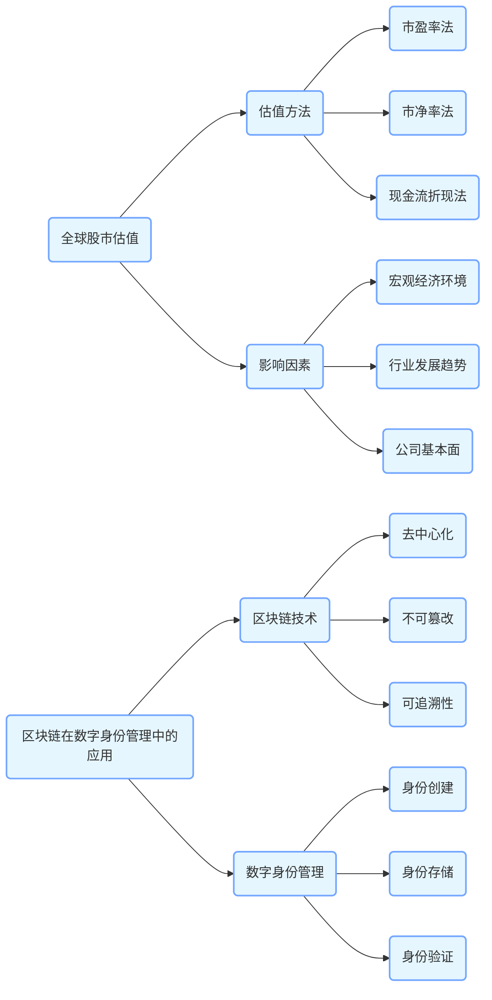

# 全球股市估值与区块链在数字身份管理中的应用

> 关键词：全球股市估值、区块链、数字身份管理、估值模型、身份安全

> 摘要：本文深入探讨了两个不同但又极具影响力的领域，即全球股市估值和区块链在数字身份管理中的应用。在全球股市估值部分，详细分析了常见的估值方法、影响股市估值的因素以及相关数学模型。在区块链在数字身份管理应用部分，阐述了区块链的核心概念、其在数字身份管理中的原理和优势，通过具体代码案例展示了实现方式，并探讨了实际应用场景。最后对两个领域的未来发展趋势与挑战进行了总结，为相关领域的研究和实践提供了全面而深入的参考。

## 1. 背景介绍 
### 1.1 目的和范围
本文旨在全面剖析全球股市估值的方法、原理以及影响因素，同时深入探讨区块链技术在数字身份管理领域的应用。对于全球股市估值，将涵盖常见的估值模型、市场环境对估值的影响等内容。在区块链数字身份管理方面，会详细介绍区块链的核心概念、数字身份管理的架构以及实际应用案例。通过对这两个领域的研究，为投资者、技术开发者和相关研究人员提供有价值的参考和指导。

### 1.2 预期读者
本文的预期读者包括金融领域的投资者、分析师、研究人员，他们可以从全球股市估值的内容中获取投资决策的依据和分析方法。同时，也面向区块链技术开发者、安全专家以及对数字身份管理感兴趣的人士，为他们在区块链技术应用于数字身份管理方面提供技术思路和实践经验。

### 1.3 文档结构概述
本文首先介绍全球股市估值和区块链在数字身份管理应用的背景知识，包括目的、预期读者和文档结构。接着阐述核心概念与联系，展示相关的文本示意图和 Mermaid 流程图。然后详细讲解核心算法原理和具体操作步骤，结合 Python 代码进行说明。之后介绍数学模型和公式，并举例说明。通过项目实战部分展示代码实际案例和详细解释。探讨实际应用场景，推荐相关的工具和资源。最后总结未来发展趋势与挑战，提供常见问题解答和扩展阅读参考资料。

### 1.4 术语表
#### 1.4.1 核心术语定义
- **全球股市估值**：对全球范围内各个股票市场中上市公司股票价值的评估过程，通过一定的方法和模型来确定股票的合理价格。
- **区块链**：一种去中心化的分布式账本技术，通过密码学方法保证数据的不可篡改和可追溯性。
- **数字身份管理**：对个体或实体在数字世界中的身份信息进行创建、存储、验证和管理的过程。

#### 1.4.2 相关概念解释
- **市盈率（P/E）**：股票价格与每股收益的比率，是衡量股票估值的常用指标之一。较高的市盈率可能表示市场对该股票的未来增长预期较高。
- **哈希函数**：区块链中用于将任意长度的数据转换为固定长度哈希值的函数，具有不可逆性和唯一性，保证数据的完整性和安全性。
- **智能合约**：一种基于区块链技术的自动化合约，当满足预设条件时，合约会自动执行，无需第三方干预。

#### 1.4.3 缩略词列表
- **P/E**：市盈率（Price-to-Earnings Ratio）
- **ICO**：首次代币发行（Initial Coin Offering）
- **KYC**：了解你的客户（Know Your Customer）

## 2. 核心概念与联系 

### 全球股市估值核心概念
全球股市估值是金融领域的重要课题，其目的是确定股票的内在价值，为投资者提供投资决策的依据。常见的估值方法包括市盈率法、市净率法、现金流折现法等。这些方法各有优缺点，适用于不同类型的公司和市场环境。

### 区块链在数字身份管理中的核心概念
区块链技术为数字身份管理带来了新的解决方案。传统的数字身份管理存在中心化、易受攻击等问题，而区块链的去中心化、不可篡改和可追溯性特点可以有效解决这些问题。在区块链数字身份管理中，用户的身份信息被加密存储在区块链上，只有用户本人通过私钥才能授权访问和使用这些信息。

### 两者联系
虽然全球股市估值和区块链在数字身份管理看似是两个不同的领域，但它们之间存在一定的联系。一方面，区块链技术的发展可能会影响相关企业的股价，从而影响股市估值。例如，专注于区块链技术研发和应用的公司，如果其在数字身份管理等领域取得突破，可能会吸引投资者的关注，导致股价上涨。另一方面，股市的波动也可能会影响区块链技术的发展和应用。当股市处于牛市时，投资者可能更愿意投资区块链相关项目，促进技术的发展；而在熊市时，投资可能会减少，技术发展速度可能会放缓。

### 文本示意图
```plaintext
全球股市估值
|-- 估值方法
|   |-- 市盈率法
|   |-- 市净率法
|   |-- 现金流折现法
|-- 影响因素
|   |-- 宏观经济环境
|   |-- 行业发展趋势
|   |-- 公司基本面

区块链在数字身份管理中的应用
|-- 区块链技术
|   |-- 去中心化
|   |-- 不可篡改
|   |-- 可追溯性
|-- 数字身份管理
|   |-- 身份创建
|   |-- 身份存储
|   |-- 身份验证
```

### Mermaid 流程图


## 3. 核心算法原理 & 具体操作步骤 

### 全球股市估值核心算法原理

#### 市盈率法
市盈率法是最常用的股市估值方法之一，其原理是通过比较股票的市盈率与行业平均市盈率或历史市盈率来判断股票的估值是否合理。计算公式为：

$P/E = \frac{股价}{每股收益}$

具体操作步骤如下：
1. 收集目标公司的股价和每股收益数据。
2. 计算目标公司的市盈率。
3. 查找行业平均市盈率或历史市盈率作为参考。
4. 如果目标公司的市盈率低于参考值，则可能被低估；如果高于参考值，则可能被高估。

以下是使用 Python 实现市盈率计算的代码示例：
```python
# 定义股价和每股收益
stock_price = 50
earnings_per_share = 5

# 计算市盈率
pe_ratio = stock_price / earnings_per_share

print(f"该股票的市盈率为: {pe_ratio}")
```

#### 现金流折现法
现金流折现法是一种基于公司未来现金流的估值方法，其原理是将公司未来的现金流折现到当前时刻，以确定公司的内在价值。计算公式为：

$V = \sum_{t=1}^{n} \frac{CF_t}{(1 + r)^t}$

其中，$V$ 表示公司的内在价值，$CF_t$ 表示第 $t$ 期的现金流，$r$ 表示折现率，$n$ 表示预测期数。

具体操作步骤如下：
1. 预测公司未来各期的现金流。
2. 确定折现率，通常可以使用资本资产定价模型（CAPM）来计算。
3. 将各期现金流折现到当前时刻并求和。
4. 将公司的内在价值除以总股本，得到每股内在价值。

以下是使用 Python 实现现金流折现法的代码示例：
```python
import numpy as np

# 预测未来各期现金流
cash_flows = [100, 120, 150, 180, 200]
# 折现率
discount_rate = 0.1
# 预测期数
n = len(cash_flows)

# 计算各期现金流的现值
present_values = []
for t in range(n):
    present_value = cash_flows[t] / ((1 + discount_rate) ** (t + 1))
    present_values.append(present_value)

# 计算公司的内在价值
intrinsic_value = sum(present_values)

print(f"该公司的内在价值为: {intrinsic_value}")
```

### 区块链在数字身份管理中的核心算法原理

#### 哈希函数
哈希函数是区块链中保证数据完整性和安全性的重要算法。其原理是将任意长度的数据转换为固定长度的哈希值，具有不可逆性和唯一性。常见的哈希函数包括 SHA-256 等。

以下是使用 Python 实现 SHA-256 哈希计算的代码示例：
```python
import hashlib

# 要计算哈希值的数据
data = "Hello, World!"

# 创建 SHA-256 哈希对象
hash_object = hashlib.sha256(data.encode())

# 获取哈希值
hash_value = hash_object.hexdigest()

print(f"数据的 SHA-256 哈希值为: {hash_value}")
```

#### 数字签名
数字签名是区块链中用于验证身份和保证数据真实性的算法。其原理是使用私钥对数据进行签名，使用公钥对签名进行验证。常见的数字签名算法包括 RSA、ECDSA 等。

以下是使用 Python 实现 ECDSA 数字签名的代码示例：
```python
from ecdsa import SigningKey, NIST256p

# 生成私钥
private_key = SigningKey.generate(curve=NIST256p)
# 获取公钥
public_key = private_key.verifying_key

# 要签名的数据
message = b"Hello, World!"

# 签名
signature = private_key.sign(message)

# 验证签名
is_valid = public_key.verify(signature, message)

print(f"签名是否有效: {is_valid}")
```

## 4. 数学模型和公式 & 详细讲解 & 举例说明 

### 全球股市估值数学模型和公式

#### 市盈率法
如前所述，市盈率法的公式为 $P/E = \frac{股价}{每股收益}$。例如，某公司的股价为 100 元，每股收益为 10 元，则该公司的市盈率为 $100 \div 10 = 10$。如果该行业的平均市盈率为 15，则该公司的股票可能被低估。

#### 市净率法
市净率法的公式为 $P/B = \frac{股价}{每股净资产}$。市净率反映了市场对公司净资产的估值。例如，某公司的股价为 50 元，每股净资产为 20 元，则该公司的市净率为 $50 \div 20 = 2.5$。如果该行业的平均市净率为 3，则该公司的股票可能被低估。

#### 现金流折现法
现金流折现法的公式为 $V = \sum_{t=1}^{n} \frac{CF_t}{(1 + r)^t}$。假设某公司未来 5 年的现金流分别为 100 万元、120 万元、150 万元、180 万元、200 万元，折现率为 10%，则该公司的内在价值为：

\[
\begin{align*}
V &= \frac{100}{(1 + 0.1)^1} + \frac{120}{(1 + 0.1)^2} + \frac{150}{(1 + 0.1)^3} + \frac{180}{(1 + 0.1)^4} + \frac{200}{(1 + 0.1)^5}\\
&= \frac{100}{1.1} + \frac{120}{1.21} + \frac{150}{1.331} + \frac{180}{1.4641} + \frac{200}{1.61051}\\
&\approx 90.91 + 99.17 + 112.69 + 122.94 + 124.18\\
&= 549.89
\end{align*}
\]

### 区块链在数字身份管理中的数学模型和公式

#### 哈希函数
哈希函数的数学原理是将输入数据 $x$ 通过哈希算法 $H$ 映射到一个固定长度的哈希值 $h$，即 $h = H(x)$。哈希函数具有以下性质：
- **确定性**：对于相同的输入 $x$，哈希函数总是返回相同的哈希值 $h$。
- **高效性**：计算哈希值的时间复杂度较低。
- **抗碰撞性**：很难找到两个不同的输入 $x_1$ 和 $x_2$，使得 $H(x_1) = H(x_2)$。

#### 数字签名
数字签名的数学原理基于公钥密码学。假设私钥为 $sk$，公钥为 $pk$，消息为 $m$，签名为 $\sigma$。签名过程可以表示为 $\sigma = Sign(sk, m)$，验证过程可以表示为 $Verify(pk, m, \sigma)$，如果签名有效，则返回 True，否则返回 False。

## 5. 项目实战：代码实际案例和详细解释说明 

### 5.1  开发环境搭建
#### 全球股市估值
对于全球股市估值的项目实战，我们可以使用 Python 进行开发。需要安装以下库：
- `pandas`：用于数据处理和分析。
- `numpy`：用于数值计算。
- `yfinance`：用于获取股票数据。

可以使用以下命令进行安装：
```sh
pip install pandas numpy yfinance
```

#### 区块链在数字身份管理
对于区块链在数字身份管理的项目实战，我们可以使用 Python 和 `web3.py` 库进行开发。需要安装以下库：
- `web3.py`：用于与以太坊区块链进行交互。
- `ecdsa`：用于数字签名和验证。

可以使用以下命令进行安装：
```sh
pip install web3 ecdsa
```

### 5.2  源代码详细实现和代码解读

#### 全球股市估值
以下是一个使用 `yfinance` 库获取股票数据并计算市盈率的代码示例：
```python
import yfinance as yf

# 获取苹果公司的股票数据
ticker = yf.Ticker("AAPL")

# 获取最新股价
stock_price = ticker.history(period="1d")["Close"].iloc[0]

# 获取每股收益
earnings_per_share = ticker.info["trailingEps"]

# 计算市盈率
pe_ratio = stock_price / earnings_per_share

print(f"苹果公司的股价为: {stock_price}")
print(f"苹果公司的每股收益为: {earnings_per_share}")
print(f"苹果公司的市盈率为: {pe_ratio}")
```

代码解读：
1. 使用 `yfinance.Ticker` 函数获取苹果公司的股票数据。
2. 使用 `history` 方法获取最新的股价。
3. 使用 `info` 属性获取每股收益。
4. 计算市盈率并输出结果。

#### 区块链在数字身份管理
以下是一个简单的区块链数字身份管理的代码示例：
```python
from ecdsa import SigningKey, NIST256p
import hashlib

# 生成用户私钥和公钥
private_key = SigningKey.generate(curve=NIST256p)
public_key = private_key.verifying_key

# 用户身份信息
user_info = {
    "name": "John Doe",
    "age": 30,
    "email": "johndoe@example.com"
}

# 将用户身份信息转换为字符串
user_info_str = str(user_info)

# 计算用户身份信息的哈希值
hash_object = hashlib.sha256(user_info_str.encode())
user_info_hash = hash_object.hexdigest()

# 使用私钥对哈希值进行签名
signature = private_key.sign(user_info_hash.encode())

# 验证签名
is_valid = public_key.verify(signature, user_info_hash.encode())

print(f"用户身份信息的哈希值为: {user_info_hash}")
print(f"签名是否有效: {is_valid}")
```

代码解读：
1. 使用 `ecdsa` 库生成用户的私钥和公钥。
2. 定义用户的身份信息。
3. 将用户身份信息转换为字符串，并计算其哈希值。
4. 使用私钥对哈希值进行签名。
5. 使用公钥验证签名的有效性。

### 5.3  代码解读与分析

#### 全球股市估值
在全球股市估值的代码中，我们使用 `yfinance` 库方便地获取了股票数据。通过计算市盈率，我们可以初步判断股票的估值情况。但需要注意的是，市盈率法只是一种简单的估值方法，实际应用中还需要考虑其他因素，如行业发展趋势、公司基本面等。

#### 区块链在数字身份管理
在区块链数字身份管理的代码中，我们使用了哈希函数和数字签名技术来保证用户身份信息的完整性和安全性。哈希函数可以防止身份信息被篡改，数字签名可以验证身份信息的真实性。通过这种方式，用户可以更好地控制自己的身份信息，提高数字身份管理的安全性。

## 6. 实际应用场景 

### 全球股市估值
#### 投资决策
投资者可以使用全球股市估值方法来评估股票的价值，从而做出投资决策。例如，如果某只股票的估值被低估，投资者可能会选择买入；如果被高估，则可能会选择卖出。

#### 市场分析
分析师可以使用股市估值方法来分析整个市场的估值水平，判断市场是否处于高估或低估状态。这有助于投资者把握市场趋势，制定合理的投资策略。

#### 公司并购
在公司并购过程中，需要对目标公司进行估值。股市估值方法可以为并购交易提供参考，帮助确定合理的收购价格。

### 区块链在数字身份管理
#### 金融领域
在金融领域，区块链数字身份管理可以用于客户身份验证（KYC）、反洗钱（AML）等方面。通过区块链技术，可以实现客户身份信息的安全共享和验证，提高金融机构的运营效率和安全性。

#### 物联网
在物联网领域，设备需要进行身份验证和授权才能接入网络。区块链数字身份管理可以为物联网设备提供安全的身份解决方案，防止设备被恶意攻击和篡改。

#### 政务服务
在政务服务领域，区块链数字身份管理可以用于电子政务、社会保障等方面。通过区块链技术，可以实现公民身份信息的安全存储和共享，提高政务服务的效率和透明度。

## 7. 工具和资源推荐
### 7.1 学习资源推荐
#### 7.1.1 书籍推荐
- 《证券分析》（Security Analysis）：由本杰明·格雷厄姆（Benjamin Graham）和戴维·多德（David Dodd）所著，是价值投资的经典著作，详细介绍了股市估值的方法和原理。
- 《区块链：技术驱动金融》（Blockchain: The New Economics of Trust）：由阿尔文德·纳拉亚南（Arvind Narayanan）等人所著，全面介绍了区块链技术的原理、应用和发展趋势。
- 《数字身份：技术、法律与社会》（Digital Identity: Technology, Law, and Society）：深入探讨了数字身份管理的相关技术、法律和社会问题。

#### 7.1.2 在线课程
- Coursera 上的“Financial Markets”课程：由耶鲁大学教授罗伯特·席勒（Robert Shiller）授课，介绍了金融市场的基本原理和投资策略，包括股市估值方法。
- edX 上的“Blockchain and Cryptocurrency Technologies”课程：由普林斯顿大学教授阿尔文德·纳拉亚南（Arvind Narayanan）授课，详细讲解了区块链技术的核心概念和应用。
- Udemy 上的“Digital Identity Management”课程：介绍了数字身份管理的技术和实践，包括区块链在数字身份管理中的应用。

#### 7.1.3 技术博客和网站
- Medium 上的“CoinDesk”：专注于区块链和加密货币领域的新闻和技术分析，提供了丰富的区块链技术和应用案例。
- Seeking Alpha：一个金融分析网站，提供了全球股市的分析和评论，包括股票估值和投资建议。
- Identity Week：关注数字身份管理领域的最新动态和技术发展，提供了相关的研究报告和案例分析。

### 7.2 开发工具框架推荐
#### 7.2.1 IDE和编辑器
- PyCharm：一款专业的 Python 集成开发环境，提供了丰富的代码编辑、调试和部署功能，适合开发全球股市估值和区块链数字身份管理的 Python 项目。
- Visual Studio Code：一款轻量级的代码编辑器，支持多种编程语言和插件，具有强大的代码编辑和调试功能。
- Remix：一款基于网页的以太坊智能合约开发工具，适合开发区块链数字身份管理的智能合约。

#### 7.2.2 调试和性能分析工具
- PDB：Python 自带的调试器，可以帮助开发者调试 Python 代码，查找和解决问题。
- Ganache：一个以太坊开发工具，提供了一个本地的以太坊区块链环境，用于开发、测试和调试智能合约。
- Web3.py 调试工具：可以帮助开发者调试与以太坊区块链交互的 Python 代码，查看交易信息和合约状态。

#### 7.2.3 相关框架和库
- `yfinance`：用于获取全球股市数据的 Python 库，提供了丰富的股票数据接口。
- `web3.py`：用于与以太坊区块链进行交互的 Python 库，支持智能合约的部署和调用。
- `ecdsa`：用于实现数字签名和验证的 Python 库，支持多种数字签名算法。

### 7.3 相关论文著作推荐
#### 7.3.1 经典论文
- “The Arbitrage Pricing Theory of Capital Asset Pricing”（Stephen A. Ross）：提出了套利定价理论（APT），为股市估值提供了一种新的理论框架。
- “Bitcoin: A Peer-to-Peer Electronic Cash System”（Satoshi Nakamoto）：比特币的白皮书，介绍了区块链技术的基本原理和比特币的实现方式。
- “A New Approach to Consumer Theory”（Paul A. Samuelson）：提出了显示偏好理论，对金融市场的分析和估值具有重要意义。

#### 7.3.2 最新研究成果
- “Blockchain for Digital Identity Management: A Systematic Review”：对区块链在数字身份管理中的应用进行了系统的综述，分析了相关的技术和挑战。
- “Stock Market Valuation and Macroeconomic Factors: Evidence from Emerging Markets”：研究了宏观经济因素对新兴市场股市估值的影响。
- “The Future of Digital Identity: Challenges and Opportunities”：探讨了数字身份管理的未来发展趋势和面临的挑战。

#### 7.3.3 应用案例分析
- “Case Study: Blockchain-Based Digital Identity Management in the Financial Sector”：分析了区块链在金融领域数字身份管理的应用案例，介绍了实施过程和取得的成效。
- “Stock Valuation and Investment Decision-Making: A Case Study of a Technology Company”：通过一个科技公司的案例，介绍了股市估值方法在投资决策中的应用。
- “Implementing Blockchain for Digital Identity in the Healthcare Industry”：探讨了区块链在医疗行业数字身份管理中的应用案例，分析了其优势和挑战。

## 8. 总结：未来发展趋势与挑战

### 全球股市估值
#### 未来发展趋势
- **数据驱动的估值方法**：随着大数据和人工智能技术的发展，未来股市估值将更多地依赖于海量数据的分析和挖掘。通过机器学习算法，可以更准确地预测公司的未来业绩和股票价格。
- **跨市场估值**：全球金融市场的一体化程度越来越高，未来股市估值将更加注重跨市场的比较和分析。投资者需要考虑不同市场的宏观经济环境、行业发展趋势等因素，进行更全面的估值。
- **可持续发展因素的纳入**：随着社会对可持续发展的关注度不断提高，未来股市估值将更多地考虑公司的环境、社会和治理（ESG）因素。具有良好 ESG 表现的公司可能会获得更高的估值。

#### 挑战
- **市场不确定性**：全球股市受到宏观经济环境、政治局势、自然灾害等多种因素的影响，市场不确定性增加。这使得股市估值变得更加困难，需要投资者具备更强的风险意识和应对能力。
- **数据质量和可靠性**：数据是股市估值的基础，但数据质量和可靠性可能存在问题。例如，公司财务报表可能存在造假行为，宏观经济数据可能存在统计误差。这需要投资者对数据进行严格的筛选和验证。
- **新兴技术的影响**：新兴技术如区块链、人工智能等的发展可能会对股市估值产生影响。例如，区块链技术可能会改变金融市场的交易模式和信息传递方式，人工智能技术可能会提高股市估值的效率和准确性。投资者需要不断学习和适应这些新兴技术的发展。

### 区块链在数字身份管理
#### 未来发展趋势
- **多链融合**：未来区块链数字身份管理可能会采用多链融合的方式，将不同的区块链平台进行整合，实现身份信息的跨链共享和验证。这将提高数字身份管理的灵活性和扩展性。
- **与物联网的深度融合**：随着物联网的发展，越来越多的设备需要进行身份验证和授权。区块链数字身份管理将与物联网深度融合，为物联网设备提供安全的身份解决方案，促进物联网的发展。
- **法规和标准的完善**：随着区块链数字身份管理的应用越来越广泛，相关的法规和标准将逐渐完善。这将为区块链数字身份管理的发展提供更好的法律保障和规范。

#### 挑战
- **性能和可扩展性**：区块链技术目前还存在性能和可扩展性的问题，这限制了其在大规模数字身份管理中的应用。例如，区块链的交易处理速度较慢，存储容量有限。需要进一步研究和开发新的技术来提高区块链的性能和可扩展性。
- **隐私和安全问题**：虽然区块链技术具有一定的隐私和安全保障机制，但在数字身份管理中，仍然存在隐私和安全问题。例如，用户的身份信息可能会被泄露，数字签名可能会被破解。需要加强隐私保护和安全技术的研究和应用。
- **用户接受度**：区块链数字身份管理是一种新的技术和理念，用户对其接受度可能不高。需要加强宣传和推广，提高用户对区块链数字身份管理的认识和信任。

## 9. 附录：常见问题与解答

### 全球股市估值
#### 问：市盈率法适用于所有类型的公司吗？
答：市盈率法并不适用于所有类型的公司。对于一些新兴行业的公司，由于其未来业绩增长的不确定性较大，市盈率可能无法准确反映其真实价值。此外，对于亏损的公司，市盈率法也无法使用。

#### 问：现金流折现法中的折现率如何确定？
答：折现率的确定通常可以使用资本资产定价模型（CAPM）。CAPM 公式为 $r = R_f + \beta (R_m - R_f)$，其中 $r$ 表示折现率，$R_f$ 表示无风险利率，$\beta$ 表示股票的贝塔系数，$R_m$ 表示市场收益率。

#### 问：股市估值方法是否可以准确预测股票价格？
答：股市估值方法只是一种参考，不能准确预测股票价格。股票价格受到多种因素的影响，包括市场情绪、宏观经济环境、公司基本面等。股市估值方法可以帮助投资者评估股票的价值，但最终的投资决策还需要结合其他因素进行综合考虑。

### 区块链在数字身份管理
#### 问：区块链数字身份管理如何保证用户隐私？
答：区块链数字身份管理通过加密技术和分布式存储来保证用户隐私。用户的身份信息被加密存储在区块链上，只有用户本人通过私钥才能授权访问和使用这些信息。此外，区块链的分布式存储特性使得数据不会集中存储在某个中心化的服务器上，降低了数据泄露的风险。

#### 问：区块链数字身份管理的性能如何？
答：目前区块链数字身份管理的性能还存在一定的问题，主要是由于区块链的交易处理速度较慢和存储容量有限。但随着技术的不断发展，一些新的共识算法和扩容技术正在被研究和应用，有望提高区块链数字身份管理的性能。

#### 问：区块链数字身份管理是否需要用户具备专业的技术知识？
答：一般来说，用户不需要具备专业的技术知识。区块链数字身份管理的应用通常会提供用户友好的界面和操作流程，用户只需要按照提示进行操作即可。但对于一些高级功能和技术细节，可能需要一定的技术知识。

## 10. 扩展阅读 & 参考资料
### 扩展阅读
- 《金融炼金术》（The Alchemy of Finance）：由乔治·索罗斯（George Soros）所著，探讨了金融市场的运行规律和投资者的心理因素。
- 《区块链革命》（The Blockchain Revolution）：由唐·塔普斯科特（Don Tapscott）和亚力克斯·塔普斯科特（Alex Tapscott）所著，介绍了区块链技术对各个行业的影响和变革。
- 《数字经济时代的身份管理》：深入探讨了数字经济时代数字身份管理的重要性和发展趋势。

### 参考资料
- Yahoo Finance：提供全球股市的实时数据和分析。
- Ethereum.org：以太坊官方网站，提供了以太坊区块链的技术文档和开发资源。
- IEEE Xplore：电气和电子工程师协会（IEEE）的数字图书馆，提供了大量关于金融、区块链和数字身份管理的学术论文。
- ACM Digital Library：美国计算机协会（ACM）的数字图书馆，提供了计算机科学领域的研究论文和技术报告。