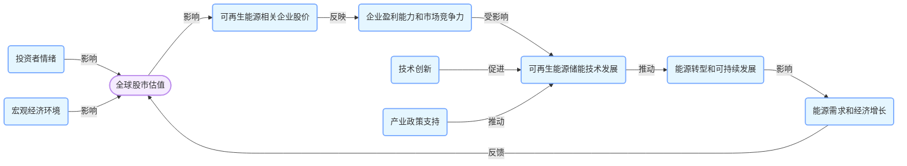

# 全球股市估值与可再生能源储能技术的关系

> 关键词：全球股市估值、可再生能源、储能技术、金融市场、能源转型、相关性分析、投资趋势

> 摘要：本文聚焦于全球股市估值与可再生能源储能技术之间的关系。随着全球对可持续能源的需求不断增长，可再生能源储能技术成为能源领域的关键发展方向。同时，金融市场对这一领域的关注度也日益提升。文章深入探讨了两者的核心概念及联系，分析了相关的算法原理，运用数学模型阐述其内在逻辑，并通过项目实战案例详细解读代码实现。进一步研究了其实际应用场景，推荐了相关的学习资源、开发工具和论文著作。最后对未来发展趋势与挑战进行总结，旨在为投资者、能源从业者及相关研究人员提供全面且深入的参考，以更好地理解和把握金融市场与能源技术之间的互动关系。

## 1. 背景介绍 
### 1.1 目的和范围
本研究旨在深入探究全球股市估值与可再生能源储能技术之间的内在联系。通过对金融市场数据和能源技术发展情况的分析，揭示两者之间的相互影响机制。研究范围涵盖全球主要股票市场以及可再生能源储能技术的各个方面，包括电池技术、抽水蓄能、压缩空气储能等不同储能方式，以及相关企业的股市表现。

### 1.2 预期读者
本文预期读者包括金融市场投资者，他们希望通过了解可再生能源储能技术的发展趋势来优化投资组合；能源行业从业者，如可再生能源企业的管理人员、工程师等，有助于他们从金融市场的角度理解技术发展的市场反馈；学术研究人员，为其相关研究提供理论和实证参考；政策制定者，以便更好地制定促进可再生能源发展和金融市场稳定的政策。

### 1.3 文档结构概述
本文首先介绍相关背景信息，包括目的、读者群体和文档结构。接着阐述核心概念与联系，呈现其原理和架构的文本示意图及流程图。然后详细讲解核心算法原理和具体操作步骤，运用Python源代码进行说明。之后介绍数学模型和公式，并举例说明。通过项目实战展示代码实际案例和详细解释。分析实际应用场景，推荐相关工具和资源。最后总结未来发展趋势与挑战，提供常见问题解答和扩展阅读参考资料。

### 1.4 术语表
#### 1.4.1 核心术语定义
- **全球股市估值**：指对全球范围内股票市场中各类股票价值的评估，通常通过市盈率、市净率等指标来衡量，反映市场对上市公司未来盈利能力和资产价值的预期。
- **可再生能源**：指在自然界中可以不断再生、永续利用的能源，具有取之不尽，用之不竭的特点，主要包括太阳能、风能、水能、生物质能、地热能和海洋能等。
- **储能技术**：是指通过一种介质或者设备，把一种能量形式用同一种或者转换成另一种能量形式存储起来，基于未来应用需要以特定能量形式释放出来的循环过程技术。
- **可再生能源储能技术**：专门针对可再生能源的间歇性和波动性特点，将可再生能源产生的电能进行存储，以便在需要时稳定释放的技术。

#### 1.4.2 相关概念解释
- **能源转型**：指能源体系从传统的化石能源为主向可再生能源为主的转变过程，涉及能源生产、传输、存储和消费等各个环节的变革。
- **金融市场反馈**：指金融市场对经济、政策、技术等因素变化的反应，表现为股票价格、债券收益率等金融指标的波动。

#### 1.4.3 缩略词列表
- **PV**：Photovoltaic，光伏发电
- **BESS**：Battery Energy Storage System，电池储能系统
- **PHES**：Pumped Hydroelectric Energy Storage，抽水蓄能
- **CAES**：Compressed Air Energy Storage，压缩空气储能

## 2. 核心概念与联系 

### 核心概念原理
全球股市估值反映了市场参与者对上市公司未来盈利和增长潜力的预期。在宏观经济环境、政策导向、行业竞争等多种因素的影响下，股市估值会发生波动。可再生能源储能技术作为能源领域的关键创新，其发展对于可再生能源的大规模应用和能源转型至关重要。随着技术的进步和成本的降低，可再生能源储能技术的市场前景日益广阔，这将影响相关企业的盈利能力和市场竞争力，进而反映在股市估值上。

从能源角度来看，可再生能源具有间歇性和波动性的特点，例如太阳能发电依赖于光照条件，风能发电受风力大小的影响。储能技术可以在可再生能源发电过剩时储存能量，在发电不足时释放能量，实现能源的平稳供应。这不仅提高了可再生能源的利用效率，还增强了电力系统的稳定性和可靠性。

从金融角度来看，可再生能源储能技术的发展吸引了大量的投资。投资者对相关企业的前景看好，会增加对这些企业股票的需求，推动股价上涨，从而提高股市估值。同时，股市估值的变化也会影响企业的融资能力，高估值的企业更容易获得资金支持，加速技术研发和产业扩张。

### 架构的文本示意图
```plaintext
全球股市估值 <----> 可再生能源储能技术
    |                        |
    | 金融市场因素          | 技术发展因素
    | （政策、投资者情绪等） | （成本、效率、可靠性等）
    |                        |
    V                        V
经济增长、能源需求变化等  技术创新、产业政策支持等
```

### Mermaid 流程图


## 3. 核心算法原理 & 具体操作步骤 

### 算法原理
为了分析全球股市估值与可再生能源储能技术的关系，我们可以采用时间序列分析和回归分析的方法。时间序列分析可以帮助我们观察和预测股市估值和储能技术相关指标（如技术专利数量、储能项目装机容量等）随时间的变化趋势。回归分析则可以建立两者之间的定量关系模型。

### Python 源代码实现
```python
import pandas as pd
import numpy as np
import matplotlib.pyplot as plt
from statsmodels.tsa.seasonal import seasonal_decompose
from sklearn.linear_model import LinearRegression

# 读取数据
# 假设我们有两个数据集，一个是全球股市估值数据，另一个是可再生能源储能技术相关数据
stock_valuation_data = pd.read_csv('global_stock_valuation.csv')
energy_storage_data = pd.read_csv('renewable_energy_storage.csv')

# 数据预处理
# 确保两个数据集的时间索引一致
stock_valuation_data['date'] = pd.to_datetime(stock_valuation_data['date'])
energy_storage_data['date'] = pd.to_datetime(energy_storage_data['date'])
merged_data = pd.merge(stock_valuation_data, energy_storage_data, on='date')

# 时间序列分析
# 对股市估值数据进行季节性分解
result = seasonal_decompose(merged_data['stock_valuation'], model='additive', period=12)
trend = result.trend
seasonal = result.seasonal
residual = result.resid

# 绘制季节性分解结果
plt.figure(figsize=(12, 8))
plt.subplot(411)
plt.plot(merged_data['date'], merged_data['stock_valuation'], label='Original')
plt.legend(loc='best')
plt.subplot(412)
plt.plot(merged_data['date'], trend, label='Trend')
plt.legend(loc='best')
plt.subplot(413)
plt.plot(merged_data['date'], seasonal, label='Seasonal')
plt.legend(loc='best')
plt.subplot(414)
plt.plot(merged_data['date'], residual, label='Residual')
plt.legend(loc='best')
plt.tight_layout()
plt.show()

# 回归分析
# 准备自变量和因变量
X = merged_data[['energy_storage_capacity']].values
y = merged_data['stock_valuation'].values

# 建立线性回归模型
model = LinearRegression()
model.fit(X, y)

# 输出回归系数和截距
print('回归系数:', model.coef_[0])
print('截距:', model.intercept_)

# 预测
new_capacity = np.array([[1000]])  # 假设新的储能容量为 1000
predicted_valuation = model.predict(new_capacity)
print('预测的股市估值:', predicted_valuation[0])
```

### 具体操作步骤
1. **数据收集**：收集全球股市估值数据和可再生能源储能技术相关数据，如股票价格、市盈率、储能项目装机容量、技术专利数量等。数据来源可以包括金融数据库、能源行业报告、政府统计机构等。
2. **数据预处理**：对收集到的数据进行清洗、整理和合并，确保数据的准确性和一致性。处理缺失值、异常值等问题，并将数据按照时间顺序排列。
3. **时间序列分析**：使用季节性分解方法分析股市估值数据的趋势、季节性和残差成分，了解数据的变化规律。
4. **回归分析**：选择合适的自变量（如储能技术相关指标）和因变量（股市估值），建立线性回归模型。通过模型训练得到回归系数和截距，评估自变量对因变量的影响程度。
5. **预测**：根据建立的回归模型，对未来的股市估值进行预测。可以输入新的储能技术相关指标值，得到对应的股市估值预测结果。

## 4. 数学模型和公式 & 详细讲解 & 举例说明 

### 时间序列分析模型
时间序列分析中常用的季节性分解模型有加法模型和乘法模型。加法模型假设时间序列由趋势成分 $T_t$、季节性成分 $S_t$ 和残差成分 $R_t$ 相加组成，即：
$$
Y_t = T_t + S_t + R_t
$$
其中，$Y_t$ 表示时间序列在 $t$ 时刻的观测值。

乘法模型假设时间序列由趋势成分、季节性成分和残差成分相乘组成，即：
$$
Y_t = T_t \times S_t \times R_t
$$

在上述 Python 代码中，我们使用的是加法模型进行季节性分解。

### 回归分析模型
线性回归模型的一般形式为：
$$
y = \beta_0 + \beta_1 x_1 + \beta_2 x_2 + \cdots + \beta_n x_n + \epsilon
$$
其中，$y$ 是因变量（如股市估值），$x_1, x_2, \cdots, x_n$ 是自变量（如储能技术相关指标），$\beta_0$ 是截距，$\beta_1, \beta_2, \cdots, \beta_n$ 是回归系数，$\epsilon$ 是误差项。

在我们的例子中，只考虑了一个自变量（储能容量），所以回归模型为：
$$
y = \beta_0 + \beta_1 x + \epsilon
$$
其中，$y$ 是股市估值，$x$ 是储能容量。

### 举例说明
假设我们通过回归分析得到回归系数 $\beta_1 = 0.5$，截距 $\beta_0 = 100$。这意味着当储能容量每增加 1 个单位时，股市估值预计会增加 0.5 个单位，而当储能容量为 0 时，股市估值的基础值为 100。

如果新的储能容量为 1000，那么根据回归模型预测的股市估值为：
$$
y = 100 + 0.5 \times 1000 = 600
$$

## 5. 项目实战：代码实际案例和详细解释说明 

### 5.1  开发环境搭建
1. **安装 Python**：建议使用 Python 3.7 及以上版本。可以从 Python 官方网站（https://www.python.org/downloads/）下载并安装。
2. **安装必要的库**：使用以下命令安装所需的库：
```sh
pip install pandas numpy matplotlib statsmodels scikit-learn
```
3. **准备数据文件**：将全球股市估值数据和可再生能源储能技术相关数据保存为 CSV 文件，分别命名为 `global_stock_valuation.csv` 和 `renewable_energy_storage.csv`。确保文件中包含日期列和相应的数据列。

### 5.2  源代码详细实现和代码解读
```python
import pandas as pd
import numpy as np
import matplotlib.pyplot as plt
from statsmodels.tsa.seasonal import seasonal_decompose
from sklearn.linear_model import LinearRegression

# 读取数据
# 使用 pandas 的 read_csv 函数读取 CSV 文件
stock_valuation_data = pd.read_csv('global_stock_valuation.csv')
energy_storage_data = pd.read_csv('renewable_energy_storage.csv')

# 数据预处理
# 将日期列转换为 pandas 的 datetime 类型
stock_valuation_data['date'] = pd.to_datetime(stock_valuation_data['date'])
energy_storage_data['date'] = pd.to_datetime(energy_storage_data['date'])
# 使用 merge 函数将两个数据集按照日期列合并
merged_data = pd.merge(stock_valuation_data, energy_storage_data, on='date')

# 时间序列分析
# 使用 seasonal_decompose 函数对股市估值数据进行季节性分解
result = seasonal_decompose(merged_data['stock_valuation'], model='additive', period=12)
# 获取趋势成分、季节性成分和残差成分
trend = result.trend
seasonal = result.seasonal
residual = result.resid

# 绘制季节性分解结果
plt.figure(figsize=(12, 8))
# 绘制原始数据
plt.subplot(411)
plt.plot(merged_data['date'], merged_data['stock_valuation'], label='Original')
plt.legend(loc='best')
# 绘制趋势成分
plt.subplot(412)
plt.plot(merged_data['date'], trend, label='Trend')
plt.legend(loc='best')
# 绘制季节性成分
plt.subplot(413)
plt.plot(merged_data['date'], seasonal, label='Seasonal')
plt.legend(loc='best')
# 绘制残差成分
plt.subplot(414)
plt.plot(merged_data['date'], residual, label='Residual')
plt.legend(loc='best')
plt.tight_layout()
plt.show()

# 回归分析
# 准备自变量和因变量
# 将储能容量列转换为二维数组
X = merged_data[['energy_storage_capacity']].values
# 将股市估值列转换为一维数组
y = merged_data['stock_valuation'].values

# 建立线性回归模型
model = LinearRegression()
# 使用 fit 方法训练模型
model.fit(X, y)

# 输出回归系数和截距
print('回归系数:', model.coef_[0])
print('截距:', model.intercept_)

# 预测
# 假设新的储能容量为 1000，转换为二维数组
new_capacity = np.array([[1000]])
# 使用 predict 方法进行预测
predicted_valuation = model.predict(new_capacity)
print('预测的股市估值:', predicted_valuation[0])
```

### 5.3  代码解读与分析
1. **数据读取**：使用 `pandas` 的 `read_csv` 函数读取 CSV 文件，将数据加载到 DataFrame 中。
2. **数据预处理**：将日期列转换为 `datetime` 类型，方便后续的时间序列分析。使用 `merge` 函数将两个数据集按照日期列合并，确保数据的时间对应关系。
3. **时间序列分析**：使用 `seasonal_decompose` 函数对股市估值数据进行季节性分解，得到趋势成分、季节性成分和残差成分。通过绘制这些成分的图表，可以直观地观察数据的变化规律。
4. **回归分析**：将储能容量作为自变量，股市估值作为因变量，建立线性回归模型。使用 `fit` 方法训练模型，得到回归系数和截距。
5. **预测**：使用训练好的模型对新的储能容量进行预测，输出预测的股市估值。

## 6. 实际应用场景 
### 投资决策
投资者可以通过分析全球股市估值与可再生能源储能技术的关系，制定投资策略。当储能技术取得重大突破或市场需求增加时，相关企业的股市估值可能会上升，投资者可以提前布局，买入这些企业的股票。例如，随着锂电池技术的不断进步，锂电池储能相关企业的股价在过去几年中呈现出上升趋势，吸引了大量投资者的关注。

### 政策制定
政府部门可以根据两者的关系制定促进可再生能源发展和金融市场稳定的政策。例如，政府可以出台补贴政策，鼓励企业加大对可再生能源储能技术的研发和投资，这将推动技术的发展，提高相关企业的盈利能力，进而提升股市估值。同时，政府也可以加强对金融市场的监管，防止过度投机和泡沫的产生。

### 企业战略规划
可再生能源企业可以通过了解股市估值与储能技术的关系，制定合理的战略规划。企业可以根据市场对储能技术的预期，调整研发方向和生产规模。如果股市估值反映出市场对某种储能技术的看好，企业可以加大对该技术的投入，提高市场竞争力。

### 能源市场预测
能源市场参与者可以利用两者的关系对未来的能源市场进行预测。例如，通过分析股市估值的变化趋势，可以预测可再生能源储能技术的发展速度和市场需求，从而提前做好能源生产、传输和消费的规划。

## 7. 工具和资源推荐
### 7.1 学习资源推荐
#### 7.1.1 书籍推荐
- 《金融市场学》：全面介绍金融市场的基本概念、运行机制和分析方法，有助于读者理解股市估值的原理和影响因素。
- 《可再生能源概论》：系统阐述可再生能源的种类、技术原理和应用前景，为了解可再生能源储能技术提供基础知识。
- 《时间序列分析及其应用》：深入讲解时间序列分析的理论和方法，包括季节性分解、ARIMA 模型等，是学习时间序列分析的经典教材。

#### 7.1.2 在线课程
- Coursera 上的“金融市场分析”课程：由知名大学的教授授课，涵盖金融市场的各个方面，包括股票市场、债券市场等。
- edX 上的“可再生能源技术与政策”课程：介绍可再生能源技术的最新发展和政策环境，帮助学习者了解能源领域的前沿动态。
- 网易云课堂上的“Python 数据分析实战”课程：通过实际案例讲解 Python 在数据分析中的应用，包括数据处理、可视化和建模等。

#### 7.1.3 技术博客和网站
- 金融界网站：提供全球股市的实时行情、分析报告和投资策略，是获取金融市场信息的重要渠道。
- 国际可再生能源署（IRENA）官网：发布可再生能源领域的最新研究成果、政策文件和行业动态，是了解可再生能源发展趋势的权威网站。
- 数据挖掘与分析社区 Kaggle：提供大量的数据分析项目和数据集，学习者可以在上面练习数据分析技能，参与竞赛，与其他数据爱好者交流经验。

### 7.2 开发工具框架推荐
#### 7.2.1 IDE和编辑器
- PyCharm：一款专业的 Python 集成开发环境，具有代码编辑、调试、版本控制等功能，适合开发复杂的 Python 项目。
- Jupyter Notebook：一个交互式的开发环境，支持多种编程语言，方便进行数据分析和可视化。用户可以在浏览器中编写代码、运行代码、查看结果，并添加注释和文档。
- Visual Studio Code：一款轻量级的代码编辑器，支持多种编程语言和插件扩展。它具有丰富的代码提示和调试功能，适合快速开发和调试 Python 代码。

#### 7.2.2 调试和性能分析工具
- PDB：Python 自带的调试器，可以帮助开发者逐行调试代码，查看变量的值和程序的执行流程。
- cProfile：Python 标准库中的性能分析工具，可以统计代码中各个函数的执行时间和调用次数，帮助开发者找出性能瓶颈。
- Py-Spy：一个用于分析 Python 程序性能的工具，它可以实时监测 Python 程序的 CPU 使用率和函数调用情况，生成火焰图，直观地展示程序的性能热点。

#### 7.2.3 相关框架和库
- Pandas：一个强大的数据处理和分析库，提供了高效的数据结构和数据操作方法，如 DataFrame、Series 等，方便进行数据清洗、整理和分析。
- NumPy：一个用于科学计算的基础库，提供了多维数组对象和各种数学函数，是许多数据分析和机器学习库的基础。
- Matplotlib：一个用于数据可视化的库，支持多种图表类型，如折线图、柱状图、散点图等，可以将数据以直观的图表形式展示出来。
- Scikit-learn：一个用于机器学习的库，提供了各种机器学习算法和工具，如线性回归、逻辑回归、决策树等，方便进行模型训练和预测。

### 7.3 相关论文著作推荐
#### 7.3.1 经典论文
- “The Relationship between Stock Market Valuation and Technological Innovation in the Energy Sector”：探讨了股市估值与能源领域技术创新的关系，为本文的研究提供了理论基础。
- “Renewable Energy Storage Technologies: A Review”：对可再生能源储能技术进行了全面的综述，介绍了各种储能技术的原理、优缺点和应用场景。
- “Time Series Analysis of Financial Markets”：详细阐述了时间序列分析在金融市场中的应用，包括股市估值的预测和分析方法。

#### 7.3.2 最新研究成果
- 关注《Nature Energy》《Energy Economics》等顶级能源和经济领域的学术期刊，这些期刊会发表关于可再生能源储能技术和金融市场关系的最新研究成果。
- 参加国际能源和金融领域的学术会议，如国际可再生能源大会（IREC）、全球金融市场论坛等，了解最新的研究动态和前沿观点。

#### 7.3.3 应用案例分析
- 研究特斯拉公司在可再生能源储能领域的发展历程和股市表现，分析其技术创新、市场策略和金融市场反馈之间的关系。
- 分析中国在可再生能源储能项目建设和金融支持方面的实践经验，如抽水蓄能电站的建设和相关企业的融资模式。

## 8. 总结：未来发展趋势与挑战
### 未来发展趋势
1. **技术创新加速**：随着科研投入的增加和技术的不断进步，可再生能源储能技术将迎来更多的创新突破。例如，固态电池、液流电池等新型电池技术有望提高储能效率和安全性，降低成本。这将进一步推动可再生能源的大规模应用，提升相关企业的竞争力，从而对全球股市估值产生积极影响。
2. **市场规模扩大**：全球对可再生能源的需求不断增长，可再生能源储能市场也将随之扩大。越来越多的国家和地区将出台政策支持储能项目的建设，吸引更多的投资进入该领域。这将促进相关企业的发展，推动股市估值上升。
3. **金融市场与能源市场深度融合**：金融市场将更加关注可再生能源储能技术的发展，为企业提供更多的融资渠道和金融工具。同时，能源市场的变化也将更加迅速地反映在股市估值上，两者之间的互动关系将更加紧密。

### 挑战
1. **技术成本问题**：尽管可再生能源储能技术在不断进步，但目前部分技术的成本仍然较高，限制了其大规模应用。降低技术成本是实现可再生能源储能技术商业化和市场推广的关键挑战。
2. **政策不确定性**：不同国家和地区的政策差异较大，政策的不确定性可能影响投资者的信心和企业的发展规划。政策的频繁变化也可能导致市场波动，增加投资风险。
3. **市场竞争激烈**：随着可再生能源储能市场的扩大，越来越多的企业进入该领域，市场竞争将日益激烈。企业需要不断提高技术水平和管理能力，降低成本，以在竞争中脱颖而出。否则，可能面临市场份额下降和盈利能力减弱的风险，从而影响股市估值。
4. **数据质量和分析难度**：分析全球股市估值与可再生能源储能技术的关系需要大量的数据支持，但数据的质量和准确性可能存在问题。同时，由于两者之间的关系复杂，受到多种因素的影响，数据分析的难度较大，需要不断改进分析方法和模型。

## 9. 附录：常见问题与解答
### 1. 如何选择合适的自变量进行回归分析？
选择自变量时，需要考虑其与因变量之间的理论关系和实际相关性。对于全球股市估值与可再生能源储能技术的关系研究，可以选择储能容量、技术专利数量、储能成本等作为自变量。同时，可以通过相关性分析、显著性检验等方法筛选出对因变量影响显著的自变量。

### 2. 时间序列分析中的季节性周期如何确定？
季节性周期的确定需要根据数据的特点和实际情况进行判断。一般可以通过观察数据的图表、计算自相关函数等方法来确定。例如，对于月度数据，季节性周期可能为 12 个月；对于季度数据，季节性周期可能为 4 个季度。

### 3. 线性回归模型的假设条件有哪些？
线性回归模型的假设条件包括：自变量和因变量之间存在线性关系；误差项服从均值为 0、方差为常数的正态分布；误差项之间相互独立；自变量之间不存在多重共线性。在实际应用中，需要对这些假设条件进行检验，以确保模型的有效性。

### 4. 如何评估回归模型的性能？
可以使用多种指标来评估回归模型的性能，如决定系数 $R^2$、均方误差（MSE）、均方根误差（RMSE）等。$R^2$ 表示模型对数据的拟合程度，取值范围为 0 到 1，越接近 1 表示拟合效果越好。MSE 和 RMSE 表示模型预测值与实际值之间的误差，值越小表示模型的预测精度越高。

### 5. 可再生能源储能技术的发展对传统能源企业的股市估值有何影响？
可再生能源储能技术的发展可能对传统能源企业的股市估值产生负面影响。随着可再生能源的大规模应用，传统能源的市场份额可能会逐渐下降，企业的盈利能力和市场竞争力也会受到影响。投资者可能会减少对传统能源企业的投资，导致其股价下跌，股市估值降低。但如果传统能源企业能够积极转型，加大对可再生能源和储能技术的投入，也有可能提升自身的竞争力和股市估值。

## 10. 扩展阅读 & 参考资料
1. 《金融计量学：从基础到高级建模技术》，作者：Terence C. Mills，出版社：清华大学出版社。
2. 《能源互联网：概念、技术与应用》，作者：曾鸣等，出版社：机械工业出版社。
3. 国际能源署（IEA）发布的《世界能源展望》报告。
4. 彭博新能源财经（BNEF）的相关研究报告。
5. 中国国家能源局发布的可再生能源发展相关政策文件和统计数据。
6. 美国证券交易委员会（SEC）的官方网站，获取全球股市相关数据和监管信息。
7. 相关学术数据库，如 Web of Science、IEEE Xplore 等，查阅最新的学术研究论文。