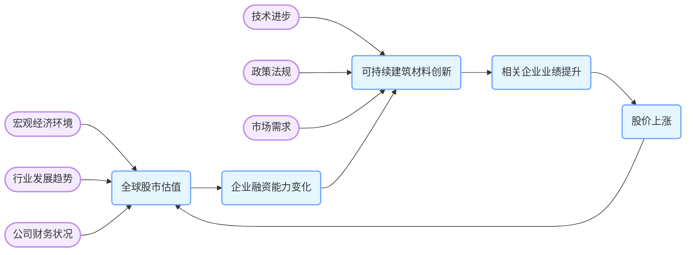

# 全球股市估值与可持续建筑材料创新的关系

> 关键词：全球股市估值、可持续建筑材料、创新、市场机制、经济影响

> 摘要：本文旨在深入探讨全球股市估值与可持续建筑材料创新之间的关系。通过对两者核心概念的阐述、相关算法原理和数学模型的分析，结合项目实战案例，研究它们在实际应用场景中的相互作用。同时，介绍了相关的工具和资源，对未来发展趋势与挑战进行了总结，并提供常见问题解答和参考资料，以全面揭示这一跨领域关系的本质和影响。

## 1. 背景介绍 
### 1.1 目的和范围
本研究的目的在于全面剖析全球股市估值与可持续建筑材料创新之间的内在联系和相互影响机制。范围涵盖全球股市的主要指数和板块，以及可持续建筑材料领域的技术创新、市场发展等各个方面。通过对不同地区、不同行业的数据和案例进行分析，试图找出两者之间的定量和定性关系，为投资者、企业和政策制定者提供有价值的参考。

### 1.2 预期读者
本文的预期读者包括金融投资者、建筑行业从业者、政策制定者、科研人员以及对全球经济和可持续发展感兴趣的各界人士。对于投资者而言，了解两者关系有助于做出更明智的投资决策；建筑行业从业者可以从中获取创新方向和市场趋势的信息；政策制定者可以据此制定相关政策以促进可持续发展；科研人员可以在此基础上开展更深入的研究。

### 1.3 文档结构概述
本文首先介绍背景信息，包括目的、预期读者和文档结构概述等。接着阐述核心概念与联系，通过文本示意图和 Mermaid 流程图展示两者的内在逻辑。然后详细讲解核心算法原理和具体操作步骤，运用 Python 源代码进行说明。再介绍数学模型和公式，并举例说明。之后通过项目实战案例进行详细解释。随后探讨实际应用场景，推荐相关工具和资源。最后总结未来发展趋势与挑战，提供常见问题解答和参考资料。

### 1.4 术语表
#### 1.4.1 核心术语定义
- **全球股市估值**：指对全球范围内各个股票市场的整体价值评估，通常通过股票指数、市盈率、市净率等指标来衡量。
- **可持续建筑材料**：指在其整个生命周期内，能够减少对环境的负面影响，提高资源利用效率，同时满足建筑功能和性能要求的建筑材料。
- **创新**：指在技术、产品、服务、管理等方面引入新的理念、方法或技术，以实现更高的效率、更好的性能或新的市场需求。

#### 1.4.2 相关概念解释
- **股票市场机制**：包括股票的发行、交易、定价等一系列规则和制度，它影响着股市估值的形成和变化。
- **建筑材料生命周期评估**：对建筑材料从原材料开采、生产、运输、使用到废弃处理的整个过程进行环境影响评估的方法。

#### 1.4.3 缩略词列表
- **PE**：市盈率（Price - Earnings Ratio）
- **PB**：市净率（Price - Book Ratio）
- **LCA**：生命周期评估（Life Cycle Assessment）

## 2. 核心概念与联系 

### 核心概念原理
全球股市估值反映了市场对上市公司未来盈利能力和发展前景的预期。它受到宏观经济环境、行业发展趋势、公司财务状况等多种因素的影响。而可持续建筑材料创新则是建筑行业为了应对环境挑战、实现可持续发展而进行的技术和产品创新。创新的可持续建筑材料具有环保、节能、高效等特点，能够满足市场对绿色建筑的需求。

从经济角度来看，可持续建筑材料创新可能会带来新的商业机会和市场增长点，从而影响相关企业的业绩和股价。当市场对可持续建筑材料的需求增加时，从事相关业务的企业有望获得更高的利润，进而推动其股价上涨，影响股市估值。反之，股市估值的变化也会影响企业的融资能力和创新投入。如果股市估值较高，企业可以更容易地通过股权融资获得资金，从而加大对可持续建筑材料创新的投入。

### 架构的文本示意图
全球股市估值与可持续建筑材料创新的关系可以用以下文本示意图表示：

全球股市估值受到宏观经济、行业趋势、公司业绩等因素影响。可持续建筑材料创新受到技术进步、政策法规、市场需求等因素驱动。当可持续建筑材料创新带来新的商业机会时，相关企业业绩提升，推动股价上涨，进而影响股市估值。股市估值的变化又会影响企业的融资能力，从而影响可持续建筑材料创新的投入和发展。

### Mermaid 流程图


## 3. 核心算法原理 & 具体操作步骤 

### 核心算法原理
为了研究全球股市估值与可持续建筑材料创新的关系，我们可以采用回归分析的方法。回归分析是一种统计方法，用于研究自变量和因变量之间的关系。在这个问题中，我们可以将可持续建筑材料创新的相关指标作为自变量，如研发投入、专利数量等，将全球股市估值的相关指标作为因变量，如股票指数、市盈率等。

### Python 源代码详细阐述
```python
import pandas as pd
import numpy as np
import statsmodels.api as sm
from sklearn.model_selection import train_test_split

# 假设我们已经收集到了相关数据，这里简单模拟一些数据
# 可持续建筑材料创新指标（研发投入）
innovation_data = np.random.randint(100, 1000, 100)
# 全球股市估值指标（市盈率）
stock_valuation_data = 0.5 * innovation_data + np.random.normal(0, 50, 100)

# 创建 DataFrame
data = pd.DataFrame({
    'innovation': innovation_data,
    'stock_valuation': stock_valuation_data
})

# 划分训练集和测试集
X = data[['innovation']]
y = data['stock_valuation']
X_train, X_test, y_train, y_test = train_test_split(X, y, test_size=0.2, random_state=42)

# 添加常数项
X_train = sm.add_constant(X_train)

# 拟合线性回归模型
model = sm.OLS(y_train, X_train)
results = model.fit()

# 输出回归结果
print(results.summary())

# 在测试集上进行预测
X_test = sm.add_constant(X_test)
y_pred = results.predict(X_test)

# 计算均方误差
mse = np.mean((y_test - y_pred) ** 2)
print(f"均方误差: {mse}")
```

### 具体操作步骤
1. **数据收集**：收集全球股市估值和可持续建筑材料创新的相关数据，如股票指数、市盈率、研发投入、专利数量等。
2. **数据预处理**：对收集到的数据进行清洗、整理和标准化处理，确保数据的质量和一致性。
3. **变量选择**：选择合适的自变量和因变量，构建回归模型。
4. **模型训练**：使用训练集数据对回归模型进行训练，估计模型参数。
5. **模型评估**：使用测试集数据对训练好的模型进行评估，计算评估指标，如均方误差、决定系数等。
6. **结果分析**：分析回归结果，判断自变量和因变量之间的关系是否显著，以及关系的强度和方向。

## 4. 数学模型和公式 & 详细讲解 & 举例说明 

### 数学模型
我们采用的线性回归模型可以表示为：

$$y = \beta_0 + \beta_1x_1 + \epsilon$$

其中，$y$ 是因变量（全球股市估值指标），$x_1$ 是自变量（可持续建筑材料创新指标），$\beta_0$ 是截距项，$\beta_1$ 是斜率项，$\epsilon$ 是误差项，服从均值为 0、方差为 $\sigma^2$ 的正态分布。

### 详细讲解
- **截距项 $\beta_0$**：表示当自变量 $x_1$ 为 0 时，因变量 $y$ 的取值。在实际应用中，它可能没有实际的物理意义，但在数学模型中是必要的。
- **斜率项 $\beta_1$**：表示自变量 $x_1$ 每变化一个单位，因变量 $y$ 的平均变化量。它反映了自变量和因变量之间的线性关系的强度和方向。如果 $\beta_1 > 0$，表示自变量和因变量之间存在正相关关系；如果 $\beta_1 < 0$，表示自变量和因变量之间存在负相关关系。
- **误差项 $\epsilon$**：表示模型无法解释的随机误差。它包含了所有未被考虑到的因素对因变量的影响。

### 举例说明
假设我们通过回归分析得到的模型为：

$$\text{市盈率} = 50 + 0.2\times\text{研发投入} + \epsilon$$

这意味着当研发投入为 0 时，市盈率的估计值为 50。研发投入每增加 1 个单位，市盈率平均增加 0.2 个单位。误差项 $\epsilon$ 表示实际市盈率与估计市盈率之间的差异。

## 5. 项目实战：代码实际案例和详细解释说明 

### 5.1  开发环境搭建
- **Python 安装**：确保你已经安装了 Python 3.x 版本。可以从 Python 官方网站（https://www.python.org/downloads/） 下载并安装。
- **库安装**：使用以下命令安装所需的库：
```sh
pip install pandas numpy statsmodels scikit-learn
```

### 5.2  源代码详细实现和代码解读
```python
import pandas as pd
import numpy as np
import statsmodels.api as sm
from sklearn.model_selection import train_test_split

# 读取实际数据
data = pd.read_csv('stock_innovation_data.csv')

# 提取自变量和因变量
X = data[['R&D_Investment', 'Patent_Number']]  # 可持续建筑材料创新指标
y = data['PE_Ratio']  # 全球股市估值指标（市盈率）

# 划分训练集和测试集
X_train, X_test, y_train, y_test = train_test_split(X, y, test_size=0.2, random_state=42)

# 添加常数项
X_train = sm.add_constant(X_train)

# 拟合线性回归模型
model = sm.OLS(y_train, X_train)
results = model.fit()

# 输出回归结果
print(results.summary())

# 在测试集上进行预测
X_test = sm.add_constant(X_test)
y_pred = results.predict(X_test)

# 计算均方误差
mse = np.mean((y_test - y_pred) ** 2)
print(f"均方误差: {mse}")
```
### 代码解读
1. **数据读取**：使用 `pandas` 库的 `read_csv` 函数读取存储在 `stock_innovation_data.csv` 文件中的实际数据。
2. **变量提取**：从数据中提取自变量（可持续建筑材料创新指标）和因变量（全球股市估值指标）。
3. **数据划分**：使用 `sklearn` 库的 `train_test_split` 函数将数据划分为训练集和测试集，测试集占总数据的 20%。
4. **模型训练**：使用 `statsmodels` 库的 `OLS` 函数拟合线性回归模型，并使用 `fit` 方法进行训练。
5. **结果输出**：使用 `summary` 方法输出回归结果，包括模型参数估计值、显著性检验结果等。
6. **预测和评估**：在测试集上进行预测，并计算均方误差来评估模型的性能。

### 5.3  代码解读与分析
- **回归结果分析**：通过查看回归结果中的参数估计值和显著性检验结果，可以判断自变量和因变量之间的关系是否显著。如果某个自变量的 $p$ 值小于设定的显著性水平（通常为 0.05），则认为该自变量对因变量有显著影响。
- **均方误差分析**：均方误差衡量了模型预测值与实际值之间的平均误差。均方误差越小，说明模型的预测性能越好。

## 6. 实际应用场景 
### 投资决策
投资者可以根据可持续建筑材料创新的趋势和相关企业的研发投入、专利情况等指标，预测相关企业的未来业绩和股价走势，从而做出更明智的投资决策。例如，如果发现某家企业在可持续建筑材料创新方面投入较大且取得了一定的成果，可能预示着该企业未来的市场竞争力增强，股价有上涨的潜力。

### 企业战略规划
建筑材料企业可以根据全球股市估值的变化和市场对可持续建筑材料的需求趋势，制定企业的战略规划。如果股市估值较高，企业可以加大对可持续建筑材料创新的投入，推出更多符合市场需求的产品，以提高企业的市场份额和盈利能力。

### 政策制定
政府可以通过制定相关政策来促进可持续建筑材料创新，如税收优惠、研发补贴等。同时，政府也可以关注股市估值的变化，了解市场对可持续发展的反应，从而调整政策方向和力度，推动可持续建筑材料行业的发展。

### 行业发展研究
科研人员和行业分析师可以通过研究全球股市估值与可持续建筑材料创新的关系，深入了解建筑行业的发展趋势和市场机制。这有助于发现行业发展中的问题和机遇，为行业的可持续发展提供理论支持和决策建议。

## 7. 工具和资源推荐
### 7.1 学习资源推荐
#### 7.1.1 书籍推荐
- 《金融市场学》：全面介绍金融市场的基本原理、运行机制和投资策略，有助于读者深入了解全球股市估值的相关知识。
- 《可持续建筑材料》：详细阐述可持续建筑材料的概念、技术和应用，为读者提供可持续建筑材料创新的理论基础。
- 《计量经济学》：介绍计量经济学的基本方法和模型，对于研究全球股市估值与可持续建筑材料创新的关系具有重要的指导作用。

#### 7.1.2 在线课程
- Coursera 平台上的“金融市场分析”课程：由知名教授授课，讲解金融市场的分析方法和工具，帮助学习者掌握股市估值的分析技巧。
- edX 平台上的“可持续建筑技术”课程：介绍可持续建筑的设计原则、技术和材料，使学习者了解可持续建筑材料创新的最新进展。
- Udemy 平台上的“Python 数据分析实战”课程：通过实际案例讲解 Python 在数据分析中的应用，有助于学习者掌握数据分析和建模的技能。

#### 7.1.3 技术博客和网站
- Seeking Alpha：提供全球股市的分析和评论，包括公司财报分析、行业趋势研究等内容，对于了解股市估值的动态变化有很大帮助。
- Green Building Council 网站：专注于可持续建筑领域的信息和资源分享，包括可持续建筑材料的认证标准、创新案例等，是了解可持续建筑材料创新的重要渠道。
- Towards Data Science：是一个数据科学领域的技术博客，上面有很多关于数据分析、机器学习和计量经济学的文章，对于学习相关技术和方法有很大的启发。

### 7.2 开发工具框架推荐
#### 7.2.1 IDE和编辑器
- PyCharm：是一款专业的 Python 集成开发环境，具有代码编辑、调试、版本控制等功能，适合进行数据分析和建模的开发工作。
- Jupyter Notebook：是一个交互式的开发环境，支持多种编程语言，尤其适合进行数据探索和可视化分析。
- Visual Studio Code：是一款轻量级的代码编辑器，支持多种编程语言和插件扩展，具有良好的代码编辑体验和开发效率。

#### 7.2.2 调试和性能分析工具
- `pdb`：是 Python 内置的调试工具，可以帮助开发者在代码中设置断点、查看变量值等，方便调试程序。
- `cProfile`：是 Python 的性能分析工具，可以统计程序中各个函数的执行时间和调用次数，帮助开发者找出性能瓶颈。
- `matplotlib` 和 `seaborn`：是 Python 的数据可视化库，可以将数据分析结果以直观的图表形式展示出来，方便开发者进行数据探索和分析。

#### 7.2.3 相关框架和库
- `pandas`：是 Python 的数据处理库，提供了高效的数据结构和数据操作方法，适合进行数据清洗、整理和分析。
- `numpy`：是 Python 的数值计算库，提供了高效的数组操作和数学函数，是数据分析和建模的基础库。
- `statsmodels`：是 Python 的统计建模库，提供了多种统计模型和方法，如线性回归、逻辑回归等，适合进行回归分析和模型评估。
- `scikit-learn`：是 Python 的机器学习库，提供了多种机器学习算法和工具，如分类、回归、聚类等，适合进行数据挖掘和预测分析。

### 7.3 相关论文著作推荐
#### 7.3.1 经典论文
- Fama, E. F., & French, K. R. (1992). The cross - section of expected stock returns. The Journal of Finance, 47(2), 427 - 465. 该论文提出了著名的 Fama - French 三因子模型，对股票收益率的横截面进行了深入研究，为股市估值的研究提供了重要的理论基础。
- Porter, M. E., & Kramer, M. R. (2006). Strategy and society: The link between competitive advantage and corporate social responsibility. Harvard Business Review, 84(12), 78 - 92. 该论文探讨了企业社会责任与竞争优势之间的关系，对于理解可持续建筑材料创新对企业和市场的影响具有重要的启示作用。

#### 7.3.2 最新研究成果
- 近年来，随着可持续发展理念的深入人心，越来越多的研究关注可持续建筑材料创新与金融市场的关系。例如，一些研究通过实证分析发现，可持续建筑材料企业的股价表现与企业的环境绩效和创新能力密切相关。这些研究成果为我们深入了解全球股市估值与可持续建筑材料创新的关系提供了新的视角和方法。

#### 7.3.3 应用案例分析
- 一些国际知名建筑企业在可持续建筑材料创新方面取得了显著的成果，并在股市上获得了良好的表现。例如，某企业通过研发新型环保建筑材料，不仅降低了建筑的能耗和环境影响，还提高了企业的市场竞争力，其股价也随之上涨。这些应用案例可以为其他企业和投资者提供宝贵的经验和借鉴。

## 8. 总结：未来发展趋势与挑战
### 未来发展趋势
- **市场需求增长**：随着全球对可持续发展的关注度不断提高，市场对可持续建筑材料的需求将持续增长。这将推动更多的企业投入到可持续建筑材料创新中，相关企业的业绩和股市估值有望进一步提升。
- **技术创新加速**：科技的不断进步将为可持续建筑材料创新提供更多的技术支持。例如，新材料、新工艺的研发将使可持续建筑材料的性能不断提高，成本不断降低，从而扩大其市场应用范围。
- **政策支持加强**：政府将出台更多的政策来支持可持续建筑材料创新，如税收优惠、补贴、强制性标准等。这些政策将为可持续建筑材料行业的发展创造良好的政策环境，促进相关企业的发展和股市估值的提升。
- **跨领域融合加深**：可持续建筑材料创新将与金融、科技、环保等领域的融合不断加深。例如，金融机构将为可持续建筑材料创新提供更多的融资支持，科技企业将为可持续建筑材料的研发和应用提供技术解决方案，环保组织将推动可持续建筑材料的推广和应用。

### 挑战
- **技术难题**：可持续建筑材料创新面临着一系列技术难题，如新材料的研发、性能测试、生产工艺优化等。解决这些技术难题需要大量的研发投入和专业人才，对企业的技术实力和创新能力提出了很高的要求。
- **成本压力**：目前，可持续建筑材料的生产成本相对较高，这限制了其市场推广和应用。降低可持续建筑材料的成本需要企业不断进行技术创新和生产工艺优化，同时也需要政府的政策支持和市场机制的调节。
- **市场认知不足**：部分消费者和投资者对可持续建筑材料的认知和了解还不够深入，对其性能和优势存在疑虑。提高市场对可持续建筑材料的认知度和接受度需要加强宣传和推广，同时也需要企业提供高质量的产品和服务。
- **政策不确定性**：政府的政策支持是可持续建筑材料行业发展的重要保障，但政策的制定和实施存在一定的不确定性。政策的变化可能会对企业的发展和市场的预期产生影响，增加企业的经营风险。

## 9. 附录：常见问题与解答
### 问题 1：如何衡量可持续建筑材料创新的水平？
答：可以从多个方面衡量可持续建筑材料创新的水平，如研发投入、专利数量、新产品推出速度、产品的环保性能指标等。研发投入反映了企业对创新的重视程度和资源投入；专利数量体现了企业的创新成果和技术实力；新产品推出速度反映了企业的创新效率；产品的环保性能指标则直接衡量了创新产品的可持续性。

### 问题 2：全球股市估值的变化对可持续建筑材料创新有哪些具体影响？
答：全球股市估值的变化会影响企业的融资能力和创新投入。当股市估值较高时，企业可以更容易地通过股权融资获得资金，从而加大对可持续建筑材料创新的投入；反之，当股市估值较低时，企业的融资难度增加，可能会减少创新投入。此外，股市估值的变化还会影响投资者对可持续建筑材料企业的信心和预期，进而影响企业的市场价值和发展前景。

### 问题 3：如何确保回归分析结果的可靠性？
答：为了确保回归分析结果的可靠性，可以采取以下措施：
1. **数据质量控制**：收集高质量的数据，对数据进行清洗、整理和标准化处理，确保数据的准确性和一致性。
2. **变量选择**：选择合适的自变量和因变量，避免遗漏重要变量或引入无关变量。
3. **模型检验**：对回归模型进行各种检验，如显著性检验、异方差检验、自相关检验等，确保模型的合理性和有效性。
4. **样本量**：确保样本量足够大，以提高模型的估计精度和可靠性。
5. **交叉验证**：使用交叉验证的方法对模型进行评估，避免过拟合和欠拟合的问题。

### 问题 4：可持续建筑材料创新对环境有哪些具体的好处？
答：可持续建筑材料创新对环境有很多好处，主要包括以下几个方面：
1. **资源节约**：可持续建筑材料通常采用可再生资源或回收材料，减少了对自然资源的开采和消耗。
2. **能源效率提高**：一些可持续建筑材料具有良好的保温、隔热性能，可以降低建筑的能耗，减少对能源的需求。
3. **减少污染**：可持续建筑材料在生产、使用和废弃处理过程中产生的污染物较少，对环境的污染较小。
4. **生态保护**：可持续建筑材料的使用有助于保护生态环境，减少对生态系统的破坏。

## 10. 扩展阅读 & 参考资料
### 扩展阅读
- 《创新者的窘境》：探讨了创新在企业发展中的重要性和面临的挑战，对于理解可持续建筑材料创新的过程和机制有一定的启示作用。
- 《绿色金融与可持续发展》：介绍了绿色金融的概念、发展现状和政策措施，对于了解金融市场在可持续发展中的作用有很大的帮助。

### 参考资料
- 相关的财经网站和数据库，如 Bloomberg、Wind 等，提供了全球股市的实时数据和历史数据。
- 建筑行业的专业报告和研究机构的研究成果，如建筑行业协会发布的报告、研究机构的市场调研等，提供了可持续建筑材料行业的发展动态和市场趋势。
- 学术期刊和会议论文，如《Journal of Financial Economics》、《Journal of Sustainable Construction》等，发表了关于全球股市估值和可持续建筑材料创新的最新研究成果。